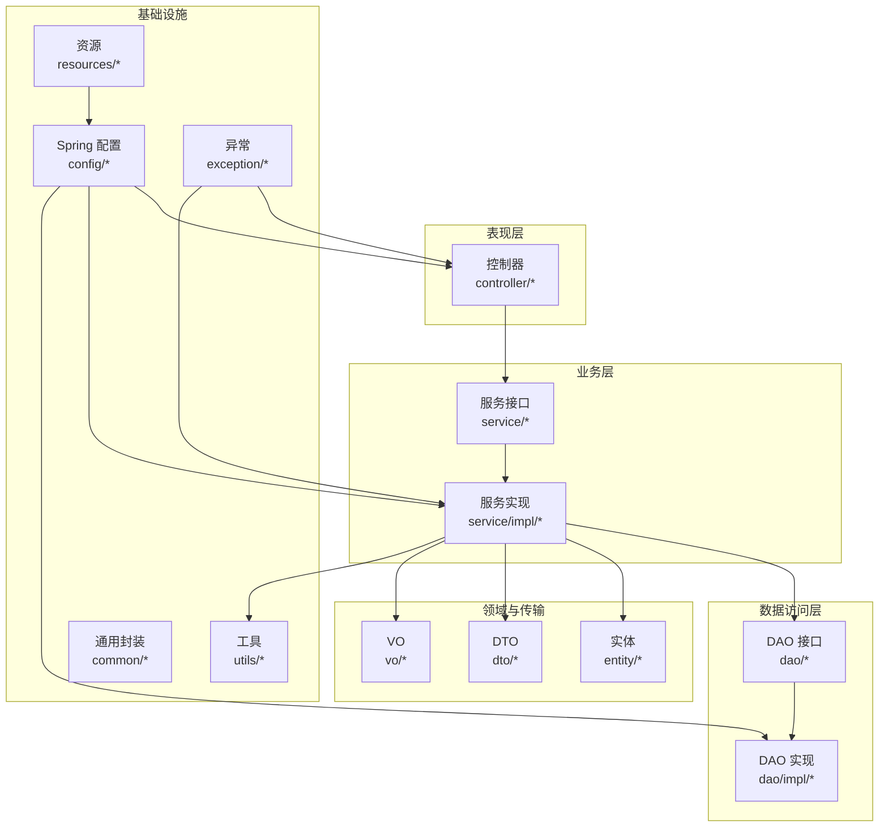
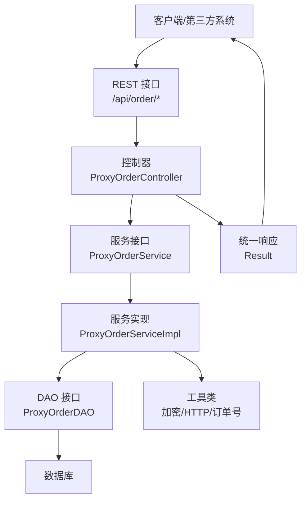
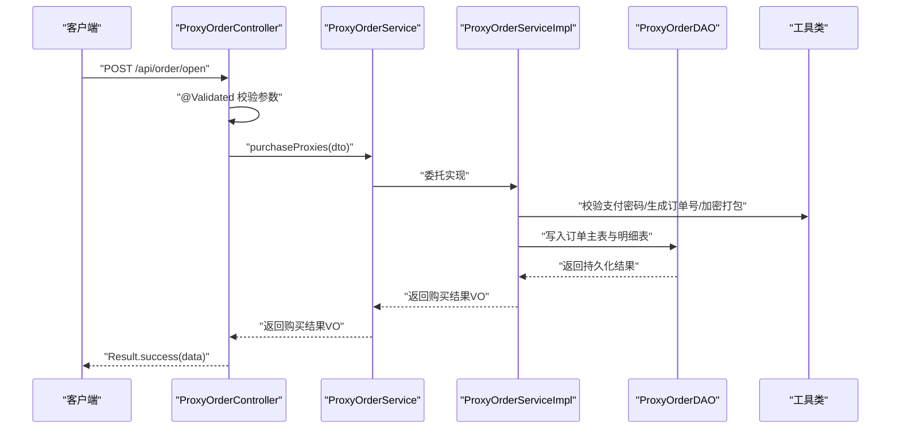
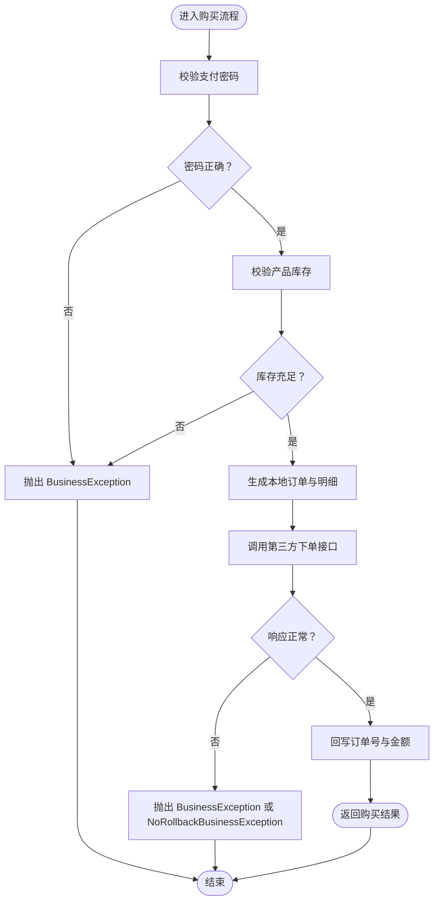
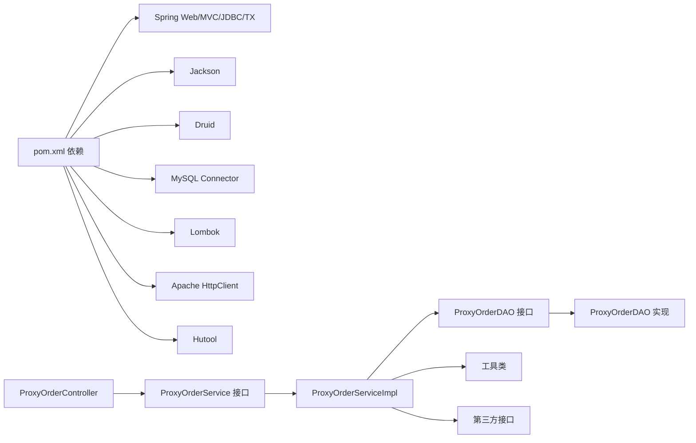

# 代码规范与最佳实践

<cite>
**本文引用的文件**
- [pom.xml](file://pom.xml)
- [web.xml](file://src/main/webapp/WEB-INF/web.xml)
- [applicationContext.xml](file://src/main/resources/applicationContext.xml)
- [WebMvcConfig.java](file://src/main/java/cn/linkfast/config/WebMvcConfig.java)
- [RootController.java](file://src/main/java/cn/linkfast/controller/RootController.java)
- [ProxyOrderController.java](file://src/main/java/cn/linkfast/controller/ProxyOrderController.java)
- [ProxyOrderService.java](file://src/main/java/cn/linkfast/service/ProxyOrderService.java)
- [ProxyOrderServiceImpl.java](file://src/main/java/cn/linkfast/service/impl/ProxyOrderServiceImpl.java)
- [ProxyOrderDAO.java](file://src/main/java/cn/linkfast/dao/ProxyOrderDAO.java)
- [ProxyOrder.java](file://src/main/java/cn/linkfast/entity/ProxyOrder.java)
- [ProxyOrderQueryDTO.java](file://src/main/java/cn/linkfast/dto/ProxyOrderQueryDTO.java)
- [ProxyOrderVO.java](file://src/main/java/cn/linkfast/vo/ProxyOrderVO.java)
- [Result.java](file://src/main/java/cn/linkfast/common/Result.java)
- [BusinessException.java](file://src/main/java/cn/linkfast/exception/BusinessException.java)
- [GlobalExceptionHandler.java](file://src/main/java/cn/linkfast/exception/GlobalExceptionHandler.java)
- [AppOrderNoGenerator.java](file://src/main/java/cn/linkfast/utils/AppOrderNoGenerator.java)
</cite>

## 目录
1. [引言](#引言)
2. [项目结构](#项目结构)
3. [核心组件](#核心组件)
4. [架构总览](#架构总览)
5. [详细组件分析](#详细组件分析)
6. [依赖分析](#依赖分析)
7. [性能考虑](#性能考虑)
8. [故障排查指南](#故障排查指南)
9. [结论](#结论)
10. [附录](#附录)

## 引言
本文件面向 Link-Fast 项目的开发者与维护者，提供一套系统化的 Java 编码规范与最佳实践，覆盖命名约定、注释规范、代码组织结构、MVC 分层规范（Controller/Service/DAO）、设计模式与架构原则应用、代码格式化与 IDE 配置建议、以及代码审查检查清单。文档以实际代码为依据，结合关键文件进行深入剖析，并通过图示帮助读者快速理解模块间的关系与交互流程。

## 项目结构
Link-Fast 采用基于包的分层组织方式，遵循典型的 Spring MVC + Spring IoC + JDBC 的传统 Web 工程布局：
- config：Spring 配置与 Web MVC 配置
- controller：Spring MVC 控制器层
- service：业务服务接口与实现
- dao：数据访问接口与实现
- entity/dto/vo：领域模型、传输对象与视图对象
- exception：异常体系与全局异常处理
- utils：工具类（加密、HTTP、订单号生成等）
- common：通用响应封装
- resources：Spring 上下文、数据库与 API 配置
- webapp/WEB-INF：web.xml 与静态资源

图表来源
- [WebMvcConfig.java:1-62](file://src/main/java/cn/linkfast/config/WebMvcConfig.java#L1-L62)
- [ProxyOrderController.java:1-86](file://src/main/java/cn/linkfast/controller/ProxyOrderController.java#L1-L86)
- [ProxyOrderService.java:1-60](file://src/main/java/cn/linkfast/service/ProxyOrderService.java#L1-L60)
- [ProxyOrderServiceImpl.java:1-820](file://src/main/java/cn/linkfast/service/impl/ProxyOrderServiceImpl.java#L1-L820)
- [ProxyOrderDAO.java:1-102](file://src/main/java/cn/linkfast/dao/ProxyOrderDAO.java#L1-L102)
- [ProxyOrder.java:1-45](file://src/main/java/cn/linkfast/entity/ProxyOrder.java#L1-L45)
- [ProxyOrderQueryDTO.java:1-57](file://src/main/java/cn/linkfast/dto/ProxyOrderQueryDTO.java#L1-L57)
- [ProxyOrderVO.java:1-47](file://src/main/java/cn/linkfast/vo/ProxyOrderVO.java#L1-L47)
- [Result.java:1-59](file://src/main/java/cn/linkfast/common/Result.java#L1-L59)
- [BusinessException.java:1-36](file://src/main/java/cn/linkfast/exception/BusinessException.java#L1-L36)
- [GlobalExceptionHandler.java:1-90](file://src/main/java/cn/linkfast/exception/GlobalExceptionHandler.java#L1-L90)
- [applicationContext.xml:1-67](file://src/main/resources/applicationContext.xml#L1-L67)
- [web.xml:1-73](file://src/main/webapp/WEB-INF/web.xml#L1-L73)

章节来源
- [WebMvcConfig.java:1-62](file://src/main/java/cn/linkfast/config/WebMvcConfig.java#L1-L62)
- [applicationContext.xml:1-67](file://src/main/resources/applicationContext.xml#L1-L67)
- [web.xml:1-73](file://src/main/webapp/WEB-INF/web.xml#L1-L73)

## 核心组件
- 统一响应封装：Result<T> 提供统一的响应结构，包含状态码、消息与数据，简化 Controller 返回值处理。
- 业务异常：BusinessException 支持带业务码的异常，便于前端识别与处理。
- 全局异常处理：GlobalExceptionHandler 将业务异常、参数校验异常、运行时异常统一映射为 Result 结构。
- 订单号生成：AppOrderNoGenerator 基于雪花算法生成带业务前缀的订单号，确保全局唯一性与可读性。
- 分页与查询：ProxyOrderQueryDTO 定义分页参数与过滤条件；Service 层将 DTO 转换为 DAO 查询条件。
- 控制器层：ProxyOrderController 负责参数接收、参数校验与调用 Service，返回 Result 包裹的分页或业务结果。
- 服务层：ProxyOrderServiceImpl 实现复杂业务流程，包含第三方接口调用、加密解密、幂等与重试、事务控制与异常分类处理。
- DAO 层：ProxyOrderDAO 定义订单相关查询与写入接口，DAO 实现负责 SQL 执行与结果映射。

章节来源
- [Result.java:1-59](file://src/main/java/cn/linkfast/common/Result.java#L1-L59)
- [BusinessException.java:1-36](file://src/main/java/cn/linkfast/exception/BusinessException.java#L1-L36)
- [GlobalExceptionHandler.java:1-90](file://src/main/java/cn/linkfast/exception/GlobalExceptionHandler.java#L1-L90)
- [AppOrderNoGenerator.java:1-45](file://src/main/java/cn/linkfast/utils/AppOrderNoGenerator.java#L1-L45)
- [ProxyOrderQueryDTO.java:1-57](file://src/main/java/cn/linkfast/dto/ProxyOrderQueryDTO.java#L1-L57)
- [ProxyOrderController.java:1-86](file://src/main/java/cn/linkfast/controller/ProxyOrderController.java#L1-L86)
- [ProxyOrderService.java:1-60](file://src/main/java/cn/linkfast/service/ProxyOrderService.java#L1-L60)
- [ProxyOrderServiceImpl.java:1-820](file://src/main/java/cn/linkfast/service/impl/ProxyOrderServiceImpl.java#L1-L820)
- [ProxyOrderDAO.java:1-102](file://src/main/java/cn/linkfast/dao/ProxyOrderDAO.java#L1-L102)

## 架构总览
Link-Fast 采用经典的三层架构（表现层/业务层/数据访问层），配合 Spring 的依赖注入与声明式事务，实现清晰的职责分离与可测试性。

图表来源
- [ProxyOrderController.java:1-86](file://src/main/java/cn/linkfast/controller/ProxyOrderController.java#L1-L86)
- [ProxyOrderService.java:1-60](file://src/main/java/cn/linkfast/service/ProxyOrderService.java#L1-L60)
- [ProxyOrderServiceImpl.java:1-820](file://src/main/java/cn/linkfast/service/impl/ProxyOrderServiceImpl.java#L1-L820)
- [ProxyOrderDAO.java:1-102](file://src/main/java/cn/linkfast/dao/ProxyOrderDAO.java#L1-L102)
- [Result.java:1-59](file://src/main/java/cn/linkfast/common/Result.java#L1-L59)

## 详细组件分析

### 组件一：控制器层（Controller）
- 职责边界
  - 接收 HTTP 请求，绑定与校验参数（@Valid/@Validated）
  - 调用 Service 执行业务逻辑
  - 将结果封装为 Result<T> 返回
- 参数处理规范
  - 分页参数使用 ProxyOrderQueryDTO，包含 pageNum/pageSize/status/orderNo/orderType 等字段，必要字段使用 @NotNull/@Min/@Max 等约束
  - 购买/续费/释放接口使用对应的 DTO（ProxyPurchaseDTO/ProxyRenewDTO/ProxyReleaseDTO），并在 Controller 层进行参数校验
- 错误处理
  - 对业务异常进行捕获并返回 Result.error；对未捕获异常统一交由全局异常处理器处理
- 示例路径
  - [ProxyOrderController.java:36-83](file://src/main/java/cn/linkfast/controller/ProxyOrderController.java#L36-L83)

图表来源
- [ProxyOrderController.java:44-47](file://src/main/java/cn/linkfast/controller/ProxyOrderController.java#L44-L47)
- [ProxyOrderService.java:28-31](file://src/main/java/cn/linkfast/service/ProxyOrderService.java#L28-L31)
- [ProxyOrderServiceImpl.java:198-458](file://src/main/java/cn/linkfast/service/impl/ProxyOrderServiceImpl.java#L198-L458)
- [ProxyOrderDAO.java:48-72](file://src/main/java/cn/linkfast/dao/ProxyOrderDAO.java#L48-L72)

章节来源
- [ProxyOrderController.java:1-86](file://src/main/java/cn/linkfast/controller/ProxyOrderController.java#L1-L86)
- [ProxyOrderQueryDTO.java:1-57](file://src/main/java/cn/linkfast/dto/ProxyOrderQueryDTO.java#L1-L57)

### 组件二：服务层（Service）
- 职责边界
  - 组织业务流程，协调 DAO、工具类与第三方接口
  - 使用 @Transactional 管理事务，区分可回滚与不可回滚场景
  - 对第三方接口调用进行幂等、重试与结果解析
- 业务流程要点
  - 购买代理：校验支付密码、校验库存、生成本地订单、调用第三方下单、回写订单号与金额
  - 续费代理：校验支付密码、生成续费订单、调用第三方续费接口、回写结果
  - 释放代理：校验支付密码、生成释放订单、调用第三方释放接口、回写结果
- 异常处理
  - 使用 BusinessException 抛出可回滚的业务异常
  - 使用 NoRollbackBusinessException 标识“对方已落库”场景，避免重复回滚
- 示例路径
  - [ProxyOrderServiceImpl.java:196-458](file://src/main/java/cn/linkfast/service/impl/ProxyOrderServiceImpl.java#L196-L458)
  - [ProxyOrderServiceImpl.java:469-673](file://src/main/java/cn/linkfast/service/impl/ProxyOrderServiceImpl.java#L469-L673)
  - [ProxyOrderServiceImpl.java:675-800](file://src/main/java/cn/linkfast/service/impl/ProxyOrderServiceImpl.java#L675-L800)

图表来源
- [ProxyOrderServiceImpl.java:196-458](file://src/main/java/cn/linkfast/service/impl/ProxyOrderServiceImpl.java#L196-L458)

章节来源
- [ProxyOrderService.java:1-60](file://src/main/java/cn/linkfast/service/ProxyOrderService.java#L1-L60)
- [ProxyOrderServiceImpl.java:1-820](file://src/main/java/cn/linkfast/service/impl/ProxyOrderServiceImpl.java#L1-L820)

### 组件三：DAO 层（DAO 接口与实现）
- 职责边界
  - 定义订单相关查询与写入接口，屏蔽 SQL 细节
  - 实现类负责执行 SQL、处理结果集与异常
- 设计要点
  - 接口方法语义明确，参数与返回值清晰
  - 与 Service 层的实体/DTO/VO 严格区分，避免混用
- 示例路径
  - [ProxyOrderDAO.java:1-102](file://src/main/java/cn/linkfast/dao/ProxyOrderDAO.java#L1-L102)

章节来源
- [ProxyOrderDAO.java:1-102](file://src/main/java/cn/linkfast/dao/ProxyOrderDAO.java#L1-L102)

### 组件四：实体/DTO/VO 与统一响应
- 实体（Entity）
  - ProxyOrder：订单主表与关联明细集合
- 传输对象（DTO）
  - ProxyOrderQueryDTO：分页与过滤条件
- 视图对象（VO）
  - ProxyOrderVO：前端展示所需字段
- 统一响应（Result）
  - Result<T>：统一状态码、消息与数据结构
- 示例路径
  - [ProxyOrder.java:1-45](file://src/main/java/cn/linkfast/entity/ProxyOrder.java#L1-L45)
  - [ProxyOrderQueryDTO.java:1-57](file://src/main/java/cn/linkfast/dto/ProxyOrderQueryDTO.java#L1-L57)
  - [ProxyOrderVO.java:1-47](file://src/main/java/cn/linkfast/vo/ProxyOrderVO.java#L1-L47)
  - [Result.java:1-59](file://src/main/java/cn/linkfast/common/Result.java#L1-L59)

章节来源
- [ProxyOrder.java:1-45](file://src/main/java/cn/linkfast/entity/ProxyOrder.java#L1-L45)
- [ProxyOrderQueryDTO.java:1-57](file://src/main/java/cn/linkfast/dto/ProxyOrderQueryDTO.java#L1-L57)
- [ProxyOrderVO.java:1-47](file://src/main/java/cn/linkfast/vo/ProxyOrderVO.java#L1-L47)
- [Result.java:1-59](file://src/main/java/cn/linkfast/common/Result.java#L1-L59)

### 组件五：异常与全局处理
- 异常体系
  - BusinessException：带业务码的业务异常
  - NoRollbackBusinessException：标识“对方已落库”的不可回滚异常
- 全局异常处理
  - GlobalExceptionHandler：将业务异常、参数异常、空指针与未知异常统一映射为 Result
- 示例路径
  - [BusinessException.java:1-36](file://src/main/java/cn/linkfast/exception/BusinessException.java#L1-L36)
  - [GlobalExceptionHandler.java:1-90](file://src/main/java/cn/linkfast/exception/GlobalExceptionHandler.java#L1-L90)

章节来源
- [BusinessException.java:1-36](file://src/main/java/cn/linkfast/exception/BusinessException.java#L1-L36)
- [GlobalExceptionHandler.java:1-90](file://src/main/java/cn/linkfast/exception/GlobalExceptionHandler.java#L1-L90)

### 组件六：工具类与配置
- 工具类
  - AppOrderNoGenerator：基于雪花算法生成带业务前缀的订单号
- Spring 配置
  - WebMvcConfig：消息转换器、跨域、默认 Servlet 处理
  - applicationContext.xml：数据源、JdbcTemplate、事务管理器与注解驱动
  - web.xml：DispatcherServlet、编码过滤器、会话配置
- 示例路径
  - [AppOrderNoGenerator.java:1-45](file://src/main/java/cn/linkfast/utils/AppOrderNoGenerator.java#L1-L45)
  - [WebMvcConfig.java:1-62](file://src/main/java/cn/linkfast/config/WebMvcConfig.java#L1-L62)
  - [applicationContext.xml:1-67](file://src/main/resources/applicationContext.xml#L1-L67)
  - [web.xml:1-73](file://src/main/webapp/WEB-INF/web.xml#L1-L73)

章节来源
- [AppOrderNoGenerator.java:1-45](file://src/main/java/cn/linkfast/utils/AppOrderNoGenerator.java#L1-L45)
- [WebMvcConfig.java:1-62](file://src/main/java/cn/linkfast/config/WebMvcConfig.java#L1-L62)
- [applicationContext.xml:1-67](file://src/main/resources/applicationContext.xml#L1-L67)
- [web.xml:1-73](file://src/main/webapp/WEB-INF/web.xml#L1-L73)

## 依赖分析
- 模块耦合
  - Controller 仅依赖 Service 接口，降低对实现细节的耦合
  - Service 依赖 DAO 接口、工具类与第三方能力，实现业务编排
  - DAO 接口与实现与具体 SQL 解耦，便于替换与测试
- 外部依赖
  - Spring Web/MVC、JDBC、Jackson、Druid、MySQL、Lombok、Apache HttpClient、Hutool 等
- 事务与异常
  - 通过 @Transactional 管理事务边界，结合 NoRollbackBusinessException 区分可回滚与不可回滚场景
- 示例路径
  - [pom.xml:1-278](file://pom.xml#L1-L278)

图表来源
- [pom.xml:22-212](file://pom.xml#L22-L212)
- [ProxyOrderController.java:1-86](file://src/main/java/cn/linkfast/controller/ProxyOrderController.java#L1-L86)
- [ProxyOrderService.java:1-60](file://src/main/java/cn/linkfast/service/ProxyOrderService.java#L1-L60)
- [ProxyOrderServiceImpl.java:1-820](file://src/main/java/cn/linkfast/service/impl/ProxyOrderServiceImpl.java#L1-L820)
- [ProxyOrderDAO.java:1-102](file://src/main/java/cn/linkfast/dao/ProxyOrderDAO.java#L1-L102)

章节来源
- [pom.xml:1-278](file://pom.xml#L1-L278)

## 性能考虑
- 事务粒度
  - 将长事务拆分为短事务，减少锁竞争与回滚成本
  - 对“对方已落库”场景使用 noRollbackFor，避免不必要的回滚
- 网络调用
  - 对第三方接口调用进行幂等与重试，区分连接失败与响应失败两类异常
  - 合理设置超时与重试间隔，避免雪崩效应
- 数据访问
  - 使用批处理插入与流式处理，减少内存占用
  - 在 Service 层进行必要的数据补全与映射，避免 N+1 查询
- 序列化与日志
  - 控制日志级别，避免在高并发场景输出大量 JSON 字符串
  - 使用 Jackson 的日期格式化与字段忽略策略，减少序列化开销

## 故障排查指南
- 常见问题定位
  - 参数校验失败：查看 GlobalExceptionHandler 对 MethodArgumentNotValidException/BindException 的处理
  - 业务异常：查看 BusinessException 抛出处与错误码
  - 第三方接口异常：关注 ProxyOrderServiceImpl 中的重试与不可回滚场景
- 日志与监控
  - 在关键流程（购买/续费/释放）记录请求参数与响应摘要
  - 对连接失败、响应为空、JSON 解析失败、解密失败等场景进行告警
- 事务回滚
  - 确认 @Transactional 的 rollbackFor/noRollbackFor 配置是否符合预期
  - 对“对方已落库”场景，避免二次回滚造成数据不一致

章节来源
- [GlobalExceptionHandler.java:66-88](file://src/main/java/cn/linkfast/exception/GlobalExceptionHandler.java#L66-L88)
- [ProxyOrderServiceImpl.java:343-451](file://src/main/java/cn/linkfast/service/impl/ProxyOrderServiceImpl.java#L343-L451)
- [ProxyOrderServiceImpl.java:552-672](file://src/main/java/cn/linkfast/service/impl/ProxyOrderServiceImpl.java#L552-L672)
- [ProxyOrderServiceImpl.java:717-800](file://src/main/java/cn/linkfast/service/impl/ProxyOrderServiceImpl.java#L717-L800)

## 结论
本规范以 Link-Fast 实际代码为基础，总结了从命名约定、注释规范、MVC 分层到异常与事务处理的最佳实践。通过统一响应、参数校验、事务隔离与异常分类处理，项目在可维护性、可测试性与稳定性方面具备良好基础。建议在后续迭代中持续完善单元测试与集成测试覆盖，并引入静态代码分析工具以进一步提升质量。

## 附录

### A. Java 编码规范与命名约定
- 包名
  - 全部小写，采用反向域名风格，如 cn.linkfast.controller
- 类名
  - 驼峰命名，名词或复合词，如 ProxyOrderServiceImpl
- 方法名
  - 驼峰命名，动词或动宾短语，如 purchaseProxies/renewProxies/releaseProxies
- 变量名
  - 驼峰命名，简洁明了，避免缩写，如 appOrderNo/orderId
- 常量
  - 全大写，单词以下划线分隔，如 PREFIX_BUY
- 注释
  - 类/方法使用标准 JavaDoc 注释，简述用途、参数、返回值与异常
  - 关键流程与边界条件添加行内注释说明

### B. MVC 分层规范
- Controller 层
  - 仅做参数绑定与校验、调用 Service、封装 Result
  - 不直接操作数据库或第三方接口
- Service 层
  - 组织业务流程，协调 DAO 与工具类
  - 使用 @Transactional 管理事务，区分可回滚与不可回滚
- DAO 层
  - 仅负责 SQL 执行与结果映射，方法语义明确

### C. 代码格式化与 IDE 配置建议
- 编码与版本
  - 源码与目标版本：Java 17
  - 文件编码：UTF-8
- Lombok
  - 使用 @Data/@RequiredArgsConstructor/@Slf4j 等简化样板代码
- Jackson
  - 在 WebMvcConfig 中统一配置 ObjectMapper，设置日期格式与字段忽略策略
- Maven
  - 使用 maven-compiler-plugin、maven-resources-plugin、maven-war-plugin 等插件
  - 集成测试使用 failsafe 插件，按需跳过

章节来源
- [pom.xml:12-20](file://pom.xml#L12-L20)
- [WebMvcConfig.java:24-39](file://src/main/java/cn/linkfast/config/WebMvcConfig.java#L24-L39)
- [applicationContext.xml:223-276](file://src/main/resources/applicationContext.xml#L223-L276)

### D. 代码审查检查清单
- 命名与注释
  - 包/类/方法/变量命名是否规范且语义明确
  - 是否提供必要的 JavaDoc 与行内注释
- 分层与职责
  - Controller 是否仅做参数与结果处理
  - Service 是否包含业务编排与事务控制
  - DAO 是否仅处理数据访问
- 参数校验与异常
  - DTO 是否使用校验注解
  - 是否区分可回滚与不可回滚异常
- 事务与一致性
  - @Transactional 配置是否合理
  - “对方已落库”场景是否避免重复回滚
- 第三方集成
  - 是否实现幂等与重试
  - 是否对响应进行严格校验与解密
- 性能与可维护性
  - 是否避免 N+1 查询
  - 是否控制日志输出与序列化开销
  - 是否提供统一响应与异常处理

### E. 设计模式与架构原则应用
- 分层架构
  - 明确三层职责，接口隔离，依赖倒置
- 依赖注入
  - 使用 Spring 管理 Bean 生命周期与依赖关系
- 统一异常处理
  - 全局异常处理器集中处理各类异常，保证响应一致性
- 幂等与重试
  - 对外部调用进行幂等设计与可控重试，区分可回滚与不可回滚场景
- 单一职责与开闭原则
  - DAO/Service/Controller 各自专注单一职责，扩展新功能尽量不修改既有实现