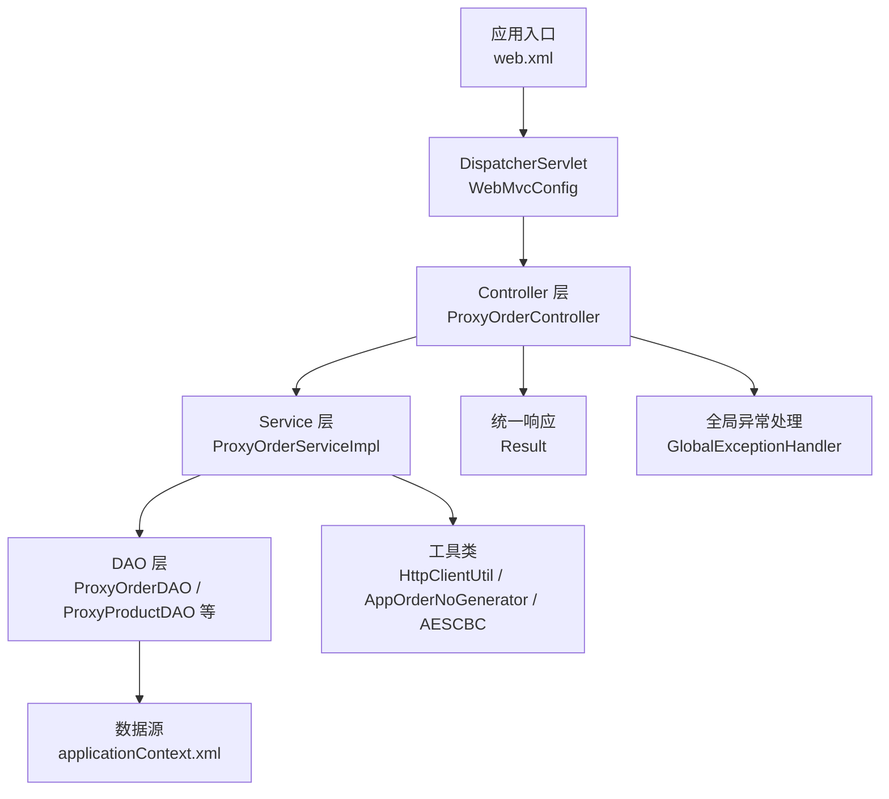
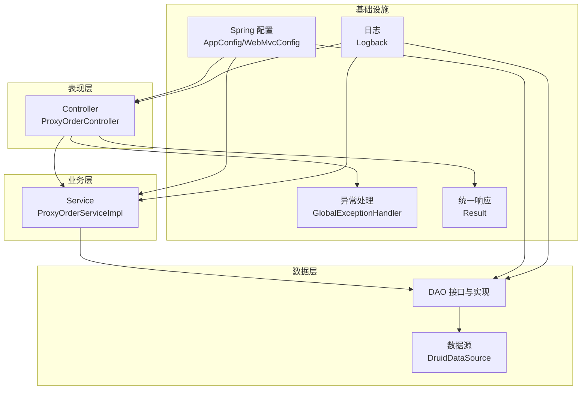
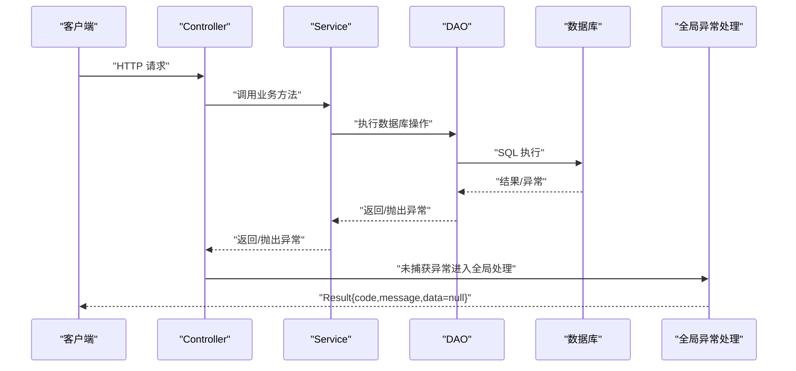
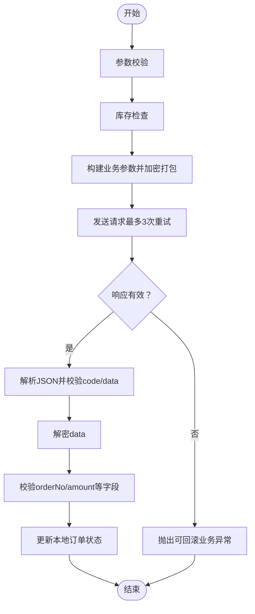
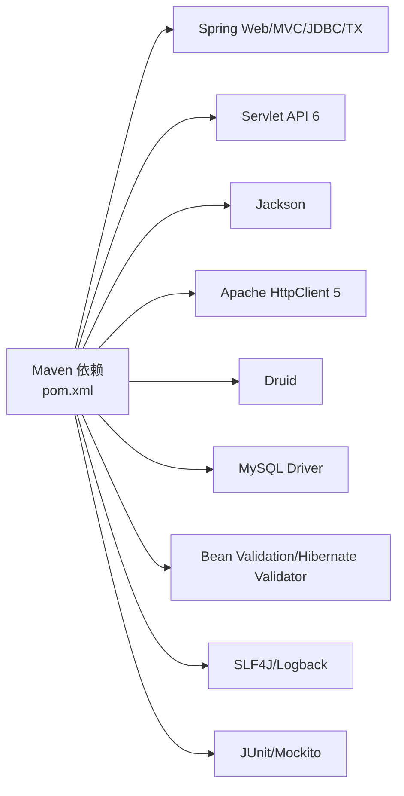

# 开发指南

<cite>
**本文引用的文件**
- [pom.xml](file://pom.xml)
- [README.md](file://README.md)
- [applicationContext.xml](file://src/main/resources/applicationContext.xml)
- [logback.xml](file://src/main/resources/logback.xml)
- [web.xml](file://src/main/webapp/WEB-INF/web.xml)
- [AppConfig.java](file://src/main/java/cn/linkfast/config/AppConfig.java)
- [WebMvcConfig.java](file://src/main/java/cn/linkfast/config/WebMvcConfig.java)
- [Result.java](file://src/main/java/cn/linkfast/common/Result.java)
- [GlobalExceptionHandler.java](file://src/main/java/cn/linkfast/exception/GlobalExceptionHandler.java)
- [BusinessException.java](file://src/main/java/cn/linkfast/exception/BusinessException.java)
- [ProxyOrderServiceImpl.java](file://src/main/java/cn/linkfast/service/impl/ProxyOrderServiceImpl.java)
- [ProxyOrderController.java](file://src/main/java/cn/linkfast/controller/ProxyOrderController.java)
- [HttpClientUtil.java](file://src/main/java/cn/linkfast/utils/HttpClientUtil.java)
- [AppOrderNoGenerator.java](file://src/main/java/cn/linkfast/utils/AppOrderNoGenerator.java)
- [AESCBC.java](file://src/main/java/cn/linkfast/utils/AESCBC.java)
- [PayControllerTest.java](file://src/test/java/cn/linkfast/controller/PayControllerTest.java)
- [ProxyOrderControllerTest.java](file://src/test/java/cn/linkfast/controller/ProxyOrderControllerTest.java)
- [ProxyProductControllerTest.java](file://src/test/java/cn/linkfast/controller/ProxyProductControllerTest.java)
- [ProxyProductDAOTest.java](file://src/test/java/cn/linkfast/dao/ProxyProductDAOTest.java)
- [UserServiceTest.java](file://src/test/java/cn/linkfast/service/UserServiceTest.java)
- [ProxyOrderServiceImplTest.java](file://src/test/java/cn/linkfast/service/Impl/ProxyOrderServiceImplTest.java)
- [ProxyOrderIT.java](file://src/test/java/cn/linkfast/service/Impl/ProxyOrderIT.java)
- [ProxyRegionIT.java](file://src/test/java/cn/linkfast/service/Impl/ProxyRegionIT.java)
- [logback-test.xml](file://src/test/resources/logback-test.xml)
- [test.properties](file://src/test/resources/test.properties)
- [test-api.http](file://test-api.http)
</cite>

## 目录
1. [简介](#简介)
2. [项目结构](#项目结构)
3. [核心组件](#核心组件)
4. [架构总览](#架构总览)
5. [详细组件分析](#详细组件分析)
6. [依赖分析](#依赖分析)
7. [性能考虑](#性能考虑)
8. [故障排查指南](#故障排查指南)
9. [结论](#结论)
10. [附录](#附录)

## 简介
本指南面向 Link-Fast 项目的开发者，提供从代码规范、异常处理、开发与调试、测试与质量保障到版本与发布策略的完整开发手册。项目采用 Spring 6 + Spring MVC + Servlet 6 技术栈，使用 Maven 构建，基于 XML 配置的数据源与事务管理，结合统一响应包装与全局异常处理，形成清晰的分层架构与可维护的代码组织。

## 项目结构
项目采用标准 Maven WAR 结构，核心目录与职责如下：
- src/main/java：Java 源码，按领域分层组织（config、controller、service、dao、entity、dto、vo、utils、exception、task）
- src/main/resources：Spring XML 配置、日志配置、数据库连接与 API 配置
- src/main/webapp/WEB-INF：Servlet 容器配置（web.xml）
- src/test：单元测试、集成测试与测试资源

图表来源
- [web.xml:23-40](file://src/main/webapp/WEB-INF/web.xml#L23-L40)
- [WebMvcConfig.java:19-62](file://src/main/java/cn/linkfast/config/WebMvcConfig.java#L19-L62)
- [ProxyOrderController.java:23-86](file://src/main/java/cn/linkfast/controller/ProxyOrderController.java#L23-L86)
- [ProxyOrderServiceImpl.java:34-820](file://src/main/java/cn/linkfast/service/impl/ProxyOrderServiceImpl.java#L34-L820)
- [applicationContext.xml:14-67](file://src/main/resources/applicationContext.xml#L14-L67)
- [Result.java:10-59](file://src/main/java/cn/linkfast/common/Result.java#L10-L59)
- [GlobalExceptionHandler.java:20-90](file://src/main/java/cn/linkfast/exception/GlobalExceptionHandler.java#L20-L90)

章节来源
- [pom.xml:1-278](file://pom.xml#L1-L278)
- [web.xml:1-73](file://src/main/webapp/WEB-INF/web.xml#L1-L73)
- [AppConfig.java:14-36](file://src/main/java/cn/linkfast/config/AppConfig.java#L14-L36)
- [WebMvcConfig.java:19-62](file://src/main/java/cn/linkfast/config/WebMvcConfig.java#L19-L62)

## 核心组件
- 统一响应包装：Result<T> 提供 success/error/isSuccess 等统一返回结构，便于前端解析与一致性处理。
- 全局异常处理：GlobalExceptionHandler 统一拦截业务异常、参数异常、空指针与通用异常，结合 HttpServletRequest 输出请求上下文，返回 Result 错误响应。
- 业务异常模型：BusinessException 支持自定义错误码与消息，配合 NoRollbackBusinessException 实现“已落库不可回滚”的幂等处理。
- 配置与依赖：AppConfig 引入 XML 配置与 ObjectMapper 单例；WebMvcConfig 替代 spring-mvc.xml，配置消息转换器、跨域与默认 Servlet。
- 数据访问与事务：applicationContext.xml 配置 Druid 数据源、JdbcTemplate 与 DataSourceTransactionManager，开启注解事务。
- 日志体系：logback.xml 将业务日志与服务器日志分离输出，支持滚动与控制台输出，便于生产定位问题。

章节来源
- [Result.java:10-59](file://src/main/java/cn/linkfast/common/Result.java#L10-L59)
- [GlobalExceptionHandler.java:20-90](file://src/main/java/cn/linkfast/exception/GlobalExceptionHandler.java#L20-L90)
- [BusinessException.java:6-36](file://src/main/java/cn/linkfast/exception/BusinessException.java#L6-L36)
- [AppConfig.java:24-36](file://src/main/java/cn/linkfast/config/AppConfig.java#L24-L36)
- [WebMvcConfig.java:22-62](file://src/main/java/cn/linkfast/config/WebMvcConfig.java#L22-L62)
- [applicationContext.xml:14-67](file://src/main/resources/applicationContext.xml#L14-L67)
- [logback.xml:1-49](file://src/main/resources/logback.xml#L1-L49)

## 架构总览
系统采用经典的三层架构（表现层/业务层/数据层），结合 Spring 容器管理 Bean 与事务，通过统一响应与异常处理提升稳定性与可观测性。

图表来源
- [ProxyOrderController.java:23-86](file://src/main/java/cn/linkfast/controller/ProxyOrderController.java#L23-L86)
- [ProxyOrderServiceImpl.java:34-820](file://src/main/java/cn/linkfast/service/impl/ProxyOrderServiceImpl.java#L34-L820)
- [applicationContext.xml:14-67](file://src/main/resources/applicationContext.xml#L14-L67)
- [AppConfig.java:14-36](file://src/main/java/cn/linkfast/config/AppConfig.java#L14-L36)
- [WebMvcConfig.java:19-62](file://src/main/java/cn/linkfast/config/WebMvcConfig.java#L19-L62)
- [logback.xml:1-49](file://src/main/resources/logback.xml#L1-L49)
- [GlobalExceptionHandler.java:20-90](file://src/main/java/cn/linkfast/exception/GlobalExceptionHandler.java#L20-L90)
- [Result.java:10-59](file://src/main/java/cn/linkfast/common/Result.java#L10-L59)

## 详细组件分析

### 统一响应与异常处理
- 统一响应：Result<T> 提供 success/error/isSuccess，前端可统一解析 code/message/data。
- 全局异常：GlobalExceptionHandler 按异常类型分级处理，记录请求 URL 与异常堆栈，返回标准化错误。
- 业务异常：BusinessException 支持自定义 code/message；NoRollbackBusinessException 用于“第三方已落库”场景，避免重复操作。
- 参数校验：对 MethodArgumentNotValidException/BindException 统一提取字段错误，返回可读提示。

图表来源
- [ProxyOrderController.java:23-86](file://src/main/java/cn/linkfast/controller/ProxyOrderController.java#L23-L86)
- [ProxyOrderServiceImpl.java:34-820](file://src/main/java/cn/linkfast/service/impl/ProxyOrderServiceImpl.java#L34-L820)
- [GlobalExceptionHandler.java:20-90](file://src/main/java/cn/linkfast/exception/GlobalExceptionHandler.java#L20-L90)
- [Result.java:10-59](file://src/main/java/cn/linkfast/common/Result.java#L10-L59)

章节来源
- [Result.java:10-59](file://src/main/java/cn/linkfast/common/Result.java#L10-L59)
- [GlobalExceptionHandler.java:20-90](file://src/main/java/cn/linkfast/exception/GlobalExceptionHandler.java#L20-L90)
- [BusinessException.java:6-36](file://src/main/java/cn/linkfast/exception/BusinessException.java#L6-L36)

### 订单服务与第三方对接
- 订单流程：Controller -> Service -> DAO -> 第三方 API；Service 内部进行参数校验、库存检查、加密打包、重试与解密解析。
- 重试策略：对连接失败（ConnectException/UnknownHostException）进行最多 3 次指数退避重试；对已发送但读取失败的场景抛出 NoRollbackBusinessException，避免重复落库。
- 解密与校验：统一通过 ApiPacketUtil 解包/加解密，严格校验 code/data/orderNo/amount 等关键字段。
- 事务控制：使用 @Transactional 并区分 rollbackFor/noRollbackFor，确保幂等与一致性。

图表来源
- [ProxyOrderServiceImpl.java:196-458](file://src/main/java/cn/linkfast/service/impl/ProxyOrderServiceImpl.java#L196-L458)
- [HttpClientUtil.java:27-43](file://src/main/java/cn/linkfast/utils/HttpClientUtil.java#L27-L43)

章节来源
- [ProxyOrderController.java:23-86](file://src/main/java/cn/linkfast/controller/ProxyOrderController.java#L23-L86)
- [ProxyOrderServiceImpl.java:196-458](file://src/main/java/cn/linkfast/service/impl/ProxyOrderServiceImpl.java#L196-L458)
- [HttpClientUtil.java:15-45](file://src/main/java/cn/linkfast/utils/HttpClientUtil.java#L15-L45)

### 工具与配置
- HttpClientUtil：封装 Apache HttpClient 5 的 POST JSON 请求，统一处理 2xx/非 2xx 返回，便于上层按业务 code 解析。
- AppOrderNoGenerator：基于 Snowflake 生成购买/续费/释放三类订单号，带业务前缀，保证全局唯一性。
- AESCBC：提供 AES/CBC/PKCS5Padding 的加解密工具，供加密打包/解包使用。
- AppConfig/WebMvcConfig：引入 ObjectMapper 单例，配置 Jackson 日期格式与消息转换器；开启 CORS、默认 Servlet 处理。
- applicationContext.xml：配置 Druid 数据源、JdbcTemplate、事务管理器与注解驱动。
- logback.xml：业务日志与服务器日志分离输出，支持滚动与控制台输出。

章节来源
- [HttpClientUtil.java:15-45](file://src/main/java/cn/linkfast/utils/HttpClientUtil.java#L15-L45)
- [AppOrderNoGenerator.java:14-45](file://src/main/java/cn/linkfast/utils/AppOrderNoGenerator.java#L14-L45)
- [AESCBC.java:13-36](file://src/main/java/cn/linkfast/utils/AESCBC.java#L13-L36)
- [AppConfig.java:24-36](file://src/main/java/cn/linkfast/config/AppConfig.java#L24-L36)
- [WebMvcConfig.java:22-62](file://src/main/java/cn/linkfast/config/WebMvcConfig.java#L22-L62)
- [applicationContext.xml:14-67](file://src/main/resources/applicationContext.xml#L14-L67)
- [logback.xml:1-49](file://src/main/resources/logback.xml#L1-L49)

## 依赖分析
- 核心框架：Spring Web/MVC、Spring JDBC/TX、Servlet API 6、Jackson。
- HTTP 客户端：Apache HttpClient 5。
- 数据库：Druid 连接池 + MySQL Connector/J。
- 校验：Jakarta Bean Validation 3.0 + Hibernate Validator 8。
- 日志：SLF4J + Logback。
- 测试：JUnit 5 + Mockito + Hamcrest + JsonPath。

图表来源
- [pom.xml:22-213](file://pom.xml#L22-L213)

章节来源
- [pom.xml:1-278](file://pom.xml#L1-L278)

## 性能考虑
- 连接池与事务：Druid 连接池配置合理初始/最大连接、空闲回收与废弃连接移除策略，减少连接泄漏风险；事务注解驱动，避免手动事务管理。
- 序列化性能：ObjectMapper 在根容器与 Web 层共享，减少重复创建；Jackson 日期格式统一，避免序列化开销。
- 网络调用：HttpClientUtil 统一封装，避免重复创建连接；对第三方接口失败采用指数退避重试，降低抖动影响。
- 异步更新：库存同步使用异步 CompletableFuture，避免阻塞下单主线程。
- 日志级别：业务日志与服务器日志分离，生产环境建议 INFO 级别，避免过多 I/O。

章节来源
- [applicationContext.xml:14-67](file://src/main/resources/applicationContext.xml#L14-L67)
- [AppConfig.java:24-36](file://src/main/java/cn/linkfast/config/AppConfig.java#L24-L36)
- [WebMvcConfig.java:22-62](file://src/main/java/cn/linkfast/config/WebMvcConfig.java#L22-L62)
- [ProxyOrderServiceImpl.java:229-237](file://src/main/java/cn/linkfast/service/impl/ProxyOrderServiceImpl.java#L229-L237)
- [HttpClientUtil.java:27-43](file://src/main/java/cn/linkfast/utils/HttpClientUtil.java#L27-L43)
- [logback.xml:1-49](file://src/main/resources/logback.xml#L1-L49)

## 故障排查指南
- 统一响应与日志：优先查看 Result.code/message，结合 logback 输出定位问题；业务日志输出到 linkfast-business.log，服务器日志输出到 linkfast-server.log。
- 异常处理：GlobalExceptionHandler 已记录请求 URL 与异常堆栈，优先排查 BusinessException/NoRollbackBusinessException 的触发点。
- 第三方接口：关注 HttpClientUtil 的状态码与响应体；若出现“响应为空/非法 JSON/解密失败”，多为第三方已落库场景，需通过 NoRollbackBusinessException 保护数据一致性。
- 数据库连接：检查 Druid 连接池参数与 removeAbandoned 配置，避免长时间占用连接导致超时。
- 参数校验：MethodArgumentNotValidException/BindException 会统一返回字段级错误，优先修复必填字段与格式问题。

章节来源
- [logback.xml:1-49](file://src/main/resources/logback.xml#L1-L49)
- [GlobalExceptionHandler.java:20-90](file://src/main/java/cn/linkfast/exception/GlobalExceptionHandler.java#L20-L90)
- [ProxyOrderServiceImpl.java:344-451](file://src/main/java/cn/linkfast/service/impl/ProxyOrderServiceImpl.java#L344-L451)
- [HttpClientUtil.java:27-43](file://src/main/java/cn/linkfast/utils/HttpClientUtil.java#L27-L43)
- [applicationContext.xml:44-52](file://src/main/resources/applicationContext.xml#L44-L52)

## 结论
本指南提供了 Link-Fast 项目的开发规范、异常处理机制、测试与调试方法、性能与安全建议以及版本与发布策略要点。遵循统一响应、全局异常处理与严格的参数校验，结合 Druid 连接池与幂等重试策略，可显著提升系统的稳定性与可维护性。

## 附录

### 代码规范与最佳实践
- 命名约定
  - 类名：帕斯卡命名（如 ProxyOrderServiceImpl）
  - 方法/变量：驼峰命名（如 sendPost/processResponse）
  - 常量：全大写+下划线（如 PREFIX_BUY）
- 注释规范
  - 类/方法使用简洁注释说明职责与输入输出
  - 关键流程（如重试/解密/校验）添加行内注释与流程图
- 代码组织
  - 按领域分层（controller/service/dao/entity/dto/vo/utils/exception）
  - 工具类使用 final 与静态方法，避免状态污染
- 错误码规范
  - 成功：200
  - 参数错误：400
  - 业务异常：使用 BusinessException.code（如 400/404/业务特定码）
  - 系统异常：500（全局兜底）

### 开发环境搭建与调试
- 环境要求
  - JDK 17、Maven、Servlet 容器（Tomcat/Jetty）或内嵌运行
- IDE 配置
  - 启用 Lombok 插件；设置编码 UTF-8；启用断点调试
- 断点调试
  - 在 Controller/Service 关键节点设置断点，观察参数与返回
  - 使用 test-api.http 或 Postman 发送请求验证接口
- 日志调试
  - 设置 logback.xml 的日志级别为 DEBUG（开发阶段），生产环境保持 INFO
  - 业务日志与服务器日志分离，便于快速定位

### 测试策略与代码审查清单
- 单元测试
  - 使用 JUnit 5 + Mockito，覆盖核心业务分支与边界条件
  - 对 HttpClientUtil/工具类进行隔离测试
- 集成测试
  - 使用 @IT 后缀类与 failsafe 插件，模拟真实环境
- 代码审查清单
  - 是否使用统一响应 Result？
  - 是否存在未捕获异常？是否抛出 BusinessException？
  - 参数校验是否完整？是否使用 @Valid/@Validated？
  - 是否存在硬编码？是否使用配置文件/常量？
  - 是否有必要的日志记录与异常堆栈输出？

### 版本控制与发布流程
- 分支管理
  - develop：日常开发分支
  - feature/*：功能开发分支，完成后合并至 develop
  - release/*：预发布分支，修复紧急问题
  - master/main：稳定发布分支
- 提交规范
  - type(scope): subject（如 feat(controller): 新增订单查询接口）
- 发布流程
  - 本地测试通过 -> 提交 PR -> 代码审查 -> 合并至 develop -> 构建镜像/WAR -> 预发布验证 -> 正式发布

### 常见问题与解决方案
- 第三方接口偶发失败
  - 使用指数退避重试；区分“连接失败/已发送但读取失败”，前者可回滚，后者抛出 NoRollbackBusinessException
- 订单号冲突
  - 使用 AppOrderNoGenerator 基于 Snowflake 生成全局唯一订单号
- 参数校验失败
  - 检查 DTO 字段注解与 Controller 上 @Valid/@Validated 使用
- 日志过大
  - 调整 logback.xml 的滚动策略与日志级别，生产环境建议 INFO

### 新人入职培训材料
- 必备技能
  - Java 17、Spring 生态、Servlet/JSP、Maven、Git
- 环境搭建
  - 下载 JDK 17、安装 Maven、导入项目、运行测试
- 核心任务
  - 阅读 Controller/Service/DAO 分层职责
  - 理解统一响应与异常处理机制
  - 编写/修改单元测试与集成测试
  - 参与代码审查与问题排查

章节来源
- [test-api.http](file://test-api.http)
- [logback-test.xml](file://src/test/resources/logback-test.xml)
- [test.properties](file://src/test/resources/test.properties)
- [pom.xml:252-275](file://pom.xml#L252-L275)