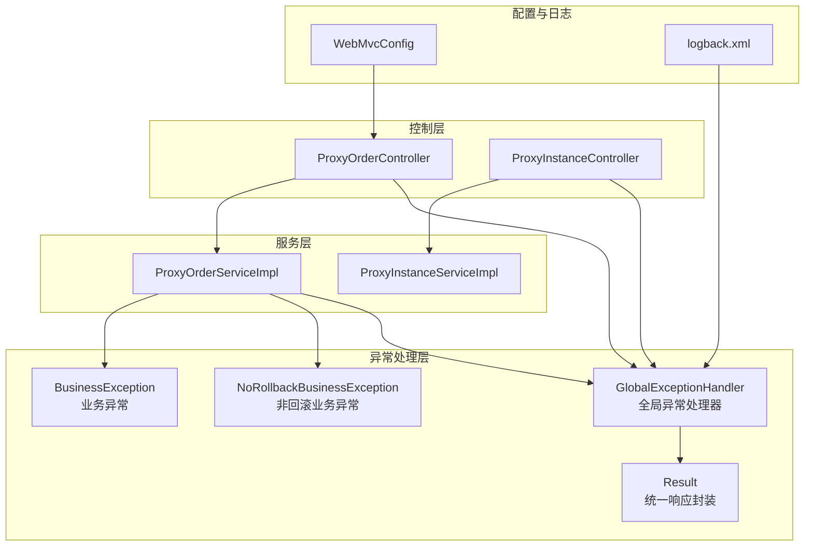
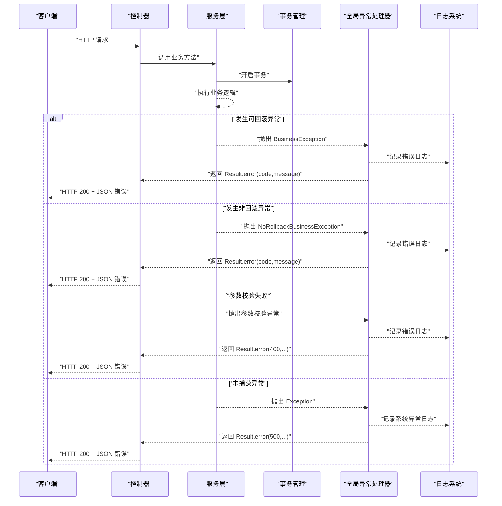
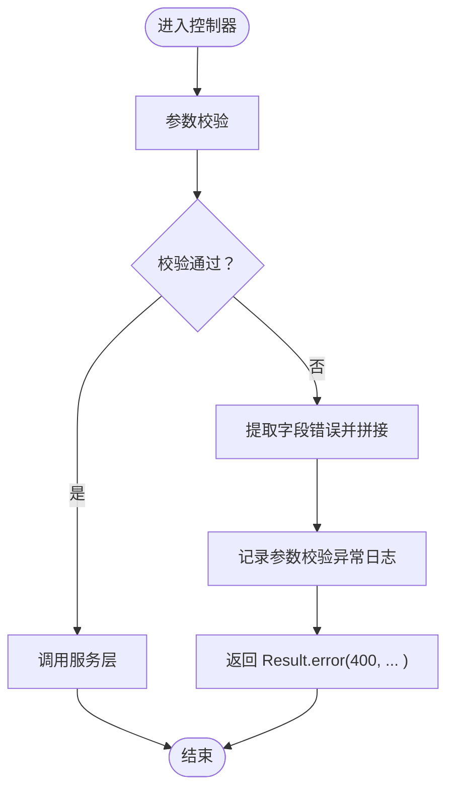
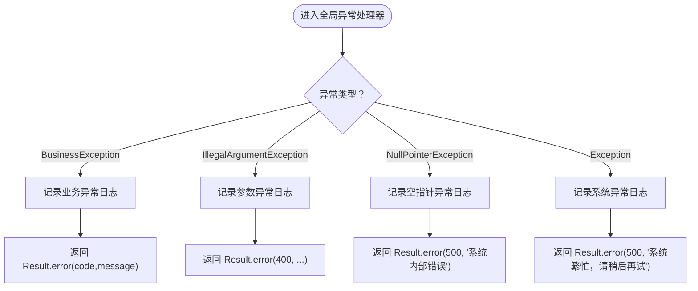
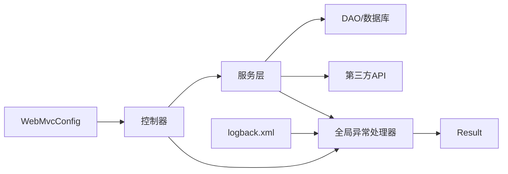

# 异常处理机制

<cite>
**本文引用的文件**
- [GlobalExceptionHandler.java](file://src/main/java/cn/linkfast/exception/GlobalExceptionHandler.java)
- [BusinessException.java](file://src/main/java/cn/linkfast/exception/BusinessException.java)
- [NoRollbackBusinessException.java](file://src/main/java/cn/linkfast/exception/NoRollbackBusinessException.java)
- [Result.java](file://src/main/java/cn/linkfast/common/Result.java)
- [ProxyOrderController.java](file://src/main/java/cn/linkfast/controller/ProxyOrderController.java)
- [ProxyInstanceController.java](file://src/main/java/cn/linkfast/controller/ProxyInstanceController.java)
- [ProxyOrderServiceImpl.java](file://src/main/java/cn/linkfast/service/impl/ProxyOrderServiceImpl.java)
- [ProxyInstanceServiceImpl.java](file://src/main/java/cn/linkfast/service/impl/ProxyInstanceServiceImpl.java)
- [WebMvcConfig.java](file://src/main/java/cn/linkfast/config/WebMvcConfig.java)
- [logback.xml](file://src/main/resources/logback.xml)
- [ProxyOrderControllerTest.java](file://src/test/java/cn/linkfast/controller/ProxyOrderControllerTest.java)
</cite>

## 目录
1. [简介](#简介)
2. [项目结构](#项目结构)
3. [核心组件](#核心组件)
4. [架构总览](#架构总览)
5. [详细组件分析](#详细组件分析)
6. [依赖分析](#依赖分析)
7. [性能考量](#性能考量)
8. [故障排查指南](#故障排查指南)
9. [结论](#结论)
10. [附录](#附录)

## 简介
本文件系统性阐述 Link-Fast 项目的异常处理机制，重点覆盖：
- 全局异常处理器的设计与实现，包括 @ControllerAdvice 的使用、异常分类处理与统一响应格式
- 业务异常 BusinessException 与非回滚业务异常 NoRollbackBusinessException 的差异、适用场景与最佳实践
- 参数校验异常、业务逻辑异常、系统异常的处理策略
- 异常码规范、错误消息格式化与日志记录最佳实践
- 具体异常处理示例与调试技巧

## 项目结构
异常处理相关代码主要分布在以下模块：
- 异常模型与全局处理器：exception 包
- 统一响应封装：common 包
- 控制器层：controller 包（部分控制器直接捕获业务异常）
- 服务层：service.impl 包（大量使用 BusinessException 与 NoRollbackBusinessException）
- Web 配置：config 包（启用注解驱动与组件扫描）
- 日志配置：resources/logback.xml

图表来源
- [GlobalExceptionHandler.java:1-90](file://src/main/java/cn/linkfast/exception/GlobalExceptionHandler.java#L1-L90)
- [BusinessException.java:1-36](file://src/main/java/cn/linkfast/exception/BusinessException.java#L1-L36)
- [NoRollbackBusinessException.java:1-27](file://src/main/java/cn/linkfast/exception/NoRollbackBusinessException.java#L1-L27)
- [Result.java:1-59](file://src/main/java/cn/linkfast/common/Result.java#L1-L59)
- [ProxyOrderController.java:1-86](file://src/main/java/cn/linkfast/controller/ProxyOrderController.java#L1-L86)
- [ProxyInstanceController.java:1-52](file://src/main/java/cn/linkfast/controller/ProxyInstanceController.java#L1-L52)
- [ProxyOrderServiceImpl.java:1-820](file://src/main/java/cn/linkfast/service/impl/ProxyOrderServiceImpl.java#L1-L820)
- [ProxyInstanceServiceImpl.java:1-195](file://src/main/java/cn/linkfast/service/impl/ProxyInstanceServiceImpl.java#L1-L195)
- [WebMvcConfig.java:1-62](file://src/main/java/cn/linkfast/config/WebMvcConfig.java#L1-L62)
- [logback.xml:1-49](file://src/main/resources/logback.xml#L1-L49)

章节来源
- [GlobalExceptionHandler.java:1-90](file://src/main/java/cn/linkfast/exception/GlobalExceptionHandler.java#L1-L90)
- [WebMvcConfig.java:1-62](file://src/main/java/cn/linkfast/config/WebMvcConfig.java#L1-L62)

## 核心组件
- 全局异常处理器 GlobalExceptionHandler：基于 @ControllerAdvice，集中处理业务异常、参数异常、空指针异常、未捕获异常以及参数校验异常，统一返回 Result 结构
- 业务异常 BusinessException：继承 RuntimeException，支持自定义错误码与消息，用于可回滚场景
- 非回滚业务异常 NoRollbackBusinessException：继承 RuntimeException，携带用户可见消息，用于“对方已落库、我方响应失败”的场景，需配合事务配置不回滚
- 统一响应 Result：封装 code、message、data，提供 success/error 工厂方法，确保前后端交互一致性

章节来源
- [GlobalExceptionHandler.java:17-90](file://src/main/java/cn/linkfast/exception/GlobalExceptionHandler.java#L17-L90)
- [BusinessException.java:3-36](file://src/main/java/cn/linkfast/exception/BusinessException.java#L3-L36)
- [NoRollbackBusinessException.java:5-27](file://src/main/java/cn/linkfast/exception/NoRollbackBusinessException.java#L5-L27)
- [Result.java:6-59](file://src/main/java/cn/linkfast/common/Result.java#L6-L59)

## 架构总览
全局异常处理器通过 Spring MVC 的异常传播机制拦截控制器与服务层抛出的异常，统一转换为 Result 响应，同时记录日志。控制器层也存在局部捕获 BusinessException 的场景，以实现更细粒度的错误处理与日志记录。

图表来源
- [GlobalExceptionHandler.java:25-88](file://src/main/java/cn/linkfast/exception/GlobalExceptionHandler.java#L25-L88)
- [ProxyOrderController.java:55-83](file://src/main/java/cn/linkfast/controller/ProxyOrderController.java#L55-L83)
- [ProxyOrderServiceImpl.java:197-458](file://src/main/java/cn/linkfast/service/impl/ProxyOrderServiceImpl.java#L197-L458)

## 详细组件分析

### 全局异常处理器 GlobalExceptionHandler
- 设计理念
  - 使用 @ControllerAdvice 全局拦截异常，避免在各控制器重复 try-catch
  - 对不同类型的异常进行分类处理，统一返回 Result 结构，保证前端一致的错误消费体验
  - 对参数校验异常进行统一格式化，区分 JSON 与表单/GET 参数校验场景
- 关键处理策略
  - 业务异常 BusinessException：记录请求 URL 与异常信息，返回带错误码的 Result
  - 参数异常 IllegalArgumentException：统一返回 400 与格式化错误消息
  - 空指针异常 NullPointerException：记录请求 URL，返回系统内部错误
  - 未捕获异常 Exception：记录请求 URL，返回系统繁忙提示
  - 参数校验异常 MethodArgumentNotValidException/BindException：统一提取字段级错误，拼接为可读消息
- 日志记录
  - 使用 SLF4J 记录异常，结合 logback.xml 输出到业务日志文件，便于问题定位与审计

章节来源
- [GlobalExceptionHandler.java:17-90](file://src/main/java/cn/linkfast/exception/GlobalExceptionHandler.java#L17-L90)
- [logback.xml:6-47](file://src/main/resources/logback.xml#L6-L47)

### 业务异常 BusinessException 与非回滚业务异常 NoRollbackBusinessException
- BusinessException
  - 语义：业务层面的错误，通常可回滚
  - 使用场景：参数校验失败、库存不足、支付密码错误等
  - 特点：可携带自定义错误码与消息；在事务中抛出时会被自动回滚
- NoRollbackBusinessException
  - 语义：业务层面的错误，但不应回滚本地已落库的数据
  - 使用场景：第三方接口已接收请求并落库，但响应阶段出现异常（如连接已建立但读取失败、响应为空、JSON 非法、解密失败、数据解析失败等）
  - 特点：需配合事务配置 noRollbackFor = NoRollbackBusinessException.class；对外返回用户友好消息，不对本地数据做回滚
- 两者对比与选择
  - 当第三方系统“未收到请求”或“未落库”，可安全回滚：使用 BusinessException
  - 当第三方系统“已收到请求并落库”，不可回滚：使用 NoRollbackBusinessException

章节来源
- [BusinessException.java:3-36](file://src/main/java/cn/linkfast/exception/BusinessException.java#L3-L36)
- [NoRollbackBusinessException.java:5-27](file://src/main/java/cn/linkfast/exception/NoRollbackBusinessException.java#L5-L27)
- [ProxyOrderServiceImpl.java:197-458](file://src/main/java/cn/linkfast/service/impl/ProxyOrderServiceImpl.java#L197-L458)
- [ProxyOrderServiceImpl.java:469-673](file://src/main/java/cn/linkfast/service/impl/ProxyOrderServiceImpl.java#L469-L673)
- [ProxyOrderServiceImpl.java:675-800](file://src/main/java/cn/linkfast/service/impl/ProxyOrderServiceImpl.java#L675-L800)

### 统一响应 Result
- 设计目标：前后端一致的响应结构，简化前端错误处理
- 结构：code、message、data
- 工厂方法：success(...) 与 error(...)，支持泛型数据封装
- 使用建议：优先使用 Result.success(...) 返回正常数据；使用 Result.error(...) 返回错误码与消息

章节来源
- [Result.java:6-59](file://src/main/java/cn/linkfast/common/Result.java#L6-L59)

### 控制器层异常处理策略
- ProxyOrderController
  - 对续费与释放接口采用局部 try-catch 捕获 BusinessException，记录更详细的日志并返回 Result.error(...)
  - 对查询与开通接口依赖全局异常处理器统一处理
- ProxyInstanceController
  - 通过 @Validated 参数校验，异常交由全局处理器处理

章节来源
- [ProxyOrderController.java:55-83](file://src/main/java/cn/linkfast/controller/ProxyOrderController.java#L55-L83)
- [ProxyInstanceController.java:31-48](file://src/main/java/cn/linkfast/controller/ProxyInstanceController.java#L31-L48)

### 服务层异常处理策略
- ProxyOrderServiceImpl
  - 在事务中包装多种异常场景，区分可回滚与不可回滚两类
  - 对第三方接口调用失败的不同阶段（连接失败、响应读取失败、响应为空、JSON 非法、解密失败、数据解析失败等）分别抛出 BusinessException 或 NoRollbackBusinessException
  - 对于“连接失败”场景，重试多次后仍失败则抛出 BusinessException，允许回滚
  - 对于“已发送请求但响应阶段失败”场景，抛出 NoRollbackBusinessException，不回滚本地数据
- ProxyInstanceServiceImpl
  - 在更新备注时若未影响任何记录，抛出 BusinessException(400, "...")，返回参数错误或资源不存在

章节来源
- [ProxyOrderServiceImpl.java:197-458](file://src/main/java/cn/linkfast/service/impl/ProxyOrderServiceImpl.java#L197-L458)
- [ProxyOrderServiceImpl.java:469-673](file://src/main/java/cn/linkfast/service/impl/ProxyOrderServiceImpl.java#L469-L673)
- [ProxyOrderServiceImpl.java:675-800](file://src/main/java/cn/linkfast/service/impl/ProxyOrderServiceImpl.java#L675-L800)
- [ProxyInstanceServiceImpl.java:152-158](file://src/main/java/cn/linkfast/service/impl/ProxyInstanceServiceImpl.java#L152-L158)

### 参数校验异常处理流程
- JSON 参数校验：MethodArgumentNotValidException，拼接所有字段错误
- 表单/GET 参数校验：BindException，提取单字段错误
- 统一返回 Result.error(400, ...)，并记录请求 URL 与错误信息

图表来源
- [GlobalExceptionHandler.java:65-88](file://src/main/java/cn/linkfast/exception/GlobalExceptionHandler.java#L65-L88)

章节来源
- [GlobalExceptionHandler.java:65-88](file://src/main/java/cn/linkfast/exception/GlobalExceptionHandler.java#L65-L88)

### 业务异常与系统异常处理流程
- 业务异常 BusinessException
  - 记录请求 URL 与异常信息
  - 返回 Result.error(code, message)
- 系统异常 Exception
  - 记录请求 URL
  - 返回 Result.error(500, "系统繁忙，请稍后再试")

图表来源
- [GlobalExceptionHandler.java:25-63](file://src/main/java/cn/linkfast/exception/GlobalExceptionHandler.java#L25-L63)

章节来源
- [GlobalExceptionHandler.java:25-63](file://src/main/java/cn/linkfast/exception/GlobalExceptionHandler.java#L25-L63)

## 依赖分析
- 控制器依赖服务层，服务层依赖 DAO 与外部 API；异常在服务层产生并在控制器或全局处理器处被统一处理
- WebMvcConfig 启用注解驱动与组件扫描，确保 @ControllerAdvice 生效
- 日志系统通过 logback.xml 分离业务日志与服务器日志，便于问题定位

图表来源
- [ProxyOrderController.java:1-86](file://src/main/java/cn/linkfast/controller/ProxyOrderController.java#L1-L86)
- [ProxyOrderServiceImpl.java:1-820](file://src/main/java/cn/linkfast/service/impl/ProxyOrderServiceImpl.java#L1-L820)
- [GlobalExceptionHandler.java:1-90](file://src/main/java/cn/linkfast/exception/GlobalExceptionHandler.java#L1-L90)
- [WebMvcConfig.java:19-22](file://src/main/java/cn/linkfast/config/WebMvcConfig.java#L19-L22)
- [logback.xml:6-47](file://src/main/resources/logback.xml#L6-L47)

章节来源
- [WebMvcConfig.java:19-22](file://src/main/java/cn/linkfast/config/WebMvcConfig.java#L19-L22)

## 性能考量
- 全局异常处理器仅在异常发生时介入，正常路径零开销
- 参数校验异常统一处理避免重复日志与响应拼装逻辑
- 事务配置针对 NoRollbackBusinessException 不回滚，减少不必要的回滚成本
- 建议：对高频异常场景增加缓存或限流，避免雪崩效应

## 故障排查指南
- 如何验证全局异常处理器生效
  - 使用测试用例模拟参数校验失败、Content-Type 错误等场景，断言返回 Result.error(400, ...)
  - 参考测试用例对控制器行为的断言
- 如何定位业务异常
  - 查看业务日志文件（linkfast-business.log），确认请求 URL 与异常堆栈
  - 在服务层抛出 BusinessException 时，检查错误码与消息是否合理
- 如何区分可回滚与不可回滚异常
  - 若第三方接口“未收到请求”或“未落库”，使用 BusinessException，事务可回滚
  - 若第三方接口“已收到请求并落库”，使用 NoRollbackBusinessException，事务不回滚
- 调试技巧
  - 在控制器层对 BusinessException 进行局部捕获，记录更详细的上下文日志
  - 使用 MockMvc 测试不同输入组合，覆盖边界条件与异常分支
  - 在 logback.xml 中调整日志级别，临时提升 DEBUG 以获取更多上下文

章节来源
- [ProxyOrderControllerTest.java:56-102](file://src/test/java/cn/linkfast/controller/ProxyOrderControllerTest.java#L56-L102)
- [ProxyOrderControllerTest.java:250-263](file://src/test/java/cn/linkfast/controller/ProxyOrderControllerTest.java#L250-L263)
- [logback.xml:37-47](file://src/main/resources/logback.xml#L37-L47)

## 结论
Link-Fast 的异常处理机制通过全局异常处理器实现了统一、可维护的错误处理策略，结合 BusinessException 与 NoRollbackBusinessException 的明确分工，有效覆盖了从参数校验到业务逻辑再到系统异常的全链路场景。配合统一响应封装与完善的日志配置，显著提升了系统的可观测性与可维护性。建议在后续迭代中持续完善异常码规范与测试覆盖，确保异常处理策略的一致性与稳定性。

## 附录

### 异常码规范与错误消息格式化建议
- 错误码设计
  - 200：成功
  - 400：参数错误/参数校验失败
  - 401：未授权（如有鉴权）
  - 500：系统内部错误/系统繁忙
  - 业务错误：使用 4xx/5xx 的业务子码，例如 4001（库存不足）、4002（支付密码错误）、5001（第三方接口异常）
- 错误消息格式
  - 用户可见消息：简洁明了，指导下一步操作
  - 系统日志：包含请求 URL、异常堆栈、关键上下文参数
- 统一响应格式
  - 成功：Result.success(data)
  - 失败：Result.error(code, message)，避免直接返回异常对象

章节来源
- [Result.java:28-44](file://src/main/java/cn/linkfast/common/Result.java#L28-L44)
- [GlobalExceptionHandler.java:30-62](file://src/main/java/cn/linkfast/exception/GlobalExceptionHandler.java#L30-L62)