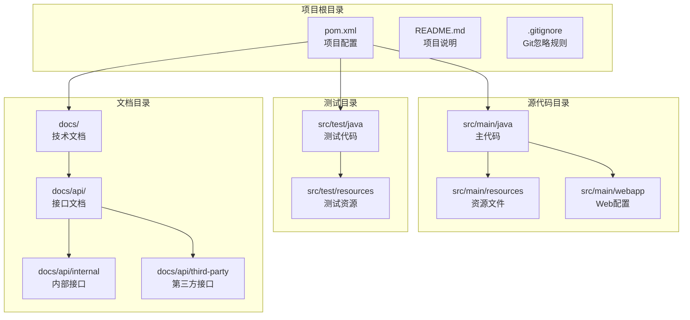
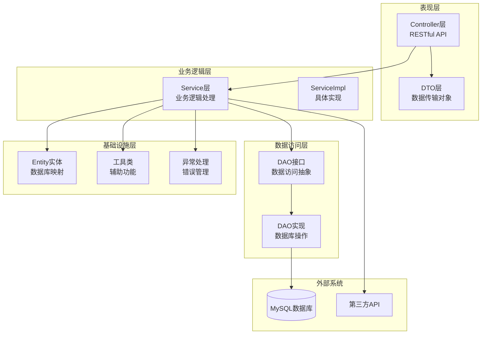
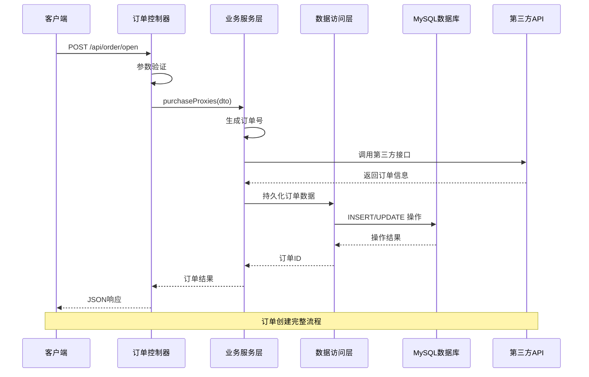
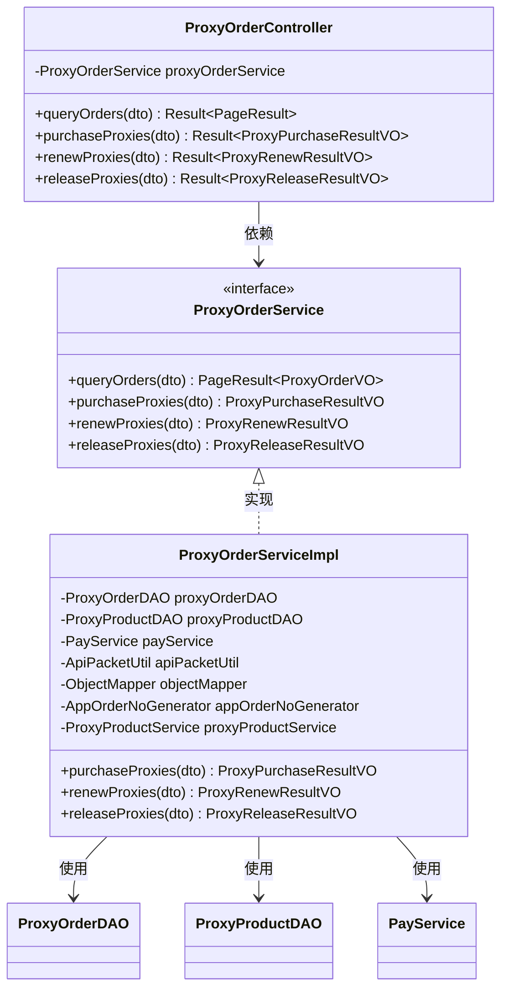
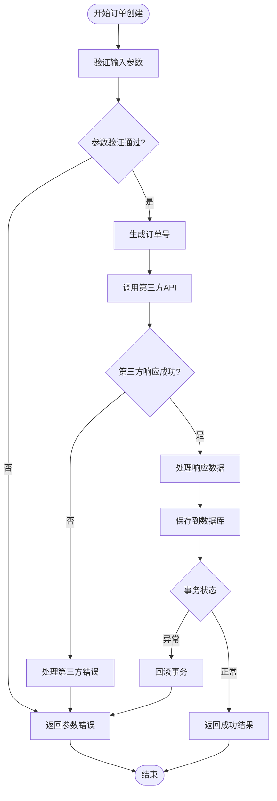
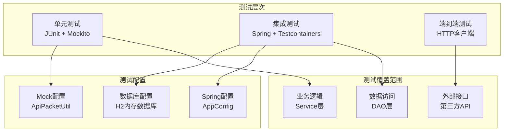
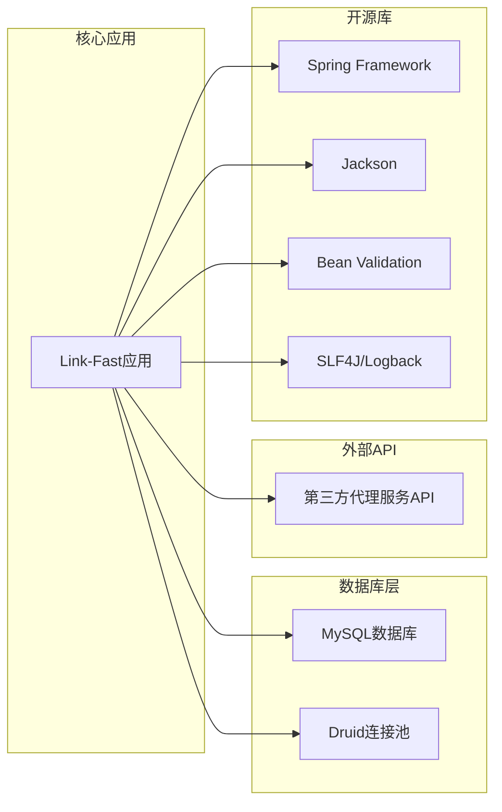
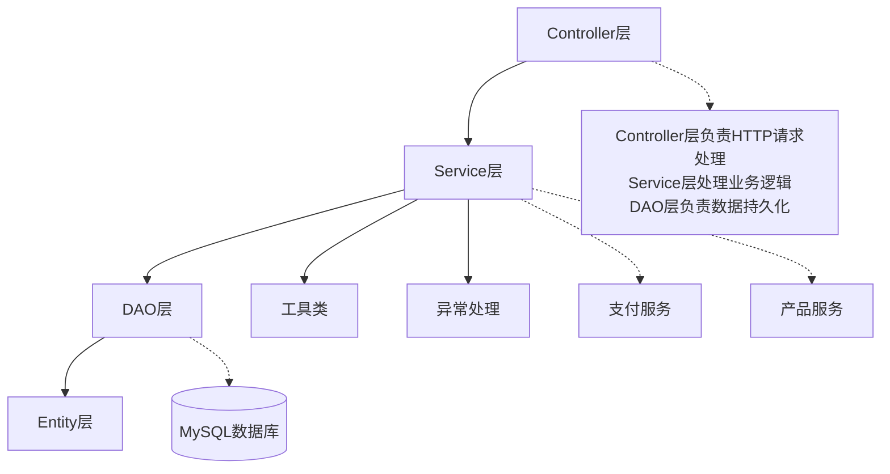
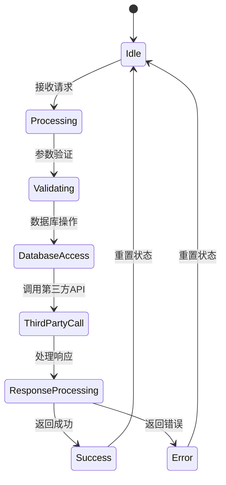

# 版本控制与协作

<cite>
**本文引用的文件**
- [README.md](file://README.md)
- [.gitignore](file://.gitignore)
- [pom.xml](file://pom.xml)
- [docs/README.md](file://docs/README.md)
- [docs/api/internal/创建代理订单接口.md](file://docs/api/internal/创建代理订单接口.md)
- [src/main/java/cn/linkfast/controller/ProxyOrderController.java](file://src/main/java/cn/linkfast/controller/ProxyOrderController.java)
- [src/test/java/cn/linkfast/service/Impl/ProxyOrderIT.java](file://src/test/java/cn/linkfast/service/Impl/ProxyOrderIT.java)
- [src/main/resources/applicationContext.xml](file://src/main/resources/applicationContext.xml)
- [src/test/resources/test.properties](file://src/test/resources/test.properties)
- [src/test/resources/logback-test.xml](file://src/test/resources/logback-test.xml)
- [src/main/java/cn/linkfast/utils/AppOrderNoGenerator.java](file://src/main/java/cn/linkfast/utils/AppOrderNoGenerator.java)
</cite>

## 目录
1. [简介](#简介)
2. [项目结构](#项目结构)
3. [核心组件](#核心组件)
4. [架构概览](#架构概览)
5. [详细组件分析](#详细组件分析)
6. [依赖关系分析](#依赖关系分析)
7. [性能考虑](#性能考虑)
8. [故障排除指南](#故障排除指南)
9. [结论](#结论)
10. [附录](#附录)

## 简介

Link-Fast 是一个基于 Spring 框架构建的企业级代理服务管理系统。该项目采用 Maven 作为构建工具，支持 Java 17+ 环境，集成了完整的订单管理、代理实例管理、支付处理等功能模块。项目具有完善的测试体系，包括单元测试、集成测试和端到端测试，确保系统的稳定性和可靠性。

## 项目结构

Link-Fast 项目遵循标准的 Maven 项目结构，采用分层架构设计，主要包含以下核心目录：

**图表来源**
- [pom.xml:1-278](file://pom.xml#L1-L278)
- [docs/README.md:1-12](file://docs/README.md#L1-L12)

**章节来源**
- [pom.xml:1-278](file://pom.xml#L1-L278)
- [docs/README.md:1-12](file://docs/README.md#L1-L12)

## 核心组件

### 技术栈概览

Link-Fast 项目采用现代化的技术栈构建，确保了系统的高性能和可维护性：

| 组件类别 | 技术选择 | 版本 | 用途描述 |
|---------|---------|------|----------|
| **核心框架** | Spring Framework | 6.2.13 | 依赖注入、事务管理、MVC框架 |
| **Web容器** | Jakarta Servlet | 6.0.0 | Web应用容器 |
| **JSON处理** | Jackson | 2.18.2 | 数据序列化与反序列化 |
| **数据库连接** | Druid | 1.2.28 | 连接池管理 |
| **数据库驱动** | MySQL Connector/J | 8.4.0 | MySQL数据库连接 |
| **验证框架** | Hibernate Validator | 8.0.1 | Bean验证 |
| **测试框架** | JUnit 5 | 5.10.2 | 单元测试 |
| **Mock框架** | Mockito | 5.11.0 | 测试替身 |
| **日志系统** | SLF4J + Logback | 2.0.16 + 1.5.16 | 结构化日志记录 |

### 项目配置分析

项目的核心配置文件展示了完整的构建和部署策略：

**Maven配置要点**：
- 支持 Java 17+ 编译环境
- 集成测试插件配置
- 多环境配置管理
- 依赖版本统一管理

**章节来源**
- [pom.xml:12-20](file://pom.xml#L12-L20)
- [pom.xml:223-276](file://pom.xml#L223-L276)

## 架构概览

Link-Fast 采用经典的三层架构模式，实现了清晰的职责分离和良好的可扩展性：

**图表来源**
- [src/main/java/cn/linkfast/controller/ProxyOrderController.java:1-86](file://src/main/java/cn/linkfast/controller/ProxyOrderController.java#L1-L86)
- [src/main/java/cn/linkfast/service/impl/ProxyOrderServiceImpl.java:272-819](file://src/main/java/cn/linkfast/service/impl/ProxyOrderServiceImpl.java#L272-L819)

### 核心业务流程

系统的核心业务流程围绕订单管理展开，包括订单创建、续费、释放等关键操作：

**图表来源**
- [src/main/java/cn/linkfast/controller/ProxyOrderController.java:44-47](file://src/main/java/cn/linkfast/controller/ProxyOrderController.java#L44-L47)
- [src/main/java/cn/linkfast/utils/AppOrderNoGenerator.java:24-43](file://src/main/java/cn/linkfast/utils/AppOrderNoGenerator.java#L24-L43)

**章节来源**
- [src/main/java/cn/linkfast/controller/ProxyOrderController.java:1-86](file://src/main/java/cn/linkfast/controller/ProxyOrderController.java#L1-L86)
- [src/main/java/cn/linkfast/utils/AppOrderNoGenerator.java:1-44](file://src/main/java/cn/linkfast/utils/AppOrderNoGenerator.java#L1-L44)

## 详细组件分析

### 订单管理模块

订单管理是系统的核心功能模块，负责代理服务的购买、续费和释放操作。

#### 订单控制器分析

**图表来源**
- [src/main/java/cn/linkfast/controller/ProxyOrderController.java:23-28](file://src/main/java/cn/linkfast/controller/ProxyOrderController.java#L23-L28)
- [src/main/java/cn/linkfast/service/ProxyOrderService.java:1-50](file://src/main/java/cn/linkfast/service/ProxyOrderService.java#L1-L50)
- [src/main/java/cn/linkfast/service/impl/ProxyOrderServiceImpl.java:272-819](file://src/main/java/cn/linkfast/service/impl/ProxyOrderServiceImpl.java#L272-L819)

#### 订单创建流程

订单创建流程体现了系统的健壮性和容错能力：

**图表来源**
- [src/main/java/cn/linkfast/controller/ProxyOrderController.java:44-47](file://src/main/java/cn/linkfast/controller/ProxyOrderController.java#L44-L47)
- [src/main/java/cn/linkfast/service/impl/ProxyOrderServiceImpl.java:272-673](file://src/main/java/cn/linkfast/service/impl/ProxyOrderServiceImpl.java#L272-L673)

**章节来源**
- [src/main/java/cn/linkfast/controller/ProxyOrderController.java:20-86](file://src/main/java/cn/linkfast/controller/ProxyOrderController.java#L20-L86)
- [src/main/java/cn/linkfast/service/impl/ProxyOrderServiceImpl.java:272-819](file://src/main/java/cn/linkfast/service/impl/ProxyOrderServiceImpl.java#L272-L819)

### 测试架构分析

项目建立了完整的测试金字塔，从底层单元测试到顶层集成测试层层递进：

**图表来源**
- [src/test/java/cn/linkfast/service/Impl/ProxyOrderIT.java:34-66](file://src/test/java/cn/linkfast/service/Impl/ProxyOrderIT.java#L34-L66)
- [src/test/resources/test.properties:1-2](file://src/test/resources/test.properties#L1-L2)

**章节来源**
- [src/test/java/cn/linkfast/service/Impl/ProxyOrderIT.java:1-178](file://src/test/java/cn/linkfast/service/Impl/ProxyOrderIT.java#L1-L178)
- [src/test/resources/logback-test.xml:1-49](file://src/test/resources/logback-test.xml#L1-L49)

## 依赖关系分析

### 外部依赖关系

项目对外部系统的依赖关系清晰明确，主要依赖包括数据库、第三方API和各种开源库：

**图表来源**
- [pom.xml:22-212](file://pom.xml#L22-L212)
- [src/main/resources/applicationContext.xml:17-52](file://src/main/resources/applicationContext.xml#L17-L52)

### 内部模块依赖

系统内部模块之间的依赖关系体现了清晰的分层架构：

**图表来源**
- [src/main/java/cn/linkfast/controller/ProxyOrderController.java:1-86](file://src/main/java/cn/linkfast/controller/ProxyOrderController.java#L1-L86)
- [src/main/java/cn/linkfast/service/impl/ProxyOrderServiceImpl.java:272-819](file://src/main/java/cn/linkfast/service/impl/ProxyOrderServiceImpl.java#L272-L819)

**章节来源**
- [pom.xml:22-212](file://pom.xml#L22-L212)
- [src/main/resources/applicationContext.xml:17-67](file://src/main/resources/applicationContext.xml#L17-L67)

## 性能考虑

### 数据库性能优化

系统在数据库层面采用了多项优化策略：

1. **连接池配置优化**：
   - Druid 连接池最大活跃连接数设置为 20
   - 空闲连接回收策略，30分钟回收空闲连接
   - 连接泄露检测和自动移除

2. **查询性能优化**：
   - 使用 PreparedStatement 防止 SQL 注入
   - 合理的索引设计和查询优化
   - 批量操作减少数据库往返

3. **缓存策略**：
   - Spring 缓存注解支持
   - Redis 缓存集成（可选）

### 并发处理机制

系统采用多线程并发处理机制，确保高并发场景下的稳定性：

**章节来源**
- [src/main/resources/applicationContext.xml:23-52](file://src/main/resources/applicationContext.xml#L23-L52)
- [src/main/java/cn/linkfast/service/impl/ProxyOrderServiceImpl.java:675-819](file://src/main/java/cn/linkfast/service/impl/ProxyOrderServiceImpl.java#L675-L819)

## 故障排除指南

### 常见问题诊断

#### 数据库连接问题

**症状**：应用启动时报数据库连接失败

**诊断步骤**：
1. 检查数据库连接配置
2. 验证网络连通性
3. 确认数据库服务状态
4. 查看连接池状态

**解决方案**：
- 更新 JDBC 配置参数
- 检查防火墙设置
- 验证数据库用户权限

#### 第三方API调用失败

**症状**：订单创建或续费操作失败

**诊断步骤**：
1. 检查第三方API响应状态
2. 验证签名和加密参数
3. 确认请求频率限制
4. 查看API文档更新

**解决方案**：
- 实现重试机制
- 添加熔断器模式
- 记录详细的错误日志

#### 测试环境配置问题

**症状**：测试无法正常运行

**诊断步骤**：
1. 检查测试配置文件
2. 验证数据库连接
3. 确认测试依赖版本
4. 查看测试日志输出

**解决方案**：
- 更新测试配置
- 重新构建测试环境
- 检查依赖版本兼容性

**章节来源**
- [src/test/resources/test.properties:1-2](file://src/test/resources/test.properties#L1-L2)
- [src/test/resources/logback-test.xml:38-47](file://src/test/resources/logback-test.xml#L38-L47)

### 性能监控建议

建议实施以下性能监控措施：

1. **应用性能监控**：
   - JVM 垃圾回收监控
   - 线程池使用情况
   - 数据库连接池健康度

2. **业务指标监控**：
   - API 响应时间
   - 订单处理成功率
   - 第三方API调用成功率

3. **日志分析**：
   - 异常日志聚合
   - 性能瓶颈识别
   - 用户行为分析

## 结论

Link-Fast 项目展现了现代企业级应用开发的最佳实践。项目采用清晰的分层架构、完善的测试体系和合理的依赖管理，为后续的功能扩展和维护奠定了坚实基础。

通过本文档建立的版本控制与协作规范，团队可以实现更加高效和规范的开发流程，确保代码质量和项目交付效率。建议团队在实际开发中严格遵守这些规范，并根据项目发展情况进行持续改进。

## 附录

### 开发环境配置

**Java 环境要求**：
- JDK 17 或更高版本
- Maven 3.6+
- MySQL 8.0+

**开发工具推荐**：
- IntelliJ IDEA 或 Eclipse
- Postman（API测试）
- Docker（容器化部署）

### 部署配置建议

**生产环境配置要点**：
- 数据库连接池参数调优
- 日志级别调整
- 安全配置加固
- 监控告警设置

**章节来源**
- [pom.xml:12-20](file://pom.xml#L12-L20)
- [src/main/resources/applicationContext.xml:17-67](file://src/main/resources/applicationContext.xml#L17-L67)