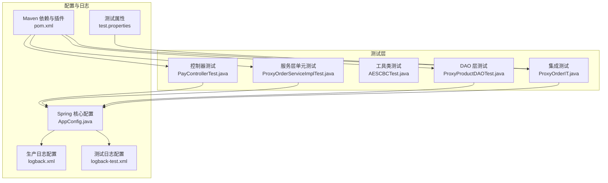
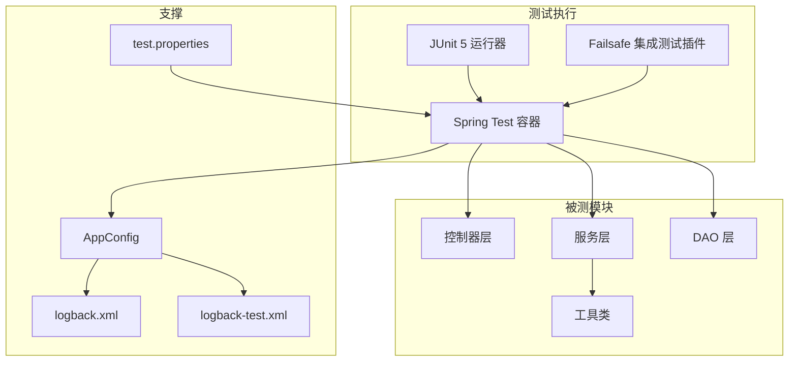
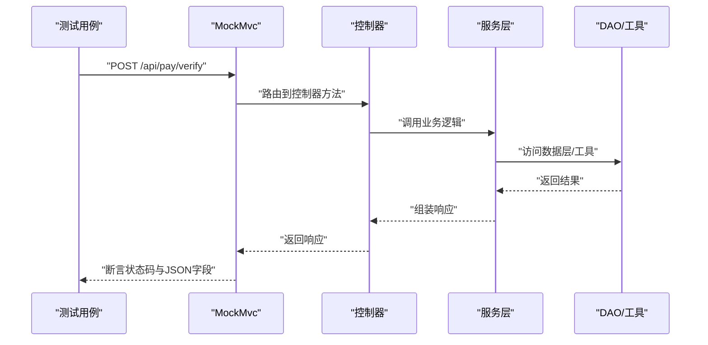
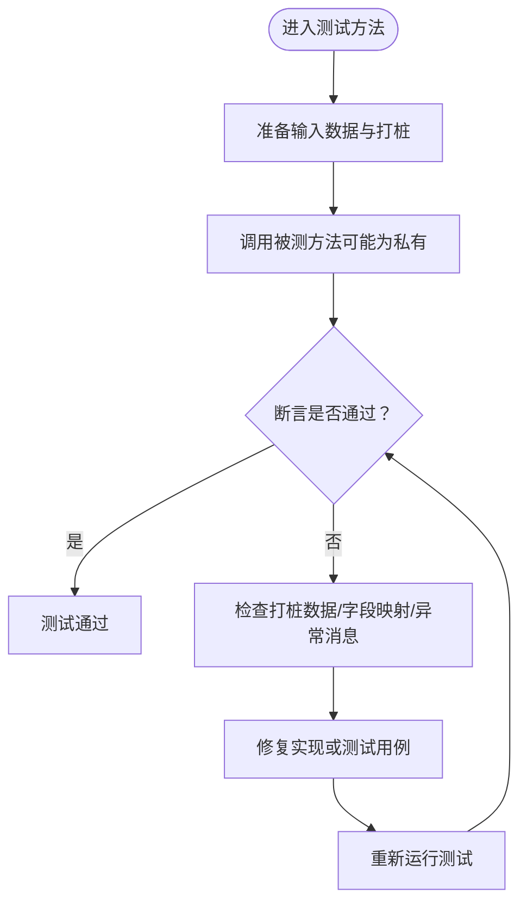
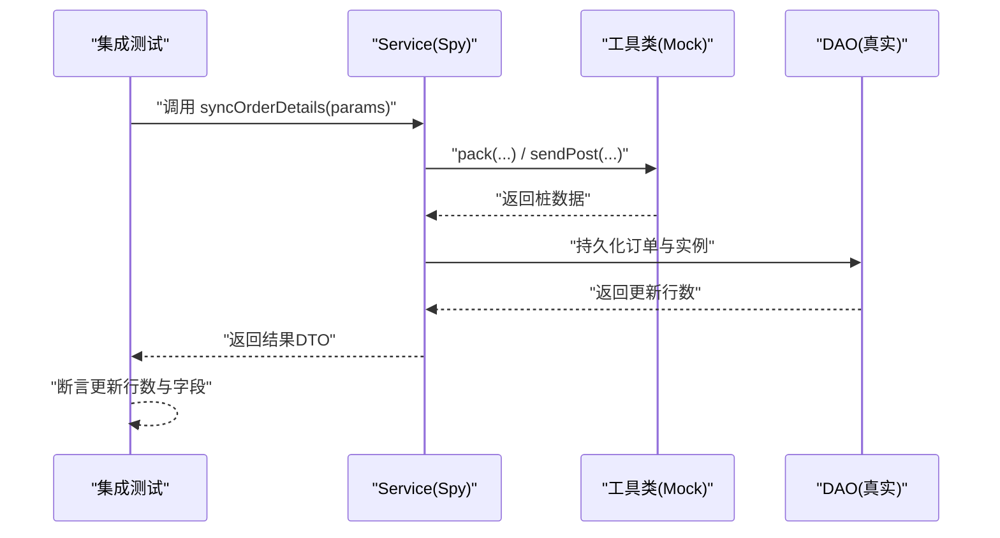
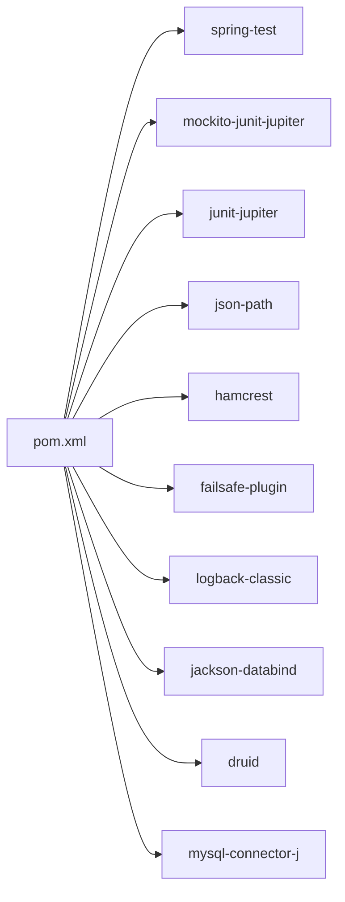

# 调试与测试技巧

<cite>
**本文引用的文件**
- [pom.xml](file://pom.xml)
- [AppConfig.java](file://src/main/java/cn/linkfast/config/AppConfig.java)
- [logback.xml](file://src/main/resources/logback.xml)
- [logback-test.xml](file://src/test/resources/logback-test.xml)
- [PayControllerTest.java](file://src/test/java/cn/linkfast/controller/PayControllerTest.java)
- [ProxyOrderServiceImplTest.java](file://src/test/java/cn/linkfast/service/Impl/ProxyOrderServiceImplTest.java)
- [AESCBCTest.java](file://src/test/java/cn/linkfast/utils/AESCBCTest.java)
- [ProxyProductDAOTest.java](file://src/test/java/cn/linkfast/dao/ProxyProductDAOTest.java)
- [ProxyOrderIT.java](file://src/test/java/cn/linkfast/service/Impl/ProxyOrderIT.java)
- [test.properties](file://src/test/resources/test.properties)
- [SimpleTest.java](file://src/test/java/cn/linkfast/SimpleTest.java)
- [test-api.http](file://test-api.http)
</cite>

## 目录
1. [简介](#简介)
2. [项目结构](#项目结构)
3. [核心组件](#核心组件)
4. [架构总览](#架构总览)
5. [详细组件分析](#详细组件分析)
6. [依赖分析](#依赖分析)
7. [性能考虑](#性能考虑)
8. [故障排查指南](#故障排查指南)
9. [结论](#结论)
10. [附录](#附录)

## 简介
本指南面向 Link-Fast 项目的开发者与测试工程师，系统讲解开发环境搭建、IDE（IntelliJ IDEA/Eclipse）推荐配置、断点调试与日志调试、性能分析工具使用、单元测试与集成测试编写方法、Mock 对象与测试数据准备、测试覆盖率与持续集成流程，以及常见问题排查与内存泄漏检测技巧。内容基于仓库现有测试与配置文件进行提炼，帮助快速定位问题、提升开发效率。

## 项目结构
- 测试采用 JUnit 5 + Mockito + Spring Test，覆盖控制器层（MockMvc）、服务层（Mockito Spy）、DAO 层（Spring 上下文加载）、工具类与集成场景（Failsafe 插件支持的 IT 测试）。
- 日志配置区分生产与测试环境，分别输出到不同文件与控制台，便于隔离定位问题。
- Maven 插件包含编译、资源、War 打包与集成测试（Failsafe）插件，支持按约定命名的集成测试类运行。

图表来源
- [pom.xml:22-213](file://pom.xml#L22-L213)
- [AppConfig.java:14-36](file://src/main/java/cn/linkfast/config/AppConfig.java#L14-L36)
- [logback.xml:1-49](file://src/main/resources/logback.xml#L1-L49)
- [logback-test.xml:1-49](file://src/test/resources/logback-test.xml#L1-L49)
- [PayControllerTest.java:1-89](file://src/test/java/cn/linkfast/controller/PayControllerTest.java#L1-L89)
- [ProxyOrderServiceImplTest.java:1-89](file://src/test/java/cn/linkfast/service/Impl/ProxyOrderServiceImplTest.java#L1-L89)
- [AESCBCTest.java:1-78](file://src/test/java/cn/linkfast/utils/AESCBCTest.java#L1-L78)
- [ProxyProductDAOTest.java:1-95](file://src/test/java/cn/linkfast/dao/ProxyProductDAOTest.java#L1-L95)
- [ProxyOrderIT.java:1-178](file://src/test/java/cn/linkfast/service/Impl/ProxyOrderIT.java#L1-L178)

章节来源
- [pom.xml:22-278](file://pom.xml#L22-L278)
- [AppConfig.java:14-36](file://src/main/java/cn/linkfast/config/AppConfig.java#L14-L36)
- [logback.xml:1-49](file://src/main/resources/logback.xml#L1-L49)
- [logback-test.xml:1-49](file://src/test/resources/logback-test.xml#L1-L49)

## 核心组件
- 测试框架与工具
  - JUnit 5：用于编写与运行测试用例。
  - Mockito：用于创建 Mock 对象、桩函数与行为验证。
  - Spring Test + MockMvc：用于控制器层端到端请求模拟与断言。
  - Failsafe 插件：用于运行集成测试（以 *IT.java 结尾的类）。
- 配置与上下文
  - AppConfig：声明 ObjectMapper Bean、事务管理与组件扫描范围，供测试注入使用。
  - logback.xml / logback-test.xml：生产与测试日志分离输出，便于问题定位。
  - test.properties：测试环境开关（如关闭定时任务），避免干扰测试。
- 工具与实用程序
  - ApiPacketUtil：在服务层测试中被 Mock，用于解密/加密数据包。
  - AppOrderNoGenerator：在集成测试中注入使用，生成应用订单号。

章节来源
- [pom.xml:46-185](file://pom.xml#L46-L185)
- [AppConfig.java:24-35](file://src/main/java/cn/linkfast/config/AppConfig.java#L24-L35)
- [logback.xml:37-47](file://src/main/resources/logback.xml#L37-L47)
- [logback-test.xml:37-47](file://src/test/resources/logback-test.xml#L37-L47)
- [test.properties:1-3](file://src/test/resources/test.properties#L1-L3)

## 架构总览
测试架构围绕“控制器层（MockMvc）—服务层（Mockito）—DAO 层（Spring 上下文）—工具类（Mock）—集成测试（Failsafe）”展开，结合日志与配置文件实现清晰的隔离与可观测性。

图表来源
- [pom.xml:252-274](file://pom.xml#L252-L274)
- [AppConfig.java:14-36](file://src/main/java/cn/linkfast/config/AppConfig.java#L14-L36)
- [logback.xml:1-49](file://src/main/resources/logback.xml#L1-L49)
- [logback-test.xml:1-49](file://src/test/resources/logback-test.xml#L1-L49)
- [test.properties:1-3](file://src/test/resources/test.properties#L1-L3)

## 详细组件分析

### 控制器层测试（MockMvc）
- 目标：验证控制器对请求的处理、状态码与 JSON 响应断言。
- 关键点：
  - 使用 WebAppConfiguration + MockMvcBuilders.webAppContextSetup 加载 Web 上下文。
  - 通过 ObjectMapper 序列化请求体，使用 MockMvc.perform 发送请求。
  - 使用 jsonPath 断言响应字段，结合 print 输出辅助调试。
- 调试建议：
  - 在断言失败时，优先查看打印的响应体，确认接口契约与期望一致。
  - 若出现跨域或媒体类型问题，检查请求头与 Content-Type 设置。

图表来源
- [PayControllerTest.java:43-86](file://src/test/java/cn/linkfast/controller/PayControllerTest.java#L43-L86)

章节来源
- [PayControllerTest.java:1-89](file://src/test/java/cn/linkfast/controller/PayControllerTest.java#L1-L89)

### 服务层单元测试（Mockito）
- 目标：验证复杂业务逻辑（如 JSON 解析、字段映射、异常处理）。
- 关键点：
  - 使用 @Mock/@Spy/@InjectMocks 组合，对 DAO 与工具类进行打桩。
  - 使用 ReflectionTestUtils 注入 @Value 字段或调用私有方法。
  - 针对正常路径与异常路径分别断言，确保边界条件覆盖。
- 调试建议：
  - 当断言失败时，先打印中间对象（如解密后的 JSON）核对字段映射。
  - 对异常路径，断言异常消息是否包含预期关键字。

图表来源
- [ProxyOrderServiceImplTest.java:38-89](file://src/test/java/cn/linkfast/service/Impl/ProxyOrderServiceImplTest.java#L38-L89)

章节来源
- [ProxyOrderServiceImplTest.java:1-89](file://src/test/java/cn/linkfast/service/Impl/ProxyOrderServiceImplTest.java#L1-L89)

### 工具类测试（加密/解密）
- 目标：验证 AES-CBC 加解密流程与边界条件（非法 key/iv 长度）。
- 关键点：
  - 使用多种输入数据（英文、中文、特殊字符、空串）验证一致性。
  - 对非法参数抛出的异常进行断言，确保健壮性。
- 调试建议：
  - 若加解密失败，优先检查 key 与 iv 长度是否满足 16/24/32 字节与 16 字节要求。

章节来源
- [AESCBCTest.java:1-78](file://src/test/java/cn/linkfast/utils/AESCBCTest.java#L1-L78)

### DAO 层测试（Spring 上下文）
- 目标：验证数据库查询与字段映射（如 retailPrice 非空断言）。
- 关键点：
  - 通过 @ContextConfiguration(AppConfig.class) 加载核心配置，注入 DAO。
  - 使用 System.out.println 打印实体属性，辅助定位字段映射问题。
- 调试建议：
  - 当某字段为 null 时，检查数据库默认值与实体字段类型映射。

章节来源
- [ProxyProductDAOTest.java:1-95](file://src/test/java/cn/linkfast/dao/ProxyProductDAOTest.java#L1-L95)
- [AppConfig.java:24-35](file://src/main/java/cn/linkfast/config/AppConfig.java#L24-L35)

### 集成测试（Failsafe + Spring）
- 目标：在真实 DAO 与工具行为下，验证端到端流程（如订单同步与持久化）。
- 关键点：
  - 使用 @ExtendWith(SpringExtension.class) + @ContextConfiguration(AppConfig.class) 加载 Spring 上下文。
  - 使用 Mockito.spy 包装真实 Service，对网络请求进行桩函数，跳过外部依赖。
  - 通过断言数据库更新行数验证主从表写入逻辑。
- 调试建议：
  - 若集成测试不稳定，检查 test.properties 是否关闭了定时任务等副作用。
  - 对于数据库相关断言，关注 MySQL ON DUPLICATE KEY UPDATE 的行数语义。

图表来源
- [ProxyOrderIT.java:55-177](file://src/test/java/cn/linkfast/service/Impl/ProxyOrderIT.java#L55-L177)

章节来源
- [ProxyOrderIT.java:1-178](file://src/test/java/cn/linkfast/service/Impl/ProxyOrderIT.java#L1-L178)
- [test.properties:1-3](file://src/test/resources/test.properties#L1-L3)

## 依赖分析
- 测试依赖
  - spring-test、mockito-core/junit-jupiter、json-path、hamcrest 等，用于 Spring 上下文测试、Mock 与 JSON 断言。
- 插件依赖
  - maven-compiler-plugin、maven-resources-plugin、maven-war-plugin、maven-failsafe-plugin，分别负责编译、资源编码与打包、以及集成测试阶段。
- 外部依赖
  - slf4j/logback、Jackson、Druid、MySQL Connector、Lombok、Hutool 等，支撑日志、序列化、数据库连接与通用工具。

图表来源
- [pom.xml:22-213](file://pom.xml#L22-L213)

章节来源
- [pom.xml:22-278](file://pom.xml#L22-L278)

## 性能考虑
- 日志级别与输出
  - 生产与测试日志分离，避免过多 IO 影响性能；必要时在测试中临时提升日志级别定位问题。
- 数据库与连接池
  - 使用 Druid 连接池，注意最大连接数与超时配置；集成测试中避免并发写入导致锁等待。
- 序列化与反序列化
  - Jackson ObjectMapper 在测试与生产共享，确保日期格式与未知字段处理策略一致。
- 集成测试策略
  - 使用 Mockito 对外部网络与加密逻辑进行桩函数，减少慢依赖对测试时延的影响。

章节来源
- [logback.xml:37-47](file://src/main/resources/logback.xml#L37-L47)
- [logback-test.xml:37-47](file://src/test/resources/logback-test.xml#L37-L47)
- [AppConfig.java:28-35](file://src/main/java/cn/linkfast/config/AppConfig.java#L28-L35)
- [pom.xml:99-111](file://pom.xml#L99-L111)

## 故障排查指南
- 开发环境与 IDE 配置
  - JDK：使用 Maven 属性指定的 Java 17。
  - 编码：确保 Maven 资源与编译插件使用 UTF-8。
  - 运行配置：使用 Maven 生命周期命令（如 test、verify）触发测试与集成测试。
- 断点调试
  - 控制器层：在 PayControllerTest 中设置断点，观察请求体与响应体。
  - 服务层：在 ProxyOrderServiceImplTest 中对私有方法使用反射调用并断点。
  - 集成测试：在 ProxyOrderIT 中对 sendPost 与 unpack 打桩处断点，观察数据流。
- 日志调试
  - 生产日志：通过 -DLOG_PATH 指定日志路径，查看 linkfast-business.log 与 linkfast-server.log。
  - 测试日志：使用 logback-test.xml 输出到系统临时目录，便于 CI 环境收集。
- 性能分析
  - 使用 IDE Profiler 或 JVM 分析工具（如 async-profiler）定位热点方法。
  - 关注 Jackson 反序列化、数据库连接池与网络请求（在集成测试中通过桩函数隔离）。
- 内存泄漏检测
  - 使用 IDE Memory View 或 JProfiler/VisualVM，关注长时间运行的线程与缓存对象。
  - 在测试中避免静态缓存与未释放的连接对象。
- 常见问题
  - 数据库连接失败：参考 SimpleTest 的连接方式，检查 URL、用户名与密码。
  - 接口断言失败：使用 test-api.http 或 Postman 发送相同请求，比对响应。
  - 定时任务干扰测试：确认 test.properties 中已关闭相关任务。

章节来源
- [pom.xml:12-20](file://pom.xml#L12-L20)
- [logback.xml:3-4](file://src/main/resources/logback.xml#L3-L4)
- [logback-test.xml:7-8](file://src/test/resources/logback-test.xml#L7-L8)
- [SimpleTest.java:1-27](file://src/test/java/cn/linkfast/SimpleTest.java#L1-L27)
- [test-api.http:1-3](file://test-api.http#L1-L3)
- [test.properties:1-3](file://src/test/resources/test.properties#L1-L3)

## 结论
通过 JUnit 5 + Mockito + Spring Test 的组合，结合 MockMvc、Mockito Spy 与集成测试（Failsafe），Link-Fast 项目实现了从控制器到服务再到数据库的全链路测试能力。配合分离的日志配置与明确的测试数据准备策略，能够高效定位问题、保障质量并提升交付速度。建议在持续集成中启用 Failsafe 插件，统一运行 *IT.java 测试，并在 CI 环境中收集 logback-test.xml 输出的日志以便问题复盘。

## 附录
- 测试覆盖率与用例设计
  - 覆盖率：建议使用 JaCoCo 插件在 CI 中统计覆盖率，目标行覆盖率与分支覆盖率逐步提升。
  - 设计原则：遵循“单一职责、等价类划分、边界值、异常路径”四要素；对关键业务路径（如订单同步、支付校验）重点覆盖。
- 持续集成流程
  - Maven 生命周期：mvn clean test（单元测试）与 mvn verify（含集成测试），Failsafe 插件自动发现 *IT.java 类。
  - 环境变量：通过 -DLOG_PATH 指定日志输出目录；在 CI 中设置数据库连接参数与测试属性。
- API 调试示例
  - 使用 test-api.http 发送 GET 请求获取代理产品列表，比对响应结构与分页参数。

章节来源
- [pom.xml:252-274](file://pom.xml#L252-L274)
- [test-api.http:1-3](file://test-api.http#L1-L3)