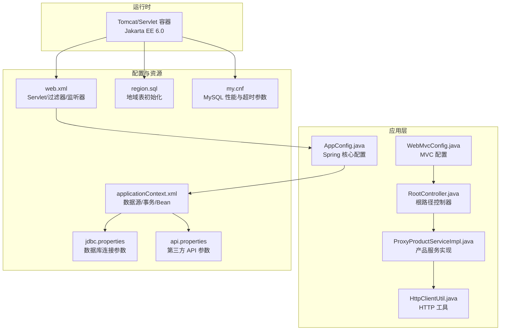
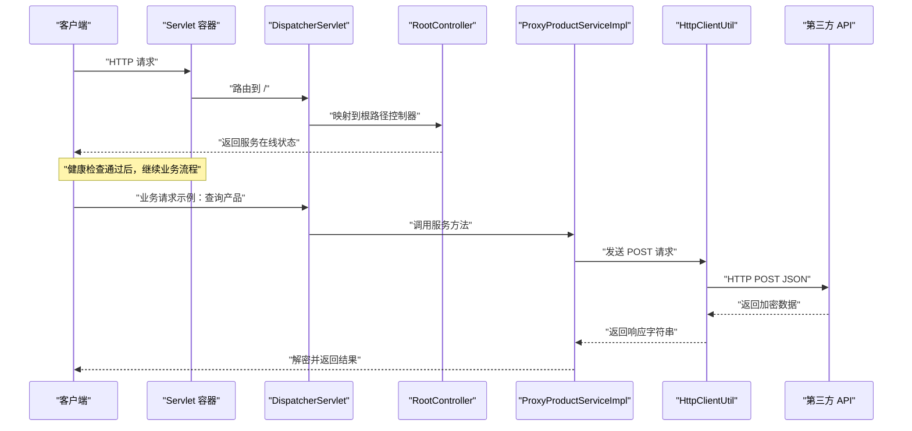
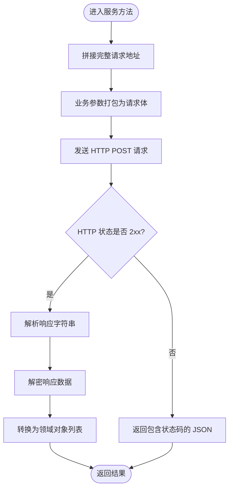
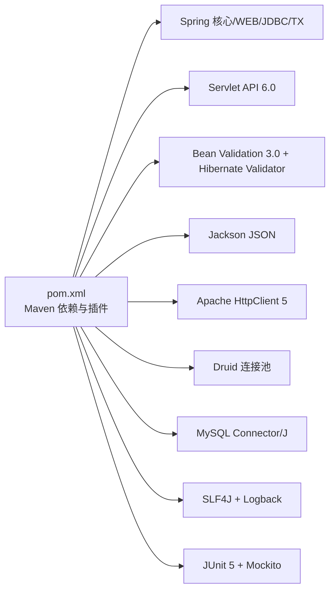

# 快速开始

<cite>
**本文引用的文件**
- [README.md](file://README.md)
- [pom.xml](file://pom.xml)
- [src/main/resources/jdbc.properties](file://src/main/resources/jdbc.properties)
- [src/main/resources/api.properties](file://src/main/resources/api.properties)
- [src/main/resources/applicationContext.xml](file://src/main/resources/applicationContext.xml)
- [src/main/webapp/WEB-INF/web.xml](file://src/main/webapp/WEB-INF/web.xml)
- [src/main/java/cn/linkfast/config/AppConfig.java](file://src/main/java/cn/linkfast/config/AppConfig.java)
- [src/main/java/cn/linkfast/config/WebMvcConfig.java](file://src/main/java/cn/linkfast/config/WebMvcConfig.java)
- [src/main/java/cn/linkfast/config/SnowflakeConfig.java](file://src/main/java/cn/linkfast/config/SnowflakeConfig.java)
- [src/main/java/cn/linkfast/controller/RootController.java](file://src/main/java/cn/linkfast/controller/RootController.java)
- [src/main/java/cn/linkfast/service/impl/ProxyProductServiceImpl.java](file://src/main/java/cn/linkfast/service/impl/ProxyProductServiceImpl.java)
- [src/main/java/cn/linkfast/utils/HttpClientUtil.java](file://src/main/java/cn/linkfast/utils/HttpClientUtil.java)
- [docs/database/region.sql](file://docs/database/region.sql)
- [docs/database/my.cnf](file://docs/database/my.cnf)
- [docs/README.md](file://docs/README.md)
</cite>

## 目录
1. [简介](#简介)
2. [项目结构](#项目结构)
3. [核心组件](#核心组件)
4. [架构总览](#架构总览)
5. [详细组件分析](#详细组件分析)
6. [依赖分析](#依赖分析)
7. [性能考虑](#性能考虑)
8. [故障排查指南](#故障排查指南)
9. [结论](#结论)
10. [附录](#附录)

## 简介
本指南面向新开发者，提供从零开始的 Link-Fast 项目快速部署与运行方案。内容覆盖环境准备（JDK 17、Maven、MySQL）、项目克隆与依赖安装、数据库初始化、配置文件设置、服务启动与健康检查、常见问题排查等，帮助你在最短时间内完成本地开发环境搭建并成功运行系统。

## 项目结构
Link-Fast 是基于 Java 17、Spring 6、MVC 与 XML 配置结合的 Web 工程，打包为 WAR 并通过 Servlet 4.0+/Jakarta EE 6.0 规范运行。核心模块包括：
- 配置层：Spring 核心与 Web MVC 配置、数据源与事务配置
- 控制器层：REST 控制器，提供对外接口入口
- 服务层：业务逻辑与第三方接口对接
- DAO/工具层：数据库访问与 HTTP 工具
- 资源层：数据库初始化脚本、API 与 JDBC 配置

图表来源
- [src/main/webapp/WEB-INF/web.xml:1-73](file://src/main/webapp/WEB-INF/web.xml#L1-L73)
- [src/main/resources/applicationContext.xml:1-67](file://src/main/resources/applicationContext.xml#L1-L67)
- [src/main/resources/jdbc.properties:1-39](file://src/main/resources/jdbc.properties#L1-L39)
- [src/main/resources/api.properties:1-31](file://src/main/resources/api.properties#L1-L31)
- [src/main/java/cn/linkfast/config/AppConfig.java:1-36](file://src/main/java/cn/linkfast/config/AppConfig.java#L1-L36)
- [src/main/java/cn/linkfast/config/WebMvcConfig.java:1-62](file://src/main/java/cn/linkfast/config/WebMvcConfig.java#L1-L62)
- [src/main/java/cn/linkfast/controller/RootController.java:1-20](file://src/main/java/cn/linkfast/controller/RootController.java#L1-L20)
- [src/main/java/cn/linkfast/service/impl/ProxyProductServiceImpl.java:1-175](file://src/main/java/cn/linkfast/service/impl/ProxyProductServiceImpl.java#L1-L175)
- [src/main/java/cn/linkfast/utils/HttpClientUtil.java:1-45](file://src/main/java/cn/linkfast/utils/HttpClientUtil.java#L1-L45)
- [docs/database/region.sql:1-20](file://docs/database/region.sql#L1-L20)
- [docs/database/my.cnf:1-68](file://docs/database/my.cnf#L1-L68)

章节来源
- [README.md:1-1](file://README.md#L1-L1)
- [pom.xml:1-278](file://pom.xml#L1-L278)
- [src/main/webapp/WEB-INF/web.xml:1-73](file://src/main/webapp/WEB-INF/web.xml#L1-L73)
- [src/main/resources/applicationContext.xml:1-67](file://src/main/resources/applicationContext.xml#L1-L67)
- [src/main/resources/jdbc.properties:1-39](file://src/main/resources/jdbc.properties#L1-L39)
- [src/main/resources/api.properties:1-31](file://src/main/resources/api.properties#L1-L31)
- [docs/database/region.sql:1-20](file://docs/database/region.sql#L1-L20)
- [docs/database/my.cnf:1-68](file://docs/database/my.cnf#L1-L68)

## 核心组件
- 应用配置
  - Spring 核心配置类负责业务层与持久层组件扫描及导入 XML 配置
  - Web MVC 配置类负责消息转换器、跨域与默认 Servlet 处理
- 数据源与事务
  - 通过 XML 配置加载 JDBC 与 API 属性文件，使用 Druid 连接池，开启注解事务
- 控制器与服务
  - 根路径控制器提供健康检查接口
  - 产品服务实现对接第三方 API，封装请求与响应处理
- HTTP 工具
  - 基于 Apache HttpClient 5 的简单封装，统一 POST JSON 请求与状态码处理
- 数据库初始化
  - 提供地域表建表脚本，配合 my.cnf 中的超时与连接参数优化

章节来源
- [src/main/java/cn/linkfast/config/AppConfig.java:1-36](file://src/main/java/cn/linkfast/config/AppConfig.java#L1-L36)
- [src/main/java/cn/linkfast/config/WebMvcConfig.java:1-62](file://src/main/java/cn/linkfast/config/WebMvcConfig.java#L1-L62)
- [src/main/resources/applicationContext.xml:1-67](file://src/main/resources/applicationContext.xml#L1-L67)
- [src/main/java/cn/linkfast/controller/RootController.java:1-20](file://src/main/java/cn/linkfast/controller/RootController.java#L1-L20)
- [src/main/java/cn/linkfast/service/impl/ProxyProductServiceImpl.java:1-175](file://src/main/java/cn/linkfast/service/impl/ProxyProductServiceImpl.java#L1-L175)
- [src/main/java/cn/linkfast/utils/HttpClientUtil.java:1-45](file://src/main/java/cn/linkfast/utils/HttpClientUtil.java#L1-L45)
- [docs/database/region.sql:1-20](file://docs/database/region.sql#L1-L20)

## 架构总览
下图展示了从浏览器/客户端到应用与第三方 API 的典型调用链路，以及本地数据库与连接池的关系。

图表来源
- [src/main/webapp/WEB-INF/web.xml:23-40](file://src/main/webapp/WEB-INF/web.xml#L23-L40)
- [src/main/java/cn/linkfast/controller/RootController.java:15-18](file://src/main/java/cn/linkfast/controller/RootController.java#L15-L18)
- [src/main/java/cn/linkfast/service/impl/ProxyProductServiceImpl.java:87-101](file://src/main/java/cn/linkfast/service/impl/ProxyProductServiceImpl.java#L87-L101)
- [src/main/java/cn/linkfast/utils/HttpClientUtil.java:27-43](file://src/main/java/cn/linkfast/utils/HttpClientUtil.java#L27-L43)

## 详细组件分析

### 环境准备与安装
- JDK 17
  - 项目使用 Java 17 编译与运行，确保本地已安装 JDK 17，并正确配置 JAVA_HOME 与 PATH
- Maven
  - 使用 Maven 3.6+ 构建项目，确保网络可访问中央仓库或镜像
- MySQL
  - 使用 MySQL Connector/J 8.4.0，建议使用 MySQL 8.x；参考 my.cnf 中的超时与连接参数进行优化

章节来源
- [pom.xml:12-20](file://pom.xml#L12-L20)
- [pom.xml:107-111](file://pom.xml#L107-L111)
- [docs/database/my.cnf:32-48](file://docs/database/my.cnf#L32-L48)

### 项目克隆与依赖安装
- 克隆仓库后，在项目根目录执行构建命令以下载依赖并打包
- 若需要跳过集成测试，可在构建时添加相应参数

章节来源
- [pom.xml:223-276](file://pom.xml#L223-L276)

### 数据库初始化
- 在 MySQL 中创建数据库与用户（账号密码来自 JDBC 配置）
- 执行地域表初始化脚本，创建代理地域信息表
- 如需批量插入或高并发场景，参考 my.cnf 中的连接与缓冲参数

章节来源
- [src/main/resources/jdbc.properties:33-34](file://src/main/resources/jdbc.properties#L33-L34)
- [docs/database/region.sql:1-20](file://docs/database/region.sql#L1-L20)
- [docs/database/my.cnf:44-68](file://docs/database/my.cnf#L44-L68)

### 配置文件设置
- JDBC 连接配置
  - 驱动类、URL、用户名、密码均在 JDBC 属性文件中配置
  - 连接池参数在 Spring XML 中集中配置，包含初始大小、最大活跃数、空闲回收策略等
- API 密钥配置
  - 生产/沙盒环境、基础 URL、AppKey/Secret、各接口路径均在 API 属性文件中配置
  - 服务实现会根据环境变量动态选择目标域名与路径
- Spring 与 Web 配置
  - web.xml 指定 Spring 上下文与 MVC 配置类
  - AppConfig 导入 XML 配置，WebMvcConfig 配置消息转换器、跨域与默认 Servlet

章节来源
- [src/main/resources/jdbc.properties:1-39](file://src/main/resources/jdbc.properties#L1-L39)
- [src/main/resources/applicationContext.xml:14-67](file://src/main/resources/applicationContext.xml#L14-L67)
- [src/main/resources/api.properties:1-31](file://src/main/resources/api.properties#L1-L31)
- [src/main/java/cn/linkfast/service/impl/ProxyProductServiceImpl.java:42-54](file://src/main/java/cn/linkfast/service/impl/ProxyProductServiceImpl.java#L42-L54)
- [src/main/webapp/WEB-INF/web.xml:10-35](file://src/main/webapp/WEB-INF/web.xml#L10-L35)
- [src/main/java/cn/linkfast/config/AppConfig.java:24-24](file://src/main/java/cn/linkfast/config/AppConfig.java#L24-L24)
- [src/main/java/cn/linkfast/config/WebMvcConfig.java:21-62](file://src/main/java/cn/linkfast/config/WebMvcConfig.java#L21-L62)

### 启动项目与验证
- 启动方式
  - 作为 WAR 部署至支持 Jakarta EE 6.0 的 Servlet 容器（如 Tomcat）
  - 通过容器的管理界面或命令行启动
- 健康检查
  - 访问根路径接口，确认返回服务在线状态
- 业务验证
  - 调用产品查询接口，观察是否能从第三方 API 正常返回数据

章节来源
- [src/main/webapp/WEB-INF/web.xml:23-40](file://src/main/webapp/WEB-INF/web.xml#L23-L40)
- [src/main/java/cn/linkfast/controller/RootController.java:15-18](file://src/main/java/cn/linkfast/controller/RootController.java#L15-L18)
- [src/main/java/cn/linkfast/service/impl/ProxyProductServiceImpl.java:87-101](file://src/main/java/cn/linkfast/service/impl/ProxyProductServiceImpl.java#L87-L101)

### 关键流程与算法说明
- 第三方接口调用流程
  - 服务实现将业务参数打包为请求体，通过 HTTP 工具发送 POST 请求
  - 对响应进行解析与解密，再转换为领域对象列表
- HTTP 请求处理
  - 工具封装了 Apache HttpClient 5 的 POST 请求，统一处理状态码与字符集

图表来源
- [src/main/java/cn/linkfast/service/impl/ProxyProductServiceImpl.java:87-101](file://src/main/java/cn/linkfast/service/impl/ProxyProductServiceImpl.java#L87-L101)
- [src/main/java/cn/linkfast/utils/HttpClientUtil.java:27-43](file://src/main/java/cn/linkfast/utils/HttpClientUtil.java#L27-L43)

## 依赖分析
- 运行时依赖
  - Spring Web、WebMVC、JDBC、事务管理
  - Servlet API 6.0、Jakarta 注解、Bean Validation 3.0/Hibernate Validator
  - Jackson JSON 处理、Apache HttpClient 5
  - Druid 连接池、MySQL Connector/J
  - 日志 SLF4J + Logback
- 构建与测试
  - Maven 编译插件、资源编码、WAR 打包
  - 集成测试插件与 JUnit 5/Mockito

图表来源
- [pom.xml:22-213](file://pom.xml#L22-L213)
- [pom.xml:223-276](file://pom.xml#L223-L276)

章节来源
- [pom.xml:12-20](file://pom.xml#L12-L20)
- [pom.xml:22-213](file://pom.xml#L22-L213)
- [pom.xml:223-276](file://pom.xml#L223-L276)

## 性能考虑
- 连接池与超时
  - 连接池参数在 XML 中集中配置，包含初始大小、最小空闲、最大活跃、最大等待等
  - my.cnf 中设置了 wait_timeout、interactive_timeout、connect_timeout、net_read/write_timeout 等，避免 JDBC 连接被 MySQL 主动回收导致异常
- 批量插入与写入优化
  - my.cnf 中针对 max_allowed_packet、innodb_buffer_pool_size、日志文件大小与刷新策略进行了优化
- 环境与路径选择
  - 服务实现根据环境变量动态切换生产/沙盒域名，减少误操作风险

章节来源
- [src/main/resources/applicationContext.xml:23-52](file://src/main/resources/applicationContext.xml#L23-L52)
- [docs/database/my.cnf:32-68](file://docs/database/my.cnf#L32-L68)
- [src/main/java/cn/linkfast/service/impl/ProxyProductServiceImpl.java:76-84](file://src/main/java/cn/linkfast/service/impl/ProxyProductServiceImpl.java#L76-L84)

## 故障排查指南
- 无法连接数据库
  - 检查 JDBC URL、用户名、密码是否正确
  - 确认 MySQL 服务已启动，防火墙放行端口
  - 参考 my.cnf 中的超时与连接上限参数，必要时适当提高
- 连接池耗尽或频繁回收
  - 检查连接池初始大小、最大活跃、最大等待与空闲回收间隔
  - 关注 removeAbandoned 超时设置，排查是否存在连接未释放的代码路径
- 第三方接口调用失败
  - 查看 HTTP 工具返回的状态码 JSON，定位具体错误
  - 确认 API 属性文件中的环境、域名与路径配置正确
- 服务启动后无法访问根路径
  - 检查 web.xml 中的 DispatcherServlet 映射与上下文配置
  - 确认根路径控制器存在且返回正常结果

章节来源
- [src/main/resources/jdbc.properties:3-34](file://src/main/resources/jdbc.properties#L3-L34)
- [docs/database/my.cnf:32-48](file://docs/database/my.cnf#L32-L48)
- [src/main/resources/applicationContext.xml:23-52](file://src/main/resources/applicationContext.xml#L23-L52)
- [src/main/java/cn/linkfast/utils/HttpClientUtil.java:37-41](file://src/main/java/cn/linkfast/utils/HttpClientUtil.java#L37-L41)
- [src/main/resources/api.properties:1-31](file://src/main/resources/api.properties#L1-L31)
- [src/main/webapp/WEB-INF/web.xml:23-40](file://src/main/webapp/WEB-INF/web.xml#L23-L40)
- [src/main/java/cn/linkfast/controller/RootController.java:15-18](file://src/main/java/cn/linkfast/controller/RootController.java#L15-L18)

## 结论
通过本指南，你可以在本地完成 JDK 17、Maven、MySQL 的安装与配置，克隆项目并完成依赖安装，初始化数据库，正确设置 JDBC 与 API 配置，随后启动服务并通过根路径接口验证运行状态。遇到问题时，可依据故障排查章节逐项检查配置与连接参数，确保系统稳定运行。

## 附录
- 目录说明
  - 文档目录用于存放仅供开发者阅读的文档，不参与程序运行
  - 包含内部与第三方接口文档、Nginx 配置说明、数据库初始化脚本与 MySQL 配置样例

章节来源
- [docs/README.md:1-12](file://docs/README.md#L1-L12)