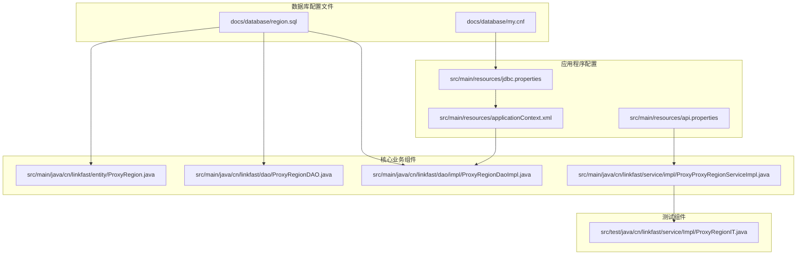
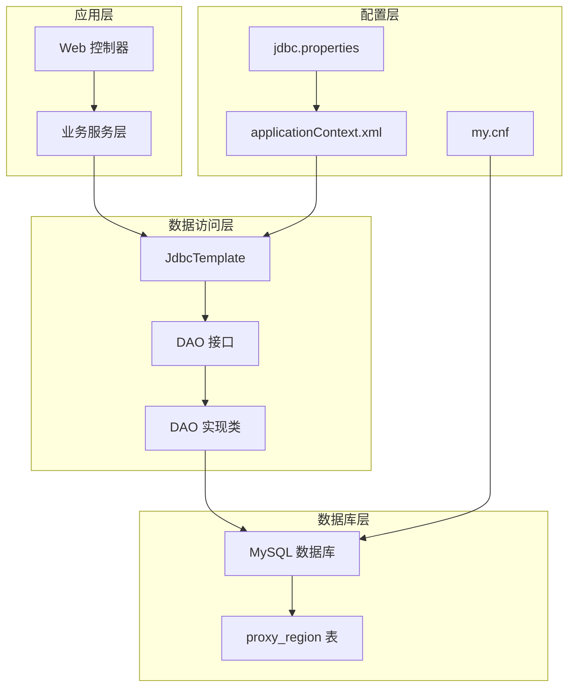
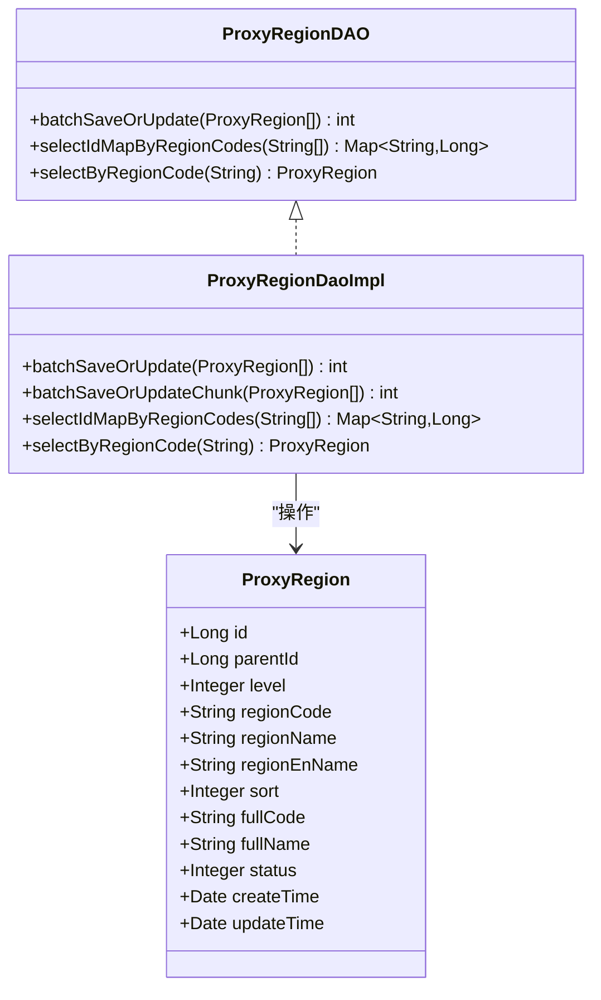
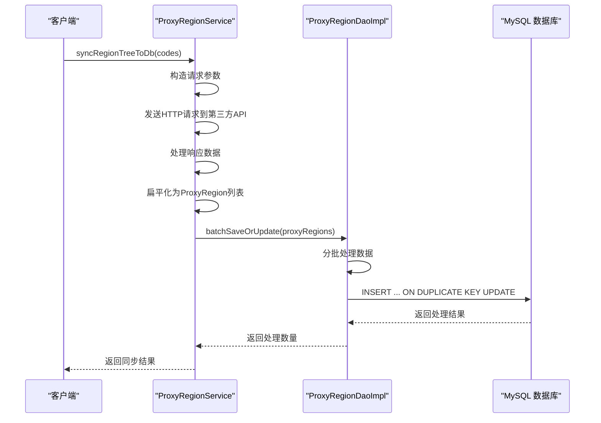
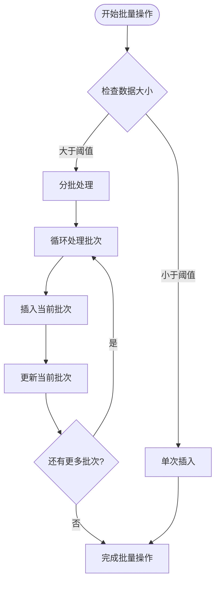
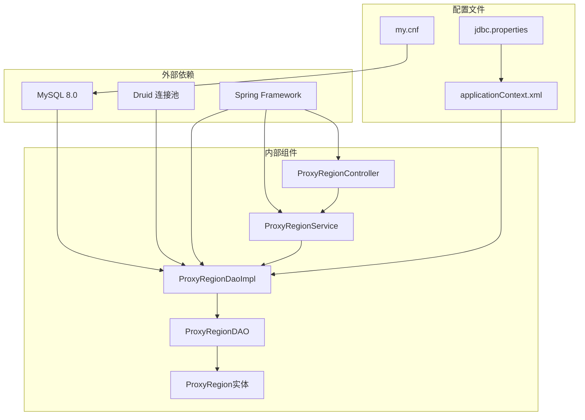

# 数据库初始化脚本

<cite>
**本文引用的文件**
- [region.sql](file://docs/database/region.sql)
- [my.cnf](file://docs/database/my.cnf)
- [jdbc.properties](file://src/main/resources/jdbc.properties)
- [applicationContext.xml](file://src/main/resources/applicationContext.xml)
- [ProxyRegion.java](file://src/main/java/cn/linkfast/entity/ProxyRegion.java)
- [ProxyRegionDAO.java](file://src/main/java/cn/linkfast/dao/ProxyRegionDAO.java)
- [ProxyRegionDaoImpl.java](file://src/main/java/cn/linkfast/dao/impl/ProxyRegionDaoImpl.java)
- [ProxyProxyRegionServiceImpl.java](file://src/main/java/cn/linkfast/service/impl/ProxyProxyRegionServiceImpl.java)
- [ProxyRegionIT.java](file://src/test/java/cn/linkfast/service/Impl/ProxyRegionIT.java)
- [api.properties](file://src/main/resources/api.properties)
</cite>

## 目录
1. [简介](#简介)
2. [项目结构](#项目结构)
3. [核心组件](#核心组件)
4. [架构概览](#架构概览)
5. [详细组件分析](#详细组件分析)
6. [依赖分析](#依赖分析)
7. [性能考虑](#性能考虑)
8. [故障排除指南](#故障排除指南)
9. [结论](#结论)
10. [附录](#附录)

## 简介
本文档为 Link-Fast 项目提供完整的数据库初始化脚本文档，涵盖数据库创建、表结构初始化和基础数据导入的步骤说明。重点解释 region.sql 脚本的内容和执行顺序，包括表创建语句、索引定义和约束设置。同时说明数据库配置文件 my.cnf 中的关键参数设置，包括字符集、存储引擎、缓冲区大小等配置项。提供数据库连接配置说明，包括 jdbc.properties 中的连接参数、连接池设置和认证配置。包含数据库初始化的完整流程、常见错误处理和验证方法，为运维人员提供数据库部署和配置的标准操作流程。

## 项目结构
Link-Fast 项目的数据库相关文件主要分布在以下位置：

**图表来源**
- [region.sql:1-20](file://docs/database/region.sql#L1-L20)
- [my.cnf:1-68](file://docs/database/my.cnf#L1-L68)
- [jdbc.properties:1-39](file://src/main/resources/jdbc.properties#L1-L39)
- [applicationContext.xml:1-67](file://src/main/resources/applicationContext.xml#L1-L67)

**章节来源**
- [region.sql:1-20](file://docs/database/region.sql#L1-L20)
- [my.cnf:1-68](file://docs/database/my.cnf#L1-L68)
- [jdbc.properties:1-39](file://src/main/resources/jdbc.properties#L1-L39)
- [applicationContext.xml:1-67](file://src/main/resources/applicationContext.xml#L1-L67)

## 核心组件
Link-Fast 项目的数据库初始化涉及以下核心组件：

### 数据库表结构
项目使用单一的地域信息表来存储大洲-国家-州省-城市四级的地理信息。该表设计支持高效的层级查询和快速的数据检索。

### 数据库配置
系统采用 MySQL 作为主数据库，使用 Druid 连接池进行连接管理，支持批量操作和事务处理。

### 应用程序集成
通过 Spring Framework 的 JdbcTemplate 和 DAO 模式实现数据库访问，支持批量插入和更新操作。

**章节来源**
- [ProxyRegion.java:1-31](file://src/main/java/cn/linkfast/entity/ProxyRegion.java#L1-L31)
- [ProxyRegionDAO.java:1-36](file://src/main/java/cn/linkfast/dao/ProxyRegionDAO.java#L1-L36)
- [ProxyRegionDaoImpl.java:44-153](file://src/main/java/cn/linkfast/dao/impl/ProxyRegionDaoImpl.java#L44-L153)

## 架构概览
Link-Fast 项目的数据库架构采用分层设计，从上到下分别为应用层、服务层、数据访问层和数据库层：

**图表来源**
- [applicationContext.xml:1-67](file://src/main/resources/applicationContext.xml#L1-L67)
- [jdbc.properties:1-39](file://src/main/resources/jdbc.properties#L1-L39)
- [my.cnf:1-68](file://docs/database/my.cnf#L1-L68)

## 详细组件分析

### region.sql 脚本详解

#### 表结构设计
region.sql 脚本定义了完整的地域信息表结构，包含以下关键特性：

**主键和标识符**
- 使用自增主键 `id` 作为唯一标识符
- `parent_id` 字段支持层级关系的父子关联

**层级结构**
- `level` 字段定义层级：1=大洲，2=国家，3=州/省，4=城市
- 支持四级地理层级的完整覆盖

**唯一性约束**
- `region_code` 唯一索引确保每个地理区域的编码唯一性
- 防止重复节点的创建

**索引优化**
- 多个复合索引优化不同查询场景
- 支持按父节点查询、按层级查询和全路径查询

#### 索引设计分析

**图表来源**
- [ProxyRegion.java:1-31](file://src/main/java/cn/linkfast/entity/ProxyRegion.java#L1-L31)
- [ProxyRegionDAO.java:1-36](file://src/main/java/cn/linkfast/dao/ProxyRegionDAO.java#L1-L36)
- [ProxyRegionDaoImpl.java:44-153](file://src/main/java/cn/linkfast/dao/impl/ProxyRegionDaoImpl.java#L44-L153)

#### 执行顺序和流程

**图表来源**
- [ProxyProxyRegionServiceImpl.java:88-154](file://src/main/java/cn/linkfast/service/impl/ProxyProxyRegionServiceImpl.java#L88-L154)
- [ProxyRegionDaoImpl.java:44-153](file://src/main/java/cn/linkfast/dao/impl/ProxyRegionDaoImpl.java#L44-L153)

**章节来源**
- [region.sql:1-20](file://docs/database/region.sql#L1-L20)
- [ProxyRegion.java:1-31](file://src/main/java/cn/linkfast/entity/ProxyRegion.java#L1-L31)
- [ProxyRegionDAO.java:1-36](file://src/main/java/cn/linkfast/dao/ProxyRegionDAO.java#L1-L36)
- [ProxyRegionDaoImpl.java:44-153](file://src/main/java/cn/linkfast/dao/impl/ProxyRegionDaoImpl.java#L44-L153)

### 数据库配置文件分析

#### my.cnf 配置详解

**连接超时配置**
- `wait_timeout = 7200`：非交互式连接空闲超时时间为7200秒（2小时）
- `interactive_timeout = 7200`：交互式连接空闲超时时间与非交互式保持一致
- `connect_timeout = 30`：连接建立超时时间为30秒
- `net_read_timeout = 60`：读取数据超时时间为60秒
- `net_write_timeout = 120`：写入数据超时时间为120秒

**连接数配置**
- `max_connections = 200`：最大连接数设置为200
- `max_user_connections = 180`：单用户最大连接数为180

**批量插入优化**
- `max_allowed_packet = 64M`：最大数据包大小为64MB
- `innodb_buffer_pool_size = 2G`：InnoDB缓冲池大小为2GB
- `innodb_flush_log_at_trx_commit = 2`：事务日志每秒刷盘
- `innodb_log_file_size = 512M`：InnoDB日志文件大小为512MB
- `innodb_log_buffer_size = 64M`：InnoDB日志缓冲区大小为64MB

**字符集和性能配置**
- `character-set-server = utf8mb4`：服务器字符集设置为utf8mb4
- `collation-server = utf8mb4_general_ci`：服务器校对规则
- `skip-name-resolve`：关闭DNS解析，提升连接速度

**章节来源**
- [my.cnf:1-68](file://docs/database/my.cnf#L1-L68)

#### JDBC 连接配置

**连接参数设置**
- `jdbc.driver=com.mysql.cj.jdbc.Driver`：MySQL驱动程序
- `jdbc.url`：数据库连接URL，包含多个优化参数
- `jdbc.username=root`：数据库用户名
- `jdbc.password=LinkFast888!`：数据库密码

**连接池配置**
- `initialSize=5`：初始连接数为5
- `minIdle=5`：最小空闲连接数为5
- `maxActive=20`：最大活跃连接数为20
- `maxWait=120000`：最大等待时间为120秒

**章节来源**
- [jdbc.properties:1-39](file://src/main/resources/jdbc.properties#L1-L39)
- [applicationContext.xml:1-67](file://src/main/resources/applicationContext.xml#L1-L67)

### 数据访问层实现

#### 批量操作机制

**图表来源**
- [ProxyRegionDaoImpl.java:44-52](file://src/main/java/cn/linkfast/dao/impl/ProxyRegionDaoImpl.java#L44-L52)

#### 数据同步流程

**章节来源**
- [ProxyRegionDaoImpl.java:44-153](file://src/main/java/cn/linkfast/dao/impl/ProxyRegionDaoImpl.java#L44-L153)
- [ProxyProxyRegionServiceImpl.java:88-154](file://src/main/java/cn/linkfast/service/impl/ProxyProxyRegionServiceImpl.java#L88-L154)

## 依赖分析

### 组件间依赖关系

**图表来源**
- [applicationContext.xml:1-67](file://src/main/resources/applicationContext.xml#L1-L67)
- [jdbc.properties:1-39](file://src/main/resources/jdbc.properties#L1-L39)
- [my.cnf:1-68](file://docs/database/my.cnf#L1-L68)

### 数据流分析

**章节来源**
- [ProxyRegionIT.java:1-87](file://src/test/java/cn/linkfast/service/Impl/ProxyRegionIT.java#L1-L87)

## 性能考虑

### 数据库性能优化

**索引策略**
- 层级+父节点联合索引优化级联查询
- 全路径编码索引支持快速路径查询
- 编码唯一索引确保数据完整性

**批量操作优化**
- 分批处理机制避免单次操作过大
- ON DUPLICATE KEY UPDATE 提升更新效率
- 连接池配置支持并发操作

**内存配置**
- InnoDB缓冲池大小根据服务器内存动态调整
- 日志文件大小优化批量写入性能
- 缓冲区大小配置适应不同操作场景

## 故障排除指南

### 常见问题及解决方案

**连接超时问题**
- 检查 `wait_timeout` 和 `interactive_timeout` 设置
- 验证 `max_connections` 是否足够
- 确认网络连接稳定性

**批量插入失败**
- 检查 `max_allowed_packet` 大小设置
- 验证 `sql_mode` 配置是否过于严格
- 确认连接池配置是否合理

**数据同步异常**
- 检查第三方API接口可用性
- 验证 `socketTimeout` 和 `connectTimeout` 设置
- 确认 `autoReconnect` 功能正常

**章节来源**
- [ProxyRegionIT.java:32-36](file://src/test/java/cn/linkfast/service/Impl/ProxyRegionIT.java#L32-L36)

### 验证方法

**数据完整性验证**
- 使用 `COUNT(*)` 验证记录数量
- 通过 `UNIQUE KEY` 检查重复数据
- 验证层级关系的正确性

**性能验证**
- 监控连接池使用情况
- 检查索引使用效果
- 验证批量操作性能

## 结论
Link-Fast 项目的数据库初始化方案提供了完整的地理信息管理能力。通过精心设计的表结构、优化的索引策略和合理的配置参数，系统能够高效地处理大规模的地理数据。配合完善的连接池配置和批量操作机制，项目能够在保证数据一致性的同时提供良好的性能表现。运维人员可以按照本文档提供的标准流程进行数据库部署和配置，确保系统的稳定运行。

## 附录

### 完整初始化流程

**第一步：数据库准备**
1. 创建数据库实例
2. 配置 MySQL 服务器参数
3. 设置字符集和排序规则

**第二步：表结构初始化**
1. 执行 region.sql 脚本
2. 验证表结构完整性
3. 检查索引创建状态

**第三步：应用配置**
1. 配置 jdbc.properties
2. 设置数据库连接参数
3. 验证连接池配置

**第四步：数据同步**
1. 启动应用服务
2. 执行地域数据同步
3. 验证数据完整性

**第五步：性能监控**
1. 监控数据库性能指标
2. 调整配置参数
3. 优化索引使用

### 配置参数参考表

| 配置类别 | 参数名称 | 默认值 | 说明 |
|---------|---------|--------|------|
| 连接超时 | wait_timeout | 7200秒 | 非交互式连接超时 |
| 连接超时 | interactive_timeout | 7200秒 | 交互式连接超时 |
| 连接数 | max_connections | 200 | 最大连接数 |
| 连接数 | max_user_connections | 180 | 单用户最大连接数 |
| 批量操作 | max_allowed_packet | 64M | 最大数据包大小 |
| 缓冲区 | innodb_buffer_pool_size | 2G | InnoDB缓冲池大小 |
| 字符集 | character-set-server | utf8mb4 | 服务器字符集 |