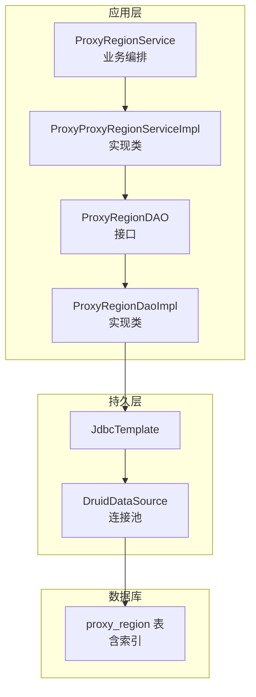
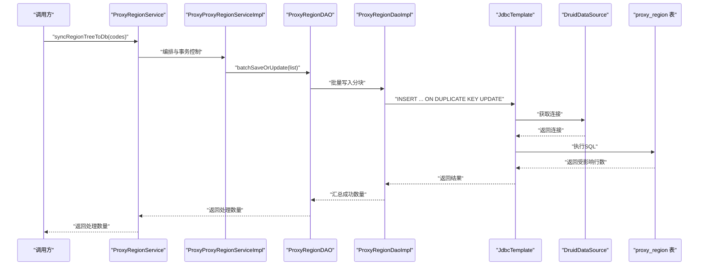
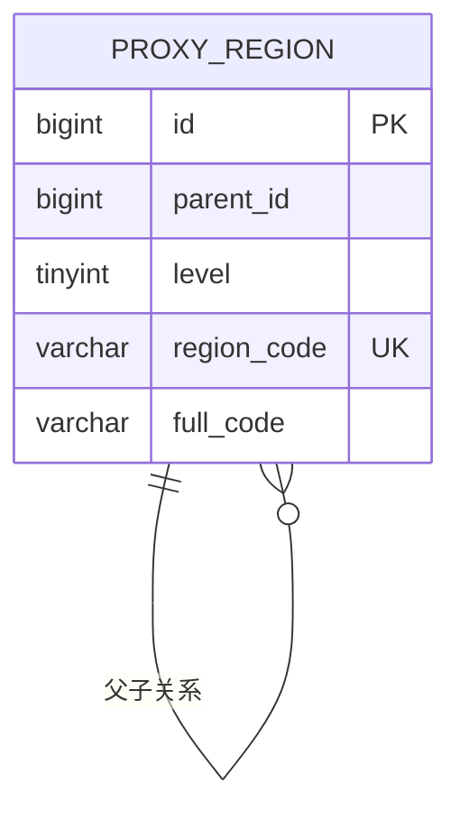
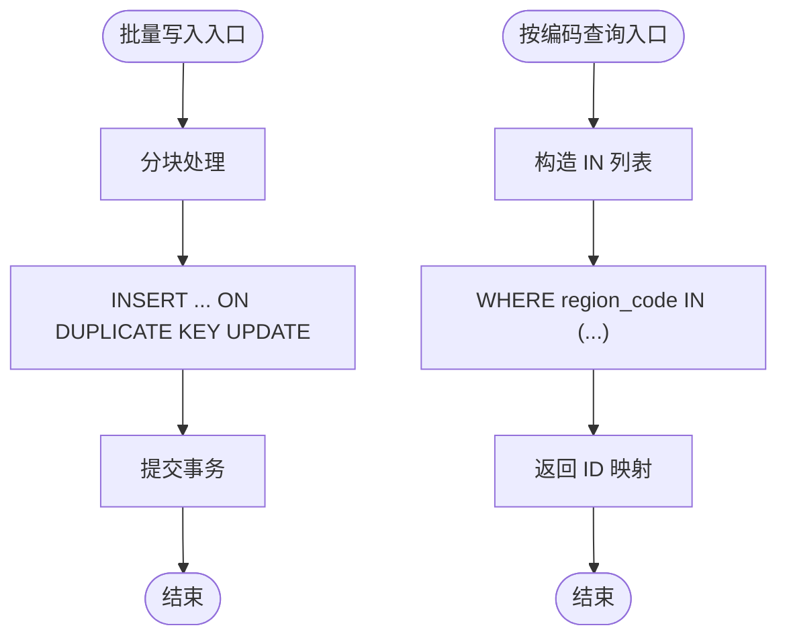
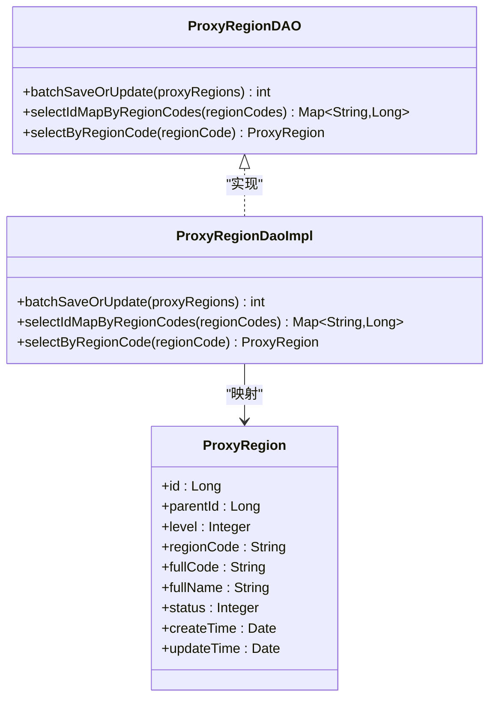

# 数据库索引设计

<cite>
**本文引用的文件**
- [region.sql](file://docs/database/region.sql)
- [my.cnf](file://docs/database/my.cnf)
- [ProxyRegionDAO.java](file://src/main/java/cn/linkfast/dao/ProxyRegionDAO.java)
- [ProxyRegionDaoImpl.java](file://src/main/java/cn/linkfast/dao/impl/ProxyRegionDaoImpl.java)
- [ProxyRegion.java](file://src/main/java/cn/linkfast/entity/ProxyRegion.java)
- [ProxyRegionService.java](file://src/main/java/cn/linkfast/service/ProxyRegionService.java)
- [ProxyProxyRegionServiceImpl.java](file://src/main/java/cn/linkfast/service/impl/ProxyProxyRegionServiceImpl.java)
- [ProxyRegionIT.java](file://src/test/java/cn/linkfast/service/Impl/ProxyRegionIT.java)
- [applicationContext.xml](file://src/main/resources/applicationContext.xml)
- [jdbc.properties](file://src/main/resources/jdbc.properties)
</cite>

## 目录
1. [简介](#简介)
2. [项目结构](#项目结构)
3. [核心组件](#核心组件)
4. [架构总览](#架构总览)
5. [详细组件分析](#详细组件分析)
6. [依赖关系分析](#依赖关系分析)
7. [性能考量](#性能考量)
8. [故障排查指南](#故障排查指南)
9. [结论](#结论)
10. [附录](#附录)

## 简介
本文件面向数据库管理员与后端工程师，系统化梳理 Link-Fast 项目的数据库索引设计，重点围绕 proxy_region 表的主键索引、唯一索引、复合索引与全路径索引，解释其设计原理、适用场景与查询优化效果，并提供索引性能评估方法、查询计划分析与监控策略，以及索引维护最佳实践、失效原因分析与性能调优建议。

## 项目结构
- 数据库定义位于 docs/database/region.sql，包含 proxy_region 表的建表语句与索引声明。
- 应用层通过 Spring JDBC 访问数据库，DAO 层负责批量写入与按编码查询，Service 层负责业务编排与第三方接口同步。
- 连接池与 JDBC 参数在 src/main/resources/applicationContext.xml 与 jdbc.properties 中配置，影响批量写入与查询性能。

图表来源
- [ProxyRegionService.java:1-21](file://src/main/java/cn/linkfast/service/ProxyRegionService.java#L1-L21)
- [ProxyProxyRegionServiceImpl.java:1-44](file://src/main/java/cn/linkfast/service/impl/ProxyProxyRegionServiceImpl.java#L1-L44)
- [ProxyRegionDAO.java:1-36](file://src/main/java/cn/linkfast/dao/ProxyRegionDAO.java#L1-L36)
- [ProxyRegionDaoImpl.java:44-153](file://src/main/java/cn/linkfast/dao/impl/ProxyRegionDaoImpl.java#L44-L153)
- [applicationContext.xml:17-57](file://src/main/resources/applicationContext.xml#L17-L57)
- [jdbc.properties:1-39](file://src/main/resources/jdbc.properties#L1-L39)
- [region.sql:1-20](file://docs/database/region.sql#L1-L20)

章节来源
- [region.sql:1-20](file://docs/database/region.sql#L1-L20)
- [ProxyRegionDAO.java:1-36](file://src/main/java/cn/linkfast/dao/ProxyRegionDAO.java#L1-L36)
- [ProxyRegionDaoImpl.java:44-153](file://src/main/java/cn/linkfast/dao/impl/ProxyRegionDaoImpl.java#L44-L153)
- [applicationContext.xml:17-57](file://src/main/resources/applicationContext.xml#L17-L57)
- [jdbc.properties:1-39](file://src/main/resources/jdbc.properties#L1-L39)

## 核心组件
- proxy_region 表：存储大洲-国家-州省-城市四级树形地理信息，包含主键、唯一编码、层级、父节点、全路径编码/名称、排序与状态等字段。
- 索引策略：
  - 主键索引：id（自增主键，保证行唯一性与聚簇存储顺序）
  - 唯一索引：uk_region_code（region_code 唯一，支撑 upsert 与按编码精确查找）
  - 复合索引：
    - idx_parent_id(parent_id)
    - idx_level(level)
    - idx_level_parent_id(level, parent_id)（核心：支持按层级+父节点的高效过滤）
    - idx_full_code(full_code)（支持按全路径前缀或全路径范围查询）

章节来源
- [region.sql:1-20](file://docs/database/region.sql#L1-L20)

## 架构总览
- 写入路径：Service 调用 DAO 批量写入，使用 INSERT ... ON DUPLICATE KEY UPDATE，依赖 uk_region_code 唯一索引进行 upsert。
- 读取路径：DAO 提供按 region_code 的单条查询与批量映射查询，均利用唯一索引与全路径索引进行高效检索。
- 连接与参数：Druid 连接池与 JDBC URL 参数优化批量写入与长连接稳定性，配合 MySQL 等待超时与缓冲池配置，保障大规模同步性能。

图表来源
- [ProxyRegionService.java:14-20](file://src/main/java/cn/linkfast/service/ProxyRegionService.java#L14-L20)
- [ProxyProxyRegionServiceImpl.java:1-44](file://src/main/java/cn/linkfast/service/impl/ProxyProxyRegionServiceImpl.java#L1-L44)
- [ProxyRegionDAO.java:14-19](file://src/main/java/cn/linkfast/dao/ProxyRegionDAO.java#L14-L19)
- [ProxyRegionDaoImpl.java:54-69](file://src/main/java/cn/linkfast/dao/impl/ProxyRegionDaoImpl.java#L54-L69)
- [applicationContext.xml:17-57](file://src/main/resources/applicationContext.xml#L17-L57)
- [jdbc.properties:5-17](file://src/main/resources/jdbc.properties#L5-L17)

## 详细组件分析

### proxy_region 表索引设计与查询优化
- 主键索引（id）
  - 设计要点：自增主键，确保行唯一性与聚簇存储顺序，有利于范围扫描与顺序写入。
  - 适用场景：主键查询、自增主键的范围扫描、JOIN 的连接键。
- 唯一索引（uk_region_code）
  - 设计要点：region_code 唯一，支撑 upsert 与按编码的精确查找。
  - 适用场景：批量写入时的 ON DUPLICATE KEY UPDATE、按编码查询单条记录、按编码批量映射 ID。
- 复合索引
  - idx_parent_id(parent_id)
    - 设计要点：加速“查询某父节点下的所有子节点”的场景。
    - 适用场景：树形结构的子节点遍历、按父节点过滤。
  - idx_level(level)
    - 设计要点：加速“查询某一层级的所有节点”的场景。
    - 适用场景：按层级筛选（如国家、州省、城市）。
  - idx_level_parent_id(level, parent_id)（核心）
    - 设计要点：联合索引，覆盖“按层级+父节点”组合条件，显著降低回表成本。
    - 适用场景：树形构建、按层级+父节点的过滤与排序、范围扫描。
  - idx_full_code(full_code)
    - 设计要点：全路径编码索引，支持前缀匹配与范围查询。
    - 适用场景：按全路径前缀查询、路径导航、范围检索。

图表来源
- [region.sql:1-20](file://docs/database/region.sql#L1-L20)

章节来源
- [region.sql:14-19](file://docs/database/region.sql#L14-L19)

### DAO 层实现与索引使用
- 批量写入（upsert）
  - 使用 INSERT ... ON DUPLICATE KEY UPDATE，依赖 uk_region_code 唯一索引进行冲突判断与更新。
  - 通过分块批量写入，结合 JDBC rewriteBatchedStatements 与 Druid 连接池，提升吞吐。
- 按编码查询 ID 映射
  - 使用 IN 子句查询 region_code → id 映射，利用唯一索引进行高效查找。
- 单条按编码查询
  - 使用等值条件查询单条记录，利用唯一索引进行快速定位。

图表来源
- [ProxyRegionDaoImpl.java:54-69](file://src/main/java/cn/linkfast/dao/impl/ProxyRegionDaoImpl.java#L54-L69)
- [ProxyRegionDaoImpl.java:103-125](file://src/main/java/cn/linkfast/dao/impl/ProxyRegionDaoImpl.java#L103-L125)
- [ProxyRegionDaoImpl.java:127-152](file://src/main/java/cn/linkfast/dao/impl/ProxyRegionDaoImpl.java#L127-L152)

章节来源
- [ProxyRegionDAO.java:14-36](file://src/main/java/cn/linkfast/dao/ProxyRegionDAO.java#L14-L36)
- [ProxyRegionDaoImpl.java:54-69](file://src/main/java/cn/linkfast/dao/impl/ProxyRegionDaoImpl.java#L54-L69)
- [ProxyRegionDaoImpl.java:103-152](file://src/main/java/cn/linkfast/dao/impl/ProxyRegionDaoImpl.java#L103-L152)

### Service 层业务流程与索引协同
- 业务职责：从第三方接口拉取地域树，解析为树形结构，转换为扁平化节点，调用 DAO 批量写入数据库。
- 索引协同：批量写入依赖 uk_region_code 唯一索引；查询阶段依赖 uk_region_code 与 idx_full_code 等索引，提升读写性能。

章节来源
- [ProxyRegionService.java:12-21](file://src/main/java/cn/linkfast/service/ProxyRegionService.java#L12-L21)
- [ProxyProxyRegionServiceImpl.java:24-44](file://src/main/java/cn/linkfast/service/impl/ProxyProxyRegionServiceImpl.java#L24-L44)

## 依赖关系分析
- DAO 接口与实现：ProxyRegionDAO 定义方法，ProxyRegionDaoImpl 实现具体 SQL。
- Entity 映射：ProxyRegion 实体对应 proxy_region 表字段，用于查询结果映射。
- 连接池与 JDBC：applicationContext.xml 配置 Druid 连接池，jdbc.properties 提供 JDBC URL 参数，二者共同保障批量写入与长连接稳定性。
- 数据库配置：my.cnf 设置 wait_timeout、max_connections、innodb_buffer_pool_size 等，影响连接生命周期与缓存命中。

图表来源
- [ProxyRegionDAO.java:1-36](file://src/main/java/cn/linkfast/dao/ProxyRegionDAO.java#L1-L36)
- [ProxyRegionDaoImpl.java:44-153](file://src/main/java/cn/linkfast/dao/impl/ProxyRegionDaoImpl.java#L44-L153)
- [ProxyRegion.java:1-31](file://src/main/java/cn/linkfast/entity/ProxyRegion.java#L1-L31)

章节来源
- [ProxyRegionDAO.java:1-36](file://src/main/java/cn/linkfast/dao/ProxyRegionDAO.java#L1-L36)
- [ProxyRegionDaoImpl.java:44-153](file://src/main/java/cn/linkfast/dao/impl/ProxyRegionDaoImpl.java#L44-L153)
- [ProxyRegion.java:1-31](file://src/main/java/cn/linkfast/entity/ProxyRegion.java#L1-L31)

## 性能考量
- 索引选择性与覆盖性
  - uk_region_code 具备高选择性，适合等值查找与 upsert。
  - idx_level_parent_id 覆盖“层级+父节点”组合过滤，避免回表与额外排序。
  - idx_full_code 支持前缀匹配与范围扫描，适合路径导航。
- 批量写入优化
  - 启用 rewriteBatchedStatements，合并多条 INSERT/UPDATE 为批处理，减少往返。
  - 分块批量写入，避免单次事务过大导致锁竞争与超时。
  - 连接池参数（maxActive、minEvictableIdleTimeMillis）与 MySQL wait_timeout 协调，避免连接回收导致的断连。
- 查询计划分析
  - 使用 EXPLAIN 分析 SQL 的 key、rows、Extra 等字段，确认是否命中预期索引、是否存在回表、是否使用临时表或文件排序。
  - 对于 IN 查询，关注 IN 列表大小与索引选择性，必要时拆分批次。
- 监控策略
  - 指标：慢查询日志、索引命中率、连接池等待时间、事务提交耗时。
  - 工具：EXPLAIN、SHOW INDEXES、SHOW CREATE TABLE、慢查询日志分析。
- 调优建议
  - 优先保证高频查询走覆盖索引，减少回表。
  - 对于大范围扫描，考虑分区或物化路径字段以降低扫描成本。
  - 定期统计信息更新与索引重建，避免统计偏差导致的执行计划退化。

章节来源
- [ProxyRegionDaoImpl.java:54-69](file://src/main/java/cn/linkfast/dao/impl/ProxyRegionDaoImpl.java#L54-L69)
- [ProxyRegionDaoImpl.java:103-152](file://src/main/java/cn/linkfast/dao/impl/ProxyRegionDaoImpl.java#L103-L152)
- [applicationContext.xml:23-51](file://src/main/resources/applicationContext.xml#L23-L51)
- [jdbc.properties:10-17](file://src/main/resources/jdbc.properties#L10-L17)
- [my.cnf:32-62](file://docs/database/my.cnf#L32-L62)

## 故障排查指南
- 连接断开
  - 现象：批量写入过程中连接被 MySQL 主动回收。
  - 排查：检查 wait_timeout、interactive_timeout 与 Druid minEvictableIdleTimeMillis 是否匹配；适当增大 max_connections。
  - 参考配置：my.cnf 中 wait_timeout/interactive_timeout，applicationContext.xml 中连接池空闲回收参数。
- 批量写入性能低
  - 现象：upsert 吞吐偏低。
  - 排查：确认是否启用 rewriteBatchedStatements；检查 INNODB 参数（flush_log_at_trx_commit、log_file_size）与缓冲池大小。
  - 参考配置：my.cnf 中 innodb_* 与 max_allowed_packet。
- 查询慢
  - 现象：按 region_code 或全路径查询变慢。
  - 排查：使用 EXPLAIN 确认 uk_region_code 与 idx_full_code 是否被使用；检查是否存在回表或临时表。
- 索引失效
  - 常见原因：函数作用于列、类型不匹配、LIKE 通配符开头、IS NULL/IS NOT NULL 导致索引无法使用。
  - 建议：尽量使用等值/前缀匹配；避免在 WHERE 中对列做计算或类型转换。

章节来源
- [ProxyRegionDaoImpl.java:54-69](file://src/main/java/cn/linkfast/dao/impl/ProxyRegionDaoImpl.java#L54-L69)
- [ProxyRegionDaoImpl.java:103-152](file://src/main/java/cn/linkfast/dao/impl/ProxyRegionDaoImpl.java#L103-L152)
- [applicationContext.xml:23-51](file://src/main/resources/applicationContext.xml#L23-L51)
- [jdbc.properties:10-17](file://src/main/resources/jdbc.properties#L10-L17)
- [my.cnf:32-62](file://docs/database/my.cnf#L32-L62)

## 结论
proxy_region 表的索引设计围绕“唯一编码 + 树形层级 + 全路径”三大核心查询模式展开，uk_region_code 保证 upsert 与等值查找效率，idx_level_parent_id 覆盖树形过滤的核心路径，idx_full_code 支撑路径导航与范围查询。配合 JDBC 批处理与 Druid 连接池参数，可在大规模同步场景下获得稳定且高效的性能表现。建议持续通过 EXPLAIN 与监控指标进行索引健康度评估，并根据业务变化动态调整索引策略。

## 附录

### 索引设计规范与最佳实践
- 唯一性约束
  - 对于业务主键（如 region_code），必须建立唯一索引，确保 upsert 与等值查询的正确性与性能。
- 复合索引设计
  - 将最常用且选择性高的列放在前面，满足“左前缀原则”，优先覆盖热点查询。
  - 对于树形结构，优先设计“层级 + 父节点”的联合索引，减少回表与排序。
- 全路径与前缀匹配
  - 对需要前缀匹配或范围扫描的字段（如 full_code），建立专用索引，避免 LIKE '%...' 导致的全表扫描。
- 维护与监控
  - 定期执行 ANALYZE TABLE 更新统计信息；观察慢查询日志与索引使用情况。
  - 对频繁变更的表，定期评估索引碎片与重建策略。

### 查询计划分析步骤
- 使用 EXPLAIN 分析 SQL：
  - 关注 key、rows、Extra 字段，确认是否命中预期索引、是否存在回表、是否使用临时表或文件排序。
  - 对于 IN 查询，评估 IN 列表大小与索引选择性，必要时拆分批次。
- 针对 proxy_region 的典型查询
  - 按 region_code 精确查找：确认 uk_region_code 被使用。
  - 按层级+父节点过滤：确认 idx_level_parent_id 被使用。
  - 按全路径前缀/范围：确认 idx_full_code 被使用。

### 索引使用监控策略
- 指标采集
  - 慢查询日志：识别执行时间过长的 SQL。
  - 索引命中率：通过 SHOW STATUS 查看 key_reads/key_reads_cache 等指标。
  - 连接池等待：监控连接池排队时间与超时次数。
- 工具与命令
  - EXPLAIN、SHOW INDEXES、SHOW CREATE TABLE、ANALYZE TABLE。
  - MySQL 慢查询日志与性能模式（Performance Schema）。