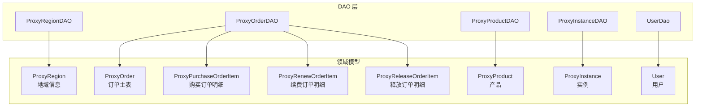
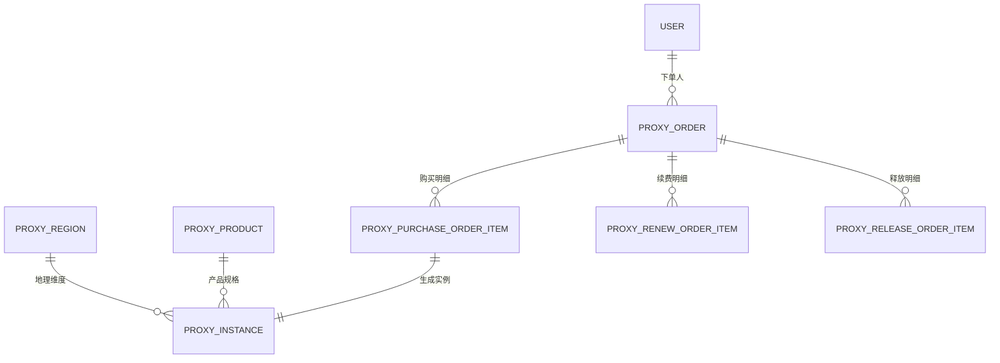
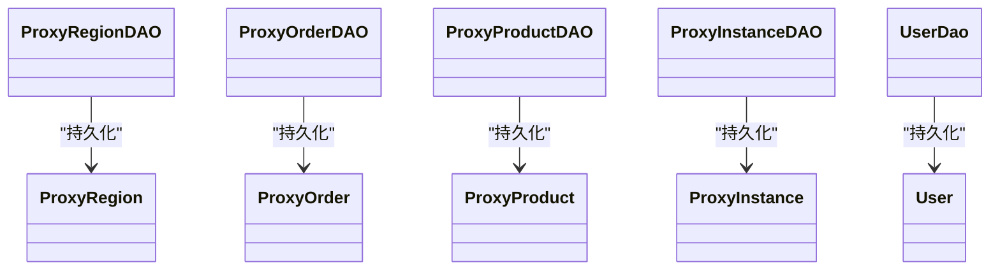

# 数据库表结构设计

<cite>
**本文引用的文件**
- [ProxyRegion.java](file://src/main/java/cn/linkfast/entity/ProxyRegion.java)
- [ProxyOrder.java](file://src/main/java/cn/linkfast/entity/ProxyOrder.java)
- [ProxyProduct.java](file://src/main/java/cn/linkfast/entity/ProxyProduct.java)
- [ProxyInstance.java](file://src/main/java/cn/linkfast/entity/ProxyInstance.java)
- [User.java](file://src/main/java/cn/linkfast/entity/User.java)
- [ProxyPurchaseOrderItem.java](file://src/main/java/cn/linkfast/entity/ProxyPurchaseOrderItem.java)
- [ProxyRenewOrderItem.java](file://src/main/java/cn/linkfast/entity/ProxyRenewOrderItem.java)
- [ProxyReleaseOrderItem.java](file://src/main/java/cn/linkfast/entity/ProxyReleaseOrderItem.java)
- [ProxyRegionDAO.java](file://src/main/java/cn/linkfast/dao/ProxyRegionDAO.java)
- [ProxyOrderDAO.java](file://src/main/java/cn/linkfast/dao/ProxyOrderDAO.java)
- [ProxyProductDAO.java](file://src/main/java/cn/linkfast/dao/ProxyProductDAO.java)
- [ProxyInstanceDAO.java](file://src/main/java/cn/linkfast/dao/ProxyInstanceDAO.java)
- [ProxyInstanceDaoImpl.java](file://src/main/java/cn/linkfast/dao/impl/ProxyInstanceDaoImpl.java)
- [ProxyOrderDaoImpl.java](file://src/main/java/cn/linkfast/dao/impl/ProxyOrderDaoImpl.java)
- [UserDao.java](file://src/main/java/cn/linkfast/dao/UserDao.java)
- [ProxyInstanceSearchCondition.java](file://src/main/java/cn/linkfast/dto/ProxyInstanceSearchCondition.java)
- [region.sql](file://docs/database/region.sql)
</cite>

## 更新摘要
**所做更改**
- 更新实例表 proxy_instance 设计，反映数据库架构变更
- 新增实例编号过滤功能的相关查询方法说明
- 完善自动续费状态管理的接口设计
- 更新实例查询条件的数据传输对象定义

## 目录
1. [简介](#简介)
2. [项目结构](#项目结构)
3. [核心组件](#核心组件)
4. [架构概览](#架构概览)
5. [详细组件分析](#详细组件分析)
6. [依赖分析](#依赖分析)
7. [性能考量](#性能考量)
8. [故障排查指南](#故障排查指南)
9. [结论](#结论)
10. [附录](#附录)

## 简介
本文件面向数据库设计者与后端工程师，系统化梳理 Link-Fast 项目的核心业务表结构设计，覆盖以下实体：
- 地域信息表：proxy_region
- 订单表：proxy_order
- 产品表：proxy_product
- 实例表：proxy_instance
- 用户表：user

文档从字段定义、数据类型、约束、业务含义与索引策略入手，结合 DAO 接口职责，给出表间关联关系与 ER 图，并总结字段命名规范、索引设计原则与最佳实践。

## 项目结构
围绕"表-实体-DAO-接口"的分层组织，核心表与实体类一一映射，DAO 接口承担数据持久化与查询聚合职责，支撑订单、实例、产品与地域的业务闭环。

**图表来源**
- [ProxyRegion.java:14-31](file://src/main/java/cn/linkfast/entity/ProxyRegion.java#L14-L31)
- [ProxyOrder.java:19-45](file://src/main/java/cn/linkfast/entity/ProxyOrder.java#L19-L45)
- [ProxyPurchaseOrderItem.java:18-158](file://src/main/java/cn/linkfast/entity/ProxyPurchaseOrderItem.java#L18-L158)
- [ProxyRenewOrderItem.java:18-47](file://src/main/java/cn/linkfast/entity/ProxyRenewOrderItem.java#L18-L47)
- [ProxyReleaseOrderItem.java:18-44](file://src/main/java/cn/linkfast/entity/ProxyReleaseOrderItem.java#L18-L44)
- [ProxyProduct.java:15-99](file://src/main/java/cn/linkfast/entity/ProxyProduct.java#L15-L99)
- [ProxyInstance.java:13-57](file://src/main/java/cn/linkfast/entity/ProxyInstance.java#L13-L57)
- [User.java:6-74](file://src/main/java/cn/linkfast/entity/User.java#L6-L74)
- [ProxyRegionDAO.java:11-36](file://src/main/java/cn/linkfast/dao/ProxyRegionDAO.java#L11-L36)
- [ProxyOrderDAO.java:10-102](file://src/main/java/cn/linkfast/dao/ProxyOrderDAO.java#L10-L102)
- [ProxyProductDAO.java:8-25](file://src/main/java/cn/linkfast/dao/ProxyProductDAO.java#L8-L25)
- [ProxyInstanceDAO.java:11-62](file://src/main/java/cn/linkfast/dao/ProxyInstanceDAO.java#L11-L62)
- [UserDao.java:9-35](file://src/main/java/cn/linkfast/dao/UserDao.java#L9-L35)

**章节来源**
- [ProxyRegion.java:14-31](file://src/main/java/cn/linkfast/entity/ProxyRegion.java#L14-L31)
- [ProxyOrder.java:19-45](file://src/main/java/cn/linkfast/entity/ProxyOrder.java#L19-L45)
- [ProxyProduct.java:15-99](file://src/main/java/cn/linkfast/entity/ProxyProduct.java#L15-L99)
- [ProxyInstance.java:13-57](file://src/main/java/cn/linkfast/entity/ProxyInstance.java#L13-L57)
- [User.java:6-74](file://src/main/java/cn/linkfast/entity/User.java#L6-L74)
- [ProxyRegionDAO.java:11-36](file://src/main/java/cn/linkfast/dao/ProxyRegionDAO.java#L11-L36)
- [ProxyOrderDAO.java:10-102](file://src/main/java/cn/linkfast/dao/ProxyOrderDAO.java#L10-L102)
- [ProxyProductDAO.java:8-25](file://src/main/java/cn/linkfast/dao/ProxyProductDAO.java#L8-L25)
- [ProxyInstanceDAO.java:11-62](file://src/main/java/cn/linkfast/dao/ProxyInstanceDAO.java#L11-L62)
- [UserDao.java:9-35](file://src/main/java/cn/linkfast/dao/UserDao.java#L9-L35)

## 核心组件

### 地域信息表 proxy_region
- 字段与约束
  - id：主键，自增
  - parent_id：父节点 ID，顶级节点为 0
  - level：层级（1=大洲，2=国家，3=州/省，4=城市）
  - region_code：唯一编码（如 SA、US-FL、US-FL-MIA），唯一索引
  - region_name：中文名称
  - region_en_name：英文名称
  - sort：排序值
  - full_code：全路径编码（层级用"-"分隔）
  - full_name：全路径中文名称
  - status：状态（1=正常，0=禁用）
  - create_time、update_time：时间戳，默认当前时间
- 索引策略
  - uk_region_code：唯一索引，保证编码唯一性
  - idx_parent_id：父节点索引，加速查询子节点
  - idx_level：层级索引，按层级筛选
  - idx_level_parent_id：联合索引，优化级联查询
  - idx_full_code：全路径索引，快速定位全路径节点
- 业务含义
  - 支持四级树形结构的地域建模，满足区域筛选、排序与全路径检索需求

**章节来源**
- [region.sql:1-20](file://docs/database/region.sql#L1-L20)
- [ProxyRegion.java:14-31](file://src/main/java/cn/linkfast/entity/ProxyRegion.java#L14-L31)
- [ProxyRegionDAO.java:11-36](file://src/main/java/cn/linkfast/dao/ProxyRegionDAO.java#L11-L36)

### 订单表 proxy_order
- 字段与约束
  - id：主键
  - order_no：平台订单编号（业务主键之一）
  - app_order_no：渠道商订单号（业务主键之一）
  - user_id：下单用户 ID
  - order_type：订单类型（1=购买，2=续费，3=释放）
  - status：订单状态（1=待处理，2=处理中，3=处理成功，4=处理失败，5=部分完成）
  - total_quantity：购买/续费/释放的数量汇总
  - amount：订单总价
  - has_refund：是否存在退费（0=无，1=存在）
  - instance_total：订单对应实例总数量
  - create_time、update_time：时间戳
- 业务含义
  - 订单主表承载购买、续费、释放三类业务，通过状态机驱动生命周期；与明细表形成一对多关系

**章节来源**
- [ProxyOrder.java:19-45](file://src/main/java/cn/linkfast/entity/ProxyOrder.java#L19-L45)
- [ProxyOrderDAO.java:10-102](file://src/main/java/cn/linkfast/dao/ProxyOrderDAO.java#L10-L102)

### 产品表 proxy_product
- 字段与约束
  - id：主键
  - product_no：产品编号（业务唯一标识）
  - product_name：产品名称
  - proxy_type：代理类型
  - use_type、protocol：使用方式与协议
  - use_limit、sell_limit：使用限制与销售限制
  - area_code、country_code、state_code、city_code：地理维度
  - detail：产品描述
  - cost_price、retail_price：成本价与零售价
  - inventory：库存
  - ip_type、isp_type、net_type：IP/ISP/网络类型
  - duration、unit：购买周期与时长单位
  - band_width、band_width_price、max_band_width、flow：带宽与流量相关
  - cpu、memory：硬件配置
  - enable：启用状态
  - supplier_code：供应商代码（逐步废弃）
  - ip_count、ip_duration：按 IP 数购买时的最小计价与时长
  - assign_ip、parent_no、cidr_status：CIDR/项目相关
  - one_day、proxy_everytime_change、proxy_global_random、api_draw_global_random、ip_white_list、pwd_draw_proxy_user、proxy_user_flow_limit、flow_use_log、pwd_draw_session_range、flow_conversion_base、product_type：动态代理能力开关与参数
  - create_time、update_time：时间戳
- 业务含义
  - 产品维度聚合代理规格、价格、地理与能力开关，支撑下单与实例分配

**章节来源**
- [ProxyProduct.java:15-99](file://src/main/java/cn/linkfast/entity/ProxyProduct.java#L15-L99)

### 实例表 proxy_instance
- 字段与约束
  - id：主键
  - order_id：所属订单 ID
  - order_no、app_order_no：订单编号
  - instance_no：平台实例编号（非空）
  - proxy_type、protocol：代理类型与协议
  - ip、port：代理地址与端口
  - region_id、country_code、city_code：地理维度
  - use_type：使用方式
  - username、pwd：认证凭据
  - user_id：所属用户 ID
  - user_expired：到期时间（秒级时间戳）
  - flow_total、flow_balance：总流量与剩余流量（MB）
  - status：实例状态
  - bridges：桥地址列表（JSON 存储）
  - open_at、renew_at、release_at：开通、续费、释放时间
  - product_no：产品编号
  - extend_ip、project_id：扩展地址与项目
  - unit、duration：购买周期单位与时长
  - remark：备注
  - create_time、update_time：时间戳
- 业务含义
  - 实例是真实可用的代理资源载体，承载生命周期、流量与地理属性

**更新** 删除 renew 列字段，新增实例编号过滤功能和自动续费状态管理接口

**章节来源**
- [ProxyInstance.java:13-57](file://src/main/java/cn/linkfast/entity/ProxyInstance.java#L13-L57)
- [ProxyInstanceDAO.java:11-62](file://src/main/java/cn/linkfast/dao/ProxyInstanceDAO.java#L11-L62)
- [ProxyInstanceDaoImpl.java:11-209](file://src/main/java/cn/linkfast/dao/impl/ProxyInstanceDaoImpl.java#L11-L209)

### 用户表 user
- 字段与约束
  - id：主键
  - username、email、phone、age：基础信息
- 业务含义
  - 作为渠道商或下游用户的标识主体，与订单、实例建立归属关系

**章节来源**
- [User.java:6-74](file://src/main/java/cn/linkfast/entity/User.java#L6-L74)
- [UserDao.java:9-35](file://src/main/java/cn/linkfast/dao/UserDao.java#L9-L35)

### 订单明细表
- 购买订单明细：proxy_purchase_order_item
  - 关联字段：order_id、order_no、app_order_no、product_no
  - 业务字段：proxy_type、use_type、protocol、area_code、country_code、state_code、city_code、detail、cost_price、retail_price、ip_type、isp_type、net_type、duration、unit、count、cycle_times、bandWidth、bandWidthPrice、maxBandWidth、flow、useBridge、cpu、memory、supplierCode、ipCount、ipDuration、parentNo、proxyEverytimeChange、proxyGlobalRandom、apiDrawGlobalRandom、ipWhiteList、pwdDrawProxyUser、proxyUserFlowLimit、flowUseLog、pwdDrawSessionRange、flowConversionBase、productType、projectId
- 续费订单明细：proxy_renew_order_item
  - 关联字段：order_id、order_no、app_order_no、instance_no
  - 业务字段：duration、unit、cycleTimes、renewAmount
- 释放订单明细：proxy_release_order_item
  - 关联字段：order_id、order_no、app_order_no、instance_no
  - 业务字段：totalAmount

**章节来源**
- [ProxyPurchaseOrderItem.java:18-158](file://src/main/java/cn/linkfast/entity/ProxyPurchaseOrderItem.java#L18-L158)
- [ProxyRenewOrderItem.java:18-47](file://src/main/java/cn/linkfast/entity/ProxyRenewOrderItem.java#L18-L47)
- [ProxyReleaseOrderItem.java:18-44](file://src/main/java/cn/linkfast/entity/ProxyReleaseOrderItem.java#L18-L44)

## 架构概览
下图展示核心表之间的关联关系与一对多/多对一映射，体现订单主表与明细表、产品与实例、地域与实例的业务耦合。

**图表来源**
- [ProxyRegion.java:14-31](file://src/main/java/cn/linkfast/entity/ProxyRegion.java#L14-L31)
- [ProxyProduct.java:15-99](file://src/main/java/cn/linkfast/entity/ProxyProduct.java#L15-L99)
- [ProxyOrder.java:19-45](file://src/main/java/cn/linkfast/entity/ProxyOrder.java#L19-L45)
- [ProxyPurchaseOrderItem.java:18-158](file://src/main/java/cn/linkfast/entity/ProxyPurchaseOrderItem.java#L18-L158)
- [ProxyRenewOrderItem.java:18-47](file://src/main/java/cn/linkfast/entity/ProxyRenewOrderItem.java#L18-L47)
- [ProxyReleaseOrderItem.java:18-44](file://src/main/java/cn/linkfast/entity/ProxyReleaseOrderItem.java#L18-L44)
- [ProxyInstance.java:13-57](file://src/main/java/cn/linkfast/entity/ProxyInstance.java#L13-L57)
- [User.java:6-74](file://src/main/java/cn/linkfast/entity/User.java#L6-L74)

## 详细组件分析

### 地域信息表 proxy_region 设计要点
- 字段设计
  - 编码唯一性：region_code 唯一索引，避免重复节点
  - 层级与父子关系：level 与 parent_id 支持树形遍历
  - 全路径检索：full_code 与 full_name 支持快速定位
  - 排序与状态：sort 与 status 提升前端展示与过滤效率
- 索引策略
  - uk_region_code：保证编码唯一
  - idx_parent_id、idx_level、idx_level_parent_id：优化树形查询
  - idx_full_code：支持全路径检索
- 业务规则
  - 顶级节点 parent_id=0；层级严格区分；状态=0 时不可用

**章节来源**
- [region.sql:1-20](file://docs/database/region.sql#L1-L20)
- [ProxyRegion.java:14-31](file://src/main/java/cn/linkfast/entity/ProxyRegion.java#L14-L31)
- [ProxyRegionDAO.java:11-36](file://src/main/java/cn/linkfast/dao/ProxyRegionDAO.java#L11-L36)

### 订单表 proxy_order 设计要点
- 字段设计
  - 订单类型与状态：order_type 与 status 构成状态机，覆盖购买/续费/释放与处理生命周期
  - 业务主键：order_no 与 app_order_no 双主键保障幂等与溯源
  - 数量与金额：total_quantity、amount、has_refund、instance_total 明确业务规模与财务口径
- 业务规则
  - 订单与明细表一对多；明细表承载具体实例生成/续费/释放的细粒度记录
- DAO 职责
  - 支持按 app_order_no 查询、批量插入明细、回写第三方订单号与金额、分页查询与统计

**章节来源**
- [ProxyOrder.java:19-45](file://src/main/java/cn/linkfast/entity/ProxyOrder.java#L19-L45)
- [ProxyOrderDAO.java:10-102](file://src/main/java/cn/linkfast/dao/ProxyOrderDAO.java#L10-L102)

### 产品表 proxy_product 设计要点
- 字段设计
  - 规格维度：proxy_type、use_type、protocol、area/country/state/city 等地理维度
  - 价格与库存：cost_price、retail_price、inventory
  - 能力开关：大量布尔/枚举型开关字段控制动态代理能力
  - 时间与周期：duration、unit、flow、bandWidth 等
- 业务规则
  - enable 控制产品可用性；supplier_code 逐步废弃
  - productType 区分共享/独享
- DAO 职责
  - 批量保存/更新、按条件查询与计数、按 product_no 查询

**章节来源**
- [ProxyProduct.java:15-99](file://src/main/java/cn/linkfast/entity/ProxyProduct.java#L15-L99)
- [ProxyProductDAO.java:8-25](file://src/main/java/cn/linkfast/dao/ProxyProductDAO.java#L8-L25)

### 实例表 proxy_instance 设计要点
- 字段设计
  - 认证与地理：username、pwd、region_id、country_code、city_code
  - 生命周期：open_at、renew_at、release_at、user_expired
  - 流量与状态：flow_total、flow_balance、status
  - 关联与扩展：order_id、order_no、app_order_no、product_no、extend_ip、project_id
  - 备注与桥接：remark、bridges（JSON 存储）
- 业务规则
  - instance_no 非空，作为实例唯一标识；status 控制实例可用性
- DAO 职责
  - 批量更新、按条件分页查询、按 instance_no 更新备注、按 instance_no 更新自动续费状态、查询即将到期的自动续费实例

**更新** 移除 renew 字段，新增实例编号过滤功能和自动续费状态管理接口

**章节来源**
- [ProxyInstance.java:13-57](file://src/main/java/cn/linkfast/entity/ProxyInstance.java#L13-L57)
- [ProxyInstanceDAO.java:11-62](file://src/main/java/cn/linkfast/dao/ProxyInstanceDAO.java#L11-L62)
- [ProxyInstanceDaoImpl.java:11-209](file://src/main/java/cn/linkfast/dao/impl/ProxyInstanceDaoImpl.java#L11-L209)

### 用户表 user 设计要点
- 字段设计
  - 基础身份信息：username、email、phone、age
- 业务规则
  - 与订单、实例建立归属关系，支撑用户侧业务

**章节来源**
- [User.java:6-74](file://src/main/java/cn/linkfast/entity/User.java#L6-L74)
- [UserDao.java:9-35](file://src/main/java/cn/linkfast/dao/UserDao.java#L9-L35)

### 订单明细表设计要点
- 购买明细：承载购买时的产品规格、价格、地理与能力参数，用于生成实例
- 续费明细：记录续费周期、单位、次数与金额
- 释放明细：记录释放实例与退款/结算金额

**章节来源**
- [ProxyPurchaseOrderItem.java:18-158](file://src/main/java/cn/linkfast/entity/ProxyPurchaseOrderItem.java#L18-L158)
- [ProxyRenewOrderItem.java:18-47](file://src/main/java/cn/linkfast/entity/ProxyRenewOrderItem.java#L18-L47)
- [ProxyReleaseOrderItem.java:18-44](file://src/main/java/cn/linkfast/entity/ProxyReleaseOrderItem.java#L18-L44)

### 实例查询条件 DTO 设计要点
- 字段设计
  - 分页参数：offset、limit
  - 过滤条件：proxyType、status、countryCode、cityCode、ip、instanceNo
  - 支持代理类型数组过滤、状态过滤、地理位置过滤、IP地址模糊查询、实例编号精确查询
- 业务规则
  - 所有查询条件均为可选参数，支持灵活组合查询

**章节来源**
- [ProxyInstanceSearchCondition.java:1-58](file://src/main/java/cn/linkfast/dto/ProxyInstanceSearchCondition.java#L1-L58)

## 依赖分析
- DAO 层职责
  - ProxyRegionDAO：批量保存/更新、按编码查询 ID 映射与单条记录
  - ProxyOrderDAO：订单主表与明细表的插入、更新、查询与统计
  - ProxyProductDAO：产品信息的批量保存/更新、条件查询与计数、按编号查询
  - ProxyInstanceDAO：实例批量更新、条件查询、分页统计、备注更新、自动续费状态更新、即将到期实例查询
  - UserDao：用户 CRUD
- 耦合与内聚
  - DAO 与实体类强绑定，职责清晰；订单与明细采用一对多聚合，降低跨表复杂度
- 外部依赖
  - DAO 依赖 JDBC/ORM（未在本仓库直接暴露），通过接口隔离

**图表来源**
- [ProxyRegionDAO.java:11-36](file://src/main/java/cn/linkfast/dao/ProxyRegionDAO.java#L11-L36)
- [ProxyOrderDAO.java:10-102](file://src/main/java/cn/linkfast/dao/ProxyOrderDAO.java#L10-L102)
- [ProxyProductDAO.java:8-25](file://src/main/java/cn/linkfast/dao/ProxyProductDAO.java#L8-L25)
- [ProxyInstanceDAO.java:11-62](file://src/main/java/cn/linkfast/dao/ProxyInstanceDAO.java#L11-L62)
- [UserDao.java:9-35](file://src/main/java/cn/linkfast/dao/UserDao.java#L9-L35)
- [ProxyRegion.java:14-31](file://src/main/java/cn/linkfast/entity/ProxyRegion.java#L14-L31)
- [ProxyOrder.java:19-45](file://src/main/java/cn/linkfast/entity/ProxyOrder.java#L19-L45)
- [ProxyProduct.java:15-99](file://src/main/java/cn/linkfast/entity/ProxyProduct.java#L15-L99)
- [ProxyInstance.java:13-57](file://src/main/java/cn/linkfast/entity/ProxyInstance.java#L13-L57)
- [User.java:6-74](file://src/main/java/cn/linkfast/entity/User.java#L6-L74)

## 性能考量
- 索引设计
  - proxy_region：uk_region_code、idx_parent_id、idx_level、idx_level_parent_id、idx_full_code，覆盖唯一性、树形查询与全路径检索
  - proxy_order：建议对 app_order_no、order_no、user_id、order_type、status 建立复合/单列索引，支撑高频查询与分页
  - proxy_instance：建议对 instance_no、order_no、app_order_no、user_id、status、region_id、product_no 建立索引，提升实例检索与报表统计效率
  - proxy_product：建议对 product_no、enable、area_code、country_code、state_code、city_code 建立索引，支撑产品筛选与推荐
- 查询模式
  - 分页查询与统计：DAO 已提供 countByCondition 与 selectListByCondition，建议结合业务 WHERE 条件建立合适索引
  - 批量操作：DAO 提供 batchSaveOrUpdate/batchUpdate，建议使用批量提交与事务控制
  - 实例编号过滤：新增的 instance_no 精确查询条件，建议在 instance_no 上建立索引以提升查询性能
  - 自动续费查询：selectAutoRenewExpiringInstances 方法涉及 renew 字段查询，建议在 renew 和 user_expired 上建立复合索引
- 数据类型选择
  - 时间字段统一使用 datetime/timestamp，便于排序与范围查询
  - 金额使用 decimal，避免浮点误差
  - JSON 字段（如 bridges）建议控制长度并进行校验
- 锁与并发
  - 订单与实例状态变更采用状态机，建议在高并发场景下使用乐观锁或分布式锁

## 故障排查指南
- 订单无法幂等
  - 检查 app_order_no 是否重复；确认 DAO 的 upsert 逻辑与唯一索引
- 实例编号冲突
  - 核对 instance_no 唯一性；确保生成策略与数据库约束一致
- 地域查询异常
  - 检查 region_code 唯一索引与 full_code 索引；核对层级与父节点关系
- 产品筛选慢
  - 检查 product_no、地理维度与 enable 的索引；评估复合索引选择
- 实例备注更新失败
  - 确认 instance_no 是否正确；检查 DAO 的 updateRemarkByInstanceNo 返回值
- 自动续费状态更新异常
  - 检查 instance_no 是否存在；确认数据库中是否存在 renew 字段
- 实例编号过滤无效
  - 确认 ProxyInstanceSearchCondition 中的 instanceNo 参数是否正确传递

**章节来源**
- [ProxyOrderDAO.java:10-102](file://src/main/java/cn/linkfast/dao/ProxyOrderDAO.java#L10-L102)
- [ProxyInstanceDAO.java:11-62](file://src/main/java/cn/linkfast/dao/ProxyInstanceDAO.java#L11-L62)
- [ProxyRegionDAO.java:11-36](file://src/main/java/cn/linkfast/dao/ProxyRegionDAO.java#L11-L36)
- [ProxyProductDAO.java:8-25](file://src/main/java/cn/linkfast/dao/ProxyProductDAO.java#L8-L25)

## 结论
本设计以"实体-表-DAO"三层结构清晰划分职责，围绕订单、实例、产品与地域构建核心业务闭环。通过合理的字段设计、数据类型选择与索引策略，兼顾查询效率与业务扩展性。建议在生产环境进一步完善审计日志、异步任务与缓存策略，以应对高并发与复杂查询场景。

**更新** 随着数据库架构变更，实例表不再包含 renew 字段，但新增了更完善的实例查询过滤功能和自动续费状态管理接口，提升了系统的灵活性和可维护性。

## 附录

### 字段命名规范与数据类型选择原则
- 命名规范
  - 表与字段采用小写下划线风格（如 proxy_order、order_no）
  - 业务主键使用 app_order_no（渠道商订单号）、order_no（平台订单号）、instance_no（平台实例编号）
  - 状态字段使用语义明确的枚举值（如 1/2/3/4/5）
- 数据类型选择
  - 主键：bigint unsigned
  - 编码类：varchar（带长度与校验）
  - 金额：decimal(precision, scale)
  - 时间：datetime/timestamp
  - 开关/枚举：tinyint/int
  - JSON：text（控制长度并校验）

### 索引设计策略清单
- proxy_region
  - uk_region_code：唯一索引
  - idx_parent_id、idx_level、idx_level_parent_id、idx_full_code：树形与全路径检索
- proxy_order
  - app_order_no、order_no、user_id、order_type、status：查询与分页
- proxy_instance
  - instance_no、order_no、app_order_no、user_id、status、region_id、product_no：实例检索与统计
  - renew、user_expired：自动续费状态与到期时间查询
- proxy_product
  - product_no、enable、area_code、country_code、state_code、city_code：产品筛选与推荐

### 实例查询条件扩展
- 新增 instanceNo 字段：支持按平台实例编号进行精确查询
- 支持多种过滤组合：代理类型、状态、地理位置、IP地址、实例编号
- 分页查询优化：配合索引设计提升大数据量下的查询性能

**章节来源**
- [ProxyInstanceSearchCondition.java:1-58](file://src/main/java/cn/linkfast/dto/ProxyInstanceSearchCondition.java#L1-L58)
- [ProxyInstanceDaoImpl.java:135-157](file://src/main/java/cn/linkfast/dao/impl/ProxyInstanceDaoImpl.java#L135-L157)