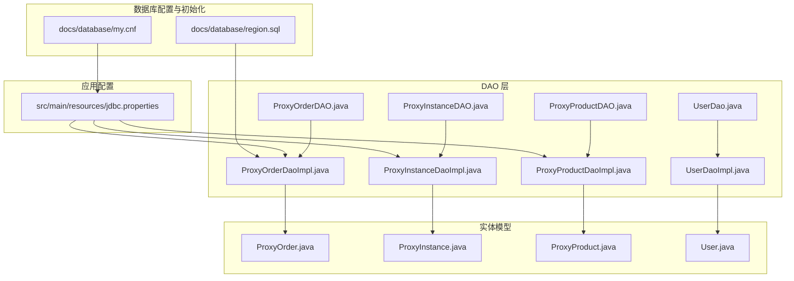
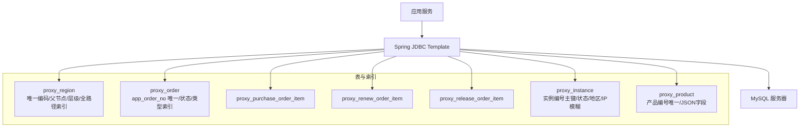
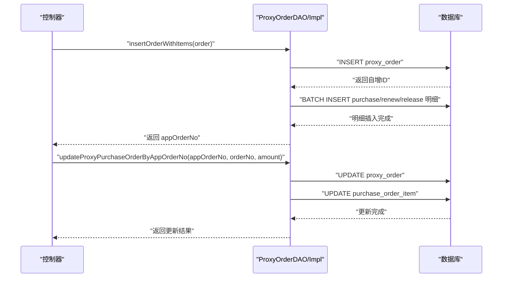
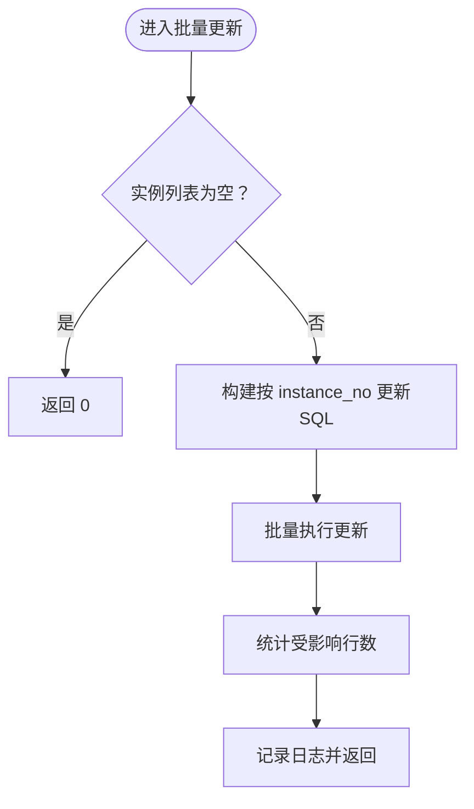
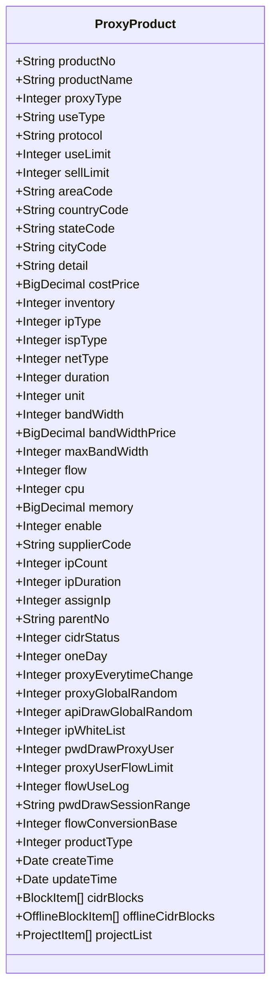
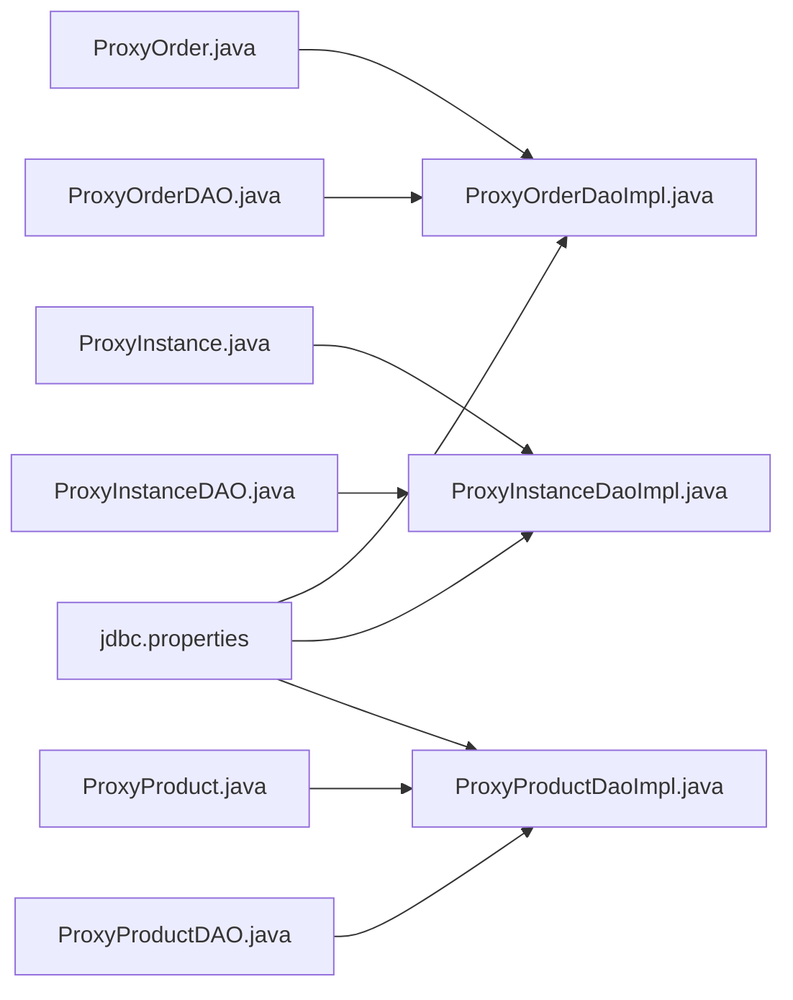

# 数据库设计

<cite>
**本文引用的文件**
- [docs/database/my.cnf](file://docs/database/my.cnf)
- [docs/database/region.sql](file://docs/database/region.sql)
- [src/main/resources/jdbc.properties](file://src/main/resources/jdbc.properties)
- [src/main/java/cn/linkfast/dao/ProxyOrderDAO.java](file://src/main/java/cn/linkfast/dao/ProxyOrderDAO.java)
- [src/main/java/cn/linkfast/dao/ProxyInstanceDAO.java](file://src/main/java/cn/linkfast/dao/ProxyInstanceDAO.java)
- [src/main/java/cn/linkfast/dao/ProxyProductDAO.java](file://src/main/java/cn/linkfast/dao/ProxyProductDAO.java)
- [src/main/java/cn/linkfast/dao/UserDao.java](file://src/main/java/cn/linkfast/dao/UserDao.java)
- [src/main/java/cn/linkfast/dao/impl/ProxyOrderDaoImpl.java](file://src/main/java/cn/linkfast/dao/impl/ProxyOrderDaoImpl.java)
- [src/main/java/cn/linkfast/dao/impl/ProxyInstanceDaoImpl.java](file://src/main/java/cn/linkfast/dao/impl/ProxyInstanceDaoImpl.java)
- [src/main/java/cn/linkfast/dao/impl/ProxyProductDaoImpl.java](file://src/main/java/cn/linkfast/dao/impl/ProxyProductDaoImpl.java)
- [src/main/java/cn/linkfast/dao/impl/UserDaoImpl.java](file://src/main/java/cn/linkfast/dao/impl/UserDaoImpl.java)
- [src/main/java/cn/linkfast/entity/ProxyOrder.java](file://src/main/java/cn/linkfast/entity/ProxyOrder.java)
- [src/main/java/cn/linkfast/entity/ProxyInstance.java](file://src/main/java/cn/linkfast/entity/ProxyInstance.java)
- [src/main/java/cn/linkfast/entity/ProxyProduct.java](file://src/main/java/cn/linkfast/entity/ProxyProduct.java)
- [src/main/java/cn/linkfast/entity/User.java](file://src/main/java/cn/linkfast/entity/User.java)
</cite>

## 目录
1. [简介](#简介)
2. [项目结构](#项目结构)
3. [核心组件](#核心组件)
4. [架构总览](#架构总览)
5. [详细组件分析](#详细组件分析)
6. [依赖关系分析](#依赖关系分析)
7. [性能考量](#性能考量)
8. [故障排查指南](#故障排查指南)
9. [结论](#结论)
10. [附录](#附录)

## 简介
本文件面向 Link-Fast 项目的数据库设计与运维，聚焦于核心业务表（订单、产品、实例、用户）的表结构、索引策略、查询优化、初始化脚本、连接池与事务配置、并发控制、备份与恢复、监控与扩容建议，并提供运维与排障指南。文档以代码与配置为依据，结合实际 SQL 与实体模型，给出可落地的设计与实践。

## 项目结构
- 数据库配置与初始化脚本位于 docs/database，包含 MySQL 服务端配置与地域表初始化 SQL。
- JDBC 连接参数位于 src/main/resources/jdbc.properties，用于 Spring JDBC 配置。
- DAO 接口与实现位于 src/main/java/cn/linkfast/dao 与其实现包，承载对数据库的 CRUD 与批量操作。
- 实体类位于 src/main/java/cn/linkfast/entity，映射数据库表结构。

图表来源
- [docs/database/my.cnf:1-68](file://docs/database/my.cnf#L1-L68)
- [docs/database/region.sql:1-20](file://docs/database/region.sql#L1-L20)
- [src/main/resources/jdbc.properties:1-39](file://src/main/resources/jdbc.properties#L1-L39)
- [src/main/java/cn/linkfast/dao/ProxyOrderDAO.java:1-102](file://src/main/java/cn/linkfast/dao/ProxyOrderDAO.java#L1-L102)
- [src/main/java/cn/linkfast/dao/ProxyInstanceDAO.java:1-47](file://src/main/java/cn/linkfast/dao/ProxyInstanceDAO.java#L1-L47)
- [src/main/java/cn/linkfast/dao/ProxyProductDAO.java:1-25](file://src/main/java/cn/linkfast/dao/ProxyProductDAO.java#L1-L25)
- [src/main/java/cn/linkfast/dao/UserDao.java:1-35](file://src/main/java/cn/linkfast/dao/UserDao.java#L1-L35)
- [src/main/java/cn/linkfast/dao/impl/ProxyOrderDaoImpl.java:1-446](file://src/main/java/cn/linkfast/dao/impl/ProxyOrderDaoImpl.java#L1-L446)
- [src/main/java/cn/linkfast/dao/impl/ProxyInstanceDaoImpl.java:1-175](file://src/main/java/cn/linkfast/dao/impl/ProxyInstanceDaoImpl.java#L1-L175)
- [src/main/java/cn/linkfast/dao/impl/ProxyProductDaoImpl.java:1-286](file://src/main/java/cn/linkfast/dao/impl/ProxyProductDaoImpl.java#L1-L286)
- [src/main/java/cn/linkfast/dao/impl/UserDaoImpl.java:1-55](file://src/main/java/cn/linkfast/dao/impl/UserDaoImpl.java#L1-L55)
- [src/main/java/cn/linkfast/entity/ProxyOrder.java:1-45](file://src/main/java/cn/linkfast/entity/ProxyOrder.java#L1-L45)
- [src/main/java/cn/linkfast/entity/ProxyInstance.java:1-57](file://src/main/java/cn/linkfast/entity/ProxyInstance.java#L1-L57)
- [src/main/java/cn/linkfast/entity/ProxyProduct.java:1-99](file://src/main/java/cn/linkfast/entity/ProxyProduct.java#L1-L99)
- [src/main/java/cn/linkfast/entity/User.java:1-74](file://src/main/java/cn/linkfast/entity/User.java#L1-L74)

章节来源
- [docs/database/my.cnf:1-68](file://docs/database/my.cnf#L1-L68)
- [docs/database/region.sql:1-20](file://docs/database/region.sql#L1-L20)
- [src/main/resources/jdbc.properties:1-39](file://src/main/resources/jdbc.properties#L1-L39)

## 核心组件
本节梳理核心业务表与关键实体，明确字段、类型与约束，并总结 DAO 层对这些表的操作模式。

- 地域表（proxy_region）
  - 字段要点：主键、父节点、层级、区域编码、中文/英文名、排序、全路径编码/名称、状态、时间戳。
  - 索引策略：唯一编码索引、父节点索引、层级索引、层级+父节点联合索引、全路径编码索引。
  - 设计意图：支持多级地理聚合查询与快速定位。

- 订单表（proxy_order）
  - 字段要点：平台订单号、渠道商订单号、用户ID、订单类型、状态、数量、金额、是否退费、实例总数、时间戳。
  - 约束：通过唯一索引与业务逻辑保证 app_order_no 唯一性；状态与类型用于分页与筛选。

- 订单明细（购买/续费/释放）
  - 购买明细表：proxy_purchase_order_item
  - 续费明细表：proxy_renew_order_item
  - 释放明细表：proxy_release_order_item
  - 设计要点：与主表通过 app_order_no 或 order_no 关联，支持回写第三方订单号与金额。

- 实例表（proxy_instance）
  - 字段要点：实例编号、协议、IP/端口、区域代码、使用方式、用户凭据、到期时间、流量、状态、续费标记、桥地址（JSON）、开通/续费/释放时间、产品编号、扩展IP、项目ID、周期单位/时长、备注、时间戳。
  - 约束：实例编号非空且作为查询/更新主键；JSON 字段存储桥地址列表。

- 产品表（proxy_product）
  - 字段要点：产品编号、名称、代理类型、用途/协议限制、区域代码、价格、库存、带宽、流量、CPU/内存、启用状态、供应商、IP 数量/周期、CIDR/离线块、项目列表、功能开关、时间戳。
  - 约束：产品编号唯一；JSON 字段存储 CIDR 块、离线块、项目列表；批量 upsert 更新。

- 用户表（user）
  - 字段要点：用户标识、用户名、邮箱、电话、年龄。
  - 当前实现：内存模拟存储，非持久化至真实数据库。

章节来源
- [docs/database/region.sql:1-20](file://docs/database/region.sql#L1-L20)
- [src/main/java/cn/linkfast/dao/impl/ProxyOrderDaoImpl.java:213-244](file://src/main/java/cn/linkfast/dao/impl/ProxyOrderDaoImpl.java#L213-L244)
- [src/main/java/cn/linkfast/dao/impl/ProxyOrderDaoImpl.java:302-355](file://src/main/java/cn/linkfast/dao/impl/ProxyOrderDaoImpl.java#L302-L355)
- [src/main/java/cn/linkfast/dao/impl/ProxyOrderDaoImpl.java:424-444](file://src/main/java/cn/linkfast/dao/impl/ProxyOrderDaoImpl.java#L424-L444)
- [src/main/java/cn/linkfast/dao/impl/ProxyInstanceDaoImpl.java:39-88](file://src/main/java/cn/linkfast/dao/impl/ProxyInstanceDaoImpl.java#L39-L88)
- [src/main/java/cn/linkfast/dao/impl/ProxyProductDaoImpl.java:108-190](file://src/main/java/cn/linkfast/dao/impl/ProxyProductDaoImpl.java#L108-L190)
- [src/main/java/cn/linkfast/entity/ProxyOrder.java:20-35](file://src/main/java/cn/linkfast/entity/ProxyOrder.java#L20-L35)
- [src/main/java/cn/linkfast/entity/ProxyInstance.java:14-52](file://src/main/java/cn/linkfast/entity/ProxyInstance.java#L14-L52)
- [src/main/java/cn/linkfast/entity/ProxyProduct.java:17-65](file://src/main/java/cn/linkfast/entity/ProxyProduct.java#L17-L65)
- [src/main/java/cn/linkfast/entity/User.java:6-21](file://src/main/java/cn/linkfast/entity/User.java#L6-L21)

## 架构总览
应用通过 Spring JDBC Template 访问数据库，DAO 层封装 CRUD、批量插入与条件查询；实体类映射表结构，JSON 字段用于存储复杂属性。连接参数由 jdbc.properties 提供，MySQL 服务端配置由 my.cnf 提供。

图表来源
- [docs/database/region.sql:1-20](file://docs/database/region.sql#L1-L20)
- [src/main/java/cn/linkfast/dao/impl/ProxyOrderDaoImpl.java:213-244](file://src/main/java/cn/linkfast/dao/impl/ProxyOrderDaoImpl.java#L213-L244)
- [src/main/java/cn/linkfast/dao/impl/ProxyInstanceDaoImpl.java:39-88](file://src/main/java/cn/linkfast/dao/impl/ProxyInstanceDaoImpl.java#L39-L88)
- [src/main/java/cn/linkfast/dao/impl/ProxyProductDaoImpl.java:108-190](file://src/main/java/cn/linkfast/dao/impl/ProxyProductDaoImpl.java#L108-L190)
- [src/main/resources/jdbc.properties:1-39](file://src/main/resources/jdbc.properties#L1-L39)
- [docs/database/my.cnf:1-68](file://docs/database/my.cnf#L1-L68)

## 详细组件分析

### 订单模块（proxy_order 及明细）
- 主表 proxy_order
  - 关键字段：app_order_no（业务唯一）、order_type、status、amount、instance_total。
  - DAO 支持：按条件分页查询、统计总数、按 app_order_no 查询、插入主表并返回自增 ID、批量插入明细（购买/续费/释放）。
- 明细表
  - 购买明细：proxy_purchase_order_item，字段覆盖产品维度与用量维度。
  - 续费明细：proxy_renew_order_item，字段覆盖续费周期与金额。
  - 释放明细：proxy_release_order_item，字段覆盖释放金额。
- 业务流程
  - 新建订单：先插入主表，再批量插入明细。
  - 回写第三方：更新主表与明细表的第三方订单号与金额。
  - 实例同步：批量 upsert 实例表，基于实例编号去重更新。

图表来源
- [src/main/java/cn/linkfast/dao/ProxyOrderDAO.java:48-102](file://src/main/java/cn/linkfast/dao/ProxyOrderDAO.java#L48-L102)
- [src/main/java/cn/linkfast/dao/impl/ProxyOrderDaoImpl.java:213-244](file://src/main/java/cn/linkfast/dao/impl/ProxyOrderDaoImpl.java#L213-L244)
- [src/main/java/cn/linkfast/dao/impl/ProxyOrderDaoImpl.java:173-204](file://src/main/java/cn/linkfast/dao/impl/ProxyOrderDaoImpl.java#L173-L204)
- [src/main/java/cn/linkfast/dao/impl/ProxyOrderDaoImpl.java:302-355](file://src/main/java/cn/linkfast/dao/impl/ProxyOrderDaoImpl.java#L302-L355)
- [src/main/java/cn/linkfast/dao/impl/ProxyOrderDaoImpl.java:424-444](file://src/main/java/cn/linkfast/dao/impl/ProxyOrderDaoImpl.java#L424-L444)

章节来源
- [src/main/java/cn/linkfast/dao/ProxyOrderDAO.java:10-102](file://src/main/java/cn/linkfast/dao/ProxyOrderDAO.java#L10-L102)
- [src/main/java/cn/linkfast/dao/impl/ProxyOrderDaoImpl.java:34-76](file://src/main/java/cn/linkfast/dao/impl/ProxyOrderDaoImpl.java#L34-L76)
- [src/main/java/cn/linkfast/dao/impl/ProxyOrderDaoImpl.java:85-154](file://src/main/java/cn/linkfast/dao/impl/ProxyOrderDaoImpl.java#L85-L154)
- [src/main/java/cn/linkfast/dao/impl/ProxyOrderDaoImpl.java:213-244](file://src/main/java/cn/linkfast/dao/impl/ProxyOrderDaoImpl.java#L213-L244)
- [src/main/java/cn/linkfast/dao/impl/ProxyOrderDaoImpl.java:296-355](file://src/main/java/cn/linkfast/dao/impl/ProxyOrderDaoImpl.java#L296-L355)
- [src/main/java/cn/linkfast/dao/impl/ProxyOrderDaoImpl.java:418-444](file://src/main/java/cn/linkfast/dao/impl/ProxyOrderDaoImpl.java#L418-L444)

### 实例模块（proxy_instance）
- 关键字段：instance_no（主键）、status、country_code、city_code、ip（模糊匹配）、user_expired、flow_balance、bridges（JSON）。
- DAO 支持：批量更新（按 instance_no 去重更新）、条件分页查询、统计总数、按实例编号更新备注。
- 查询模式：按代理类型、状态、国家/城市、IP 模糊匹配组合过滤。

图表来源
- [src/main/java/cn/linkfast/dao/ProxyInstanceDAO.java:19-45](file://src/main/java/cn/linkfast/dao/ProxyInstanceDAO.java#L19-L45)
- [src/main/java/cn/linkfast/dao/impl/ProxyInstanceDaoImpl.java:33-88](file://src/main/java/cn/linkfast/dao/impl/ProxyInstanceDaoImpl.java#L33-L88)
- [src/main/java/cn/linkfast/dao/impl/ProxyInstanceDaoImpl.java:90-159](file://src/main/java/cn/linkfast/dao/impl/ProxyInstanceDaoImpl.java#L90-L159)

章节来源
- [src/main/java/cn/linkfast/dao/ProxyInstanceDAO.java:11-45](file://src/main/java/cn/linkfast/dao/ProxyInstanceDAO.java#L11-L45)
- [src/main/java/cn/linkfast/dao/impl/ProxyInstanceDaoImpl.java:33-88](file://src/main/java/cn/linkfast/dao/impl/ProxyInstanceDaoImpl.java#L33-L88)
- [src/main/java/cn/linkfast/dao/impl/ProxyInstanceDaoImpl.java:90-159](file://src/main/java/cn/linkfast/dao/impl/ProxyInstanceDaoImpl.java#L90-L159)

### 产品模块（proxy_product）
- 关键字段：product_no（唯一）、proxy_type、use_limit/sell_limit、area_code/country_code/state_code/city_code、price、inventory、带宽/流量/CPU/内存、启用状态、供应商、IP 数量/周期、CIDR/离线块、项目列表、功能开关、JSON 字段。
- DAO 支持：批量 upsert（ON DUPLICATE KEY UPDATE）、条件查询与统计、按产品编号查询。
- JSON 处理：使用 Jackson 将复杂对象序列化为 JSON 存储，查询时反序列化。

图表来源
- [src/main/java/cn/linkfast/entity/ProxyProduct.java:15-99](file://src/main/java/cn/linkfast/entity/ProxyProduct.java#L15-L99)

章节来源
- [src/main/java/cn/linkfast/dao/ProxyProductDAO.java:8-25](file://src/main/java/cn/linkfast/dao/ProxyProductDAO.java#L8-L25)
- [src/main/java/cn/linkfast/dao/impl/ProxyProductDaoImpl.java:101-190](file://src/main/java/cn/linkfast/dao/impl/ProxyProductDaoImpl.java#L101-L190)
- [src/main/java/cn/linkfast/dao/impl/ProxyProductDaoImpl.java:202-234](file://src/main/java/cn/linkfast/dao/impl/ProxyProductDaoImpl.java#L202-L234)
- [src/main/java/cn/linkfast/dao/impl/ProxyProductDaoImpl.java:278-283](file://src/main/java/cn/linkfast/dao/impl/ProxyProductDaoImpl.java#L278-L283)

### 用户模块（user）
- 当前实现：内存模拟存储（ConcurrentHashMap），非持久化至真实数据库。
- 适用场景：测试环境或临时演示，生产应替换为真实数据库与持久化 DAO。

章节来源
- [src/main/java/cn/linkfast/dao/UserDao.java:9-35](file://src/main/java/cn/linkfast/dao/UserDao.java#L9-L35)
- [src/main/java/cn/linkfast/dao/impl/UserDaoImpl.java:17-55](file://src/main/java/cn/linkfast/dao/impl/UserDaoImpl.java#L17-L55)
- [src/main/java/cn/linkfast/entity/User.java:6-74](file://src/main/java/cn/linkfast/entity/User.java#L6-L74)

## 依赖关系分析
- DAO 层依赖 Spring JDBC Template 执行 SQL。
- 实体类与表结构一一对应，JSON 字段通过 Jackson 序列化/反序列化。
- 查询条件通过动态拼接 SQL 与参数绑定，避免 SQL 注入。
- 批量操作采用 batchUpdate，提升写入性能。

图表来源
- [src/main/java/cn/linkfast/entity/ProxyOrder.java:19-45](file://src/main/java/cn/linkfast/entity/ProxyOrder.java#L19-L45)
- [src/main/java/cn/linkfast/entity/ProxyInstance.java:13-57](file://src/main/java/cn/linkfast/entity/ProxyInstance.java#L13-L57)
- [src/main/java/cn/linkfast/entity/ProxyProduct.java:15-99](file://src/main/java/cn/linkfast/entity/ProxyProduct.java#L15-L99)
- [src/main/java/cn/linkfast/dao/ProxyOrderDAO.java:10-102](file://src/main/java/cn/linkfast/dao/ProxyOrderDAO.java#L10-L102)
- [src/main/java/cn/linkfast/dao/ProxyInstanceDAO.java:11-47](file://src/main/java/cn/linkfast/dao/ProxyInstanceDAO.java#L11-L47)
- [src/main/java/cn/linkfast/dao/ProxyProductDAO.java:8-25](file://src/main/java/cn/linkfast/dao/ProxyProductDAO.java#L8-L25)
- [src/main/resources/jdbc.properties:1-39](file://src/main/resources/jdbc.properties#L1-L39)

章节来源
- [src/main/java/cn/linkfast/dao/impl/ProxyOrderDaoImpl.java:1-446](file://src/main/java/cn/linkfast/dao/impl/ProxyOrderDaoImpl.java#L1-L446)
- [src/main/java/cn/linkfast/dao/impl/ProxyInstanceDaoImpl.java:1-175](file://src/main/java/cn/linkfast/dao/impl/ProxyInstanceDaoImpl.java#L1-L175)
- [src/main/java/cn/linkfast/dao/impl/ProxyProductDaoImpl.java:1-286](file://src/main/java/cn/linkfast/dao/impl/ProxyProductDaoImpl.java#L1-L286)

## 性能考量
- 连接与会话
  - JDBC 连接参数：开启批处理、多查询、预编译缓存、连接/套接字超时、自动重连等，适配高并发与网络波动。
  - MySQL 服务端：增大最大连接数、放宽空闲超时、提高数据包大小、调整 InnoDB 日志与缓冲，平衡吞吐与可靠性。
- 批量写入
  - 使用 batchUpdate 批量插入/更新，减少往返开销；对 JSON 字段采用一次性序列化，避免逐条转换。
- 查询优化
  - 订单与实例查询广泛使用条件过滤与分页；建议为高频过滤字段建立合适索引（如 app_order_no、status、country_code、city_code、ip）。
  - 地域表已具备多维索引，满足层级与全路径查询。
- 缓存与一致性
  - 产品表 JSON 字段频繁读写，建议在应用层做热点缓存；注意写入后失效或更新缓存。
- 事务与隔离
  - 默认事务隔离级别与回滚策略由应用框架管理；批量写入建议在一个事务内提交，失败回滚，保证一致性。

章节来源
- [src/main/resources/jdbc.properties:5-17](file://src/main/resources/jdbc.properties#L5-L17)
- [docs/database/my.cnf:32-68](file://docs/database/my.cnf#L32-L68)
- [src/main/java/cn/linkfast/dao/impl/ProxyOrderDaoImpl.java:302-355](file://src/main/java/cn/linkfast/dao/impl/ProxyOrderDaoImpl.java#L302-L355)
- [src/main/java/cn/linkfast/dao/impl/ProxyInstanceDaoImpl.java:39-88](file://src/main/java/cn/linkfast/dao/impl/ProxyInstanceDaoImpl.java#L39-L88)
- [src/main/java/cn/linkfast/dao/impl/ProxyProductDaoImpl.java:108-190](file://src/main/java/cn/linkfast/dao/impl/ProxyProductDaoImpl.java#L108-L190)

## 故障排查指南
- 连接问题
  - 现象：连接超时、连接数不足。
  - 排查：检查 JDBC 超时参数与 MySQL max_connections 设置；确认 wait_timeout/interactive_timeout 合理。
- 批量写入失败
  - 现象：部分记录未写入或报错。
  - 排查：检查 batchUpdate 返回数组，统计受影响行数；核对 JSON 序列化是否异常；确认唯一键冲突与字段长度。
- 查询慢
  - 现象：分页查询耗时长。
  - 排查：确认过滤字段是否命中索引；必要时添加复合索引；避免 SELECT *，只取必要字段。
- 数据不一致
  - 现象：实例/订单状态不同步。
  - 排查：检查批量更新是否在一个事务内；核对 app_order_no 与 order_no 的回写逻辑。

章节来源
- [src/main/resources/jdbc.properties:14-17](file://src/main/resources/jdbc.properties#L14-L17)
- [docs/database/my.cnf:44-48](file://docs/database/my.cnf#L44-L48)
- [src/main/java/cn/linkfast/dao/impl/ProxyOrderDaoImpl.java:34-76](file://src/main/java/cn/linkfast/dao/impl/ProxyOrderDaoImpl.java#L34-L76)
- [src/main/java/cn/linkfast/dao/impl/ProxyInstanceDaoImpl.java:73-87](file://src/main/java/cn/linkfast/dao/impl/ProxyInstanceDaoImpl.java#L73-L87)
- [src/main/java/cn/linkfast/dao/impl/ProxyProductDaoImpl.java:174-188](file://src/main/java/cn/linkfast/dao/impl/ProxyProductDaoImpl.java#L174-L188)

## 结论
本设计以实体模型驱动表结构，DAO 层提供完善的 CRUD 与批量操作能力，配合 MySQL 服务端与 JDBC 参数优化，满足高并发订单与实例处理需求。建议在生产环境中完善索引、引入缓存、加强监控与备份演练，并持续评估性能与容量。

## 附录

### 数据库初始化脚本说明
- 地域表初始化
  - 执行 docs/database/region.sql 创建 proxy_region 表并加载索引。
  - 建议：首次导入后校验唯一编码与层级索引是否生效。
- 订单/实例/产品表
  - 订单主表与明细表由 DAO 层在运行时通过 SQL 插入/更新；无需额外初始化脚本。
  - 建议：在部署前准备好数据库与账号权限，确保应用可连接并具备 DML 权限。

章节来源
- [docs/database/region.sql:1-20](file://docs/database/region.sql#L1-L20)
- [src/main/java/cn/linkfast/dao/impl/ProxyOrderDaoImpl.java:213-244](file://src/main/java/cn/linkfast/dao/impl/ProxyOrderDaoImpl.java#L213-L244)
- [src/main/java/cn/linkfast/dao/impl/ProxyOrderDaoImpl.java:302-355](file://src/main/java/cn/linkfast/dao/impl/ProxyOrderDaoImpl.java#L302-L355)
- [src/main/java/cn/linkfast/dao/impl/ProxyProductDaoImpl.java:108-190](file://src/main/java/cn/linkfast/dao/impl/ProxyProductDaoImpl.java#L108-L190)

### 数据库连接池与事务配置
- 连接参数
  - JDBC URL 参数：启用批处理、多查询、预编译缓存、连接/套接字超时、自动重连。
  - 建议：在应用容器或连接池（如 Druid/HikariCP）中进一步细化连接池大小、空闲超时与获取超时。
- 事务
  - 建议：批量写入统一在一个事务中提交；对跨表更新（主表+明细）使用本地事务，失败回滚。

章节来源
- [src/main/resources/jdbc.properties:5-17](file://src/main/resources/jdbc.properties#L5-L17)

### 并发控制与一致性
- 并发写入
  - 使用 batchUpdate 与 ON DUPLICATE KEY UPDATE 降低锁竞争；对热点产品/实例采用应用层互斥或队列化处理。
- 一致性
  - 订单与明细回写第三方时，先更新主表再更新明细，确保状态一致；失败时回滚。

章节来源
- [src/main/java/cn/linkfast/dao/impl/ProxyOrderDaoImpl.java:173-204](file://src/main/java/cn/linkfast/dao/impl/ProxyOrderDaoImpl.java#L173-L204)
- [src/main/java/cn/linkfast/dao/impl/ProxyOrderDaoImpl.java:398-409](file://src/main/java/cn/linkfast/dao/impl/ProxyOrderDaoImpl.java#L398-L409)

### 备份与恢复
- 备份策略
  - 全量备份：定期执行物理/逻辑备份；增量备份：结合 binlog。
  - 产品 JSON 字段与实例流量数据需纳入备份范围。
- 恢复演练
  - 定期进行恢复演练，验证备份完整性与恢复时间目标（RTO/RPO）。

章节来源
- [docs/database/my.cnf:10-13](file://docs/database/my.cnf#L10-L13)

### 监控与性能瓶颈分析
- 监控指标
  - 连接数、QPS、慢查询、锁等待、缓冲池命中率、Innodb 日志写入频率。
- 瓶颈识别
  - 批量写入卡顿：检查 batch size、JSON 序列化成本、磁盘 IO。
  - 查询慢：检查索引使用情况与过滤条件选择性。
- 扩容建议
  - 垂直扩容：提升 CPU/内存与 InnoDB 缓冲池；水平扩容：读写分离、分库分表（按 app_order_no 或用户维度）。

章节来源
- [docs/database/my.cnf:54-62](file://docs/database/my.cnf#L54-L62)