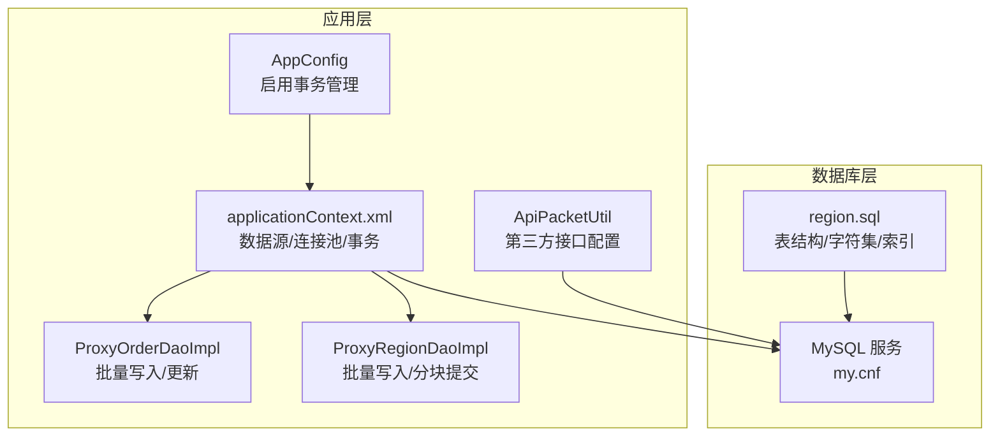
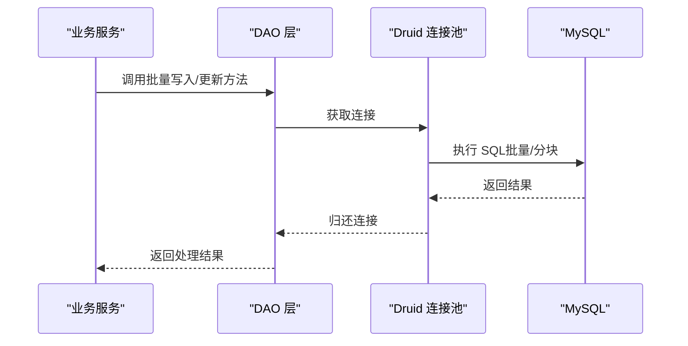
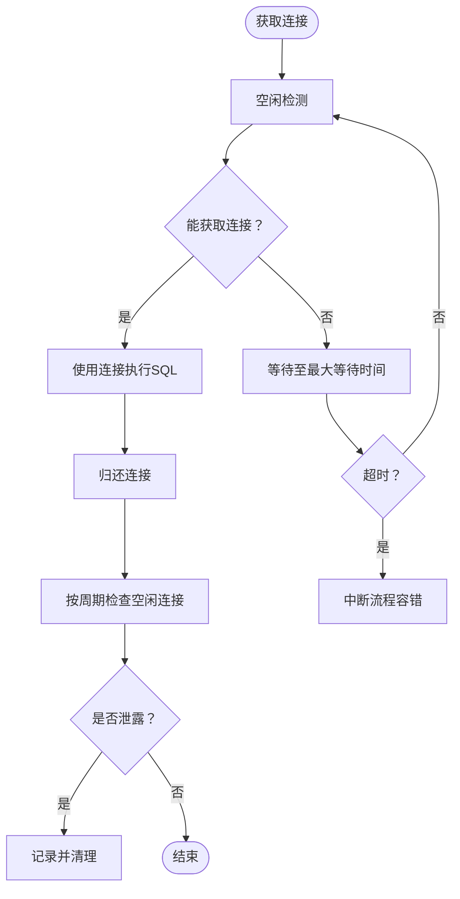
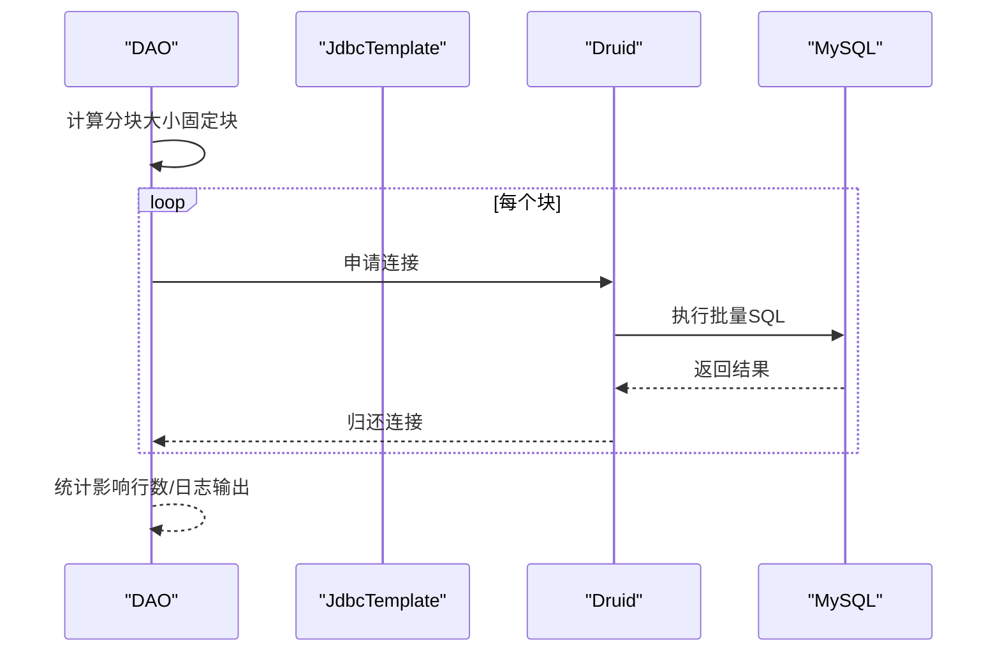
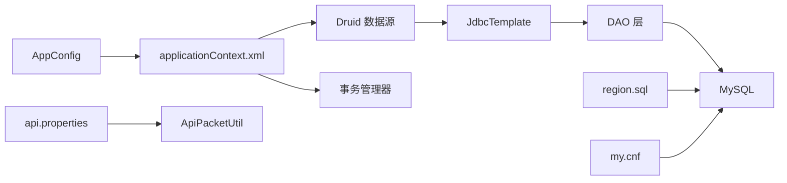

# 数据库配置管理

<cite>
**本文引用的文件**   
- [my.cnf](file://docs/database/my.cnf)
- [jdbc.properties](file://src/main/resources/jdbc.properties)
- [applicationContext.xml](file://src/main/resources/applicationContext.xml)
- [AppConfig.java](file://src/main/java/cn/linkfast/config/AppConfig.java)
- [ProxyOrderDaoImpl.java](file://src/main/java/cn/linkfast/dao/impl/ProxyOrderDaoImpl.java)
- [ProxyRegionDaoImpl.java](file://src/main/java/cn/linkfast/dao/impl/ProxyRegionDaoImpl.java)
- [region.sql](file://docs/database/region.sql)
- [ApiPacketUtil.java](file://src/main/java/cn/linkfast/utils/ApiPacketUtil.java)
- [api.properties](file://src/main/resources/api.properties)
- [SimpleTest.java](file://src/test/java/cn/linkfast/SimpleTest.java)
</cite>

## 目录
1. [简介](#简介)
2. [项目结构](#项目结构)
3. [核心组件](#核心组件)
4. [架构总览](#架构总览)
5. [组件详解](#组件详解)
6. [依赖关系分析](#依赖关系分析)
7. [性能考量](#性能考量)
8. [故障排查指南](#故障排查指南)
9. [结论](#结论)
10. [附录](#附录)

## 简介
本文件面向系统管理员与运维工程师，围绕 Link-Fast 项目的数据库配置管理进行系统化说明，覆盖以下主题：
- 数据库连接配置：连接字符串格式、用户名密码、超时与重连策略
- MySQL 配置文件 my.cnf 的关键参数：字符集、存储引擎、缓冲池、日志与连接超时
- 连接池配置：基于 Druid 的参数设置、最大连接数、最小空闲、连接寿命与回收策略
- 事务配置：Spring 声明式事务、隔离级别与分布式事务处理现状
- 配置安全管理：环境变量、敏感信息保护与配置热更新
- 数据库优化与故障排查：批量写入、连接超时、连接池回收与日志定位

## 项目结构
与数据库配置相关的关键位置如下：
- MySQL 服务端配置：docs/database/my.cnf
- 应用侧连接配置：src/main/resources/jdbc.properties
- 连接池与事务配置：src/main/resources/applicationContext.xml
- Spring 核心配置：src/main/java/cn/linkfast/config/AppConfig.java
- DAO 层批量写入示例：src/main/java/cn/linkfast/dao/impl/ProxyOrderDaoImpl.java、src/main/java/cn/linkfast/dao/impl/ProxyRegionDaoImpl.java
- 数据库表结构参考：docs/database/region.sql
- 第三方接口配置（与数据库无关但影响整体链路）：src/main/resources/api.properties、src/main/java/cn/linkfast/utils/ApiPacketUtil.java
- 连接测试样例：src/test/java/cn/linkfast/SimpleTest.java

**图表来源**
- [AppConfig.java:14-24](file://src/main/java/cn/linkfast/config/AppConfig.java#L14-L24)
- [applicationContext.xml:17-65](file://src/main/resources/applicationContext.xml#L17-L65)
- [ProxyOrderDaoImpl.java:28-76](file://src/main/java/cn/linkfast/dao/impl/ProxyOrderDaoImpl.java#L28-L76)
- [ProxyRegionDaoImpl.java:27-42](file://src/main/java/cn/linkfast/dao/impl/ProxyRegionDaoImpl.java#L27-L42)
- [my.cnf:4-68](file://docs/database/my.cnf#L4-L68)
- [region.sql:1-20](file://docs/database/region.sql#L1-L20)
- [api.properties:1-31](file://src/main/resources/api.properties#L1-L31)
- [ApiPacketUtil.java:17-34](file://src/main/java/cn/linkfast/utils/ApiPacketUtil.java#L17-L34)

**章节来源**
- [my.cnf:4-68](file://docs/database/my.cnf#L4-L68)
- [jdbc.properties:1-39](file://src/main/resources/jdbc.properties#L1-L39)
- [applicationContext.xml:17-65](file://src/main/resources/applicationContext.xml#L17-L65)
- [AppConfig.java:14-24](file://src/main/java/cn/linkfast/config/AppConfig.java#L14-L24)
- [ProxyOrderDaoImpl.java:28-76](file://src/main/java/cn/linkfast/dao/impl/ProxyOrderDaoImpl.java#L28-L76)
- [ProxyRegionDaoImpl.java:27-42](file://src/main/java/cn/linkfast/dao/impl/ProxyRegionDaoImpl.java#L27-L42)
- [region.sql:1-20](file://docs/database/region.sql#L1-L20)
- [api.properties:1-31](file://src/main/resources/api.properties#L1-L31)
- [ApiPacketUtil.java:17-34](file://src/main/java/cn/linkfast/utils/ApiPacketUtil.java#L17-L34)

## 核心组件
- 连接字符串与驱动：通过 jdbc.properties 配置驱动类与连接参数，包含批量重写、多语句允许、预编译缓存、Socket 超时、连接超时、自动重连等参数。
- 数据源与连接池：applicationContext.xml 中定义 Druid 数据源，设置初始连接、最小空闲、最大活跃、最大等待、连接保活、空闲回收、泄露检测与容错策略。
- 事务管理：AppConfig 启用注解式事务，applicationContext.xml 配置 DataSourceTransactionManager 并开启注解驱动。
- DAO 批量写入：ProxyOrderDaoImpl 与 ProxyRegionDaoImpl 展示批量更新/插入与分块提交策略，以降低长事务与网络超时风险。

**章节来源**
- [jdbc.properties:1-39](file://src/main/resources/jdbc.properties#L1-L39)
- [applicationContext.xml:17-65](file://src/main/resources/applicationContext.xml#L17-L65)
- [AppConfig.java:14-24](file://src/main/java/cn/linkfast/config/AppConfig.java#L14-L24)
- [ProxyOrderDaoImpl.java:28-76](file://src/main/java/cn/linkfast/dao/impl/ProxyOrderDaoImpl.java#L28-L76)
- [ProxyRegionDaoImpl.java:27-42](file://src/main/java/cn/linkfast/dao/impl/ProxyRegionDaoImpl.java#L27-L42)

## 架构总览
应用通过 Druid 连接池访问 MySQL，DAO 层执行批量写入与更新，事务由 Spring 管理。MySQL 服务端依据 my.cnf 设置字符集、缓冲池、日志与连接超时等参数，以支撑批量写入与高并发场景。

**图表来源**
- [applicationContext.xml:17-65](file://src/main/resources/applicationContext.xml#L17-L65)
- [ProxyOrderDaoImpl.java:28-76](file://src/main/java/cn/linkfast/dao/impl/ProxyOrderDaoImpl.java#L28-L76)
- [ProxyRegionDaoImpl.java:27-42](file://src/main/java/cn/linkfast/dao/impl/ProxyRegionDaoImpl.java#L27-L42)
- [my.cnf:32-68](file://docs/database/my.cnf#L32-L68)

## 组件详解

### 数据库连接配置
- 连接字符串格式与参数
  - 驱动类：由 jdbc.properties 指定
  - 连接参数要点：批量重写、多语句允许、预编译缓存、Socket 超时、连接超时、自动重连、只读故障转移控制等
- 用户名与密码
  - 通过 jdbc.properties 配置，建议结合环境变量或外部化配置进行安全保护
- 超时与重连
  - Socket 超时与连接超时在 JDBC 层设置，MySQL 服务端 wait_timeout/interactive_timeout 与 net_read_timeout/net_write_timeout 与之匹配，避免连接被服务端回收导致通信失败

**章节来源**
- [jdbc.properties:1-39](file://src/main/resources/jdbc.properties#L1-L39)
- [my.cnf:32-68](file://docs/database/my.cnf#L32-L68)

### MySQL 服务端配置（my.cnf）
- 字符集与排序规则
  - 服务器字符集与排序规则设置为 utf8mb4 及通用排序规则，满足多语言与表情符号存储
- 存储引擎
  - 默认表结构采用 InnoDB（region.sql 显示 ENGINE=InnoDB），具备事务与崩溃恢复能力
- 缓冲池与日志
  - InnoDB 缓冲池大小按服务器内存合理配置
  - 日志刷新策略、日志文件大小与日志缓冲区针对批量写入场景进行优化
- 连接超时与连接数
  - 非交互与交互连接空闲超时、连接建立超时、读写超时与最大连接数、单用户最大连接数，与连接池回收策略相匹配
- 其他优化
  - 最大数据包大小、关闭 DNS 解析、可选关闭二进制日志等

**章节来源**
- [my.cnf:4-68](file://docs/database/my.cnf#L4-L68)
- [region.sql:1-20](file://docs/database/region.sql#L1-L20)

### 连接池配置（Druid）
- 核心参数
  - 初始连接数、最小空闲、最大活跃、最大等待
- 连接保活与检测
  - keepAlive 与检测间隔、空闲时检测、借用时检测
- 回收策略
  - 空闲连接回收周期与最小存活时间，与 MySQL wait_timeout 保持协调
- 泄露防护
  - 启用泄露连接移除与记录，超时阈值可按业务场景调整
- 容错与等待
  - 获取连接失败容错、最大等待线程数，避免批量写入阻塞

**图表来源**
- [applicationContext.xml:23-51](file://src/main/resources/applicationContext.xml#L23-L51)

**章节来源**
- [applicationContext.xml:17-65](file://src/main/resources/applicationContext.xml#L17-L65)

### 事务配置与隔离级别
- 事务管理器
  - 使用 DataSourceTransactionManager，基于数据源进行事务管理
- 隔离级别
  - 默认隔离级别遵循数据库默认设置（可在业务层通过传播行为与只读设置优化）
- 分布式事务
  - 当前未见分布式事务框架集成，跨服务一致性需通过补偿/幂等设计保障

**章节来源**
- [AppConfig.java:14-24](file://src/main/java/cn/linkfast/config/AppConfig.java#L14-L24)
- [applicationContext.xml:59-65](file://src/main/resources/applicationContext.xml#L59-L65)

### DAO 批量写入与分块策略
- 批量更新/插入
  - 通过 JdbcTemplate 的批量更新接口执行大批量写入，减少往返次数
- 分块提交
  - 针对大规模数据，采用固定块大小分批提交，降低单次写入耗时与网络超时风险
- 与超时参数协同
  - 结合 JDBC Socket/连接超时与 MySQL 读写超时，避免长时间运行导致的连接中断

**图表来源**
- [ProxyOrderDaoImpl.java:28-76](file://src/main/java/cn/linkfast/dao/impl/ProxyOrderDaoImpl.java#L28-L76)
- [ProxyRegionDaoImpl.java:27-42](file://src/main/java/cn/linkfast/dao/impl/ProxyRegionDaoImpl.java#L27-L42)
- [applicationContext.xml:17-65](file://src/main/resources/applicationContext.xml#L17-L65)
- [my.cnf:32-68](file://docs/database/my.cnf#L32-L68)

**章节来源**
- [ProxyOrderDaoImpl.java:28-76](file://src/main/java/cn/linkfast/dao/impl/ProxyOrderDaoImpl.java#L28-L76)
- [ProxyRegionDaoImpl.java:27-42](file://src/main/java/cn/linkfast/dao/impl/ProxyRegionDaoImpl.java#L27-L42)

### 配置安全管理与热更新
- 敏感信息保护
  - 用户名与密码位于 jdbc.properties，建议迁移到环境变量或外部化配置中心，避免硬编码
- 环境变量使用
  - 第三方接口配置通过 Spring @Value 注入，体现环境切换能力
- 热更新机制
  - Spring 容器启动时加载属性文件，运行期可通过外部化配置中心刷新（需结合具体平台能力）

**章节来源**
- [jdbc.properties:33-34](file://src/main/resources/jdbc.properties#L33-L34)
- [api.properties:1-31](file://src/main/resources/api.properties#L1-L31)
- [ApiPacketUtil.java:22-31](file://src/main/java/cn/linkfast/utils/ApiPacketUtil.java#L22-L31)

## 依赖关系分析
- 应用层依赖
  - AppConfig 导入 applicationContext.xml，后者定义数据源、连接池与事务管理器
  - DAO 层依赖 JdbcTemplate 与 Druid 连接池
- 数据库层依赖
  - region.sql 明确字符集与排序规则，与 my.cnf 的服务器级设置保持一致
- 外部依赖
  - 第三方接口配置通过 api.properties 与 ApiPacketUtil 注入，影响业务链路但不直接影响数据库

**图表来源**
- [AppConfig.java](file://src/main/java/cn/linkfast/config/AppConfig.java#L24)
- [applicationContext.xml:17-65](file://src/main/resources/applicationContext.xml#L17-L65)
- [ProxyOrderDaoImpl.java](file://src/main/java/cn/linkfast/dao/impl/ProxyOrderDaoImpl.java#L30)
- [region.sql:1-20](file://docs/database/region.sql#L1-L20)
- [my.cnf:4-68](file://docs/database/my.cnf#L4-L68)
- [api.properties:1-31](file://src/main/resources/api.properties#L1-L31)
- [ApiPacketUtil.java:17-34](file://src/main/java/cn/linkfast/utils/ApiPacketUtil.java#L17-L34)

**章节来源**
- [AppConfig.java:14-24](file://src/main/java/cn/linkfast/config/AppConfig.java#L14-L24)
- [applicationContext.xml:17-65](file://src/main/resources/applicationContext.xml#L17-L65)
- [ProxyOrderDaoImpl.java](file://src/main/java/cn/linkfast/dao/impl/ProxyOrderDaoImpl.java#L30)
- [region.sql:1-20](file://docs/database/region.sql#L1-L20)
- [my.cnf:4-68](file://docs/database/my.cnf#L4-L68)
- [api.properties:1-31](file://src/main/resources/api.properties#L1-L31)
- [ApiPacketUtil.java:17-34](file://src/main/java/cn/linkfast/utils/ApiPacketUtil.java#L17-L34)

## 性能考量
- 批量写入优化
  - JDBC 层启用批量重写与多语句，DAO 层采用批量更新与分块提交，降低网络往返与锁竞争
- 连接与超时
  - JDBC Socket/连接超时与 MySQL 读写超时、空闲超时协同，避免连接被回收导致失败
- 缓冲池与日志
  - InnoDB 缓冲池、日志文件大小与缓冲区按批量写入场景优化，兼顾吞吐与安全性
- 字符集与排序
  - 服务器与表统一使用 utf8mb4，避免存储与排序问题

**章节来源**
- [jdbc.properties:10-17](file://src/main/resources/jdbc.properties#L10-L17)
- [ProxyOrderDaoImpl.java:28-76](file://src/main/java/cn/linkfast/dao/impl/ProxyOrderDaoImpl.java#L28-L76)
- [ProxyRegionDaoImpl.java:32-42](file://src/main/java/cn/linkfast/dao/impl/ProxyRegionDaoImpl.java#L32-L42)
- [my.cnf:50-68](file://docs/database/my.cnf#L50-L68)
- [region.sql:5-6](file://docs/database/region.sql#L5-L6)

## 故障排查指南
- 连接超时断开
  - 现象：批量写入过程中出现连接中断
  - 排查：核对 JDBC Socket/连接超时与 MySQL 读写超时、空闲超时设置，确保服务端 wait_timeout/interactive_timeout 大于连接池回收周期
- 获取连接失败
  - 现象：大量线程等待连接，最终超时
  - 排查：检查连接池最大活跃、最大等待与最大等待线程数，适当扩大连接池容量或优化批量块大小
- 连接泄露
  - 现象：长时间运行后连接池可用连接下降
  - 排查：启用并关注连接泄露检测与日志，定位未归还连接的代码路径
- 批量写入失败
  - 现象：大批量写入中途失败
  - 排查：确认分块大小与网络超时设置，必要时减小块大小或提高超时阈值
- 字符集与排序问题
  - 现象：中文/特殊字符显示异常或排序不一致
  - 排查：确认服务器与表的字符集/排序规则一致，避免混用

**章节来源**
- [applicationContext.xml:23-51](file://src/main/resources/applicationContext.xml#L23-L51)
- [my.cnf:32-68](file://docs/database/my.cnf#L32-L68)
- [ProxyRegionDaoImpl.java:32-42](file://src/main/java/cn/linkfast/dao/impl/ProxyRegionDaoImpl.java#L32-L42)

## 结论
本配置体系通过 JDBC 参数、Druid 连接池与 MySQL 服务端参数的协同，实现了对批量写入与高并发场景的支持。建议进一步完善敏感信息外部化与热更新能力，并持续监控连接池健康度与数据库性能指标，以保障系统稳定运行。

## 附录
- 连接测试参考：可使用 SimpleTest 中的 JDBC URL、用户名与密码进行连通性验证
- 第三方接口配置：通过 api.properties 与 ApiPacketUtil 注入，便于环境切换与密钥管理

**章节来源**
- [SimpleTest.java:9-25](file://src/test/java/cn/linkfast/SimpleTest.java#L9-L25)
- [api.properties:1-31](file://src/main/resources/api.properties#L1-L31)
- [ApiPacketUtil.java:22-31](file://src/main/java/cn/linkfast/utils/ApiPacketUtil.java#L22-L31)