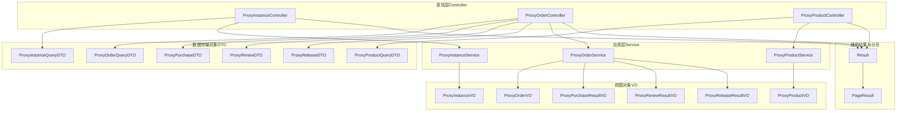
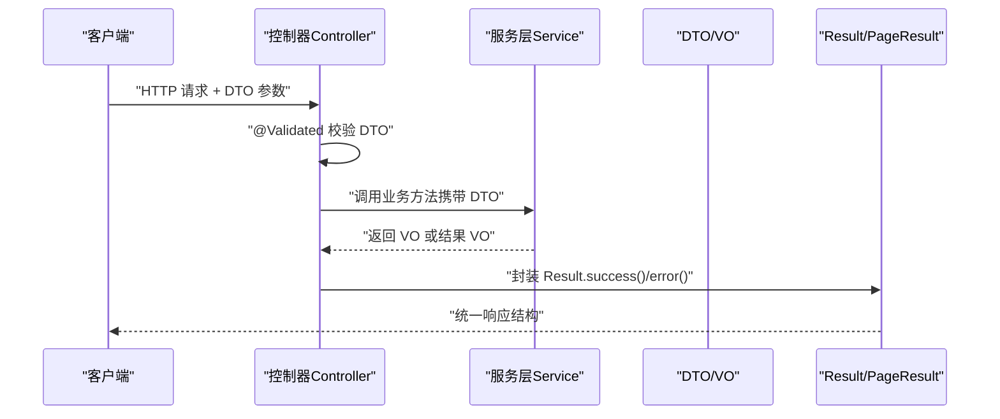
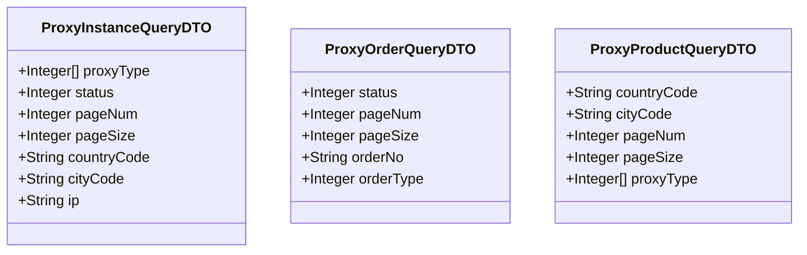
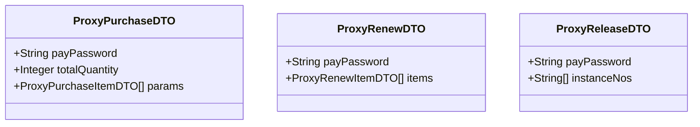
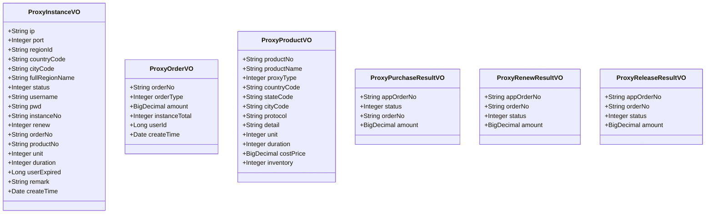
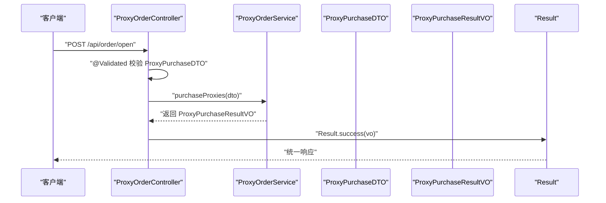
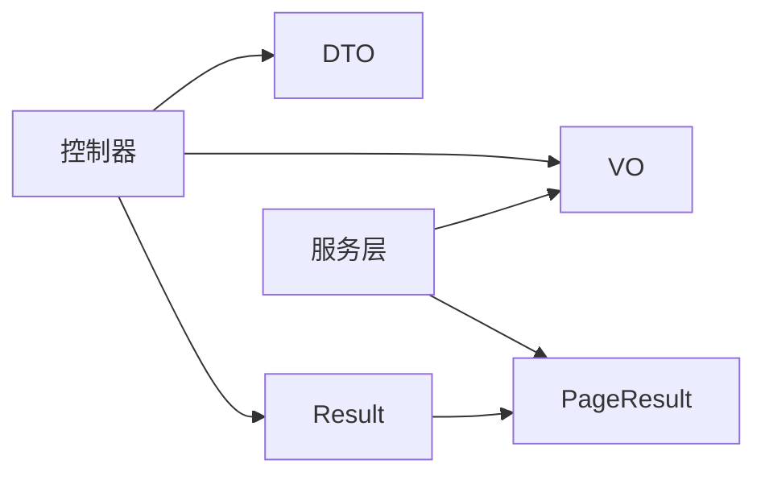

# DTO/VO 设计模式

<cite>
**本文引用的文件**
- [ProxyInstanceQueryDTO.java](file://src/main/java/cn/linkfast/dto/ProxyInstanceQueryDTO.java)
- [ProxyOrderQueryDTO.java](file://src/main/java/cn/linkfast/dto/ProxyOrderQueryDTO.java)
- [ProxyProductQueryDTO.java](file://src/main/java/cn/linkfast/dto/ProxyProductQueryDTO.java)
- [ProxyPurchaseDTO.java](file://src/main/java/cn/linkfast/dto/ProxyPurchaseDTO.java)
- [ProxyRenewDTO.java](file://src/main/java/cn/linkfast/dto/ProxyRenewDTO.java)
- [ProxyReleaseDTO.java](file://src/main/java/cn/linkfast/dto/ProxyReleaseDTO.java)
- [ProxyInstanceVO.java](file://src/main/java/cn/linkfast/vo/ProxyInstanceVO.java)
- [ProxyOrderVO.java](file://src/main/java/cn/linkfast/vo/ProxyOrderVO.java)
- [ProxyProductVO.java](file://src/main/java/cn/linkfast/vo/ProxyProductVO.java)
- [ProxyPurchaseResultVO.java](file://src/main/java/cn/linkfast/vo/ProxyPurchaseResultVO.java)
- [ProxyRenewResultVO.java](file://src/main/java/cn/linkfast/vo/ProxyRenewResultVO.java)
- [ProxyReleaseResultVO.java](file://src/main/java/cn/linkfast/vo/ProxyReleaseResultVO.java)
- [ProxyInstanceController.java](file://src/main/java/cn/linkfast/controller/ProxyInstanceController.java)
- [ProxyOrderController.java](file://src/main/java/cn/linkfast/controller/ProxyOrderController.java)
- [ProxyProductController.java](file://src/main/java/cn/linkfast/controller/ProxyProductController.java)
- [PageResult.java](file://src/main/java/cn/linkfast/common/PageResult.java)
- [Result.java](file://src/main/java/cn/linkfast/common/Result.java)
</cite>

## 目录
1. [引言](#引言)
2. [项目结构](#项目结构)
3. [核心组件](#核心组件)
4. [架构总览](#架构总览)
5. [详细组件分析](#详细组件分析)
6. [依赖分析](#依赖分析)
7. [性能考虑](#性能考虑)
8. [故障排查指南](#故障排查指南)
9. [结论](#结论)
10. [附录](#附录)

## 引言
本文件围绕 Link-Fast 项目的 DTO（数据传输对象）与 VO（视图对象）设计进行系统性梳理，明确其在 MVC 架构中的职责边界与协作方式，解释如何通过 DTO/VO 实现数据层与表现层的解耦，并给出查询、操作、结果等不同类型的 DTO 设计目的及对应的 VO 对象。同时，结合控制器层对 DTO/VO 的使用示例，说明参数封装、数据验证、响应格式化等实践，最后总结 DTO/VO 与实体模型之间的转换与映射策略。

## 项目结构
Link-Fast 采用标准的 MVC 分层组织，DTO/VO 主要位于 cn.linkfast.dto 与 cn.linkfast.vo 包中，控制器层通过 @Validated 对 DTO 进行参数校验，服务层处理业务逻辑，最终以 VO 或结果 VO 返回给前端；分页场景统一使用 PageResult<T> 容器承载当前页数据列表。

图表来源
- [ProxyInstanceController.java:1-52](file://src/main/java/cn/linkfast/controller/ProxyInstanceController.java#L1-L52)
- [ProxyOrderController.java:1-86](file://src/main/java/cn/linkfast/controller/ProxyOrderController.java#L1-L86)
- [ProxyProductController.java:1-34](file://src/main/java/cn/linkfast/controller/ProxyProductController.java#L1-L34)
- [ProxyInstanceQueryDTO.java:1-60](file://src/main/java/cn/linkfast/dto/ProxyInstanceQueryDTO.java#L1-L60)
- [ProxyOrderQueryDTO.java:1-57](file://src/main/java/cn/linkfast/dto/ProxyOrderQueryDTO.java#L1-L57)
- [ProxyProductQueryDTO.java:1-52](file://src/main/java/cn/linkfast/dto/ProxyProductQueryDTO.java#L1-L52)
- [ProxyPurchaseDTO.java:1-22](file://src/main/java/cn/linkfast/dto/ProxyPurchaseDTO.java#L1-L22)
- [ProxyRenewDTO.java:1-27](file://src/main/java/cn/linkfast/dto/ProxyRenewDTO.java#L1-L27)
- [ProxyReleaseDTO.java:1-27](file://src/main/java/cn/linkfast/dto/ProxyReleaseDTO.java#L1-L27)
- [ProxyInstanceVO.java:1-42](file://src/main/java/cn/linkfast/vo/ProxyInstanceVO.java#L1-L42)
- [ProxyOrderVO.java:1-47](file://src/main/java/cn/linkfast/vo/ProxyOrderVO.java#L1-L47)
- [ProxyProductVO.java:1-31](file://src/main/java/cn/linkfast/vo/ProxyProductVO.java#L1-L31)
- [ProxyPurchaseResultVO.java:1-13](file://src/main/java/cn/linkfast/vo/ProxyPurchaseResultVO.java#L1-L13)
- [ProxyRenewResultVO.java:1-20](file://src/main/java/cn/linkfast/vo/ProxyRenewResultVO.java#L1-L20)
- [ProxyReleaseResultVO.java:1-21](file://src/main/java/cn/linkfast/vo/ProxyReleaseResultVO.java#L1-L21)
- [PageResult.java:1-37](file://src/main/java/cn/linkfast/common/PageResult.java#L1-L37)
- [Result.java:1-59](file://src/main/java/cn/linkfast/common/Result.java#L1-L59)

章节来源
- [ProxyInstanceController.java:1-52](file://src/main/java/cn/linkfast/controller/ProxyInstanceController.java#L1-L52)
- [ProxyOrderController.java:1-86](file://src/main/java/cn/linkfast/controller/ProxyOrderController.java#L1-L86)
- [ProxyProductController.java:1-34](file://src/main/java/cn/linkfast/controller/ProxyProductController.java#L1-L34)
- [PageResult.java:1-37](file://src/main/java/cn/linkfast/common/PageResult.java#L1-L37)
- [Result.java:1-59](file://src/main/java/cn/linkfast/common/Result.java#L1-L59)

## 核心组件
- DTO（数据传输对象）
  - 查询型 DTO：用于接收前端查询参数，包含分页与筛选字段，通常配合 @Validated 进行参数校验。
  - 操作型 DTO：用于接收前端提交的操作请求，包含业务必需字段与必填校验。
  - 结果型 DTO：用于封装业务执行后的结果数据，便于统一返回。
- VO（视图对象）
  - 列表展示 VO：仅包含前端渲染所需字段，避免泄露敏感信息。
  - 结果展示 VO：封装成功后的关键信息，供前端展示与交互。
- 通用容器
  - Result<T>：统一响应结构，包含状态码、消息与数据。
  - PageResult<T>：分页容器，包含总数、总页数、当前页数据列表等。

章节来源
- [ProxyInstanceQueryDTO.java:1-60](file://src/main/java/cn/linkfast/dto/ProxyInstanceQueryDTO.java#L1-L60)
- [ProxyOrderQueryDTO.java:1-57](file://src/main/java/cn/linkfast/dto/ProxyOrderQueryDTO.java#L1-L57)
- [ProxyProductQueryDTO.java:1-52](file://src/main/java/cn/linkfast/dto/ProxyProductQueryDTO.java#L1-L52)
- [ProxyPurchaseDTO.java:1-22](file://src/main/java/cn/linkfast/dto/ProxyPurchaseDTO.java#L1-L22)
- [ProxyRenewDTO.java:1-27](file://src/main/java/cn/linkfast/dto/ProxyRenewDTO.java#L1-L27)
- [ProxyReleaseDTO.java:1-27](file://src/main/java/cn/linkfast/dto/ProxyReleaseDTO.java#L1-L27)
- [ProxyInstanceVO.java:1-42](file://src/main/java/cn/linkfast/vo/ProxyInstanceVO.java#L1-L42)
- [ProxyOrderVO.java:1-47](file://src/main/java/cn/linkfast/vo/ProxyOrderVO.java#L1-L47)
- [ProxyProductVO.java:1-31](file://src/main/java/cn/linkfast/vo/ProxyProductVO.java#L1-L31)
- [ProxyPurchaseResultVO.java:1-13](file://src/main/java/cn/linkfast/vo/ProxyPurchaseResultVO.java#L1-L13)
- [ProxyRenewResultVO.java:1-20](file://src/main/java/cn/linkfast/vo/ProxyRenewResultVO.java#L1-L20)
- [ProxyReleaseResultVO.java:1-21](file://src/main/java/cn/linkfast/vo/ProxyReleaseResultVO.java#L1-L21)
- [PageResult.java:1-37](file://src/main/java/cn/linkfast/common/PageResult.java#L1-L37)
- [Result.java:1-59](file://src/main/java/cn/linkfast/common/Result.java#L1-L59)

## 架构总览
下图展示了控制器层如何接收 DTO，调用服务层，再以 VO 或结果 VO 返回，并通过 Result 与 PageResult 统一包装响应。

图表来源
- [ProxyInstanceController.java:31-36](file://src/main/java/cn/linkfast/controller/ProxyInstanceController.java#L31-L36)
- [ProxyOrderController.java:44-47](file://src/main/java/cn/linkfast/controller/ProxyOrderController.java#L44-L47)
- [ProxyProductController.java:29-33](file://src/main/java/cn/linkfast/controller/ProxyProductController.java#L29-L33)
- [Result.java:28-44](file://src/main/java/cn/linkfast/common/Result.java#L28-L44)
- [PageResult.java:30-36](file://src/main/java/cn/linkfast/common/PageResult.java#L30-L36)

## 详细组件分析

### 查询 DTO 设计与用途
- 代理实例查询 DTO
  - 字段覆盖代理类型、状态、国家/城市代码、IP 等筛选条件，以及分页参数 pageNum/pageSize，并设置最小值与最大值约束。
  - 适用于分页查询代理实例列表的场景，确保前端传参合法。
- 订单查询 DTO
  - 字段包含订单状态、订单号、订单类型等筛选条件，以及分页参数校验。
  - 用于分页查询订单列表。
- 产品查询 DTO
  - 字段包含国家/城市代码、代理类型列表、分页参数等，支持多类型筛选。
  - 用于分页查询代理产品列表。

图表来源
- [ProxyInstanceQueryDTO.java:14-58](file://src/main/java/cn/linkfast/dto/ProxyInstanceQueryDTO.java#L14-L58)
- [ProxyOrderQueryDTO.java:18-56](file://src/main/java/cn/linkfast/dto/ProxyOrderQueryDTO.java#L18-L56)
- [ProxyProductQueryDTO.java:16-51](file://src/main/java/cn/linkfast/dto/ProxyProductQueryDTO.java#L16-L51)

章节来源
- [ProxyInstanceQueryDTO.java:1-60](file://src/main/java/cn/linkfast/dto/ProxyInstanceQueryDTO.java#L1-L60)
- [ProxyOrderQueryDTO.java:1-57](file://src/main/java/cn/linkfast/dto/ProxyOrderQueryDTO.java#L1-L57)
- [ProxyProductQueryDTO.java:1-52](file://src/main/java/cn/linkfast/dto/ProxyProductQueryDTO.java#L1-L52)

### 操作 DTO 设计与用途
- 采购 DTO
  - 包含支付密码、总数量与订单项列表，用于批量购买代理实例。
- 续费 DTO
  - 包含支付密码与续费实例列表，用于批量续费代理实例。
- 释放 DTO
  - 包含支付密码与平台实例编号列表，用于批量释放代理实例。

图表来源
- [ProxyPurchaseDTO.java:9-19](file://src/main/java/cn/linkfast/dto/ProxyPurchaseDTO.java#L9-L19)
- [ProxyRenewDTO.java:12-26](file://src/main/java/cn/linkfast/dto/ProxyRenewDTO.java#L12-L26)
- [ProxyReleaseDTO.java:12-26](file://src/main/java/cn/linkfast/dto/ProxyReleaseDTO.java#L12-L26)

章节来源
- [ProxyPurchaseDTO.java:1-22](file://src/main/java/cn/linkfast/dto/ProxyPurchaseDTO.java#L1-L22)
- [ProxyRenewDTO.java:1-27](file://src/main/java/cn/linkfast/dto/ProxyRenewDTO.java#L1-L27)
- [ProxyReleaseDTO.java:1-27](file://src/main/java/cn/linkfast/dto/ProxyReleaseDTO.java#L1-L27)

### 结果 DTO 与 VO 设计
- 列表展示 VO
  - 代理实例 VO：包含 IP、端口、地域信息、状态、账号密码、订单号、周期单位与时长、过期时间、备注、创建时间等字段，满足前端列表渲染。
  - 订单 VO：包含平台订单号、订单类型、金额、实例总数、买家用户 ID、创建时间等字段。
  - 产品 VO：包含产品编号、名称、代理类型、国家/省份/城市代码、协议类型、详情描述、单位、时长、成本价、库存等字段。
- 结果展示 VO
  - 采购结果 VO：包含应用订单号、状态、平台订单号、金额。
  - 续费结果 VO：包含应用订单号、平台订单号、状态、金额。
  - 释放结果 VO：包含应用订单号、平台订单号、状态、金额。

图表来源
- [ProxyInstanceVO.java:12-41](file://src/main/java/cn/linkfast/vo/ProxyInstanceVO.java#L12-L41)
- [ProxyOrderVO.java:13-47](file://src/main/java/cn/linkfast/vo/ProxyOrderVO.java#L13-L47)
- [ProxyProductVO.java:13-31](file://src/main/java/cn/linkfast/vo/ProxyProductVO.java#L13-L31)
- [ProxyPurchaseResultVO.java:5-11](file://src/main/java/cn/linkfast/vo/ProxyPurchaseResultVO.java#L5-L11)
- [ProxyRenewResultVO.java:12-19](file://src/main/java/cn/linkfast/vo/ProxyRenewResultVO.java#L12-L19)
- [ProxyReleaseResultVO.java:14-20](file://src/main/java/cn/linkfast/vo/ProxyReleaseResultVO.java#L14-L20)

章节来源
- [ProxyInstanceVO.java:1-42](file://src/main/java/cn/linkfast/vo/ProxyInstanceVO.java#L1-L42)
- [ProxyOrderVO.java:1-47](file://src/main/java/cn/linkfast/vo/ProxyOrderVO.java#L1-L47)
- [ProxyProductVO.java:1-31](file://src/main/java/cn/linkfast/vo/ProxyProductVO.java#L1-L31)
- [ProxyPurchaseResultVO.java:1-13](file://src/main/java/cn/linkfast/vo/ProxyPurchaseResultVO.java#L1-L13)
- [ProxyRenewResultVO.java:1-20](file://src/main/java/cn/linkfast/vo/ProxyRenewResultVO.java#L1-L20)
- [ProxyReleaseResultVO.java:1-21](file://src/main/java/cn/linkfast/vo/ProxyReleaseResultVO.java#L1-L21)

### 控制器中的 DTO/VO 使用流程
- 代理实例控制器
  - GET /api/instance/list：接收 ProxyInstanceQueryDTO，返回 PageResult<ProxyInstanceVO>，并通过 Result.success 封装统一响应。
  - PUT /api/instance/remark：接收 ProxyInstanceRemarkDTO（未在本文列出），更新实例备注。
- 订单控制器
  - GET /api/order/list：接收 ProxyOrderQueryDTO，返回 PageResult<ProxyOrderVO>。
  - POST /api/order/open：接收 ProxyPurchaseDTO，返回 ProxyPurchaseResultVO。
  - POST /api/order/renew：接收 ProxyRenewDTO，返回 ProxyRenewResultVO，并捕获业务异常。
  - POST /api/order/release：接收 ProxyReleaseDTO，返回 ProxyReleaseResultVO，并捕获业务异常。
- 产品控制器
  - GET /api/proxy-product/list：接收 ProxyProductQueryDTO，返回 PageResult<ProxyProductVO>。

图表来源
- [ProxyOrderController.java:44-47](file://src/main/java/cn/linkfast/controller/ProxyOrderController.java#L44-L47)
- [ProxyPurchaseDTO.java:9-19](file://src/main/java/cn/linkfast/dto/ProxyPurchaseDTO.java#L9-L19)
- [ProxyPurchaseResultVO.java:5-11](file://src/main/java/cn/linkfast/vo/ProxyPurchaseResultVO.java#L5-L11)
- [Result.java:28-35](file://src/main/java/cn/linkfast/common/Result.java#L28-L35)

章节来源
- [ProxyInstanceController.java:31-48](file://src/main/java/cn/linkfast/controller/ProxyInstanceController.java#L31-L48)
- [ProxyOrderController.java:36-83](file://src/main/java/cn/linkfast/controller/ProxyOrderController.java#L36-L83)
- [ProxyProductController.java:29-33](file://src/main/java/cn/linkfast/controller/ProxyProductController.java#L29-L33)

### DTO/VO 与实体模型的映射策略
- 映射原则
  - DTO 仅承载接口契约所需的字段，避免将实体模型直接暴露给表现层。
  - VO 仅包含前端渲染所需字段，必要时进行脱敏与格式化（如金额、时间等）。
  - 分页场景统一使用 PageResult<T> 承载当前页数据列表，泛型 T 为 VO 类型。
  - 统一响应结构由 Result<T> 提供，包含状态码、消息与数据。
- 建议的映射流程
  - 控制器层接收 DTO，进行参数校验。
  - 服务层处理业务，将实体模型转换为 VO 或结果 VO。
  - 返回时通过 Result.success 封装，分页场景使用 PageResult<T>。
- 注意事项
  - DTO/VO 字段命名与语义需与接口文档一致，避免前后端误解。
  - 对于复杂对象（如列表、嵌套对象），应明确区分查询 DTO、操作 DTO 与结果 DTO 的职责。

章节来源
- [PageResult.java:14-36](file://src/main/java/cn/linkfast/common/PageResult.java#L14-L36)
- [Result.java:10-59](file://src/main/java/cn/linkfast/common/Result.java#L10-L59)

## 依赖分析
- 控制器依赖 DTO/VO
  - 控制器通过 @Validated 对 DTO 进行参数校验，随后调用服务层方法并返回 VO 或结果 VO。
- 服务层依赖实体模型与 DAO
  - 服务层负责业务逻辑与数据转换，将实体模型映射为 VO。
- 通用容器
  - Result<T> 提供统一响应结构，PageResult<T> 提供分页容器，二者被控制器广泛使用。

图表来源
- [ProxyInstanceController.java:31-36](file://src/main/java/cn/linkfast/controller/ProxyInstanceController.java#L31-L36)
- [ProxyOrderController.java:36-39](file://src/main/java/cn/linkfast/controller/ProxyOrderController.java#L36-L39)
- [ProxyProductController.java:29-33](file://src/main/java/cn/linkfast/controller/ProxyProductController.java#L29-L33)
- [Result.java:28-44](file://src/main/java/cn/linkfast/common/Result.java#L28-L44)
- [PageResult.java:30-36](file://src/main/java/cn/linkfast/common/PageResult.java#L30-L36)

章节来源
- [ProxyInstanceController.java:1-52](file://src/main/java/cn/linkfast/controller/ProxyInstanceController.java#L1-L52)
- [ProxyOrderController.java:1-86](file://src/main/java/cn/linkfast/controller/ProxyOrderController.java#L1-L86)
- [ProxyProductController.java:1-34](file://src/main/java/cn/linkfast/controller/ProxyProductController.java#L1-L34)
- [Result.java:1-59](file://src/main/java/cn/linkfast/common/Result.java#L1-L59)
- [PageResult.java:1-37](file://src/main/java/cn/linkfast/common/PageResult.java#L1-L37)

## 性能考虑
- DTO/VO 粒度控制
  - 仅包含必要字段，减少序列化体积与网络传输开销。
- 分页参数限制
  - 对 pageNum/pageSize 设置最小值与最大值，防止超大分页导致数据库压力过大。
- 统一响应与分页容器
  - 使用 Result 与 PageResult 统一封装，降低前端解析成本，提升一致性体验。

## 故障排查指南
- 参数校验失败
  - 现象：控制器返回统一错误响应，message 中包含校验失败信息。
  - 排查：检查 DTO 上的注解配置（如 @NotNull、@Min、@Max）与前端传参是否匹配。
- 业务异常
  - 现象：控制器捕获业务异常并返回统一错误响应。
  - 排查：查看服务层抛出的业务异常类型与消息，确认前端提示是否合理。
- 响应结构不一致
  - 现象：部分接口返回数据结构与预期不符。
  - 排查：确认控制器是否正确使用 Result.success/error，分页场景是否使用 PageResult<T>。

章节来源
- [ProxyOrderController.java:55-65](file://src/main/java/cn/linkfast/controller/ProxyOrderController.java#L55-L65)
- [ProxyOrderController.java:70-83](file://src/main/java/cn/linkfast/controller/ProxyOrderController.java#L70-L83)
- [Result.java:37-44](file://src/main/java/cn/linkfast/common/Result.java#L37-L44)

## 结论
Link-Fast 通过 DTO/VO 将接口契约、参数校验、数据封装与表现层解耦，实现了清晰的职责划分与良好的扩展性。查询 DTO、操作 DTO、结果 DTO 与各类 VO 的组合，既保证了接口的安全性与稳定性，又提升了前端交互体验。配合统一响应与分页容器，整体架构具备良好的可维护性与可演进性。

## 附录
- 常见使用场景
  - 查询列表：使用查询 DTO + PageResult<T> + VO。
  - 创建订单：使用操作 DTO + 结果 VO + Result。
  - 错误处理：使用 Result.error 统一返回错误信息。
- 最佳实践
  - DTO/VO 字段命名与语义保持一致，避免歧义。
  - 对外暴露的 VO 应进行必要的脱敏与格式化。
  - 分页参数严格校验，防止资源滥用。