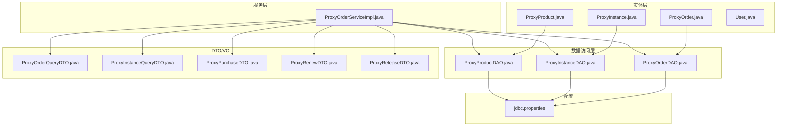
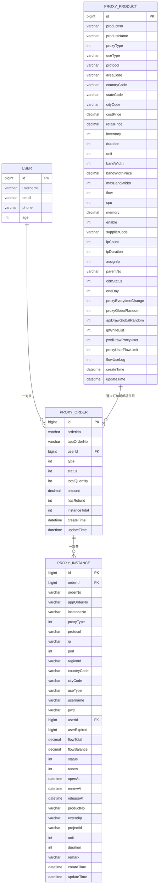
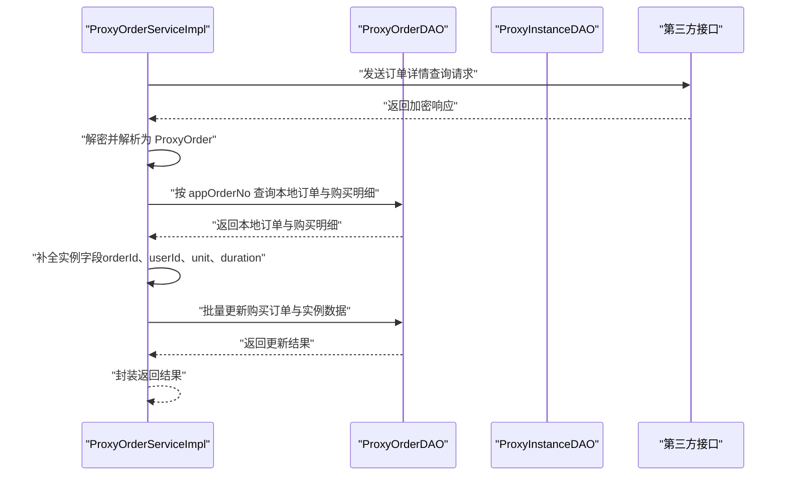
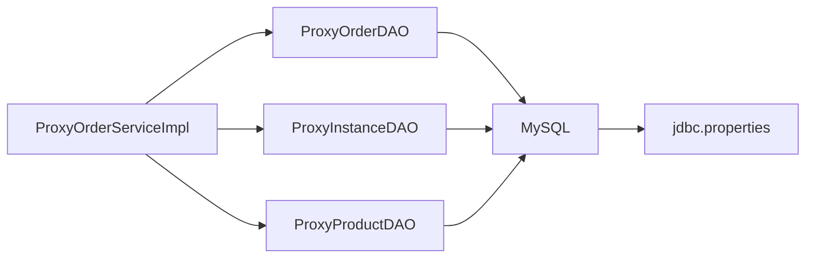

# 实体关系映射

<cite>
**本文引用的文件**
- [ProxyOrder.java](file://src/main/java/cn/linkfast/entity/ProxyOrder.java)
- [ProxyInstance.java](file://src/main/java/cn/linkfast/entity/ProxyInstance.java)
- [ProxyProduct.java](file://src/main/java/cn/linkfast/entity/ProxyProduct.java)
- [User.java](file://src/main/java/cn/linkfast/entity/User.java)
- [ProxyOrderDAO.java](file://src/main/java/cn/linkfast/dao/ProxyOrderDAO.java)
- [ProxyInstanceDAO.java](file://src/main/java/cn/linkfast/dao/ProxyInstanceDAO.java)
- [ProxyProductDAO.java](file://src/main/java/cn/linkfast/dao/ProxyProductDAO.java)
- [ProxyOrderServiceImpl.java](file://src/main/java/cn/linkfast/service/impl/ProxyOrderServiceImpl.java)
- [ProxyOrderQueryDTO.java](file://src/main/java/cn/linkfast/dto/ProxyOrderQueryDTO.java)
- [ProxyInstanceQueryDTO.java](file://src/main/java/cn/linkfast/dto/ProxyInstanceQueryDTO.java)
- [ProxyPurchaseDTO.java](file://src/main/java/cn/linkfast/dto/ProxyPurchaseDTO.java)
- [ProxyRenewDTO.java](file://src/main/java/cn/linkfast/dto/ProxyRenewDTO.java)
- [ProxyReleaseDTO.java](file://src/main/java/cn/linkfast/dto/ProxyReleaseDTO.java)
- [jdbc.properties](file://src/main/resources/jdbc.properties)
</cite>

## 目录
1. [引言](#引言)
2. [项目结构](#项目结构)
3. [核心组件](#核心组件)
4. [架构概览](#架构概览)
5. [详细组件分析](#详细组件分析)
6. [依赖分析](#依赖分析)
7. [性能考虑](#性能考虑)
8. [故障排查指南](#故障排查指南)
9. [结论](#结论)
10. [附录](#附录)

## 引言
本文件聚焦 Link-Fast 项目的“实体关系映射”，系统性梳理核心实体之间的关系设计，明确一对一、一对多、多对多关系的实现方式与约束策略；重点覆盖以下关系链路：
- ProxyOrder 与 ProxyInstance 的一对多关系
- ProxyProduct 与 ProxyOrder 的关联关系（通过订单明细项）
- User 与 ProxyOrder 的关联关系（用户维度）

同时，结合服务层与 DAO 层的实现细节，解释外键约束的设计原则、数据库层面的关系维护策略、级联操作、数据一致性保障以及查询优化策略，并提供实体关系图与数据流图，帮助开发者快速理解业务逻辑的数据支撑结构。

## 项目结构
从代码组织看，项目采用典型的分层架构：
- 实体层（entity）：定义核心业务实体及内嵌集合
- 数据访问层（dao 接口）：定义与数据库交互的契约
- 服务层（service impl）：封装业务流程、事务控制与第三方接口对接
- 控制器层（controller）：对外暴露 API（本文件不展开）
- DTO/VO 层：输入输出参数与展示对象
- 配置层：数据库连接配置

图表来源
- [ProxyOrder.java:1-45](file://src/main/java/cn/linkfast/entity/ProxyOrder.java#L1-L45)
- [ProxyInstance.java:1-57](file://src/main/java/cn/linkfast/entity/ProxyInstance.java#L1-L57)
- [ProxyProduct.java:1-99](file://src/main/java/cn/linkfast/entity/ProxyProduct.java#L1-L99)
- [User.java:1-74](file://src/main/java/cn/linkfast/entity/User.java#L1-L74)
- [ProxyOrderDAO.java:1-102](file://src/main/java/cn/linkfast/dao/ProxyOrderDAO.java#L1-L102)
- [ProxyInstanceDAO.java:1-47](file://src/main/java/cn/linkfast/dao/ProxyInstanceDAO.java#L1-L47)
- [ProxyProductDAO.java:1-25](file://src/main/java/cn/linkfast/dao/ProxyProductDAO.java#L1-L25)
- [ProxyOrderServiceImpl.java:1-200](file://src/main/java/cn/linkfast/service/impl/ProxyOrderServiceImpl.java#L1-L200)
- [ProxyOrderQueryDTO.java:1-57](file://src/main/java/cn/linkfast/dto/ProxyOrderQueryDTO.java#L1-L57)
- [ProxyInstanceQueryDTO.java:1-60](file://src/main/java/cn/linkfast/dto/ProxyInstanceQueryDTO.java#L1-L60)
- [ProxyPurchaseDTO.java:1-22](file://src/main/java/cn/linkfast/dto/ProxyPurchaseDTO.java#L1-L22)
- [ProxyRenewDTO.java:1-27](file://src/main/java/cn/linkfast/dto/ProxyRenewDTO.java#L1-L27)
- [ProxyReleaseDTO.java:1-27](file://src/main/java/cn/linkfast/dto/ProxyReleaseDTO.java#L1-L27)
- [jdbc.properties:1-39](file://src/main/resources/jdbc.properties#L1-L39)

章节来源
- [ProxyOrder.java:1-45](file://src/main/java/cn/linkfast/entity/ProxyOrder.java#L1-L45)
- [ProxyInstance.java:1-57](file://src/main/java/cn/linkfast/entity/ProxyInstance.java#L1-L57)
- [ProxyProduct.java:1-99](file://src/main/java/cn/linkfast/entity/ProxyProduct.java#L1-L99)
- [User.java:1-74](file://src/main/java/cn/linkfast/entity/User.java#L1-L74)
- [ProxyOrderDAO.java:1-102](file://src/main/java/cn/linkfast/dao/ProxyOrderDAO.java#L1-L102)
- [ProxyInstanceDAO.java:1-47](file://src/main/java/cn/linkfast/dao/ProxyInstanceDAO.java#L1-L47)
- [ProxyProductDAO.java:1-25](file://src/main/java/cn/linkfast/dao/ProxyProductDAO.java#L1-L25)
- [ProxyOrderServiceImpl.java:1-200](file://src/main/java/cn/linkfast/service/impl/ProxyOrderServiceImpl.java#L1-L200)
- [ProxyOrderQueryDTO.java:1-57](file://src/main/java/cn/linkfast/dto/ProxyOrderQueryDTO.java#L1-L57)
- [ProxyInstanceQueryDTO.java:1-60](file://src/main/java/cn/linkfast/dto/ProxyInstanceQueryDTO.java#L1-L60)
- [ProxyPurchaseDTO.java:1-22](file://src/main/java/cn/linkfast/dto/ProxyPurchaseDTO.java#L1-L22)
- [ProxyRenewDTO.java:1-27](file://src/main/java/cn/linkfast/dto/ProxyRenewDTO.java#L1-L27)
- [ProxyReleaseDTO.java:1-27](file://src/main/java/cn/linkfast/dto/ProxyReleaseDTO.java#L1-L27)
- [jdbc.properties:1-39](file://src/main/resources/jdbc.properties#L1-L39)

## 核心组件
- 实体层
  - ProxyOrder：平台订单主表，包含订单号、渠道商订单号、用户标识、订单类型、状态、数量、金额、退款标记、实例总数等字段，并聚合订单下的实例明细、购买/续费/释放明细集合。
  - ProxyInstance：代理实例表，包含实例编号、协议、IP、端口、区域信息、到期时间、流量、状态、是否自动续费、桥地址列表、开通/续费/释放时间、产品编号、购买周期单位与时长等。
  - ProxyProduct：代理产品表，包含产品编号、名称、代理类型、使用方式、协议、区域编码、成本价/零售价、库存、带宽、流量、CPU/内存、启用状态、供应商、项目清单、CIDR 块等。
  - User：用户实体，包含基础用户信息字段。
- DAO 层
  - ProxyOrderDAO：提供订单主表与明细表的读写、分页查询、计数、按渠道商订单号回写平台订单号与金额等能力。
  - ProxyInstanceDAO：提供实例批量更新、按条件分页查询、统计、按实例编号更新备注等能力。
  - ProxyProductDAO：提供产品批量保存/更新、按条件查询、按产品编号查询等能力。
- 服务层
  - ProxyOrderServiceImpl：负责订单同步、购买/续费/释放等业务流程，包含事务控制、第三方接口调用、实体转换与 DTO/VO 映射、分页查询等。

章节来源
- [ProxyOrder.java:11-45](file://src/main/java/cn/linkfast/entity/ProxyOrder.java#L11-L45)
- [ProxyInstance.java:9-57](file://src/main/java/cn/linkfast/entity/ProxyInstance.java#L9-L57)
- [ProxyProduct.java:13-99](file://src/main/java/cn/linkfast/entity/ProxyProduct.java#L13-L99)
- [User.java:3-74](file://src/main/java/cn/linkfast/entity/User.java#L3-L74)
- [ProxyOrderDAO.java:10-102](file://src/main/java/cn/linkfast/dao/ProxyOrderDAO.java#L10-L102)
- [ProxyInstanceDAO.java:11-47](file://src/main/java/cn/linkfast/dao/ProxyInstanceDAO.java#L11-L47)
- [ProxyProductDAO.java:8-25](file://src/main/java/cn/linkfast/dao/ProxyProductDAO.java#L8-L25)
- [ProxyOrderServiceImpl.java:34-200](file://src/main/java/cn/linkfast/service/impl/ProxyOrderServiceImpl.java#L34-L200)

## 架构概览
下图展示实体关系与服务层调用链路，体现 ProxyOrder 与 ProxyInstance 的一对多、ProxyProduct 与订单明细项的关联、以及 User 与 ProxyOrder 的关联。

图表来源
- [ProxyOrder.java:20-38](file://src/main/java/cn/linkfast/entity/ProxyOrder.java#L20-L38)
- [ProxyInstance.java:14-52](file://src/main/java/cn/linkfast/entity/ProxyInstance.java#L14-L52)
- [ProxyProduct.java:17-66](file://src/main/java/cn/linkfast/entity/ProxyProduct.java#L17-L66)
- [User.java:6-21](file://src/main/java/cn/linkfast/entity/User.java#L6-L21)

## 详细组件分析

### 关系设计与约束原则
- ProxyOrder 与 ProxyInstance 的一对多
  - 设计要点：ProxyOrder 作为父实体，ProxyInstance 作为子实体，通过 orderId 字段建立外键关联；ProxyOrder 聚合 instances 列表，体现“一”对“多”的关系。
  - 约束策略：orderId 与 orderNo、userId 等字段在服务层进行补全与校验，确保实例归属正确；DAO 层提供批量更新与分页查询能力，保障数据一致性与性能。
- ProxyProduct 与 ProxyOrder 的关联
  - 设计要点：通过订单明细项（购买/续费/释放）与产品编号 productNo 建立关联；服务层在同步第三方订单时，会根据购买明细项回填实例的周期单位与时长等字段。
  - 约束策略：购买明细项查询与实例字段补全在单次事务中完成，避免脏读与不一致。
- User 与 ProxyOrder 的关联
  - 设计要点：ProxyOrder 通过 userId 字段与 User 建立关联；服务层在同步第三方订单时，会将本地 userId 回写至实例字段，确保用户维度的可追溯性。

章节来源
- [ProxyOrder.java:20-44](file://src/main/java/cn/linkfast/entity/ProxyOrder.java#L20-L44)
- [ProxyInstance.java:14-29](file://src/main/java/cn/linkfast/entity/ProxyInstance.java#L14-L29)
- [ProxyOrderServiceImpl.java:106-135](file://src/main/java/cn/linkfast/service/impl/ProxyOrderServiceImpl.java#L106-L135)
- [ProxyOrderDAO.java:96-101](file://src/main/java/cn/linkfast/dao/ProxyOrderDAO.java#L96-L101)

### 数据流与业务流程
以下序列图展示“同步订单详情并补全实例字段”的关键流程，体现服务层如何协调 DAO 层与第三方接口，完成数据一致性与级联更新。

图表来源
- [ProxyOrderServiceImpl.java:91-136](file://src/main/java/cn/linkfast/service/impl/ProxyOrderServiceImpl.java#L91-L136)
- [ProxyOrderDAO.java:16-16](file://src/main/java/cn/linkfast/dao/ProxyOrderDAO.java#L16-L16)
- [ProxyOrderDAO.java:96-101](file://src/main/java/cn/linkfast/dao/ProxyOrderDAO.java#L96-L101)

### 查询与分页策略
- 订单查询
  - 通过 ProxyOrderQueryDTO 提供分页参数（pageNum、pageSize）与过滤条件（status、orderNo、orderType），服务层将其转换为 ProxyOrderSearchCondition 后交由 DAO 执行分页查询与计数。
- 实例查询
  - 通过 ProxyInstanceQueryDTO 提供分页参数与过滤条件（proxyType、status、countryCode、cityCode、ip），服务层转换为 ProxyInstanceSearchCondition 后执行分页查询与计数。
- 优化建议
  - 在 ProxyOrderDAO 与 ProxyInstanceDAO 的查询条件中增加必要的索引（如 appOrderNo、userId、orderNo、instanceNo、状态、时间范围等），以提升分页与过滤性能。
  - 对高频查询字段（如订单状态、实例状态、到期时间）建立复合索引，减少排序与过滤成本。

章节来源
- [ProxyOrderQueryDTO.java:18-57](file://src/main/java/cn/linkfast/dto/ProxyOrderQueryDTO.java#L18-L57)
- [ProxyInstanceQueryDTO.java:14-60](file://src/main/java/cn/linkfast/dto/ProxyInstanceQueryDTO.java#L14-L60)
- [ProxyOrderServiceImpl.java:139-154](file://src/main/java/cn/linkfast/service/impl/ProxyOrderServiceImpl.java#L139-L154)
- [ProxyInstanceDAO.java:21-35](file://src/main/java/cn/linkfast/dao/ProxyInstanceDAO.java#L21-L35)

### 事务与一致性保障
- 事务边界
  - 订单同步与实例补全在单个事务中执行，确保数据一致性；对于业务异常（如第三方接口错误）可能配置为不回滚，需结合具体异常类型与业务规则。
- 级联更新
  - 通过 DAO 层的批量更新接口，一次性回写订单与实例的关键字段（如平台订单号、金额、周期单位与时长），降低并发冲突概率。
- 幂等性
  - 服务层在补全实例字段前检查 appOrderNo 等关键字段是否存在，避免重复更新导致的数据错乱。

章节来源
- [ProxyOrderServiceImpl.java:89-136](file://src/main/java/cn/linkfast/service/impl/ProxyOrderServiceImpl.java#L89-L136)
- [ProxyOrderDAO.java:16-16](file://src/main/java/cn/linkfast/dao/ProxyOrderDAO.java#L16-L16)

### 外键约束与数据库层面的关系维护
- 外键字段
  - ProxyOrder.userId → User.id
  - ProxyInstance.orderId → ProxyOrder.id
  - ProxyInstance.userId → User.id
  - ProxyOrder 与明细表（购买/续费/释放）通过 appOrderNo 与订单主表关联
- 约束策略
  - 通过 DAO 层的批量更新与插入接口，确保外键引用的完整性；在服务层进行字段补全与校验，减少非法外键值进入数据库。
  - 建议在数据库层面设置外键约束与级联删除/更新策略，以保障数据一致性与引用完整性。

章节来源
- [ProxyOrder.java:23-23](file://src/main/java/cn/linkfast/entity/ProxyOrder.java#L23-L23)
- [ProxyInstance.java:15-29](file://src/main/java/cn/linkfast/entity/ProxyInstance.java#L15-L29)
- [ProxyOrderDAO.java:37-101](file://src/main/java/cn/linkfast/dao/ProxyOrderDAO.java#L37-L101)

## 依赖分析
- 服务层对 DAO 层的依赖
  - ProxyOrderServiceImpl 依赖 ProxyOrderDAO、ProxyInstanceDAO、ProxyProductDAO、PayService、AppOrderNoGenerator 等，形成清晰的业务编排层。
- DAO 层对数据库的依赖
  - 通过 jdbc.properties 配置 MySQL 连接参数，启用批处理与多查询等优化选项，提升批量写入与查询效率。
- DTO/VO 对服务层的依赖
  - DTO 作为输入参数，VO 作为输出对象，驱动服务层进行数据转换与业务处理。

图表来源
- [ProxyOrderServiceImpl.java:34-45](file://src/main/java/cn/linkfast/service/impl/ProxyOrderServiceImpl.java#L34-L45)
- [ProxyOrderDAO.java:10-102](file://src/main/java/cn/linkfast/dao/ProxyOrderDAO.java#L10-L102)
- [ProxyInstanceDAO.java:11-47](file://src/main/java/cn/linkfast/dao/ProxyInstanceDAO.java#L11-L47)
- [ProxyProductDAO.java:8-25](file://src/main/java/cn/linkfast/dao/ProxyProductDAO.java#L8-L25)
- [jdbc.properties:1-39](file://src/main/resources/jdbc.properties#L1-L39)

章节来源
- [ProxyOrderServiceImpl.java:34-45](file://src/main/java/cn/linkfast/service/impl/ProxyOrderServiceImpl.java#L34-L45)
- [ProxyOrderDAO.java:10-102](file://src/main/java/cn/linkfast/dao/ProxyOrderDAO.java#L10-L102)
- [ProxyInstanceDAO.java:11-47](file://src/main/java/cn/linkfast/dao/ProxyInstanceDAO.java#L11-L47)
- [ProxyProductDAO.java:8-25](file://src/main/java/cn/linkfast/dao/ProxyProductDAO.java#L8-L25)
- [jdbc.properties:1-39](file://src/main/resources/jdbc.properties#L1-L39)

## 性能考虑
- 批量操作
  - 使用批量更新与批量插入接口（如 DAO 的批量更新与明细项批量插入），减少往返次数与锁竞争。
- 分页与索引
  - 对高频过滤字段（如 appOrderNo、userId、status、时间范围）建立合适索引，避免全表扫描。
- 连接池与超时
  - jdbc.properties 中开启批处理与多查询、设置合理的 socket/connect 超时，有助于提升吞吐与稳定性。
- 缓存与去重
  - 对于高频查询（如按 appOrderNo 查询本地订单与购买明细），可在服务层进行缓存与去重，降低数据库压力。

章节来源
- [ProxyOrderDAO.java:67-88](file://src/main/java/cn/linkfast/dao/ProxyOrderDAO.java#L67-L88)
- [ProxyInstanceDAO.java:19-44](file://src/main/java/cn/linkfast/dao/ProxyInstanceDAO.java#L19-L44)
- [jdbc.properties:10-17](file://src/main/resources/jdbc.properties#L10-L17)

## 故障排查指南
- 第三方接口异常
  - 当第三方响应为空或返回错误时，服务层会抛出运行时异常；需检查网络连通性、签名与加解密流程、环境配置（沙盒/生产）。
- 订单同步失败
  - 若 appOrderNo 无法匹配本地订单或购买明细缺失，可能导致实例字段补全失败；需核对 appOrderNo 与订单状态。
- 事务回滚与不回滚
  - 对于业务异常（如支付密码错误、资源不足），服务层可能配置为不回滚；需结合异常类型与日志定位问题。
- 数据库连接问题
  - 检查 jdbc.properties 中的连接参数与超时设置，确认数据库可达与账号权限。

章节来源
- [ProxyOrderServiceImpl.java:173-194](file://src/main/java/cn/linkfast/service/impl/ProxyOrderServiceImpl.java#L173-L194)
- [ProxyOrderServiceImpl.java:196-200](file://src/main/java/cn/linkfast/service/impl/ProxyOrderServiceImpl.java#L196-L200)
- [jdbc.properties:3-17](file://src/main/resources/jdbc.properties#L3-L17)

## 结论
本文件基于实体定义与服务/DAO 实现，系统化梳理了 Link-Fast 的核心实体关系：ProxyOrder 与 ProxyInstance 的一对多、ProxyProduct 与订单明细项的关联、User 与 ProxyOrder 的关联。通过事务控制、批量更新、DTO/VO 映射与分页查询策略，实现了高可用与高性能的业务闭环。建议在数据库层面完善外键约束与索引，持续优化查询路径与缓存策略，以进一步提升系统稳定性与扩展性。

## 附录
- 相关 DTO/VO
  - ProxyOrderQueryDTO、ProxyInstanceQueryDTO、ProxyPurchaseDTO、ProxyRenewDTO、ProxyReleaseDTO
- 数据库配置
  - jdbc.properties 中的连接参数与优化选项

章节来源
- [ProxyOrderQueryDTO.java:18-57](file://src/main/java/cn/linkfast/dto/ProxyOrderQueryDTO.java#L18-L57)
- [ProxyInstanceQueryDTO.java:14-60](file://src/main/java/cn/linkfast/dto/ProxyInstanceQueryDTO.java#L14-L60)
- [ProxyPurchaseDTO.java:10-22](file://src/main/java/cn/linkfast/dto/ProxyPurchaseDTO.java#L10-L22)
- [ProxyRenewDTO.java:12-27](file://src/main/java/cn/linkfast/dto/ProxyRenewDTO.java#L12-L27)
- [ProxyReleaseDTO.java:12-27](file://src/main/java/cn/linkfast/dto/ProxyReleaseDTO.java#L12-L27)
- [jdbc.properties:1-39](file://src/main/resources/jdbc.properties#L1-L39)