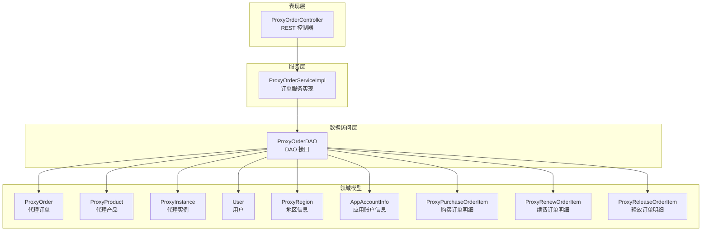
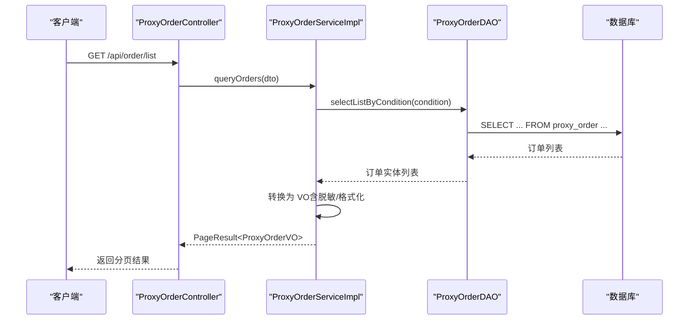
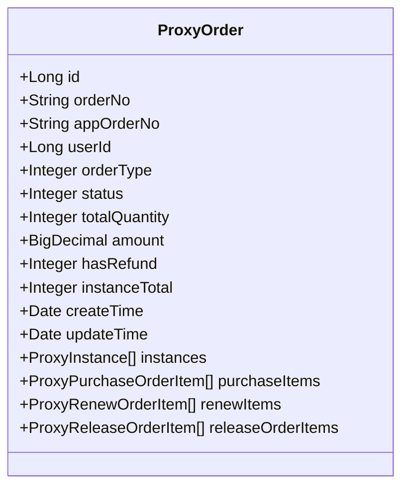
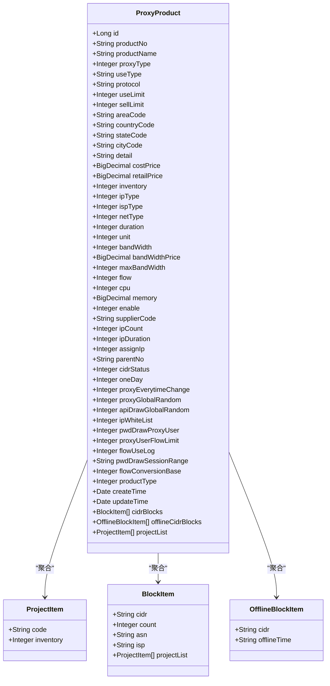
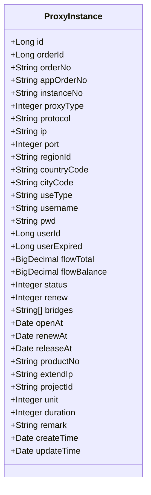
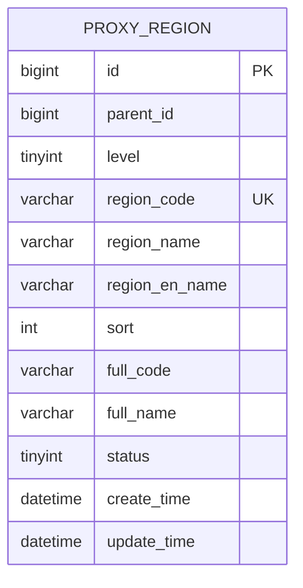
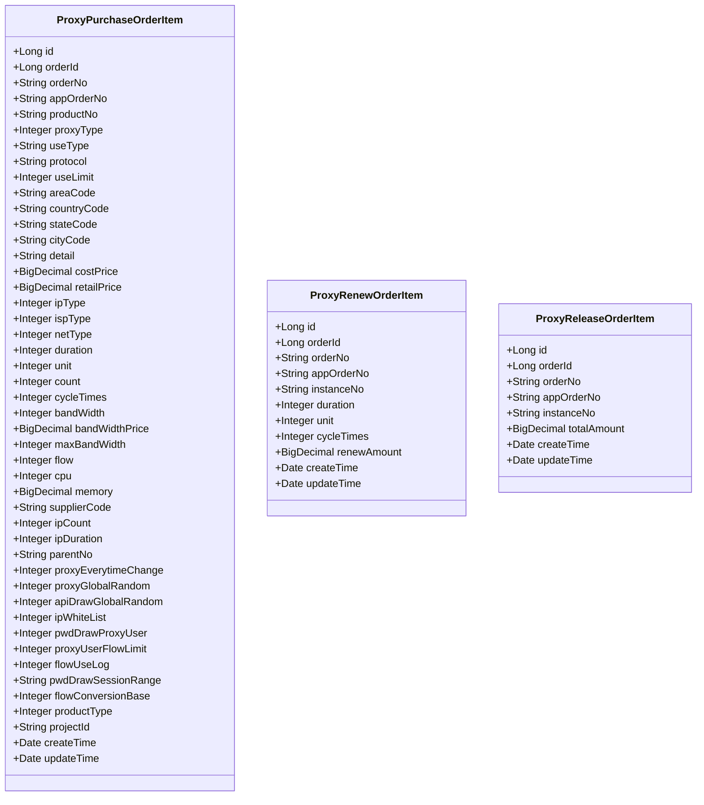
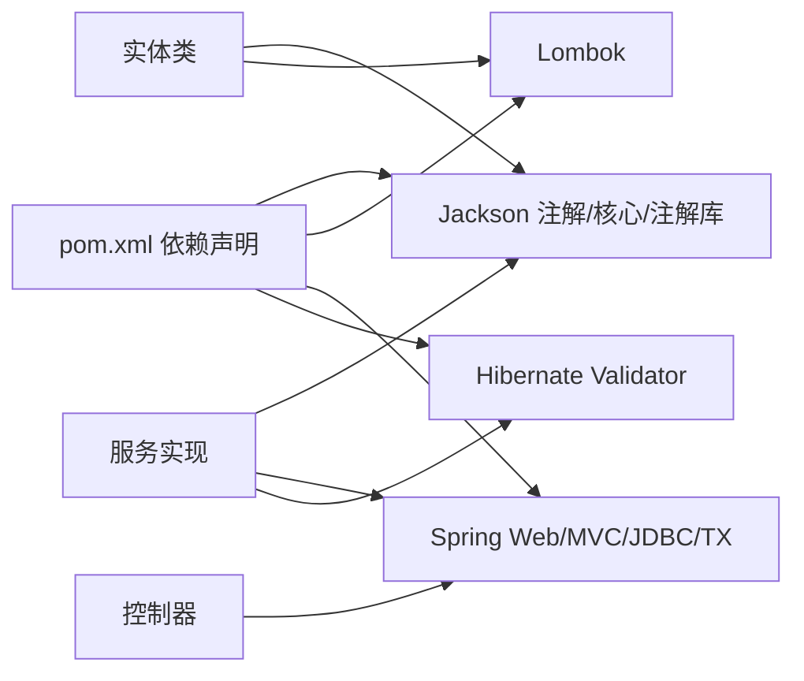

# 实体模型详解

<cite>
**本文档引用的文件**
- [ProxyOrder.java](file://src/main/java/cn/linkfast/entity/ProxyOrder.java)
- [ProxyProduct.java](file://src/main/java/cn/linkfast/entity/ProxyProduct.java)
- [ProxyInstance.java](file://src/main/java/cn/linkfast/entity/ProxyInstance.java)
- [User.java](file://src/main/java/cn/linkfast/entity/User.java)
- [ProxyRegion.java](file://src/main/java/cn/linkfast/entity/ProxyRegion.java)
- [AppAccountInfo.java](file://src/main/java/cn/linkfast/entity/AppAccountInfo.java)
- [ProxyPurchaseOrderItem.java](file://src/main/java/cn/linkfast/entity/ProxyPurchaseOrderItem.java)
- [ProxyRenewOrderItem.java](file://src/main/java/cn/linkfast/entity/ProxyRenewOrderItem.java)
- [ProxyReleaseOrderItem.java](file://src/main/java/cn/linkfast/entity/ProxyReleaseOrderItem.java)
- [region.sql](file://docs/database/region.sql)
- [pom.xml](file://pom.xml)
- [ProxyOrderServiceImpl.java](file://src/main/java/cn/linkfast/service/impl/ProxyOrderServiceImpl.java)
- [ProxyOrderController.java](file://src/main/java/cn/linkfast/controller/ProxyOrderController.java)
- [ProxyOrderDAO.java](file://src/main/java/cn/linkfast/dao/ProxyOrderDAO.java)
</cite>

## 目录
1. [简介](#简介)
2. [项目结构](#项目结构)
3. [核心组件](#核心组件)
4. [架构概览](#架构概览)
5. [详细组件分析](#详细组件分析)
6. [依赖分析](#依赖分析)
7. [性能考虑](#性能考虑)
8. [故障排查指南](#故障排查指南)
9. [结论](#结论)
10. [附录](#附录)

## 简介
本文件系统性梳理 Link-Fast 项目的实体模型，聚焦以下核心业务实体：
- ProxyOrder（代理订单）
- ProxyProduct（代理产品）
- ProxyInstance（代理实例）
- User（用户）
- ProxyRegion（地区信息）
- AppAccountInfo（应用账户信息）

文档从字段定义、数据类型、约束与业务含义出发，结合注解使用（如 Lombok、Jackson 注解）、DAO/Service/Controller 层交互，给出实体设计原则、索引策略、数据完整性约束以及最佳实践与使用示例，帮助开发者准确理解并正确使用这些核心数据结构。

## 项目结构
Link-Fast 采用典型的分层架构：controller -> service -> dao -> entity，实体位于 entity 包中，配合 DAO 接口与实现进行持久化操作；数据库层面通过 region.sql 定义了地区信息表的结构与索引。

图表来源
- [ProxyOrderController.java:1-86](file://src/main/java/cn/linkfast/controller/ProxyOrderController.java#L1-L86)
- [ProxyOrderServiceImpl.java:1-200](file://src/main/java/cn/linkfast/service/impl/ProxyOrderServiceImpl.java#L1-L200)
- [ProxyOrderDAO.java:1-102](file://src/main/java/cn/linkfast/dao/ProxyOrderDAO.java#L1-L102)
- [ProxyOrder.java:1-45](file://src/main/java/cn/linkfast/entity/ProxyOrder.java#L1-L45)
- [ProxyProduct.java:1-99](file://src/main/java/cn/linkfast/entity/ProxyProduct.java#L1-L99)
- [ProxyInstance.java:1-57](file://src/main/java/cn/linkfast/entity/ProxyInstance.java#L1-L57)
- [User.java:1-74](file://src/main/java/cn/linkfast/entity/User.java#L1-L74)
- [ProxyRegion.java:1-33](file://src/main/java/cn/linkfast/entity/ProxyRegion.java#L1-L33)
- [AppAccountInfo.java:1-50](file://src/main/java/cn/linkfast/entity/AppAccountInfo.java#L1-L50)
- [ProxyPurchaseOrderItem.java:1-158](file://src/main/java/cn/linkfast/entity/ProxyPurchaseOrderItem.java#L1-L158)
- [ProxyRenewOrderItem.java:1-47](file://src/main/java/cn/linkfast/entity/ProxyRenewOrderItem.java#L1-L47)
- [ProxyReleaseOrderItem.java:1-44](file://src/main/java/cn/linkfast/entity/ProxyReleaseOrderItem.java#L1-L44)

章节来源
- [pom.xml:1-278](file://pom.xml#L1-L278)

## 核心组件
本节对各实体进行字段、类型、注解与业务含义的系统梳理，并说明其在系统中的职责与约束。

- ProxyOrder（代理订单）
  - 字段要点：主键 id、平台订单号 orderNo、渠道商订单号 appOrderNo、用户标识 userId、订单类型 orderType、状态 status、数量与金额相关字段、时间戳字段、聚合的实例与明细列表。
  - 注解与序列化：使用 Lombok 注解简化 getter/setter/toString；使用 Jackson 注解控制 JSON 字段映射。
  - 业务含义：承载一次代理业务的主干信息，聚合多个实例与不同类型的订单明细（购买/续费/释放）。
  - 约束与设计原则：字段命名清晰区分平台与渠道商标识；状态枚举化；金额使用高精度类型；时间字段统一为日期类型。

- ProxyProduct（代理产品）
  - 字段要点：产品编号 productNo、名称 productName、代理类型 proxyType、使用方式 useType、协议 protocol、区域与国家代码、成本与零售价格、库存、IP/带宽/流量/内存/CPU 等规格、启用状态 enable、供应商与父产品编号、特性开关、时间戳。
  - 注解与序列化：Lombok 注解；Jackson 忽略未知字段。
  - 业务含义：描述可售代理产品的完整规格与能力，包含内嵌的 CIDR 块、离线块与项目清单等扩展信息。
  - 设计原则：将复杂产品属性拆分为内嵌类，便于序列化与扩展；默认集合初始化，降低 DAO 层判空成本。

- ProxyInstance（代理实例）
  - 字段要点：主键 id、所属订单 orderId、平台订单号 orderNo、渠道商订单号 appOrderNo、实例编号 instanceNo、代理类型与协议、IP/端口、区域与国家/城市代码、使用方式、用户名/密码、用户标识 userId、到期时间、流量统计、状态、自动续费、桥接地址列表、开通/续费/释放时间、产品编号、扩展地址、项目编号、购买周期单位与时长、备注、创建/更新时间。
  - 注解与序列化：Lombok 注解；Jackson 时间格式化注解。
  - 业务含义：具体可用的代理实例，记录生命周期关键时间点与使用指标。
  - 设计原则：实例编号非空；时间字段统一格式化输出；桥接地址以 JSON 存储，便于扩展。

- User（用户）
  - 字段要点：主键 id、用户名 username、邮箱 email、手机号 phone、年龄 age。
  - 注解与序列化：标准 Java Bean 结构，无特殊注解。
  - 业务含义：渠道商或平台侧的用户主体，用于订单与实例归属。
  - 设计原则：最小化用户信息，避免冗余字段。

- ProxyRegion（地区信息）
  - 字段要点：主键 id、父节点 parentId、层级 level、区域编码 regionCode、中文/英文名称、排序值 sort、全路径编码 fullCode/fullName、状态 status、创建/更新时间。
  - 注解与序列化：Lombok 注解；Jackson 忽略未知字段。
  - 业务含义：支撑代理实例按地理维度分配与查询。
  - 数据库索引：唯一编码索引、父节点索引、层级索引、层级+父节点联合索引、全路径编码索引。

- AppAccountInfo（应用账户信息）
  - 字段要点：应用名称 appName、账户余额 coin、授信额度 credit、是否使用桥 useBridge、回调地址 callbackUrl、状态 status。
  - 注解与序列化：Lombok 注解；Jackson 忽略未知字段；实现序列化接口。
  - 业务含义：描述渠道商应用账户的关键信息，用于回调与风控。
  - 设计原则：字段语义明确，便于外部系统对接。

- 订单明细实体
  - ProxyPurchaseOrderItem（购买订单明细）：描述购买时的产品规格、价格、周期、带宽/流量/IP 等参数及特性开关。
  - ProxyRenewOrderItem（续费订单明细）：描述续费周期、单位、次数与金额。
  - ProxyReleaseOrderItem（释放订单明细）：描述释放实例与金额。

章节来源
- [ProxyOrder.java:1-45](file://src/main/java/cn/linkfast/entity/ProxyOrder.java#L1-L45)
- [ProxyProduct.java:1-99](file://src/main/java/cn/linkfast/entity/ProxyProduct.java#L1-L99)
- [ProxyInstance.java:1-57](file://src/main/java/cn/linkfast/entity/ProxyInstance.java#L1-L57)
- [User.java:1-74](file://src/main/java/cn/linkfast/entity/User.java#L1-L74)
- [ProxyRegion.java:1-33](file://src/main/java/cn/linkfast/entity/ProxyRegion.java#L1-L33)
- [AppAccountInfo.java:1-50](file://src/main/java/cn/linkfast/entity/AppAccountInfo.java#L1-L50)
- [ProxyPurchaseOrderItem.java:1-158](file://src/main/java/cn/linkfast/entity/ProxyPurchaseOrderItem.java#L1-L158)
- [ProxyRenewOrderItem.java:1-47](file://src/main/java/cn/linkfast/entity/ProxyRenewOrderItem.java#L1-L47)
- [ProxyReleaseOrderItem.java:1-44](file://src/main/java/cn/linkfast/entity/ProxyReleaseOrderItem.java#L1-L44)

## 架构概览
实体模型与服务层、控制器层的交互如下：

图表来源
- [ProxyOrderController.java:1-86](file://src/main/java/cn/linkfast/controller/ProxyOrderController.java#L1-L86)
- [ProxyOrderServiceImpl.java:139-154](file://src/main/java/cn/linkfast/service/impl/ProxyOrderServiceImpl.java#L139-L154)
- [ProxyOrderDAO.java:1-102](file://src/main/java/cn/linkfast/dao/ProxyOrderDAO.java#L1-L102)

## 详细组件分析

### ProxyOrder（代理订单）
- 字段设计原则
  - 平台与渠道商订单号分离，确保跨系统追踪能力。
  - 订单类型与状态枚举化，便于流程控制与审计。
  - 金额使用高精度类型，避免浮点误差。
  - 聚合实例与明细列表，减少多次查询。
- 注解与序列化
  - Lombok 自动生成 getter/setter/toString。
  - Jackson 忽略未知字段，提升接口兼容性。
  - JSON 字段别名映射（如 type/count/refund/total），保证与第三方接口一致。
- 业务含义
  - 作为一次代理业务的“主单”，承载购买/续费/释放三类明细与实例集合。
- 使用示例
  - 在服务层接收第三方返回的订单 JSON，解密后反序列化为 ProxyOrder，随后通过 DAO 批量写入主表与明细表。
  - 在控制器层提供分页查询接口，返回 VO 列表。

图表来源
- [ProxyOrder.java:1-45](file://src/main/java/cn/linkfast/entity/ProxyOrder.java#L1-L45)

章节来源
- [ProxyOrder.java:1-45](file://src/main/java/cn/linkfast/entity/ProxyOrder.java#L1-L45)
- [ProxyOrderServiceImpl.java:139-154](file://src/main/java/cn/linkfast/service/impl/ProxyOrderServiceImpl.java#L139-L154)
- [ProxyOrderController.java:36-39](file://src/main/java/cn/linkfast/controller/ProxyOrderController.java#L36-L39)

### ProxyProduct（代理产品）
- 字段设计原则
  - 产品规格全面覆盖 IP 类型、带宽、流量、CPU/内存、网络类型等。
  - 特性开关集中管理，便于后续扩展与灰度。
  - 默认集合初始化，降低 DAO 层判空成本。
- 注解与序列化
  - Lombok 注解；Jackson 忽略未知字段。
  - 内嵌类 ProjectItem、BlockItem、OfflineBlockItem 用于表达复杂结构。
- 业务含义
  - 描述可售代理产品的完整能力集，支持 CIDR 块、离线块与项目清单等扩展信息。
- 使用示例
  - 服务层在下单前校验产品规格与库存，结合购买明细项生成订单。

图表来源
- [ProxyProduct.java:1-99](file://src/main/java/cn/linkfast/entity/ProxyProduct.java#L1-L99)

章节来源
- [ProxyProduct.java:1-99](file://src/main/java/cn/linkfast/entity/ProxyProduct.java#L1-L99)

### ProxyInstance（代理实例）
- 字段设计原则
  - 实例编号非空，确保唯一性与可追踪性。
  - 时间字段统一格式化输出，便于前端展示。
  - 桥接地址以 JSON 存储，便于扩展与维护。
- 注解与序列化
  - Lombok 注解；Jackson 时间格式化注解。
- 业务含义
  - 具体可用的代理实例，记录生命周期关键时间点与使用指标。
- 使用示例
  - 服务层在同步第三方订单时，为实例补全本地字段（orderId、userId、unit、duration 等），随后批量更新。

图表来源
- [ProxyInstance.java:1-57](file://src/main/java/cn/linkfast/entity/ProxyInstance.java#L1-L57)

章节来源
- [ProxyInstance.java:1-57](file://src/main/java/cn/linkfast/entity/ProxyInstance.java#L1-L57)
- [ProxyOrderServiceImpl.java:106-133](file://src/main/java/cn/linkfast/service/impl/ProxyOrderServiceImpl.java#L106-L133)

### User（用户）
- 字段设计原则
  - 最小化用户信息，避免冗余字段。
- 使用示例
  - 作为订单与实例的归属主体，用于权限与审计。

章节来源
- [User.java:1-74](file://src/main/java/cn/linkfast/entity/User.java#L1-L74)

### ProxyRegion（地区信息）
- 字段设计原则
  - 支撑大洲-国家-州省-城市四级结构，提供全路径编码与名称，便于检索与展示。
- 数据库索引策略
  - 唯一编码索引：避免重复节点。
  - 父节点索引：快速查询子节点。
  - 层级索引：按层级筛选。
  - 层级+父节点联合索引：优化级联查询。
  - 全路径编码索引：快速定位全路径节点。
- 使用示例
  - 服务层在查询地区树或按全路径编码匹配时，利用索引提升性能。

图表来源
- [region.sql:1-20](file://docs/database/region.sql#L1-L20)

章节来源
- [ProxyRegion.java:1-33](file://src/main/java/cn/linkfast/entity/ProxyRegion.java#L1-L33)
- [region.sql:1-20](file://docs/database/region.sql#L1-L20)

### AppAccountInfo（应用账户信息）
- 字段设计原则
  - 字段语义明确，便于外部系统对接。
- 使用示例
  - 用于回调地址配置与风控额度管理。

章节来源
- [AppAccountInfo.java:1-50](file://src/main/java/cn/linkfast/entity/AppAccountInfo.java#L1-L50)

### 订单明细实体
- ProxyPurchaseOrderItem（购买订单明细）
  - 描述购买时的产品规格、价格、周期、带宽/流量/IP 等参数及特性开关。
- ProxyRenewOrderItem（续费订单明细）
  - 描述续费周期、单位、次数与金额。
- ProxyReleaseOrderItem（释放订单明细）
  - 描述释放实例与金额。

图表来源
- [ProxyPurchaseOrderItem.java:1-158](file://src/main/java/cn/linkfast/entity/ProxyPurchaseOrderItem.java#L1-L158)
- [ProxyRenewOrderItem.java:1-47](file://src/main/java/cn/linkfast/entity/ProxyRenewOrderItem.java#L1-L47)
- [ProxyReleaseOrderItem.java:1-44](file://src/main/java/cn/linkfast/entity/ProxyReleaseOrderItem.java#L1-L44)

章节来源
- [ProxyPurchaseOrderItem.java:1-158](file://src/main/java/cn/linkfast/entity/ProxyPurchaseOrderItem.java#L1-L158)
- [ProxyRenewOrderItem.java:1-47](file://src/main/java/cn/linkfast/entity/ProxyRenewOrderItem.java#L1-L47)
- [ProxyReleaseOrderItem.java:1-44](file://src/main/java/cn/linkfast/entity/ProxyReleaseOrderItem.java#L1-L44)

## 依赖分析
- 外部依赖
  - Spring Web/MVC、Jackson、Lombok、Druid、MySQL Connector、Hibernate Validator 等。
- 实体层依赖
  - Jackson 注解用于 JSON 序列化/反序列化与字段映射。
  - Lombok 注解用于简化实体类代码。
- 服务层依赖
  - ObjectMapper 用于 JSON 解析与脱敏/格式化。
  - DAO 接口负责持久化与批量写入。
- 控制器层依赖
  - 参数校验与分页封装。

图表来源
- [pom.xml:1-278](file://pom.xml#L1-L278)
- [ProxyOrderServiceImpl.java:1-200](file://src/main/java/cn/linkfast/service/impl/ProxyOrderServiceImpl.java#L1-L200)

章节来源
- [pom.xml:1-278](file://pom.xml#L1-L278)

## 性能考虑
- 索引策略
  - 地区信息表已建立多维索引，建议在查询父节点、层级、全路径编码时充分利用索引。
- 序列化与反序列化
  - 使用 Jackson 注解控制字段映射，避免不必要的字段传输，降低网络开销。
- 批量写入
  - 订单明细采用批量插入，减少事务往返与锁竞争。
- 时间格式化
  - 统一时间格式化输出，减少前端解析成本。

[本节为通用性能指导，无需特定文件来源]

## 故障排查指南
- JSON 映射问题
  - 若第三方返回字段与实体不一致，可通过 Jackson 注解或 DTO 层做适配。
- 订单同步异常
  - 检查服务层对响应体的解密与解析流程，确认异常分支的错误日志。
- 参数校验失败
  - 控制器层使用 Bean Validation，确保必填参数与格式正确。

章节来源
- [ProxyOrderController.java:56-82](file://src/main/java/cn/linkfast/controller/ProxyOrderController.java#L56-L82)
- [ProxyOrderServiceImpl.java:173-194](file://src/main/java/cn/linkfast/service/impl/ProxyOrderServiceImpl.java#L173-L194)

## 结论
Link-Fast 的实体模型围绕“订单—实例—产品—地区—账户”五大维度展开，通过清晰的字段设计、注解使用与分层架构，实现了与第三方系统的高效对接与内部业务的稳定运行。建议在后续迭代中：
- 持续完善字段注释与枚举值说明；
- 强化数据一致性校验与幂等设计；
- 优化复杂查询的索引策略与缓存机制。

[本节为总结性内容，无需特定文件来源]

## 附录
- 最佳实践
  - 使用 Lombok 简化实体类，但注意在团队内统一风格。
  - 使用 Jackson 注解精确控制 JSON 映射，避免字段泄露。
  - 在服务层进行必要的数据脱敏与格式化，保护敏感信息。
  - 对高频查询建立合理索引，避免全表扫描。
- 使用示例路径
  - 订单分页查询：[ProxyOrderController.java:36-39](file://src/main/java/cn/linkfast/controller/ProxyOrderController.java#L36-L39)
  - 订单同步与实例补全：[ProxyOrderServiceImpl.java:106-133](file://src/main/java/cn/linkfast/service/impl/ProxyOrderServiceImpl.java#L106-L133)
  - 批量插入明细：[ProxyOrderDAO.java:67-88](file://src/main/java/cn/linkfast/dao/ProxyOrderDAO.java#L67-L88)

[本节为补充说明，无需特定文件来源]