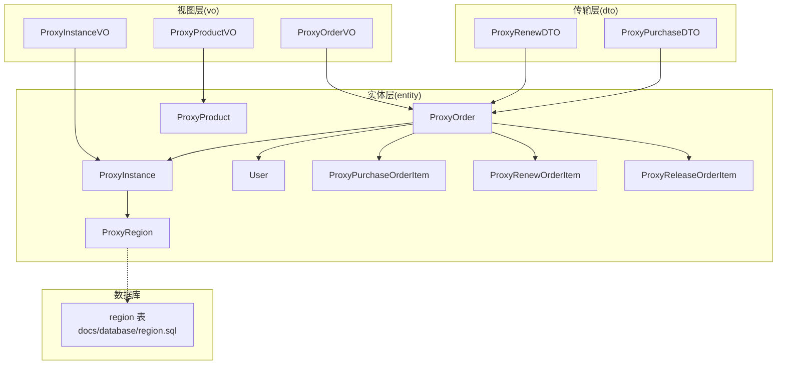
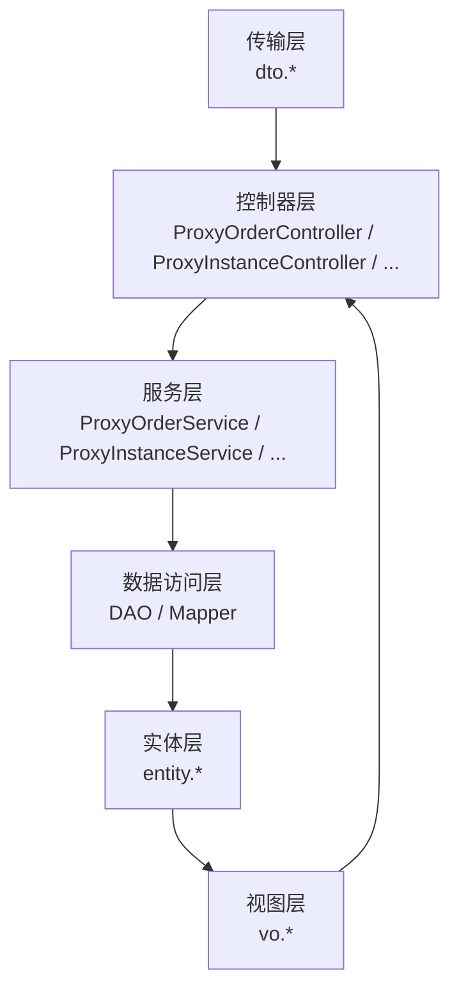
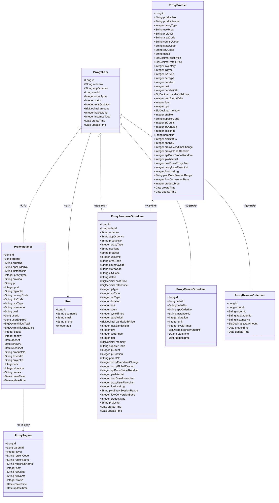
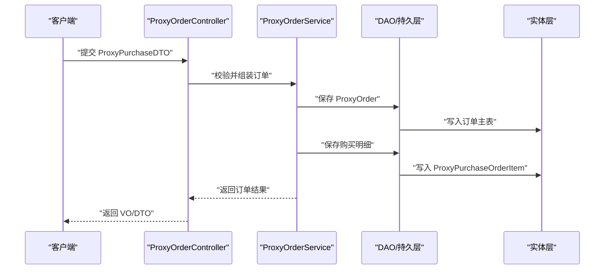
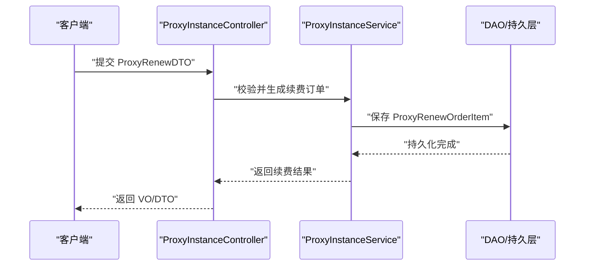
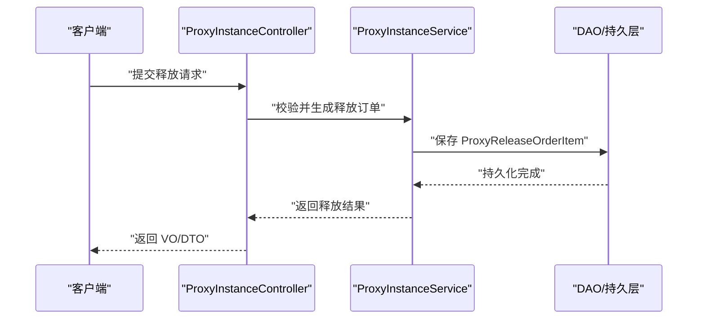

# 数据模型设计

<cite>
**本文引用的文件**
- [ProxyOrder.java](file://src/main/java/cn/linkfast/entity/ProxyOrder.java)
- [ProxyProduct.java](file://src/main/java/cn/linkfast/entity/ProxyProduct.java)
- [ProxyInstance.java](file://src/main/java/cn/linkfast/entity/ProxyInstance.java)
- [User.java](file://src/main/java/cn/linkfast/entity/User.java)
- [ProxyRegion.java](file://src/main/java/cn/linkfast/entity/ProxyRegion.java)
- [ProxyPurchaseOrderItem.java](file://src/main/java/cn/linkfast/entity/ProxyPurchaseOrderItem.java)
- [ProxyRenewOrderItem.java](file://src/main/java/cn/linkfast/entity/ProxyRenewOrderItem.java)
- [ProxyReleaseOrderItem.java](file://src/main/java/cn/linkfast/entity/ProxyReleaseOrderItem.java)
- [ProxyPurchaseDTO.java](file://src/main/java/cn/linkfast/dto/ProxyPurchaseDTO.java)
- [ProxyRenewDTO.java](file://src/main/java/cn/linkfast/dto/ProxyRenewDTO.java)
- [ProxyOrderVO.java](file://src/main/java/cn/linkfast/vo/ProxyOrderVO.java)
- [ProxyInstanceVO.java](file://src/main/java/cn/linkfast/vo/ProxyInstanceVO.java)
- [ProxyProductVO.java](file://src/main/java/cn/linkfast/vo/ProxyProductVO.java)
- [region.sql](file://docs/database/region.sql)
</cite>

## 目录
1. [简介](#简介)
2. [项目结构](#项目结构)
3. [核心组件](#核心组件)
4. [架构总览](#架构总览)
5. [详细组件分析](#详细组件分析)
6. [依赖分析](#依赖分析)
7. [性能考虑](#性能考虑)
8. [故障排查指南](#故障排查指南)
9. [结论](#结论)
10. [附录](#附录)

## 简介
本文件系统性梳理 Link-Fast 项目的实体模型与数据结构设计，覆盖核心业务实体（如 ProxyOrder、ProxyProduct、ProxyInstance、User、ProxyRegion）的字段定义、数据类型与约束；说明 DTO（数据传输对象）与 VO（视图对象）在各层之间的职责边界与传递路径；明确实体间的一对一、一对多、多对多关系映射；给出数据库表结构设计要点（主键、外键、索引、约束）与数据生命周期管理策略，并提供面向开发者的使用指南与最佳实践。

## 项目结构
围绕数据模型，项目采用分层组织：
- entity：持久化实体，承载业务领域模型与序列化元信息
- dto：服务层/控制器层输入参数校验与封装
- vo：面向前端展示的视图对象，负责字段裁剪与格式化
- docs/database：数据库脚本与区域表结构参考

图表来源
- [ProxyOrder.java:1-45](file://src/main/java/cn/linkfast/entity/ProxyOrder.java#L1-L45)
- [ProxyProduct.java:1-99](file://src/main/java/cn/linkfast/entity/ProxyProduct.java#L1-L99)
- [ProxyInstance.java:1-57](file://src/main/java/cn/linkfast/entity/ProxyInstance.java#L1-L57)
- [ProxyRegion.java:1-33](file://src/main/java/cn/linkfast/entity/ProxyRegion.java#L1-L33)
- [User.java:1-74](file://src/main/java/cn/linkfast/entity/User.java#L1-L74)
- [ProxyPurchaseOrderItem.java:1-158](file://src/main/java/cn/linkfast/entity/ProxyPurchaseOrderItem.java#L1-L158)
- [ProxyRenewOrderItem.java:1-47](file://src/main/java/cn/linkfast/entity/ProxyRenewOrderItem.java#L1-L47)
- [ProxyReleaseOrderItem.java:1-44](file://src/main/java/cn/linkfast/entity/ProxyReleaseOrderItem.java#L1-L44)
- [ProxyPurchaseDTO.java:1-22](file://src/main/java/cn/linkfast/dto/ProxyPurchaseDTO.java#L1-L22)
- [ProxyRenewDTO.java:1-27](file://src/main/java/cn/linkfast/dto/ProxyRenewDTO.java#L1-L27)
- [ProxyOrderVO.java:1-47](file://src/main/java/cn/linkfast/vo/ProxyOrderVO.java#L1-L47)
- [ProxyInstanceVO.java:1-42](file://src/main/java/cn/linkfast/vo/ProxyInstanceVO.java#L1-L42)
- [ProxyProductVO.java:1-31](file://src/main/java/cn/linkfast/vo/ProxyProductVO.java#L1-L31)
- [region.sql](file://docs/database/region.sql)

章节来源
- [ProxyOrder.java:1-45](file://src/main/java/cn/linkfast/entity/ProxyOrder.java#L1-L45)
- [ProxyProduct.java:1-99](file://src/main/java/cn/linkfast/entity/ProxyProduct.java#L1-L99)
- [ProxyInstance.java:1-57](file://src/main/java/cn/linkfast/entity/ProxyInstance.java#L1-L57)
- [ProxyRegion.java:1-33](file://src/main/java/cn/linkfast/entity/ProxyRegion.java#L1-L33)
- [User.java:1-74](file://src/main/java/cn/linkfast/entity/User.java#L1-L74)
- [ProxyPurchaseOrderItem.java:1-158](file://src/main/java/cn/linkfast/entity/ProxyPurchaseOrderItem.java#L1-L158)
- [ProxyRenewOrderItem.java:1-47](file://src/main/java/cn/linkfast/entity/ProxyRenewOrderItem.java#L1-L47)
- [ProxyReleaseOrderItem.java:1-44](file://src/main/java/cn/linkfast/entity/ProxyReleaseOrderItem.java#L1-L44)
- [ProxyPurchaseDTO.java:1-22](file://src/main/java/cn/linkfast/dto/ProxyPurchaseDTO.java#L1-L22)
- [ProxyRenewDTO.java:1-27](file://src/main/java/cn/linkfast/dto/ProxyRenewDTO.java#L1-L27)
- [ProxyOrderVO.java:1-47](file://src/main/java/cn/linkfast/vo/ProxyOrderVO.java#L1-L47)
- [ProxyInstanceVO.java:1-42](file://src/main/java/cn/linkfast/vo/ProxyInstanceVO.java#L1-L42)
- [ProxyProductVO.java:1-31](file://src/main/java/cn/linkfast/vo/ProxyProductVO.java#L1-L31)
- [region.sql](file://docs/database/region.sql)

## 核心组件
本节聚焦核心实体与关键字段的语义、类型与约束，帮助快速建立数据模型认知。

- ProxyOrder（代理订单）
  - 字段要点：平台订单号、渠道商订单号、买家用户ID、订单类型（购买/续费/释放）、状态、实例总数、总金额、是否退费、创建/更新时间等
  - 关系：聚合多个订单明细与实例
  - 约束：订单类型与状态枚举值；实例总数与明细数量一致性
  - 参考路径：[ProxyOrder.java:1-45](file://src/main/java/cn/linkfast/entity/ProxyOrder.java#L1-L45)

- ProxyProduct（代理产品）
  - 字段要点：产品编号/名称、代理类型、协议、使用方式、区域代码、成本价/零售价、库存、时长/单位、带宽/流量/内存/CPU、启用状态、供应商代码、父产品编号、若干开关型配置、创建/更新时间
  - 关系：包含 CIDR 块、离线块、项目清单等内嵌集合
  - 约束：默认集合初始化；配置项为开关型枚举
  - 参考路径：[ProxyProduct.java:1-99](file://src/main/java/cn/linkfast/entity/ProxyProduct.java#L1-L99)

- ProxyInstance（代理实例）
  - 字段要点：实例编号、所属订单、渠道商订单号、代理类型/协议/IP/端口、区域代码、使用方式、用户名/密码、买家用户ID、到期时间、总/剩余流量、状态、是否自动续费、桥接地址列表、开通/续费/释放时间、产品编号、扩展IP、项目ID、购买周期单位/时长、备注、创建/更新时间
  - 关系：属于某个订单；关联地域信息
  - 约束：实例编号唯一；到期时间以秒为时间戳；流量字段为数值类型
  - 参考路径：[ProxyInstance.java:1-57](file://src/main/java/cn/linkfast/entity/ProxyInstance.java#L1-L57)

- User（用户）
  - 字段要点：ID、用户名、邮箱、手机号、年龄
  - 约束：基础信息字段，用于标识渠道商买家身份
  - 参考路径：[User.java:1-74](file://src/main/java/cn/linkfast/entity/User.java#L1-L74)

- ProxyRegion（地域信息）
  - 字段要点：父节点ID、层级、区域编码/名称/英文名、排序、全码/全名、状态、创建/更新时间
  - 关系：树形层级结构，支撑大洲-国家-州省-城市四级
  - 约束：层级与全码/全名需与父子关系一致
  - 参考路径：[ProxyRegion.java:1-33](file://src/main/java/cn/linkfast/entity/ProxyRegion.java#L1-L33)

- 订单明细实体
  - ProxyPurchaseOrderItem（购买明细）：包含产品维度的价格、区域、带宽/流量/内存/CPU、周期单位/时长、周期次数、若干开关配置、项目ID等
  - ProxyRenewOrderItem（续费明细）：包含实例编号、周期单位/时长/次数、续费金额
  - ProxyReleaseOrderItem（释放明细）：包含实例编号、总金额
  - 参考路径：
    - [ProxyPurchaseOrderItem.java:1-158](file://src/main/java/cn/linkfast/entity/ProxyPurchaseOrderItem.java#L1-L158)
    - [ProxyRenewOrderItem.java:1-47](file://src/main/java/cn/linkfast/entity/ProxyRenewOrderItem.java#L1-L47)
    - [ProxyReleaseOrderItem.java:1-44](file://src/main/java/cn/linkfast/entity/ProxyReleaseOrderItem.java#L1-L44)

章节来源
- [ProxyOrder.java:1-45](file://src/main/java/cn/linkfast/entity/ProxyOrder.java#L1-L45)
- [ProxyProduct.java:1-99](file://src/main/java/cn/linkfast/entity/ProxyProduct.java#L1-L99)
- [ProxyInstance.java:1-57](file://src/main/java/cn/linkfast/entity/ProxyInstance.java#L1-L57)
- [User.java:1-74](file://src/main/java/cn/linkfast/entity/User.java#L1-L74)
- [ProxyRegion.java:1-33](file://src/main/java/cn/linkfast/entity/ProxyRegion.java#L1-L33)
- [ProxyPurchaseOrderItem.java:1-158](file://src/main/java/cn/linkfast/entity/ProxyPurchaseOrderItem.java#L1-L158)
- [ProxyRenewOrderItem.java:1-47](file://src/main/java/cn/linkfast/entity/ProxyRenewOrderItem.java#L1-L47)
- [ProxyReleaseOrderItem.java:1-44](file://src/main/java/cn/linkfast/entity/ProxyReleaseOrderItem.java#L1-L44)

## 架构总览
下图展示数据模型在系统中的角色与流转：

图表来源
- [ProxyOrder.java:1-45](file://src/main/java/cn/linkfast/entity/ProxyOrder.java#L1-L45)
- [ProxyInstance.java:1-57](file://src/main/java/cn/linkfast/entity/ProxyInstance.java#L1-L57)
- [ProxyOrderVO.java:1-47](file://src/main/java/cn/linkfast/vo/ProxyOrderVO.java#L1-L47)
- [ProxyInstanceVO.java:1-42](file://src/main/java/cn/linkfast/vo/ProxyInstanceVO.java#L1-L42)
- [ProxyPurchaseDTO.java:1-22](file://src/main/java/cn/linkfast/dto/ProxyPurchaseDTO.java#L1-L22)
- [ProxyRenewDTO.java:1-27](file://src/main/java/cn/linkfast/dto/ProxyRenewDTO.java#L1-L27)

## 详细组件分析

### 类图：实体与关系映射

图表来源
- [ProxyOrder.java:1-45](file://src/main/java/cn/linkfast/entity/ProxyOrder.java#L1-L45)
- [ProxyInstance.java:1-57](file://src/main/java/cn/linkfast/entity/ProxyInstance.java#L1-L57)
- [ProxyProduct.java:1-99](file://src/main/java/cn/linkfast/entity/ProxyProduct.java#L1-L99)
- [User.java:1-74](file://src/main/java/cn/linkfast/entity/User.java#L1-L74)
- [ProxyRegion.java:1-33](file://src/main/java/cn/linkfast/entity/ProxyRegion.java#L1-L33)
- [ProxyPurchaseOrderItem.java:1-158](file://src/main/java/cn/linkfast/entity/ProxyPurchaseOrderItem.java#L1-L158)
- [ProxyRenewOrderItem.java:1-47](file://src/main/java/cn/linkfast/entity/ProxyRenewOrderItem.java#L1-L47)
- [ProxyReleaseOrderItem.java:1-44](file://src/main/java/cn/linkfast/entity/ProxyReleaseOrderItem.java#L1-L44)

章节来源
- [ProxyOrder.java:1-45](file://src/main/java/cn/linkfast/entity/ProxyOrder.java#L1-L45)
- [ProxyInstance.java:1-57](file://src/main/java/cn/linkfast/entity/ProxyInstance.java#L1-L57)
- [ProxyProduct.java:1-99](file://src/main/java/cn/linkfast/entity/ProxyProduct.java#L1-L99)
- [User.java:1-74](file://src/main/java/cn/linkfast/entity/User.java#L1-L74)
- [ProxyRegion.java:1-33](file://src/main/java/cn/linkfast/entity/ProxyRegion.java#L1-L33)
- [ProxyPurchaseOrderItem.java:1-158](file://src/main/java/cn/linkfast/entity/ProxyPurchaseOrderItem.java#L1-L158)
- [ProxyRenewOrderItem.java:1-47](file://src/main/java/cn/linkfast/entity/ProxyRenewOrderItem.java#L1-L47)
- [ProxyReleaseOrderItem.java:1-44](file://src/main/java/cn/linkfast/entity/ProxyReleaseOrderItem.java#L1-L44)

### DTO/VO 设计模式与数据传递
- DTO（数据传输对象）
  - 用途：在控制器与服务层之间传递参数，承担入参校验与轻量封装
  - 示例：
    - ProxyPurchaseDTO：支付密码必填、总数量必填、订单项列表必填
    - ProxyRenewDTO：支付密码必填、续费实例列表必填且至少一项
  - 参考路径：
    - [ProxyPurchaseDTO.java:1-22](file://src/main/java/cn/linkfast/dto/ProxyPurchaseDTO.java#L1-L22)
    - [ProxyRenewDTO.java:1-27](file://src/main/java/cn/linkfast/dto/ProxyRenewDTO.java#L1-L27)

- VO（视图对象）
  - 用途：面向前端展示，裁剪敏感字段并进行格式化
  - 示例：
    - ProxyOrderVO：仅包含前端所需字段（订单号、类型、金额、实例总数、买家ID、创建时间）
    - ProxyInstanceVO：包含 IP/端口、地域、状态、认证信息、实例编号、周期、到期时间、备注、创建时间
    - ProxyProductVO：仅包含渲染所需字段（产品编号/名称、代理类型、国家/省/城市、协议、详情、单位/时长、成本价、库存）
  - 参考路径：
    - [ProxyOrderVO.java:1-47](file://src/main/java/cn/linkfast/vo/ProxyOrderVO.java#L1-L47)
    - [ProxyInstanceVO.java:1-42](file://src/main/java/cn/linkfast/vo/ProxyInstanceVO.java#L1-L42)
    - [ProxyProductVO.java:1-31](file://src/main/java/cn/linkfast/vo/ProxyProductVO.java#L1-L31)

章节来源
- [ProxyPurchaseDTO.java:1-22](file://src/main/java/cn/linkfast/dto/ProxyPurchaseDTO.java#L1-L22)
- [ProxyRenewDTO.java:1-27](file://src/main/java/cn/linkfast/dto/ProxyRenewDTO.java#L1-L27)
- [ProxyOrderVO.java:1-47](file://src/main/java/cn/linkfast/vo/ProxyOrderVO.java#L1-L47)
- [ProxyInstanceVO.java:1-42](file://src/main/java/cn/linkfast/vo/ProxyInstanceVO.java#L1-L42)
- [ProxyProductVO.java:1-31](file://src/main/java/cn/linkfast/vo/ProxyProductVO.java#L1-L31)

### 数据库表结构设计说明
- 主键与自增
  - 实体类普遍使用 Long id 作为主键，符合数据库自增主键约定
  - 参考路径：
    - [ProxyOrder.java:1-45](file://src/main/java/cn/linkfast/entity/ProxyOrder.java#L1-L45)
    - [ProxyInstance.java:1-57](file://src/main/java/cn/linkfast/entity/ProxyInstance.java#L1-L57)
    - [ProxyProduct.java:1-99](file://src/main/java/cn/linkfast/entity/ProxyProduct.java#L1-L99)
    - [ProxyPurchaseOrderItem.java:1-158](file://src/main/java/cn/linkfast/entity/ProxyPurchaseOrderItem.java#L1-L158)
    - [ProxyRenewOrderItem.java:1-47](file://src/main/java/cn/linkfast/entity/ProxyRenewOrderItem.java#L1-L47)
    - [ProxyReleaseOrderItem.java:1-44](file://src/main/java/cn/linkfast/entity/ProxyReleaseOrderItem.java#L1-L44)
    - [ProxyRegion.java:1-33](file://src/main/java/cn/linkfast/entity/ProxyRegion.java#L1-L33)
    - [User.java:1-74](file://src/main/java/cn/linkfast/entity/User.java#L1-L74)

- 外键与关联
  - ProxyInstance.orderId → ProxyOrder.id
  - ProxyPurchaseOrderItem.orderId → ProxyOrder.id
  - ProxyRenewOrderItem.orderId → ProxyOrder.id
  - ProxyReleaseOrderItem.orderId → ProxyOrder.id
  - ProxyInstance.regionId → ProxyRegion.id
  - ProxyOrder.userId → User.id
  - 参考路径：
    - [ProxyInstance.java:1-57](file://src/main/java/cn/linkfast/entity/ProxyInstance.java#L1-L57)
    - [ProxyPurchaseOrderItem.java:1-158](file://src/main/java/cn/linkfast/entity/ProxyPurchaseOrderItem.java#L1-L158)
    - [ProxyRenewOrderItem.java:1-47](file://src/main/java/cn/linkfast/entity/ProxyRenewOrderItem.java#L1-L47)
    - [ProxyReleaseOrderItem.java:1-44](file://src/main/java/cn/linkfast/entity/ProxyReleaseOrderItem.java#L1-L44)
    - [ProxyRegion.java:1-33](file://src/main/java/cn/linkfast/entity/ProxyRegion.java#L1-L33)
    - [ProxyOrder.java:1-45](file://src/main/java/cn/linkfast/entity/ProxyOrder.java#L1-L45)
    - [User.java:1-74](file://src/main/java/cn/linkfast/entity/User.java#L1-L74)

- 索引与约束
  - 建议在以下列建立索引：orderNo、instanceNo、appOrderNo、userId、regionId、productNo
  - 建议在以下列建立唯一/唯一组合索引：instanceNo（唯一）、productNo（唯一）、渠道商订单号+类型（组合唯一）
  - 约束：非空字段（如实例编号、创建时间、更新时间）需在入库前校验
  - 参考路径：
    - [ProxyInstance.java:1-57](file://src/main/java/cn/linkfast/entity/ProxyInstance.java#L1-L57)
    - [ProxyOrder.java:1-45](file://src/main/java/cn/linkfast/entity/ProxyOrder.java#L1-L45)
    - [ProxyProduct.java:1-99](file://src/main/java/cn/linkfast/entity/ProxyProduct.java#L1-L99)

- 地区表结构参考
  - 参考 SQL：docs/database/region.sql
  - 字段包含：id、parentId、level、regionCode、regionName、regionEnName、sort、fullCode、fullName、status、createTime、updateTime
  - 参考路径：[region.sql](file://docs/database/region.sql)

章节来源
- [ProxyOrder.java:1-45](file://src/main/java/cn/linkfast/entity/ProxyOrder.java#L1-L45)
- [ProxyInstance.java:1-57](file://src/main/java/cn/linkfast/entity/ProxyInstance.java#L1-L57)
- [ProxyProduct.java:1-99](file://src/main/java/cn/linkfast/entity/ProxyProduct.java#L1-L99)
- [ProxyPurchaseOrderItem.java:1-158](file://src/main/java/cn/linkfast/entity/ProxyPurchaseOrderItem.java#L1-L158)
- [ProxyRenewOrderItem.java:1-47](file://src/main/java/cn/linkfast/entity/ProxyRenewOrderItem.java#L1-L47)
- [ProxyReleaseOrderItem.java:1-44](file://src/main/java/cn/linkfast/entity/ProxyReleaseOrderItem.java#L1-L44)
- [ProxyRegion.java:1-33](file://src/main/java/cn/linkfast/entity/ProxyRegion.java#L1-L33)
- [User.java:1-74](file://src/main/java/cn/linkfast/entity/User.java#L1-L74)
- [region.sql](file://docs/database/region.sql)

### 数据验证规则与业务规则
- 参数校验（DTO）
  - 支付密码必填（ProxyPurchaseDTO、ProxyRenewDTO）
  - 总数量必填（ProxyPurchaseDTO）
  - 订单项列表必填（ProxyPurchaseDTO）
  - 续费实例列表必填且至少一项（ProxyRenewDTO）
  - 参考路径：
    - [ProxyPurchaseDTO.java:1-22](file://src/main/java/cn/linkfast/dto/ProxyPurchaseDTO.java#L1-L22)
    - [ProxyRenewDTO.java:1-27](file://src/main/java/cn/linkfast/dto/ProxyRenewDTO.java#L1-L27)

- 业务规则
  - 订单状态机：待处理、处理中、处理成功、处理失败、部分完成
  - 订单类型：购买、续费、释放
  - 实例状态：由业务流程驱动（如开通、续费、释放）
  - 流量控制：总流量与剩余流量字段用于限额与日志
  - 自动续费：实例级开关
  - 参考路径：
    - [ProxyOrder.java:1-45](file://src/main/java/cn/linkfast/entity/ProxyOrder.java#L1-L45)
    - [ProxyInstance.java:1-57](file://src/main/java/cn/linkfast/entity/ProxyInstance.java#L1-L57)

- 数据生命周期管理
  - 创建/更新时间：统一记录变更
  - 到期时间：以秒为单位的时间戳，到期后实例不可用
  - 释放流程：通过释放订单明细记录释放金额与实例编号
  - 参考路径：
    - [ProxyInstance.java:1-57](file://src/main/java/cn/linkfast/entity/ProxyInstance.java#L1-L57)
    - [ProxyReleaseOrderItem.java:1-44](file://src/main/java/cn/linkfast/entity/ProxyReleaseOrderItem.java#L1-L44)

章节来源
- [ProxyPurchaseDTO.java:1-22](file://src/main/java/cn/linkfast/dto/ProxyPurchaseDTO.java#L1-L22)
- [ProxyRenewDTO.java:1-27](file://src/main/java/cn/linkfast/dto/ProxyRenewDTO.java#L1-L27)
- [ProxyOrder.java:1-45](file://src/main/java/cn/linkfast/entity/ProxyOrder.java#L1-L45)
- [ProxyInstance.java:1-57](file://src/main/java/cn/linkfast/entity/ProxyInstance.java#L1-L57)
- [ProxyReleaseOrderItem.java:1-44](file://src/main/java/cn/linkfast/entity/ProxyReleaseOrderItem.java#L1-L44)

### 数据流与典型流程

#### 订单创建流程（购买）

图表来源
- [ProxyPurchaseDTO.java:1-22](file://src/main/java/cn/linkfast/dto/ProxyPurchaseDTO.java#L1-L22)
- [ProxyOrder.java:1-45](file://src/main/java/cn/linkfast/entity/ProxyOrder.java#L1-L45)
- [ProxyPurchaseOrderItem.java:1-158](file://src/main/java/cn/linkfast/entity/ProxyPurchaseOrderItem.java#L1-L158)

#### 实例续费流程

图表来源
- [ProxyRenewDTO.java:1-27](file://src/main/java/cn/linkfast/dto/ProxyRenewDTO.java#L1-L27)
- [ProxyRenewOrderItem.java:1-47](file://src/main/java/cn/linkfast/entity/ProxyRenewOrderItem.java#L1-L47)

#### 实例释放流程

图表来源
- [ProxyReleaseOrderItem.java:1-44](file://src/main/java/cn/linkfast/entity/ProxyReleaseOrderItem.java#L1-L44)

## 依赖分析
- 组件耦合
  - 实体层彼此独立，通过外键关联形成弱耦合
  - 控制器依赖 DTO/VO；服务层依赖实体与 DAO；DAO 依赖实体
- 可能的循环依赖
  - 当前未发现直接循环依赖；若后续引入复杂查询映射，需避免双向导航
- 外部依赖
  - Jackson 注解用于序列化/反序列化（如忽略未知属性）
  - Lombok 注解用于简化 getter/setter/toString
- 参考路径：
  - [ProxyOrder.java:1-45](file://src/main/java/cn/linkfast/entity/ProxyOrder.java#L1-L45)
  - [ProxyInstance.java:1-57](file://src/main/java/cn/linkfast/entity/ProxyInstance.java#L1-L57)
  - [ProxyOrderVO.java:1-47](file://src/main/java/cn/linkfast/vo/ProxyOrderVO.java#L1-L47)
  - [ProxyInstanceVO.java:1-42](file://src/main/java/cn/linkfast/vo/ProxyInstanceVO.java#L1-L42)

章节来源
- [ProxyOrder.java:1-45](file://src/main/java/cn/linkfast/entity/ProxyOrder.java#L1-L45)
- [ProxyInstance.java:1-57](file://src/main/java/cn/linkfast/entity/ProxyInstance.java#L1-L57)
- [ProxyOrderVO.java:1-47](file://src/main/java/cn/linkfast/vo/ProxyOrderVO.java#L1-L47)
- [ProxyInstanceVO.java:1-42](file://src/main/java/cn/linkfast/vo/ProxyInstanceVO.java#L1-L42)

## 性能考虑
- 查询优化
  - 为高频过滤字段建立索引（如 orderNo、instanceNo、userId、regionId、productNo）
  - 分页查询时按创建时间倒序，避免全表扫描
- 写入优化
  - 批量插入购买/续费/释放明细，减少事务开销
  - 使用只读 DTO/VO，避免不必要的字段序列化
- 缓存策略
  - 地域树与产品清单可缓存，结合版本号失效
- 参考路径：
  - [ProxyOrder.java:1-45](file://src/main/java/cn/linkfast/entity/ProxyOrder.java#L1-L45)
  - [ProxyInstance.java:1-57](file://src/main/java/cn/linkfast/entity/ProxyInstance.java#L1-L57)
  - [ProxyProduct.java:1-99](file://src/main/java/cn/linkfast/entity/ProxyProduct.java#L1-L99)
  - [ProxyRegion.java:1-33](file://src/main/java/cn/linkfast/entity/ProxyRegion.java#L1-L33)

## 故障排查指南
- 常见问题
  - 支付密码为空：检查 DTO 校验注解与前端传参
  - 实例编号重复：确认唯一索引与生成策略
  - 订单状态异常：核对状态机与业务流程
  - 地域信息缺失：检查 region 表与父子关系
- 排查步骤
  - 核对入参 DTO 字段与校验消息
  - 定位实体字段类型与非空约束
  - 检查 DAO 插入/更新 SQL 与索引
  - 参考路径：
    - [ProxyPurchaseDTO.java:1-22](file://src/main/java/cn/linkfast/dto/ProxyPurchaseDTO.java#L1-L22)
    - [ProxyRenewDTO.java:1-27](file://src/main/java/cn/linkfast/dto/ProxyRenewDTO.java#L1-L27)
    - [ProxyInstance.java:1-57](file://src/main/java/cn/linkfast/entity/ProxyInstance.java#L1-L57)
    - [ProxyRegion.java:1-33](file://src/main/java/cn/linkfast/entity/ProxyRegion.java#L1-L33)

章节来源
- [ProxyPurchaseDTO.java:1-22](file://src/main/java/cn/linkfast/dto/ProxyPurchaseDTO.java#L1-L22)
- [ProxyRenewDTO.java:1-27](file://src/main/java/cn/linkfast/dto/ProxyRenewDTO.java#L1-L27)
- [ProxyInstance.java:1-57](file://src/main/java/cn/linkfast/entity/ProxyInstance.java#L1-L57)
- [ProxyRegion.java:1-33](file://src/main/java/cn/linkfast/entity/ProxyRegion.java#L1-L33)

## 结论
本数据模型文档从实体、DTO/VO、关系映射、数据库设计到验证与生命周期管理进行了系统化梳理。建议在后续迭代中：
- 明确状态机与事件驱动流程
- 引入审计日志与版本控制
- 优化热点字段的索引与缓存
- 规范 DTO/VO 的命名与复用

## 附录
- 使用指南与最佳实践
  - 控制器层：严格使用 DTO 接收参数，避免直接暴露实体
  - 服务层：以实体为核心进行业务编排，DAO 层专注持久化
  - 视图层：VO 仅包含前端所需字段，避免泄露敏感信息
  - 数据库：遵循主键/外键/索引/约束规范，定期维护统计信息
  - 参考路径：
    - [ProxyOrderVO.java:1-47](file://src/main/java/cn/linkfast/vo/ProxyOrderVO.java#L1-L47)
    - [ProxyInstanceVO.java:1-42](file://src/main/java/cn/linkfast/vo/ProxyInstanceVO.java#L1-L42)
    - [ProxyProductVO.java:1-31](file://src/main/java/cn/linkfast/vo/ProxyProductVO.java#L1-L31)