# DAO 实现类

<cite>
**本文引用的文件**
- [UserDao.java](file://src/main/java/cn/linkfast/dao/UserDao.java)
- [UserDaoImpl.java](file://src/main/java/cn/linkfast/dao/impl/UserDaoImpl.java)
- [ProxyOrderDAO.java](file://src/main/java/cn/linkfast/dao/ProxyOrderDAO.java)
- [ProxyOrderDaoImpl.java](file://src/main/java/cn/linkfast/dao/impl/ProxyOrderDaoImpl.java)
- [ProxyProductDAO.java](file://src/main/java/cn/linkfast/dao/ProxyProductDAO.java)
- [ProxyProductDaoImpl.java](file://src/main/java/cn/linkfast/dao/impl/ProxyProductDaoImpl.java)
- [ProxyRegionDAO.java](file://src/main/java/cn/linkfast/dao/ProxyRegionDAO.java)
- [ProxyRegionDaoImpl.java](file://src/main/java/cn/linkfast/dao/impl/ProxyRegionDaoImpl.java)
- [ProxyInstanceDAO.java](file://src/main/java/cn/linkfast/dao/ProxyInstanceDAO.java)
- [ProxyInstanceDaoImpl.java](file://src/main/java/cn/linkfast/dao/impl/ProxyInstanceDaoImpl.java)
- [User.java](file://src/main/java/cn/linkfast/entity/User.java)
- [ProxyOrder.java](file://src/main/java/cn/linkfast/entity/ProxyOrder.java)
- [ProxyProduct.java](file://src/main/java/cn/linkfast/entity/ProxyProduct.java)
- [ProxyRegion.java](file://src/main/java/cn/linkfast/entity/ProxyRegion.java)
- [ProxyInstance.java](file://src/main/java/cn/linkfast/entity/ProxyInstance.java)
</cite>

## 目录
1. [简介](#简介)
2. [项目结构](#项目结构)
3. [核心组件](#核心组件)
4. [架构总览](#架构总览)
5. [详细组件分析](#详细组件分析)
6. [依赖关系分析](#依赖关系分析)
7. [性能考量](#性能考量)
8. [故障排查指南](#故障排查指南)
9. [结论](#结论)
10. [附录](#附录)

## 简介
本文件系统性梳理 Link-Fast 项目中的 DAO 实现类，覆盖以下方面：
- 各 DAO 接口职责与实现类的 SQL 编写、参数绑定、结果映射与批量操作策略
- 单表与多表关联操作流程、事务边界与异常处理
- SQL 注入防护、参数校验与日志记录
- 性能优化建议、索引与查询优化实践
- 扩展指南与自定义查询实现范式

## 项目结构
DAO 层采用“接口 + 实现类”的分层设计，结合 Spring JDBC 技术栈完成数据库访问：
- 接口位于 cn.linkfast.dao 包，定义领域操作契约
- 实现类位于 cn.linkfast.dao.impl 包，基于 JdbcTemplate/JPA Template 完成 SQL 执行
- 实体类位于 cn.linkfast.entity 包，承载数据库表结构与 JSON 字段映射
- DTO 位于 cn.linkfast.dto 包，承载查询条件与跨表结果封装

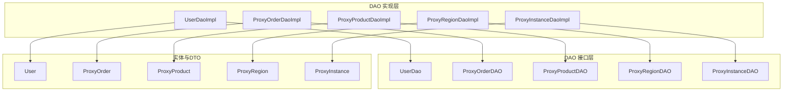

图表来源
- [UserDao.java:1-35](file://src/main/java/cn/linkfast/dao/UserDao.java#L1-L35)
- [UserDaoImpl.java:1-55](file://src/main/java/cn/linkfast/dao/impl/UserDaoImpl.java#L1-L55)
- [ProxyOrderDAO.java:1-102](file://src/main/java/cn/linkfast/dao/ProxyOrderDAO.java#L1-L102)
- [ProxyOrderDaoImpl.java:1-446](file://src/main/java/cn/linkfast/dao/impl/ProxyOrderDaoImpl.java#L1-L446)
- [ProxyProductDAO.java:1-25](file://src/main/java/cn/linkfast/dao/ProxyProductDAO.java#L1-L25)
- [ProxyProductDaoImpl.java:1-286](file://src/main/java/cn/linkfast/dao/impl/ProxyProductDaoImpl.java#L1-L286)
- [ProxyRegionDAO.java:1-38](file://src/main/java/cn/linkfast/dao/ProxyRegionDAO.java#L1-L38)
- [ProxyRegionDaoImpl.java:1-155](file://src/main/java/cn/linkfast/dao/impl/ProxyRegionDaoImpl.java#L1-L155)
- [ProxyInstanceDAO.java:1-47](file://src/main/java/cn/linkfast/dao/ProxyInstanceDAO.java#L1-L47)
- [ProxyInstanceDaoImpl.java:1-175](file://src/main/java/cn/linkfast/dao/impl/ProxyInstanceDaoImpl.java#L1-L175)
- [User.java:1-74](file://src/main/java/cn/linkfast/entity/User.java#L1-L74)
- [ProxyOrder.java:1-45](file://src/main/java/cn/linkfast/entity/ProxyOrder.java#L1-L45)
- [ProxyProduct.java:1-99](file://src/main/java/cn/linkfast/entity/ProxyProduct.java#L1-L99)
- [ProxyRegion.java:1-33](file://src/main/java/cn/linkfast/entity/ProxyRegion.java#L1-L33)
- [ProxyInstance.java:1-57](file://src/main/java/cn/linkfast/entity/ProxyInstance.java#L1-L57)

章节来源
- [UserDao.java:1-35](file://src/main/java/cn/linkfast/dao/UserDao.java#L1-L35)
- [ProxyOrderDAO.java:1-102](file://src/main/java/cn/linkfast/dao/ProxyOrderDAO.java#L1-L102)
- [ProxyProductDAO.java:1-25](file://src/main/java/cn/linkfast/dao/ProxyProductDAO.java#L1-L25)
- [ProxyRegionDAO.java:1-38](file://src/main/java/cn/linkfast/dao/ProxyRegionDAO.java#L1-L38)
- [ProxyInstanceDAO.java:1-47](file://src/main/java/cn/linkfast/dao/ProxyInstanceDAO.java#L1-L47)

## 核心组件
- UserDao/UserDaoImpl：基于内存 ConcurrentHashMap 的用户 CRUD 示例，演示接口契约与实现模式
- ProxyOrderDAO/ProxyOrderDaoImpl：订单主表与多张订单明细表的写入、更新与批量插入；支持按条件分页查询与统计
- ProxyProductDAO/ProxyProductDaoImpl：产品信息的批量 Upsert、JSON 字段解析与条件查询
- ProxyRegionDAO/ProxyRegionDaoImpl：地域信息批量 Upsert、按区域码查询 ID 映射与单条查询
- ProxyInstanceDAO/ProxyInstanceDaoImpl：实例信息批量更新、条件分页查询、统计与备注更新

章节来源
- [UserDaoImpl.java:1-55](file://src/main/java/cn/linkfast/dao/impl/UserDaoImpl.java#L1-L55)
- [ProxyOrderDaoImpl.java:1-446](file://src/main/java/cn/linkfast/dao/impl/ProxyOrderDaoImpl.java#L1-L446)
- [ProxyProductDaoImpl.java:1-286](file://src/main/java/cn/linkfast/dao/impl/ProxyProductDaoImpl.java#L1-L286)
- [ProxyRegionDaoImpl.java:1-155](file://src/main/java/cn/linkfast/dao/impl/ProxyRegionDaoImpl.java#L1-L155)
- [ProxyInstanceDaoImpl.java:1-175](file://src/main/java/cn/linkfast/dao/impl/ProxyInstanceDaoImpl.java#L1-L175)

## 架构总览
DAO 层通过 JdbcTemplate 执行 SQL，统一采用参数化查询防止 SQL 注入；批量操作使用 batchUpdate 与 BatchPreparedStatementSetter 提升吞吐；复杂 JSON 字段通过 Jackson 序列化/反序列化处理。

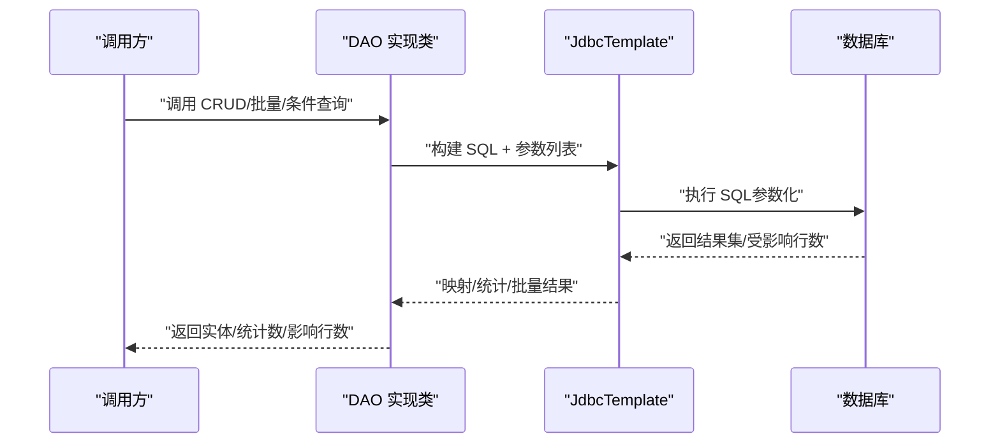

图表来源
- [ProxyOrderDaoImpl.java:85-121](file://src/main/java/cn/linkfast/dao/impl/ProxyOrderDaoImpl.java#L85-L121)
- [ProxyProductDaoImpl.java:101-190](file://src/main/java/cn/linkfast/dao/impl/ProxyProductDaoImpl.java#L101-L190)
- [ProxyRegionDaoImpl.java:38-101](file://src/main/java/cn/linkfast/dao/impl/ProxyRegionDaoImpl.java#L38-L101)
- [ProxyInstanceDaoImpl.java:33-88](file://src/main/java/cn/linkfast/dao/impl/ProxyInstanceDaoImpl.java#L33-L88)

## 详细组件分析

### UserDao 与 UserDaoImpl
- 设计要点
  - 接口定义标准 CRUD 方法，便于替换实现
  - 实现类使用内存存储模拟数据库，适合测试或演示
- 关键行为
  - 保存时自动生成主键；更新仅当存在键时生效
  - 删除基于键移除；查询基于键或全量扫描
- 适用场景
  - 快速验证接口契约与上层调用链路
  - 测试环境或内存型缓存场景

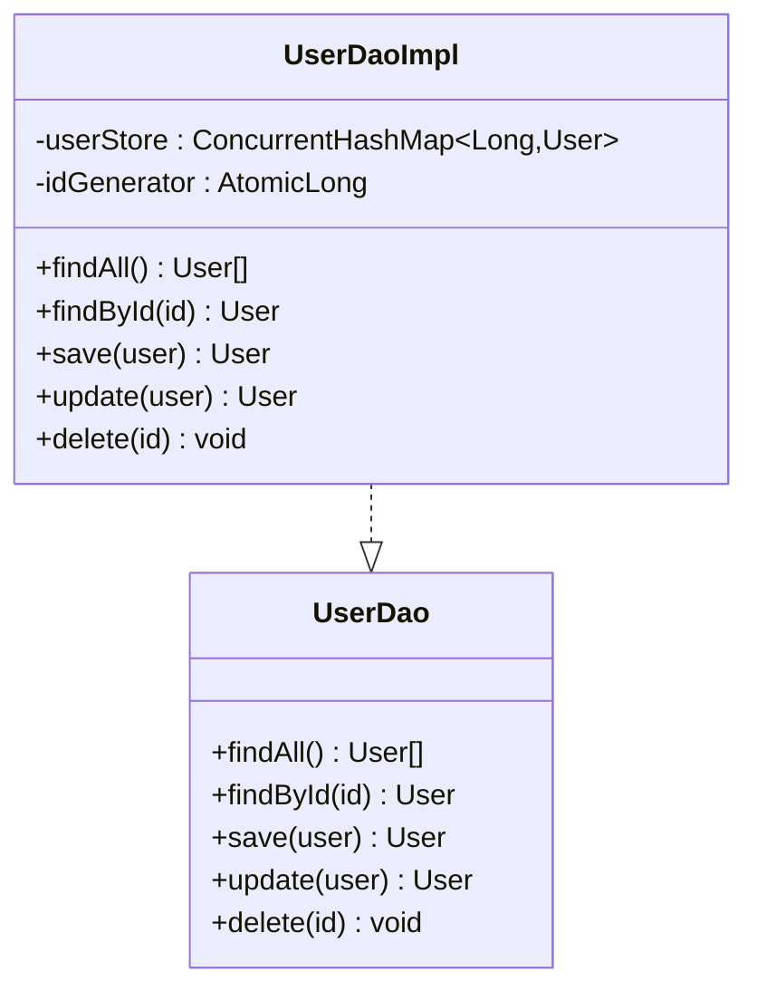

图表来源
- [UserDao.java:1-35](file://src/main/java/cn/linkfast/dao/UserDao.java#L1-L35)
- [UserDaoImpl.java:1-55](file://src/main/java/cn/linkfast/dao/impl/UserDaoImpl.java#L1-L55)

章节来源
- [UserDao.java:1-35](file://src/main/java/cn/linkfast/dao/UserDao.java#L1-L35)
- [UserDaoImpl.java:1-55](file://src/main/java/cn/linkfast/dao/impl/UserDaoImpl.java#L1-L55)
- [User.java:1-74](file://src/main/java/cn/linkfast/entity/User.java#L1-L74)

### ProxyOrderDAO 与 ProxyOrderDaoImpl
- 设计要点
  - 支持订单主表与多张明细表的写入/更新
  - 提供按条件分页查询与统计
  - 支持 JSON 字段序列化入库
- 关键实现
  - 动态 SQL 拼接 + 参数列表，避免硬编码与注入风险
  - 批量插入明细项，统计实际插入行数
  - 使用 ON DUPLICATE KEY UPDATE 实现 Upsert
  - 通过 BeanPropertyRowMapper 自动映射驼峰字段
- 典型流程（购买订单回写）
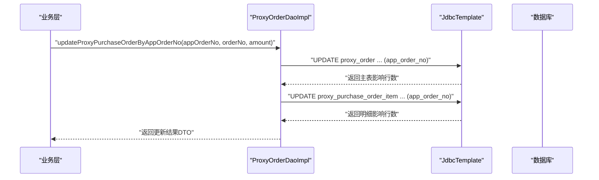

图表来源
- [ProxyOrderDaoImpl.java:173-204](file://src/main/java/cn/linkfast/dao/impl/ProxyOrderDaoImpl.java#L173-L204)

- 典型流程（批量实例 Upsert）
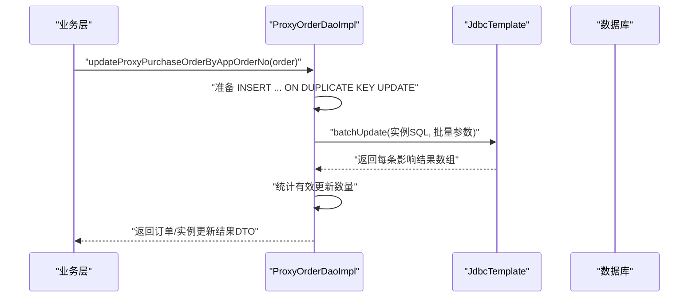

图表来源
- [ProxyOrderDaoImpl.java:34-76](file://src/main/java/cn/linkfast/dao/impl/ProxyOrderDaoImpl.java#L34-L76)

- 条件查询与统计
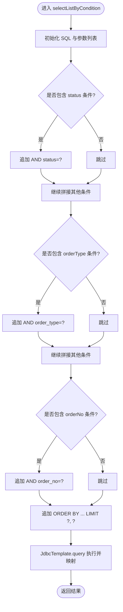

图表来源
- [ProxyOrderDaoImpl.java:85-121](file://src/main/java/cn/linkfast/dao/impl/ProxyOrderDaoImpl.java#L85-L121)

- 关键方法与职责
  - updateProxyPurchaseOrderByAppOrderNo(ProxyOrder)：主表与实例表批量 Upsert
  - selectListByCondition/ countByCondition：动态条件分页查询与统计
  - insertOrderWithItems：新建订单主表与明细项
  - insertOrder/ insertProxyPurchaseOrderItems/ insertProxyRenewOrderItems/ insertProxyReleaseOrderItems：主/明细表插入
  - selectByAppOrderNo/selectPurchaseItemsByAppOrderNo：按渠道商订单号查询
  - updateProxyPurchaseOrderByAppOrderNo(String,String,BigDecimal) 等：回写第三方订单号与金额

章节来源
- [ProxyOrderDAO.java:1-102](file://src/main/java/cn/linkfast/dao/ProxyOrderDAO.java#L1-L102)
- [ProxyOrderDaoImpl.java:1-446](file://src/main/java/cn/linkfast/dao/impl/ProxyOrderDaoImpl.java#L1-L446)
- [ProxyOrder.java:1-45](file://src/main/java/cn/linkfast/entity/ProxyOrder.java#L1-L45)

### ProxyProductDAO 与 ProxyProductDaoImpl
- 设计要点
  - 产品信息批量 Upsert，支持 JSON 字段（cidr_blocks、offline_cidr_blocks、project_list）
  - 自定义 RowMapper 手动解析 JSON 字段，保证字段完整性
  - 条件查询支持国家/城市/代理类型集合过滤
- 关键实现
  - ON DUPLICATE KEY UPDATE 完整字段集，使用 BatchPreparedStatementSetter 控制参数绑定
  - JSON 序列化失败时回退为空集合字符串，避免异常传播
  - 条件拼接使用占位符集合，避免 SQL 注入
- 典型流程（批量 Upsert）
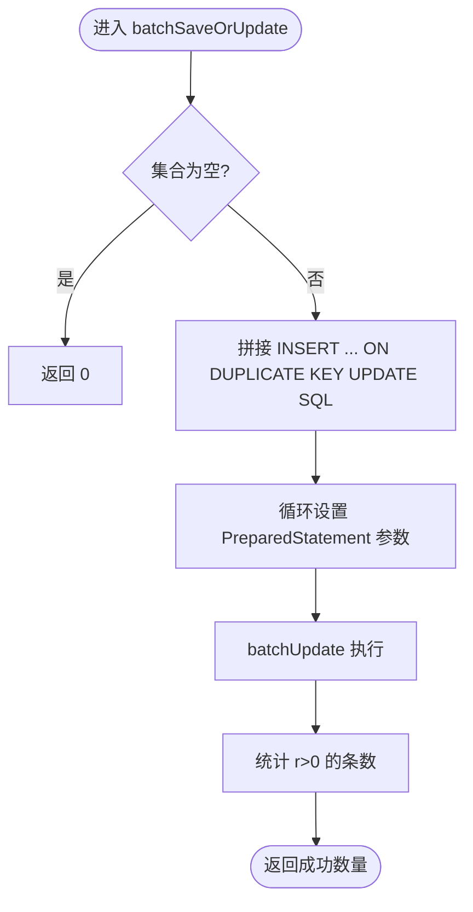

图表来源
- [ProxyProductDaoImpl.java:101-190](file://src/main/java/cn/linkfast/dao/impl/ProxyProductDaoImpl.java#L101-L190)

- 条件查询与 RowMapper
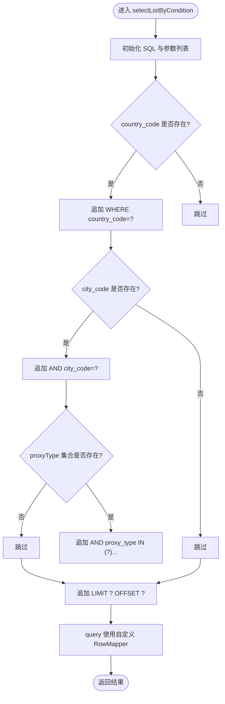

图表来源
- [ProxyProductDaoImpl.java:203-214](file://src/main/java/cn/linkfast/dao/impl/ProxyProductDaoImpl.java#L203-L214)
- [ProxyProductDaoImpl.java:216-234](file://src/main/java/cn/linkfast/dao/impl/ProxyProductDaoImpl.java#L216-L234)

- 关键方法与职责
  - batchSaveOrUpdate：批量 Upsert 产品信息，含 JSON 字段
  - selectListByCondition/count：按条件分页查询与统计
  - selectByProductNo：按产品编号查询单条记录
  - JSON 工具方法：toJson/parseJson

章节来源
- [ProxyProductDAO.java:1-25](file://src/main/java/cn/linkfast/dao/ProxyProductDAO.java#L1-L25)
- [ProxyProductDaoImpl.java:1-286](file://src/main/java/cn/linkfast/dao/impl/ProxyProductDaoImpl.java#L1-L286)
- [ProxyProduct.java:1-99](file://src/main/java/cn/linkfast/entity/ProxyProduct.java#L1-L99)

### ProxyRegionDAO 与 ProxyRegionDaoImpl
- 设计要点
  - 地域信息批量 Upsert，依赖 region_code 唯一索引
  - 分块批处理（默认 200 条/块），降低通信链路超时风险
  - 提供按区域码查询 ID 映射与单条查询
- 关键实现
  - 批量 Upsert 使用 BatchPreparedStatementSetter
  - 分块查询 IN(...) 使用占位符集合，避免超长 SQL
  - 返回值兼容 SUCCESS_NO_INFO，仅以非负值判定成功
- 典型流程（批量 Upsert 分块）
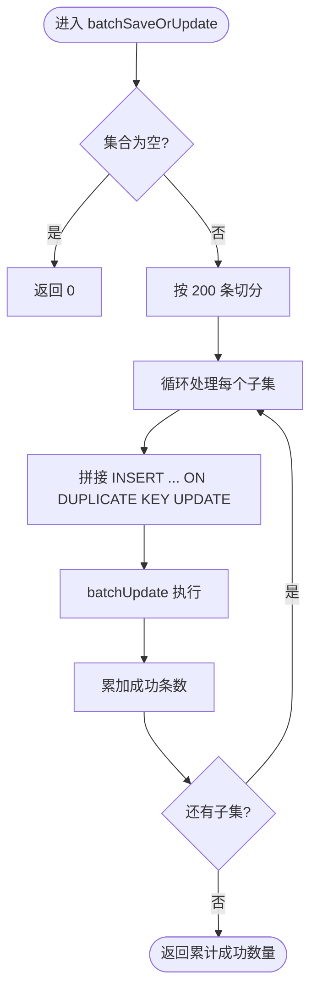

图表来源
- [ProxyRegionDaoImpl.java:38-52](file://src/main/java/cn/linkfast/dao/impl/ProxyRegionDaoImpl.java#L38-L52)
- [ProxyRegionDaoImpl.java:54-101](file://src/main/java/cn/linkfast/dao/impl/ProxyRegionDaoImpl.java#L54-L101)

- 关键方法与职责
  - batchSaveOrUpdate：按 region_code 唯一键进行 Upsert，分块处理
  - selectIdMapByRegionCodes：按区域码批量查询 ID 映射
  - selectByRegionCode：按区域码查询单条记录

章节来源
- [ProxyRegionDAO.java:1-38](file://src/main/java/cn/linkfast/dao/ProxyRegionDAO.java#L1-L38)
- [ProxyRegionDaoImpl.java:1-155](file://src/main/java/cn/linkfast/dao/impl/ProxyRegionDaoImpl.java#L1-L155)
- [ProxyRegion.java:1-33](file://src/main/java/cn/linkfast/entity/ProxyRegion.java#L1-L33)

### ProxyInstanceDAO 与 ProxyInstanceDaoImpl
- 设计要点
  - 实例信息批量更新，按 instance_no 唯一键更新
  - 条件查询支持代理类型集合、状态、国家/城市、IP 模糊匹配
  - 备注更新带时间戳，保证审计一致性
- 关键实现
  - 批量更新使用 SET ... WHERE 形式，避免逐条往返
  - JSON 字段通过 Jackson 序列化入库
  - 条件拼接复用工具方法，减少重复逻辑
- 典型流程（批量更新）
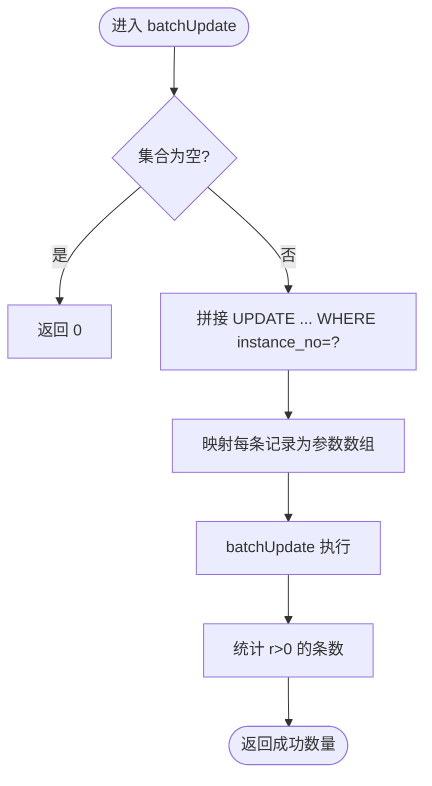

图表来源
- [ProxyInstanceDaoImpl.java:33-88](file://src/main/java/cn/linkfast/dao/impl/ProxyInstanceDaoImpl.java#L33-L88)

- 条件查询与统计
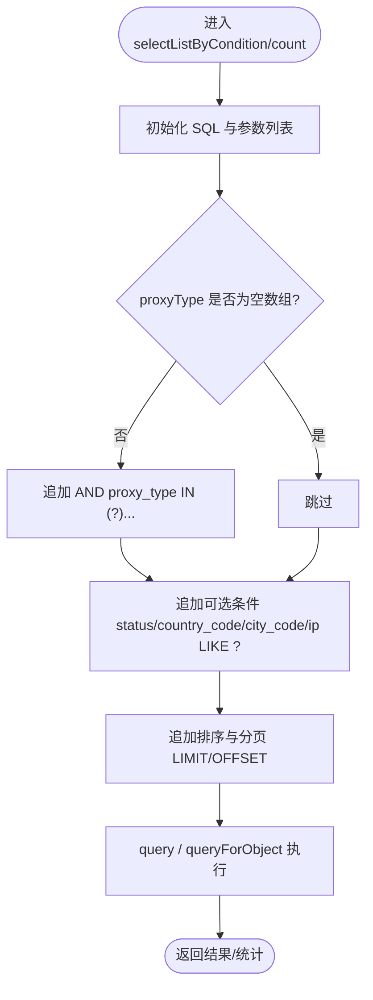

图表来源
- [ProxyInstanceDaoImpl.java:91-115](file://src/main/java/cn/linkfast/dao/impl/ProxyInstanceDaoImpl.java#L91-L115)
- [ProxyInstanceDaoImpl.java:120-148](file://src/main/java/cn/linkfast/dao/impl/ProxyInstanceDaoImpl.java#L120-L148)

- 关键方法与职责
  - batchUpdate：按 instance_no 批量更新
  - selectListByCondition/count：动态条件分页查询与统计
  - updateRemarkByInstanceNo：更新备注与时间戳

章节来源
- [ProxyInstanceDAO.java:1-47](file://src/main/java/cn/linkfast/dao/ProxyInstanceDAO.java#L1-L47)
- [ProxyInstanceDaoImpl.java:1-175](file://src/main/java/cn/linkfast/dao/impl/ProxyInstanceDaoImpl.java#L1-L175)
- [ProxyInstance.java:1-57](file://src/main/java/cn/linkfast/entity/ProxyInstance.java#L1-L57)

## 依赖关系分析
- 组件内聚与耦合
  - DAO 实现类内部高度内聚，围绕单一实体/表进行 CRUD 与批量操作
  - 通过 JdbcTemplate 统一访问，避免直接使用原生 JDBC
- 外部依赖
  - Spring JDBC（JdbcTemplate）、Jackson（JSON 序列化/反序列化）
  - 日志框架（SLF4J）用于记录 SQL 与异常
- 循环依赖
  - DAO 层之间无直接循环依赖，通过服务层协调跨表操作

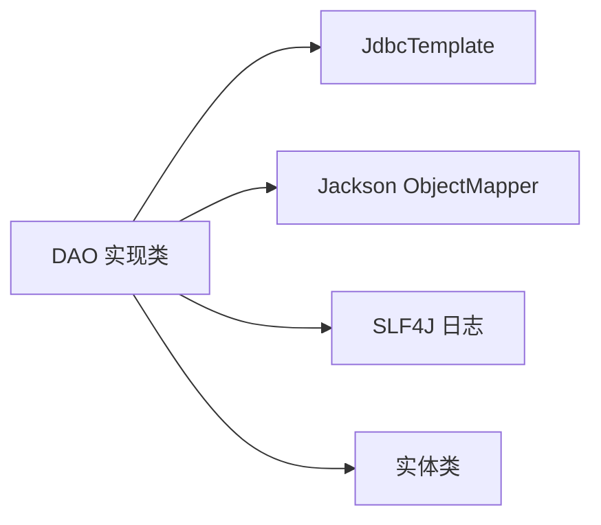

图表来源
- [ProxyOrderDaoImpl.java:30-31](file://src/main/java/cn/linkfast/dao/impl/ProxyOrderDaoImpl.java#L30-L31)
- [ProxyProductDaoImpl.java:34-35](file://src/main/java/cn/linkfast/dao/impl/ProxyProductDaoImpl.java#L34-L35)
- [ProxyRegionDaoImpl.java](file://src/main/java/cn/linkfast/dao/impl/ProxyRegionDaoImpl.java#L35)
- [ProxyInstanceDaoImpl.java:29-30](file://src/main/java/cn/linkfast/dao/impl/ProxyInstanceDaoImpl.java#L29-L30)

章节来源
- [ProxyOrderDaoImpl.java:1-446](file://src/main/java/cn/linkfast/dao/impl/ProxyOrderDaoImpl.java#L1-L446)
- [ProxyProductDaoImpl.java:1-286](file://src/main/java/cn/linkfast/dao/impl/ProxyProductDaoImpl.java#L1-L286)
- [ProxyRegionDaoImpl.java:1-155](file://src/main/java/cn/linkfast/dao/impl/ProxyRegionDaoImpl.java#L1-L155)
- [ProxyInstanceDaoImpl.java:1-175](file://src/main/java/cn/linkfast/dao/impl/ProxyInstanceDaoImpl.java#L1-L175)

## 性能考量
- 批量操作
  - 使用 batchUpdate 与 BatchPreparedStatementSetter 减少往返
  - ProxyRegionDaoImpl 默认分块大小 200，避免通信超时
- SQL 注入防护
  - 全面采用参数化查询，动态拼接时仅拼接关键字与占位符
  - IN(...) 条件使用占位符集合，避免字符串拼接
- 结果映射
  - BeanPropertyRowMapper 自动映射驼峰字段，减少手工映射成本
  - 自定义 RowMapper 手动解析 JSON 字段，确保字段完整性
- 索引与查询优化
  - ProxyOrder/ProxyInstance/ProxyRegion 等高频查询字段建议建立合适索引（如 app_order_no、order_no、instance_no、region_code 等）
  - 分页查询务必携带排序字段与 LIMIT/OFFSET，避免全表扫描
- 异常与日志
  - 批量更新异常时记录上下文，便于定位问题
  - JSON 转换失败回退为空集合字符串，避免业务中断

## 故障排查指南
- 常见问题
  - SQL 注入风险：检查是否使用参数化查询与占位符集合
  - 批量失败：关注 batchUpdate 返回数组，统计 r>0 的条数
  - JSON 字段异常：确认序列化/反序列化逻辑与回退策略
  - 通信超时：对大批量操作启用分块处理
- 定位手段
  - 开启 SQL 日志，核对最终执行语句与参数
  - 检查实体字段与数据库字段映射关系
  - 核对唯一索引（如 region_code）是否满足 Upsert 条件

章节来源
- [ProxyOrderDaoImpl.java:160-168](file://src/main/java/cn/linkfast/dao/impl/ProxyOrderDaoImpl.java#L160-L168)
- [ProxyProductDaoImpl.java:243-271](file://src/main/java/cn/linkfast/dao/impl/ProxyProductDaoImpl.java#L243-L271)
- [ProxyRegionDaoImpl.java:33-51](file://src/main/java/cn/linkfast/dao/impl/ProxyRegionDaoImpl.java#L33-L51)
- [ProxyInstanceDaoImpl.java:164-172](file://src/main/java/cn/linkfast/dao/impl/ProxyInstanceDaoImpl.java#L164-L172)

## 结论
DAO 层通过清晰的接口契约与稳健的实现模式，提供了完整的 CRUD、批量操作与复杂查询能力。通过参数化查询、分块批处理与 JSON 字段的序列化/反序列化，既保证了安全性与可维护性，也为性能优化提供了明确抓手。建议在生产环境中配合索引与慢查询分析工具持续优化关键路径。

## 附录
- 扩展指南
  - 新增 DAO：遵循现有命名规范与包结构，提供接口与实现类
  - 自定义查询：优先使用动态 SQL + 参数化，避免字符串拼接
  - 批量操作：统一使用 batchUpdate 与分块策略，记录返回结果
  - JSON 字段：提供 toJson/parseJson 工具方法，确保异常回退
- 自定义查询示例（路径参考）
  - 动态条件分页查询：[ProxyOrderDaoImpl.java:85-121](file://src/main/java/cn/linkfast/dao/impl/ProxyOrderDaoImpl.java#L85-L121)
  - 批量 Upsert（产品）：[ProxyProductDaoImpl.java:101-190](file://src/main/java/cn/linkfast/dao/impl/ProxyProductDaoImpl.java#L101-L190)
  - 批量 Upsert（地域）：[ProxyRegionDaoImpl.java:54-101](file://src/main/java/cn/linkfast/dao/impl/ProxyRegionDaoImpl.java#L54-L101)
  - 批量更新（实例）：[ProxyInstanceDaoImpl.java:33-88](file://src/main/java/cn/linkfast/dao/impl/ProxyInstanceDaoImpl.java#L33-L88)