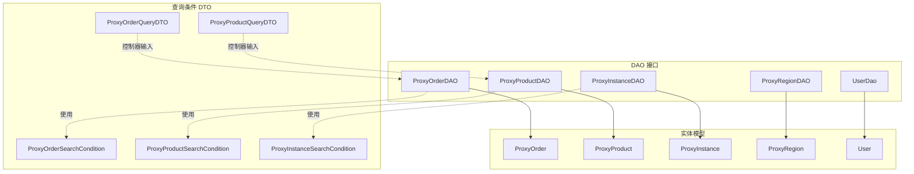
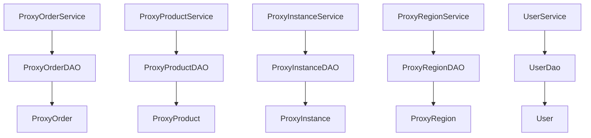
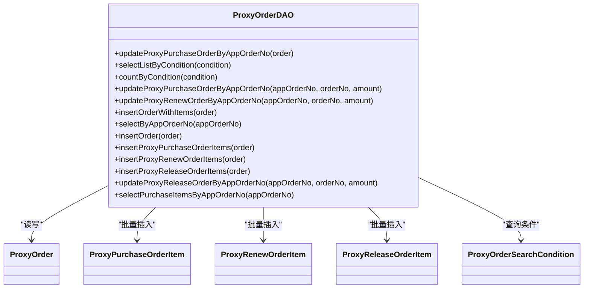
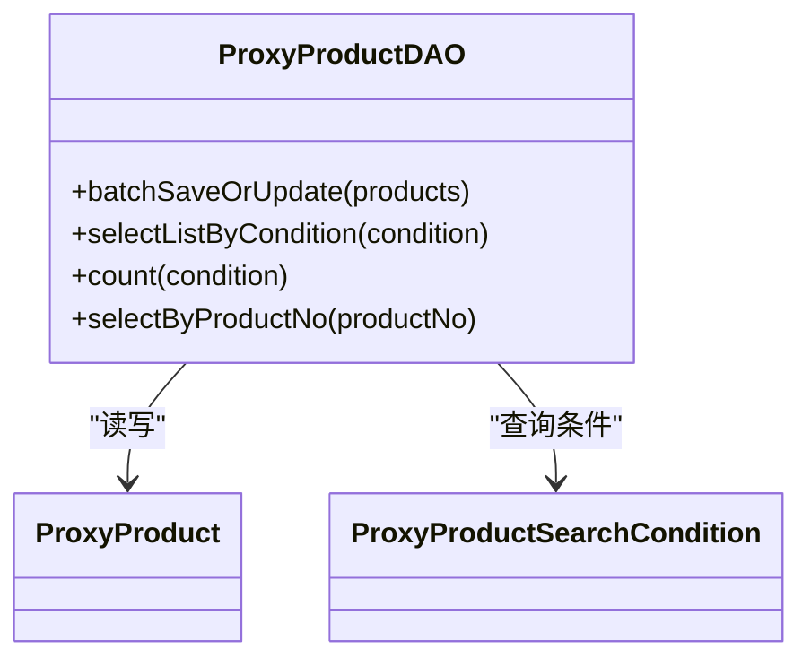
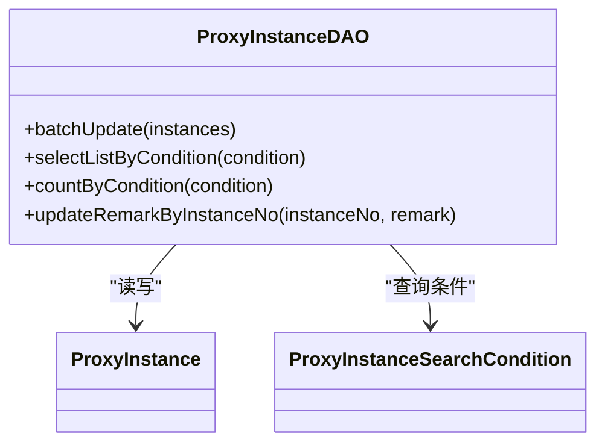
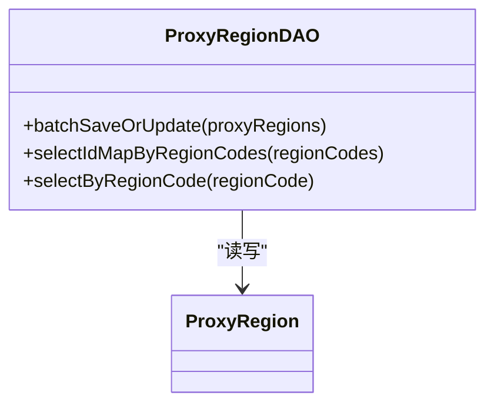
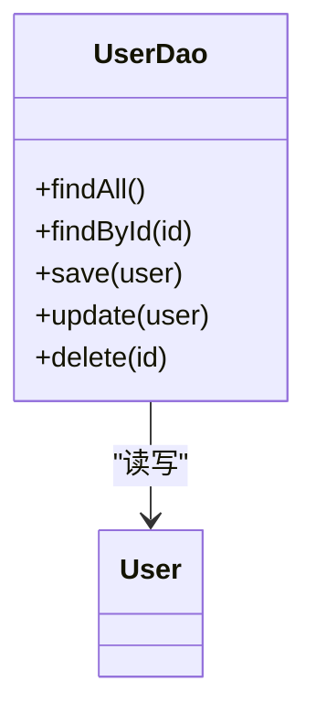
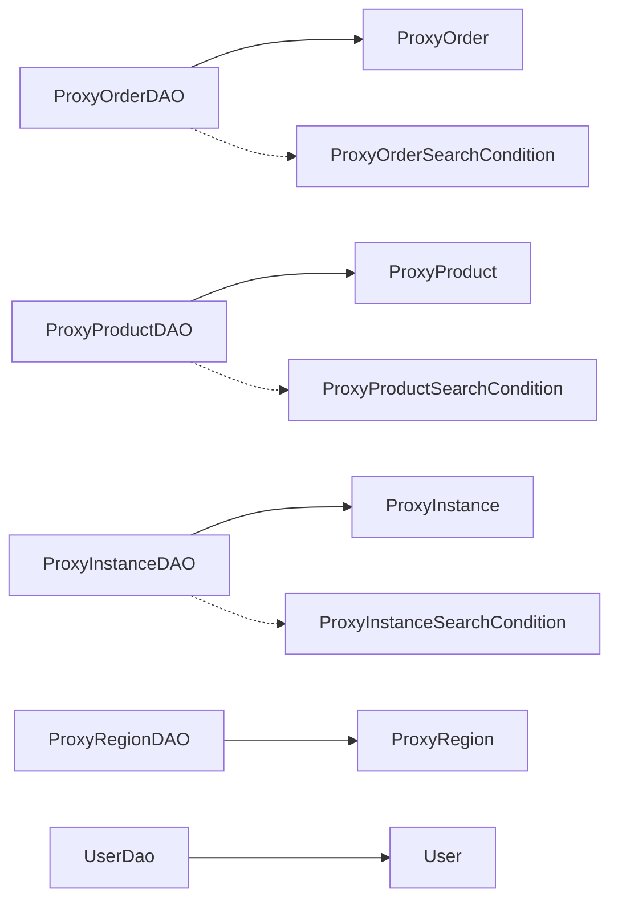

# DAO 接口设计

<cite>
**本文引用的文件**
- [ProxyOrderDAO.java](file://src/main/java/cn/linkfast/dao/ProxyOrderDAO.java)
- [ProxyProductDAO.java](file://src/main/java/cn/linkfast/dao/ProxyProductDAO.java)
- [ProxyInstanceDAO.java](file://src/main/java/cn/linkfast/dao/ProxyInstanceDAO.java)
- [ProxyRegionDAO.java](file://src/main/java/cn/linkfast/dao/ProxyRegionDAO.java)
- [UserDao.java](file://src/main/java/cn/linkfast/dao/UserDao.java)
- [ProxyOrder.java](file://src/main/java/cn/linkfast/entity/ProxyOrder.java)
- [ProxyProduct.java](file://src/main/java/cn/linkfast/entity/ProxyProduct.java)
- [ProxyInstance.java](file://src/main/java/cn/linkfast/entity/ProxyInstance.java)
- [ProxyRegion.java](file://src/main/java/cn/linkfast/entity/ProxyRegion.java)
- [User.java](file://src/main/java/cn/linkfast/entity/User.java)
- [ProxyOrderSearchCondition.java](file://src/main/java/cn/linkfast/dto/ProxyOrderSearchCondition.java)
- [ProxyProductSearchCondition.java](file://src/main/java/cn/linkfast/dto/ProxyProductSearchCondition.java)
- [ProxyInstanceSearchCondition.java](file://src/main/java/cn/linkfast/dto/ProxyInstanceSearchCondition.java)
- [ProxyOrderQueryDTO.java](file://src/main/java/cn/linkfast/dto/ProxyOrderQueryDTO.java)
- [ProxyProductQueryDTO.java](file://src/main/java/cn/linkfast/dto/ProxyProductQueryDTO.java)
</cite>

## 目录
1. [引言](#引言)
2. [项目结构](#项目结构)
3. [核心组件](#核心组件)
4. [架构总览](#架构总览)
5. [详细组件分析](#详细组件分析)
6. [依赖分析](#依赖分析)
7. [性能考虑](#性能考虑)
8. [故障排查指南](#故障排查指南)
9. [结论](#结论)
10. [附录](#附录)

## 引言
本文件系统性梳理 Link-Fast 项目中 DAO 层的接口设计，覆盖以下接口：ProxyOrderDAO、ProxyProductDAO、ProxyInstanceDAO、ProxyRegionDAO 与 UserDao。文档从职责边界、方法语义、参数与返回值、与实体/DTO 的映射关系、通用模式（分页、条件过滤、批量操作）等方面进行阐述，并给出最佳实践与扩展建议。

## 项目结构
DAO 接口位于 cn.linkfast.dao 包下，分别对应订单、产品、实例、地域与用户的数据访问职责；实体类位于 cn.linkfast.entity，查询条件 DTO 位于 cn.linkfast.dto。DAO 接口与实体/DTO 的对应关系清晰，遵循“接口隔离、单一职责”的设计原则。

图表来源
- [ProxyOrderDAO.java:10-102](file://src/main/java/cn/linkfast/dao/ProxyOrderDAO.java#L10-L102)
- [ProxyProductDAO.java:8-25](file://src/main/java/cn/linkfast/dao/ProxyProductDAO.java#L8-L25)
- [ProxyInstanceDAO.java:11-47](file://src/main/java/cn/linkfast/dao/ProxyInstanceDAO.java#L11-L47)
- [ProxyRegionDAO.java:11-38](file://src/main/java/cn/linkfast/dao/ProxyRegionDAO.java#L11-L38)
- [UserDao.java:9-35](file://src/main/java/cn/linkfast/dao/UserDao.java#L9-L35)
- [ProxyOrder.java:19-45](file://src/main/java/cn/linkfast/entity/ProxyOrder.java#L19-L45)
- [ProxyProduct.java:15-66](file://src/main/java/cn/linkfast/entity/ProxyProduct.java#L15-L66)
- [ProxyInstance.java:13-52](file://src/main/java/cn/linkfast/entity/ProxyInstance.java#L13-L52)
- [ProxyRegion.java:14-31](file://src/main/java/cn/linkfast/entity/ProxyRegion.java#L14-L31)
- [User.java:6-74](file://src/main/java/cn/linkfast/entity/User.java#L6-L74)
- [ProxyOrderSearchCondition.java:12-42](file://src/main/java/cn/linkfast/dto/ProxyOrderSearchCondition.java#L12-L42)
- [ProxyProductSearchCondition.java:11-18](file://src/main/java/cn/linkfast/dto/ProxyProductSearchCondition.java#L11-L18)
- [ProxyInstanceSearchCondition.java:12-53](file://src/main/java/cn/linkfast/dto/ProxyInstanceSearchCondition.java#L12-L53)
- [ProxyOrderQueryDTO.java:19-57](file://src/main/java/cn/linkfast/dto/ProxyOrderQueryDTO.java#L19-L57)
- [ProxyProductQueryDTO.java:17-52](file://src/main/java/cn/linkfast/dto/ProxyProductQueryDTO.java#L17-L52)

章节来源
- [ProxyOrderDAO.java:10-102](file://src/main/java/cn/linkfast/dao/ProxyOrderDAO.java#L10-L102)
- [ProxyProductDAO.java:8-25](file://src/main/java/cn/linkfast/dao/ProxyProductDAO.java#L8-L25)
- [ProxyInstanceDAO.java:11-47](file://src/main/java/cn/linkfast/dao/ProxyInstanceDAO.java#L11-L47)
- [ProxyRegionDAO.java:11-38](file://src/main/java/cn/linkfast/dao/ProxyRegionDAO.java#L11-L38)
- [UserDao.java:9-35](file://src/main/java/cn/linkfast/dao/UserDao.java#L9-L35)

## 核心组件
- ProxyOrderDAO：负责代理订单的 CRUD、分页查询、计数、按渠道商订单号查询、批量插入订单明细（购买/续费/释放）、第三方回调回写等。
- ProxyProductDAO：负责代理产品的批量保存/更新、按条件分页查询、计数、按产品编号查询。
- ProxyInstanceDAO：负责代理实例的批量 Upsert、按条件分页查询、计数、按实例编号更新备注。
- ProxyRegionDAO：负责地域信息的批量 Upsert、按区域编码查询 ID 映射、按区域编码查询单条记录。
- UserDao：负责用户的基本 CRUD 操作。

章节来源
- [ProxyOrderDAO.java:10-102](file://src/main/java/cn/linkfast/dao/ProxyOrderDAO.java#L10-L102)
- [ProxyProductDAO.java:8-25](file://src/main/java/cn/linkfast/dao/ProxyProductDAO.java#L8-L25)
- [ProxyInstanceDAO.java:11-47](file://src/main/java/cn/linkfast/dao/ProxyInstanceDAO.java#L11-L47)
- [ProxyRegionDAO.java:11-38](file://src/main/java/cn/linkfast/dao/ProxyRegionDAO.java#L11-L38)
- [UserDao.java:9-35](file://src/main/java/cn/linkfast/dao/UserDao.java#L9-L35)

## 架构总览
DAO 层向上承接 Service 层，向下对接数据库。各 DAO 接口职责明确，避免跨领域耦合；查询条件通过 DTO/条件对象传递，保证分页与过滤逻辑的一致性。

图表来源
- [ProxyOrderDAO.java:10-102](file://src/main/java/cn/linkfast/dao/ProxyOrderDAO.java#L10-L102)
- [ProxyProductDAO.java:8-25](file://src/main/java/cn/linkfast/dao/ProxyProductDAO.java#L8-L25)
- [ProxyInstanceDAO.java:11-47](file://src/main/java/cn/linkfast/dao/ProxyInstanceDAO.java#L11-L47)
- [ProxyRegionDAO.java:11-38](file://src/main/java/cn/linkfast/dao/ProxyRegionDAO.java#L11-L38)
- [UserDao.java:9-35](file://src/main/java/cn/linkfast/dao/UserDao.java#L9-L35)
- [ProxyOrder.java:19-45](file://src/main/java/cn/linkfast/entity/ProxyOrder.java#L19-L45)
- [ProxyProduct.java:15-66](file://src/main/java/cn/linkfast/entity/ProxyProduct.java#L15-L66)
- [ProxyInstance.java:13-52](file://src/main/java/cn/linkfast/entity/ProxyInstance.java#L13-L52)
- [ProxyRegion.java:14-31](file://src/main/java/cn/linkfast/entity/ProxyRegion.java#L14-L31)
- [User.java:6-74](file://src/main/java/cn/linkfast/entity/User.java#L6-L74)

## 详细组件分析

### ProxyOrderDAO 接口
职责与方法概览
- 更新订单及其关联实例数据（回调回写）
- 分页查询订单列表与计数
- 第三方回调回写（购买/续费/释放）
- 新建订单场景：保存主表与明细（购买/续费/释放）
- 按渠道商订单号查询单个订单
- 仅插入主订单表
- 批量插入购买/续费/释放明细

方法与参数说明
- updateProxyPurchaseOrderByAppOrderNo(ProxyOrder order)：更新购买订单及实例
- selectListByCondition(ProxyOrderSearchCondition condition)：分页查询订单列表
- countByCondition(ProxyOrderSearchCondition condition)：统计订单总数
- updateProxyPurchaseOrderByAppOrderNo(String appOrderNo, String orderNo, BigDecimal amount)：购买回调回写
- updateProxyRenewOrderByAppOrderNo(String appOrderNo, String orderNo, BigDecimal amount)：续费回调回写
- insertOrderWithItems(ProxyOrder order)：新建订单并插入明细，返回 appOrderNo
- selectByAppOrderNo(String appOrderNo)：按渠道商订单号查询
- insertOrder(ProxyOrder order)：仅插入主订单表，返回自增 id
- insertProxyPurchaseOrderItems(ProxyOrder order)：批量插入购买明细
- insertProxyRenewOrderItems(ProxyOrder order)：批量插入续费明细
- insertProxyReleaseOrderItems(ProxyOrder order)：批量插入释放明细
- updateProxyReleaseOrderByAppOrderNo(String appOrderNo, String orderNo, BigDecimal amount)：释放回调回写
- selectPurchaseItemsByAppOrderNo(String appOrderNo)：按渠道商订单号查询购买明细

业务含义与实体映射
- 输入/输出主要围绕 ProxyOrder 及其明细项（购买/续费/释放），与实体 ProxyOrder、ProxyPurchaseOrderItem、ProxyRenewOrderItem、ProxyReleaseOrderItem 对应。
- 查询条件 ProxyOrderSearchCondition 提供分页与过滤字段（状态、类型、平台订单号）。

通用模式
- 分页查询：offset/limit 由条件对象提供，countByCondition 支持分页计数。
- 条件过滤：支持状态、订单类型、平台订单号等。
- 批量操作：insertProxyPurchaseOrderItems/insertProxyRenewOrderItems/insertProxyReleaseOrderItems。

图表来源
- [ProxyOrderDAO.java:10-102](file://src/main/java/cn/linkfast/dao/ProxyOrderDAO.java#L10-L102)
- [ProxyOrder.java:19-45](file://src/main/java/cn/linkfast/entity/ProxyOrder.java#L19-L45)

章节来源
- [ProxyOrderDAO.java:10-102](file://src/main/java/cn/linkfast/dao/ProxyOrderDAO.java#L10-L102)
- [ProxyOrder.java:19-45](file://src/main/java/cn/linkfast/entity/ProxyOrder.java#L19-L45)
- [ProxyOrderSearchCondition.java:12-42](file://src/main/java/cn/linkfast/dto/ProxyOrderSearchCondition.java#L12-L42)

### ProxyProductDAO 接口
职责与方法概览
- 批量保存或更新产品信息
- 按条件分页查询产品列表与计数
- 按产品编号查询单个产品

方法与参数说明
- batchSaveOrUpdate(List<ProxyProduct> products)：批量 Upsert
- selectListByCondition(ProxyProductSearchCondition condition)：分页查询
- count(ProxyProductSearchCondition condition)：统计总数
- selectByProductNo(String productNo)：按产品编号查询

业务含义与实体映射
- 输入/输出围绕 ProxyProduct，查询条件 ProxyProductSearchCondition 支持国家/城市/代理类型/分页。

通用模式
- 分页查询：offset/limit 由条件对象提供，count 支持分页计数。
- 条件过滤：国家/城市/代理类型列表（可为空表示不限制）。

图表来源
- [ProxyProductDAO.java:8-25](file://src/main/java/cn/linkfast/dao/ProxyProductDAO.java#L8-L25)
- [ProxyProduct.java:15-66](file://src/main/java/cn/linkfast/entity/ProxyProduct.java#L15-L66)

章节来源
- [ProxyProductDAO.java:8-25](file://src/main/java/cn/linkfast/dao/ProxyProductDAO.java#L8-L25)
- [ProxyProduct.java:15-66](file://src/main/java/cn/linkfast/entity/ProxyProduct.java#L15-L66)
- [ProxyProductSearchCondition.java:11-18](file://src/main/java/cn/linkfast/dto/ProxyProductSearchCondition.java#L11-L18)

### ProxyInstanceDAO 接口
职责与方法概览
- 批量 Upsert 实例信息
- 按条件分页查询实例列表与计数
- 按实例编号更新备注

方法与参数说明
- batchUpdate(List<ProxyInstance> instances)：批量 Upsert
- selectListByCondition(ProxyInstanceSearchCondition condition)：分页查询
- countByCondition(ProxyInstanceSearchCondition condition)：统计总数
- updateRemarkByInstanceNo(String instanceNo, String remark)：按实例编号更新备注

业务含义与实体映射
- 输入/输出围绕 ProxyInstance，查询条件 ProxyInstanceSearchCondition 支持代理类型、状态、国家/城市、IP 模糊匹配。

通用模式
- 分页查询：offset/limit 由条件对象提供，countByCondition 支持分页计数。
- 条件过滤：代理类型数组、状态、国家/城市、IP 模糊匹配。

图表来源
- [ProxyInstanceDAO.java:11-47](file://src/main/java/cn/linkfast/dao/ProxyInstanceDAO.java#L11-L47)
- [ProxyInstance.java:13-52](file://src/main/java/cn/linkfast/entity/ProxyInstance.java#L13-L52)

章节来源
- [ProxyInstanceDAO.java:11-47](file://src/main/java/cn/linkfast/dao/ProxyInstanceDAO.java#L11-L47)
- [ProxyInstance.java:13-52](file://src/main/java/cn/linkfast/entity/ProxyInstance.java#L13-L52)
- [ProxyInstanceSearchCondition.java:12-53](file://src/main/java/cn/linkfast/dto/ProxyInstanceSearchCondition.java#L12-L53)

### ProxyRegionDAO 接口
职责与方法概览
- 批量保存或更新地域信息
- 按区域编码查询地域 ID 映射
- 按区域编码查询单条地域信息

方法与参数说明
- batchSaveOrUpdate(List<ProxyRegion> proxyRegions)：批量 Upsert
- selectIdMapByRegionCodes(List<String> regionCodes)：批量查询区域编码到 id 的映射
- selectByRegionCode(String regionCode)：按区域编码查询单条记录

业务含义与实体映射
- 输入/输出围绕 ProxyRegion；selectIdMapByRegionCodes 返回 Map<String, Long>，便于上层快速建立编码到主键的映射。

图表来源
- [ProxyRegionDAO.java:11-38](file://src/main/java/cn/linkfast/dao/ProxyRegionDAO.java#L11-L38)
- [ProxyRegion.java:14-31](file://src/main/java/cn/linkfast/entity/ProxyRegion.java#L14-L31)

章节来源
- [ProxyRegionDAO.java:11-38](file://src/main/java/cn/linkfast/dao/ProxyRegionDAO.java#L11-L38)
- [ProxyRegion.java:14-31](file://src/main/java/cn/linkfast/entity/ProxyRegion.java#L14-L31)

### UserDao 接口
职责与方法概览
- 查询所有用户
- 按 ID 查询用户
- 保存用户
- 更新用户
- 删除用户

方法与参数说明
- findAll()：查询所有用户
- findById(Long id)：按 ID 查询
- save(User user)：保存用户并返回持久化后的对象
- update(User user)：更新用户并返回持久化后的对象
- delete(Long id)：删除用户

图表来源
- [UserDao.java:9-35](file://src/main/java/cn/linkfast/dao/UserDao.java#L9-L35)
- [User.java:6-74](file://src/main/java/cn/linkfast/entity/User.java#L6-L74)

章节来源
- [UserDao.java:9-35](file://src/main/java/cn/linkfast/dao/UserDao.java#L9-L35)
- [User.java:6-74](file://src/main/java/cn/linkfast/entity/User.java#L6-L74)

## 依赖分析
- DAO 接口之间无直接依赖，职责清晰，耦合度低。
- DAO 与实体/DTO 的依赖方向均为“使用”，即 DAO 读写实体，查询条件/DTO 作为输入参数。
- 查询条件对象统一了分页与过滤逻辑，减少重复实现。

图表来源
- [ProxyOrderDAO.java:10-102](file://src/main/java/cn/linkfast/dao/ProxyOrderDAO.java#L10-L102)
- [ProxyProductDAO.java:8-25](file://src/main/java/cn/linkfast/dao/ProxyProductDAO.java#L8-L25)
- [ProxyInstanceDAO.java:11-47](file://src/main/java/cn/linkfast/dao/ProxyInstanceDAO.java#L11-L47)
- [ProxyRegionDAO.java:11-38](file://src/main/java/cn/linkfast/dao/ProxyRegionDAO.java#L11-L38)
- [UserDao.java:9-35](file://src/main/java/cn/linkfast/dao/UserDao.java#L9-L35)
- [ProxyOrder.java:19-45](file://src/main/java/cn/linkfast/entity/ProxyOrder.java#L19-L45)
- [ProxyProduct.java:15-66](file://src/main/java/cn/linkfast/entity/ProxyProduct.java#L15-L66)
- [ProxyInstance.java:13-52](file://src/main/java/cn/linkfast/entity/ProxyInstance.java#L13-L52)
- [ProxyRegion.java:14-31](file://src/main/java/cn/linkfast/entity/ProxyRegion.java#L14-L31)
- [User.java:6-74](file://src/main/java/cn/linkfast/entity/User.java#L6-L74)
- [ProxyOrderSearchCondition.java:12-42](file://src/main/java/cn/linkfast/dto/ProxyOrderSearchCondition.java#L12-L42)
- [ProxyProductSearchCondition.java:11-18](file://src/main/java/cn/linkfast/dto/ProxyProductSearchCondition.java#L11-L18)
- [ProxyInstanceSearchCondition.java:12-53](file://src/main/java/cn/linkfast/dto/ProxyInstanceSearchCondition.java#L12-L53)

## 性能考虑
- 分页查询：统一使用 offset/limit，避免一次性加载全量数据；countByCondition 与 selectListByCondition 配合，确保分页准确性。
- 批量操作：批量 Upsert/批量插入明细可显著降低网络往返与事务开销，建议在服务层聚合后再调用 DAO。
- 条件过滤：优先使用索引列（如状态、类型、编码）以提升查询效率；模糊匹配（如 IP）需谨慎使用。
- 缓存策略：对高频只读数据（如地域编码映射）可在上层缓存 Map<String, Long>，减少数据库查询。

## 故障排查指南
- 分页异常：检查 pageNum/pageSize 校验与 offset/limit 计算是否一致；确认 countByCondition 与 selectListByCondition 的条件一致。
- 批量插入失败：核对实体字段完整性与外键约束；确认批量方法返回的实际影响行数与预期一致。
- 回调回写不生效：核对 appOrderNo 一致性与金额/第三方订单号格式；确认事务边界与幂等处理。
- 地域映射错误：核对 regionCode 唯一性与大小写；确认 selectIdMapByRegionCodes 的输入列表去重与过滤。

## 结论
DAO 接口设计遵循单一职责与接口隔离原则，查询条件与实体映射清晰，通用模式（分页、条件过滤、批量操作）统一规范。通过合理的分层与契约设计，DAO 层能够稳定支撑上层业务逻辑的演进。

## 附录

### 接口设计最佳实践与扩展指南
- 命名约定
  - 接口名：名词短语，如 ProxyOrderDAO、ProxyProductDAO。
  - 方法名：动词+名词，如 selectListByCondition、batchSaveOrUpdate、updateRemarkByInstanceNo。
  - 查询条件类：名词短语+SearchCondition，如 ProxyOrderSearchCondition。
  - 控制器输入 DTO：名词短语+QueryDTO，如 ProxyOrderQueryDTO、ProxyProductQueryDTO。
- 参数与返回值
  - 分页参数：统一使用 offset/limit；count 方法返回整型总数。
  - 条件过滤：优先使用枚举/字典值（如状态、类型），避免魔法字符串。
  - 批量操作：返回实际影响行数，便于上层校验与日志记录。
- 扩展新接口的规范
  - 新增接口前先评估是否已有接口可复用；若确需新增，保持与现有接口一致的命名与参数风格。
  - 查询条件类尽量复用现有字段，避免过度定制；必要时新增独立的 SearchCondition。
  - 批量操作需明确幂等性与事务边界，确保一致性。
- DTO/VO 使用场景
  - 控制器输入：使用 QueryDTO 进行参数校验与分页控制（如 ProxyOrderQueryDTO、ProxyProductQueryDTO）。
  - DAO 层内部：使用 SearchCondition 作为 SQL 拼接的输入；避免直接暴露实体给控制器。
  - 输出展示：VO 用于对外展示，DAO 不直接产出 VO。