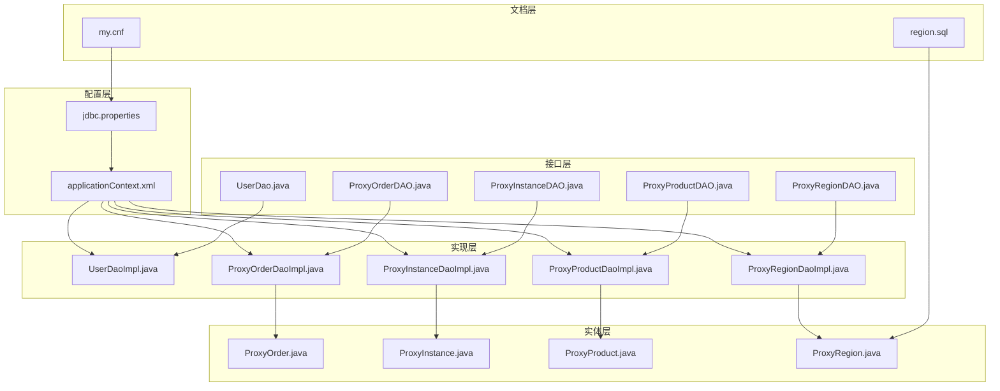
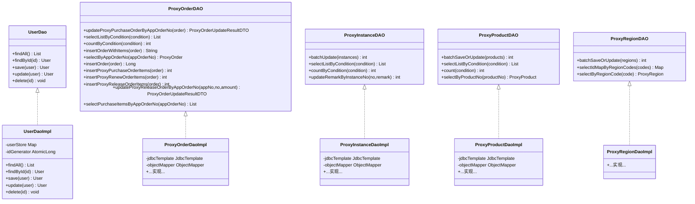
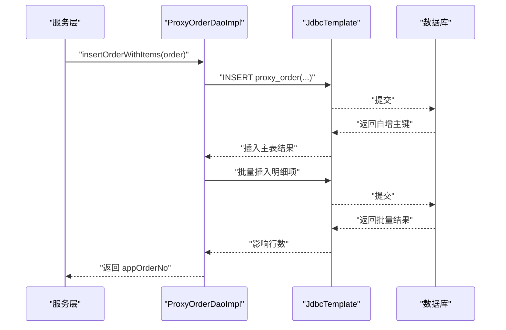
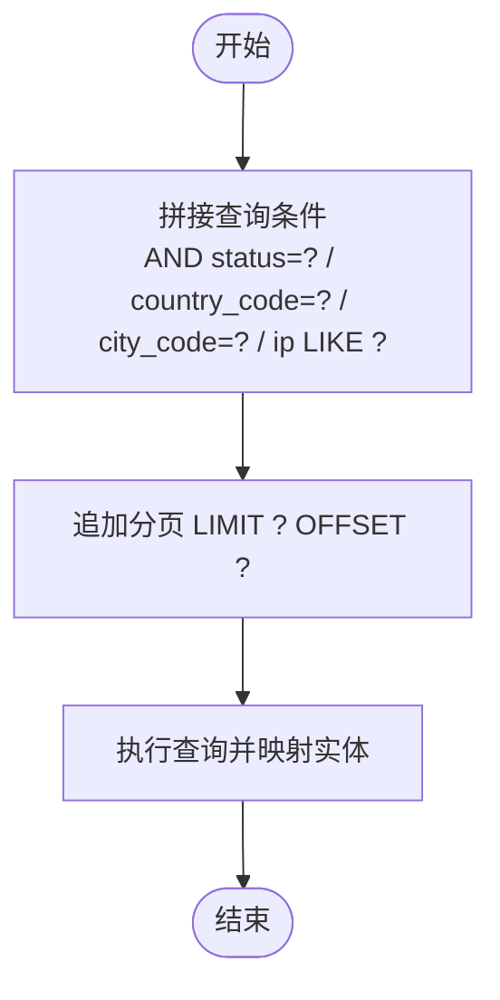
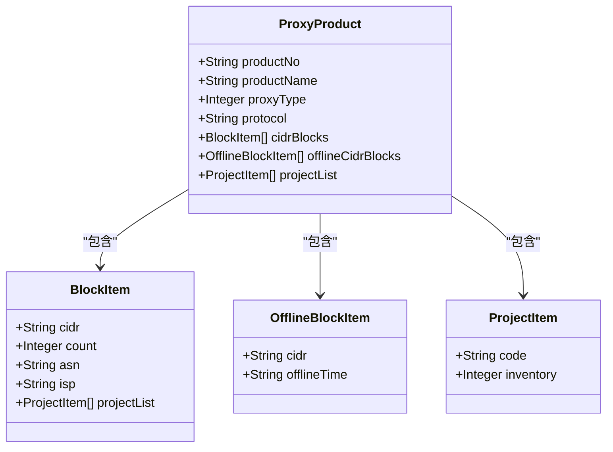
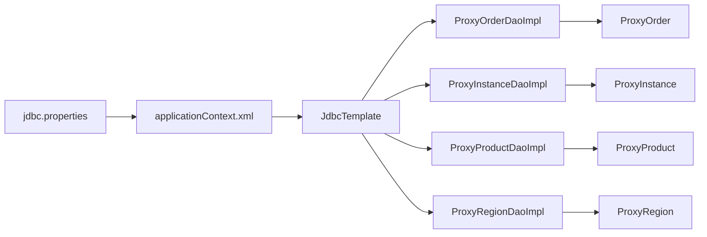

# 数据库操作

<cite>
**本文引用的文件**
- [jdbc.properties](file://src/main/resources/jdbc.properties)
- [applicationContext.xml](file://src/main/resources/applicationContext.xml)
- [UserDao.java](file://src/main/java/cn/linkfast/dao/UserDao.java)
- [UserDaoImpl.java](file://src/main/java/cn/linkfast/dao/impl/UserDaoImpl.java)
- [ProxyOrderDAO.java](file://src/main/java/cn/linkfast/dao/ProxyOrderDAO.java)
- [ProxyOrderDaoImpl.java](file://src/main/java/cn/linkfast/dao/impl/ProxyOrderDaoImpl.java)
- [ProxyInstanceDAO.java](file://src/main/java/cn/linkfast/dao/ProxyInstanceDAO.java)
- [ProxyInstanceDaoImpl.java](file://src/main/java/cn/linkfast/dao/impl/ProxyInstanceDaoImpl.java)
- [ProxyProductDAO.java](file://src/main/java/cn/linkfast/dao/ProxyProductDAO.java)
- [ProxyProductDaoImpl.java](file://src/main/java/cn/linkfast/dao/impl/ProxyProductDaoImpl.java)
- [ProxyRegionDAO.java](file://src/main/java/cn/linkfast/dao/ProxyRegionDAO.java)
- [ProxyRegionDaoImpl.java](file://src/main/java/cn/linkfast/dao/impl/ProxyRegionDaoImpl.java)
- [ProxyOrder.java](file://src/main/java/cn/linkfast/entity/ProxyOrder.java)
- [ProxyInstance.java](file://src/main/java/cn/linkfast/entity/ProxyInstance.java)
- [ProxyProduct.java](file://src/main/java/cn/linkfast/entity/ProxyProduct.java)
- [ProxyRegion.java](file://src/main/java/cn/linkfast/entity/ProxyRegion.java)
- [region.sql](file://docs/database/region.sql)
- [my.cnf](file://docs/database/my.cnf)
</cite>

## 目录
1. [简介](#简介)
2. [项目结构](#项目结构)
3. [核心组件](#核心组件)
4. [架构总览](#架构总览)
5. [详细组件分析](#详细组件分析)
6. [依赖分析](#依赖分析)
7. [性能考虑](#性能考虑)
8. [故障排查指南](#故障排查指南)
9. [结论](#结论)
10. [附录](#附录)

## 简介
本文件系统性梳理 Link-Fast 项目的数据库访问层实现，覆盖数据访问接口与实现、CRUD 流程、批量操作、条件查询、跨表更新、事务与连接管理、参数化查询与 SQL 规范、JSON 字段处理、性能优化与安全实践，并提供常见问题诊断与解决方案。项目当前以 Spring JDBC Template 为核心，DAO 层通过 JdbcTemplate 提供统一的数据库操作能力；同时保留了基于内存的 UserDaoImpl 示例，便于理解与测试。

## 项目结构
数据库相关模块主要分布在以下位置：
- 配置层：JDBC 连接参数与 Spring 容器配置
- 接口层：DAO 接口定义各领域数据访问契约
- 实现层：DAO 实现类使用 JdbcTemplate 执行 SQL
- 实体层：与数据库表结构对应的实体类
- 文档层：数据库初始化脚本与 MySQL 配置参考

图表来源
- [jdbc.properties:1-39](file://src/main/resources/jdbc.properties#L1-L39)
- [applicationContext.xml](file://src/main/resources/applicationContext.xml)
- [UserDao.java:1-35](file://src/main/java/cn/linkfast/dao/UserDao.java#L1-L35)
- [UserDaoImpl.java:1-55](file://src/main/java/cn/linkfast/dao/impl/UserDaoImpl.java#L1-L55)
- [ProxyOrderDAO.java:1-102](file://src/main/java/cn/linkfast/dao/ProxyOrderDAO.java#L1-L102)
- [ProxyOrderDaoImpl.java:1-446](file://src/main/java/cn/linkfast/dao/impl/ProxyOrderDaoImpl.java#L1-L446)
- [ProxyInstanceDAO.java:1-47](file://src/main/java/cn/linkfast/dao/ProxyInstanceDAO.java#L1-L47)
- [ProxyInstanceDaoImpl.java:1-175](file://src/main/java/cn/linkfast/dao/impl/ProxyInstanceDaoImpl.java#L1-L175)
- [ProxyProductDAO.java:1-25](file://src/main/java/cn/linkfast/dao/ProxyProductDAO.java#L1-L25)
- [ProxyProductDaoImpl.java:1-286](file://src/main/java/cn/linkfast/dao/impl/ProxyProductDaoImpl.java#L1-L286)
- [ProxyRegionDAO.java:1-38](file://src/main/java/cn/linkfast/dao/ProxyRegionDAO.java#L1-L38)
- [ProxyRegionDaoImpl.java](file://src/main/java/cn/linkfast/dao/impl/ProxyRegionDaoImpl.java)
- [ProxyOrder.java:1-45](file://src/main/java/cn/linkfast/entity/ProxyOrder.java#L1-L45)
- [ProxyInstance.java:1-57](file://src/main/java/cn/linkfast/entity/ProxyInstance.java#L1-L57)
- [ProxyProduct.java:1-99](file://src/main/java/cn/linkfast/entity/ProxyProduct.java#L1-L99)
- [ProxyRegion.java:1-33](file://src/main/java/cn/linkfast/entity/ProxyRegion.java#L1-L33)
- [region.sql](file://docs/database/region.sql)
- [my.cnf](file://docs/database/my.cnf)

章节来源
- [jdbc.properties:1-39](file://src/main/resources/jdbc.properties#L1-L39)
- [applicationContext.xml](file://src/main/resources/applicationContext.xml)

## 核心组件
- 数据访问接口：定义领域数据的 CRUD 与组合查询契约，如订单、实例、产品、地域等。
- DAO 实现：基于 JdbcTemplate 的具体实现，负责 SQL 构造、参数绑定、批量执行、结果映射与异常处理。
- 实体模型：与数据库表字段一一对应，支持 JSON 字段序列化/反序列化。
- 配置文件：JDBC 连接参数与 Spring 容器装配。

关键职责与特性
- 参数化查询：所有动态 SQL 均采用占位符绑定参数，避免 SQL 注入。
- 批量操作：使用 batchUpdate 执行批量插入/更新，提升吞吐。
- JSON 字段：对复杂结构使用 Jackson 序列化为字符串存入数据库，查询时反序列化。
- 日志记录：对关键操作（插入、更新、批量处理）记录影响行数与耗时，便于审计与排障。

章节来源
- [ProxyOrderDAO.java:1-102](file://src/main/java/cn/linkfast/dao/ProxyOrderDAO.java#L1-L102)
- [ProxyOrderDaoImpl.java:1-446](file://src/main/java/cn/linkfast/dao/impl/ProxyOrderDaoImpl.java#L1-L446)
- [ProxyInstanceDAO.java:1-47](file://src/main/java/cn/linkfast/dao/ProxyInstanceDAO.java#L1-L47)
- [ProxyInstanceDaoImpl.java:1-175](file://src/main/java/cn/linkfast/dao/impl/ProxyInstanceDaoImpl.java#L1-L175)
- [ProxyProductDAO.java:1-25](file://src/main/java/cn/linkfast/dao/ProxyProductDAO.java#L1-L25)
- [ProxyProductDaoImpl.java:1-286](file://src/main/java/cn/linkfast/dao/impl/ProxyProductDaoImpl.java#L1-L286)
- [ProxyRegionDAO.java:1-38](file://src/main/java/cn/linkfast/dao/ProxyRegionDAO.java#L1-L38)
- [ProxyRegionDaoImpl.java](file://src/main/java/cn/linkfast/dao/impl/ProxyRegionDaoImpl.java)
- [ProxyOrder.java:1-45](file://src/main/java/cn/linkfast/entity/ProxyOrder.java#L1-L45)
- [ProxyInstance.java:1-57](file://src/main/java/cn/linkfast/entity/ProxyInstance.java#L1-L57)
- [ProxyProduct.java:1-99](file://src/main/java/cn/linkfast/entity/ProxyProduct.java#L1-L99)
- [ProxyRegion.java:1-33](file://src/main/java/cn/linkfast/entity/ProxyRegion.java#L1-L33)

## 架构总览
数据访问层采用“接口 + 实现 + 实体 + 配置”的分层设计，DAO 实现通过 JdbcTemplate 统一执行 SQL，结合 BeanPropertyRowMapper 或自定义 RowMapper 完成结果映射。实体类支持 JSON 字段，DAO 层负责序列化/反序列化。

图表来源
- [UserDao.java:1-35](file://src/main/java/cn/linkfast/dao/UserDao.java#L1-L35)
- [UserDaoImpl.java:1-55](file://src/main/java/cn/linkfast/dao/impl/UserDaoImpl.java#L1-L55)
- [ProxyOrderDAO.java:1-102](file://src/main/java/cn/linkfast/dao/ProxyOrderDAO.java#L1-L102)
- [ProxyOrderDaoImpl.java:1-446](file://src/main/java/cn/linkfast/dao/impl/ProxyOrderDaoImpl.java#L1-L446)
- [ProxyInstanceDAO.java:1-47](file://src/main/java/cn/linkfast/dao/ProxyInstanceDAO.java#L1-L47)
- [ProxyInstanceDaoImpl.java:1-175](file://src/main/java/cn/linkfast/dao/impl/ProxyInstanceDaoImpl.java#L1-L175)
- [ProxyProductDAO.java:1-25](file://src/main/java/cn/linkfast/dao/ProxyProductDAO.java#L1-L25)
- [ProxyProductDaoImpl.java:1-286](file://src/main/java/cn/linkfast/dao/impl/ProxyProductDaoImpl.java#L1-L286)
- [ProxyRegionDAO.java:1-38](file://src/main/java/cn/linkfast/dao/ProxyRegionDAO.java#L1-L38)
- [ProxyRegionDaoImpl.java](file://src/main/java/cn/linkfast/dao/impl/ProxyRegionDaoImpl.java)

## 详细组件分析

### 订单数据访问层（ProxyOrderDAO/Impl）
- 主要职责
  - 订单主表与明细表的插入、更新与回写
  - 基于条件的分页查询与统计
  - 批量插入购买/续费/释放订单明细
  - 实例数据的批量 Upsert（存在即更新，不存在即插入）

- 关键流程
  - 新建订单并插入明细：先插入主表，再批量插入明细项
  - 回写第三方订单号与金额：分别更新主表与明细表
  - 批量 Upsert 实例：使用 INSERT ... ON DUPLICATE KEY UPDATE

- 参数化与 SQL 规范
  - 所有动态 SQL 使用占位符绑定参数，避免拼接
  - 分页使用 MySQL 的 LIMIT ?, ?，offset 由条件对象提供

- 批量操作
  - 使用 jdbcTemplate.batchUpdate 执行批量插入/更新
  - 统计受影响行数，过滤 r > 0 的记录作为实际变更数

- JSON 字段处理
  - 使用 Jackson 将对象序列化为 JSON 字符串存入数据库
  - 异常时回退为空数组字符串，保证健壮性

图表来源
- [ProxyOrderDaoImpl.java:213-244](file://src/main/java/cn/linkfast/dao/impl/ProxyOrderDaoImpl.java#L213-L244)

章节来源
- [ProxyOrderDAO.java:1-102](file://src/main/java/cn/linkfast/dao/ProxyOrderDAO.java#L1-L102)
- [ProxyOrderDaoImpl.java:1-446](file://src/main/java/cn/linkfast/dao/impl/ProxyOrderDaoImpl.java#L1-L446)

### 实例数据访问层（ProxyInstanceDAO/Impl）
- 主要职责
  - 实例数据的批量更新（Upsert）
  - 基于多条件的分页查询与统计
  - 实例备注的条件更新

- 查询条件拼接
  - 支持代理类型 IN 条件、状态、国家/城市、IP 模糊匹配
  - 分页使用 LIMIT ? OFFSET ?

- 批量更新
  - 使用 UPDATE ... WHERE instance_no 批量更新
  - 统计实际变更的记录数

图表来源
- [ProxyInstanceDaoImpl.java:90-115](file://src/main/java/cn/linkfast/dao/impl/ProxyInstanceDaoImpl.java#L90-L115)

章节来源
- [ProxyInstanceDAO.java:1-47](file://src/main/java/cn/linkfast/dao/ProxyInstanceDAO.java#L1-L47)
- [ProxyInstanceDaoImpl.java:1-175](file://src/main/java/cn/linkfast/dao/impl/ProxyInstanceDaoImpl.java#L1-L175)

### 产品数据访问层（ProxyProductDAO/Impl）
- 主要职责
  - 产品信息的批量 Upsert
  - 基于条件的分页查询与统计
  - 单个产品按编号查询

- JSON 字段处理
  - 使用自定义 RowMapper 手动解析 JSON 字段
  - 提供 JSON 序列化工具方法，空值回退为 "[]"

- 批量操作
  - 使用 BatchPreparedStatementSetter 执行批量插入/更新
  - 统计成功变更数量

图表来源
- [ProxyProduct.java:1-99](file://src/main/java/cn/linkfast/entity/ProxyProduct.java#L1-L99)

章节来源
- [ProxyProductDAO.java:1-25](file://src/main/java/cn/linkfast/dao/ProxyProductDAO.java#L1-L25)
- [ProxyProductDaoImpl.java:1-286](file://src/main/java/cn/linkfast/dao/impl/ProxyProductDaoImpl.java#L1-L286)

### 地域数据访问层（ProxyRegionDAO/Impl）
- 主要职责
  - 地域信息的批量 Upsert
  - 按区域编码查询 ID 映射
  - 按区域编码查询单条地域信息

- 适用场景
  - 初始化或同步地域数据
  - 查询区域 ID 用于外键关联

章节来源
- [ProxyRegionDAO.java:1-38](file://src/main/java/cn/linkfast/dao/ProxyRegionDAO.java#L1-L38)
- [ProxyRegionDaoImpl.java](file://src/main/java/cn/linkfast/dao/impl/ProxyRegionDaoImpl.java)

### 用户数据访问层（UserDao/Impl）
- 当前实现
  - 基于内存的并发安全存储，用于演示与测试
  - 支持 CRUD 操作与 ID 生成

- 注意事项
  - 非持久化实现，不涉及数据库连接与事务
  - 仅用于本地开发与单元测试

章节来源
- [UserDao.java:1-35](file://src/main/java/cn/linkfast/dao/UserDao.java#L1-L35)
- [UserDaoImpl.java:1-55](file://src/main/java/cn/linkfast/dao/impl/UserDaoImpl.java#L1-L55)

## 依赖分析
- 组件耦合
  - DAO 实现依赖 JdbcTemplate 与 ObjectMapper
  - 实体类与数据库表字段一一对应，支持 JSON 字段
  - 接口与实现分离，便于替换与扩展

- 外部依赖
  - MySQL 驱动与连接参数由 jdbc.properties 提供
  - Spring 容器负责装配 JdbcTemplate 与 DAO 实现

图表来源
- [jdbc.properties:1-39](file://src/main/resources/jdbc.properties#L1-L39)
- [applicationContext.xml](file://src/main/resources/applicationContext.xml)

章节来源
- [jdbc.properties:1-39](file://src/main/resources/jdbc.properties#L1-L39)
- [applicationContext.xml](file://src/main/resources/applicationContext.xml)

## 性能考虑
- 连接与池化
  - JDBC URL 启用预编译缓存与批量重写，提升批量执行效率
  - 连接超时与 Socket 超时设置合理，避免长时间阻塞
  - 建议在生产环境启用连接池（如 HikariCP），并在容器中配置

- 批量操作
  - 使用 batchUpdate 执行批量插入/更新，减少往返次数
  - 控制批大小，避免单次批量过大导致内存压力

- 查询优化
  - 分页查询使用 LIMIT/OFFSET，建议配合合适的索引
  - 动态条件拼接时，优先使用等值/范围查询，避免全表扫描

- JSON 字段
  - JSON 字段仅在必要时读取，避免不必要的序列化/反序列化
  - 对 JSON 字段建立合适索引（如虚拟列+索引）可提升查询性能

- 索引设计原则
  - 唯一键：app_order_no、instance_no、product_no 等
  - 高选择性列：status、order_type、country_code、city_code
  - 复合索引：常用过滤组合（如 status + create_time）

- 查询计划分析
  - 使用 EXPLAIN 分析慢查询，关注 key、rows、filtered 等指标
  - 避免 SELECT *，仅查询必要字段
  - 对频繁排序的字段建立索引，减少文件排序

[本节为通用性能指导，无需特定文件来源]

## 故障排查指南
- 连接与超时
  - 现象：连接失败或超时
  - 排查：检查 JDBC URL、用户名/密码、网络连通性
  - 参考：连接超时与 Socket 超时参数

- 批量执行异常
  - 现象：批量插入/更新抛出异常或部分失败
  - 排查：查看日志输出的影响行数，定位失败批次
  - 建议：拆分批次、检查数据合法性、确认唯一约束

- JSON 字段异常
  - 现象：JSON 转换失败或读取为空
  - 排查：确认字段是否为 null，检查序列化/反序列化逻辑
  - 建议：统一空值回退策略，避免空指针

- 参数绑定错误
  - 现象：SQL 执行报错或未命中预期记录
  - 排查：核对占位符数量与顺序，确认参数类型匹配
  - 建议：使用日志打印最终 SQL 与参数，便于定位

- 事务与一致性
  - 现象：跨表更新不一致
  - 排查：确认是否需要在同一事务内执行多个更新
  - 建议：在服务层开启事务，确保原子性

章节来源
- [jdbc.properties:1-39](file://src/main/resources/jdbc.properties#L1-L39)
- [ProxyOrderDaoImpl.java:34-76](file://src/main/java/cn/linkfast/dao/impl/ProxyOrderDaoImpl.java#L34-L76)
- [ProxyInstanceDaoImpl.java:32-88](file://src/main/java/cn/linkfast/dao/impl/ProxyInstanceDaoImpl.java#L32-L88)
- [ProxyProductDaoImpl.java:101-190](file://src/main/java/cn/linkfast/dao/impl/ProxyProductDaoImpl.java#L101-L190)

## 结论
Link-Fast 的数据访问层以 Spring JDBC Template 为基础，通过清晰的 DAO 接口与实现，提供了参数化查询、批量操作、JSON 字段处理与完善的日志记录能力。建议在生产环境中引入连接池与事务管理，并结合索引与查询计划分析持续优化性能。同时，完善异常处理与监控告警，确保系统稳定性与可观测性。

[本节为总结性内容，无需特定文件来源]

## 附录

### 数据库连接与会话管理
- 连接参数
  - 驱动、URL、用户名、密码、字符集与时区
  - 批量执行、多查询、预编译缓存、Socket/连接超时、自动重连等参数

- 会话管理
  - 建议在服务层管理事务边界，确保跨表更新的一致性
  - 对长事务进行拆分，避免锁竞争与死锁

章节来源
- [jdbc.properties:1-39](file://src/main/resources/jdbc.properties#L1-L39)
- [applicationContext.xml](file://src/main/resources/applicationContext.xml)

### SQL 编写规范与参数化查询
- 规范
  - 使用占位符绑定参数，避免字符串拼接
  - 动态 SQL 按需拼接，保持 SQL 可读性
  - 分页使用 LIMIT/OFFSET，避免一次性加载大量数据

- 示例路径
  - [ProxyOrderDaoImpl.java:85-121](file://src/main/java/cn/linkfast/dao/impl/ProxyOrderDaoImpl.java#L85-L121)
  - [ProxyInstanceDaoImpl.java:90-115](file://src/main/java/cn/linkfast/dao/impl/ProxyInstanceDaoImpl.java#L90-L115)

章节来源
- [ProxyOrderDaoImpl.java:85-121](file://src/main/java/cn/linkfast/dao/impl/ProxyOrderDaoImpl.java#L85-L121)
- [ProxyInstanceDaoImpl.java:90-115](file://src/main/java/cn/linkfast/dao/impl/ProxyInstanceDaoImpl.java#L90-L115)

### 存储过程与视图
- 当前实现未使用存储过程
- 如需复杂业务封装，可考虑存储过程或视图，但需评估维护成本与迁移难度

[本节为概念性内容，无需特定文件来源]

### 数据库初始化与运维
- 初始化脚本
  - 地域表初始化脚本位于 docs/database/region.sql
  - 建议在部署时执行初始化脚本，确保基础数据可用

- MySQL 配置参考
  - docs/database/my.cnf 提供 MySQL 配置示例，可根据环境调整

章节来源
- [region.sql](file://docs/database/region.sql)
- [my.cnf](file://docs/database/my.cnf)