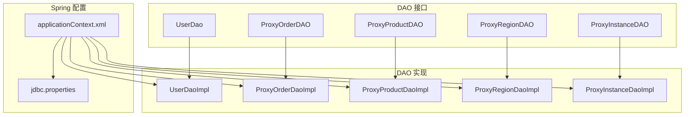
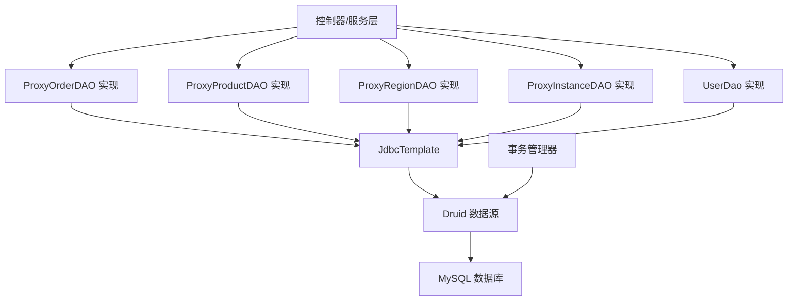
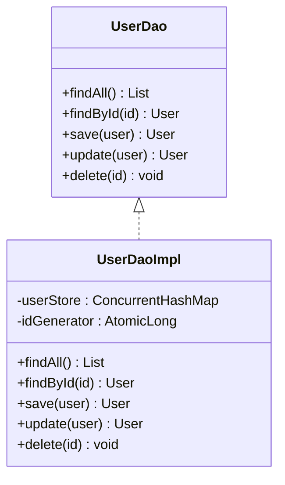
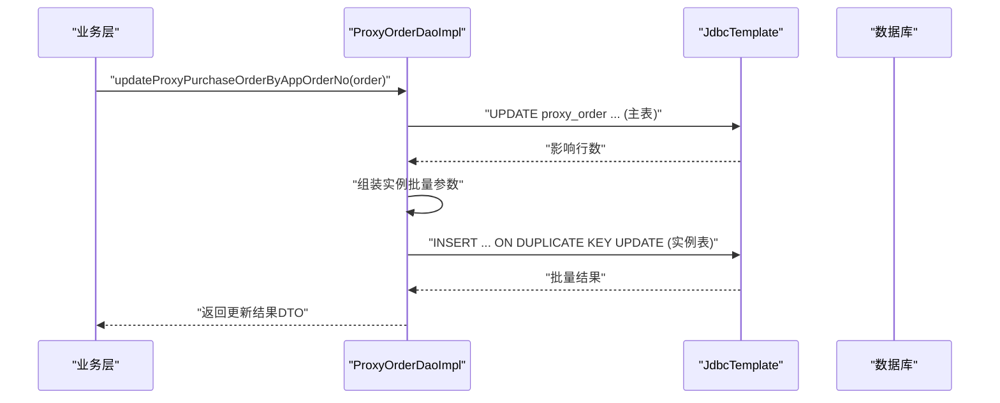
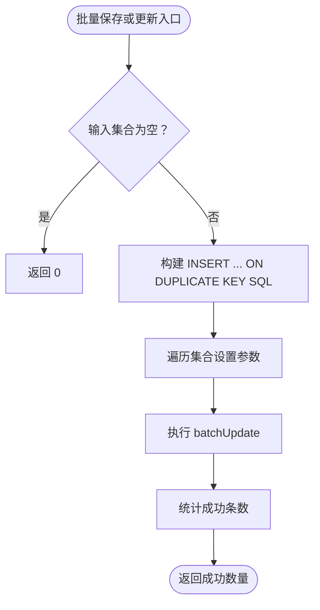
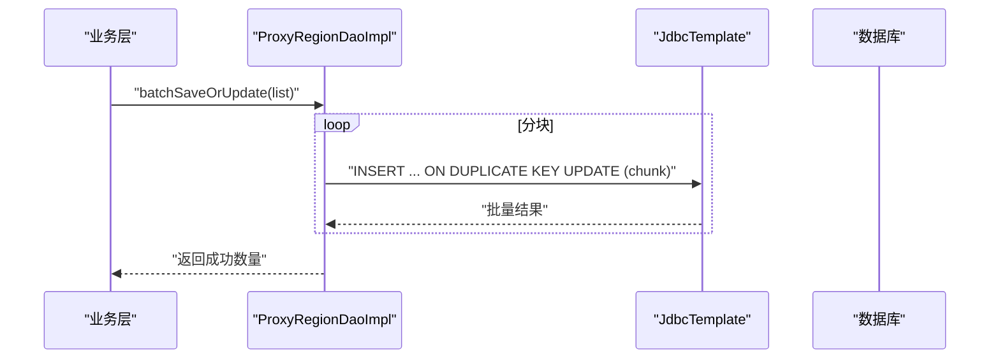
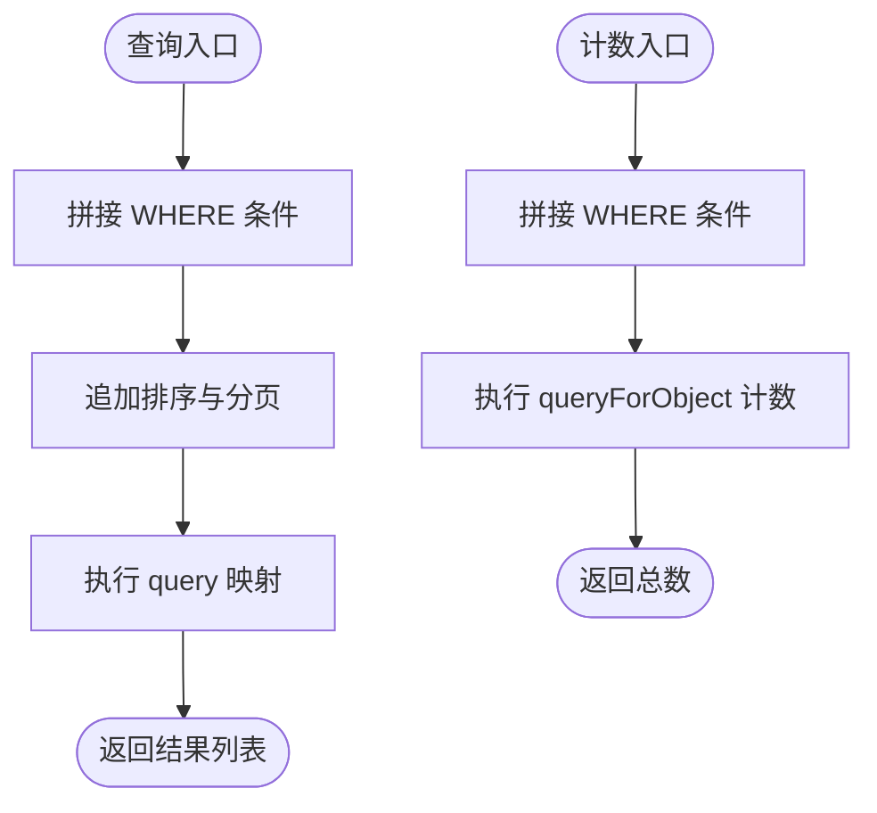
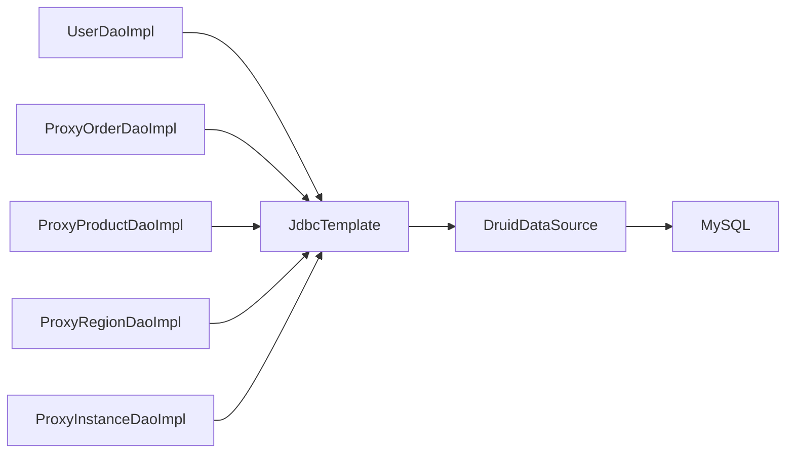

# 数据访问层

<cite>
**本文引用的文件**
- [UserDao.java](file://src/main/java/cn/linkfast/dao/UserDao.java)
- [UserDaoImpl.java](file://src/main/java/cn/linkfast/dao/impl/UserDaoImpl.java)
- [ProxyOrderDAO.java](file://src/main/java/cn/linkfast/dao/ProxyOrderDAO.java)
- [ProxyOrderDaoImpl.java](file://src/main/java/cn/linkfast/dao/impl/ProxyOrderDaoImpl.java)
- [ProxyProductDAO.java](file://src/main/java/cn/linkfast/dao/ProxyProductDAO.java)
- [ProxyProductDaoImpl.java](file://src/main/java/cn/linkfast/dao/impl/ProxyProductDaoImpl.java)
- [ProxyRegionDAO.java](file://src/main/java/cn/linkfast/dao/ProxyRegionDAO.java)
- [ProxyRegionDaoImpl.java](file://src/main/java/cn/linkfast/dao/impl/ProxyRegionDaoImpl.java)
- [ProxyInstanceDAO.java](file://src/main/java/cn/linkfast/dao/ProxyInstanceDAO.java)
- [ProxyInstanceDaoImpl.java](file://src/main/java/cn/linkfast/dao/impl/ProxyInstanceDaoImpl.java)
- [applicationContext.xml](file://src/main/resources/applicationContext.xml)
- [jdbc.properties](file://src/main/resources/jdbc.properties)
- [ProxyOrder.java](file://src/main/java/cn/linkfast/entity/ProxyOrder.java)
- [ProxyProduct.java](file://src/main/java/cn/linkfast/entity/ProxyProduct.java)
- [ProxyRegion.java](file://src/main/java/cn/linkfast/entity/ProxyRegion.java)
</cite>

## 目录
1. [简介](#简介)
2. [项目结构](#项目结构)
3. [核心组件](#核心组件)
4. [架构总览](#架构总览)
5. [组件详解](#组件详解)
6. [依赖关系分析](#依赖关系分析)
7. [性能考量](#性能考量)
8. [故障排查指南](#故障排查指南)
9. [结论](#结论)
10. [附录](#附录)

## 简介
本章节面向 Link-Fast 项目的“数据访问层”（Data Access Layer, DAL），系统化阐述 DAO 接口设计与实现、JDBC 访问模式、SQL 优化策略、连接池与事务管理、以及与业务层的交互方式。文档覆盖 CRUD、复杂查询、批量操作、JSON 字段处理、SQL 注入防护、异常与错误传播、性能优化与扩展建议。

## 项目结构
数据访问层采用“接口 + Spring 管理的实现类”的分层设计，结合 Spring JDBC 的 JdbcTemplate 提供统一的数据库访问能力，并通过 Spring XML 配置完成数据源、连接池、事务管理器的装配。实体类与 DTO 位于独立包中，DAO 层通过 RowMapper 或 BeanPropertyRowMapper 映射结果集。

图表来源
- [applicationContext.xml:14-67](file://src/main/resources/applicationContext.xml#L14-L67)
- [UserDao.java:1-35](file://src/main/java/cn/linkfast/dao/UserDao.java#L1-L35)
- [ProxyOrderDAO.java:1-102](file://src/main/java/cn/linkfast/dao/ProxyOrderDAO.java#L1-L102)
- [ProxyProductDAO.java:1-25](file://src/main/java/cn/linkfast/dao/ProxyProductDAO.java#L1-L25)
- [ProxyRegionDAO.java:1-38](file://src/main/java/cn/linkfast/dao/ProxyRegionDAO.java#L1-L38)
- [ProxyInstanceDAO.java:1-47](file://src/main/java/cn/linkfast/dao/ProxyInstanceDAO.java#L1-L47)

章节来源
- [applicationContext.xml:14-67](file://src/main/resources/applicationContext.xml#L14-L67)
- [jdbc.properties:1-39](file://src/main/resources/jdbc.properties#L1-L39)

## 核心组件
- 接口层：定义领域内数据访问契约，如用户、订单、产品、地域、实例等模块的 CRUD 与复合查询。
- 实现层：基于 JdbcTemplate 的具体实现，负责 SQL 构造、参数绑定、批量处理、JSON 字段序列化/反序列化、RowMapper 映射。
- 配置层：Spring XML 配置数据源、连接池、JdbcTemplate、事务管理器与注解驱动。
- 实体层：与数据库表结构对应的实体类，部分实体包含复杂 JSON 字段的内嵌类。

章节来源
- [UserDao.java:1-35](file://src/main/java/cn/linkfast/dao/UserDao.java#L1-L35)
- [ProxyOrderDAO.java:1-102](file://src/main/java/cn/linkfast/dao/ProxyOrderDAO.java#L1-L102)
- [ProxyProductDAO.java:1-25](file://src/main/java/cn/linkfast/dao/ProxyProductDAO.java#L1-L25)
- [ProxyRegionDAO.java:1-38](file://src/main/java/cn/linkfast/dao/ProxyRegionDAO.java#L1-L38)
- [ProxyInstanceDAO.java:1-47](file://src/main/java/cn/linkfast/dao/ProxyInstanceDAO.java#L1-L47)
- [ProxyOrderDaoImpl.java:1-446](file://src/main/java/cn/linkfast/dao/impl/ProxyOrderDaoImpl.java#L1-L446)
- [ProxyProductDaoImpl.java:1-286](file://src/main/java/cn/linkfast/dao/impl/ProxyProductDaoImpl.java#L1-L286)
- [ProxyRegionDaoImpl.java:1-155](file://src/main/java/cn/linkfast/dao/impl/ProxyRegionDaoImpl.java#L1-L155)
- [ProxyInstanceDaoImpl.java:1-175](file://src/main/java/cn/linkfast/dao/impl/ProxyInstanceDaoImpl.java#L1-L175)
- [applicationContext.xml:14-67](file://src/main/resources/applicationContext.xml#L14-L67)
- [ProxyOrder.java:1-45](file://src/main/java/cn/linkfast/entity/ProxyOrder.java#L1-L45)
- [ProxyProduct.java:1-99](file://src/main/java/cn/linkfast/entity/ProxyProduct.java#L1-L99)
- [ProxyRegion.java:1-33](file://src/main/java/cn/linkfast/entity/ProxyRegion.java#L1-L33)

## 架构总览
数据访问层围绕 JdbcTemplate 构建，DAO 实现类通过构造 SQL 与参数列表执行查询与更新；对于复杂 JSON 字段，采用 Jackson 序列化/反序列化；批量操作通过 batchUpdate 与 BatchPreparedStatementSetter 提升吞吐；连接池采用 Druid，事务由 DataSourceTransactionManager 管理，注解驱动开启。

图表来源
- [applicationContext.xml:14-67](file://src/main/resources/applicationContext.xml#L14-L67)
- [ProxyOrderDaoImpl.java:30-31](file://src/main/java/cn/linkfast/dao/impl/ProxyOrderDaoImpl.java#L30-L31)
- [ProxyProductDaoImpl.java:34-35](file://src/main/java/cn/linkfast/dao/impl/ProxyProductDaoImpl.java#L34-L35)
- [ProxyRegionDaoImpl.java:35](file://src/main/java/cn/linkfast/dao/impl/ProxyRegionDaoImpl.java#L35)
- [ProxyInstanceDaoImpl.java:29-30](file://src/main/java/cn/linkfast/dao/impl/ProxyInstanceDaoImpl.java#L29-L30)
- [UserDaoImpl.java:16-17](file://src/main/java/cn/linkfast/dao/impl/UserDaoImpl.java#L16-L17)

## 组件详解

### 用户数据访问（UserDao）
- 设计模式：接口 + 内存实现（用于演示/测试环境），体现职责分离与可替换性。
- 实现要点：并发安全的内存存储、原子自增 ID、基础 CRUD。
- 适用场景：本地演示、单元测试、不依赖真实数据库的场景。

图表来源
- [UserDao.java:9-35](file://src/main/java/cn/linkfast/dao/UserDao.java#L9-L35)
- [UserDaoImpl.java:17-55](file://src/main/java/cn/linkfast/dao/impl/UserDaoImpl.java#L17-L55)

章节来源
- [UserDao.java:1-35](file://src/main/java/cn/linkfast/dao/UserDao.java#L1-L35)
- [UserDaoImpl.java:1-55](file://src/main/java/cn/linkfast/dao/impl/UserDaoImpl.java#L1-L55)

### 订单数据访问（ProxyOrderDAO/Impl）
- 职责分离：
  - 主表与明细表的拆分：主表 proxy_order 与购买/续费/释放明细表分离。
  - 复合更新：支持“订单+实例”一体化更新（ON DUPLICATE KEY）。
  - 回写流程：第三方回调后回写平台订单号与金额，同步更新主表与明细表。
  - 批量插入：purchase/renew/release 三类明细的批量写入。
- SQL 优化：
  - 动态拼接 WHERE 条件，避免 SQL 注入。
  - 使用 BeanPropertyRowMapper 自动映射驼峰字段。
  - 批量更新使用 ON DUPLICATE KEY，减少往返。
- JSON 字段：对 bridges 等复杂字段进行 JSON 序列化存储。

图表来源
- [ProxyOrderDaoImpl.java:34-76](file://src/main/java/cn/linkfast/dao/impl/ProxyOrderDaoImpl.java#L34-L76)
- [ProxyOrder.java:37-44](file://src/main/java/cn/linkfast/entity/ProxyOrder.java#L37-L44)

章节来源
- [ProxyOrderDAO.java:1-102](file://src/main/java/cn/linkfast/dao/ProxyOrderDAO.java#L1-L102)
- [ProxyOrderDaoImpl.java:1-446](file://src/main/java/cn/linkfast/dao/impl/ProxyOrderDaoImpl.java#L1-L446)
- [ProxyOrder.java:1-45](file://src/main/java/cn/linkfast/entity/ProxyOrder.java#L1-L45)

### 产品数据访问（ProxyProductDAO/Impl）
- 职责分离：产品列表查询、计数、按编号查询、批量 Upsert。
- 复杂字段：JSON 字段（cidr_blocks、offline_cidr_blocks、project_list）通过 Jackson 处理。
- RowMapper：自定义 RowMapper 手动解析 JSON 字段，保证字段完整性。
- 批量策略：使用 BatchPreparedStatementSetter，提升导入/同步效率。

图表来源
- [ProxyProductDaoImpl.java:101-190](file://src/main/java/cn/linkfast/dao/impl/ProxyProductDaoImpl.java#L101-L190)

章节来源
- [ProxyProductDAO.java:1-25](file://src/main/java/cn/linkfast/dao/ProxyProductDAO.java#L1-L25)
- [ProxyProductDaoImpl.java:1-286](file://src/main/java/cn/linkfast/dao/impl/ProxyProductDaoImpl.java#L1-L286)
- [ProxyProduct.java:67-99](file://src/main/java/cn/linkfast/entity/ProxyProduct.java#L67-L99)

### 地域数据访问（ProxyRegionDAO/Impl）
- 职责分离：批量 Upsert、按区域码映射 ID、按区域码查询。
- 批量策略：分块批量（默认每块 200 条），降低长事务与网络超时风险。
- 查询策略：IN 子句分块，避免参数过多导致的通信失败。

图表来源
- [ProxyRegionDaoImpl.java:38-52](file://src/main/java/cn/linkfast/dao/impl/ProxyRegionDaoImpl.java#L38-L52)
- [ProxyRegionDaoImpl.java:103-125](file://src/main/java/cn/linkfast/dao/impl/ProxyRegionDaoImpl.java#L103-L125)

章节来源
- [ProxyRegionDAO.java:1-38](file://src/main/java/cn/linkfast/dao/ProxyRegionDAO.java#L1-L38)
- [ProxyRegionDaoImpl.java:1-155](file://src/main/java/cn/linkfast/dao/impl/ProxyRegionDaoImpl.java#L1-L155)
- [ProxyRegion.java:1-33](file://src/main/java/cn/linkfast/entity/ProxyRegion.java#L1-L33)

### 实例数据访问（ProxyInstanceDAO/Impl）
- 职责分离：批量更新实例状态与属性、按条件分页查询与计数、按实例编号更新备注。
- 动态查询：支持多条件拼接（状态、国家/城市、IP 模糊匹配），统一走 LIMIT/OFFSET。
- JSON 字段：对 bridges 字段进行 JSON 序列化存储。

图表来源
- [ProxyInstanceDaoImpl.java:90-115](file://src/main/java/cn/linkfast/dao/impl/ProxyInstanceDaoImpl.java#L90-L115)
- [ProxyInstanceDaoImpl.java:117-148](file://src/main/java/cn/linkfast/dao/impl/ProxyInstanceDaoImpl.java#L117-L148)

章节来源
- [ProxyInstanceDAO.java:1-47](file://src/main/java/cn/linkfast/dao/ProxyInstanceDAO.java#L1-L47)
- [ProxyInstanceDaoImpl.java:1-175](file://src/main/java/cn/linkfast/dao/impl/ProxyInstanceDaoImpl.java#L1-L175)

## 依赖关系分析
- 组件耦合：DAO 实现类依赖 JdbcTemplate 与 ObjectMapper；接口与实现通过 Spring 容器装配，低耦合高内聚。
- 外部依赖：MySQL 驱动、Druid 连接池、Jackson JSON、Spring JDBC。
- 循环依赖：未见循环依赖迹象，各 DAO 之间无直接调用关系。

图表来源
- [applicationContext.xml:17-57](file://src/main/resources/applicationContext.xml#L17-L57)
- [ProxyOrderDaoImpl.java:30-31](file://src/main/java/cn/linkfast/dao/impl/ProxyOrderDaoImpl.java#L30-L31)
- [ProxyProductDaoImpl.java:34-35](file://src/main/java/cn/linkfast/dao/impl/ProxyProductDaoImpl.java#L34-L35)
- [ProxyRegionDaoImpl.java:35](file://src/main/java/cn/linkfast/dao/impl/ProxyRegionDaoImpl.java#L35)
- [ProxyInstanceDaoImpl.java:29-30](file://src/main/java/cn/linkfast/dao/impl/ProxyInstanceDaoImpl.java#L29-L30)

章节来源
- [applicationContext.xml:17-67](file://src/main/resources/applicationContext.xml#L17-L67)

## 性能考量
- 连接池配置
  - 初始连接数、最小空闲、最大活跃、最大等待时间等参数已在配置中设定，兼顾吞吐与资源占用。
  - keepAlive、空闲检测、异常连接回收、泄露检测等策略降低连接失效与泄漏风险。
- 批量操作
  - 产品与地域 DAO 使用批量更新/插入，显著提升导入/同步性能。
  - 地域 DAO 采用分块批量（默认 200 条/块），避免长事务与网络超时。
- SQL 优化
  - 动态拼接 WHERE 条件并使用占位符，避免拼接式 SQL。
  - 使用 BeanPropertyRowMapper 自动映射驼峰字段，减少手工映射开销。
  - 复合更新使用 ON DUPLICATE KEY，减少往返与条件判断。
- JSON 字段
  - Jackson 序列化/反序列化，注意字段大小与索引策略，必要时考虑冗余字段或二级索引。
- 超时与重试
  - JDBC URL 设置 socketTimeout、connectTimeout，配合连接池 maxWait 与线程等待上限，避免阻塞。

章节来源
- [applicationContext.xml:23-52](file://src/main/resources/applicationContext.xml#L23-L52)
- [jdbc.properties:5-17](file://src/main/resources/jdbc.properties#L5-L17)
- [ProxyProductDaoImpl.java:101-190](file://src/main/java/cn/linkfast/dao/impl/ProxyProductDaoImpl.java#L101-L190)
- [ProxyRegionDaoImpl.java:38-52](file://src/main/java/cn/linkfast/dao/impl/ProxyRegionDaoImpl.java#L38-L52)
- [ProxyInstanceDaoImpl.java:32-88](file://src/main/java/cn/linkfast/dao/impl/ProxyInstanceDaoImpl.java#L32-L88)

## 故障排查指南
- SQL 注入防护
  - 始终使用占位符参数绑定，避免字符串拼接；动态 WHERE 条件仅拼接关键字与占位符。
- 日志与可观测性
  - DAO 层广泛输出 SQL 与执行结果，便于定位问题；建议在生产环境控制日志级别。
- 异常处理
  - 批量更新异常会抛出运行时异常，需在业务层捕获并回滚事务；DAO 层不吞异常，保留堆栈信息。
- 连接池问题
  - 若出现“获取连接超时”，检查 maxActive、maxWait、线程等待上限；关注 removeAbandoned 泄漏日志。
- JSON 字段异常
  - Jackson 转换失败时回退为空集合，避免空指针；建议对关键 JSON 字段增加校验与告警。

章节来源
- [ProxyOrderDaoImpl.java:87-121](file://src/main/java/cn/linkfast/dao/impl/ProxyOrderDaoImpl.java#L87-L121)
- [ProxyProductDaoImpl.java:243-271](file://src/main/java/cn/linkfast/dao/impl/ProxyProductDaoImpl.java#L243-L271)
- [ProxyInstanceDaoImpl.java:75-78](file://src/main/java/cn/linkfast/dao/impl/ProxyInstanceDaoImpl.java#L75-L78)
- [applicationContext.xml:44-51](file://src/main/resources/applicationContext.xml#L44-L51)

## 结论
数据访问层以 DAO 接口为核心，结合 JdbcTemplate 实现统一的 CRUD、复杂查询与批量操作，具备良好的扩展性与可维护性。通过 Druid 连接池与注解事务管理，满足生产级可用性与性能要求。建议在复杂查询与大批量导入场景继续强化索引与分页策略，并完善监控与告警体系。

## 附录

### 事务管理机制
- 事务管理器：DataSourceTransactionManager。
- 启用方式：XML 中开启注解驱动，业务层可使用相应注解声明事务边界。
- 传播行为：默认 REQUIRED，异常时回滚；DAO 层不自行开启事务。

章节来源
- [applicationContext.xml:59-67](file://src/main/resources/applicationContext.xml#L59-L67)

### 数据库连接管理
- 数据源：DruidDataSource，支持连接池、健康检查、异常连接回收、泄露检测。
- JdbcTemplate：统一执行 SQL，支持批量与 RowMapper。
- JDBC URL 参数：rewriteBatchedStatements、allowMultiQueries、cachePrepStmts、socketTimeout、connectTimeout 等。

章节来源
- [applicationContext.xml:17-57](file://src/main/resources/applicationContext.xml#L17-L57)
- [jdbc.properties:5-17](file://src/main/resources/jdbc.properties#L5-L17)

### 扩展指南与自定义查询
- 新增 DAO 接口与实现：遵循现有命名规范与参数风格，优先使用 JdbcTemplate 批量与 RowMapper。
- 自定义查询：建议封装为条件对象（如 SearchCondition），在 DAO 内部统一拼接 WHERE 与分页。
- JSON 字段：沿用 Jackson 序列化策略，RowMapper 中显式解析，避免隐式转换。
- 批量策略：参考产品与地域 DAO 的分块批量实现，平衡吞吐与稳定性。

章节来源
- [ProxyProductDaoImpl.java:216-234](file://src/main/java/cn/linkfast/dao/impl/ProxyProductDaoImpl.java#L216-L234)
- [ProxyRegionDaoImpl.java:38-52](file://src/main/java/cn/linkfast/dao/impl/ProxyRegionDaoImpl.java#L38-L52)