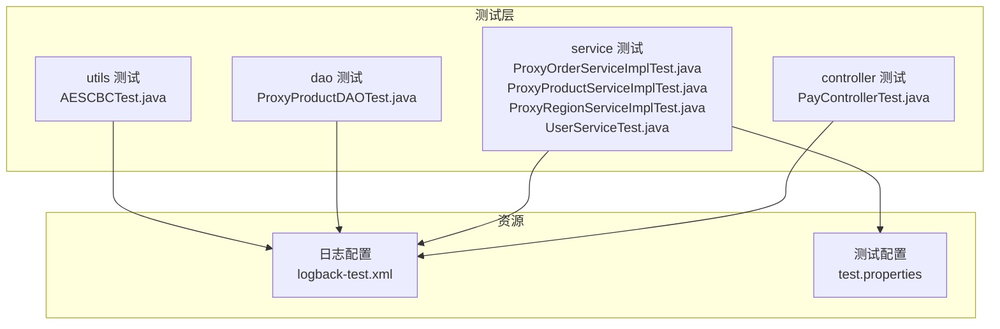
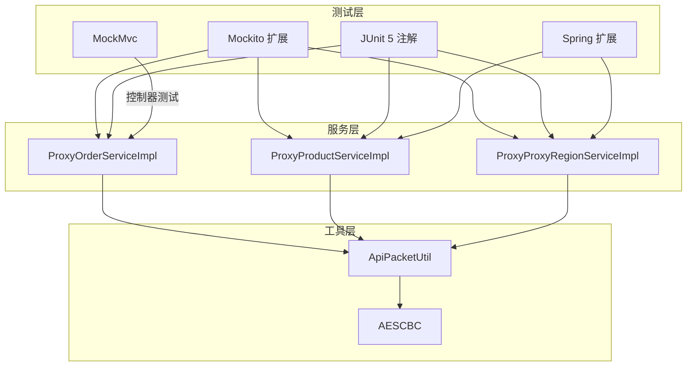
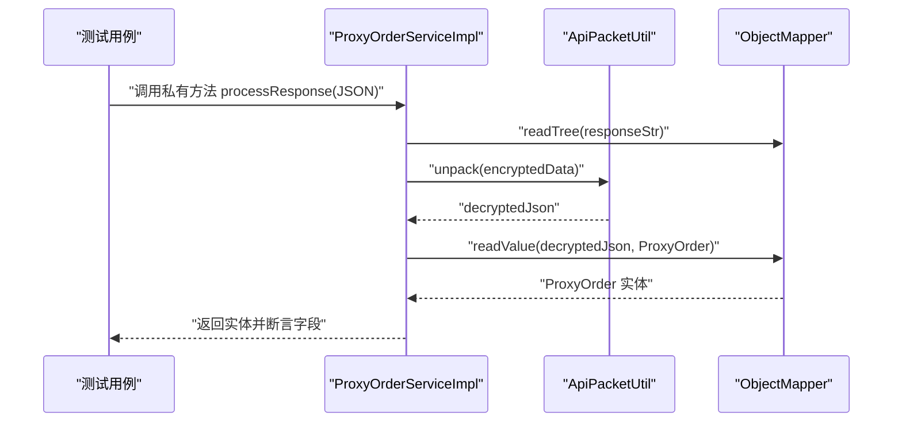
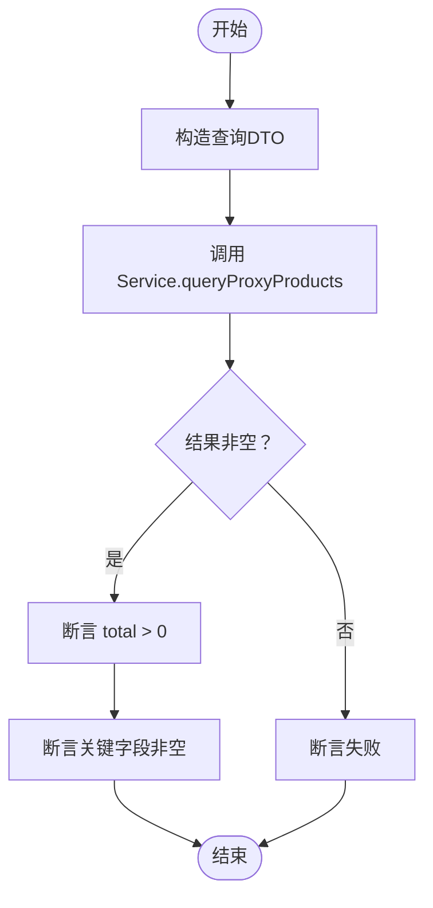
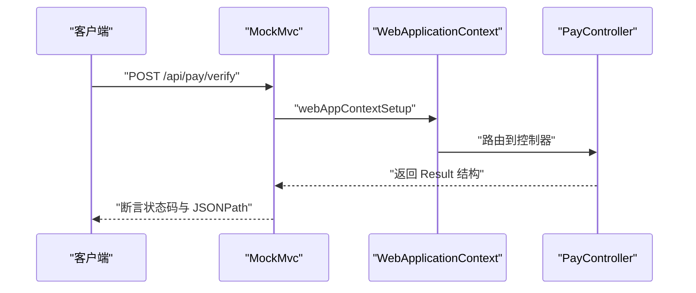
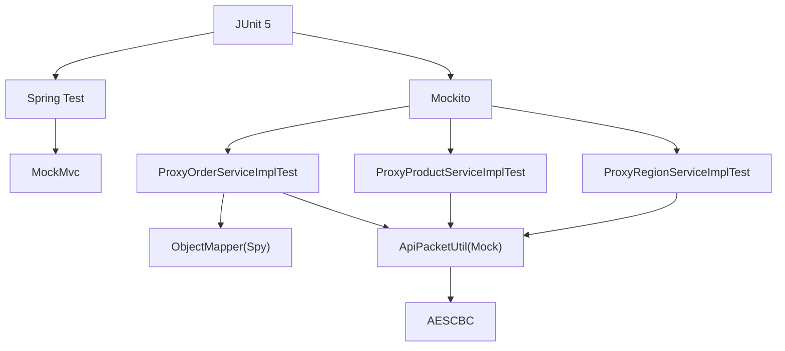

# 单元测试

<cite>
**本文引用的文件**
- [ProxyOrderServiceImplTest.java](file://src/test/java/cn/linkfast/service/Impl/ProxyOrderServiceImplTest.java)
- [ProxyProductServiceImplTest.java](file://src/test/java/cn/linkfast/service/Impl/ProxyProductServiceImplTest.java)
- [ProxyRegionServiceImplTest.java](file://src/test/java/cn/linkfast/service/Impl/ProxyRegionServiceImplTest.java)
- [PayControllerTest.java](file://src/test/java/cn/linkfast/controller/PayControllerTest.java)
- [UserServiceTest.java](file://src/test/java/cn/linkfast/service/UserServiceTest.java)
- [ProxyProductDAOTest.java](file://src/test/java/cn/linkfast/dao/ProxyProductDAOTest.java)
- [AESCBCTest.java](file://src/test/java/cn/linkfast/utils/AESCBCTest.java)
- [logback-test.xml](file://src/test/resources/logback-test.xml)
- [test.properties](file://src/test/resources/test.properties)
- [ProxyOrderServiceImpl.java](file://src/main/java/cn/linkfast/service/impl/ProxyOrderServiceImpl.java)
- [ProxyProductServiceImpl.java](file://src/main/java/cn/linkfast/service/impl/ProxyProductServiceImpl.java)
- [ProxyProxyRegionServiceImpl.java](file://src/main/java/cn/linkfast/service/impl/ProxyProxyRegionServiceImpl.java)
- [ApiPacketUtil.java](file://src/main/java/cn/linkfast/utils/ApiPacketUtil.java)
- [AESCBC.java](file://src/main/java/cn/linkfast/utils/AESCBC.java)
</cite>

## 目录
1. [引言](#引言)
2. [项目结构](#项目结构)
3. [核心组件](#核心组件)
4. [架构总览](#架构总览)
5. [详细组件分析](#详细组件分析)
6. [依赖分析](#依赖分析)
7. [性能考虑](#性能考虑)
8. [故障排查指南](#故障排查指南)
9. [结论](#结论)
10. [附录](#附录)

## 引言
本文件面向 Link-Fast 项目的单元测试实践，系统性阐述测试策略、最佳实践与落地方法。重点覆盖以下方面：
- 使用 Mockito 进行依赖注入与打桩，结合 JUnit 5 注解组织测试；
- 使用反射工具测试私有方法与内部处理逻辑；
- 针对服务层核心业务（订单处理、区域管理、产品查询）设计测试用例；
- 设计原则：边界条件、异常处理、正常流程验证；
- 测试环境配置与模拟对象策略：ObjectMapper 的 Spy 模式、ApiPacketUtil 的打桩策略。

## 项目结构
测试相关模块分布于 src/test 下，按层次划分：
- controller：控制器层接口测试（MockMvc 驱动）
- service：服务层单元测试（Mockito + Spring 扩展）
- dao：DAO 层测试（Spring 上下文加载）
- utils：工具类测试（加解密、HTTP 工具等）

**图表来源**
- [PayControllerTest.java:1-89](file://src/test/java/cn/linkfast/controller/PayControllerTest.java#L1-L89)
- [ProxyOrderServiceImplTest.java:1-89](file://src/test/java/cn/linkfast/service/Impl/ProxyOrderServiceImplTest.java#L1-L89)
- [ProxyProductServiceImplTest.java:1-116](file://src/test/java/cn/linkfast/service/Impl/ProxyProductServiceImplTest.java#L1-L116)
- [ProxyRegionServiceImplTest.java:1-69](file://src/test/java/cn/linkfast/service/Impl/ProxyRegionServiceImplTest.java#L1-L69)
- [UserServiceTest.java:1-59](file://src/test/java/cn/linkfast/service/UserServiceTest.java#L1-L59)
- [ProxyProductDAOTest.java:1-95](file://src/test/java/cn/linkfast/dao/ProxyProductDAOTest.java#L1-L95)
- [AESCBCTest.java:1-78](file://src/test/java/cn/linkfast/utils/AESCBCTest.java#L1-L78)
- [logback-test.xml:1-49](file://src/test/resources/logback-test.xml#L1-L49)
- [test.properties:1-3](file://src/test/resources/test.properties#L1-L3)

**章节来源**
- [PayControllerTest.java:1-89](file://src/test/java/cn/linkfast/controller/PayControllerTest.java#L1-L89)
- [ProxyOrderServiceImplTest.java:1-89](file://src/test/java/cn/linkfast/service/Impl/ProxyOrderServiceImplTest.java#L1-L89)
- [ProxyProductServiceImplTest.java:1-116](file://src/test/java/cn/linkfast/service/Impl/ProxyProductServiceImplTest.java#L1-L116)
- [ProxyRegionServiceImplTest.java:1-69](file://src/test/java/cn/linkfast/service/Impl/ProxyRegionServiceImplTest.java#L1-L69)
- [UserServiceTest.java:1-59](file://src/test/java/cn/linkfast/service/UserServiceTest.java#L1-L59)
- [ProxyProductDAOTest.java:1-95](file://src/test/java/cn/linkfast/dao/ProxyProductDAOTest.java#L1-L95)
- [AESCBCTest.java:1-78](file://src/test/java/cn/linkfast/utils/AESCBCTest.java#L1-L78)
- [logback-test.xml:1-49](file://src/test/resources/logback-test.xml#L1-L49)
- [test.properties:1-3](file://src/test/resources/test.properties#L1-L3)

## 核心组件
- 服务层核心业务：
  - 订单服务：订单查询、购买、续费、释放、同步详情、响应处理与异常分支；
  - 产品服务：产品查询、产品同步、响应解密与列表解析；
  - 区域服务：区域树查询、区域同步、扁平化与父子关系回填；
- 工具类：
  - ApiPacketUtil：请求打包（版本、加密方式、appKey、reqId、params）、响应解包；
  - AESCBC：AES-CBC 加解密；
- 控制器层：
  - 支付密码校验接口的 HTTP 响应断言。

**章节来源**
- [ProxyOrderServiceImpl.java:1-820](file://src/main/java/cn/linkfast/service/impl/ProxyOrderServiceImpl.java#L1-L820)
- [ProxyProductServiceImpl.java:1-175](file://src/main/java/cn/linkfast/service/impl/ProxyProductServiceImpl.java#L1-L175)
- [ProxyProxyRegionServiceImpl.java:1-233](file://src/main/java/cn/linkfast/service/impl/ProxyProxyRegionServiceImpl.java#L1-L233)
- [ApiPacketUtil.java:1-103](file://src/main/java/cn/linkfast/utils/ApiPacketUtil.java#L1-L103)
- [AESCBC.java:1-36](file://src/main/java/cn/linkfast/utils/AESCBC.java#L1-L36)

## 架构总览
单元测试围绕“服务层 + 工具类 + 控制器层”的三层结构展开，采用 Mockito 注入与打桩、JUnit 5 扩展、Spring 上下文加载、MockMvc 驱动控制器测试。

**图表来源**
- [ProxyOrderServiceImplTest.java:1-89](file://src/test/java/cn/linkfast/service/Impl/ProxyOrderServiceImplTest.java#L1-L89)
- [ProxyProductServiceImplTest.java:1-116](file://src/test/java/cn/linkfast/service/Impl/ProxyProductServiceImplTest.java#L1-L116)
- [ProxyRegionServiceImplTest.java:1-69](file://src/test/java/cn/linkfast/service/Impl/ProxyRegionServiceImplTest.java#L1-L69)
- [PayControllerTest.java:1-89](file://src/test/java/cn/linkfast/controller/PayControllerTest.java#L1-L89)
- [ProxyOrderServiceImpl.java:1-820](file://src/main/java/cn/linkfast/service/impl/ProxyOrderServiceImpl.java#L1-L820)
- [ProxyProductServiceImpl.java:1-175](file://src/main/java/cn/linkfast/service/impl/ProxyProductServiceImpl.java#L1-L175)
- [ProxyProxyRegionServiceImpl.java:1-233](file://src/main/java/cn/linkfast/service/impl/ProxyProxyRegionServiceImpl.java#L1-L233)
- [ApiPacketUtil.java:1-103](file://src/main/java/cn/linkfast/utils/ApiPacketUtil.java#L1-L103)
- [AESCBC.java:1-36](file://src/main/java/cn/linkfast/utils/AESCBC.java#L1-L36)

## 详细组件分析

### 订单服务测试（ProxyOrderServiceImplTest）
- 目标：验证响应处理（processResponse）的 JSON 解析、字段映射、异常分支；验证私有方法通过反射调用；验证环境配置注入。
- 关键点：
  - 使用 @Mock 注入 DAO、ApiPacketUtil；
  - 使用 @Spy 注入 ObjectMapper 并进行 Spy 操作；
  - 使用 @InjectMocks 注入被测服务；
  - 使用 @BeforeEach 通过 ReflectionTestUtils 注入环境变量；
  - 使用 ReflectionTestUtils.invokeMethod 调用私有方法；
  - 使用 when(...).thenReturn(...) 打桩 ApiPacketUtil.unpack；
  - 断言字段映射与集合大小。

**图表来源**
- [ProxyOrderServiceImplTest.java:45-74](file://src/test/java/cn/linkfast/service/Impl/ProxyOrderServiceImplTest.java#L45-L74)
- [ProxyOrderServiceImpl.java:173-194](file://src/main/java/cn/linkfast/service/impl/ProxyOrderServiceImpl.java#L173-L194)
- [ApiPacketUtil.java:94-102](file://src/main/java/cn/linkfast/utils/ApiPacketUtil.java#L94-L102)

**章节来源**
- [ProxyOrderServiceImplTest.java:1-89](file://src/test/java/cn/linkfast/service/Impl/ProxyOrderServiceImplTest.java#L1-L89)
- [ProxyOrderServiceImpl.java:173-194](file://src/main/java/cn/linkfast/service/impl/ProxyOrderServiceImpl.java#L173-L194)

### 产品服务测试（ProxyProductServiceImplTest）
- 目标：验证产品查询与同步流程，覆盖 Spring 上下文加载、分页结果、VO 映射完整性。
- 关键点：
  - 使用 @ExtendWith(SpringExtension.class) + @ContextConfiguration 加载 AppConfig；
  - 构造 ProxyProductQueryDTO，调用 queryProxyProducts；
  - 断言 PageResult 非空、total 与 list 规模；
  - 同步流程可直接调用 syncProxyProducts 并断言返回值。

**图表来源**
- [ProxyProductServiceImplTest.java:32-115](file://src/test/java/cn/linkfast/service/Impl/ProxyProductServiceImplTest.java#L32-L115)
- [ProxyProductServiceImpl.java:122-141](file://src/main/java/cn/linkfast/service/impl/ProxyProductServiceImpl.java#L122-L141)

**章节来源**
- [ProxyProductServiceImplTest.java:1-116](file://src/test/java/cn/linkfast/service/Impl/ProxyProductServiceImplTest.java#L1-L116)
- [ProxyProductServiceImpl.java:122-141](file://src/main/java/cn/linkfast/service/impl/ProxyProductServiceImpl.java#L122-L141)

### 区域服务测试（ProxyRegionServiceImplTest）
- 目标：验证区域树查询（全部与指定 codes）的返回结构与 JSON 输出。
- 关键点：
  - 使用 @ContextConfiguration(AppConfig.class) 启动 Spring；
  - 调用 queryRegionTree(null) 与 queryRegionTree(List.of("US","CN"))；
  - 使用 ObjectMapper 输出缩进 JSON 便于人工核验。

**章节来源**
- [ProxyRegionServiceImplTest.java:1-69](file://src/test/java/cn/linkfast/service/Impl/ProxyRegionServiceImplTest.java#L1-L69)
- [ProxyProxyRegionServiceImpl.java:64-86](file://src/main/java/cn/linkfast/service/impl/ProxyProxyRegionServiceImpl.java#L64-L86)

### 控制器测试（PayControllerTest）
- 目标：验证支付密码校验接口的 HTTP 响应结构与字段值。
- 关键点：
  - 使用 @ContextConfiguration(AppConfig.class, WebMvcConfig.class) + @WebAppConfiguration；
  - 使用 MockMvc 构造 POST 请求，断言状态码与 JSONPath 字段。

**图表来源**
- [PayControllerTest.java:48-86](file://src/test/java/cn/linkfast/controller/PayControllerTest.java#L48-L86)

**章节来源**
- [PayControllerTest.java:1-89](file://src/test/java/cn/linkfast/controller/PayControllerTest.java#L1-L89)

### 用户服务测试（UserServiceTest）
- 目标：演示基于 Mockito 的接口级测试，验证 findUserById 与 createUser 的行为与断言。
- 关键点：
  - 使用 @Mock 创建 UserService 的模拟对象；
  - 使用 when(...).thenReturn(...) 配置行为；
  - 使用 verify(...) 校验调用。

**章节来源**
- [UserServiceTest.java:1-59](file://src/test/java/cn/linkfast/service/UserServiceTest.java#L1-L59)

### DAO 层测试（ProxyProductDAOTest）
- 目标：验证根据 productNo 查询产品并断言字段（尤其是 retailPrice 非空）。
- 关键点：
  - 使用 @ContextConfiguration(AppConfig.class)；
  - 查询实体并打印属性，断言 retailPrice 非空且为 0。

**章节来源**
- [ProxyProductDAOTest.java:1-95](file://src/test/java/cn/linkfast/dao/ProxyProductDAOTest.java#L1-L95)

### 工具类测试（AESCBCTest）
- 目标：验证 AES-CBC 加解密、不同输入数据、非法 key/iv 参数抛出异常。
- 关键点：
  - 测试 encryptCBC/decryptCBC 正反向一致性；
  - 测试多种输入（中文、特殊字符、空串）；
  - 测试非法 key/iv 长度抛出异常。

**章节来源**
- [AESCBCTest.java:1-78](file://src/test/java/cn/linkfast/utils/AESCBCTest.java#L1-L78)
- [AESCBC.java:19-36](file://src/main/java/cn/linkfast/utils/AESCBC.java#L19-L36)

## 依赖分析
- 测试框架：JUnit 5 + Mockito + Spring Test + MockMvc；
- 服务层依赖工具类：ApiPacketUtil（打包/解包）、ObjectMapper（JSON 解析）；
- 控制器层依赖 Web 配置与 Spring 上下文；
- 日志与配置：logback-test.xml 输出到系统临时目录；test.properties 关闭定时任务。

**图表来源**
- [ProxyOrderServiceImplTest.java:1-89](file://src/test/java/cn/linkfast/service/Impl/ProxyOrderServiceImplTest.java#L1-L89)
- [ProxyProductServiceImplTest.java:1-116](file://src/test/java/cn/linkfast/service/Impl/ProxyProductServiceImplTest.java#L1-L116)
- [ProxyRegionServiceImplTest.java:1-69](file://src/test/java/cn/linkfast/service/Impl/ProxyRegionServiceImplTest.java#L1-L69)
- [ApiPacketUtil.java:1-103](file://src/main/java/cn/linkfast/utils/ApiPacketUtil.java#L1-L103)
- [AESCBC.java:1-36](file://src/main/java/cn/linkfast/utils/AESCBC.java#L1-L36)

**章节来源**
- [logback-test.xml:1-49](file://src/test/resources/logback-test.xml#L1-L49)
- [test.properties:1-3](file://src/test/resources/test.properties#L1-L3)

## 性能考虑
- 使用 Spy 模式替代真实 ObjectMapper 实例，减少 JSON 解析开销；
- 在服务层使用 @PostConstruct 初始化 baseUrl，避免每次测试重复计算；
- 控制器测试使用 MockMvc，避免启动完整容器，提升执行效率；
- DAO 测试在内存数据库或受控环境中运行，避免真实 DB 干扰。

## 故障排查指南
- 日志定位：测试日志输出至系统临时目录，便于快速定位问题；
- 配置项：确保 test.properties 中 task.product-sync.enabled=false，避免定时任务干扰；
- 响应异常：当第三方 API 返回非 200 或 data 缺失/为空时，服务层抛出业务异常，需检查 ApiPacketUtil 打包与解包逻辑；
- 私有方法测试：通过 ReflectionTestUtils.invokeMethod 调用，若断言失败，优先检查打桩与输入数据构造。

**章节来源**
- [logback-test.xml:1-49](file://src/test/resources/logback-test.xml#L1-L49)
- [test.properties:1-3](file://src/test/resources/test.properties#L1-L3)
- [ProxyOrderServiceImpl.java:173-194](file://src/main/java/cn/linkfast/service/impl/ProxyOrderServiceImpl.java#L173-L194)
- [ProxyProductServiceImpl.java:156-172](file://src/main/java/cn/linkfast/service/impl/ProxyProductServiceImpl.java#L156-L172)
- [ProxyProxyRegionServiceImpl.java:159-177](file://src/main/java/cn/linkfast/service/impl/ProxyProxyRegionServiceImpl.java#L159-L177)

## 结论
本项目单元测试体系以 Mockito 为核心，结合 JUnit 5 与 Spring 扩展，覆盖服务层、工具类与控制器层的关键业务路径。通过 Spy 模式与反射工具，有效测试私有方法与复杂数据转换逻辑；通过合理的断言与异常分支覆盖，保障核心功能的稳定性与可靠性。

## 附录
- 测试用例设计原则
  - 正常流程：构造合理输入，断言输出结构与关键字段；
  - 边界条件：空字符串、null、空集合、零值；
  - 异常分支：非 200、data 缺失/为空、解密失败、非法参数；
  - 私有方法：通过反射调用并断言内部状态；
  - 控制器：使用 MockMvc 断言 HTTP 状态与 JSONPath 字段。