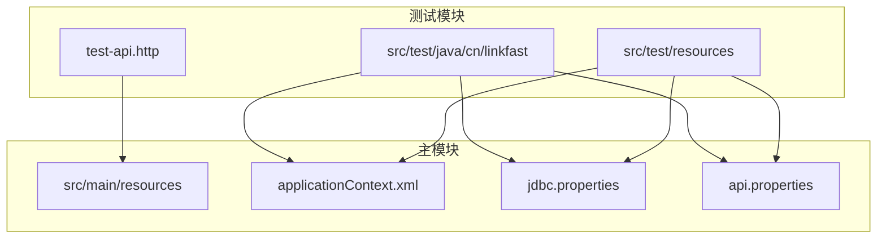
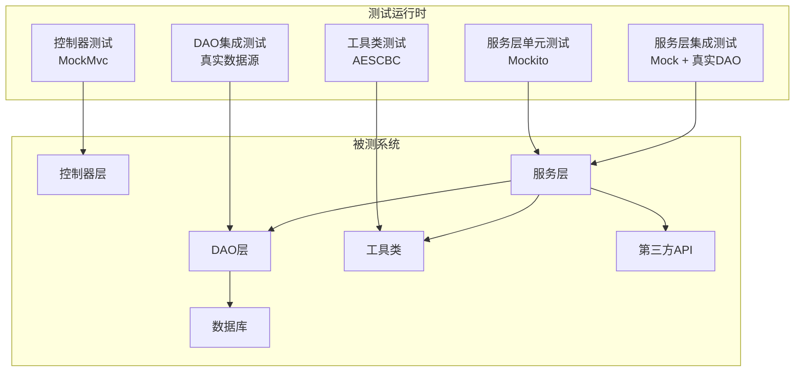
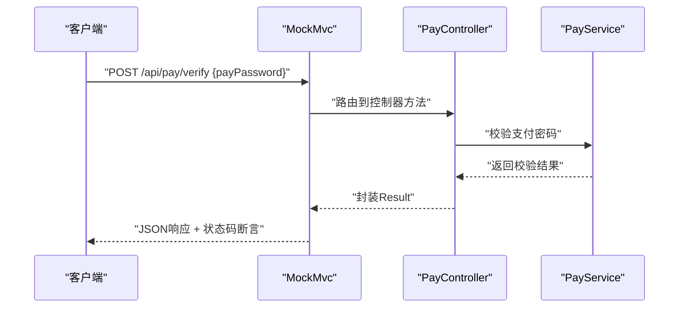
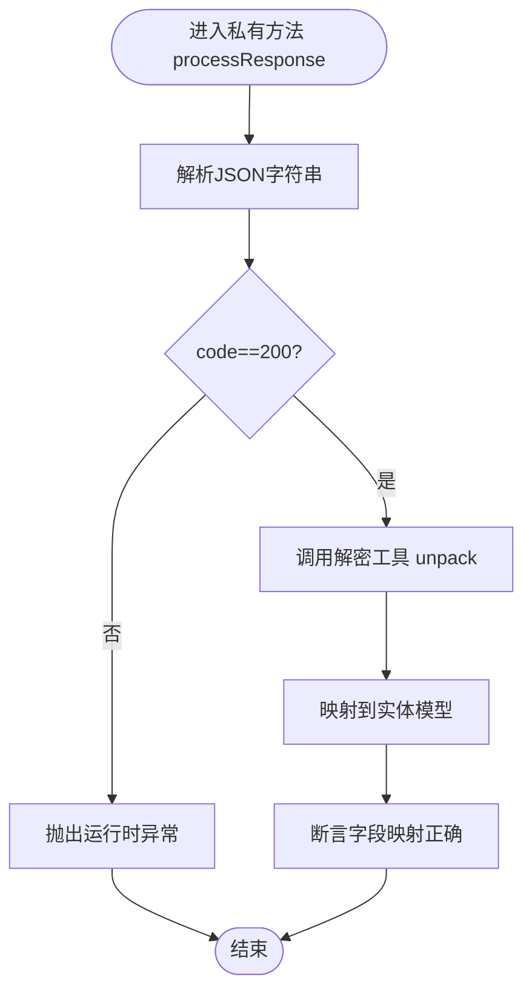
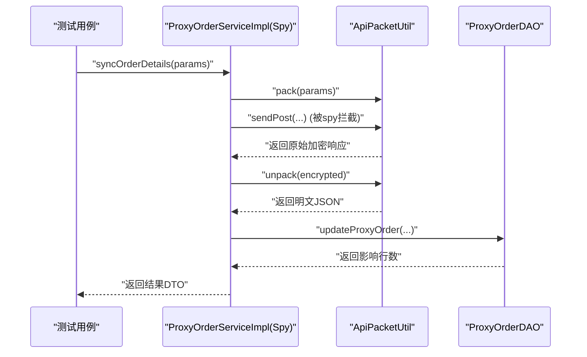
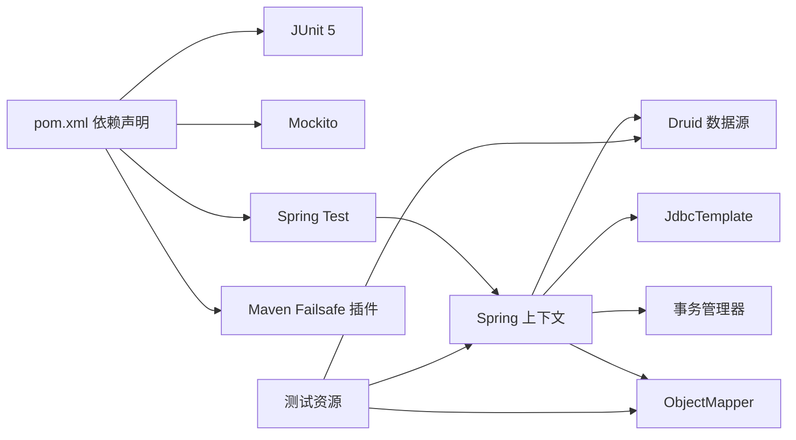

# 测试策略

<cite>
**本文引用的文件**   
- [pom.xml](file://pom.xml)
- [PayControllerTest.java](file://src/test/java/cn/linkfast/controller/PayControllerTest.java)
- [ProxyOrderServiceImplTest.java](file://src/test/java/cn/linkfast/service/Impl/ProxyOrderServiceImplTest.java)
- [ProxyProductDAOTest.java](file://src/test/java/cn/linkfast/dao/ProxyProductDAOTest.java)
- [ProxyOrderIT.java](file://src/test/java/cn/linkfast/service/Impl/ProxyOrderIT.java)
- [ProxyRegionIT.java](file://src/test/java/cn/linkfast/service/Impl/ProxyRegionIT.java)
- [AESCBCTest.java](file://src/test/java/cn/linkfast/utils/AESCBCTest.java)
- [test.properties](file://src/test/resources/test.properties)
- [logback-test.xml](file://src/test/resources/logback-test.xml)
- [applicationContext.xml](file://src/main/resources/applicationContext.xml)
- [jdbc.properties](file://src/main/resources/jdbc.properties)
- [api.properties](file://src/main/resources/api.properties)
- [test-api.http](file://test-api.http)
- [SimpleTest.java](file://src/test/java/cn/linkfast/SimpleTest.java)
</cite>

## 目录
1. [简介](#简介)
2. [项目结构](#项目结构)
3. [核心组件](#核心组件)
4. [架构总览](#架构总览)
5. [详细组件分析](#详细组件分析)
6. [依赖分析](#依赖分析)
7. [性能考虑](#性能考虑)
8. [故障排查指南](#故障排查指南)
9. [结论](#结论)
10. [附录](#附录)

## 简介
本测试策略文档面向 Link-Fast 项目，系统化梳理单元测试、集成测试与端到端测试的实施策略，明确测试框架选择与配置（JUnit 5、Mockito、MockMvc、Spring Test），给出测试用例设计原则、覆盖率目标与测试数据管理方案，并结合现有测试样例，展示如何测试控制器、服务层与数据访问层。同时，文档覆盖测试环境搭建、测试数据库使用、测试数据准备、性能测试、安全测试与回归测试最佳实践，并提供 TDD 指导与持续集成配置建议。

## 项目结构
项目采用 Maven 多模块风格组织，测试代码位于 src/test 下，按包划分控制器、服务、DAO、工具等层次，配合 Spring 上下文与资源文件完成测试环境初始化。

图表来源
- [applicationContext.xml:14-67](file://src/main/resources/applicationContext.xml#L14-L67)
- [jdbc.properties:1-39](file://src/main/resources/jdbc.properties#L1-L39)
- [api.properties:1-31](file://src/main/resources/api.properties#L1-L31)

章节来源
- [pom.xml:12-213](file://pom.xml#L12-L213)
- [applicationContext.xml:14-67](file://src/main/resources/applicationContext.xml#L14-L67)
- [jdbc.properties:1-39](file://src/main/resources/jdbc.properties#L1-L39)
- [api.properties:1-31](file://src/main/resources/api.properties#L1-L31)

## 核心组件
- 测试框架与工具
  - JUnit 5：用于单元测试与集成测试的断言与生命周期控制
  - Mockito：用于服务层与工具类的桩件与行为验证
  - Spring Test + MockMvc：用于控制器层的端到端测试（无真实容器启动）
  - Hamcrest + JsonPath：用于响应断言
  - Failsafe 插件：用于集成测试阶段的执行与报告
- 测试资源配置
  - test.properties：测试专用开关（如关闭定时任务）
  - logback-test.xml：测试日志输出到系统临时目录，避免污染生产日志
  - applicationContext.xml：加载数据源、JdbcTemplate、事务管理器
  - jdbc.properties：数据库连接参数
  - api.properties：第三方接口环境变量与路径配置

章节来源
- [pom.xml:153-205](file://pom.xml#L153-L205)
- [test.properties:1-3](file://src/test/resources/test.properties#L1-L3)
- [logback-test.xml:1-49](file://src/test/resources/logback-test.xml#L1-L49)
- [applicationContext.xml:14-67](file://src/main/resources/applicationContext.xml#L14-L67)
- [jdbc.properties:1-39](file://src/main/resources/jdbc.properties#L1-L39)
- [api.properties:1-31](file://src/main/resources/api.properties#L1-L31)

## 架构总览
测试体系分层清晰：控制器层使用 MockMvc 发起请求并断言响应；服务层通过 Mockito 构造桩件与 Spy，隔离外部依赖；DAO 层在集成测试中使用真实数据源与 SQL 执行，确保持久化逻辑正确性；工具类独立单元测试保障加密解密等关键能力。

图表来源
- [PayControllerTest.java:30-46](file://src/test/java/cn/linkfast/controller/PayControllerTest.java#L30-L46)
- [ProxyOrderServiceImplTest.java:23-43](file://src/test/java/cn/linkfast/service/Impl/ProxyOrderServiceImplTest.java#L23-L43)
- [ProxyOrderIT.java:34-66](file://src/test/java/cn/linkfast/service/Impl/ProxyOrderIT.java#L34-L66)
- [ProxyProductDAOTest.java:14-20](file://src/test/java/cn/linkfast/dao/ProxyProductDAOTest.java#L14-L20)
- [AESCBCTest.java:13-35](file://src/test/java/cn/linkfast/utils/AESCBCTest.java#L13-L35)

## 详细组件分析

### 控制器层测试策略
- 目标：验证控制器对请求的解析、参数校验、业务调度与响应格式一致性
- 工具：MockMvc + Spring Test + JUnit 5 + Hamcrest + JsonPath
- 关键点：
  - 使用 WebAppConfiguration 与 @ContextConfiguration 加载 Web 层配置
  - 通过 MockMvc 构造请求体与 JSON 响应断言
  - 针对不同输入场景（正确/错误）编写用例，覆盖状态码与 JSON 字段
- 示例参考：
  - 支付密码校验接口测试：[PayControllerTest.java:52-86](file://src/test/java/cn/linkfast/controller/PayControllerTest.java#L52-L86)

图表来源
- [PayControllerTest.java:52-86](file://src/test/java/cn/linkfast/controller/PayControllerTest.java#L52-L86)

章节来源
- [PayControllerTest.java:30-86](file://src/test/java/cn/linkfast/controller/PayControllerTest.java#L30-L86)

### 服务层单元测试策略
- 目标：隔离外部依赖，验证复杂业务逻辑与边界条件
- 工具：Mockito（@Mock/@Spy/@InjectMocks）、JUnit 5、ReflectionTestUtils
- 关键点：
  - 使用 @ExtendWith(MockitoExtension.class) 启用 Mockito
  - 通过 @Spy 对真实对象进行部分打桩，保留真实行为
  - 使用 @Mock 对 DAO、工具类等外部依赖进行打桩
  - 使用 ReflectionTestUtils 设置 @Value 注入的环境变量
  - 私有方法通过反射调用并断言
- 示例参考：
  - 订单响应解析与异常处理：[ProxyOrderServiceImplTest.java:45-88](file://src/test/java/cn/linkfast/service/Impl/ProxyOrderServiceImplTest.java#L45-L88)

图表来源
- [ProxyOrderServiceImplTest.java:45-88](file://src/test/java/cn/linkfast/service/Impl/ProxyOrderServiceImplTest.java#L45-L88)

章节来源
- [ProxyOrderServiceImplTest.java:23-88](file://src/test/java/cn/linkfast/service/Impl/ProxyOrderServiceImplTest.java#L23-L88)

### 服务层集成测试策略
- 目标：在真实数据源与真实 DAO 上验证业务流程端到端执行
- 工具：Spring Test + @ContextConfiguration + Mockito（部分打桩）
- 关键点：
  - 通过 @ContextConfiguration 加载 AppConfig，注入真实 DAO 与 ObjectMapper
  - 使用 spy 包装真实 Service，拦截网络请求（sendPost）与打包（pack），以真实 SQL 执行持久化
  - 验证主表与子表更新行数，确保 ON DUPLICATE KEY UPDATE 正常工作
- 示例参考：
  - 订单同步与持久化：[ProxyOrderIT.java:68-177](file://src/test/java/cn/linkfast/service/Impl/ProxyOrderIT.java#L68-L177)

图表来源
- [ProxyOrderIT.java:145-163](file://src/test/java/cn/linkfast/service/Impl/ProxyOrderIT.java#L145-L163)

章节来源
- [ProxyOrderIT.java:34-177](file://src/test/java/cn/linkfast/service/Impl/ProxyOrderIT.java#L34-L177)

### DAO 层集成测试策略
- 目标：验证 SQL 执行、字段映射与数据库一致性
- 工具：Spring Test + @ContextConfiguration(AppConfig) + JdbcTemplate
- 关键点：
  - 通过真实数据源执行查询，断言字段值（如 retailPrice）
  - 输出实体属性清单，便于回归验证
- 示例参考：
  - 产品查询与字段断言：[ProxyProductDAOTest.java:21-92](file://src/test/java/cn/linkfast/dao/ProxyProductDAOTest.java#L21-L92)

章节来源
- [ProxyProductDAOTest.java:14-92](file://src/test/java/cn/linkfast/dao/ProxyProductDAOTest.java#L14-L92)

### 工具类测试策略
- 目标：验证加密解密、边界条件与异常场景
- 工具：JUnit 5
- 关键点：
  - 覆盖不同长度与字符集的数据
  - 验证非法 key/iv 长度触发的异常
- 示例参考：
  - AES-CBC 加解密：[AESCBCTest.java:15-77](file://src/test/java/cn/linkfast/utils/AESCBCTest.java#L15-L77)

章节来源
- [AESCBCTest.java:13-77](file://src/test/java/cn/linkfast/utils/AESCBCTest.java#L13-L77)

### 地区树同步集成测试
- 目标：验证真实第三方 API 调用与数据库批量写入
- 工具：Spring Test + @ContextConfiguration + JdbcTemplate + @Timeout
- 关键点：
  - 支持全量与按 codes 同步两种模式
  - 不使用 @Transactional，数据持久化后不回滚
  - 提供超时控制，避免长时间阻塞
- 示例参考：
  - 地区树同步：[ProxyRegionIT.java:48-85](file://src/test/java/cn/linkfast/service/Impl/ProxyRegionIT.java#L48-L85)

章节来源
- [ProxyRegionIT.java:22-85](file://src/test/java/cn/linkfast/service/Impl/ProxyRegionIT.java#L22-L85)

## 依赖分析
- 测试框架与工具依赖集中在 pom.xml 中，包含 JUnit 5、Mockito、Hamcrest、JsonPath 以及集成测试插件 failsafe
- 测试运行时通过 Spring 上下文加载数据源、JdbcTemplate、事务管理器与 ObjectMapper
- 测试资源通过 property-placeholder 引入 test.properties、jdbc.properties、api.properties

图表来源
- [pom.xml:22-213](file://pom.xml#L22-L213)
- [applicationContext.xml:14-67](file://src/main/resources/applicationContext.xml#L14-L67)

章节来源
- [pom.xml:22-213](file://pom.xml#L22-L213)
- [applicationContext.xml:14-67](file://src/main/resources/applicationContext.xml#L14-L67)

## 性能考虑
- 单元测试
  - 使用 @Spy 与 @Mock 避免真实网络与数据库 IO，提升执行速度
  - 对热点方法进行边界与异常分支覆盖，减少无效用例
- 集成测试
  - 合理设置超时（@Timeout），避免长时间阻塞
  - 对批量写入场景（如地区树同步）关注 MySQL 连接与超时参数
- 日志
  - 测试日志输出至系统临时目录，避免磁盘 IO 压力过大
- 并发与稳定性
  - 使用 Druid 连接池参数（最小空闲、最大活跃、空闲回收周期）保障并发稳定性
  - 对第三方接口调用增加重试与熔断策略（在服务层实现）

## 故障排查指南
- 数据库连接问题
  - 使用 SimpleTest 验证 JDBC URL、用户名与密码
  - 检查 jdbc.properties 中的连接参数与网络可达性
- 测试日志定位
  - 查看 logback-test.xml 配置的日志文件位置，定位异常堆栈
- 集成测试失败
  - 检查 api.properties 中的环境变量与第三方接口路径
  - 对于地区树同步，确认第三方接口可访问与数据库写权限
- 资源加载
  - 确认 test.properties、jdbc.properties、api.properties 已被 Spring 正确加载

章节来源
- [SimpleTest.java:7-26](file://src/test/java/cn/linkfast/SimpleTest.java#L7-L26)
- [logback-test.xml:1-49](file://src/test/resources/logback-test.xml#L1-L49)
- [jdbc.properties:1-39](file://src/main/resources/jdbc.properties#L1-L39)
- [api.properties:1-31](file://src/main/resources/api.properties#L1-L31)

## 结论
本测试策略基于现有测试样例，明确了控制器、服务与 DAO 的测试边界与方法，结合 Mockito 与 Spring Test 构建了高效稳定的测试体系。建议在后续迭代中补充端到端测试（如使用 Testcontainers 启动真实容器）、完善覆盖率统计与回归测试基线，并在 CI 中引入性能与安全扫描，持续提升质量与交付效率。

## 附录

### 测试用例设计原则
- 单一职责：每个用例聚焦一个行为或边界条件
- 可重复性：用例不依赖外部状态，必要时使用桩件或测试数据库
- 可读性：命名清晰、断言明确、步骤分层
- 覆盖率目标：关键业务路径达到 80%+，核心工具类接近 100%

### 测试数据管理
- 测试数据准备
  - 使用测试数据库或内存数据库（如 H2）进行隔离
  - 对于真实数据库，采用只读快照或受控种子数据
- 数据清理
  - 非事务集成测试不回滚，需在测试后清理或使用唯一标识
- 环境隔离
  - 通过 test.properties 切换功能开关（如定时任务）
  - 通过 api.properties 切换 sandbox/prod 环境

### 端到端测试建议
- 使用 Postman/Newman 或 curl 脚本验证真实 API
- 使用 test-api.http 编写接口用例，结合断言与环境变量
- 在 CI 中加入端到端脚本，确保部署后关键路径可用

### 性能测试与安全测试
- 性能测试
  - 使用 JMH 或 Gatling 对热点服务方法进行微基准测试
  - 集成测试中记录关键步骤耗时，识别瓶颈
- 安全测试
  - 对控制器层输入参数进行注入与越权测试
  - 对工具类（加密）进行强度与边界测试

### 回归测试最佳实践
- 建立“冒烟用例”集合，每次发布前快速验证核心路径
- 对 DAO 层字段映射与 SQL 执行建立回归用例
- 对第三方接口变更建立变更通知与回归用例

### 测试驱动开发（TDD）指导
- 先写失败用例，再实现最小可行代码
- 优先覆盖边界与异常场景
- 用例驱动设计，逐步重构与优化

### 持续集成（CI）配置建议
- Maven 生命周期
  - 单元测试：mvn test
  - 集成测试：mvn verify（由 failsafe 插件执行）
- 环境准备
  - 提前拉起测试数据库，暴露端口与凭据
  - 配置 api.properties 与 jdbc.properties 的 CI 变量
- 报告与覆盖率
  - 生成 Surefire/Failsafe 报告
  - 集成 JaCoCo 生成覆盖率报告并设置阈值

章节来源
- [test-api.http:1-3](file://test-api.http#L1-L3)
- [pom.xml:252-274](file://pom.xml#L252-L274)