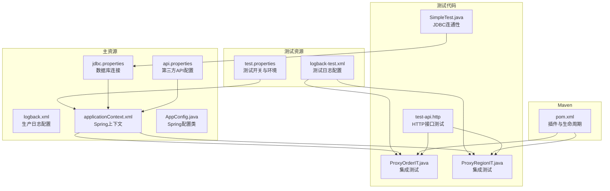
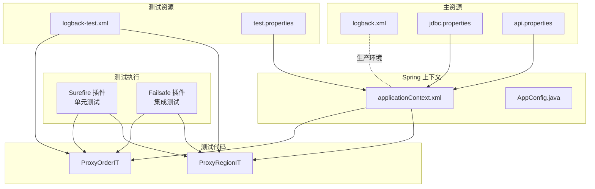
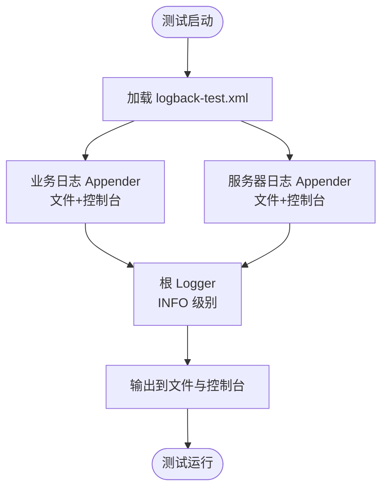
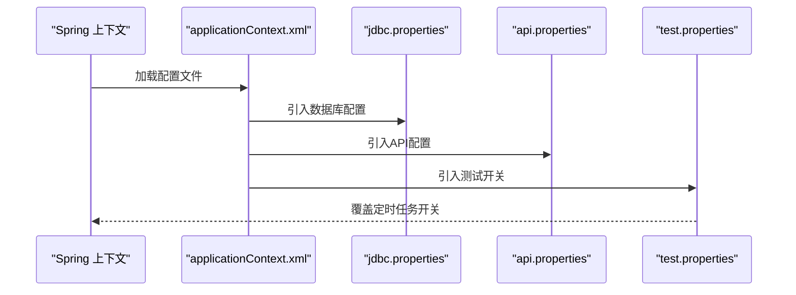
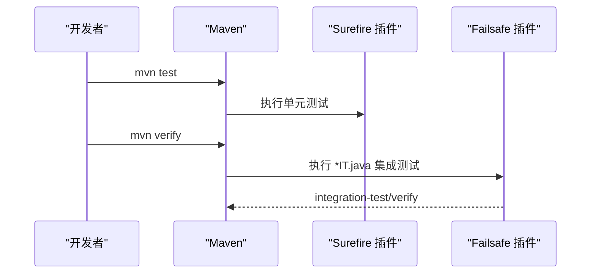
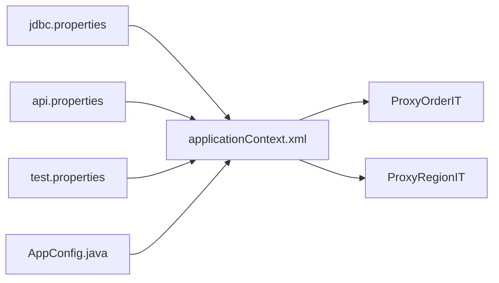

# 测试配置

<cite>
**本文引用的文件**
- [src/test/resources/logback-test.xml](file://src/test/resources/logback-test.xml)
- [src/main/resources/logback.xml](file://src/main/resources/logback.xml)
- [src/test/resources/test.properties](file://src/test/resources/test.properties)
- [src/main/resources/jdbc.properties](file://src/main/resources/jdbc.properties)
- [src/main/resources/api.properties](file://src/main/resources/api.properties)
- [src/main/resources/applicationContext.xml](file://src/main/resources/applicationContext.xml)
- [src/main/java/cn/linkfast/config/AppConfig.java](file://src/main/java/cn/linkfast/config/AppConfig.java)
- [pom.xml](file://pom.xml)
- [src/test/java/cn/linkfast/service/impl/ProxyOrderIT.java](file://src/test/java/cn/linkfast/service/impl/ProxyOrderIT.java)
- [src/test/java/cn/linkfast/service/impl/ProxyRegionIT.java](file://src/test/java/cn/linkfast/service/impl/ProxyRegionIT.java)
- [test-api.http](file://test-api.http)
- [src/test/java/cn/linkfast/SimpleTest.java](file://src/test/java/cn/linkfast/SimpleTest.java)
</cite>

## 目录
1. [简介](#简介)
2. [项目结构](#项目结构)
3. [核心组件](#核心组件)
4. [架构总览](#架构总览)
5. [详细组件分析](#详细组件分析)
6. [依赖分析](#依赖分析)
7. [性能考虑](#性能考虑)
8. [故障排查指南](#故障排查指南)
9. [结论](#结论)
10. [附录](#附录)

## 简介
本文件面向 Link-Fast 项目的测试配置与运行，系统性阐述测试环境的配置与管理，覆盖以下方面：
- Logback 测试配置：日志级别、输出格式、文件路径与滚动策略
- 测试属性文件：数据库连接、API 端点、测试开关等
- Maven 测试插件：单元测试与集成测试的生命周期与执行目标
- 测试运行命令与参数：Maven 生命周期与 IDE 执行建议
- 测试覆盖率与 CI 建议：覆盖率生成与持续集成中的测试配置思路

## 项目结构
测试相关的关键位置与职责：
- 测试日志配置：src/test/resources/logback-test.xml
- 测试属性文件：src/test/resources/test.properties
- 生产日志配置：src/main/resources/logback.xml
- 数据库与 API 配置：src/main/resources/jdbc.properties、src/main/resources/api.properties
- Spring 测试上下文：src/main/resources/applicationContext.xml、src/main/java/cn/linkfast/config/AppConfig.java
- Maven 插件与生命周期：pom.xml
- 集成测试示例：src/test/java/cn/linkfast/service/impl/ProxyOrderIT.java、src/test/java/cn/linkfast/service/impl/ProxyRegionIT.java
- 接口测试示例：test-api.http
- 简单 JDBC 连通性测试：src/test/java/cn/linkfast/SimpleTest.java

图表来源
- [src/test/resources/logback-test.xml:1-49](file://src/test/resources/logback-test.xml#L1-L49)
- [src/test/resources/test.properties:1-3](file://src/test/resources/test.properties#L1-L3)
- [src/main/resources/logback.xml:1-49](file://src/main/resources/logback.xml#L1-L49)
- [src/main/resources/jdbc.properties:1-39](file://src/main/resources/jdbc.properties#L1-L39)
- [src/main/resources/api.properties:1-31](file://src/main/resources/api.properties#L1-L31)
- [src/main/resources/applicationContext.xml:14-57](file://src/main/resources/applicationContext.xml#L14-L57)
- [src/main/java/cn/linkfast/config/AppConfig.java:24-36](file://src/main/java/cn/linkfast/config/AppConfig.java#L24-L36)
- [pom.xml:252-274](file://pom.xml#L252-L274)
- [src/test/java/cn/linkfast/service/impl/ProxyOrderIT.java:34-37](file://src/test/java/cn/linkfast/service/impl/ProxyOrderIT.java#L34-L37)
- [src/test/java/cn/linkfast/service/impl/ProxyRegionIT.java:37-40](file://src/test/java/cn/linkfast/service/impl/ProxyRegionIT.java#L37-L40)
- [test-api.http:1-3](file://test-api.http#L1-L3)
- [src/test/java/cn/linkfast/SimpleTest.java:1-27](file://src/test/java/cn/linkfast/SimpleTest.java#L1-L27)

章节来源
- [src/test/resources/logback-test.xml:1-49](file://src/test/resources/logback-test.xml#L1-L49)
- [src/test/resources/test.properties:1-3](file://src/test/resources/test.properties#L1-L3)
- [src/main/resources/logback.xml:1-49](file://src/main/resources/logback.xml#L1-L49)
- [src/main/resources/jdbc.properties:1-39](file://src/main/resources/jdbc.properties#L1-L39)
- [src/main/resources/api.properties:1-31](file://src/main/resources/api.properties#L1-L31)
- [src/main/resources/applicationContext.xml:14-57](file://src/main/resources/applicationContext.xml#L14-L57)
- [src/main/java/cn/linkfast/config/AppConfig.java:24-36](file://src/main/java/cn/linkfast/config/AppConfig.java#L24-L36)
- [pom.xml:252-274](file://pom.xml#L252-L274)
- [src/test/java/cn/linkfast/service/impl/ProxyOrderIT.java:34-37](file://src/test/java/cn/linkfast/service/impl/ProxyOrderIT.java#L34-L37)
- [src/test/java/cn/linkfast/service/impl/ProxyRegionIT.java:37-40](file://src/test/java/cn/linkfast/service/impl/ProxyRegionIT.java#L37-L40)
- [test-api.http:1-3](file://test-api.http#L1-L3)
- [src/test/java/cn/linkfast/SimpleTest.java:1-27](file://src/test/java/cn/linkfast/SimpleTest.java#L1-L27)

## 核心组件
- 测试日志配置（Logback）
  - 测试专用配置文件位于 src/test/resources/logback-test.xml，优先于主资源生效，便于在测试期间输出到系统临时目录，避免污染生产日志路径。
  - 配置包含业务日志、服务器日志与控制台输出三路 Appender，并分别针对 cn.linkfast 包与根 Logger 设置输出策略。
  - 文件滚动采用基于日期的时间滚动策略，保留历史天数可配置。

- 测试属性文件（test.properties）
  - 用于在测试环境中关闭定时任务，避免测试过程中自动触发产品同步等后台任务，确保测试稳定性与可重复性。

- 数据库与 API 配置（jdbc.properties、api.properties）
  - 数据库连接：包含驱动、URL、用户名、密码以及连接池参数样例，便于在测试中复用或覆盖。
  - API 配置：包含环境选择（sandbox/prod）、基础 URL、应用密钥与各接口路径，供集成测试访问第三方服务。

- Spring 测试上下文（applicationContext.xml、AppConfig.java）
  - 通过 property-placeholder 引入 jdbc.properties、api.properties 与 test.properties，统一管理配置。
  - AppConfig 暴露 ObjectMapper 等 Bean，供测试与业务共享。

- Maven 测试插件（pom.xml）
  - maven-surefire-plugin：执行单元测试（默认生命周期阶段 test）。
  - maven-failsafe-plugin：执行集成测试（以 *IT.java 结尾），支持集成测试的“integration-test”和“verify”阶段。

章节来源
- [src/test/resources/logback-test.xml:1-49](file://src/test/resources/logback-test.xml#L1-L49)
- [src/test/resources/test.properties:1-3](file://src/test/resources/test.properties#L1-L3)
- [src/main/resources/jdbc.properties:1-39](file://src/main/resources/jdbc.properties#L1-L39)
- [src/main/resources/api.properties:1-31](file://src/main/resources/api.properties#L1-L31)
- [src/main/resources/applicationContext.xml:14-57](file://src/main/resources/applicationContext.xml#L14-L57)
- [src/main/java/cn/linkfast/config/AppConfig.java:24-36](file://src/main/java/cn/linkfast/config/AppConfig.java#L24-L36)
- [pom.xml:252-274](file://pom.xml#L252-L274)

## 架构总览
测试配置的整体交互关系如下：

图表来源
- [pom.xml:252-274](file://pom.xml#L252-L274)
- [src/test/resources/logback-test.xml:1-49](file://src/test/resources/logback-test.xml#L1-L49)
- [src/test/resources/test.properties:1-3](file://src/test/resources/test.properties#L1-L3)
- [src/main/resources/logback.xml:1-49](file://src/main/resources/logback.xml#L1-L49)
- [src/main/resources/jdbc.properties:1-39](file://src/main/resources/jdbc.properties#L1-L39)
- [src/main/resources/api.properties:1-31](file://src/main/resources/api.properties#L1-L31)
- [src/main/resources/applicationContext.xml:14-57](file://src/main/resources/applicationContext.xml#L14-L57)
- [src/main/java/cn/linkfast/config/AppConfig.java:24-36](file://src/main/java/cn/linkfast/config/AppConfig.java#L24-L36)
- [src/test/java/cn/linkfast/service/impl/ProxyOrderIT.java:34-37](file://src/test/java/cn/linkfast/service/impl/ProxyOrderIT.java#L34-L37)
- [src/test/java/cn/linkfast/service/impl/ProxyRegionIT.java:37-40](file://src/test/java/cn/linkfast/service/impl/ProxyRegionIT.java#L37-L40)

## 详细组件分析

### 测试日志配置（Logback）
- 输出目标
  - 业务日志：输出到独立文件与控制台，便于聚焦业务层日志。
  - 服务器/框架日志：输出到独立文件与控制台，便于区分框架与业务日志。
  - 控制台输出：统一格式化输出，便于在终端查看。
- 文件路径与滚动
  - 测试日志路径使用系统临时目录，避免与生产日志冲突。
  - 采用按日滚动策略，保留最近若干天的日志文件。
- 日志级别
  - 业务包（cn.linkfast）与根 Logger 均设置为 INFO，兼顾可读性与性能。

图表来源
- [src/test/resources/logback-test.xml:6-47](file://src/test/resources/logback-test.xml#L6-L47)

章节来源
- [src/test/resources/logback-test.xml:1-49](file://src/test/resources/logback-test.xml#L1-L49)

### 测试属性文件（test.properties）
- 作用
  - 在测试环境中关闭定时任务，避免产品数据自动同步，减少测试不确定性。
- 影响范围
  - 通过 Spring 的 property-placeholder 引入，影响所有基于该上下文的测试。

章节来源
- [src/test/resources/test.properties:1-3](file://src/test/resources/test.properties#L1-L3)
- [src/main/resources/applicationContext.xml:14-15](file://src/main/resources/applicationContext.xml#L14-L15)

### 数据库与 API 配置（jdbc.properties、api.properties）
- 数据库连接
  - 驱动、URL、用户名、密码等基础配置，同时提供连接池参数样例，便于在测试中按需调整。
- API 配置
  - 环境选择（sandbox/prod）、基础 URL、应用密钥与各接口路径，供集成测试访问第三方服务。
- Spring 加载顺序
  - 通过 property-placeholder 依次引入 jdbc.properties、api.properties、test.properties，后者可覆盖前者。

图表来源
- [src/main/resources/applicationContext.xml:14-15](file://src/main/resources/applicationContext.xml#L14-L15)
- [src/main/resources/jdbc.properties:1-39](file://src/main/resources/jdbc.properties#L1-L39)
- [src/main/resources/api.properties:1-31](file://src/main/resources/api.properties#L1-L31)
- [src/test/resources/test.properties:1-3](file://src/test/resources/test.properties#L1-L3)

章节来源
- [src/main/resources/jdbc.properties:1-39](file://src/main/resources/jdbc.properties#L1-L39)
- [src/main/resources/api.properties:1-31](file://src/main/resources/api.properties#L1-L31)
- [src/main/resources/applicationContext.xml:14-57](file://src/main/resources/applicationContext.xml#L14-L57)

### Maven 测试插件与生命周期
- Surefire 插件
  - 默认执行单元测试（阶段 test），适合快速反馈。
- Failsafe ugins
  - 执行集成测试（以 *IT.java 结尾），在“integration-test”和“verify”阶段运行，适合需要外部资源（数据库、网络）的测试。
- 跳过集成测试
  - 通过属性 skipITs 控制是否跳过集成测试。

图表来源
- [pom.xml:252-274](file://pom.xml#L252-L274)

章节来源
- [pom.xml:252-274](file://pom.xml#L252-L274)

### 集成测试示例与运行方式
- ProxyOrderIT
  - 加载 AppConfig 作为测试上下文，使用 Mockito Spy 与 Mock 工具，跳过真实网络请求，专注于数据库持久化逻辑。
- ProxyRegionIT
  - 真实请求第三方 API 并写入本地数据库，不使用事务回滚，适合验证真实链路。
- 运行方式
  - 命令行：mvn test（单元测试）、mvn verify（集成测试）
  - IDE：直接运行测试类或通过 Maven 生命周期执行

章节来源
- [src/test/java/cn/linkfast/service/impl/ProxyOrderIT.java:34-37](file://src/test/java/cn/linkfast/service/impl/ProxyOrderIT.java#L34-L37)
- [src/test/java/cn/linkfast/service/impl/ProxyRegionIT.java:37-40](file://src/test/java/cn/linkfast/service/impl/ProxyRegionIT.java#L37-L40)
- [pom.xml:252-274](file://pom.xml#L252-L274)

### 接口测试与数据库连通性
- test-api.http
  - 提供 HTTP 接口测试模板，可在 VS Code 中使用 REST Client 插件进行测试。
- SimpleTest.java
  - 简单 JDBC 连接测试，便于验证数据库连通性与凭据正确性。

章节来源
- [test-api.http:1-3](file://test-api.http#L1-L3)
- [src/test/java/cn/linkfast/SimpleTest.java:1-27](file://src/test/java/cn/linkfast/SimpleTest.java#L1-L27)

## 依赖分析
- 配置加载依赖
  - applicationContext.xml 通过 property-placeholder 引入 jdbc.properties、api.properties、test.properties，形成配置链路。
- 测试依赖
  - 集成测试类通过 @ContextConfiguration 加载 AppConfig，从而获得完整的 Spring 上下文（含数据源、事务管理器等）。

图表来源
- [src/main/resources/applicationContext.xml:14-15](file://src/main/resources/applicationContext.xml#L14-L15)
- [src/main/java/cn/linkfast/config/AppConfig.java:24-36](file://src/main/java/cn/linkfast/config/AppConfig.java#L24-L36)
- [src/test/java/cn/linkfast/service/impl/ProxyOrderIT.java:34-37](file://src/test/java/cn/linkfast/service/impl/ProxyOrderIT.java#L34-L37)
- [src/test/java/cn/linkfast/service/impl/ProxyRegionIT.java:37-40](file://src/test/java/cn/linkfast/service/impl/ProxyRegionIT.java#L37-L40)

章节来源
- [src/main/resources/applicationContext.xml:14-57](file://src/main/resources/applicationContext.xml#L14-L57)
- [src/main/java/cn/linkfast/config/AppConfig.java:24-36](file://src/main/java/cn/linkfast/config/AppConfig.java#L24-L36)
- [src/test/java/cn/linkfast/service/impl/ProxyOrderIT.java:34-37](file://src/test/java/cn/linkfast/service/impl/ProxyOrderIT.java#L34-L37)
- [src/test/java/cn/linkfast/service/impl/ProxyRegionIT.java:37-40](file://src/test/java/cn/linkfast/service/impl/ProxyRegionIT.java#L37-L40)

## 性能考虑
- 测试日志级别
  - 测试阶段使用 INFO 级别，兼顾可观测性与性能；在需要深入定位问题时可临时提升至 DEBUG。
- 日志滚动策略
  - 按日滚动并限制保留天数，避免磁盘占用过大。
- 数据库连接池
  - 在测试中可适当降低连接池大小与等待时间，减少资源占用；生产环境建议结合业务峰值评估。
- 集成测试超时
  - 对网络依赖的集成测试设置合理超时，避免长时间阻塞。

## 故障排查指南
- 数据库连接失败
  - 检查 jdbc.properties 中的 URL、用户名与密码是否正确；可通过 SimpleTest.java 快速验证。
- 定时任务干扰测试
  - 确认 test.properties 中定时任务开关已生效；必要时在测试类中显式关闭相关任务。
- 日志输出异常
  - 确认 logback-test.xml 是否被正确加载；检查系统临时目录权限与磁盘空间。
- 集成测试超时或断连
  - 检查第三方 API 的可用性与网络策略；适当调整连接池与超时参数；关注 MySQL 服务端超时配置。

章节来源
- [src/test/java/cn/linkfast/SimpleTest.java:1-27](file://src/test/java/cn/linkfast/SimpleTest.java#L1-L27)
- [src/test/resources/test.properties:1-3](file://src/test/resources/test.properties#L1-L3)
- [src/test/resources/logback-test.xml:1-49](file://src/test/resources/logback-test.xml#L1-L49)
- [src/main/resources/jdbc.properties:1-39](file://src/main/resources/jdbc.properties#L1-L39)

## 结论
本测试配置文档梳理了 Link-Fast 项目的测试环境配置要点，涵盖日志、属性、数据库与 API 配置、Spring 上下文加载以及 Maven 插件的使用。通过合理的配置与执行策略，可以在保证测试稳定性的同时，兼顾可观测性与性能。建议在持续集成中结合覆盖率工具与静态分析，进一步提升测试质量与交付效率。

## 附录
- 测试运行命令与参数
  - 单元测试：mvn test
  - 集成测试：mvn verify
  - 跳过集成测试：mvn verify -DskipITs=true
- IDE 执行建议
  - 在 IDE 中直接运行测试类或通过 Maven 生命周期执行，确保加载 src/test/resources 下的 logback-test.xml 与 test.properties。
- 测试覆盖率与 CI 建议
  - 建议在 CI 中结合覆盖率工具生成报告，并将报告上传至制品库或覆盖率平台，以便持续跟踪测试质量。

章节来源
- [pom.xml:252-274](file://pom.xml#L252-L274)