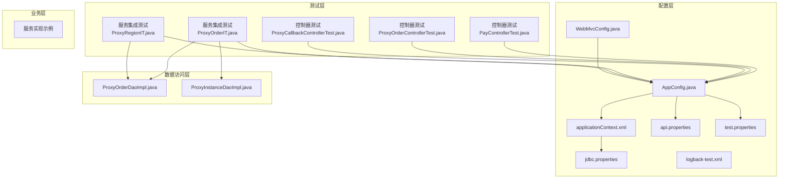
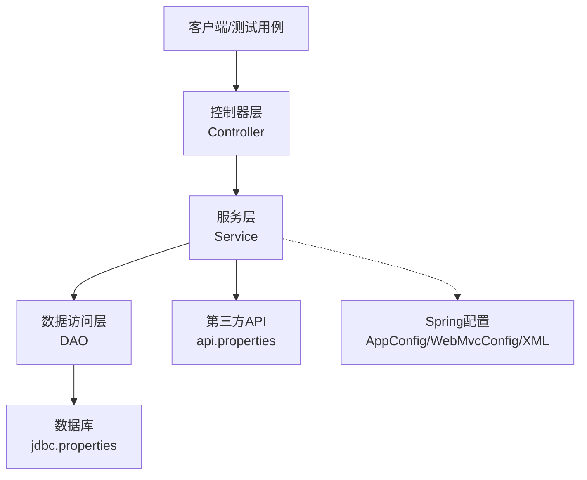
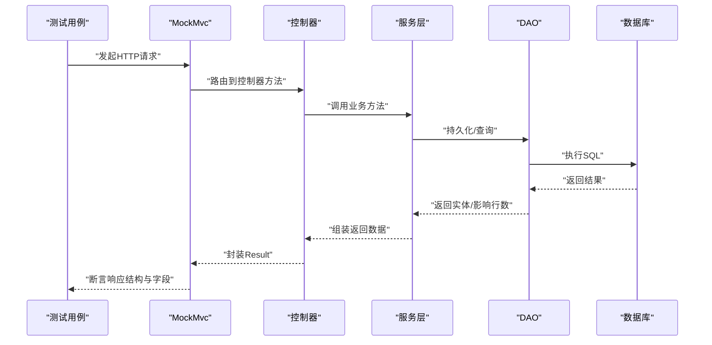
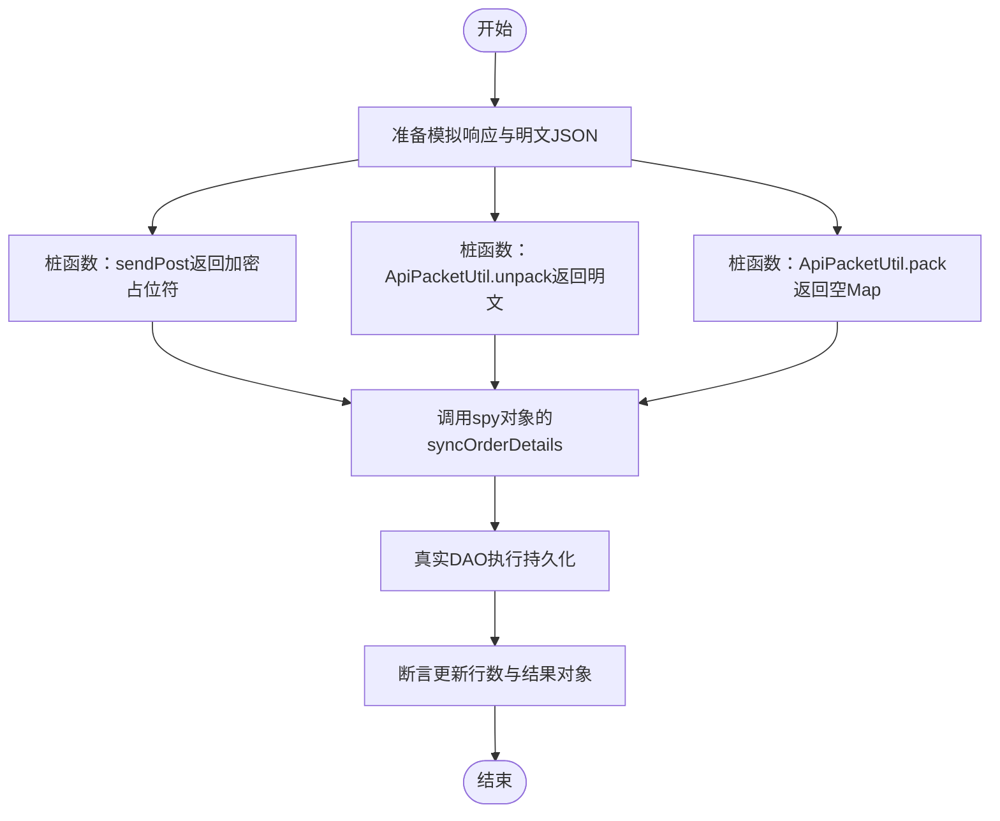
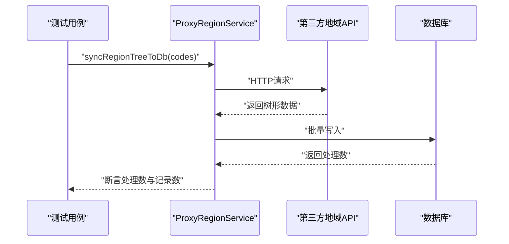
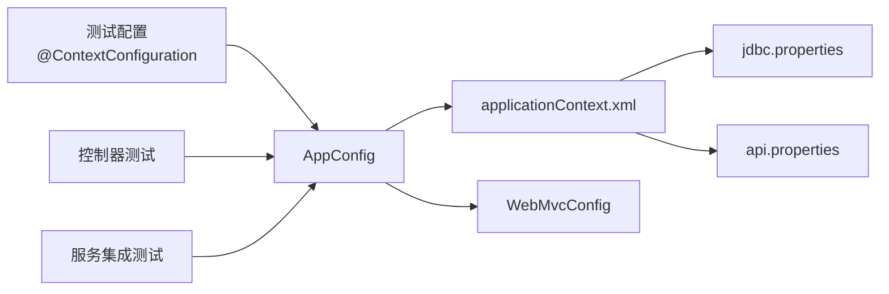

# 集成测试

<cite>
**本文引用的文件**
- [src/test/java/cn/linkfast/controller/PayControllerTest.java](file://src/test/java/cn/linkfast/controller/PayControllerTest.java)
- [src/test/java/cn/linkfast/controller/ProxyOrderControllerTest.java](file://src/test/java/cn/linkfast/controller/ProxyOrderControllerTest.java)
- [src/test/java/cn/linkfast/controller/ProxyCallbackControllerTest.java](file://src/test/java/cn/linkfast/controller/ProxyCallbackControllerTest.java)
- [src/test/java/cn/linkfast/service/Impl/ProxyOrderIT.java](file://src/test/java/cn/linkfast/service/Impl/ProxyOrderIT.java)
- [src/test/java/cn/linkfast/service/Impl/ProxyRegionIT.java](file://src/test/java/cn/linkfast/service/Impl/ProxyRegionIT.java)
- [src/main/java/cn/linkfast/config/AppConfig.java](file://src/main/java/cn/linkfast/config/AppConfig.java)
- [src/main/java/cn/linkfast/config/WebMvcConfig.java](file://src/main/java/cn/linkfast/config/WebMvcConfig.java)
- [src/main/resources/applicationContext.xml](file://src/main/resources/applicationContext.xml)
- [src/main/resources/jdbc.properties](file://src/main/resources/jdbc.properties)
- [src/main/resources/api.properties](file://src/main/resources/api.properties)
- [src/test/resources/test.properties](file://src/test/resources/test.properties)
- [src/test/resources/logback-test.xml](file://src/test/resources/logback-test.xml)
- [src/main/java/cn/linkfast/dao/impl/ProxyOrderDaoImpl.java](file://src/main/java/cn/linkfast/dao/impl/ProxyOrderDaoImpl.java)
- [src/main/java/cn/linkfast/dao/impl/ProxyInstanceDaoImpl.java](file://src/main/java/cn/linkfast/dao/impl/ProxyInstanceDaoImpl.java)
</cite>

## 目录
1. [简介](#简介)
2. [项目结构](#项目结构)
3. [核心组件](#核心组件)
4. [架构总览](#架构总览)
5. [详细组件分析](#详细组件分析)
6. [依赖分析](#依赖分析)
7. [性能考虑](#性能考虑)
8. [故障排查指南](#故障排查指南)
9. [结论](#结论)
10. [附录](#附录)

## 简介
本文件面向 Link-Fast 项目的集成测试实践，系统化阐述控制器层、服务层与数据访问层的协同测试策略，覆盖订单创建、支付处理、第三方 API 集成等端到端场景。文档重点包括：
- 测试环境搭建：测试数据库配置、Spring 上下文加载、真实依赖注入与隔离策略
- 端到端流程测试：控制器 HTTP 接口、服务层业务逻辑、DAO 层数据持久化
- 测试数据准备与清理：隔离与重复执行保障
- 故障诊断与调试技巧：日志、断言与常见问题定位

## 项目结构
Link-Fast 采用 Spring XML + 注解配置，测试位于 src/test 下，分别覆盖控制器、服务与 DAO 层。核心配置通过 AppConfig 与 WebMvcConfig 加载，数据源与事务由 applicationContext.xml 提供。

图表来源
- [src/test/java/cn/linkfast/controller/PayControllerTest.java:1-89](file://src/test/java/cn/linkfast/controller/PayControllerTest.java#L1-L89)
- [src/test/java/cn/linkfast/controller/ProxyOrderControllerTest.java:1-323](file://src/test/java/cn/linkfast/controller/ProxyOrderControllerTest.java#L1-L323)
- [src/test/java/cn/linkfast/controller/ProxyCallbackControllerTest.java:1-87](file://src/test/java/cn/linkfast/controller/ProxyCallbackControllerTest.java#L1-L87)
- [src/test/java/cn/linkfast/service/Impl/ProxyOrderIT.java:1-178](file://src/test/java/cn/linkfast/service/Impl/ProxyOrderIT.java#L1-L178)
- [src/test/java/cn/linkfast/service/Impl/ProxyRegionIT.java:1-87](file://src/test/java/cn/linkfast/service/Impl/ProxyRegionIT.java#L1-L87)
- [src/main/java/cn/linkfast/config/AppConfig.java:1-36](file://src/main/java/cn/linkfast/config/AppConfig.java#L1-L36)
- [src/main/java/cn/linkfast/config/WebMvcConfig.java:1-62](file://src/main/java/cn/linkfast/config/WebMvcConfig.java#L1-L62)
- [src/main/resources/applicationContext.xml:1-67](file://src/main/resources/applicationContext.xml#L1-L67)
- [src/main/resources/jdbc.properties:1-39](file://src/main/resources/jdbc.properties#L1-L39)
- [src/main/resources/api.properties:1-31](file://src/main/resources/api.properties#L1-L31)
- [src/test/resources/test.properties:1-3](file://src/test/resources/test.properties#L1-L3)
- [src/test/resources/logback-test.xml:1-49](file://src/test/resources/logback-test.xml#L1-L49)
- [src/main/java/cn/linkfast/dao/impl/ProxyOrderDaoImpl.java:1-446](file://src/main/java/cn/linkfast/dao/impl/ProxyOrderDaoImpl.java#L1-L446)
- [src/main/java/cn/linkfast/dao/impl/ProxyInstanceDaoImpl.java:1-175](file://src/main/java/cn/linkfast/dao/impl/ProxyInstanceDaoImpl.java#L1-L175)

章节来源
- [src/test/java/cn/linkfast/controller/PayControllerTest.java:1-89](file://src/test/java/cn/linkfast/controller/PayControllerTest.java#L1-L89)
- [src/test/java/cn/linkfast/controller/ProxyOrderControllerTest.java:1-323](file://src/test/java/cn/linkfast/controller/ProxyOrderControllerTest.java#L1-L323)
- [src/test/java/cn/linkfast/controller/ProxyCallbackControllerTest.java:1-87](file://src/test/java/cn/linkfast/controller/ProxyCallbackControllerTest.java#L1-L87)
- [src/test/java/cn/linkfast/service/Impl/ProxyOrderIT.java:1-178](file://src/test/java/cn/linkfast/service/Impl/ProxyOrderIT.java#L1-L178)
- [src/test/java/cn/linkfast/service/Impl/ProxyRegionIT.java:1-87](file://src/test/java/cn/linkfast/service/Impl/ProxyRegionIT.java#L1-L87)
- [src/main/java/cn/linkfast/config/AppConfig.java:1-36](file://src/main/java/cn/linkfast/config/AppConfig.java#L1-L36)
- [src/main/java/cn/linkfast/config/WebMvcConfig.java:1-62](file://src/main/java/cn/linkfast/config/WebMvcConfig.java#L1-L62)
- [src/main/resources/applicationContext.xml:1-67](file://src/main/resources/applicationContext.xml#L1-L67)
- [src/main/resources/jdbc.properties:1-39](file://src/main/resources/jdbc.properties#L1-L39)
- [src/main/resources/api.properties:1-31](file://src/main/resources/api.properties#L1-L31)
- [src/test/resources/test.properties:1-3](file://src/test/resources/test.properties#L1-L3)
- [src/test/resources/logback-test.xml:1-49](file://src/test/resources/logback-test.xml#L1-L49)
- [src/main/java/cn/linkfast/dao/impl/ProxyOrderDaoImpl.java:1-446](file://src/main/java/cn/linkfast/dao/impl/ProxyOrderDaoImpl.java#L1-L446)
- [src/main/java/cn/linkfast/dao/impl/ProxyInstanceDaoImpl.java:1-175](file://src/main/java/cn/linkfast/dao/impl/ProxyInstanceDaoImpl.java#L1-L175)

## 核心组件
- 配置层
  - AppConfig：启用事务、排除 Controller、导入 XML 配置，提供 ObjectMapper 单例
  - WebMvcConfig：开启注解驱动、组件扫描控制器、配置消息转换器与跨域
  - applicationContext.xml：加载 jdbc.properties 与 api.properties，配置数据源、JdbcTemplate、事务管理器
  - jdbc.properties：数据库连接参数（含连接池与超时）
  - api.properties：第三方 API 环境变量与接口路径
  - test.properties：测试环境开关（如关闭定时任务）
  - logback-test.xml：测试日志输出至系统临时目录
- 控制器层
  - 支付密码校验、订单创建、续费、回调通知等接口的集成测试
- 服务层
  - 订单同步与地域树同步的集成测试，覆盖真实第三方 API 与数据库写入
- DAO 层
  - 订单与实例的批量更新、插入与查询实现，支撑集成测试断言

章节来源
- [src/main/java/cn/linkfast/config/AppConfig.java:1-36](file://src/main/java/cn/linkfast/config/AppConfig.java#L1-L36)
- [src/main/java/cn/linkfast/config/WebMvcConfig.java:1-62](file://src/main/java/cn/linkfast/config/WebMvcConfig.java#L1-L62)
- [src/main/resources/applicationContext.xml:1-67](file://src/main/resources/applicationContext.xml#L1-L67)
- [src/main/resources/jdbc.properties:1-39](file://src/main/resources/jdbc.properties#L1-L39)
- [src/main/resources/api.properties:1-31](file://src/main/resources/api.properties#L1-L31)
- [src/test/resources/test.properties:1-3](file://src/test/resources/test.properties#L1-L3)
- [src/test/resources/logback-test.xml:1-49](file://src/test/resources/logback-test.xml#L1-L49)

## 架构总览
下图展示控制器、服务与 DAO 在集成测试中的交互路径，以及真实第三方 API 与数据库的耦合点。

图表来源
- [src/main/java/cn/linkfast/config/AppConfig.java:1-36](file://src/main/java/cn/linkfast/config/AppConfig.java#L1-L36)
- [src/main/java/cn/linkfast/config/WebMvcConfig.java:1-62](file://src/main/java/cn/linkfast/config/WebMvcConfig.java#L1-L62)
- [src/main/resources/applicationContext.xml:1-67](file://src/main/resources/applicationContext.xml#L1-L67)
- [src/main/resources/jdbc.properties:1-39](file://src/main/resources/jdbc.properties#L1-L39)
- [src/main/resources/api.properties:1-31](file://src/main/resources/api.properties#L1-L31)
- [src/main/java/cn/linkfast/dao/impl/ProxyOrderDaoImpl.java:1-446](file://src/main/java/cn/linkfast/dao/impl/ProxyOrderDaoImpl.java#L1-L446)
- [src/main/java/cn/linkfast/dao/impl/ProxyInstanceDaoImpl.java:1-175](file://src/main/java/cn/linkfast/dao/impl/ProxyInstanceDaoImpl.java#L1-L175)

## 详细组件分析

### 控制器层集成测试
- 支付密码校验接口测试
  - 使用 MockMvc 发送 POST 请求，断言 HTTP 200 与返回码、数据字段
  - 覆盖错误密码与正确密码两种场景
- 订单创建接口测试
  - 覆盖空请求体、缺少支付密码、错误支付密码、空参数列表、错误 Content-Type 等边界场景
  - 完整合法参数场景作为集成测试，验证真实数据库与第三方 API 的联动
- 续费接口测试
  - 构造续费请求体，断言返回 Result 结构、appOrderNo、orderNo、amount、status 等关键字段
- 回调接口测试
  - GET 回调参数，断言接口返回 HTTP 200 且业务 code=200，验证第三方数据同步入库

图表来源
- [src/test/java/cn/linkfast/controller/ProxyOrderControllerTest.java:176-247](file://src/test/java/cn/linkfast/controller/ProxyOrderControllerTest.java#L176-L247)
- [src/test/java/cn/linkfast/controller/ProxyCallbackControllerTest.java:56-85](file://src/test/java/cn/linkfast/controller/ProxyCallbackControllerTest.java#L56-L85)
- [src/main/java/cn/linkfast/dao/impl/ProxyOrderDaoImpl.java:34-76](file://src/main/java/cn/linkfast/dao/impl/ProxyOrderDaoImpl.java#L34-L76)

章节来源
- [src/test/java/cn/linkfast/controller/PayControllerTest.java:48-86](file://src/test/java/cn/linkfast/controller/PayControllerTest.java#L48-L86)
- [src/test/java/cn/linkfast/controller/ProxyOrderControllerTest.java:56-162](file://src/test/java/cn/linkfast/controller/ProxyOrderControllerTest.java#L56-L162)
- [src/test/java/cn/linkfast/controller/ProxyOrderControllerTest.java:176-320](file://src/test/java/cn/linkfast/controller/ProxyOrderControllerTest.java#L176-L320)
- [src/test/java/cn/linkfast/controller/ProxyCallbackControllerTest.java:56-85](file://src/test/java/cn/linkfast/controller/ProxyCallbackControllerTest.java#L56-L85)

### 服务层集成测试

#### 订单同步集成测试（ProxyOrderIT）
- 目标：验证服务层调用第三方 API 并真实持久化到数据库
- 策略：
  - 使用 @ContextConfiguration 加载 AppConfig，注入真实 DAO、ObjectMapper、服务与工具
  - 使用 Mockito.spy 包装真实 Service，对网络发送与解密过程进行桩函数替换
  - 通过 ON DUPLICATE KEY UPDATE 验证主表与子表更新行数
- 关键断言：
  - 主表与实例表更新行数非负
  - 打印更新统计，便于人工核对

图表来源
- [src/test/java/cn/linkfast/service/Impl/ProxyOrderIT.java:68-177](file://src/test/java/cn/linkfast/service/Impl/ProxyOrderIT.java#L68-L177)

章节来源
- [src/test/java/cn/linkfast/service/Impl/ProxyOrderIT.java:30-177](file://src/test/java/cn/linkfast/service/Impl/ProxyOrderIT.java#L30-L177)

#### 地域树同步集成测试（ProxyRegionIT）
- 目标：真实请求第三方地域 API，并将树形数据写入本地数据库
- 策略：
  - 使用 @ContextConfiguration 加载 AppConfig，注入 ProxyRegionService 与 JdbcTemplate
  - 支持全量同步与按 codes 同步两种模式，断言数据库记录数增加
- 注意事项：
  - 未使用 @Transactional，Spring 不自动回滚，数据会落库
  - 第三方返回树规模可能超出预期，需关注 MySQL 超时参数

图表来源
- [src/test/java/cn/linkfast/service/Impl/ProxyRegionIT.java:48-85](file://src/test/java/cn/linkfast/service/Impl/ProxyRegionIT.java#L48-L85)

章节来源
- [src/test/java/cn/linkfast/service/Impl/ProxyRegionIT.java:22-85](file://src/test/java/cn/linkfast/service/Impl/ProxyRegionIT.java#L22-L85)

### 数据访问层集成测试
- 订单 DAO
  - 支持主表与明细表的回写、批量插入与查询
  - 使用 ON DUPLICATE KEY UPDATE 保证幂等更新
- 实例 DAO
  - 批量更新代理实例字段，支持 JSON 字段序列化存储
- 断言要点
  - 通过影响行数判断更新/插入是否成功
  - 对 JSON 字段进行序列化兼容性验证

章节来源
- [src/main/java/cn/linkfast/dao/impl/ProxyOrderDaoImpl.java:34-76](file://src/main/java/cn/linkfast/dao/impl/ProxyOrderDaoImpl.java#L34-L76)
- [src/main/java/cn/linkfast/dao/impl/ProxyOrderDaoImpl.java:173-204](file://src/main/java/cn/linkfast/dao/impl/ProxyOrderDaoImpl.java#L173-L204)
- [src/main/java/cn/linkfast/dao/impl/ProxyInstanceDaoImpl.java:32-88](file://src/main/java/cn/linkfast/dao/impl/ProxyInstanceDaoImpl.java#L32-L88)

## 依赖分析
- 配置依赖
  - AppConfig 导入 applicationContext.xml，后者加载 jdbc.properties 与 api.properties
  - WebMvcConfig 仅负责 Web 层，业务层由 AppConfig 扫描
- 测试依赖
  - 控制器测试通过 @ContextConfiguration 引入 AppConfig 与 WebMvcConfig
  - 服务集成测试通过 @ContextConfiguration 引入 AppConfig，直接注入真实 DAO 与服务
- 外部依赖
  - 数据库：MySQL，Druid 连接池，JdbcTemplate
  - 第三方 API：通过 api.properties 配置环境与接口路径

图表来源
- [src/test/java/cn/linkfast/controller/ProxyOrderControllerTest.java:38-40](file://src/test/java/cn/linkfast/controller/ProxyOrderControllerTest.java#L38-L40)
- [src/test/java/cn/linkfast/service/Impl/ProxyOrderIT.java:34-36](file://src/test/java/cn/linkfast/service/Impl/ProxyOrderIT.java#L34-L36)
- [src/main/java/cn/linkfast/config/AppConfig.java:24](file://src/main/java/cn/linkfast/config/AppConfig.java#L24)
- [src/main/resources/applicationContext.xml:14-15](file://src/main/resources/applicationContext.xml#L14-L15)
- [src/main/resources/jdbc.properties:1-39](file://src/main/resources/jdbc.properties#L1-L39)
- [src/main/resources/api.properties:1-31](file://src/main/resources/api.properties#L1-L31)

章节来源
- [src/test/java/cn/linkfast/controller/ProxyOrderControllerTest.java:38-40](file://src/test/java/cn/linkfast/controller/ProxyOrderControllerTest.java#L38-L40)
- [src/test/java/cn/linkfast/service/Impl/ProxyOrderIT.java:34-36](file://src/test/java/cn/linkfast/service/Impl/ProxyOrderIT.java#L34-L36)
- [src/main/java/cn/linkfast/config/AppConfig.java:24](file://src/main/java/cn/linkfast/config/AppConfig.java#L24)
- [src/main/resources/applicationContext.xml:14-15](file://src/main/resources/applicationContext.xml#L14-L15)
- [src/main/resources/jdbc.properties:1-39](file://src/main/resources/jdbc.properties#L1-L39)
- [src/main/resources/api.properties:1-31](file://src/main/resources/api.properties#L1-L31)

## 性能考虑
- 连接池与超时
  - Druid 连接池配置了 keepAlive、validationQuery、空闲回收与泄露移除策略
  - MySQL 连接超时、socketTimeout、autoReconnect 等参数已在 jdbc.properties 中设置
- 批量操作
  - DAO 层广泛使用 batchUpdate，减少往返开销
- 第三方 API
  - ProxyRegionIT 设置了较长超时，以应对大规模树形数据写入

章节来源
- [src/main/resources/applicationContext.xml:23-52](file://src/main/resources/applicationContext.xml#L23-L52)
- [src/main/resources/jdbc.properties:10-17](file://src/main/resources/jdbc.properties#L10-L17)
- [src/main/java/cn/linkfast/dao/impl/ProxyOrderDaoImpl.java:60](file://src/main/java/cn/linkfast/dao/impl/ProxyOrderDaoImpl.java#L60)
- [src/test/java/cn/linkfast/service/Impl/ProxyRegionIT.java:49-50](file://src/test/java/cn/linkfast/service/Impl/ProxyRegionIT.java#L49-L50)

## 故障排查指南
- 日志输出
  - 测试日志输出至系统临时目录，便于定位问题
- 常见问题
  - 数据库连接失败：检查 jdbc.properties 中的 url、用户名与密码
  - 第三方 API 调用失败：检查 api.properties 中的环境与 appKey/appSecret
  - 定时任务干扰测试：确认 test.properties 中 task.product-sync.enabled=false
  - 控制器返回 400：检查请求体、Content-Type 与参数校验
  - 服务集成测试未回滚：ProxyRegionIT 未使用 @Transactional，数据会落库
- 调试建议
  - 在测试方法中打印响应体，解析 Result 结构
  - 对 DAO 方法增加日志，观察 SQL 与影响行数
  - 使用 Spy 对服务方法进行桩函数替换，隔离外部依赖

章节来源
- [src/test/resources/logback-test.xml:1-49](file://src/test/resources/logback-test.xml#L1-L49)
- [src/main/resources/jdbc.properties:3-34](file://src/main/resources/jdbc.properties#L3-L34)
- [src/main/resources/api.properties:2-11](file://src/main/resources/api.properties#L2-L11)
- [src/test/resources/test.properties:1-3](file://src/test/resources/test.properties#L1-L3)
- [src/test/java/cn/linkfast/controller/ProxyOrderControllerTest.java:253-263](file://src/test/java/cn/linkfast/controller/ProxyOrderControllerTest.java#L253-L263)
- [src/test/java/cn/linkfast/service/Impl/ProxyRegionIT.java:29](file://src/test/java/cn/linkfast/service/Impl/ProxyRegionIT.java#L29)

## 结论
本集成测试体系通过控制器、服务与 DAO 的协同验证，覆盖订单创建、支付处理与第三方 API 集成等关键业务流程。测试环境通过 Spring XML 与注解配置加载真实依赖，结合 Mock 与 Spy 技术隔离外部系统，既保证端到端验证，又提升测试稳定性与可维护性。建议在持续集成中固定测试数据库与第三方 API 凭据，并配合日志与断言策略，持续优化测试覆盖率与执行效率。

## 附录
- 测试数据准备与清理
  - 使用 Spy 对服务方法进行桩函数替换，避免真实网络调用
  - 对于需要真实落库的场景（如 ProxyRegionIT），注意数据不会自动回滚
- 端到端测试清单
  - 支付密码校验：错误与正确密码
  - 订单创建：空体、缺参、错误参、合法参
  - 续费流程：控制器返回字段与数据库回写一致性
  - 回调流程：第三方回调触发与数据同步
  - 地域树同步：全量与按 codes 同步