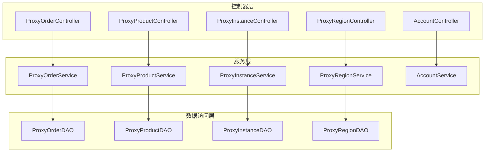
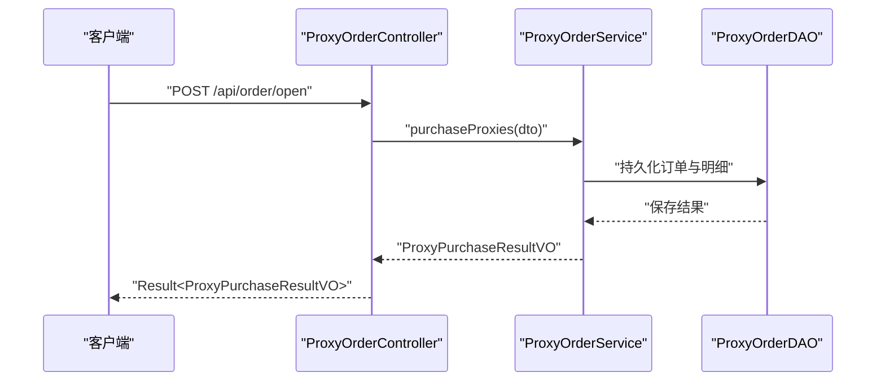
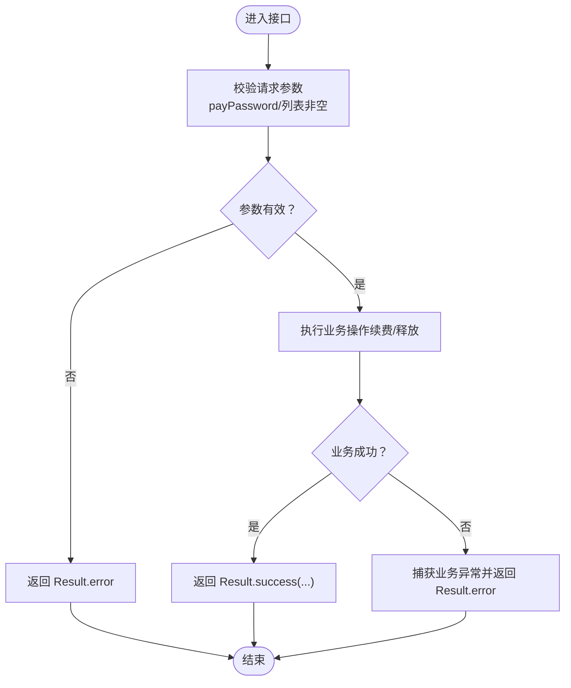
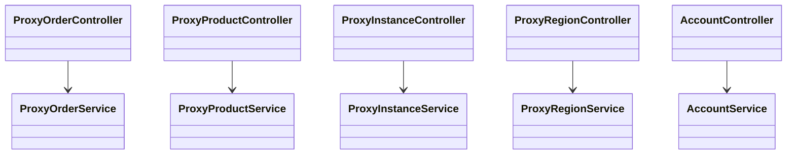

# 内部 API 接口

<cite>
**本文引用的文件**
- [ProxyOrderController.java](file://src/main/java/cn/linkfast/controller/ProxyOrderController.java)
- [ProxyProductController.java](file://src/main/java/cn/linkfast/controller/ProxyProductController.java)
- [ProxyInstanceController.java](file://src/main/java/cn/linkfast/controller/ProxyInstanceController.java)
- [ProxyRegionController.java](file://src/main/java/cn/linkfast/controller/ProxyRegionController.java)
- [AccountController.java](file://src/main/java/cn/linkfast/controller/AccountController.java)
- [ProxyOrderQueryDTO.java](file://src/main/java/cn/linkfast/dto/ProxyOrderQueryDTO.java)
- [ProxyPurchaseDTO.java](file://src/main/java/cn/linkfast/dto/ProxyPurchaseDTO.java)
- [ProxyRenewDTO.java](file://src/main/java/cn/linkfast/dto/ProxyRenewDTO.java)
- [ProxyReleaseDTO.java](file://src/main/java/cn/linkfast/dto/ProxyReleaseDTO.java)
- [ProxyProductQueryDTO.java](file://src/main/java/cn/linkfast/dto/ProxyProductQueryDTO.java)
- [ProxyInstanceQueryDTO.java](file://src/main/java/cn/linkfast/dto/ProxyInstanceQueryDTO.java)
- [ProxyInstanceRemarkDTO.java](file://src/main/java/cn/linkfast/dto/ProxyInstanceRemarkDTO.java)
- [AreaDTO.java](file://src/main/java/cn/linkfast/dto/AreaDTO.java)
- [ProxyOrderVO.java](file://src/main/java/cn/linkfast/vo/ProxyOrderVO.java)
- [ProxyProductVO.java](file://src/main/java/cn/linkfast/vo/ProxyProductVO.java)
- [ProxyInstanceVO.java](file://src/main/java/cn/linkfast/vo/ProxyInstanceVO.java)
- [AccountInfoVO.java](file://src/main/java/cn/linkfast/vo/AccountInfoVO.java)
- [ProxyOrder.java](file://src/main/java/cn/linkfast/entity/ProxyOrder.java)
- [ProxyProduct.java](file://src/main/java/cn/linkfast/entity/ProxyProduct.java)
- [ProxyInstance.java](file://src/main/java/cn/linkfast/entity/ProxyInstance.java)
- [Result.java](file://src/main/java/cn/linkfast/common/Result.java)
- [test-api.http](file://test-api.http)
</cite>

## 目录
1. [简介](#简介)
2. [项目结构](#项目结构)
3. [核心组件](#核心组件)
4. [架构总览](#架构总览)
5. [详细组件分析](#详细组件分析)
6. [依赖分析](#依赖分析)
7. [性能考虑](#性能考虑)
8. [故障排查指南](#故障排查指南)
9. [结论](#结论)
10. [附录](#附录)

## 简介
本文件为 Link-Fast 项目的内部 API 接口文档，覆盖订单管理、产品管理、实例管理、区域管理和账户管理等核心功能。文档面向开发者与测试人员，提供接口规范、请求参数、响应格式、状态码与错误处理机制，并给出请求与响应示例路径、安全与权限控制说明、版本与兼容性策略及迁移建议。

## 项目结构
后端采用 Spring Boot 控制器-服务-数据访问分层架构，接口集中在 controller 包下，参数使用 DTO 校验，返回统一封装在 Result<T> 中；业务模型以 VO/Entity 表达，便于前后端解耦与数据脱敏。

图表来源
- [ProxyOrderController.java:23-85](file://src/main/java/cn/linkfast/controller/ProxyOrderController.java#L23-L85)
- [ProxyProductController.java:17-33](file://src/main/java/cn/linkfast/controller/ProxyProductController.java#L17-L33)
- [ProxyInstanceController.java:17-50](file://src/main/java/cn/linkfast/controller/ProxyInstanceController.java#L17-L50)
- [ProxyRegionController.java:17-35](file://src/main/java/cn/linkfast/controller/ProxyRegionController.java#L17-L35)
- [AccountController.java:11-22](file://src/main/java/cn/linkfast/controller/AccountController.java#L11-L22)

章节来源
- [ProxyOrderController.java:23-85](file://src/main/java/cn/linkfast/controller/ProxyOrderController.java#L23-L85)
- [ProxyProductController.java:17-33](file://src/main/java/cn/linkfast/controller/ProxyProductController.java#L17-L33)
- [ProxyInstanceController.java:17-50](file://src/main/java/cn/linkfast/controller/ProxyInstanceController.java#L17-L50)
- [ProxyRegionController.java:17-35](file://src/main/java/cn/linkfast/controller/ProxyRegionController.java#L17-L35)
- [AccountController.java:11-22](file://src/main/java/cn/linkfast/controller/AccountController.java#L11-L22)

## 核心组件
- 统一响应封装：Result<T> 提供 code、message、data 字段，成功默认 code=200，失败默认 code=500。
- 参数校验：各 DTO 使用 Jakarta Bean Validation 注解进行必填、范围与格式校验。
- 分页模型：PageResult<T> 用于分页查询返回结构（由服务层返回，控制器直接透传）。

章节来源
- [Result.java:10-59](file://src/main/java/cn/linkfast/common/Result.java#L10-L59)

## 架构总览
以下序列图展示一次“创建代理订单”的典型调用链路，体现控制器、服务与数据访问层的协作。

图表来源
- [ProxyOrderController.java:44-47](file://src/main/java/cn/linkfast/controller/ProxyOrderController.java#L44-L47)
- [ProxyPurchaseDTO.java:10-22](file://src/main/java/cn/linkfast/dto/ProxyPurchaseDTO.java#L10-L22)

## 详细组件分析

### 订单管理接口
- 接口概览
  - 获取订单列表（分页）
    - 方法与路径：GET /api/order/list
    - 请求参数：见 ProxyOrderQueryDTO
    - 响应：Result<PageResult<ProxyOrderVO>>
  - 创建代理订单（开通）
    - 方法与路径：POST /api/order/open
    - 请求体：ProxyPurchaseDTO
    - 响应：Result<ProxyPurchaseResultVO>
  - 续费代理实例
    - 方法与路径：POST /api/order/renew
    - 请求体：ProxyRenewDTO
    - 响应：Result<ProxyRenewResultVO>
    - 错误处理：捕获业务异常与通用异常，返回 Result.error
  - 释放代理实例
    - 方法与路径：POST /api/order/release
    - 请求体：ProxyReleaseDTO
    - 响应：Result<ProxyReleaseResultVO>
    - 错误处理：捕获业务异常与通用异常，返回 Result.error

- 请求参数与校验要点
  - ProxyOrderQueryDTO：pageNum/pageSize 必填且范围校验；orderNo/orderType 可选
  - ProxyPurchaseDTO：payPassword、totalQuantity、params 必填且非空
  - ProxyRenewDTO：payPassword、items 必填且非空
  - ProxyReleaseDTO：payPassword、instanceNos 必填且非空

- 响应格式与状态码
  - 统一响应：code=200 表示成功；其他 code 表示失败
  - 具体业务错误通过 Result.error(code,message) 返回
  - 成功示例路径：[ProxyOrderController.java:36-39](file://src/main/java/cn/linkfast/controller/ProxyOrderController.java#L36-L39)

- 安全与权限
  - 当前控制器未显式声明鉴权注解，需结合项目全局安全配置（如网关/拦截器）进行鉴权与签名校验
  - 支付密码 payPassword 作为敏感参数，应在传输与存储环节遵循加密与最小暴露原则

- 请求与响应示例路径
  - 获取订单列表：[ProxyOrderController.java:36-39](file://src/main/java/cn/linkfast/controller/ProxyOrderController.java#L36-L39)
  - 创建订单：[ProxyOrderController.java:44-47](file://src/main/java/cn/linkfast/controller/ProxyOrderController.java#L44-L47)
  - 续费：[ProxyOrderController.java:53-65](file://src/main/java/cn/linkfast/controller/ProxyOrderController.java#L53-L65)
  - 释放：[ProxyOrderController.java:70-83](file://src/main/java/cn/linkfast/controller/ProxyOrderController.java#L70-L83)

- 数据模型映射
  - ProxyOrderVO：订单列表展示字段
  - ProxyOrder：订单实体（含明细集合）

章节来源
- [ProxyOrderController.java:30-83](file://src/main/java/cn/linkfast/controller/ProxyOrderController.java#L30-L83)
- [ProxyOrderQueryDTO.java:18-57](file://src/main/java/cn/linkfast/dto/ProxyOrderQueryDTO.java#L18-L57)
- [ProxyPurchaseDTO.java:10-22](file://src/main/java/cn/linkfast/dto/ProxyPurchaseDTO.java#L10-L22)
- [ProxyRenewDTO.java:12-26](file://src/main/java/cn/linkfast/dto/ProxyRenewDTO.java#L12-L26)
- [ProxyReleaseDTO.java:12-26](file://src/main/java/cn/linkfast/dto/ProxyReleaseDTO.java#L12-L26)
- [ProxyOrderVO.java:13-47](file://src/main/java/cn/linkfast/vo/ProxyOrderVO.java#L13-L47)
- [ProxyOrder.java:17-45](file://src/main/java/cn/linkfast/entity/ProxyOrder.java#L17-L45)

#### 续费与释放流程图

图表来源
- [ProxyOrderController.java:53-83](file://src/main/java/cn/linkfast/controller/ProxyOrderController.java#L53-L83)
- [ProxyRenewDTO.java:12-26](file://src/main/java/cn/linkfast/dto/ProxyRenewDTO.java#L12-L26)
- [ProxyReleaseDTO.java:12-26](file://src/main/java/cn/linkfast/dto/ProxyReleaseDTO.java#L12-L26)

### 产品管理接口
- 接口概览
  - 获取代理产品列表（分页）
    - 方法与路径：GET /api/proxy-product/list
    - 请求参数：ProxyProductQueryDTO（国家/城市/页码/每页条数/类型列表）
    - 响应：Result<PageResult<ProxyProductVO>>

- 请求参数与校验要点
  - pageNum/pageSize 必填且范围校验
  - countryCode/cityCode/ proxyType 可选

- 响应格式
  - 统一响应 Result<T>，data 为分页结果

- 请求与响应示例路径
  - [ProxyProductController.java:29-33](file://src/main/java/cn/linkfast/controller/ProxyProductController.java#L29-L33)
  - [ProxyProductQueryDTO.java:16-51](file://src/main/java/cn/linkfast/dto/ProxyProductQueryDTO.java#L16-L51)
  - [ProxyProductVO.java:13-31](file://src/main/java/cn/linkfast/vo/ProxyProductVO.java#L13-L31)
  - [ProxyProduct.java:14-99](file://src/main/java/cn/linkfast/entity/ProxyProduct.java#L14-L99)

章节来源
- [ProxyProductController.java:24-33](file://src/main/java/cn/linkfast/controller/ProxyProductController.java#L24-L33)
- [ProxyProductQueryDTO.java:16-51](file://src/main/java/cn/linkfast/dto/ProxyProductQueryDTO.java#L16-L51)
- [ProxyProductVO.java:13-31](file://src/main/java/cn/linkfast/vo/ProxyProductVO.java#L13-L31)
- [ProxyProduct.java:14-99](file://src/main/java/cn/linkfast/entity/ProxyProduct.java#L14-L99)

### 实例管理接口
- 接口概览
  - 获取代理实例列表（分页）
    - 方法与路径：GET /api/instance/list
    - 请求参数：ProxyInstanceQueryDTO
    - 响应：Result<PageResult<ProxyInstanceVO>>
  - 更新代理实例备注
    - 方法与路径：PUT /api/instance/remark
    - 请求体：ProxyInstanceRemarkDTO
    - 响应：Result<Void>

- 请求参数与校验要点
  - ProxyInstanceQueryDTO：pageNum/pageSize 必填；proxyType/status/countryCode/cityCode/ip 可选
  - ProxyInstanceRemarkDTO：instanceNo 必填；remark 可为空（清空备注）

- 响应格式
  - 统一响应 Result<T>；更新备注成功返回空 data

- 请求与响应示例路径
  - 实例列表：[ProxyInstanceController.java:31-36](file://src/main/java/cn/linkfast/controller/ProxyInstanceController.java#L31-L36)
  - 更新备注：[ProxyInstanceController.java:44-48](file://src/main/java/cn/linkfast/controller/ProxyInstanceController.java#L44-L48)
  - [ProxyInstanceQueryDTO.java:14-60](file://src/main/java/cn/linkfast/dto/ProxyInstanceQueryDTO.java#L14-L60)
  - [ProxyInstanceRemarkDTO.java:10-22](file://src/main/java/cn/linkfast/dto/ProxyInstanceRemarkDTO.java#L10-L22)
  - [ProxyInstanceVO.java:12-42](file://src/main/java/cn/linkfast/vo/ProxyInstanceVO.java#L12-L42)
  - [ProxyInstance.java:12-57](file://src/main/java/cn/linkfast/entity/ProxyInstance.java#L12-L57)

章节来源
- [ProxyInstanceController.java:25-48](file://src/main/java/cn/linkfast/controller/ProxyInstanceController.java#L25-L48)
- [ProxyInstanceQueryDTO.java:14-60](file://src/main/java/cn/linkfast/dto/ProxyInstanceQueryDTO.java#L14-L60)
- [ProxyInstanceRemarkDTO.java:10-22](file://src/main/java/cn/linkfast/dto/ProxyInstanceRemarkDTO.java#L10-L22)
- [ProxyInstanceVO.java:12-42](file://src/main/java/cn/linkfast/vo/ProxyInstanceVO.java#L12-L42)
- [ProxyInstance.java:12-57](file://src/main/java/cn/linkfast/entity/ProxyInstance.java#L12-L57)

### 区域管理接口
- 接口概览
  - 获取地域树形列表
    - 方法与路径：GET /api/area/tree
    - 查询参数：codes（可选，地域代码列表）
    - 响应：Result<List<AreaDTO>>

- 数据模型
  - AreaDTO：包含 code/name/cname/children 的树形结构

- 请求与响应示例路径
  - [ProxyRegionController.java:30-35](file://src/main/java/cn/linkfast/controller/ProxyRegionController.java#L30-L35)
  - [AreaDTO.java:12-38](file://src/main/java/cn/linkfast/dto/AreaDTO.java#L12-L38)

章节来源
- [ProxyRegionController.java:24-35](file://src/main/java/cn/linkfast/controller/ProxyRegionController.java#L24-L35)
- [AreaDTO.java:12-38](file://src/main/java/cn/linkfast/dto/AreaDTO.java#L12-L38)

### 账户管理接口
- 接口概览
  - 获取账户信息
    - 方法与路径：GET /api/account/info
    - 响应：Result<AccountInfoVO>

- 响应字段
  - AccountInfoVO：包含 coin、credit 等字段

- 请求与响应示例路径
  - [AccountController.java:17-21](file://src/main/java/cn/linkfast/controller/AccountController.java#L17-L21)
  - [AccountInfoVO.java:6-14](file://src/main/java/cn/linkfast/vo/AccountInfoVO.java#L6-L14)

章节来源
- [AccountController.java:17-21](file://src/main/java/cn/linkfast/controller/AccountController.java#L17-L21)
- [AccountInfoVO.java:6-14](file://src/main/java/cn/linkfast/vo/AccountInfoVO.java#L6-L14)

## 依赖分析
- 控制器与服务层
  - 各控制器通过 final 字段注入对应 Service，职责清晰，松耦合
- 参数与返回
  - DTO 负责请求参数校验；VO 负责对外输出；Result 统一封装响应
- 数据模型
  - Entity 与 VO 解耦，避免将数据库字段直接暴露给前端

图表来源
- [ProxyOrderController.java:27-28](file://src/main/java/cn/linkfast/controller/ProxyOrderController.java#L27-L28)
- [ProxyProductController.java](file://src/main/java/cn/linkfast/controller/ProxyProductController.java#L22)
- [ProxyInstanceController.java](file://src/main/java/cn/linkfast/controller/ProxyInstanceController.java#L23)
- [ProxyRegionController.java](file://src/main/java/cn/linkfast/controller/ProxyRegionController.java#L22)
- [AccountController.java](file://src/main/java/cn/linkfast/controller/AccountController.java#L15)

## 性能考虑
- 分页参数限制：pageNum/pageSize 均有限制（最小值与最大值），防止超大分页导致数据库压力过大
- DTO 校验前置：在控制器层即进行参数校验，减少无效请求进入服务层
- 统一响应：Result<T> 简化前端处理，减少重复判断逻辑
- 建议
  - 对高频接口增加缓存（如产品列表、地域树）
  - 对复杂查询添加索引优化（如按状态、国家/城市、IP 模糊查询）

## 故障排查指南
- 常见错误与定位
  - 参数校验失败：检查 DTO 注解与必填字段是否满足要求
  - 业务异常：查看控制器对 BusinessException 的捕获与 Result.error 返回
  - 通用异常：查看控制器对 Exception 的捕获与兜底提示
- 日志与追踪
  - 控制器层使用日志记录请求与异常堆栈，便于快速定位问题
- 测试参考
  - 使用项目提供的 HTTP 测试文件进行接口联调与回归测试

章节来源
- [ProxyOrderController.java:55-82](file://src/main/java/cn/linkfast/controller/ProxyOrderController.java#L55-L82)
- [Result.java:37-44](file://src/main/java/cn/linkfast/common/Result.java#L37-L44)
- [test-api.http](file://test-api.http)

## 结论
本文档系统梳理了 Link-Fast 内部 API 的核心接口，明确了请求参数、响应格式、状态码与错误处理机制，并提供了调用示例路径与安全、性能、排障建议。建议在生产环境中结合全局安全策略与缓存策略进一步完善。

## 附录

### 版本与兼容性说明
- 版本标识
  - 当前接口未显式声明版本号，建议后续在路径或请求头中引入版本前缀或字段，以便平滑演进
- 兼容性
  - 新增字段建议保持向后兼容；删除字段需通过版本迁移与弃用策略保障
- 迁移指南
  - 引入版本后，旧版本接口保留过渡期；前端逐步切换至新版本接口

### 接口清单与示例路径
- 订单管理
  - GET /api/order/list → [ProxyOrderController.java:36-39](file://src/main/java/cn/linkfast/controller/ProxyOrderController.java#L36-L39)
  - POST /api/order/open → [ProxyOrderController.java:44-47](file://src/main/java/cn/linkfast/controller/ProxyOrderController.java#L44-L47)
  - POST /api/order/renew → [ProxyOrderController.java:53-65](file://src/main/java/cn/linkfast/controller/ProxyOrderController.java#L53-L65)
  - POST /api/order/release → [ProxyOrderController.java:70-83](file://src/main/java/cn/linkfast/controller/ProxyOrderController.java#L70-L83)
- 产品管理
  - GET /api/proxy-product/list → [ProxyProductController.java:29-33](file://src/main/java/cn/linkfast/controller/ProxyProductController.java#L29-L33)
- 实例管理
  - GET /api/instance/list → [ProxyInstanceController.java:31-36](file://src/main/java/cn/linkfast/controller/ProxyInstanceController.java#L31-L36)
  - PUT /api/instance/remark → [ProxyInstanceController.java:44-48](file://src/main/java/cn/linkfast/controller/ProxyInstanceController.java#L44-L48)
- 区域管理
  - GET /api/area/tree → [ProxyRegionController.java:30-35](file://src/main/java/cn/linkfast/controller/ProxyRegionController.java#L30-L35)
- 账户管理
  - GET /api/account/info → [AccountController.java:17-21](file://src/main/java/cn/linkfast/controller/AccountController.java#L17-L21)