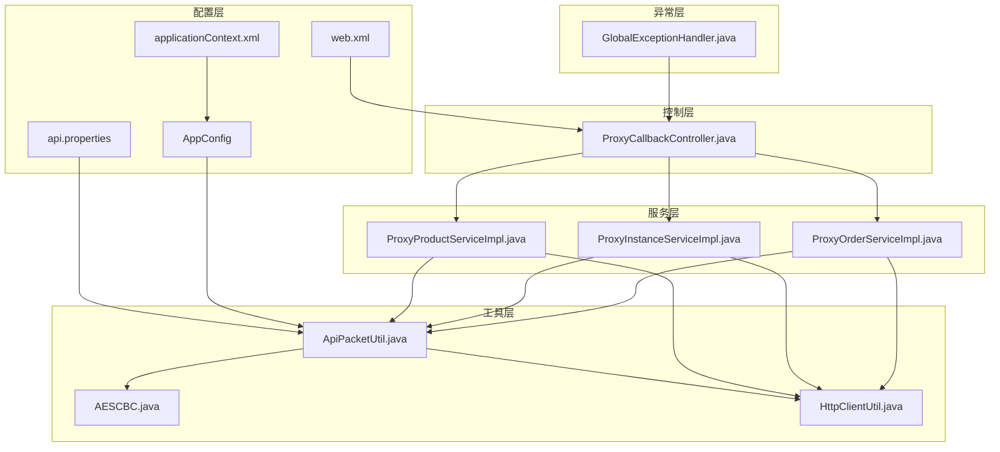
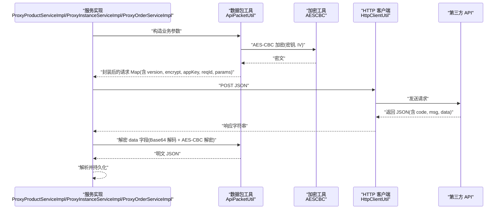
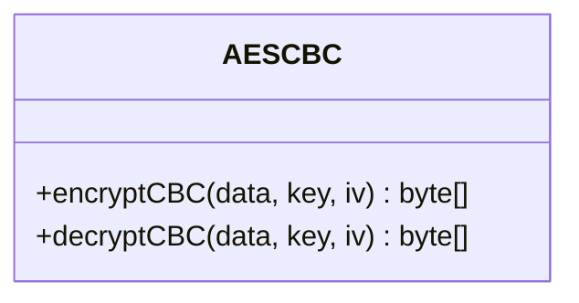
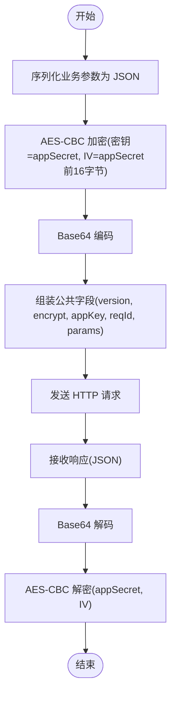
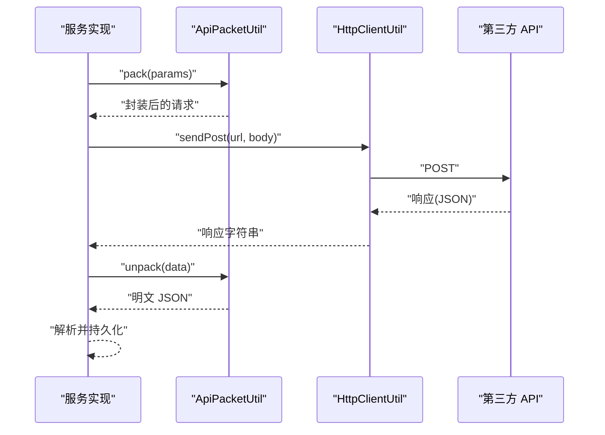
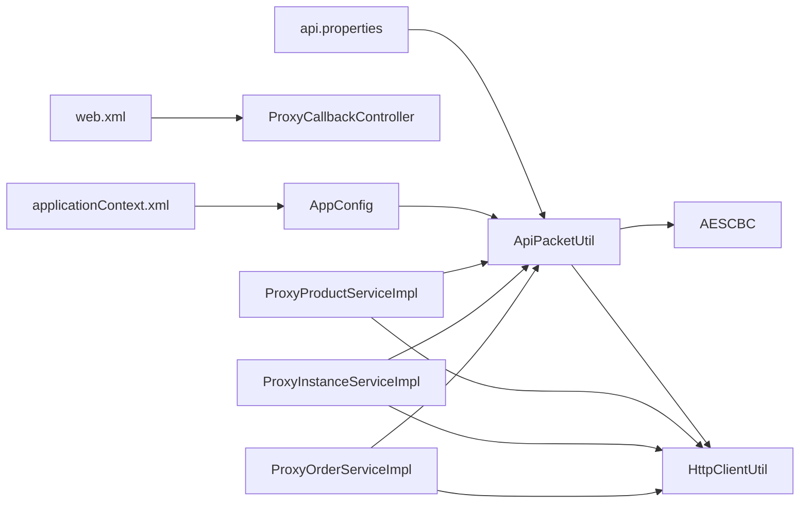

# 加密与安全机制

<cite>
**本文引用的文件**
- [AESCBC.java](file://src/main/java/cn/linkfast/utils/AESCBC.java)
- [ApiPacketUtil.java](file://src/main/java/cn/linkfast/utils/ApiPacketUtil.java)
- [HttpClientUtil.java](file://src/main/java/cn/linkfast/utils/HttpClientUtil.java)
- [api.properties](file://src/main/resources/api.properties)
- [applicationContext.xml](file://src/main/resources/applicationContext.xml)
- [web.xml](file://src/main/webapp/WEB-INF/web.xml)
- [ProxyOrderServiceImpl.java](file://src/main/java/cn/linkfast/service/impl/ProxyOrderServiceImpl.java)
- [ProxyInstanceServiceImpl.java](file://src/main/java/cn/linkfast/service/impl/ProxyInstanceServiceImpl.java)
- [ProxyProductServiceImpl.java](file://src/main/java/cn/linkfast/service/impl/ProxyProductServiceImpl.java)
- [ProxyCallbackController.java](file://src/main/java/cn/linkfast/controller/ProxyCallbackController.java)
- [GlobalExceptionHandler.java](file://src/main/java/cn/linkfast/exception/GlobalExceptionHandler.java)
- [AppConfig.java](file://src/main/java/cn/linkfast/config/AppConfig.java)
- [AESCBCTest.java](file://src/test/java/cn/linkfast/utils/AESCBCTest.java)
- [ProxyOrderServiceImplTest.java](file://src/test/java/cn/linkfast/service/Impl/ProxyOrderServiceImplTest.java)
- [ProxyOrderIT.java](file://src/test/java/cn/linkfast/service/Impl/ProxyOrderIT.java)
- [test-api.http](file://test-api.http)
- [docs/README.md](file://docs/README.md)
</cite>

## 目录
1. [简介](#简介)
2. [项目结构](#项目结构)
3. [核心组件](#核心组件)
4. [架构总览](#架构总览)
5. [详细组件分析](#详细组件分析)
6. [依赖分析](#依赖分析)
7. [性能考虑](#性能考虑)
8. [故障排查指南](#故障排查指南)
9. [结论](#结论)
10. [附录](#附录)

## 简介
本文件面向 Link-Fast 项目的加密与安全机制，聚焦于 API 通信的加密实现（AES-CBC）、密钥与 IV 管理、数据包封装与解封装流程、签名与完整性校验现状、安全配置与最佳实践、以及可扩展的安全测试与合规建议。当前仓库中未发现显式的数字签名与哈希签名验证逻辑，因此本文在“签名验证机制”部分明确标注现状与建议。

## 项目结构
围绕加密与安全的关键模块分布如下：
- 工具层：AESCBC（对称加密）、ApiPacketUtil（数据包封装/解封装）、HttpClientUtil（HTTP 客户端）
- 配置层：api.properties（密钥与接口路径）、web.xml（会话与 Cookie 安全基础配置）
- 服务层：ProxyProductServiceImpl、ProxyInstanceServiceImpl、ProxyOrderServiceImpl（调用第三方 API 并进行数据包加解密）
- 控制层：ProxyCallbackController（第三方回调入口）
- 异常层：GlobalExceptionHandler（统一异常处理）
- 配置与容器：AppConfig（ObjectMapper 注入）、applicationContext.xml（数据源与属性占位符）

图表来源
- [ApiPacketUtil.java:1-103](file://src/main/java/cn/linkfast/utils/ApiPacketUtil.java#L1-L103)
- [AESCBC.java:1-36](file://src/main/java/cn/linkfast/utils/AESCBC.java#L1-L36)
- [HttpClientUtil.java:1-45](file://src/main/java/cn/linkfast/utils/HttpClientUtil.java#L1-L45)
- [api.properties:1-31](file://src/main/resources/api.properties#L1-L31)
- [web.xml:1-73](file://src/main/webapp/WEB-INF/web.xml#L1-L73)
- [AppConfig.java:1-36](file://src/main/java/cn/linkfast/config/AppConfig.java#L1-L36)
- [applicationContext.xml:1-67](file://src/main/resources/applicationContext.xml#L1-L67)
- [ProxyProductServiceImpl.java:73-113](file://src/main/java/cn/linkfast/service/impl/ProxyProductServiceImpl.java#L73-L113)
- [ProxyInstanceServiceImpl.java:45-193](file://src/main/java/cn/linkfast/service/impl/ProxyInstanceServiceImpl.java#L45-L193)
- [ProxyOrderServiceImpl.java:413-782](file://src/main/java/cn/linkfast/service/impl/ProxyOrderServiceImpl.java#L413-L782)
- [ProxyCallbackController.java:1-92](file://src/main/java/cn/linkfast/controller/ProxyCallbackController.java#L1-L92)
- [GlobalExceptionHandler.java:1-90](file://src/main/java/cn/linkfast/exception/GlobalExceptionHandler.java#L1-L90)

章节来源
- [ApiPacketUtil.java:1-103](file://src/main/java/cn/linkfast/utils/ApiPacketUtil.java#L1-L103)
- [AESCBC.java:1-36](file://src/main/java/cn/linkfast/utils/AESCBC.java#L1-L36)
- [HttpClientUtil.java:1-45](file://src/main/java/cn/linkfast/utils/HttpClientUtil.java#L1-L45)
- [api.properties:1-31](file://src/main/resources/api.properties#L1-L31)
- [web.xml:1-73](file://src/main/webapp/WEB-INF/web.xml#L1-L73)
- [AppConfig.java:1-36](file://src/main/java/cn/linkfast/config/AppConfig.java#L1-L36)
- [applicationContext.xml:1-67](file://src/main/resources/applicationContext.xml#L1-L67)
- [ProxyProductServiceImpl.java:73-113](file://src/main/java/cn/linkfast/service/impl/ProxyProductServiceImpl.java#L73-L113)
- [ProxyInstanceServiceImpl.java:45-193](file://src/main/java/cn/linkfast/service/impl/ProxyInstanceServiceImpl.java#L45-L193)
- [ProxyOrderServiceImpl.java:413-782](file://src/main/java/cn/linkfast/service/impl/ProxyOrderServiceImpl.java#L413-L782)
- [ProxyCallbackController.java:1-92](file://src/main/java/cn/linkfast/controller/ProxyCallbackController.java#L1-L92)
- [GlobalExceptionHandler.java:1-90](file://src/main/java/cn/linkfast/exception/GlobalExceptionHandler.java#L1-L90)

## 核心组件
- AESCBC：提供 AES-CBC 加密与解密能力，使用 PKCS5Padding 填充，密钥与 IV 通过外部提供。
- ApiPacketUtil：负责业务参数序列化、AES-CBC 加密、Base64 编码、请求包组装（含版本、加密方式、appKey、reqId），以及响应数据 Base64 解码与 AES-CBC 解密。
- HttpClientUtil：基于 Apache HttpClient 5 的简单封装，发送 JSON 请求并处理非 2xx 状态码返回。
- 配置中心：api.properties 提供环境标识、目标域名、appKey/appSecret 与各接口路径；applicationContext.xml 加载属性文件；web.xml 提供会话与 Cookie 基础安全设置。
- 服务实现：ProxyProductServiceImpl、ProxyInstanceServiceImpl、ProxyOrderServiceImpl 在调用第三方接口前后执行数据包封装/解封装与错误处理。

章节来源
- [AESCBC.java:19-30](file://src/main/java/cn/linkfast/utils/AESCBC.java#L19-L30)
- [ApiPacketUtil.java:56-102](file://src/main/java/cn/linkfast/utils/ApiPacketUtil.java#L56-L102)
- [HttpClientUtil.java:27-43](file://src/main/java/cn/linkfast/utils/HttpClientUtil.java#L27-L43)
- [api.properties:1-31](file://src/main/resources/api.properties#L1-L31)
- [applicationContext.xml:14-15](file://src/main/resources/applicationContext.xml#L14-L15)
- [web.xml:60-66](file://src/main/webapp/WEB-INF/web.xml#L60-L66)

## 架构总览
下图展示从服务层到第三方 API 的端到端加密通信链路，包括数据包封装、传输与解封装流程。

图表来源
- [ProxyProductServiceImpl.java:87-101](file://src/main/java/cn/linkfast/service/impl/ProxyProductServiceImpl.java#L87-L101)
- [ProxyInstanceServiceImpl.java:71-87](file://src/main/java/cn/linkfast/service/impl/ProxyInstanceServiceImpl.java#L71-L87)
- [ProxyOrderServiceImpl.java:413-421](file://src/main/java/cn/linkfast/service/impl/ProxyOrderServiceImpl.java#L413-L421)
- [ApiPacketUtil.java:56-102](file://src/main/java/cn/linkfast/utils/ApiPacketUtil.java#L56-L102)
- [AESCBC.java:20-30](file://src/main/java/cn/linkfast/utils/AESCBC.java#L20-L30)
- [HttpClientUtil.java:27-43](file://src/main/java/cn/linkfast/utils/HttpClientUtil.java#L27-L43)

## 详细组件分析

### AES-CBC 加密实现
- 算法与填充：AES/CBC/PKCS5Padding
- 密钥与 IV：来源于 ApiPacketUtil 初始化阶段，从 appSecret 派生 IV（取前 16 字节）
- 错误处理：对无效密钥长度或 IV 长度抛出相应异常，单元测试覆盖了异常分支

图表来源
- [AESCBC.java:19-30](file://src/main/java/cn/linkfast/utils/AESCBC.java#L19-L30)

章节来源
- [AESCBC.java:19-30](file://src/main/java/cn/linkfast/utils/AESCBC.java#L19-L30)
- [AESCBCTest.java:15-78](file://src/test/java/cn/linkfast/utils/AESCBCTest.java#L15-L78)

### 数据包封装与解封装流程
- 封装步骤
  1) 业务参数序列化为 JSON
  2) 使用 AES-CBC 加密（密钥来自 appSecret，IV 来自 appSecret 前 16 字节）
  3) Base64 编码
  4) 组装公共字段：version、encrypt、appKey、reqId
- 解封装步骤
  1) Base64 解码
  2) AES-CBC 解密
  3) 输出明文 JSON

图表来源
- [ApiPacketUtil.java:56-102](file://src/main/java/cn/linkfast/utils/ApiPacketUtil.java#L56-L102)
- [AESCBC.java:20-30](file://src/main/java/cn/linkfast/utils/AESCBC.java#L20-L30)

章节来源
- [ApiPacketUtil.java:56-102](file://src/main/java/cn/linkfast/utils/ApiPacketUtil.java#L56-L102)

### 服务层调用与错误处理
- 产品查询、实例查询、订单处理等服务在调用第三方接口前后均执行数据包封装/解封装
- 对解密失败、响应 data 缺失或为空、解析失败等场景进行严格校验与异常抛出，避免脏数据入库

图表来源
- [ProxyProductServiceImpl.java:87-101](file://src/main/java/cn/linkfast/service/impl/ProxyProductServiceImpl.java#L87-L101)
- [ProxyInstanceServiceImpl.java:71-87](file://src/main/java/cn/linkfast/service/impl/ProxyInstanceServiceImpl.java#L71-L87)
- [ProxyOrderServiceImpl.java:413-421](file://src/main/java/cn/linkfast/service/impl/ProxyOrderServiceImpl.java#L413-L421)
- [ApiPacketUtil.java:56-102](file://src/main/java/cn/linkfast/utils/ApiPacketUtil.java#L56-L102)
- [HttpClientUtil.java:27-43](file://src/main/java/cn/linkfast/utils/HttpClientUtil.java#L27-L43)

章节来源
- [ProxyProductServiceImpl.java:87-101](file://src/main/java/cn/linkfast/service/impl/ProxyProductServiceImpl.java#L87-L101)
- [ProxyInstanceServiceImpl.java:160-191](file://src/main/java/cn/linkfast/service/impl/ProxyInstanceServiceImpl.java#L160-L191)
- [ProxyOrderServiceImpl.java:413-421](file://src/main/java/cn/linkfast/service/impl/ProxyOrderServiceImpl.java#L413-L421)

### 回调与完整性校验现状
- 当前回调处理（ProxyCallbackController）未包含对回调数据的签名验证或哈希校验逻辑
- 仅记录回调参数并触发本地同步任务，未对第三方来源进行身份与数据完整性验证

章节来源
- [ProxyCallbackController.java:40-91](file://src/main/java/cn/linkfast/controller/ProxyCallbackController.java#L40-L91)

## 依赖分析
- ApiPacketUtil 依赖 Api 属性配置（appKey/appSecret、环境、URL 路径），通过 Spring 注入并在初始化时派生 IV
- 服务实现依赖 ApiPacketUtil 与 HttpClientUtil，形成“封装/解封装 → HTTP 传输 → 解析持久化”的闭环
- AppConfig 与 applicationContext.xml 负责加载属性与共享 ObjectMapper

图表来源
- [api.properties:1-31](file://src/main/resources/api.properties#L1-L31)
- [web.xml:1-73](file://src/main/webapp/WEB-INF/web.xml#L1-L73)
- [AppConfig.java:24-35](file://src/main/java/cn/linkfast/config/AppConfig.java#L24-L35)
- [applicationContext.xml:14-15](file://src/main/resources/applicationContext.xml#L14-L15)
- [ApiPacketUtil.java:22-51](file://src/main/java/cn/linkfast/utils/ApiPacketUtil.java#L22-L51)
- [AESCBC.java:19-30](file://src/main/java/cn/linkfast/utils/AESCBC.java#L19-L30)
- [HttpClientUtil.java:1-45](file://src/main/java/cn/linkfast/utils/HttpClientUtil.java#L1-L45)
- [ProxyProductServiceImpl.java:87-101](file://src/main/java/cn/linkfast/service/impl/ProxyProductServiceImpl.java#L87-L101)
- [ProxyInstanceServiceImpl.java:71-87](file://src/main/java/cn/linkfast/service/impl/ProxyInstanceServiceImpl.java#L71-L87)
- [ProxyOrderServiceImpl.java:413-421](file://src/main/java/cn/linkfast/service/impl/ProxyOrderServiceImpl.java#L413-L421)

章节来源
- [api.properties:1-31](file://src/main/resources/api.properties#L1-L31)
- [web.xml:1-73](file://src/main/webapp/WEB-INF/web.xml#L1-L73)
- [AppConfig.java:24-35](file://src/main/java/cn/linkfast/config/AppConfig.java#L24-L35)
- [applicationContext.xml:14-15](file://src/main/resources/applicationContext.xml#L14-L15)
- [ApiPacketUtil.java:22-51](file://src/main/java/cn/linkfast/utils/ApiPacketUtil.java#L22-L51)
- [AESCBC.java:19-30](file://src/main/java/cn/linkfast/utils/AESCBC.java#L19-L30)
- [HttpClientUtil.java:1-45](file://src/main/java/cn/linkfast/utils/HttpClientUtil.java#L1-L45)
- [ProxyProductServiceImpl.java:87-101](file://src/main/java/cn/linkfast/service/impl/ProxyProductServiceImpl.java#L87-L101)
- [ProxyInstanceServiceImpl.java:71-87](file://src/main/java/cn/linkfast/service/impl/ProxyInstanceServiceImpl.java#L71-L87)
- [ProxyOrderServiceImpl.java:413-421](file://src/main/java/cn/linkfast/service/impl/ProxyOrderServiceImpl.java#L413-L421)

## 性能考虑
- 加解密成本：AES-CBC 为对称加密，CPU 开销主要集中在加密/解密与 Base64 编解码；建议在高并发场景下复用 ObjectMapper 与连接池
- 网络开销：HTTP 请求采用 JSON 传输，建议开启压缩（如 Gzip）减少带宽占用
- 连接池与超时：applicationContext.xml 中配置了 Druid 连接池参数，建议结合实际 QPS 调整最大连接数与超时阈值
- 序列化：AppConfig 注入 ObjectMapper，避免重复创建带来的 GC 压力

[本节为通用性能建议，不直接分析具体文件]

## 故障排查指南
- 解密失败
  - 现象：服务层在解密响应 data 字段时抛出异常，记录错误日志并抛出不可回滚业务异常
  - 排查要点：确认 appSecret 是否正确、IV 是否为 appSecret 前 16 字节、Base64 内容是否被截断
- 响应 data 缺失或为空
  - 现象：data 为空字符串或缺失，服务层记录警告并返回 0 更新行
  - 排查要点：检查第三方返回结构、网络传输是否完整
- 参数校验与异常处理
  - 全局异常处理器统一返回 Result 结构，便于前端与监控系统识别
- 单元测试与集成测试
  - AESCBC 正向与异常用例覆盖密钥/IV 长度校验
  - 服务层测试通过打桩 ApiPacketUtil.unpack 验证 JSON 映射与错误分支

章节来源
- [ProxyOrderServiceImpl.java:413-421](file://src/main/java/cn/linkfast/service/impl/ProxyOrderServiceImpl.java#L413-L421)
- [ProxyOrderServiceImpl.java:622-652](file://src/main/java/cn/linkfast/service/impl/ProxyOrderServiceImpl.java#L622-L652)
- [ProxyInstanceServiceImpl.java:160-191](file://src/main/java/cn/linkfast/service/impl/ProxyInstanceServiceImpl.java#L160-L191)
- [GlobalExceptionHandler.java:28-90](file://src/main/java/cn/linkfast/exception/GlobalExceptionHandler.java#L28-L90)
- [AESCBCTest.java:15-78](file://src/test/java/cn/linkfast/utils/AESCBCTest.java#L15-L78)
- [ProxyOrderServiceImplTest.java:45-89](file://src/test/java/cn/linkfast/service/Impl/ProxyOrderServiceImplTest.java#L45-L89)

## 结论
- Link-Fast 当前实现了基于 AES-CBC 的 API 通信加密，配合 Base64 编码与公共请求头，满足基本机密性需求
- 未发现显式的数字签名与哈希签名验证逻辑，完整性与抗抵赖能力有待增强
- 建议在后续版本引入 HMAC/数字签名与时间戳/随机数机制，以抵御重放与篡改风险

[本节为总结性内容，不直接分析具体文件]

## 附录

### 安全配置指南
- 密钥与 IV 管理
  - 从 api.properties 读取 appKey/appSecret，建议通过环境变量或密钥管理服务注入，避免硬编码
  - IV 由 appSecret 前 16 字节生成，需保证 appSecret 长度符合要求
- 证书与传输安全
  - 生产环境建议强制 HTTPS，配置 TLS 1.2+，禁用弱密码套件
  - 服务器证书与 CA 校验应在 HttpClient 层启用
- 访问控制
  - web.xml 中会话 Cookie 设置为 httpOnly，建议在生产环境启用 secure
  - 控制器层对敏感接口增加鉴权与限流
- 密钥轮换
  - 建议实现密钥版本号与滚动更新策略，兼容新旧密钥过渡期

章节来源
- [api.properties:1-31](file://src/main/resources/api.properties#L1-L31)
- [web.xml:60-66](file://src/main/webapp/WEB-INF/web.xml#L60-L66)

### 网络安全最佳实践
- 防重放攻击
  - 引入时间戳与随机 nonce，服务端校验时间窗口与去重表
- 防中间人攻击
  - 强制 HTTPS，校验证书链与主机名
- 防窃听与篡改
  - 在现有 AES-CBC 基础上增加 HMAC-SHA256 签名，或采用 AEAD 模式（如 AES-GCM）
- 日志与审计
  - 仅记录必要上下文，避免明文输出密文与敏感参数

[本节为通用安全建议，不直接分析具体文件]

### 签名验证机制现状与建议
- 现状
  - 未发现哈希计算、数字签名或完整性校验的实现
- 建议
  - 在请求包中增加签名字段（如 sign=HMAC-SHA256(version|encrypt|appKey|reqId|params|timestamp|nonce)）
  - 服务端按相同规则重新计算并比对签名
  - 引入时间戳与随机数，拒绝过期或重复请求

[本节为概念性建议，不直接分析具体文件]

### 安全测试与合规检查
- 单元测试
  - 使用 AESCBCTest 验证加解密正确性与异常分支
- 集成测试
  - 使用 ProxyOrderServiceImplTest 打桩 ApiPacketUtil.unpack，验证 JSON 映射与错误处理
  - 使用 ProxyOrderIT 提供模拟解密后的完整 JSON，验证解析与持久化流程
- 渗透测试与漏洞扫描
  - 建议使用自动化工具扫描常见漏洞（SQL 注入、XSS、CSRF、不安全的加密实现）
  - 对第三方接口进行契约测试，确保数据一致性与完整性
- 合规性检查
  - 按所在地区法规（如 GDPR、网络安全法）对数据最小化、存储期限与删除权进行设计

章节来源
- [AESCBCTest.java:15-78](file://src/test/java/cn/linkfast/utils/AESCBCTest.java#L15-L78)
- [ProxyOrderServiceImplTest.java:45-89](file://src/test/java/cn/linkfast/service/Impl/ProxyOrderServiceImplTest.java#L45-L89)
- [ProxyOrderIT.java:76-143](file://src/test/java/cn/linkfast/service/Impl/ProxyOrderIT.java#L76-L143)

### 开发者使用示例
- 本地调试
  - 使用 test-api.http 发送 GET 请求，验证控制器与数据访问层连通性
- 配置切换
  - 通过 api.properties 切换环境（prod/sandbox）与对应 appKey/appSecret

章节来源
- [test-api.http:1-3](file://test-api.http#L1-L3)
- [api.properties:1-31](file://src/main/resources/api.properties#L1-L31)