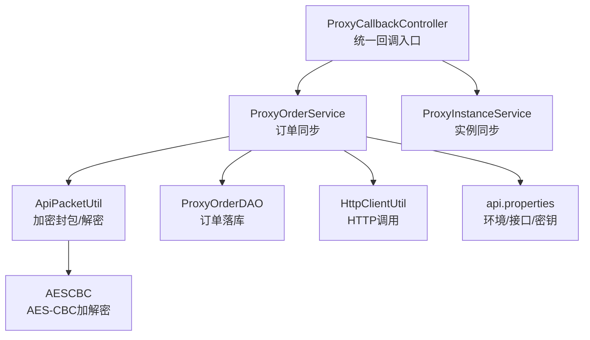
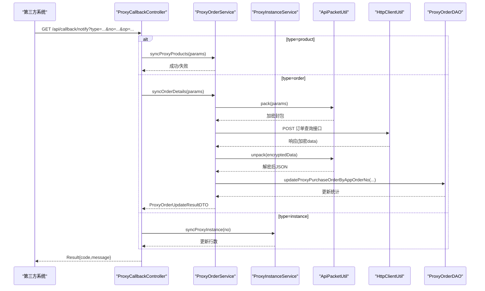
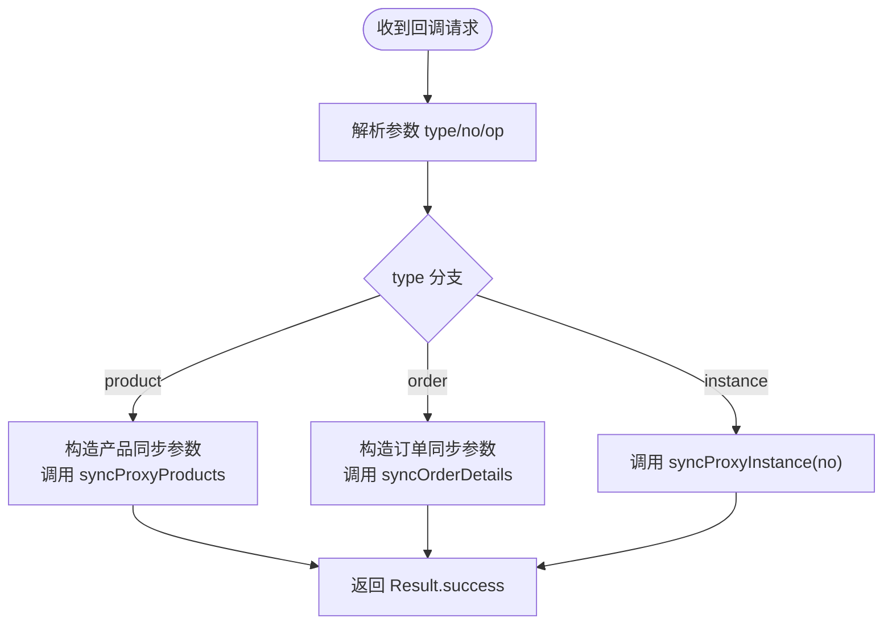
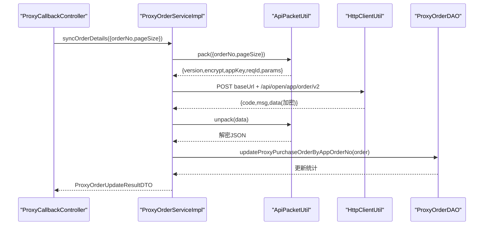
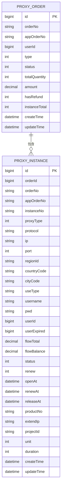
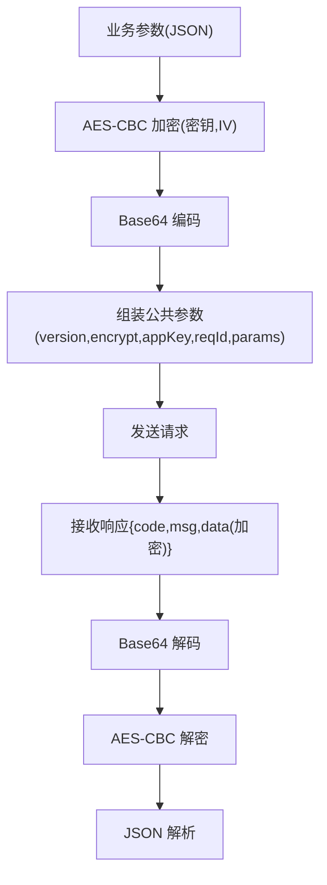
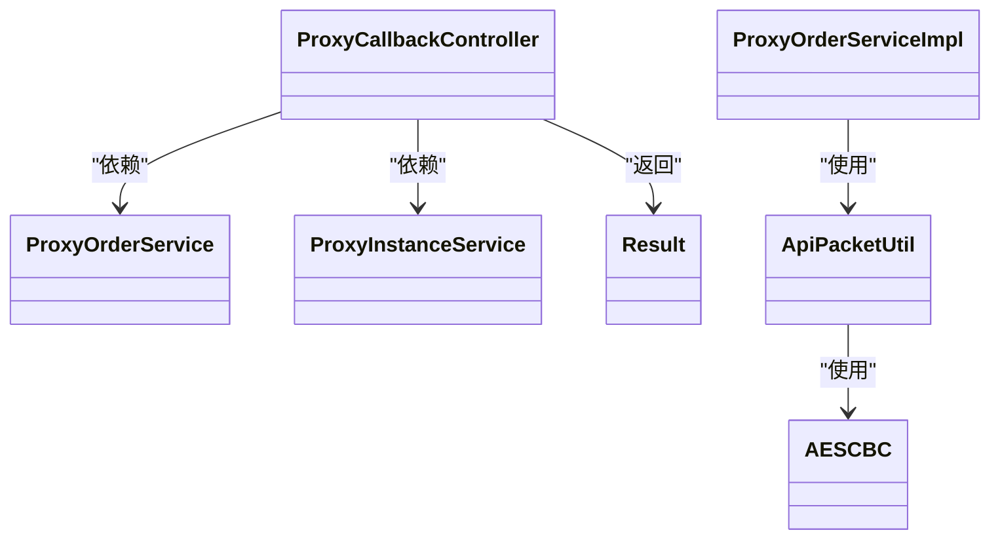

# 回调处理机制

<cite>
**本文引用的文件**
- [ProxyCallbackController.java](file://src/main/java/cn/linkfast/controller/ProxyCallbackController.java)
- [ProxyOrderServiceImpl.java](file://src/main/java/cn/linkfast/service/impl/ProxyOrderServiceImpl.java)
- [ProxyOrderService.java](file://src/main/java/cn/linkfast/service/ProxyOrderService.java)
- [ProxyInstanceService.java](file://src/main/java/cn/linkfast/service/ProxyInstanceService.java)
- [ApiPacketUtil.java](file://src/main/java/cn/linkfast/utils/ApiPacketUtil.java)
- [AESCBC.java](file://src/main/java/cn/linkfast/utils/AESCBC.java)
- [Result.java](file://src/main/java/cn/linkfast/common/Result.java)
- [ProxyOrder.java](file://src/main/java/cn/linkfast/entity/ProxyOrder.java)
- [ProxyInstance.java](file://src/main/java/cn/linkfast/entity/ProxyInstance.java)
- [ProxyOrderUpdateResultDTO.java](file://src/main/java/cn/linkfast/dto/ProxyOrderUpdateResultDTO.java)
- [api.properties](file://src/main/resources/api.properties)
- [AppConfig.java](file://src/main/java/cn/linkfast/config/AppConfig.java)
- [ProxyCallbackControllerTest.java](file://src/test/java/cn/linkfast/controller/ProxyCallbackControllerTest.java)
- [实例回调接口开发需求.md](file://docs/api/internal/实例回调接口开发需求.md)
- [test-api.http](file://test-api.http)
</cite>

## 目录
1. [简介](#简介)
2. [项目结构](#项目结构)
3. [核心组件](#核心组件)
4. [架构总览](#架构总览)
5. [详细组件分析](#详细组件分析)
6. [依赖关系分析](#依赖关系分析)
7. [性能考量](#性能考量)
8. [故障排查指南](#故障排查指南)
9. [结论](#结论)
10. [附录](#附录)

## 简介
本文件系统性阐述 Link-Fast 项目的回调处理机制，重点覆盖：
- 异步回调接口设计与控制流
- 数据接收与处理流程
- 回调消息格式规范、加解密与签名思路
- 回调状态同步策略（订单状态、实例激活、异常处理）
- 回调重试、超时与熔断保护方案
- 回调监控、日志与故障诊断方法
- 集成方的回调测试工具、模拟环境与调试指南

## 项目结构
回调处理主要涉及控制器、服务层、工具类与配置资源，整体采用分层架构，职责清晰：
- 控制器层：统一入口接收第三方回调参数，路由到不同业务处理
- 服务层：封装与第三方接口交互、数据解密与落库
- 工具层：加解密与请求打包
- 配置层：环境切换、接口路径与密钥管理

图表来源
- [ProxyCallbackController.java:1-92](file://src/main/java/cn/linkfast/controller/ProxyCallbackController.java#L1-L92)
- [ProxyOrderServiceImpl.java:1-136](file://src/main/java/cn/linkfast/service/impl/ProxyOrderServiceImpl.java#L1-L136)
- [ApiPacketUtil.java:1-103](file://src/main/java/cn/linkfast/utils/ApiPacketUtil.java#L1-L103)
- [AESCBC.java:1-36](file://src/main/java/cn/linkfast/utils/AESCBC.java#L1-L36)
- [api.properties:1-31](file://src/main/resources/api.properties#L1-L31)

章节来源
- [ProxyCallbackController.java:1-92](file://src/main/java/cn/linkfast/controller/ProxyCallbackController.java#L1-L92)
- [AppConfig.java:1-36](file://src/main/java/cn/linkfast/config/AppConfig.java#L1-L36)

## 核心组件
- 回调控制器：统一入口，按 type 路由到产品/订单/实例同步逻辑，返回统一 Result 结构
- 订单服务：对接第三方订单查询接口，解密响应并落库，返回更新统计
- 实例服务：按实例编号同步实例信息
- 加解密工具：基于 AES-CBC 的加密封包与解密
- 统一响应：Result 统一返回 code/message/data

章节来源
- [ProxyCallbackController.java:32-91](file://src/main/java/cn/linkfast/controller/ProxyCallbackController.java#L32-L91)
- [ProxyOrderService.java:14-60](file://src/main/java/cn/linkfast/service/ProxyOrderService.java#L14-L60)
- [ProxyInstanceService.java:10-37](file://src/main/java/cn/linkfast/service/ProxyInstanceService.java#L10-L37)
- [ApiPacketUtil.java:53-103](file://src/main/java/cn/linkfast/utils/ApiPacketUtil.java#L53-L103)
- [Result.java:12-59](file://src/main/java/cn/linkfast/common/Result.java#L12-L59)

## 架构总览
回调处理的端到端流程如下：

图表来源
- [ProxyCallbackController.java:40-91](file://src/main/java/cn/linkfast/controller/ProxyCallbackController.java#L40-L91)
- [ProxyOrderServiceImpl.java:89-136](file://src/main/java/cn/linkfast/service/impl/ProxyOrderServiceImpl.java#L89-L136)
- [ApiPacketUtil.java:56-90](file://src/main/java/cn/linkfast/utils/ApiPacketUtil.java#L56-L90)

## 详细组件分析

### 回调接口设计与控制流
- 接口路径：/api/callback/notify
- 方法：GET
- 参数：
  - type：变更类型（product/order/instance）
  - no：变更编号（产品编号/订单编号/实例编号）
  - op：操作类型（如 update/add），实例回调不携带
- 返回：统一 Result 结构，code=200 表示成功

图表来源
- [ProxyCallbackController.java:40-91](file://src/main/java/cn/linkfast/controller/ProxyCallbackController.java#L40-L91)

章节来源
- [ProxyCallbackController.java:32-91](file://src/main/java/cn/linkfast/controller/ProxyCallbackController.java#L32-L91)
- [Result.java:28-44](file://src/main/java/cn/linkfast/common/Result.java#L28-L44)

### 数据接收与处理流程（订单）
- 组装请求：根据环境选择基础 URL，拼接订单查询路径
- 加密封包：使用 ApiPacketUtil.pack 将业务参数加密并封装公共字段
- 发起请求：通过 HttpClientUtil 发送 POST
- 响应解析：校验 code=200，解密 data 字段，反序列化为订单对象
- 补全实例字段：根据 appOrderNo 关联本地订单与购买明细，补全实例的本地字段
- 落库：调用 DAO 执行批量更新，返回更新统计

图表来源
- [ProxyOrderServiceImpl.java:89-136](file://src/main/java/cn/linkfast/service/impl/ProxyOrderServiceImpl.java#L89-L136)
- [ApiPacketUtil.java:56-90](file://src/main/java/cn/linkfast/utils/ApiPacketUtil.java#L56-L90)

章节来源
- [ProxyOrderServiceImpl.java:89-136](file://src/main/java/cn/linkfast/service/impl/ProxyOrderServiceImpl.java#L89-L136)
- [ProxyOrderUpdateResultDTO.java:12-39](file://src/main/java/cn/linkfast/dto/ProxyOrderUpdateResultDTO.java#L12-L39)

### 数据模型与状态同步
- 订单实体：包含订单主表字段、状态、金额、实例/明细集合
- 实体状态：1=待处理、2=处理中、3=处理成功、4=处理失败、5=部分完成
- 实例实体：包含实例编号、协议、IP、端口、到期时间、状态、流量等

图表来源
- [ProxyOrder.java:19-45](file://src/main/java/cn/linkfast/entity/ProxyOrder.java#L19-L45)
- [ProxyInstance.java:13-57](file://src/main/java/cn/linkfast/entity/ProxyInstance.java#L13-L57)

章节来源
- [ProxyOrder.java:19-45](file://src/main/java/cn/linkfast/entity/ProxyOrder.java#L19-L45)
- [ProxyInstance.java:13-57](file://src/main/java/cn/linkfast/entity/ProxyInstance.java#L13-L57)

### 加解密与签名思路
- 加密封包：业务参数 JSON → AES-CBC 加密 → Base64 编码；附加版本、加密算法、appKey、reqId
- 解密响应：Base64 解码 → AES-CBC 解密 → JSON 解析
- 签名：当前实现未见显式签名字段；若需签名，可在公共参数中加入签名字段并在服务端校验

图表来源
- [ApiPacketUtil.java:56-102](file://src/main/java/cn/linkfast/utils/ApiPacketUtil.java#L56-L102)
- [AESCBC.java:20-30](file://src/main/java/cn/linkfast/utils/AESCBC.java#L20-L30)

章节来源
- [ApiPacketUtil.java:56-102](file://src/main/java/cn/linkfast/utils/ApiPacketUtil.java#L56-L102)
- [AESCBC.java:20-30](file://src/main/java/cn/linkfast/utils/AESCBC.java#L20-L30)

### 重复处理与幂等
- 幂等性保障：通过 appOrderNo 关联订单与实例，DAO 层执行更新/插入，避免重复写入
- 去重策略：回调入口按 no 唯一定位资源；若第三方重复回调，服务端以数据库状态为准进行更新
- 建议：在控制器层增加去重缓存（如 Redis set），以请求维度去重，防止抖动

章节来源
- [ProxyOrderServiceImpl.java:108-135](file://src/main/java/cn/linkfast/service/impl/ProxyOrderServiceImpl.java#L108-L135)
- [ProxyCallbackController.java:40-91](file://src/main/java/cn/linkfast/controller/ProxyCallbackController.java#L40-L91)

### 回调状态同步策略
- 订单状态：根据第三方返回与本地状态机推进；处理成功/失败/部分完成
- 实例激活：实例回调触发实例同步，补全实例字段并更新状态
- 异常处理：捕获异常并记录日志，返回 Result.error，保证第三方收到成功响应（业务层面的错误通过 code/message 体现）

章节来源
- [ProxyOrder.java:24-31](file://src/main/java/cn/linkfast/entity/ProxyOrder.java#L24-L31)
- [ProxyCallbackController.java:64-85](file://src/main/java/cn/linkfast/controller/ProxyCallbackController.java#L64-L85)

### 重试、超时与熔断保护
- 当前实现（购买/续费/释放）具备重试逻辑：连接失败（建立连接异常/主机不可达）时重试最多3次，间隔递增；响应读取失败或业务失败时区分可回滚/不可回滚场景
- 建议补充：
  - 超时：为 HTTP 请求设置 connectTimeout/readTimeout
  - 熔断：引入熔断器（如 Resilience4j），在连续失败达到阈值时短路
  - 指数退避：优化重试间隔策略
  - 限流：对回调接口进行 QPS 限制，防止突发流量

章节来源
- [ProxyOrderServiceImpl.java:343-451](file://src/main/java/cn/linkfast/service/impl/ProxyOrderServiceImpl.java#L343-L451)
- [ProxyOrderServiceImpl.java:552-672](file://src/main/java/cn/linkfast/service/impl/ProxyOrderServiceImpl.java#L552-L672)
- [ProxyOrderServiceImpl.java:717-800](file://src/main/java/cn/linkfast/service/impl/ProxyOrderServiceImpl.java#L717-L800)

### 监控、日志与故障诊断
- 日志：控制器与服务层均输出详细日志（请求参数、响应、异常），便于定位问题
- 监控：建议接入链路追踪（TraceId）、指标采集（QPS/耗时/错误率）、告警
- 故障诊断：
  - 核对回调地址与参数（type/no/op）
  - 检查环境配置与密钥（api.properties）
  - 校验第三方接口可用性与返回格式
  - 关注不可回滚场景（响应已发送但读取失败、响应为空、解密失败等）

章节来源
- [ProxyCallbackController.java:44-90](file://src/main/java/cn/linkfast/controller/ProxyCallbackController.java#L44-L90)
- [ProxyOrderServiceImpl.java:173-194](file://src/main/java/cn/linkfast/service/impl/ProxyOrderServiceImpl.java#L173-L194)
- [api.properties:1-31](file://src/main/resources/api.properties#L1-L31)

### 回调测试工具、模拟环境与调试指南
- 集成测试：提供回调接口集成测试用例，验证订单回调的真实调用与落库
- 测试工具：提供 HTTP 文件（test-api.http）用于快速验证接口
- 调试步骤：
  - 使用集成测试验证回调接口返回码与业务结果
  - 在本地启动项目，访问回调地址，观察日志输出
  - 校验 api.properties 中的环境与密钥配置
  - 如需实例回调，参考“实例回调接口开发需求”文档进行联调

章节来源
- [ProxyCallbackControllerTest.java:48-85](file://src/test/java/cn/linkfast/controller/ProxyCallbackControllerTest.java#L48-L85)
- [test-api.http:1-3](file://test-api.http#L1-L3)
- [实例回调接口开发需求.md:1-71](file://docs/api/internal/实例回调接口开发需求.md#L1-L71)

## 依赖关系分析
- 控制器依赖服务接口，服务实现依赖工具类与 DAO
- 工具类依赖 AESCBC 与 Jackson
- 配置文件提供环境、接口路径与密钥

图表来源
- [ProxyCallbackController.java:28-30](file://src/main/java/cn/linkfast/controller/ProxyCallbackController.java#L28-L30)
- [ProxyOrderServiceImpl.java:37-45](file://src/main/java/cn/linkfast/service/impl/ProxyOrderServiceImpl.java#L37-L45)
- [ApiPacketUtil.java:17-51](file://src/main/java/cn/linkfast/utils/ApiPacketUtil.java#L17-L51)
- [AESCBC.java:19-30](file://src/main/java/cn/linkfast/utils/AESCBC.java#L19-L30)
- [Result.java:12-59](file://src/main/java/cn/linkfast/common/Result.java#L12-L59)

章节来源
- [ProxyOrderServiceImpl.java:37-45](file://src/main/java/cn/linkfast/service/impl/ProxyOrderServiceImpl.java#L37-L45)
- [ApiPacketUtil.java:17-51](file://src/main/java/cn/linkfast/utils/ApiPacketUtil.java#L17-L51)

## 性能考量
- 异步落库：订单购买流程中对产品库存信息采用异步更新，降低下单主流程阻塞
- 批量更新：订单同步时一次性补全实例本地字段并批量更新，减少多次往返
- 建议优化：
  - 对回调接口增加限流与并发控制
  - 对第三方接口调用增加连接池与超时配置
  - 对热点资源（如实例编号）增加缓存与去重

章节来源
- [ProxyOrderServiceImpl.java:230-236](file://src/main/java/cn/linkfast/service/impl/ProxyOrderServiceImpl.java#L230-L236)
- [ProxyOrderServiceImpl.java:108-135](file://src/main/java/cn/linkfast/service/impl/ProxyOrderServiceImpl.java#L108-L135)

## 故障排查指南
- 回调无法到达：检查 Nginx 配置与防火墙规则
- 参数缺失：确认 type/no/op 是否正确传递
- 解密失败：核对 api.properties 中的 appKey/appSecret 与 IV 计算
- 业务失败：查看第三方返回 code/msg，结合日志定位
- 不可回滚场景：当响应已发送但读取失败或响应为空时，需人工确认第三方状态并保持本地数据不变

章节来源
- [ProxyOrderServiceImpl.java:343-451](file://src/main/java/cn/linkfast/service/impl/ProxyOrderServiceImpl.java#L343-L451)
- [ProxyOrderServiceImpl.java:552-672](file://src/main/java/cn/linkfast/service/impl/ProxyOrderServiceImpl.java#L552-L672)
- [ProxyOrderServiceImpl.java:717-800](file://src/main/java/cn/linkfast/service/impl/ProxyOrderServiceImpl.java#L717-L800)

## 结论
Link-Fast 的回调处理机制以统一入口为核心，结合加密封包、解密与幂等落库策略，实现了对产品、订单与实例的同步更新。当前实现具备基础的重试与异常处理能力，建议进一步完善超时、熔断与限流策略，并增强签名与去重机制，以提升稳定性与可观测性。

## 附录
- 回调地址与参数规范：参考“实例回调接口开发需求”
- 环境与密钥配置：api.properties
- 测试用例与工具：ProxyCallbackControllerTest、test-api.http

章节来源
- [实例回调接口开发需求.md:8-21](file://docs/api/internal/实例回调接口开发需求.md#L8-L21)
- [api.properties:1-31](file://src/main/resources/api.properties#L1-L31)
- [ProxyCallbackControllerTest.java:48-85](file://src/test/java/cn/linkfast/controller/ProxyCallbackControllerTest.java#L48-L85)
- [test-api.http:1-3](file://test-api.http#L1-L3)