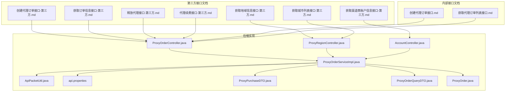
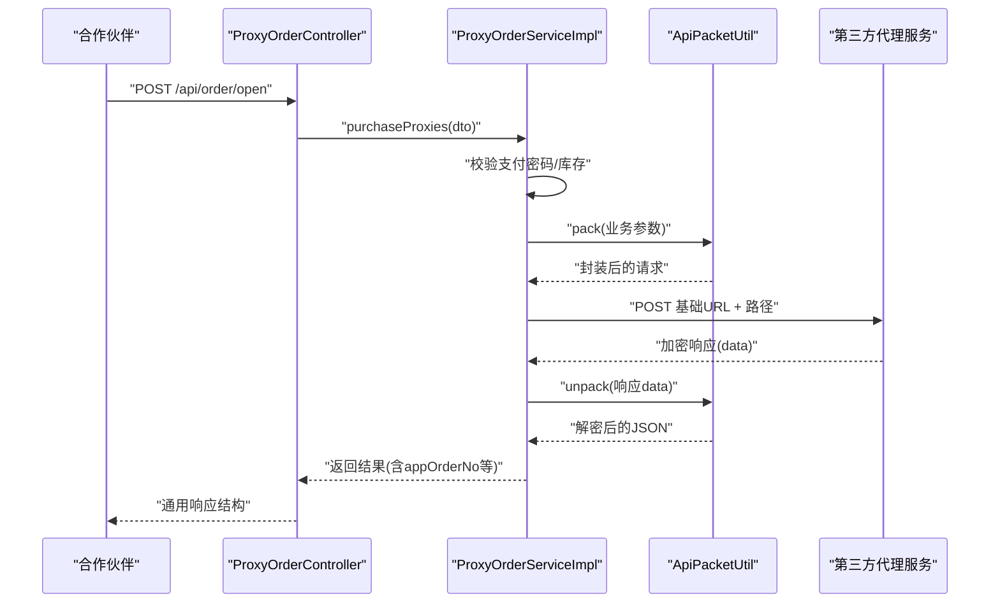
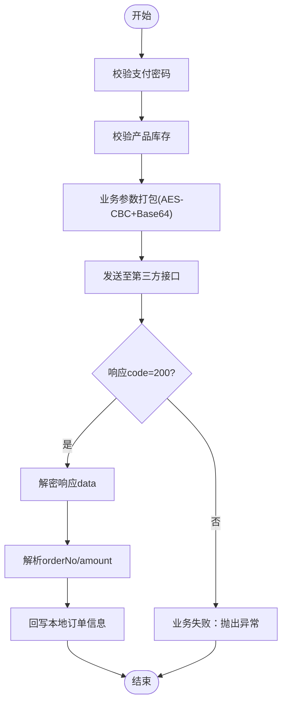
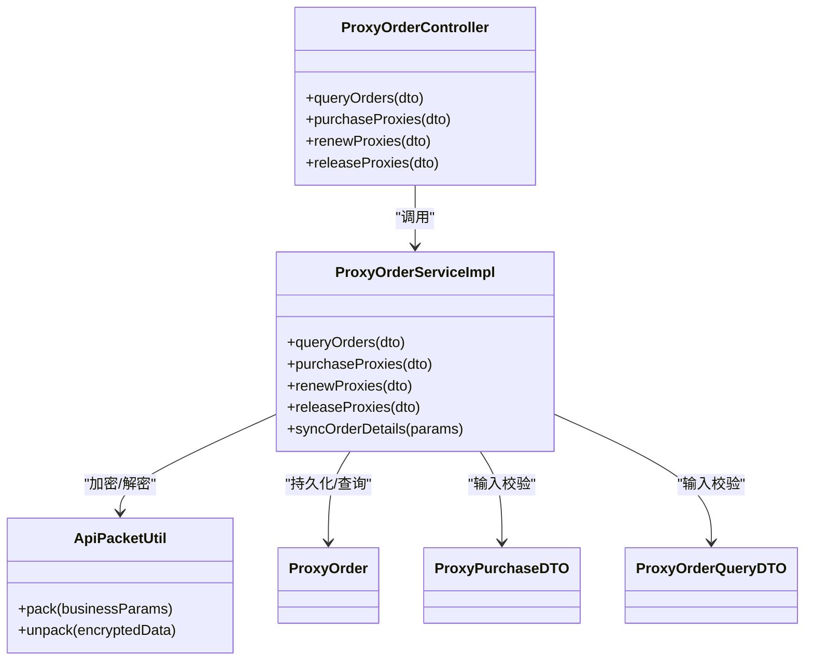

# 第三方 API 接口

<cite>
**本文引用的文件**
- [创建代理订单接口-第三方.md](file://docs/api/third-party/创建代理订单接口-第三方.md)
- [获取地域信息接口-第三方.md](file://docs/api/third-party/获取地域信息接口-第三方.md)
- [获取渠道商账户信息接口-第三方.md](file://docs/api/third-party/获取渠道商账户信息接口-第三方.md)
- [获取订单信息接口-第三方.md](file://docs/api/third-party/获取订单信息接口-第三方.md)
- [释放代理接口-第三方.md](file://docs/api/third-party/释放代理接口-第三方.md)
- [代理续费接口-第三方.md](file://docs/api/third-party/代理续费接口-第三方.md)
- [获取城市列表接口-第三方.md](file://docs/api/third-party/获取城市列表接口-第三方.md)
- [创建代理订单接口.md](file://docs/api/internal/创建代理订单接口.md)
- [获取代理订单列表接口.md](file://docs/api/internal/获取代理订单列表接口.md)
- [ProxyOrderController.java](file://src/main/java/cn/linkfast/controller/ProxyOrderController.java)
- [ProxyRegionController.java](file://src/main/java/cn/linkfast/controller/ProxyRegionController.java)
- [AccountController.java](file://src/main/java/cn/linkfast/controller/AccountController.java)
- [ProxyOrderServiceImpl.java](file://src/main/java/cn/linkfast/service/impl/ProxyOrderServiceImpl.java)
- [ApiPacketUtil.java](file://src/main/java/cn/linkfast/utils/ApiPacketUtil.java)
- [api.properties](file://src/main/resources/api.properties)
- [ProxyPurchaseDTO.java](file://src/main/java/cn/linkfast/dto/ProxyPurchaseDTO.java)
- [ProxyOrderQueryDTO.java](file://src/main/java/cn/linkfast/dto/ProxyOrderQueryDTO.java)
- [ProxyOrder.java](file://src/main/java/cn/linkfast/entity/ProxyOrder.java)
- [test-api.http](file://test-api.http)
</cite>

## 目录
1. [简介](#简介)
2. [项目结构](#项目结构)
3. [核心组件](#核心组件)
4. [架构总览](#架构总览)
5. [详细组件分析](#详细组件分析)
6. [依赖分析](#依赖分析)
7. [性能考虑](#性能考虑)
8. [故障排除指南](#故障排除指南)
9. [结论](#结论)
10. [附录](#附录)

## 简介
本文件面向第三方合作伙伴，提供 Link-Fast 与外部代理服务提供商之间的接口规范与集成指南。内容涵盖订单创建、地域查询、账户管理、订单状态查询、续费与释放等接口的请求参数、响应数据、错误处理、认证与安全协议、网络与防火墙要求、性能与限流建议以及测试与排障流程。

## 项目结构
Link-Fast 后端通过 Spring MVC 控制器对外暴露内部业务能力，同时封装与第三方代理服务的通信细节。第三方接口文档位于 docs/api/third-party 目录，内部接口文档位于 docs/api/internal 目录；核心控制器与服务实现位于 src/main/java/cn/linkfast/controller 与 src/main/java/cn/linkfast/service/impl；加密与网络工具位于 utils；第三方接口地址与密钥配置位于资源文件。

图表来源
- [ProxyOrderController.java:26-85](file://src/main/java/cn/linkfast/controller/ProxyOrderController.java#L26-L85)
- [ProxyRegionController.java:19-35](file://src/main/java/cn/linkfast/controller/ProxyRegionController.java#L19-L35)
- [AccountController.java:12-21](file://src/main/java/cn/linkfast/controller/AccountController.java#L12-L21)
- [ProxyOrderServiceImpl.java:37-87](file://src/main/java/cn/linkfast/service/impl/ProxyOrderServiceImpl.java#L37-L87)
- [ApiPacketUtil.java:17-51](file://src/main/java/cn/linkfast/utils/ApiPacketUtil.java#L17-L51)
- [api.properties:1-31](file://src/main/resources/api.properties#L1-L31)

章节来源
- [ProxyOrderController.java:26-85](file://src/main/java/cn/linkfast/controller/ProxyOrderController.java#L26-L85)
- [ProxyRegionController.java:19-35](file://src/main/java/cn/linkfast/controller/ProxyRegionController.java#L19-L35)
- [AccountController.java:12-21](file://src/main/java/cn/linkfast/controller/AccountController.java#L12-L21)
- [ProxyOrderServiceImpl.java:37-87](file://src/main/java/cn/linkfast/service/impl/ProxyOrderServiceImpl.java#L37-L87)
- [ApiPacketUtil.java:17-51](file://src/main/java/cn/linkfast/utils/ApiPacketUtil.java#L17-L51)
- [api.properties:1-31](file://src/main/resources/api.properties#L1-L31)

## 核心组件
- 订单相关接口：创建代理订单、续费代理、释放代理、查询订单信息。
- 地域与城市接口：获取地域树、获取城市列表。
- 账户信息接口：获取渠道商账户信息。
- 加密与网络工具：统一参数打包、AES-CBC 加解密、HTTP 请求封装。
- 配置中心：环境切换、第三方接口基础地址、路径与密钥。

章节来源
- [创建代理订单接口-第三方.md:1-110](file://docs/api/third-party/创建代理订单接口-第三方.md#L1-L110)
- [获取订单信息接口-第三方.md:1-49](file://docs/api/third-party/获取订单信息接口-第三方.md#L1-L49)
- [代理续费接口-第三方.md:1-31](file://docs/api/third-party/代理续费接口-第三方.md#L1-L31)
- [释放代理接口-第三方.md:1-22](file://docs/api/third-party/释放代理接口-第三方.md#L1-L22)
- [获取地域信息接口-第三方.md:1-30](file://docs/api/third-party/获取地域信息接口-第三方.md#L1-L30)
- [获取城市列表接口-第三方.md:1-36](file://docs/api/third-party/获取城市列表接口-第三方.md#L1-L36)
- [获取渠道商账户信息接口-第三方.md:1-21](file://docs/api/third-party/获取渠道商账户信息接口-第三方.md#L1-L21)
- [ApiPacketUtil.java:53-103](file://src/main/java/cn/linkfast/utils/ApiPacketUtil.java#L53-L103)
- [api.properties:14-31](file://src/main/resources/api.properties#L14-L31)

## 架构总览
第三方接口通过 Link-Fast 服务进行统一接入，服务端负责：
- 参数校验与业务编排（支付密码验证、库存校验、订单落库）。
- 与第三方代理服务进行加密通信（AES-CBC + Base64）。
- 异步回调与状态同步（通过订单信息查询接口与回调机制）。
- 错误分类与幂等控制（重试、不可回滚场景提示）。

图表来源
- [ProxyOrderController.java:44-47](file://src/main/java/cn/linkfast/controller/ProxyOrderController.java#L44-L47)
- [ProxyOrderServiceImpl.java:196-458](file://src/main/java/cn/linkfast/service/impl/ProxyOrderServiceImpl.java#L196-L458)
- [ApiPacketUtil.java:56-90](file://src/main/java/cn/linkfast/utils/ApiPacketUtil.java#L56-L90)
- [api.properties:16-17](file://src/main/resources/api.properties#L16-L17)

章节来源
- [ProxyOrderController.java:44-47](file://src/main/java/cn/linkfast/controller/ProxyOrderController.java#L44-L47)
- [ProxyOrderServiceImpl.java:196-458](file://src/main/java/cn/linkfast/service/impl/ProxyOrderServiceImpl.java#L196-L458)
- [ApiPacketUtil.java:56-90](file://src/main/java/cn/linkfast/utils/ApiPacketUtil.java#L56-L90)
- [api.properties:16-17](file://src/main/resources/api.properties#L16-L17)

## 详细组件分析

### 1) 创建代理订单接口
- 接口路径：/api/open/app/instance/open/v2（第三方）；/api/order/open（内部）
- 请求方式：POST
- Content-Type：application/json
- 认证与安全：请求参数需 AES-CBC 加密并 Base64 编码，包含 appKey、reqId、version 等公共字段
- 关键参数：
  - appOrderNo：渠道商订单号（幂等性依据）
  - params：购买产品列表，包含 productNo、count、cycleTimes 等
- 返回数据：orderNo、appOrderNo、amount
- 错误处理：支付密码错误、参数校验失败、库存不足、第三方业务失败等

图表来源
- [ProxyOrderServiceImpl.java:196-458](file://src/main/java/cn/linkfast/service/impl/ProxyOrderServiceImpl.java#L196-L458)
- [ApiPacketUtil.java:56-103](file://src/main/java/cn/linkfast/utils/ApiPacketUtil.java#L56-L103)
- [创建代理订单接口-第三方.md:8-110](file://docs/api/third-party/创建代理订单接口-第三方.md#L8-L110)
- [创建代理订单接口.md:12-125](file://docs/api/internal/创建代理订单接口.md#L12-L125)

章节来源
- [ProxyOrderServiceImpl.java:196-458](file://src/main/java/cn/linkfast/service/impl/ProxyOrderServiceImpl.java#L196-L458)
- [ApiPacketUtil.java:56-103](file://src/main/java/cn/linkfast/utils/ApiPacketUtil.java#L56-L103)
- [创建代理订单接口-第三方.md:8-110](file://docs/api/third-party/创建代理订单接口-第三方.md#L8-L110)
- [创建代理订单接口.md:12-125](file://docs/api/internal/创建代理订单接口.md#L12-L125)

### 2) 代理续费接口
- 接口路径：/api/open/app/instance/renew/v2
- 请求参数：appOrderNo、instances（含 instanceNo、cycleTimes 等）
- 返回数据：orderNo、appOrderNo、amount
- 错误处理：与创建订单一致的重试与不可回滚场景处理

章节来源
- [代理续费接口-第三方.md:1-31](file://docs/api/third-party/代理续费接口-第三方.md#L1-L31)
- [ProxyOrderServiceImpl.java:469-673](file://src/main/java/cn/linkfast/service/impl/ProxyOrderServiceImpl.java#L469-L673)

### 3) 释放代理接口
- 接口路径：/api/open/app/instance/release/v2
- 请求参数：appOrderNo、instances（平台实例编号列表）
- 返回数据：orderNo、appOrderNo、amount
- 错误处理：与创建/续费一致

章节来源
- [释放代理接口-第三方.md:1-22](file://docs/api/third-party/释放代理接口-第三方.md#L1-L22)
- [ProxyOrderServiceImpl.java:675-800](file://src/main/java/cn/linkfast/service/impl/ProxyOrderServiceImpl.java#L675-L800)

### 4) 订单状态查询接口
- 接口路径：/api/open/app/order/v2
- 请求参数：orderNo 或 appOrderNo 至少传其一，支持分页
- 返回数据：订单与实例列表、状态、到期时间、流量等

章节来源
- [获取订单信息接口-第三方.md:1-49](file://docs/api/third-party/获取订单信息接口-第三方.md#L1-L49)
- [ProxyOrderServiceImpl.java:89-136](file://src/main/java/cn/linkfast/service/impl/ProxyOrderServiceImpl.java#L89-L136)

### 5) 地域与城市查询接口
- 地域树：/api/open/app/area/v2
- 城市列表：/api/open/app/city/list/v2
- 返回数据：地域/城市代码与层级关系、国家/洲信息等

章节来源
- [获取地域信息接口-第三方.md:1-30](file://docs/api/third-party/获取地域信息接口-第三方.md#L1-L30)
- [获取城市列表接口-第三方.md:1-36](file://docs/api/third-party/获取城市列表接口-第三方.md#L1-L36)
- [ProxyRegionController.java:30-35](file://src/main/java/cn/linkfast/controller/ProxyRegionController.java#L30-L35)

### 6) 账户信息接口
- 接口路径：/api/open/app/info/v2
- 返回数据：appName、coin、credit、useBridge、callbackUrl、status

章节来源
- [获取渠道商账户信息接口-第三方.md:1-21](file://docs/api/third-party/获取渠道商账户信息接口-第三方.md#L1-L21)
- [AccountController.java:17-21](file://src/main/java/cn/linkfast/controller/AccountController.java#L17-L21)

### 7) 内部订单查询接口（供内部使用）
- 接口路径：/api/order/list
- 请求参数：status、pageNum、pageSize、orderType、orderNo
- 返回数据：分页订单列表与统计

章节来源
- [获取代理订单列表接口.md:1-122](file://docs/api/internal/获取代理订单列表接口.md#L1-L122)
- [ProxyOrderController.java:36-39](file://src/main/java/cn/linkfast/controller/ProxyOrderController.java#L36-L39)
- [ProxyOrderQueryDTO.java:18-57](file://src/main/java/cn/linkfast/dto/ProxyOrderQueryDTO.java#L18-L57)

## 依赖分析
- 控制器层：ProxyOrderController、ProxyRegionController、AccountController 负责路由与参数校验。
- 服务层：ProxyOrderServiceImpl 负责业务编排、加密打包、网络请求、错误分类与回写。
- 工具层：ApiPacketUtil 负责 AES-CBC 加解密与请求封装。
- 配置层：api.properties 提供环境、基础URL、接口路径与密钥。
- 数据模型：ProxyOrder、ProxyPurchaseDTO、ProxyOrderQueryDTO 等承载请求/响应结构。

图表来源
- [ProxyOrderController.java:26-85](file://src/main/java/cn/linkfast/controller/ProxyOrderController.java#L26-L85)
- [ProxyOrderServiceImpl.java:37-87](file://src/main/java/cn/linkfast/service/impl/ProxyOrderServiceImpl.java#L37-L87)
- [ApiPacketUtil.java:17-103](file://src/main/java/cn/linkfast/utils/ApiPacketUtil.java#L17-L103)
- [ProxyOrder.java:19-45](file://src/main/java/cn/linkfast/entity/ProxyOrder.java#L19-L45)
- [ProxyPurchaseDTO.java:10-22](file://src/main/java/cn/linkfast/dto/ProxyPurchaseDTO.java#L10-L22)
- [ProxyOrderQueryDTO.java:18-57](file://src/main/java/cn/linkfast/dto/ProxyOrderQueryDTO.java#L18-L57)

章节来源
- [ProxyOrderController.java:26-85](file://src/main/java/cn/linkfast/controller/ProxyOrderController.java#L26-L85)
- [ProxyOrderServiceImpl.java:37-87](file://src/main/java/cn/linkfast/service/impl/ProxyOrderServiceImpl.java#L37-L87)
- [ApiPacketUtil.java:17-103](file://src/main/java/cn/linkfast/utils/ApiPacketUtil.java#L17-L103)
- [ProxyOrder.java:19-45](file://src/main/java/cn/linkfast/entity/ProxyOrder.java#L19-L45)
- [ProxyPurchaseDTO.java:10-22](file://src/main/java/cn/linkfast/dto/ProxyPurchaseDTO.java#L10-L22)
- [ProxyOrderQueryDTO.java:18-57](file://src/main/java/cn/linkfast/dto/ProxyOrderQueryDTO.java#L18-L57)

## 性能考虑
- 网络重试：对连接失败（ConnectException/UnknownHostException）进行最多3次指数退避重试，避免重复下单。
- 响应解析：严格校验第三方响应的 code、data 节点与解密结果，防止脏数据导致的重复处理。
- 并发与异步：库存校验与产品信息异步刷新，降低下单链路阻塞。
- 分页查询：内部订单列表接口支持分页，建议第三方在查询订单时也采用分页策略减少一次性数据量。
- 环境切换：通过配置文件切换沙盒/生产环境，避免误用。

章节来源
- [ProxyOrderServiceImpl.java:343-451](file://src/main/java/cn/linkfast/service/impl/ProxyOrderServiceImpl.java#L343-L451)
- [ProxyOrderServiceImpl.java:552-672](file://src/main/java/cn/linkfast/service/impl/ProxyOrderServiceImpl.java#L552-L672)
- [ProxyOrderServiceImpl.java:717-742](file://src/main/java/cn/linkfast/service/impl/ProxyOrderServiceImpl.java#L717-L742)
- [获取代理订单列表接口.md:12-122](file://docs/api/internal/获取代理订单列表接口.md#L12-L122)
- [api.properties:1-11](file://src/main/resources/api.properties#L1-L11)

## 故障排除指南
- 支付密码错误：检查支付密码是否正确，确保与内部校验一致。
- 参数校验失败：核对必填字段与格式，参考接口文档中的字段说明。
- 库存不足：确认产品库存是否满足购买数量。
- 第三方业务失败：查看响应中的错误码与消息，必要时联系管理员确认订单结果。
- 响应为空或非法：确认网络连通性与第三方服务状态，必要时重试。
- 解密失败：检查 appSecret 与 AES IV 配置是否匹配当前环境。

章节来源
- [ProxyOrderServiceImpl.java:196-458](file://src/main/java/cn/linkfast/service/impl/ProxyOrderServiceImpl.java#L196-L458)
- [ProxyOrderServiceImpl.java:469-673](file://src/main/java/cn/linkfast/service/impl/ProxyOrderServiceImpl.java#L469-L673)
- [ProxyOrderServiceImpl.java:675-800](file://src/main/java/cn/linkfast/service/impl/ProxyOrderServiceImpl.java#L675-L800)
- [创建代理订单接口.md:94-125](file://docs/api/internal/创建代理订单接口.md#L94-L125)
- [获取代理订单列表接口.md:98-122](file://docs/api/internal/获取代理订单列表接口.md#L98-L122)

## 结论
本接口文档基于 Link-Fast 代码实现与第三方接口文档整理而成，明确了请求/响应格式、认证与安全协议、错误处理策略与网络配置要点。建议合作伙伴在集成时严格遵循参数校验、加密打包与幂等控制，并结合重试与监控策略保障稳定性。

## 附录

### A. 接口清单与路径映射
- 创建代理订单：/api/open/app/instance/open/v2（第三方）；/api/order/open（内部）
- 代理续费：/api/open/app/instance/renew/v2
- 释放代理：/api/open/app/instance/release/v2
- 订单查询：/api/open/app/order/v2
- 地域树：/api/open/app/area/v2
- 城市列表：/api/open/app/city/list/v2
- 账户信息：/api/open/app/info/v2

章节来源
- [创建代理订单接口-第三方.md:3](file://docs/api/third-party/创建代理订单接口-第三方.md#L3)
- [代理续费接口-第三方.md:3](file://docs/api/third-party/代理续费接口-第三方.md#L3)
- [释放代理接口-第三方.md:3](file://docs/api/third-party/释放代理接口-第三方.md#L3)
- [获取订单信息接口-第三方.md:2](file://docs/api/third-party/获取订单信息接口-第三方.md#L2)
- [获取地域信息接口-第三方.md:3](file://docs/api/third-party/获取地域信息接口-第三方.md#L3)
- [获取城市列表接口-第三方.md:3](file://docs/api/third-party/获取城市列表接口-第三方.md#L3)
- [获取渠道商账户信息接口-第三方.md:3](file://docs/api/third-party/获取渠道商账户信息接口-第三方.md#L3)

### B. 认证与安全协议
- 加密算法：AES-CBC
- 编码方式：Base64
- 公共参数：version、encrypt、appKey、reqId
- 环境配置：sandbox/prod 两套基础URL与密钥

章节来源
- [ApiPacketUtil.java:56-103](file://src/main/java/cn/linkfast/utils/ApiPacketUtil.java#L56-L103)
- [api.properties:1-11](file://src/main/resources/api.properties#L1-L11)

### C. 测试环境与示例
- 测试示例：GET /api/proxy-product/list?countryCode=US&cityCode=NY&page=1&pageSize=10
- 建议：在沙盒环境先行联调，确认加密参数与网络连通性后再切生产

章节来源
- [test-api.http:1-3](file://test-api.http#L1-L3)
- [api.properties:4-5](file://src/main/resources/api.properties#L4-L5)