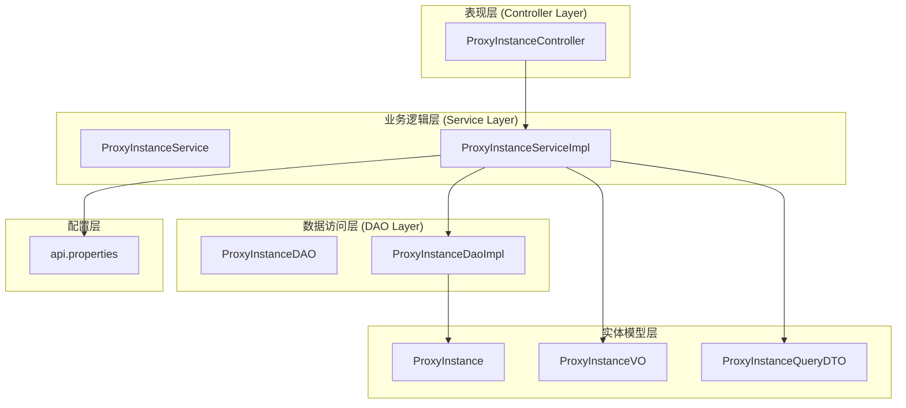
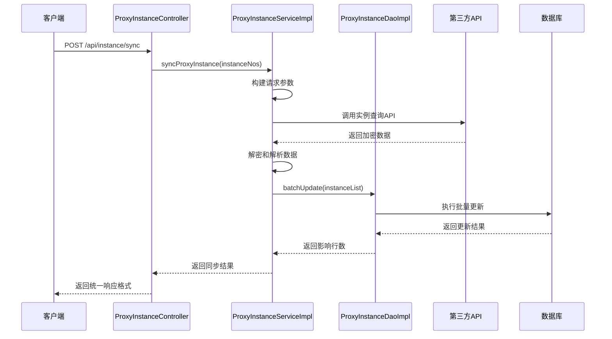
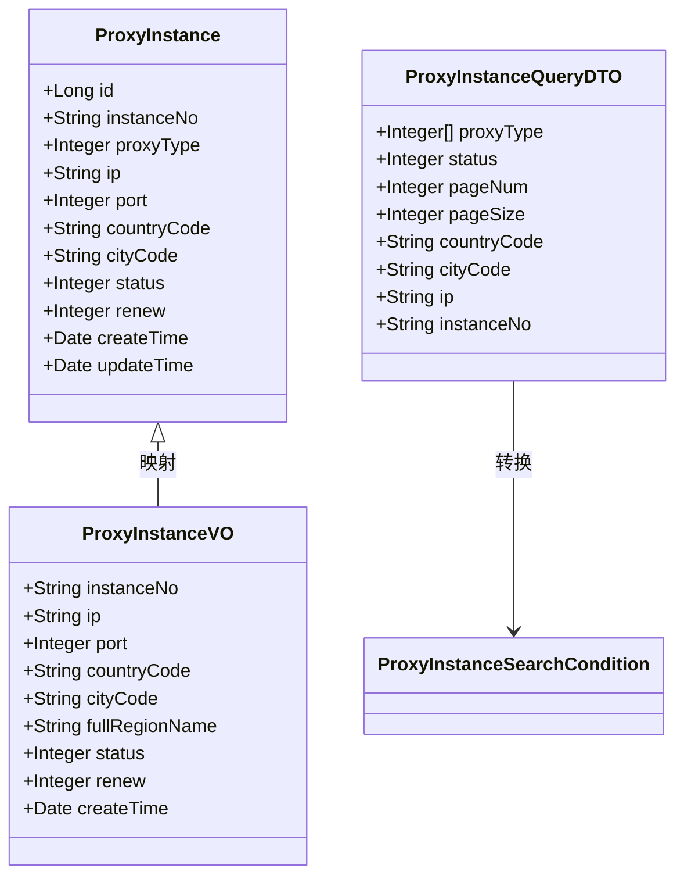
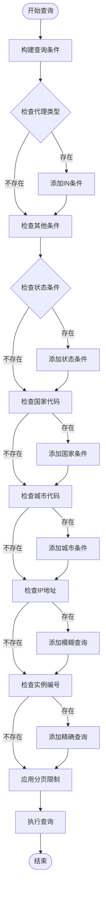
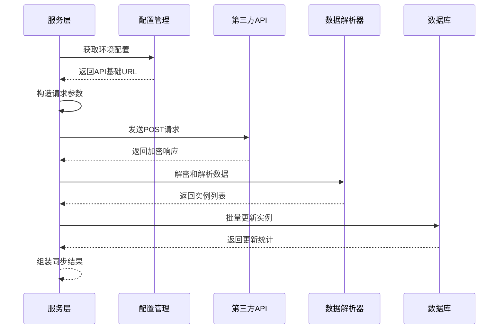
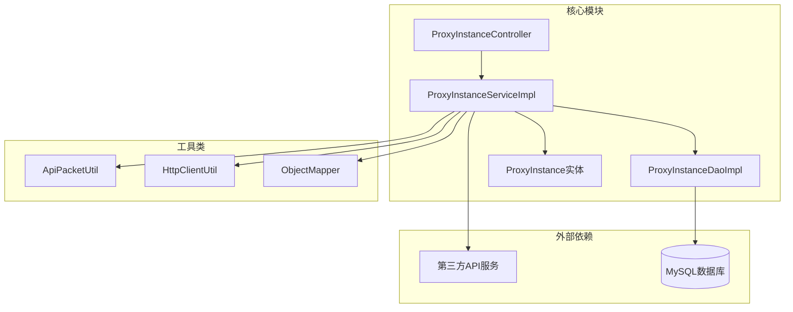

# 获取代理实例信息接口

<cite>
**本文档引用的文件**
- [ProxyInstanceController.java](file://src/main/java/cn/linkfast/controller/ProxyInstanceController.java)
- [ProxyInstanceService.java](file://src/main/java/cn/linkfast/service/ProxyInstanceService.java)
- [ProxyInstanceServiceImpl.java](file://src/main/java/cn/linkfast/service/impl/ProxyInstanceServiceImpl.java)
- [ProxyInstanceDAO.java](file://src/main/java/cn/linkfast/dao/ProxyInstanceDAO.java)
- [ProxyInstanceDaoImpl.java](file://src/main/java/cn/linkfast/dao/impl/ProxyInstanceDaoImpl.java)
- [ProxyInstanceQueryDTO.java](file://src/main/java/cn/linkfast/dto/ProxyInstanceQueryDTO.java)
- [ProxyInstanceSearchCondition.java](file://src/main/java/cn/linkfast/dto/ProxyInstanceSearchCondition.java)
- [ProxyInstanceVO.java](file://src/main/java/cn/linkfast/vo/ProxyInstanceVO.java)
- [ProxyInstance.java](file://src/main/java/cn/linkfast/entity/ProxyInstance.java)
- [api.properties](file://src/main/resources/api.properties)
- [获取代理实例信息接口.md](file://docs/api/third-party/获取代理实例信息接口.md)
- [ProxyInstanceControllerIT.java](file://src/test/java/cn/linkfast/controller/ProxyInstanceControllerIT.java)
- [Result.java](file://src/main/java/cn/linkfast/common/Result.java)
- [PageResult.java](file://src/main/java/cn/linkfast/common/PageResult.java)
</cite>

## 目录
1. [简介](#简介)
2. [项目结构](#项目结构)
3. [核心组件](#核心组件)
4. [架构概览](#架构概览)
5. [详细组件分析](#详细组件分析)
6. [依赖关系分析](#依赖关系分析)
7. [性能考虑](#性能考虑)
8. [故障排除指南](#故障排除指南)
9. [结论](#结论)

## 简介

本文档详细介绍了Link-Fast项目中的"获取代理实例信息接口"，这是一个基于Spring Boot的RESTful API接口，用于从第三方代理服务提供商处获取代理实例的实时信息，并将其同步到本地数据库中。

该接口实现了完整的代理实例生命周期管理功能，包括实例信息查询、同步、状态管理和数据展示等核心功能。系统采用分层架构设计，确保了代码的可维护性和扩展性。

## 项目结构

项目采用标准的Maven分层架构，主要包含以下层次：

**图表来源**
- [ProxyInstanceController.java:1-94](file://src/main/java/cn/linkfast/controller/ProxyInstanceController.java#L1-L94)
- [ProxyInstanceServiceImpl.java:1-247](file://src/main/java/cn/linkfast/service/impl/ProxyInstanceServiceImpl.java#L1-L247)
- [ProxyInstanceDaoImpl.java:1-209](file://src/main/java/cn/linkfast/dao/impl/ProxyInstanceDaoImpl.java#L1-L209)

**章节来源**
- [ProxyInstanceController.java:18-25](file://src/main/java/cn/linkfast/controller/ProxyInstanceController.java#L18-L25)
- [ProxyInstanceService.java:11-14](file://src/main/java/cn/linkfast/service/ProxyInstanceService.java#L11-L14)

## 核心组件

### 控制器层 (Controller Layer)

**ProxyInstanceController** 是代理实例信息接口的主要入口点，提供了以下核心功能：

- **实例列表查询**：支持分页查询和多条件筛选
- **实例信息同步**：从第三方API获取最新实例数据
- **备注更新**：支持更新代理实例的备注信息
- **自动续费状态管理**：控制代理实例的自动续费功能

### 服务层 (Service Layer)

**ProxyInstanceServiceImpl** 实现了完整的业务逻辑处理：

- **第三方API集成**：负责与外部代理服务提供商的通信
- **数据同步处理**：处理加密数据的解密和解析
- **批量数据更新**：优化数据库操作性能
- **地域信息关联**：提供国家和城市名称的拼接功能

### 数据访问层 (DAO Layer)

**ProxyInstanceDaoImpl** 提供了底层数据操作能力：

- **批量更新操作**：高效的实例信息批量更新
- **条件查询**：支持多种查询条件的组合
- **统计计数**：提供数据统计和分页支持
- **JSON序列化**：处理复杂数据类型的存储

**章节来源**
- [ProxyInstanceController.java:29-90](file://src/main/java/cn/linkfast/controller/ProxyInstanceController.java#L29-L90)
- [ProxyInstanceServiceImpl.java:87-146](file://src/main/java/cn/linkfast/service/impl/ProxyInstanceServiceImpl.java#L87-L146)
- [ProxyInstanceDaoImpl.java:32-107](file://src/main/java/cn/linkfast/dao/impl/ProxyInstanceDaoImpl.java#L32-L107)

## 架构概览

系统采用经典的三层架构模式，通过清晰的职责分离实现了高内聚低耦合的设计原则：

**图表来源**
- [ProxyInstanceController.java:61-76](file://src/main/java/cn/linkfast/controller/ProxyInstanceController.java#L61-L76)
- [ProxyInstanceServiceImpl.java:87-119](file://src/main/java/cn/linkfast/service/impl/ProxyInstanceServiceImpl.java#L87-L119)
- [ProxyInstanceDaoImpl.java:32-88](file://src/main/java/cn/linkfast/dao/impl/ProxyInstanceDaoImpl.java#L32-L88)

## 详细组件分析

### 数据模型设计

系统采用了完整而规范的数据模型设计，确保了数据的一致性和完整性：

**图表来源**
- [ProxyInstance.java:13-57](file://src/main/java/cn/linkfast/entity/ProxyInstance.java#L13-L57)
- [ProxyInstanceVO.java:13-45](file://src/main/java/cn/linkfast/vo/ProxyInstanceVO.java#L13-L45)
- [ProxyInstanceQueryDTO.java:15-65](file://src/main/java/cn/linkfast/dto/ProxyInstanceQueryDTO.java#L15-L65)

### 查询条件处理机制

系统实现了灵活的查询条件处理机制，支持多种查询场景：

**图表来源**
- [ProxyInstanceServiceImpl.java:58-73](file://src/main/java/cn/linkfast/service/impl/ProxyInstanceServiceImpl.java#L58-L73)
- [ProxyInstanceDaoImpl.java:135-157](file://src/main/java/cn/linkfast/dao/impl/ProxyInstanceDaoImpl.java#L135-L157)

### 数据同步流程

系统实现了高效的数据同步机制，确保本地数据与第三方服务保持一致：

**图表来源**
- [ProxyInstanceServiceImpl.java:87-119](file://src/main/java/cn/linkfast/service/impl/ProxyInstanceServiceImpl.java#L87-L119)
- [ProxyInstanceServiceImpl.java:215-244](file://src/main/java/cn/linkfast/service/impl/ProxyInstanceServiceImpl.java#L215-L244)

**章节来源**
- [ProxyInstanceServiceImpl.java:121-146](file://src/main/java/cn/linkfast/service/impl/ProxyInstanceServiceImpl.java#L121-L146)
- [ProxyInstanceDaoImpl.java:90-107](file://src/main/java/cn/linkfast/dao/impl/ProxyInstanceDaoImpl.java#L90-L107)

## 依赖关系分析

系统各层之间的依赖关系清晰明确，遵循了依赖倒置原则：

**图表来源**
- [ProxyInstanceController.java:27](file://src/main/java/cn/linkfast/controller/ProxyInstanceController.java#L27)
- [ProxyInstanceServiceImpl.java:39-42](file://src/main/java/cn/linkfast/service/impl/ProxyInstanceServiceImpl.java#L39-L42)
- [ProxyInstanceDaoImpl.java:29-30](file://src/main/java/cn/linkfast/dao/impl/ProxyInstanceDaoImpl.java#L29-L30)

### 关键配置项

系统通过配置文件实现了环境隔离和灵活部署：

| 配置项 | 开发环境 | 生产环境 | 说明 |
|--------|----------|----------|------|
| api.ipv.env | sandbox | prod | 环境标识 |
| api.ipv.sandbox_url | https://sandbox.ipipv.com | - | 测试环境基础URL |
| api.ipv.prod_url | - | https://api.ipipv.com | 生产环境基础URL |
| api.ipv.path.instance_query | /api/open/app/instance/v2 | /api/open/app/instance/v2 | 实例查询接口路径 |

**章节来源**
- [api.properties:1-31](file://src/main/resources/api.properties#L1-L31)
- [ProxyInstanceServiceImpl.java:44-56](file://src/main/java/cn/linkfast/service/impl/ProxyInstanceServiceImpl.java#L44-L56)

## 性能考虑

系统在设计时充分考虑了性能优化，采用了多种策略提升响应速度和吞吐量：

### 数据库优化策略

1. **批量操作优化**：使用JDBC批处理减少数据库交互次数
2. **N+1查询优化**：通过一次性查询所有地域信息避免重复查询
3. **索引友好设计**：在常用查询字段上建立适当的索引
4. **连接池管理**：合理配置数据库连接池参数

### 缓存策略

1. **地域信息缓存**：批量加载的地域信息进行内存缓存
2. **查询结果缓存**：对热点查询结果进行短期缓存
3. **配置信息缓存**：环境配置信息在启动时加载并缓存

### 异步处理

对于耗时较长的操作，系统支持异步处理模式，避免阻塞主线程。

## 故障排除指南

### 常见问题及解决方案

#### 1. 第三方API调用失败

**症状**：接口返回"同步失败"错误信息

**可能原因**：
- 网络连接异常
- 认证信息过期
- 请求参数格式错误

**解决步骤**：
1. 检查网络连接状态
2. 验证API密钥的有效性
3. 确认请求参数格式正确

#### 2. 数据库连接异常

**症状**：批量更新操作抛出异常

**解决步骤**：
1. 检查数据库连接配置
2. 验证数据库服务状态
3. 查看数据库连接池配置

#### 3. 查询性能问题

**症状**：查询响应时间过长

**优化建议**：
1. 为常用查询字段添加索引
2. 优化查询条件，避免全表扫描
3. 调整分页大小参数

**章节来源**
- [ProxyInstanceControllerIT.java:49-107](file://src/test/java/cn/linkfast/controller/ProxyInstanceControllerIT.java#L49-L107)
- [ProxyInstanceServiceImpl.java:78-85](file://src/main/java/cn/linkfast/service/impl/ProxyInstanceServiceImpl.java#L78-L85)

## 结论

"获取代理实例信息接口"是Link-Fast项目中的核心功能模块，通过精心设计的分层架构和优化的性能策略，实现了高效、可靠的代理实例信息管理功能。

该接口的主要优势包括：

1. **完整的功能覆盖**：支持实例信息查询、同步、状态管理等核心功能
2. **良好的扩展性**：清晰的分层设计便于功能扩展和维护
3. **高性能设计**：采用批量操作、缓存策略等优化手段
4. **完善的错误处理**：提供详细的错误信息和恢复机制
5. **灵活的配置管理**：支持多环境部署和动态配置调整

通过本文档的详细分析，开发者可以深入理解该接口的设计理念和实现细节，为后续的功能扩展和维护工作提供有力支撑。