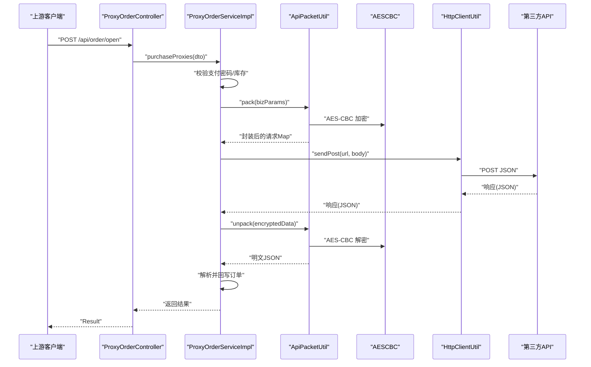
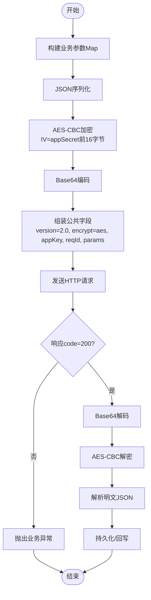
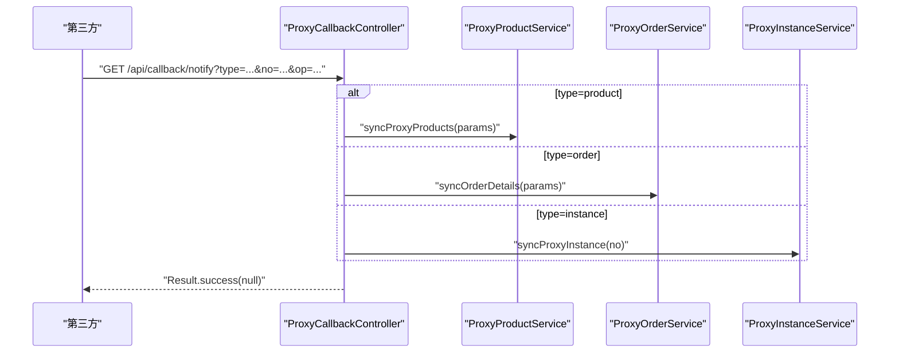
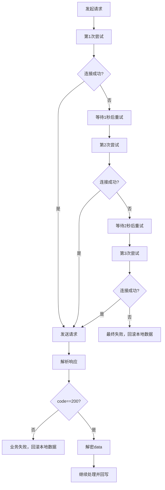
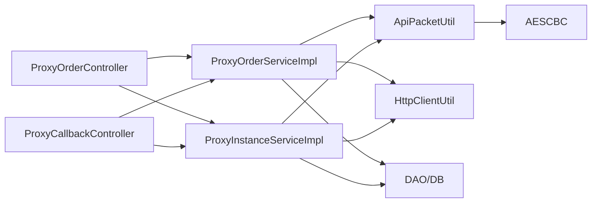

# 第三方 API 集成

<cite>
**本文引用的文件**   
- [AESCBC.java](file://src/main/java/cn/linkfast/utils/AESCBC.java)
- [ApiPacketUtil.java](file://src/main/java/cn/linkfast/utils/ApiPacketUtil.java)
- [HttpClientUtil.java](file://src/main/java/cn/linkfast/utils/HttpClientUtil.java)
- [ProxyOrderServiceImpl.java](file://src/main/java/cn/linkfast/service/impl/ProxyOrderServiceImpl.java)
- [ProxyInstanceServiceImpl.java](file://src/main/java/cn/linkfast/service/impl/ProxyInstanceServiceImpl.java)
- [ProxyCallbackController.java](file://src/main/java/cn/linkfast/controller/ProxyCallbackController.java)
- [ProxyOrderController.java](file://src/main/java/cn/linkfast/controller/ProxyOrderController.java)
- [api.properties](file://src/main/resources/api.properties)
- [创建代理订单接口-第三方.md](file://docs/api/third-party/创建代理订单接口-第三方.md)
- [代理续费接口-第三方.md](file://docs/api/third-party/代理续费接口-第三方.md)
- [释放代理接口-第三方.md](file://docs/api/third-party/释放代理接口-第三方.md)
- [创建代理订单接口.md](file://docs/api/internal/创建代理订单接口.md)
- [GlobalExceptionHandler.java](file://src/main/java/cn/linkfast/exception/GlobalExceptionHandler.java)
- [ProxyOrder.java](file://src/main/java/cn/linkfast/entity/ProxyOrder.java)
- [AESCBCTest.java](file://src/test/java/cn/linkfast/utils/AESCBCTest.java)
- [test-api.http](file://test-api.http)
</cite>

## 目录
1. [简介](#简介)
2. [项目结构](#项目结构)
3. [核心组件](#核心组件)
4. [架构总览](#架构总览)
5. [详细组件分析](#详细组件分析)
6. [依赖分析](#依赖分析)
7. [性能考虑](#性能考虑)
8. [故障排除指南](#故障排除指南)
9. [结论](#结论)
10. [附录](#附录)

## 简介
本文件面向集成开发者，系统化说明 Link-Fast 与外部代理服务提供商的第三方 API 集成方案。内容覆盖内部 API 与第三方 API 的接口规范、数据格式、加密机制与安全验证、回调处理机制（异步通知、状态同步、错误重试）、加密通信实现（AES-CBC、签名与数据完整性）、版本管理与升级策略、网络异常处理与熔断降级实践，以及调试工具、测试环境与故障排除指南。

## 项目结构
Link-Fast 采用典型的三层结构：控制器层负责对外暴露内部 API；服务层编排业务流程并与第三方 API 交互；工具层提供加密、网络请求与数据包封装能力；资源层提供配置与文档。

```mermaid
graph TB
subgraph "控制器层"
C_Order["ProxyOrderController"]
C_Callback["ProxyCallbackController"]
end
subgraph "服务层"
S_Order["ProxyOrderServiceImpl"]
S_Instance["ProxyInstanceServiceImpl"]
end
subgraph "工具层"
U_AESEnc["AESCBC"]
U_Packet["ApiPacketUtil"]
U_HTTP["HttpClientUtil"]
end
subgraph "配置与文档"
R_APIProps["api.properties"]
D_TP_Create["创建代理订单接口-第三方.md"]
D_TP_Renew["代理续费接口-第三方.md"]
D_TP_Release["释放代理接口-第三方.md"]
D_Int_Create["创建代理订单接口.md"]
end
C_Order --> S_Order
C_Callback --> S_Order
C_Callback --> S_Instance
S_Order --> U_Packet
S_Order --> U_HTTP
S_Instance --> U_Packet
S_Instance --> U_HTTP
U_Packet --> U_AESEnc
R_APIProps -.-> S_Order
R_APIProps -.-> S_Instance
D_TP_Create -.-> S_Order
D_TP_Renew -.-> S_Order
D_TP_Release -.-> S_Order
D_Int_Create -.-> C_Order
```

图表来源
- [ProxyOrderController.java:1-86](file://src/main/java/cn/linkfast/controller/ProxyOrderController.java#L1-L86)
- [ProxyCallbackController.java:1-92](file://src/main/java/cn/linkfast/controller/ProxyCallbackController.java#L1-L92)
- [ProxyOrderServiceImpl.java:1-820](file://src/main/java/cn/linkfast/service/impl/ProxyOrderServiceImpl.java#L1-L820)
- [ProxyInstanceServiceImpl.java:1-195](file://src/main/java/cn/linkfast/service/impl/ProxyInstanceServiceImpl.java#L1-L195)
- [ApiPacketUtil.java:1-103](file://src/main/java/cn/linkfast/utils/ApiPacketUtil.java#L1-L103)
- [AESCBC.java:1-36](file://src/main/java/cn/linkfast/utils/AESCBC.java#L1-L36)
- [HttpClientUtil.java:1-45](file://src/main/java/cn/linkfast/utils/HttpClientUtil.java#L1-L45)
- [api.properties:1-31](file://src/main/resources/api.properties#L1-L31)

章节来源
- [ProxyOrderController.java:1-86](file://src/main/java/cn/linkfast/controller/ProxyOrderController.java#L1-L86)
- [ProxyCallbackController.java:1-92](file://src/main/java/cn/linkfast/controller/ProxyCallbackController.java#L1-L92)
- [ProxyOrderServiceImpl.java:1-820](file://src/main/java/cn/linkfast/service/impl/ProxyOrderServiceImpl.java#L1-L820)
- [ProxyInstanceServiceImpl.java:1-195](file://src/main/java/cn/linkfast/service/impl/ProxyInstanceServiceImpl.java#L1-L195)
- [ApiPacketUtil.java:1-103](file://src/main/java/cn/linkfast/utils/ApiPacketUtil.java#L1-L103)
- [AESCBC.java:1-36](file://src/main/java/cn/linkfast/utils/AESCBC.java#L1-L36)
- [HttpClientUtil.java:1-45](file://src/main/java/cn/linkfast/utils/HttpClientUtil.java#L1-L45)
- [api.properties:1-31](file://src/main/resources/api.properties#L1-L31)

## 核心组件
- 加密与数据包封装
  - AESCBC：提供 AES-CBC 加密与解密能力，使用 PKCS5Padding。
  - ApiPacketUtil：负责业务参数序列化、AES-CBC 加密、Base64 编码、公共字段组装（version、encrypt、appKey、reqId、params），以及响应数据解密。
- HTTP 客户端
  - HttpClientUtil：基于 Apache HttpClient 5 的简单封装，统一发送 POST JSON 请求，非 2xx 状态时返回包含状态码的 JSON，便于上层按业务 code 解析。
- 业务服务
  - ProxyOrderServiceImpl：编排与第三方 API 的交互，包括创建订单、续费、释放、订单详情同步；内置重试与幂等处理；统一封装/解密响应；回写本地订单。
  - ProxyInstanceServiceImpl：实例查询与同步，支持按实例号批量查询并回写数据库。
- 控制器
  - ProxyOrderController：对外暴露内部 API（创建订单、续费、释放、查询列表）。
  - ProxyCallbackController：接收第三方异步回调，按 type 分发至产品、订单或实例同步逻辑。
- 配置
  - api.properties：环境切换（prod/sandbox）、基础 URL、各接口路径、appKey/appSecret。

章节来源
- [AESCBC.java:1-36](file://src/main/java/cn/linkfast/utils/AESCBC.java#L1-L36)
- [ApiPacketUtil.java:1-103](file://src/main/java/cn/linkfast/utils/ApiPacketUtil.java#L1-L103)
- [HttpClientUtil.java:1-45](file://src/main/java/cn/linkfast/utils/HttpClientUtil.java#L1-L45)
- [ProxyOrderServiceImpl.java:1-820](file://src/main/java/cn/linkfast/service/impl/ProxyOrderServiceImpl.java#L1-L820)
- [ProxyInstanceServiceImpl.java:1-195](file://src/main/java/cn/linkfast/service/impl/ProxyInstanceServiceImpl.java#L1-L195)
- [ProxyOrderController.java:1-86](file://src/main/java/cn/linkfast/controller/ProxyOrderController.java#L1-L86)
- [ProxyCallbackController.java:1-92](file://src/main/java/cn/linkfast/controller/ProxyCallbackController.java#L1-L92)
- [api.properties:1-31](file://src/main/resources/api.properties#L1-L31)

## 架构总览
Link-Fast 通过内部 API 接收上游请求，服务层将业务参数按 v2 规范封装并加密，经 HTTP 客户端发送至第三方 API。第三方返回的响应包含业务 code 与加密 data，服务层解密后持久化或回写本地订单状态。同时，第三方通过回调通知平台变更事件，平台据此同步产品、订单或实例数据。

图表来源
- [ProxyOrderController.java:1-86](file://src/main/java/cn/linkfast/controller/ProxyOrderController.java#L1-L86)
- [ProxyOrderServiceImpl.java:1-820](file://src/main/java/cn/linkfast/service/impl/ProxyOrderServiceImpl.java#L1-L820)
- [ApiPacketUtil.java:1-103](file://src/main/java/cn/linkfast/utils/ApiPacketUtil.java#L1-L103)
- [AESCBC.java:1-36](file://src/main/java/cn/linkfast/utils/AESCBC.java#L1-L36)
- [HttpClientUtil.java:1-45](file://src/main/java/cn/linkfast/utils/HttpClientUtil.java#L1-L45)

## 详细组件分析

### 接口规范与数据格式
- 内部 API
  - 创建代理订单：见 [创建代理订单接口.md:1-125](file://docs/api/internal/创建代理订单接口.md#L1-L125)，请求体包含支付密码、订单类型、总数量与购买参数数组；返回统一 Result 结构。
- 第三方 API
  - 创建订单：见 [创建代理订单接口-第三方.md:1-110](file://docs/api/third-party/创建代理订单接口-第三方.md#L1-L110)，请求路径为 /api/open/app/instance/open/v2，公共字段 version=2.0、encrypt=aes、appKey、reqId、params（Base64）；返回 orderNo、appOrderNo、amount。
  - 续费代理：见 [代理续费接口-第三方.md:1-31](file://docs/api/third-party/代理续费接口-第三方.md#L1-L31)，请求路径为 /api/open/app/instance/renew/v2，params 中包含 appOrderNo 与 instances 数组。
  - 释放代理：见 [释放代理接口-第三方.md:1-22](file://docs/api/third-party/释放代理接口-第三方.md#L1-L22)，请求路径为 /api/open/app/instance/release/v2，params 中包含 appOrderNo 与 instances 数组。
- 响应格式
  - 第三方返回 JSON，包含 code、msg、data；服务层仅在 code=200 时解密 data 字段，否则抛出业务异常。

章节来源
- [创建代理订单接口.md:1-125](file://docs/api/internal/创建代理订单接口.md#L1-L125)
- [创建代理订单接口-第三方.md:1-110](file://docs/api/third-party/创建代理订单接口-第三方.md#L1-L110)
- [代理续费接口-第三方.md:1-31](file://docs/api/third-party/代理续费接口-第三方.md#L1-L31)
- [释放代理接口-第三方.md:1-22](file://docs/api/third-party/释放代理接口-第三方.md#L1-L22)

### 加密通信与安全验证
- 加密算法
  - AES-CBC，填充方式 PKCS5Padding；IV 来源于 appSecret 的前 16 字节；key 为 appSecret。
- 数据包封装
  - 业务参数 Map 序列化为 JSON，AES-CBC 加密后 Base64 编码，作为 params 字段；公共字段包含 version、encrypt、appKey、reqId。
- 解密流程
  - 服务层从响应 JSON 中取出 data，Base64 解码后 AES-CBC 解密，得到明文 JSON。
- 安全要点
  - appKey/appSecret 通过环境配置切换（prod/sandbox）；请求需携带 appKey 与 reqId，用于幂等与溯源。
  - 测试用例覆盖了不同长度 key/iv 与异常场景，确保加密/解密健壮性。

图表来源
- [ApiPacketUtil.java:56-102](file://src/main/java/cn/linkfast/utils/ApiPacketUtil.java#L56-L102)
- [AESCBC.java:20-30](file://src/main/java/cn/linkfast/utils/AESCBC.java#L20-L30)
- [ProxyOrderServiceImpl.java:173-194](file://src/main/java/cn/linkfast/service/impl/ProxyOrderServiceImpl.java#L173-L194)

章节来源
- [ApiPacketUtil.java:1-103](file://src/main/java/cn/linkfast/utils/ApiPacketUtil.java#L1-L103)
- [AESCBC.java:1-36](file://src/main/java/cn/linkfast/utils/AESCBC.java#L1-L36)
- [AESCBCTest.java:1-78](file://src/test/java/cn/linkfast/utils/AESCBCTest.java#L1-L78)

### 回调处理机制
- 回调入口
  - /api/callback/notify，GET，参数：type（product/order/instance）、no（编号）、op（操作类型，实例回调不携带）。
- 处理逻辑
  - product：构造单产品同步参数，调用产品同步任务。
  - order：按订单号拉取详情，批量更新订单与实例。
  - instance：按实例号同步并批量更新数据库。
- 返回约定
  - 仅当处理逻辑未抛异常时返回 code 200 的 JSON，第三方据此认为通知已成功接收。

图表来源
- [ProxyCallbackController.java:40-91](file://src/main/java/cn/linkfast/controller/ProxyCallbackController.java#L40-L91)
- [ProxyOrderServiceImpl.java:89-136](file://src/main/java/cn/linkfast/service/impl/ProxyOrderServiceImpl.java#L89-L136)
- [ProxyInstanceServiceImpl.java:71-88](file://src/main/java/cn/linkfast/service/impl/ProxyInstanceServiceImpl.java#L71-L88)

章节来源
- [ProxyCallbackController.java:1-92](file://src/main/java/cn/linkfast/controller/ProxyCallbackController.java#L1-L92)

### 错误重试策略与幂等
- 重试范围
  - 连接建立失败（ConnectException/UnknownHostException）：可安全重试，最多 3 次，间隔递增。
  - 请求已发送但响应读取失败：不可回滚，抛出 NoRollbackBusinessException，提示人工确认。
- 响应解析与异常分支
  - 响应为空、非 200、data 缺失/为空、解密失败、JSON 解析失败等均按“对方可能已落库”处理，避免重复执行。
- 幂等
  - 请求公共字段包含 reqId，第三方侧用于去重；同时业务侧以 appOrderNo 作为幂等键。

图表来源
- [ProxyOrderServiceImpl.java:343-451](file://src/main/java/cn/linkfast/service/impl/ProxyOrderServiceImpl.java#L343-L451)
- [ProxyOrderServiceImpl.java:552-672](file://src/main/java/cn/linkfast/service/impl/ProxyOrderServiceImpl.java#L552-L672)
- [ProxyOrderServiceImpl.java:717-742](file://src/main/java/cn/linkfast/service/impl/ProxyOrderServiceImpl.java#L717-L742)

章节来源
- [ProxyOrderServiceImpl.java:343-451](file://src/main/java/cn/linkfast/service/impl/ProxyOrderServiceImpl.java#L343-L451)
- [ProxyOrderServiceImpl.java:552-672](file://src/main/java/cn/linkfast/service/impl/ProxyOrderServiceImpl.java#L552-L672)
- [ProxyOrderServiceImpl.java:717-742](file://src/main/java/cn/linkfast/service/impl/ProxyOrderServiceImpl.java#L717-L742)

### 版本管理、兼容性与升级策略
- 版本标识
  - 请求公共字段 version=2.0，对应第三方 v2 接口。
- 兼容性
  - 业务参数中支持 cycleTimes 字段，兼容旧版 duration 字段；第三方文档明确新对接推荐使用 cycleTimes。
- 升级策略
  - 通过 api.properties 切换 prod/sandbox 环境与基础 URL；接口路径集中于配置文件，便于集中维护与灰度发布。

章节来源
- [ApiPacketUtil.java:62-87](file://src/main/java/cn/linkfast/utils/ApiPacketUtil.java#L62-L87)
- [api.properties:14-31](file://src/main/resources/api.properties#L14-L31)
- [创建代理订单接口-第三方.md:59-74](file://docs/api/third-party/创建代理订单接口-第三方.md#L59-L74)

### 网络异常处理、超时重试与熔断降级
- 异常分类
  - 连接失败：可重试，避免重复执行。
  - 响应读取失败：不可回滚，提示人工确认。
  - 非 200 业务失败：回滚本地数据。
- 超时与重试
  - HttpClientUtil 默认超时策略由底层客户端控制；此处通过重试次数与等待时间缓解瞬时网络波动。
- 熔断降级
  - 代码未实现专用熔断器；可通过外部网关或限流组件配合实现。当前策略以“可回滚/不可回滚”二分决策保障一致性。

章节来源
- [HttpClientUtil.java:27-43](file://src/main/java/cn/linkfast/utils/HttpClientUtil.java#L27-L43)
- [ProxyOrderServiceImpl.java:343-451](file://src/main/java/cn/linkfast/service/impl/ProxyOrderServiceImpl.java#L343-L451)

### 集成示例：与外部代理服务提供商的安全数据交互
- 步骤概览
  - 生成 appOrderNo（渠道商订单号），构造购买参数数组（productNo、count、cycleTimes 等）。
  - 调用内部 API /api/order/open，服务层将参数加密并发送至第三方 /api/open/app/instance/open/v2。
  - 第三方异步回调 /api/callback/notify，平台同步订单与实例状态。
- 关键字段
  - appKey/appSecret：通过 api.properties 注入；AES-CBC 使用 appSecret 作为 key，前 16 字节作为 IV。
  - reqId：每次请求唯一，用于幂等与追踪。
- 注意事项
  - 严格遵循第三方 v2 接口规范；确保参数完整且符合类型约束。
  - 订单为异步开通，需依赖回调完成状态同步。

章节来源
- [ProxyOrderController.java:44-47](file://src/main/java/cn/linkfast/controller/ProxyOrderController.java#L44-L47)
- [ProxyOrderServiceImpl.java:198-458](file://src/main/java/cn/linkfast/service/impl/ProxyOrderServiceImpl.java#L198-L458)
- [创建代理订单接口-第三方.md:1-110](file://docs/api/third-party/创建代理订单接口-第三方.md#L1-L110)
- [ApiPacketUtil.java:56-90](file://src/main/java/cn/linkfast/utils/ApiPacketUtil.java#L56-L90)

## 依赖分析
- 组件耦合
  - 控制器仅依赖服务接口，低耦合高内聚。
  - 服务层依赖 DAO、工具类与支付服务，职责清晰。
  - 工具层无外部依赖，功能单一，易于替换与测试。
- 外部依赖
  - Apache HttpClient 5：用于发送 HTTP 请求。
  - Jackson：用于 JSON 序列化与反序列化。
- 配置依赖
  - api.properties 提供环境与接口路径配置，避免硬编码。

图表来源
- [ProxyOrderController.java:1-86](file://src/main/java/cn/linkfast/controller/ProxyOrderController.java#L1-L86)
- [ProxyCallbackController.java:1-92](file://src/main/java/cn/linkfast/controller/ProxyCallbackController.java#L1-L92)
- [ProxyOrderServiceImpl.java:1-820](file://src/main/java/cn/linkfast/service/impl/ProxyOrderServiceImpl.java#L1-L820)
- [ProxyInstanceServiceImpl.java:1-195](file://src/main/java/cn/linkfast/service/impl/ProxyInstanceServiceImpl.java#L1-L195)
- [ApiPacketUtil.java:1-103](file://src/main/java/cn/linkfast/utils/ApiPacketUtil.java#L1-L103)
- [AESCBC.java:1-36](file://src/main/java/cn/linkfast/utils/AESCBC.java#L1-L36)
- [HttpClientUtil.java:1-45](file://src/main/java/cn/linkfast/utils/HttpClientUtil.java#L1-L45)

章节来源
- [ProxyOrderServiceImpl.java:1-820](file://src/main/java/cn/linkfast/service/impl/ProxyOrderServiceImpl.java#L1-L820)
- [ProxyInstanceServiceImpl.java:1-195](file://src/main/java/cn/linkfast/service/impl/ProxyInstanceServiceImpl.java#L1-L195)
- [ApiPacketUtil.java:1-103](file://src/main/java/cn/linkfast/utils/ApiPacketUtil.java#L1-L103)
- [HttpClientUtil.java:1-45](file://src/main/java/cn/linkfast/utils/HttpClientUtil.java#L1-L45)

## 性能考虑
- 批量更新
  - 实例同步采用批量更新，减少数据库往返。
- 异步库存校验
  - 下单前异步更新产品信息，避免阻塞主线程。
- 日志与可观测性
  - 关键链路记录请求 URL、参数与响应摘要，便于定位问题。
- 建议
  - 在高并发场景引入连接池与限流；对第三方接口增加超时与重试上限配置；对回调处理引入消息队列削峰。

## 故障排除指南
- 常见问题与定位
  - 响应为空或非 200：检查第三方服务状态与 appKey/appSecret；查看服务层日志与异常分支。
  - 解密失败：核对 appSecret 是否正确、IV 是否为前 16 字节；确认请求 version/encrypt/appKey 是否匹配。
  - 回调未触发：确认回调地址可达、参数完整；查看回调控制器日志。
- 异常处理
  - 全局异常处理器将业务异常、参数异常与系统异常统一包装为 Result。
  - 业务异常（BusinessException）与不可回滚异常（NoRollbackBusinessException）区分回滚策略。
- 测试与验证
  - 使用 AESCBCTest 验证加密/解密正确性。
  - 使用 test-api.http 进行基本接口联调。

章节来源
- [GlobalExceptionHandler.java:1-90](file://src/main/java/cn/linkfast/exception/GlobalExceptionHandler.java#L1-L90)
- [ProxyOrderServiceImpl.java:343-451](file://src/main/java/cn/linkfast/service/impl/ProxyOrderServiceImpl.java#L343-L451)
- [AESCBCTest.java:1-78](file://src/test/java/cn/linkfast/utils/AESCBCTest.java#L1-L78)
- [test-api.http:1-3](file://test-api.http#L1-L3)

## 结论
Link-Fast 通过统一的加密数据包封装与严格的异常/重试策略，实现了与第三方代理服务提供商的稳定集成。回调机制确保异步状态的最终一致性，版本化接口与配置中心化管理为升级与灰度提供了便利。建议在生产环境中结合网关限流与监控告警，进一步提升系统的可靠性与可观测性。

## 附录
- 配置清单
  - 环境：api.ipv.env（prod/sandbox）
  - 基础 URL：api.ipv.prod_url、api.ipv.sandbox_url
  - 接口路径：api.ipv.path.order_create、instance_renew、instance_release、order_info、instance_query、area_list、city_list、app_info
  - 凭据：api.ipv.prod.appKey、api.ipv.prod.appSecret、sandbox 对应项
- 数据模型参考
  - 订单实体包含主订单与明细、实例集合，便于与第三方返回数据映射与回写。

章节来源
- [api.properties:1-31](file://src/main/resources/api.properties#L1-L31)
- [ProxyOrder.java:1-45](file://src/main/java/cn/linkfast/entity/ProxyOrder.java#L1-L45)