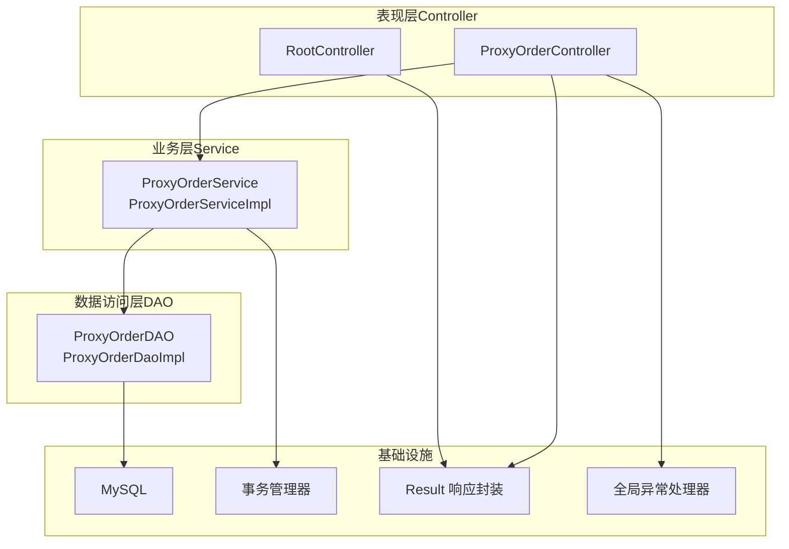
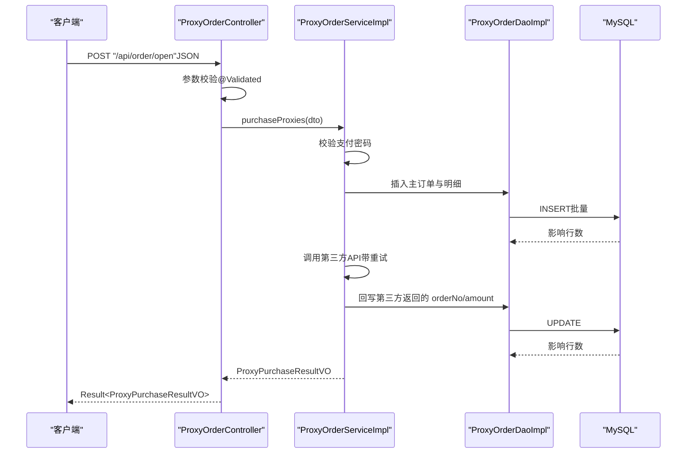
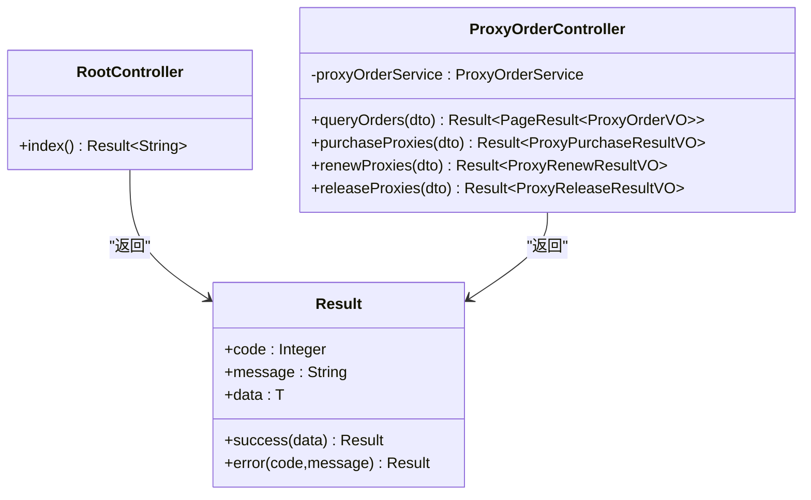
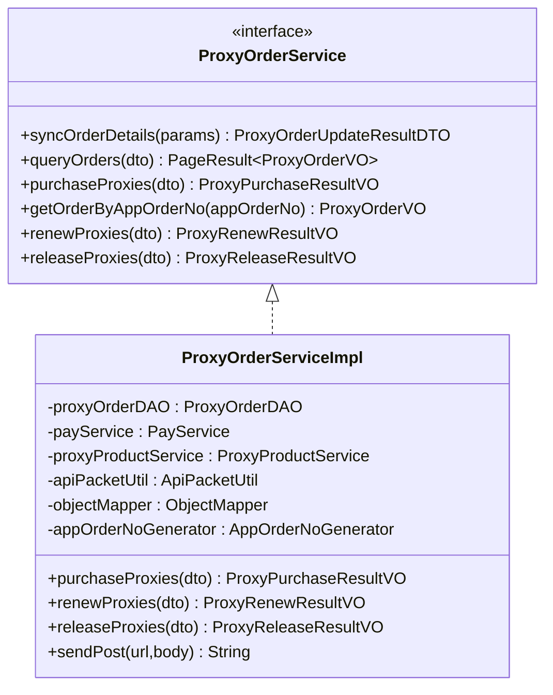
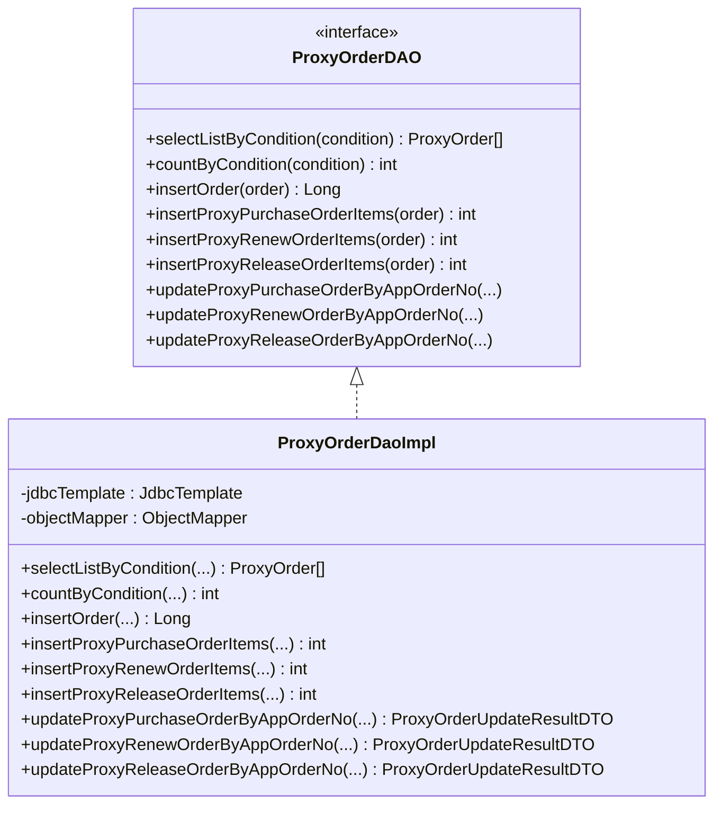
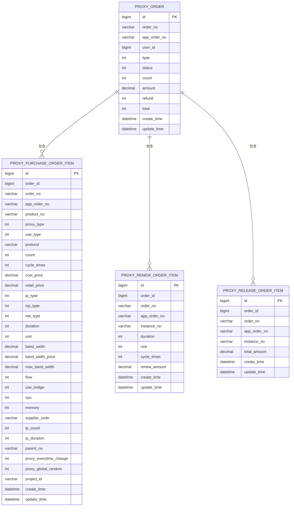
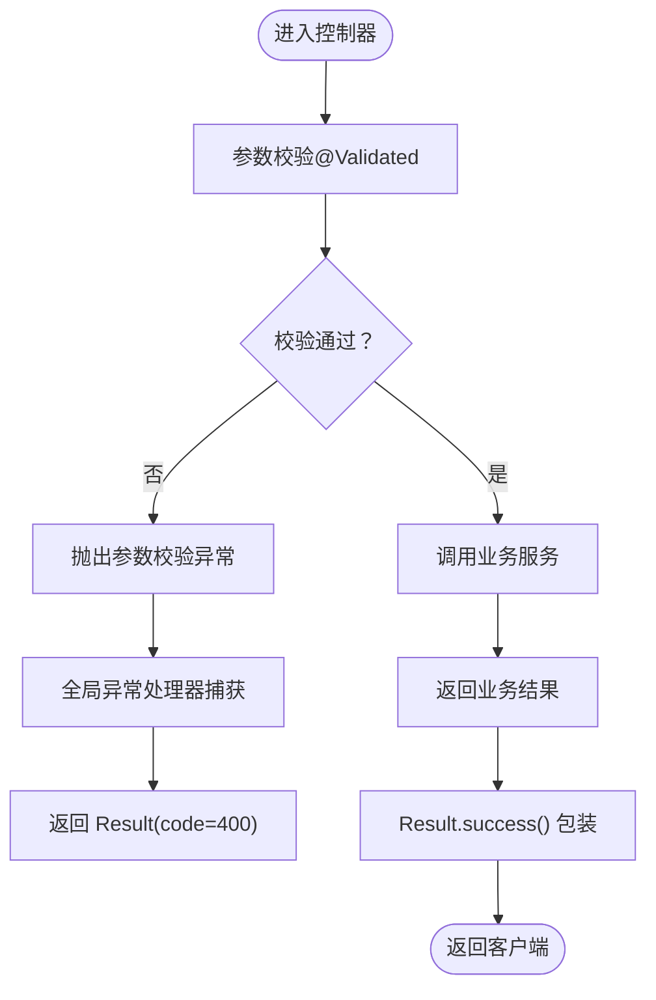
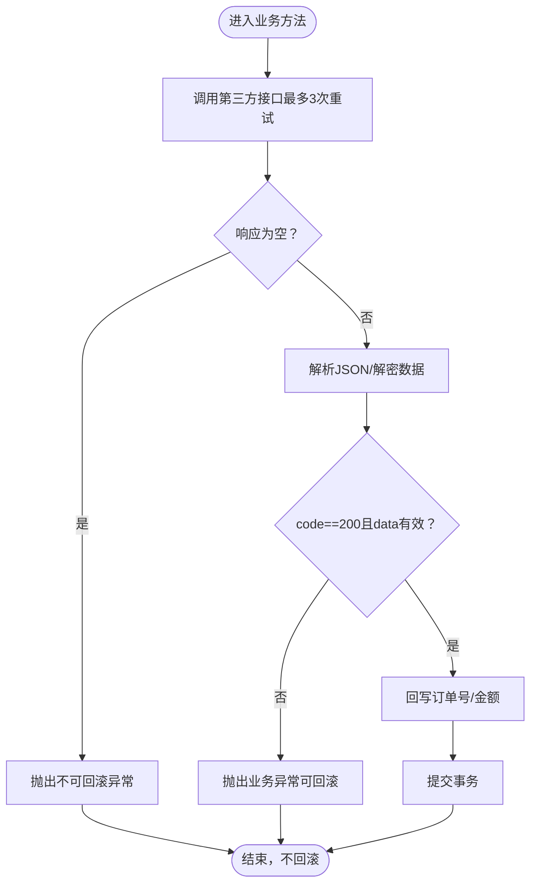
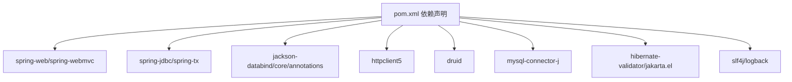

# MVC 架构模式

<cite>
**本文引用的文件**
- [RootController.java](file://src/main/java/cn/linkfast/controller/RootController.java)
- [ProxyOrderController.java](file://src/main/java/cn/linkfast/controller/ProxyOrderController.java)
- [ProxyOrderService.java](file://src/main/java/cn/linkfast/service/ProxyOrderService.java)
- [ProxyOrderServiceImpl.java](file://src/main/java/cn/linkfast/service/impl/ProxyOrderServiceImpl.java)
- [ProxyOrderDAO.java](file://src/main/java/cn/linkfast/dao/ProxyOrderDAO.java)
- [ProxyOrderDaoImpl.java](file://src/main/java/cn/linkfast/dao/impl/ProxyOrderDaoImpl.java)
- [ProxyOrder.java](file://src/main/java/cn/linkfast/entity/ProxyOrder.java)
- [ProxyOrderQueryDTO.java](file://src/main/java/cn/linkfast/dto/ProxyOrderQueryDTO.java)
- [ProxyPurchaseDTO.java](file://src/main/java/cn/linkfast/dto/ProxyPurchaseDTO.java)
- [ProxyOrderVO.java](file://src/main/java/cn/linkfast/vo/ProxyOrderVO.java)
- [Result.java](file://src/main/java/cn/linkfast/common/Result.java)
- [GlobalExceptionHandler.java](file://src/main/java/cn/linkfast/exception/GlobalExceptionHandler.java)
- [applicationContext.xml](file://src/main/resources/applicationContext.xml)
- [pom.xml](file://pom.xml)
- [ProxyOrderControllerTest.java](file://src/test/java/cn/linkfast/controller/ProxyOrderControllerTest.java)
- [ProxyOrderServiceImplTest.java](file://src/test/java/cn/linkfast/service/impl/ProxyOrderServiceImplTest.java)
</cite>

## 目录
1. [引言](#引言)
2. [项目结构](#项目结构)
3. [核心组件](#核心组件)
4. [架构总览](#架构总览)
5. [详细组件分析](#详细组件分析)
6. [依赖分析](#依赖分析)
7. [性能考虑](#性能考虑)
8. [故障排查指南](#故障排查指南)
9. [结论](#结论)
10. [附录](#附录)

## 引言
本文件围绕 Link-Fast 系统的 MVC 架构模式展开，系统采用 Spring Web MVC + Spring JDBC 的经典分层设计。控制器层负责接收 HTTP 请求、参数校验与响应封装；服务层封装核心业务规则与跨 DAO 的事务协调；数据访问层负责与数据库交互与事务管理。本文将结合代码路径与测试用例，系统阐述三层职责边界、交互流程、数据传递方式以及最佳实践与常见问题。

## 项目结构
Link-Fast 采用基于包的分层组织方式：
- controller：Spring MVC 控制器，暴露 REST 接口
- service：业务服务接口与实现，承载核心业务规则
- dao：数据访问接口与实现，封装数据库操作
- entity/dto/vo：领域模型、传输对象与视图对象
- common：通用响应封装与工具
- exception：全局异常处理
- resources：Spring XML 配置与属性文件
- test：控制器与服务层集成/单元测试

图表来源
- [ProxyOrderController.java:27-85](file://src/main/java/cn/linkfast/controller/ProxyOrderController.java#L27-L85)
- [ProxyOrderService.java:14-60](file://src/main/java/cn/linkfast/service/ProxyOrderService.java#L14-L60)
- [ProxyOrderServiceImpl.java:37-87](file://src/main/java/cn/linkfast/service/impl/ProxyOrderServiceImpl.java#L37-L87)
- [ProxyOrderDAO.java:10-102](file://src/main/java/cn/linkfast/dao/ProxyOrderDAO.java#L10-L102)
- [ProxyOrderDaoImpl.java:28-446](file://src/main/java/cn/linkfast/dao/impl/ProxyOrderDaoImpl.java#L28-L446)
- [applicationContext.xml:59-66](file://src/main/resources/applicationContext.xml#L59-L66)
- [Result.java:12-59](file://src/main/java/cn/linkfast/common/Result.java#L12-L59)
- [GlobalExceptionHandler.java:20-90](file://src/main/java/cn/linkfast/exception/GlobalExceptionHandler.java#L20-L90)

章节来源
- [ProxyOrderController.java:27-85](file://src/main/java/cn/linkfast/controller/ProxyOrderController.java#L27-L85)
- [ProxyOrderService.java:14-60](file://src/main/java/cn/linkfast/service/ProxyOrderService.java#L14-L60)
- [ProxyOrderServiceImpl.java:37-87](file://src/main/java/cn/linkfast/service/impl/ProxyOrderServiceImpl.java#L37-L87)
- [ProxyOrderDAO.java:10-102](file://src/main/java/cn/linkfast/dao/ProxyOrderDAO.java#L10-L102)
- [ProxyOrderDaoImpl.java:28-446](file://src/main/java/cn/linkfast/dao/impl/ProxyOrderDaoImpl.java#L28-L446)
- [applicationContext.xml:59-66](file://src/main/resources/applicationContext.xml#L59-L66)

## 核心组件
- 控制器层
  - RootController：根路径健康检查
  - ProxyOrderController：订单相关接口（查询、开通、续费、释放）
- 业务层
  - ProxyOrderService：定义订单业务契约
  - ProxyOrderServiceImpl：实现订单业务，包含参数校验、第三方接口调用、事务控制、异常处理策略
- 数据访问层
  - ProxyOrderDAO：订单相关 DAO 接口
  - ProxyOrderDaoImpl：基于 JdbcTemplate 的实现，封装 SQL、批量插入、条件查询、分页统计
- 响应与异常
  - Result：统一响应包装
  - GlobalExceptionHandler：全局异常处理，统一返回 Result

章节来源
- [RootController.java:13-19](file://src/main/java/cn/linkfast/controller/RootController.java#L13-L19)
- [ProxyOrderController.java:27-85](file://src/main/java/cn/linkfast/controller/ProxyOrderController.java#L27-L85)
- [ProxyOrderService.java:14-60](file://src/main/java/cn/linkfast/service/ProxyOrderService.java#L14-L60)
- [ProxyOrderServiceImpl.java:37-87](file://src/main/java/cn/linkfast/service/impl/ProxyOrderServiceImpl.java#L37-L87)
- [ProxyOrderDAO.java:10-102](file://src/main/java/cn/linkfast/dao/ProxyOrderDAO.java#L10-L102)
- [ProxyOrderDaoImpl.java:28-446](file://src/main/java/cn/linkfast/dao/impl/ProxyOrderDaoImpl.java#L28-L446)
- [Result.java:12-59](file://src/main/java/cn/linkfast/common/Result.java#L12-L59)
- [GlobalExceptionHandler.java:20-90](file://src/main/java/cn/linkfast/exception/GlobalExceptionHandler.java#L20-L90)

## 架构总览
MVC 在 Link-Fast 中的落地要点：
- 控制器层：使用 @RestController 提供 REST 接口，参数通过 @Validated 校验，返回统一 Result 包装
- 业务层：使用 @Service 与 @Transactional 管理事务，封装复杂流程（如购买、续费、释放），对第三方接口进行幂等与重试策略
- DAO 层：使用 JdbcTemplate 执行原生 SQL，支持批量插入与条件查询，配合事务管理器保证一致性
- 异常处理：全局异常处理器将业务异常、参数异常、未捕获异常统一转换为 Result

图表来源
- [ProxyOrderController.java:44-47](file://src/main/java/cn/linkfast/controller/ProxyOrderController.java#L44-L47)
- [ProxyOrderServiceImpl.java:198-458](file://src/main/java/cn/linkfast/service/impl/ProxyOrderServiceImpl.java#L198-L458)
- [ProxyOrderDaoImpl.java:265-355](file://src/main/java/cn/linkfast/dao/impl/ProxyOrderDaoImpl.java#L265-L355)

章节来源
- [ProxyOrderController.java:27-85](file://src/main/java/cn/linkfast/controller/ProxyOrderController.java#L27-L85)
- [ProxyOrderServiceImpl.java:198-458](file://src/main/java/cn/linkfast/service/impl/ProxyOrderServiceImpl.java#L198-L458)
- [ProxyOrderDaoImpl.java:265-355](file://src/main/java/cn/linkfast/dao/impl/ProxyOrderDaoImpl.java#L265-L355)

## 详细组件分析

### 控制器层（Controller）
职责与实现要点：
- RootController：对外提供根路径健康检查，返回统一 Result
- ProxyOrderController：
  - 查询订单列表：GET /api/order/list，参数 DTO 校验，返回分页结果
  - 开通代理：POST /api/order/open，参数 DTO 校验，调用服务层并返回统一 Result
  - 续费代理：POST /api/order/renew，捕获业务异常并统一返回
  - 释放代理：POST /api/order/release，捕获业务异常并统一返回
- 统一响应：Result.success()/error() 包裹返回值
- 全局异常：由 GlobalExceptionHandler 统一处理参数校验、业务异常与系统异常

图表来源
- [RootController.java:13-19](file://src/main/java/cn/linkfast/controller/RootController.java#L13-L19)
- [ProxyOrderController.java:27-85](file://src/main/java/cn/linkfast/controller/ProxyOrderController.java#L27-L85)
- [Result.java:12-59](file://src/main/java/cn/linkfast/common/Result.java#L12-L59)

章节来源
- [RootController.java:13-19](file://src/main/java/cn/linkfast/controller/RootController.java#L13-L19)
- [ProxyOrderController.java:27-85](file://src/main/java/cn/linkfast/controller/ProxyOrderController.java#L27-L85)
- [Result.java:12-59](file://src/main/java/cn/linkfast/common/Result.java#L12-L59)

### 业务层（Service）
职责与实现要点：
- ProxyOrderService：定义订单业务契约，包括查询、购买、续费、释放等
- ProxyOrderServiceImpl：
  - 参数校验：支付密码校验、库存校验、DTO 字段校验
  - 事务控制：@Transactional（可回滚/不可回滚区分）
  - 第三方接口集成：统一请求打包、发送、解密、解析、回写
  - 异常策略：区分“可回滚”与“不可回滚”，确保数据一致性
  - 数据转换：Entity/VO 转换、分页封装

图表来源
- [ProxyOrderService.java:14-60](file://src/main/java/cn/linkfast/service/ProxyOrderService.java#L14-L60)
- [ProxyOrderServiceImpl.java:37-87](file://src/main/java/cn/linkfast/service/impl/ProxyOrderServiceImpl.java#L37-L87)

章节来源
- [ProxyOrderService.java:14-60](file://src/main/java/cn/linkfast/service/ProxyOrderService.java#L14-L60)
- [ProxyOrderServiceImpl.java:37-87](file://src/main/java/cn/linkfast/service/impl/ProxyOrderServiceImpl.java#L37-L87)

### 数据访问层（DAO）
职责与实现要点：
- ProxyOrderDAO：定义订单相关 CRUD 与统计接口
- ProxyOrderDaoImpl：
  - 条件查询与分页：动态拼接 SQL，BeanPropertyRowMapper 映射
  - 批量插入：批量更新，统计受影响行数
  - 回写第三方返回字段：统一更新主表与明细表
  - JSON 字段处理：对象序列化为 JSON 存储
  - 事务管理：由 Spring 事务管理器统一控制

图表来源
- [ProxyOrderDAO.java:10-102](file://src/main/java/cn/linkfast/dao/ProxyOrderDAO.java#L10-L102)
- [ProxyOrderDaoImpl.java:28-446](file://src/main/java/cn/linkfast/dao/impl/ProxyOrderDaoImpl.java#L28-L446)

章节来源
- [ProxyOrderDAO.java:10-102](file://src/main/java/cn/linkfast/dao/ProxyOrderDAO.java#L10-L102)
- [ProxyOrderDaoImpl.java:28-446](file://src/main/java/cn/linkfast/dao/impl/ProxyOrderDaoImpl.java#L28-L446)

### 数据模型与传输对象
- 实体模型：ProxyOrder 封装订单主表与明细集合
- 查询 DTO：ProxyOrderQueryDTO 定义分页与过滤字段
- 输入 DTO：ProxyPurchaseDTO 定义购买请求字段
- 视图对象：ProxyOrderVO 仅暴露前端所需字段

图表来源
- [ProxyOrder.java:19-45](file://src/main/java/cn/linkfast/entity/ProxyOrder.java#L19-L45)
- [ProxyOrderDaoImpl.java:296-355](file://src/main/java/cn/linkfast/dao/impl/ProxyOrderDaoImpl.java#L296-L355)
- [ProxyOrderDaoImpl.java:417-444](file://src/main/java/cn/linkfast/dao/impl/ProxyOrderDaoImpl.java#L417-L444)
- [ProxyOrderDaoImpl.java:368-393](file://src/main/java/cn/linkfast/dao/impl/ProxyOrderDaoImpl.java#L368-L393)

章节来源
- [ProxyOrder.java:19-45](file://src/main/java/cn/linkfast/entity/ProxyOrder.java#L19-L45)
- [ProxyOrderDaoImpl.java:296-355](file://src/main/java/cn/linkfast/dao/impl/ProxyOrderDaoImpl.java#L296-L355)
- [ProxyOrderDaoImpl.java:417-444](file://src/main/java/cn/linkfast/dao/impl/ProxyOrderDaoImpl.java#L417-L444)
- [ProxyOrderDaoImpl.java:368-393](file://src/main/java/cn/linkfast/dao/impl/ProxyOrderDaoImpl.java#L368-L393)

### 参数校验与响应封装
- 参数校验：使用 Jakarta Bean Validation（@NotNull、@Min、@Max、@NotBlank 等）在控制器与 DTO 上声明
- 响应封装：Result<T> 统一返回 code/message/data，控制器直接返回 Result.success()/error()
- 全局异常：GlobalExceptionHandler 捕获参数校验异常、业务异常与系统异常，统一返回 Result

图表来源
- [ProxyOrderController.java:36-83](file://src/main/java/cn/linkfast/controller/ProxyOrderController.java#L36-L83)
- [ProxyOrderQueryDTO.java:24-57](file://src/main/java/cn/linkfast/dto/ProxyOrderQueryDTO.java#L24-L57)
- [ProxyPurchaseDTO.java:10-22](file://src/main/java/cn/linkfast/dto/ProxyPurchaseDTO.java#L10-L22)
- [GlobalExceptionHandler.java:68-88](file://src/main/java/cn/linkfast/exception/GlobalExceptionHandler.java#L68-L88)
- [Result.java:27-44](file://src/main/java/cn/linkfast/common/Result.java#L27-L44)

章节来源
- [ProxyOrderController.java:36-83](file://src/main/java/cn/linkfast/controller/ProxyOrderController.java#L36-L83)
- [ProxyOrderQueryDTO.java:24-57](file://src/main/java/cn/linkfast/dto/ProxyOrderQueryDTO.java#L24-L57)
- [ProxyPurchaseDTO.java:10-22](file://src/main/java/cn/linkfast/dto/ProxyPurchaseDTO.java#L10-L22)
- [GlobalExceptionHandler.java:68-88](file://src/main/java/cn/linkfast/exception/GlobalExceptionHandler.java#L68-L88)
- [Result.java:27-44](file://src/main/java/cn/linkfast/common/Result.java#L27-L44)

### 事务管理与一致性保障
- 事务配置：applicationContext.xml 中启用注解事务，配置 DataSourceTransactionManager
- 事务策略：
  - @Transactional(rollbackFor = Exception.class)：默认可回滚
  - noRollbackFor = NoRollbackBusinessException.class：针对“第三方已落库”的场景不回滚
  - 通过重试与解密/解析失败分支，严格区分“可回滚/不可回滚”情形

图表来源
- [applicationContext.xml:59-66](file://src/main/resources/applicationContext.xml#L59-L66)
- [ProxyOrderServiceImpl.java:343-451](file://src/main/java/cn/linkfast/service/impl/ProxyOrderServiceImpl.java#L343-L451)
- [ProxyOrderServiceImpl.java:552-672](file://src/main/java/cn/linkfast/service/impl/ProxyOrderServiceImpl.java#L552-L672)
- [ProxyOrderServiceImpl.java:717-799](file://src/main/java/cn/linkfast/service/impl/ProxyOrderServiceImpl.java#L717-L799)

章节来源
- [applicationContext.xml:59-66](file://src/main/resources/applicationContext.xml#L59-L66)
- [ProxyOrderServiceImpl.java:343-451](file://src/main/java/cn/linkfast/service/impl/ProxyOrderServiceImpl.java#L343-L451)
- [ProxyOrderServiceImpl.java:552-672](file://src/main/java/cn/linkfast/service/impl/ProxyOrderServiceImpl.java#L552-L672)
- [ProxyOrderServiceImpl.java:717-799](file://src/main/java/cn/linkfast/service/impl/ProxyOrderServiceImpl.java#L717-L799)

## 依赖分析
- 框架与库
  - Spring Web/WebMVC/Spring JDBC/TX：MVC 与事务基础
  - Jackson：JSON 序列化/反序列化
  - Apache HttpClient5：HTTP 客户端
  - Druid：连接池
  - MySQL Connector/J：数据库驱动
  - Lombok：简化 POJO
  - SLF4J/Logback：日志
  - Hibernate Validator（Jakarta Bean Validation 实现）：参数校验
- Maven 依赖与版本管理见 pom.xml

图表来源
- [pom.xml:22-212](file://pom.xml#L22-L212)

章节来源
- [pom.xml:22-212](file://pom.xml#L22-L212)

## 性能考虑
- 连接池与超时：Druid 连接池配置合理，空闲回收与泄露检测有助于稳定运行
- 批量操作：DAO 层大量使用批量插入与批量更新，降低往返次数
- 异步库存更新：购买流程中对库存信息的异步更新，避免阻塞下单主流程
- 重试策略：对第三方接口调用进行有限重试，兼顾可靠性与性能
- JSON 处理：对复杂对象序列化为 JSON 存储，减少表结构复杂度

## 故障排查指南
- 参数校验失败
  - 现象：返回 Result(code=400)
  - 定位：GlobalExceptionHandler.handleValidationException
  - 建议：检查 DTO 字段注解与前端传参
- 业务异常
  - 现象：返回 Result(code=业务码, message)
  - 定位：业务层抛出 BusinessException 或 NoRollbackBusinessException
  - 建议：查看服务层日志与异常堆栈
- 第三方接口异常
  - 现象：连接失败/响应为空/JSON 非法/解密失败
  - 定位：服务层重试与异常分支
  - 建议：核对环境配置、加解密参数与网络连通性
- 数据库异常
  - 现象：SQL 执行失败或连接池耗尽
  - 定位：DAO 层 SQL 与连接池配置
  - 建议：检查 SQL、索引与连接池参数

章节来源
- [GlobalExceptionHandler.java:28-88](file://src/main/java/cn/linkfast/exception/GlobalExceptionHandler.java#L28-L88)
- [ProxyOrderServiceImpl.java:343-451](file://src/main/java/cn/linkfast/service/impl/ProxyOrderServiceImpl.java#L343-L451)
- [ProxyOrderServiceImpl.java:552-672](file://src/main/java/cn/linkfast/service/impl/ProxyOrderServiceImpl.java#L552-L672)
- [ProxyOrderServiceImpl.java:717-799](file://src/main/java/cn/linkfast/service/impl/ProxyOrderServiceImpl.java#L717-L799)
- [applicationContext.xml:14-66](file://src/main/resources/applicationContext.xml#L14-L66)

## 结论
Link-Fast 的 MVC 架构清晰地划分了表现层、业务层与数据访问层的职责，配合统一响应与全局异常处理，实现了高内聚低耦合的服务设计。通过参数校验、事务策略与第三方接口重试机制，系统在可靠性与一致性方面具备良好保障。建议在后续演进中持续完善监控与可观测性，以进一步提升稳定性与可维护性。

## 附录
- 测试参考
  - 控制器层测试：ProxyOrderControllerTest 展示了参数校验、错误处理与全链路集成测试
  - 服务层测试：ProxyOrderServiceImplTest 展示了私有方法的反射调用与断言
- 代码示例路径（不展示具体代码内容）
  - 控制器层入口：[ProxyOrderController.java:27-85](file://src/main/java/cn/linkfast/controller/ProxyOrderController.java#L27-L85)
  - 业务层实现：[ProxyOrderServiceImpl.java:198-458](file://src/main/java/cn/linkfast/service/impl/ProxyOrderServiceImpl.java#L198-L458)
  - DAO 实现：[ProxyOrderDaoImpl.java:265-355](file://src/main/java/cn/linkfast/dao/impl/ProxyOrderDaoImpl.java#L265-L355)
  - 统一响应：[Result.java:12-59](file://src/main/java/cn/linkfast/common/Result.java#L12-L59)
  - 全局异常：[GlobalExceptionHandler.java:20-90](file://src/main/java/cn/linkfast/exception/GlobalExceptionHandler.java#L20-L90)
  - 事务配置：[applicationContext.xml:59-66](file://src/main/resources/applicationContext.xml#L59-L66)