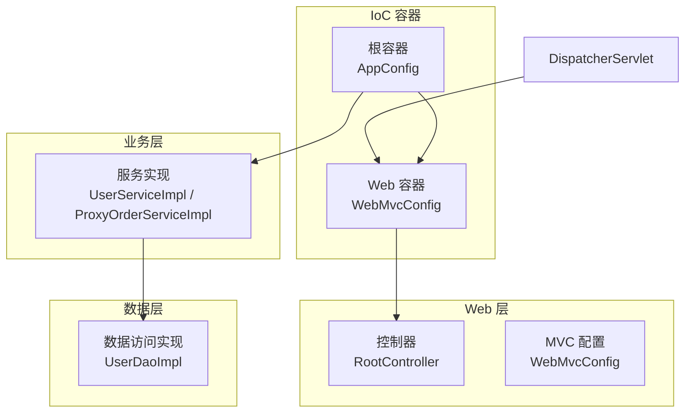
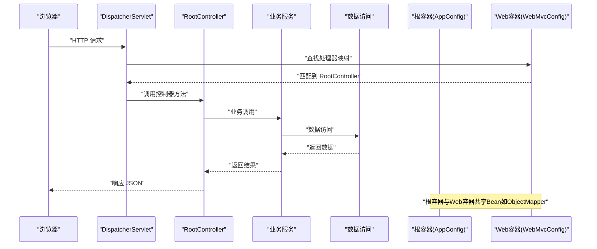
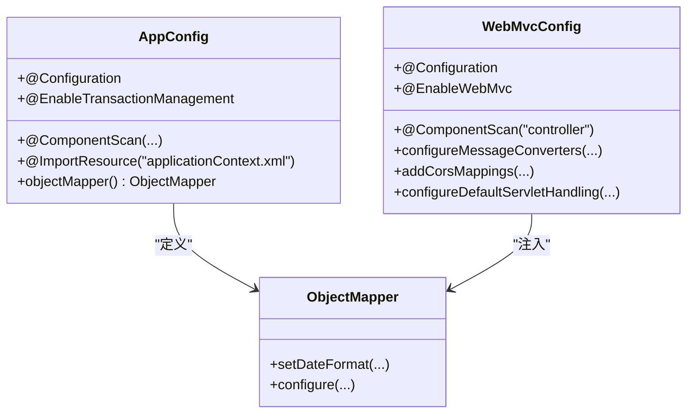
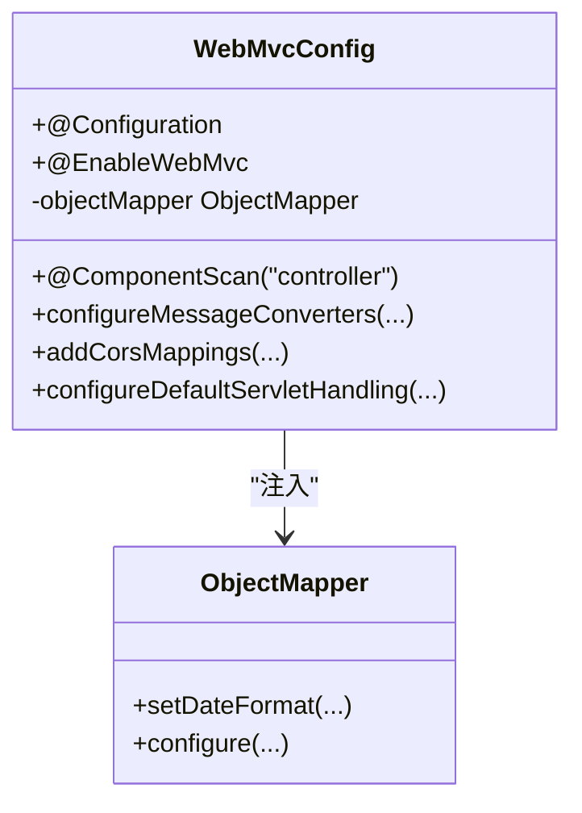
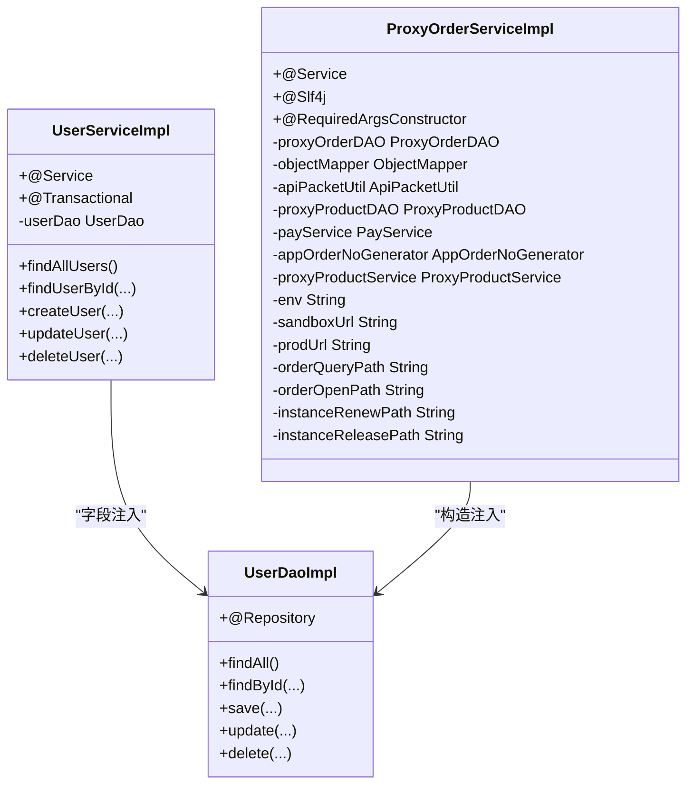
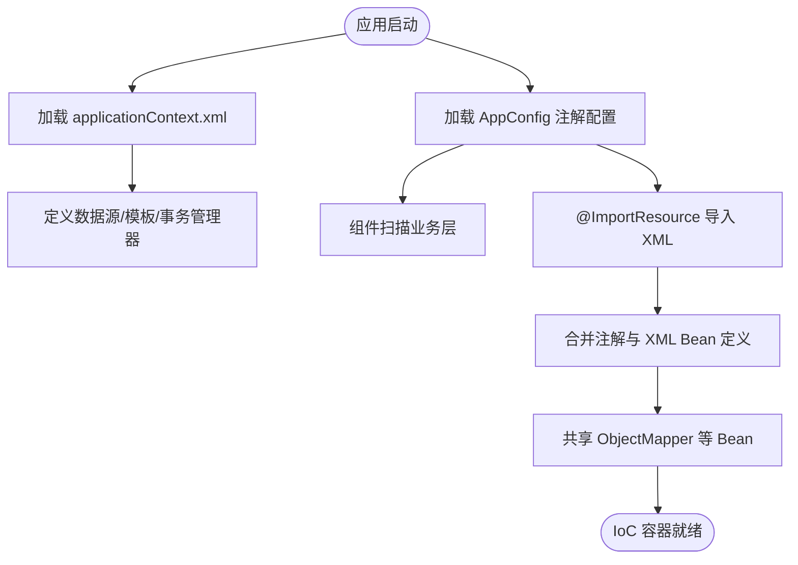
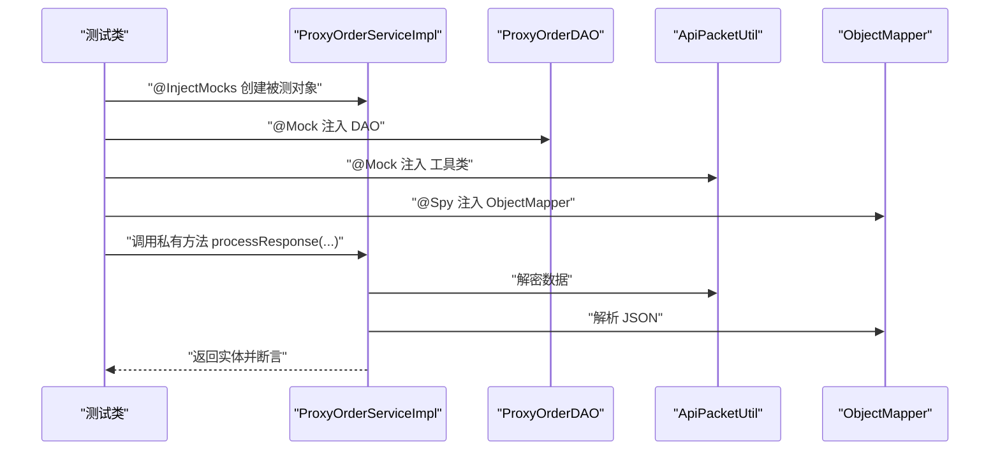
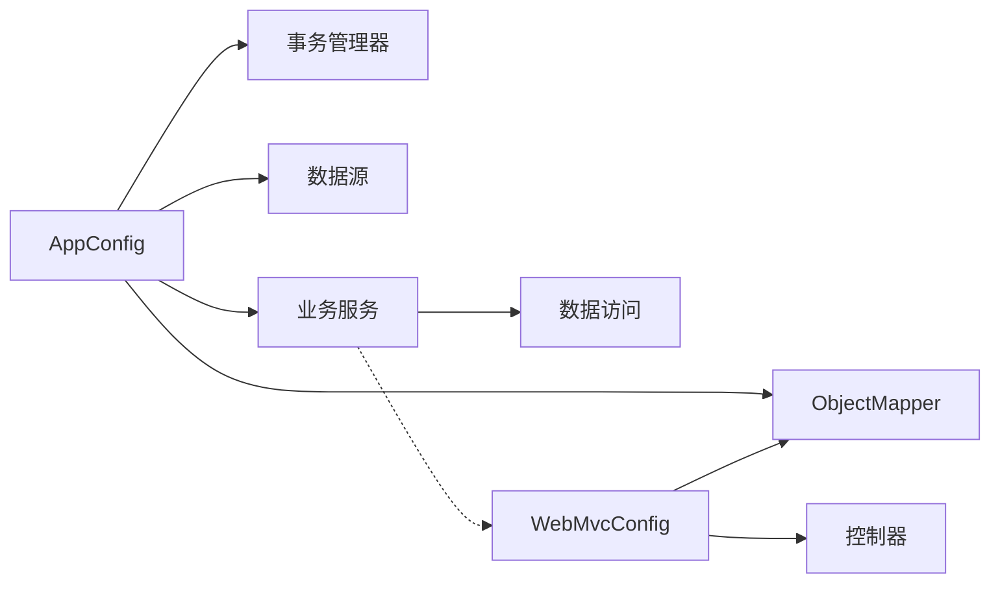

# 依赖注入与控制反转

<cite>
**本文引用的文件**   
- [AppConfig.java](file://src/main/java/cn/linkfast/config/AppConfig.java)
- [WebMvcConfig.java](file://src/main/java/cn/linkfast/config/WebMvcConfig.java)
- [applicationContext.xml](file://src/main/resources/applicationContext.xml)
- [web.xml](file://src/main/webapp/WEB-INF/web.xml)
- [pom.xml](file://pom.xml)
- [UserServiceImpl.java](file://src/main/java/cn/linkfast/service/impl/UserServiceImpl.java)
- [ProxyOrderServiceImpl.java](file://src/main/java/cn/linkfast/service/impl/ProxyOrderServiceImpl.java)
- [UserDaoImpl.java](file://src/main/java/cn/linkfast/dao/impl/UserDaoImpl.java)
- [RootController.java](file://src/main/java/cn/linkfast/controller/RootController.java)
- [ProxyOrderServiceImplTest.java](file://src/test/java/cn/linkfast/service/impl/ProxyOrderServiceImplTest.java)
- [jdbc.properties](file://src/main/resources/jdbc.properties)
</cite>

## 目录
1. [引言](#引言)
2. [项目结构](#项目结构)
3. [核心组件](#核心组件)
4. [架构总览](#架构总览)
5. [详细组件分析](#详细组件分析)
6. [依赖分析](#依赖分析)
7. [性能考虑](#性能考虑)
8. [故障排查指南](#故障排查指南)
9. [结论](#结论)
10. [附录](#附录)

## 引言
本文件围绕 Link-Fast 系统的依赖注入与控制反转（IoC）机制展开，系统采用 Spring 6 作为核心框架，结合注解配置与 XML 资源文件，形成“注解 + XML”的混合配置模式。文档将从 Spring IoC 容器工作原理出发，系统讲解 @Configuration、@ComponentScan、@Bean 等注解的作用与配置方式；梳理构造函数注入、Setter 注入、字段注入等依赖注入实践；说明组件扫描机制与包路径配置；并结合项目实际代码示例，给出最佳实践与性能优化建议。

## 项目结构
Link-Fast 采用标准 Maven 结构，核心配置集中在 cn.linkfast.config 包，业务与数据访问层通过注解自动装配，Web 层通过 DispatcherServlet 与 MVC 配置类接管。IoC 容器由 ContextLoaderListener 启动根容器（AppConfig），DispatcherServlet 启动 Web 容器（WebMvcConfig），两者共享部分 Bean（如 ObjectMapper）。

图表来源
- [web.xml:10-35](file://src/main/webapp/WEB-INF/web.xml#L10-L35)
- [AppConfig.java:14-36](file://src/main/java/cn/linkfast/config/AppConfig.java#L14-L36)
- [WebMvcConfig.java:19-62](file://src/main/java/cn/linkfast/config/WebMvcConfig.java#L19-L62)
- [RootController.java:13-19](file://src/main/java/cn/linkfast/controller/RootController.java#L13-L19)
- [UserServiceImpl.java:15-55](file://src/main/java/cn/linkfast/service/impl/UserServiceImpl.java#L15-L55)
- [ProxyOrderServiceImpl.java:36-60](file://src/main/java/cn/linkfast/service/impl/ProxyOrderServiceImpl.java#L36-L60)
- [UserDaoImpl.java:16-55](file://src/main/java/cn/linkfast/dao/impl/UserDaoImpl.java#L16-L55)

章节来源
- [web.xml:10-35](file://src/main/webapp/WEB-INF/web.xml#L10-L35)
- [AppConfig.java:14-36](file://src/main/java/cn/linkfast/config/AppConfig.java#L14-L36)
- [WebMvcConfig.java:19-62](file://src/main/java/cn/linkfast/config/WebMvcConfig.java#L19-L62)

## 核心组件
- 根容器配置类 AppConfig
  - @Configuration 标识该类为配置类，负责声明与装配业务层与持久层所需的 Bean。
  - @EnableTransactionManagement 启用注解驱动的事务管理。
  - @ComponentScan(basePackages = {"cn.linkfast"}, excludeFilters = ...) 控制组件扫描范围，排除 Controller 与 WebMvcConfig，避免重复注册。
  - @ImportResource("classpath:applicationContext.xml") 导入 XML 资源，集中配置数据源、JdbcTemplate、事务管理器等。
  - @Bean 声明 ObjectMapper，提升至根容器，供 Service 与测试环境直接注入。
- Web 容器配置类 WebMvcConfig
  - @Configuration + @EnableWebMvc 替代 XML 的 mvc 配置。
  - @ComponentScan(basePackages = "cn.linkfast.controller") 扫描控制器。
  - @Autowired 注入根容器中的 ObjectMapper，统一 JSON 序列化格式。
- XML 资源文件 applicationContext.xml
  - 使用 context:property-placeholder 引入 jdbc.properties 与 api.properties。
  - 定义 dataSource、jdbcTemplate、transactionManager，并开启 tx:annotation-driven。
- 依赖注入实践
  - 字段注入：UserServiceImpl 中 @Autowired 私有字段。
  - 构造函数注入：ProxyOrderServiceImpl 使用 Lombok @RequiredArgsConstructor，将 DAO、工具类、服务等以 final 字段注入，保证不可变与线程安全。
  - Setter 注入：在 WebMvcConfig 中通过 setter 注入 ObjectMapper。
  - @Value 注入外部配置：ProxyOrderServiceImpl 注入多个配置键值。

章节来源
- [AppConfig.java:14-36](file://src/main/java/cn/linkfast/config/AppConfig.java#L14-L36)
- [WebMvcConfig.java:19-62](file://src/main/java/cn/linkfast/config/WebMvcConfig.java#L19-L62)
- [applicationContext.xml:14-66](file://src/main/resources/applicationContext.xml#L14-L66)
- [UserServiceImpl.java:15-55](file://src/main/java/cn/linkfast/service/impl/UserServiceImpl.java#L15-L55)
- [ProxyOrderServiceImpl.java:36-60](file://src/main/java/cn/linkfast/service/impl/ProxyOrderServiceImpl.java#L36-L60)
- [UserDaoImpl.java:16-55](file://src/main/java/cn/linkfast/dao/impl/UserDaoImpl.java#L16-L55)

## 架构总览
Spring IoC 容器启动流程如下：
- ContextLoaderListener 读取 web.xml 中的 contextConfigLocation，加载 AppConfig 作为根容器配置。
- DispatcherServlet 读取 web.xml 中的 init-param contextConfigLocation，加载 WebMvcConfig 作为 Web 容器配置。
- 根容器与 Web 容器共享 Bean（如 ObjectMapper），实现跨层复用。
- 组件扫描与 Bean 定义贯穿注解与 XML，形成“注解 + XML”的混合配置。

图表来源
- [web.xml:10-35](file://src/main/webapp/WEB-INF/web.xml#L10-L35)
- [AppConfig.java:24-36](file://src/main/java/cn/linkfast/config/AppConfig.java#L24-L36)
- [WebMvcConfig.java:24-39](file://src/main/java/cn/linkfast/config/WebMvcConfig.java#L24-L39)
- [RootController.java:15-18](file://src/main/java/cn/linkfast/controller/RootController.java#L15-L18)

章节来源
- [web.xml:10-35](file://src/main/webapp/WEB-INF/web.xml#L10-L35)
- [AppConfig.java:24-36](file://src/main/java/cn/linkfast/config/AppConfig.java#L24-L36)
- [WebMvcConfig.java:24-39](file://src/main/java/cn/linkfast/config/WebMvcConfig.java#L24-L39)

## 详细组件分析

### 组件一：根容器配置类 AppConfig
- 作用
  - 统一声明业务与持久层所需 Bean。
  - 通过 @ImportResource 导入 XML，集中管理数据源与事务。
  - 通过 @ComponentScan 排除控制器与 Web 配置类，避免重复注册。
- 关键点
  - @Bean 声明 ObjectMapper，确保 Service 与测试环境可直接注入。
  - @EnableTransactionManagement 与 XML 中 tx:annotation-driven 协同工作。
- 依赖关系
  - 与 WebMvcConfig 共享 Bean（ObjectMapper）。
  - 与 DAO、Service 通过组件扫描建立依赖。

图表来源
- [AppConfig.java:14-36](file://src/main/java/cn/linkfast/config/AppConfig.java#L14-L36)
- [WebMvcConfig.java:19-62](file://src/main/java/cn/linkfast/config/WebMvcConfig.java#L19-L62)

章节来源
- [AppConfig.java:14-36](file://src/main/java/cn/linkfast/config/AppConfig.java#L14-L36)
- [applicationContext.xml:14-66](file://src/main/resources/applicationContext.xml#L14-L66)

### 组件二：Web 容器配置类 WebMvcConfig
- 作用
  - 替代 XML 的 mvc 配置，启用注解驱动、组件扫描、消息转换器、跨域与默认 Servlet 处理。
  - 通过 @Autowired 注入根容器中的 ObjectMapper，统一 JSON 输出格式。
- 关键点
  - configureMessageConverters 中设置 MappingJackson2HttpMessageConverter 并注入 ObjectMapper。
  - addCorsMappings 提供全局跨域策略。
  - configureDefaultServletHandling 支持静态资源访问。

图表来源
- [WebMvcConfig.java:19-62](file://src/main/java/cn/linkfast/config/WebMvcConfig.java#L19-L62)

章节来源
- [WebMvcConfig.java:19-62](file://src/main/java/cn/linkfast/config/WebMvcConfig.java#L19-L62)

### 组件三：服务层依赖注入实践
- 字段注入（UserServiceImpl）
  - 使用 @Autowired 注入 UserDao，体现传统字段注入风格。
- 构造函数注入（ProxyOrderServiceImpl）
  - 使用 Lombok @RequiredArgsConstructor，将 DAO、工具类、服务等以 final 字段注入，保证不可变与线程安全。
- 配置注入（@Value）
  - 在 ProxyOrderServiceImpl 中注入多个配置键值，用于动态选择环境与路径。

图表来源
- [UserServiceImpl.java:15-55](file://src/main/java/cn/linkfast/service/impl/UserServiceImpl.java#L15-L55)
- [ProxyOrderServiceImpl.java:36-60](file://src/main/java/cn/linkfast/service/impl/ProxyOrderServiceImpl.java#L36-L60)
- [UserDaoImpl.java:16-55](file://src/main/java/cn/linkfast/dao/impl/UserDaoImpl.java#L16-L55)

章节来源
- [UserServiceImpl.java:15-55](file://src/main/java/cn/linkfast/service/impl/UserServiceImpl.java#L15-L55)
- [ProxyOrderServiceImpl.java:36-60](file://src/main/java/cn/linkfast/service/impl/ProxyOrderServiceImpl.java#L36-L60)
- [UserDaoImpl.java:16-55](file://src/main/java/cn/linkfast/dao/impl/UserDaoImpl.java#L16-L55)

### 组件四：XML 配置与注解配置的结合
- XML 资源文件
  - 使用 context:property-placeholder 引入 jdbc.properties 与 api.properties。
  - 定义 dataSource、jdbcTemplate、transactionManager，并开启 tx:annotation-driven。
- 注解配置
  - AppConfig 通过 @ImportResource 导入 XML。
  - WebMvcConfig 通过注解替代 XML 的 mvc 配置。
- 协同效果
  - 注解负责业务与 Web 层的灵活装配；XML 负责数据源与事务等基础设施的集中管理。

图表来源
- [applicationContext.xml:14-66](file://src/main/resources/applicationContext.xml#L14-L66)
- [AppConfig.java:24-36](file://src/main/java/cn/linkfast/config/AppConfig.java#L24-L36)

章节来源
- [applicationContext.xml:14-66](file://src/main/resources/applicationContext.xml#L14-L66)
- [AppConfig.java:24-36](file://src/main/java/cn/linkfast/config/AppConfig.java#L24-L36)

### 组件五：控制器与测试中的 IoC 使用
- 控制器 RootController
  - 使用 @RestController 提供 REST 接口，返回 Result 封装的结果。
- 测试 ProxyOrderServiceImplTest
  - 使用 @ExtendWith(MockitoExtension.class) + @InjectMocks/@Mock/@Spy 进行单元测试，验证依赖注入与行为。

图表来源
- [ProxyOrderServiceImplTest.java:23-89](file://src/test/java/cn/linkfast/service/impl/ProxyOrderServiceImplTest.java#L23-L89)
- [ProxyOrderServiceImpl.java:173-194](file://src/main/java/cn/linkfast/service/impl/ProxyOrderServiceImpl.java#L173-L194)

章节来源
- [RootController.java:13-19](file://src/main/java/cn/linkfast/controller/RootController.java#L13-L19)
- [ProxyOrderServiceImplTest.java:23-89](file://src/test/java/cn/linkfast/service/impl/ProxyOrderServiceImplTest.java#L23-L89)

## 依赖分析
- 容器层次
  - 根容器（AppConfig）：负责业务与持久层 Bean 的装配与事务管理。
  - Web 容器（WebMvcConfig）：负责 Web 层 Bean 的装配与 MVC 配置。
- 组件耦合
  - 业务服务依赖 DAO 与工具类，通过构造函数注入降低耦合。
  - 控制器依赖服务层，通过 Spring MVC 自动装配。
- 外部依赖
  - 数据源与事务管理来自 XML 配置；Jackson ObjectMapper 来自注解配置。
  - Maven 依赖中包含 Spring Web、WebMVC、JDBC、Tx、测试等模块。

图表来源
- [AppConfig.java:14-36](file://src/main/java/cn/linkfast/config/AppConfig.java#L14-L36)
- [applicationContext.xml:14-66](file://src/main/resources/applicationContext.xml#L14-L66)
- [WebMvcConfig.java:19-62](file://src/main/java/cn/linkfast/config/WebMvcConfig.java#L19-L62)

章节来源
- [AppConfig.java:14-36](file://src/main/java/cn/linkfast/config/AppConfig.java#L14-L36)
- [applicationContext.xml:14-66](file://src/main/resources/applicationContext.xml#L14-L66)
- [WebMvcConfig.java:19-62](file://src/main/java/cn/linkfast/config/WebMvcConfig.java#L19-L62)

## 性能考虑
- Bean 作用域
  - 默认单例，适合无状态的工具类与 DAO；服务层按需设计。
- 延迟初始化
  - 对于重型 Bean（如复杂工具类），可考虑懒加载减少启动时间。
- 缓存与连接池
  - XML 中已配置 Druid 连接池的核心参数，建议结合业务峰值评估 maxActive 与超时配置。
- 序列化性能
  - ObjectMapper 在根容器中定义，避免重复创建，统一日期格式减少序列化开销。
- 事务边界
  - 合理划分 @Transactional 边界，避免长事务占用连接与锁资源。

## 故障排查指南
- 组件扫描未生效
  - 检查 @ComponentScan 的 basePackages 是否覆盖目标包；确认 excludeFilters 是否误排除。
- Bean 未找到或循环依赖
  - 确认 @ImportResource 是否正确加载 XML；检查 @Autowired 注入点是否匹配唯一 Bean。
- 数据源与事务异常
  - 检查 jdbc.properties 是否正确加载；确认 tx:annotation-driven 与 @EnableTransactionManagement 是否同时启用。
- JSON 序列化不一致
  - 确认 WebMvcConfig 中是否注入了根容器的 ObjectMapper；检查日期格式配置。

章节来源
- [AppConfig.java:16-23](file://src/main/java/cn/linkfast/config/AppConfig.java#L16-L23)
- [applicationContext.xml:14-66](file://src/main/resources/applicationContext.xml#L14-L66)
- [WebMvcConfig.java:24-39](file://src/main/java/cn/linkfast/config/WebMvcConfig.java#L24-L39)
- [jdbc.properties:1-39](file://src/main/resources/jdbc.properties#L1-L39)

## 结论
Link-Fast 通过“注解 + XML”的混合配置，实现了清晰的容器层次与职责分离：根容器负责业务与持久层的 Bean 管理与事务，Web 容器负责 Web 层的装配与 MVC 配置。项目在服务层广泛采用构造函数注入与 @Value 注入，配合 XML 的数据源与事务配置，形成了稳定、可维护且易于扩展的 IoC 体系。建议在保持现有结构的基础上，持续优化 Bean 作用域与连接池参数，强化测试覆盖率，确保高并发下的稳定性与性能。

## 附录
- 依赖注入方式对比
  - 构造函数注入：推荐用于必需依赖，保证不可变与线程安全。
  - Setter 注入：适用于可选依赖或运行期可替换的组件。
  - 字段注入：简洁但不利于测试与可读性，建议优先使用构造函数注入。
- 最佳实践
  - 明确容器层次：根容器与 Web 容器职责清晰，共享 Bean 有限且必要。
  - 统一配置入口：注解负责业务与 Web 层，XML 负责基础设施，避免混杂。
  - 测试友好：优先构造函数注入，便于 Mockito 注入与测试断言。
  - 性能优化：合理设置连接池参数、统一序列化配置、缩小事务边界。