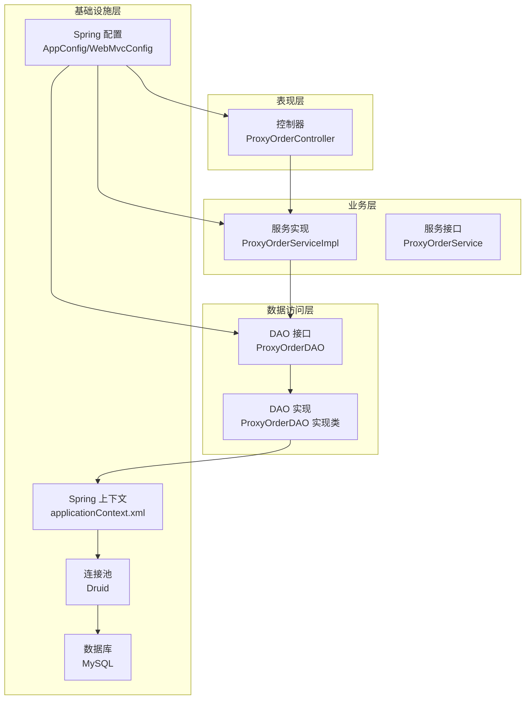
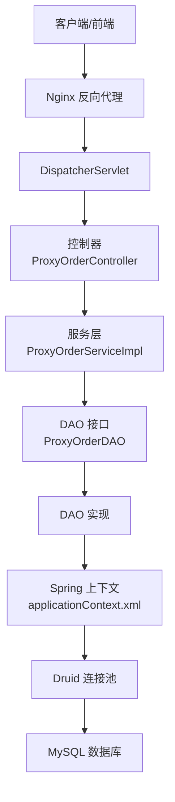
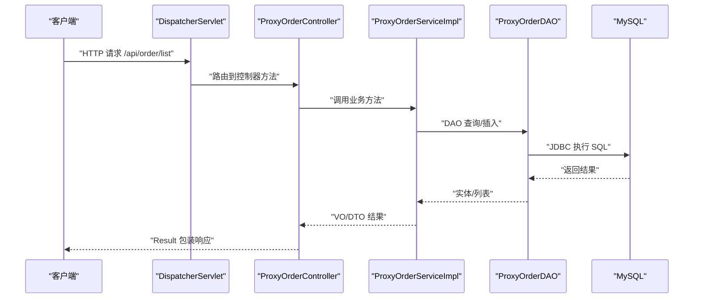
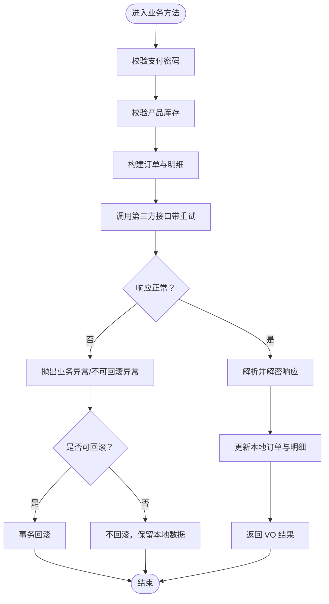
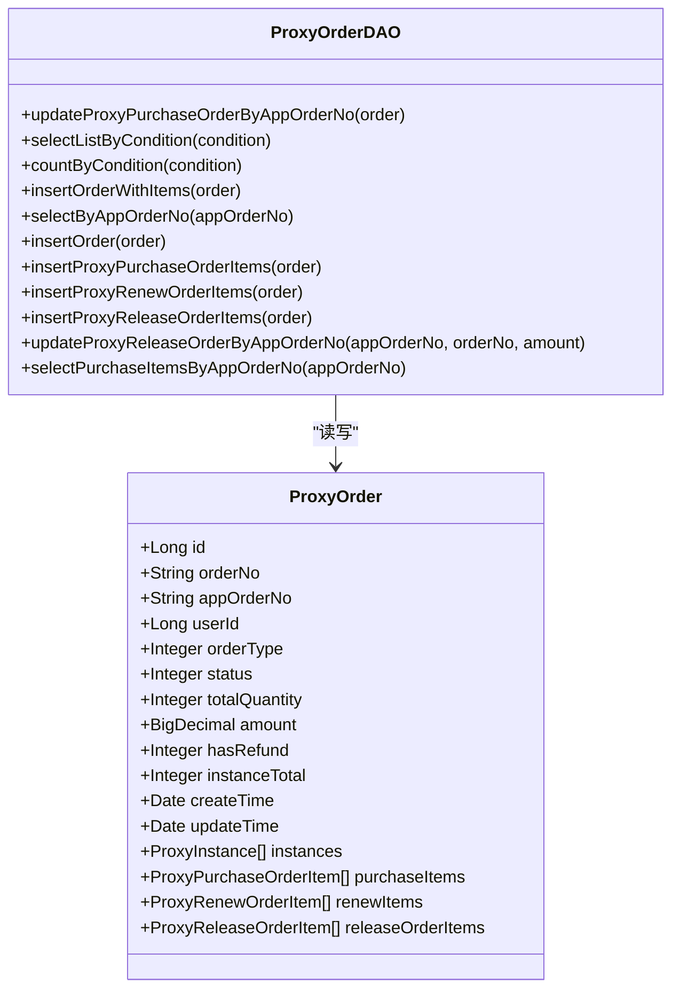
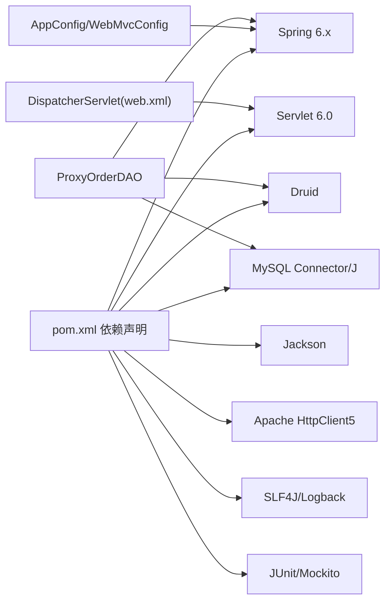

# 整体架构设计

<cite>
**本文引用的文件**
- [pom.xml](file://pom.xml)
- [web.xml](file://src/main/webapp/WEB-INF/web.xml)
- [applicationContext.xml](file://src/main/resources/applicationContext.xml)
- [AppConfig.java](file://src/main/java/cn/linkfast/config/AppConfig.java)
- [WebMvcConfig.java](file://src/main/java/cn/linkfast/config/WebMvcConfig.java)
- [ProxyOrderController.java](file://src/main/java/cn/linkfast/controller/ProxyOrderController.java)
- [ProxyOrderServiceImpl.java](file://src/main/java/cn/linkfast/service/impl/ProxyOrderServiceImpl.java)
- [ProxyOrderDAO.java](file://src/main/java/cn/linkfast/dao/ProxyOrderDAO.java)
- [ProxyOrder.java](file://src/main/java/cn/linkfast/entity/ProxyOrder.java)
- [Result.java](file://src/main/java/cn/linkfast/common/Result.java)
- [GlobalExceptionHandler.java](file://src/main/java/cn/linkfast/exception/GlobalExceptionHandler.java)
- [jdbc.properties](file://src/main/resources/jdbc.properties)
- [link-fast.conf](file://docs/nginx/link-fast.conf)
- [docs/README.md](file://docs/README.md)
</cite>

## 目录
1. [引言](#引言)
2. [项目结构](#项目结构)
3. [核心组件](#核心组件)
4. [架构总览](#架构总览)
5. [详细组件分析](#详细组件分析)
6. [依赖分析](#依赖分析)
7. [性能考量](#性能考量)
8. [故障排查指南](#故障排查指南)
9. [结论](#结论)
10. [附录](#附录)

## 引言
本文件面向 Link-Fast 系统的整体架构设计，基于 Spring Framework 的企业级应用架构，采用分层设计（表现层、业务层、数据访问层、基础设施层），结合 Spring MVC、Spring JDBC、Druid 连接池、MySQL 等技术栈，构建高可用、可扩展、可维护的代理服务订单处理系统。本文档旨在帮助开发者与运维人员快速理解系统架构、模块职责、数据流与控制流，并提供部署与运行环境建议。

## 项目结构
项目采用 Maven 多模块风格的单模块 WAR 工程组织方式，按功能域划分包结构：
- config：Spring 与 Spring MVC 配置
- controller：REST 控制器层
- service：业务服务层（含实现）
- dao：数据访问接口与实现
- entity/dto/vo：领域模型、传输对象与视图对象
- exception：全局异常处理与业务异常
- utils：工具类（加密、HTTP、订单号生成等）
- resources：Spring XML 配置、数据库连接与日志配置
- webapp/WEB-INF：Servlet 容器启动与 DispatcherServlet 配置

图表来源
- [ProxyOrderController.java](file://src/main/java/cn/linkfast/controller/ProxyOrderController.java)
- [ProxyOrderServiceImpl.java](file://src/main/java/cn/linkfast/service/impl/ProxyOrderServiceImpl.java)
- [ProxyOrderDAO.java](file://src/main/java/cn/linkfast/dao/ProxyOrderDAO.java)
- [AppConfig.java](file://src/main/java/cn/linkfast/config/AppConfig.java)
- [WebMvcConfig.java](file://src/main/java/cn/linkfast/config/WebMvcConfig.java)
- [applicationContext.xml](file://src/main/resources/applicationContext.xml)

章节来源
- [pom.xml](file://pom.xml)
- [web.xml](file://src/main/webapp/WEB-INF/web.xml)
- [AppConfig.java](file://src/main/java/cn/linkfast/config/AppConfig.java)
- [WebMvcConfig.java](file://src/main/java/cn/linkfast/config/WebMvcConfig.java)

## 核心组件
- 控制器层：负责接收 HTTP 请求、参数校验、封装响应，典型如订单相关控制器。
- 业务服务层：编排业务流程、事务控制、与第三方接口交互、数据转换与校验。
- 数据访问层：抽象 DAO 接口，实现与数据库交互（JDBC Template）。
- 配置层：Spring 核心配置与 MVC 配置，统一消息转换与跨域策略。
- 基础设施：数据源、连接池、事务管理、日志与异常处理。

章节来源
- [ProxyOrderController.java](file://src/main/java/cn/linkfast/controller/ProxyOrderController.java)
- [ProxyOrderServiceImpl.java](file://src/main/java/cn/linkfast/service/impl/ProxyOrderServiceImpl.java)
- [ProxyOrderDAO.java](file://src/main/java/cn/linkfast/dao/ProxyOrderDAO.java)
- [AppConfig.java](file://src/main/java/cn/linkfast/config/AppConfig.java)
- [WebMvcConfig.java](file://src/main/java/cn/linkfast/config/WebMvcConfig.java)
- [Result.java](file://src/main/java/cn/linkfast/common/Result.java)
- [GlobalExceptionHandler.java](file://src/main/java/cn/linkfast/exception/GlobalExceptionHandler.java)

## 架构总览
系统采用经典的三层架构与分层设计：
- 表现层（Web 层）：Spring MVC DispatcherServlet 拦截请求，交由控制器处理。
- 业务层（Service 层）：通过注解事务管理，协调 DAO 与外部接口调用。
- 数据层（DAO/JDBC）：使用 Spring JDBC Template 与 Druid 连接池访问 MySQL。
- 配置层：XML + Java Config 混合配置，集中管理数据源、事务与消息转换。

图表来源
- [web.xml](file://src/main/webapp/WEB-INF/web.xml)
- [ProxyOrderController.java](file://src/main/java/cn/linkfast/controller/ProxyOrderController.java)
- [ProxyOrderServiceImpl.java](file://src/main/java/cn/linkfast/service/impl/ProxyOrderServiceImpl.java)
- [ProxyOrderDAO.java](file://src/main/java/cn/linkfast/dao/ProxyOrderDAO.java)
- [applicationContext.xml](file://src/main/resources/applicationContext.xml)
- [link-fast.conf](file://docs/nginx/link-fast.conf)

## 详细组件分析

### 控制器层（Spring MVC）
- 职责：接收 /api/** 请求，进行参数校验，调用服务层，统一返回 Result 包装。
- 典型流程：控制器 -> 业务服务 -> DAO -> 数据库；异常通过全局处理器统一返回。

图表来源
- [ProxyOrderController.java](file://src/main/java/cn/linkfast/controller/ProxyOrderController.java)
- [ProxyOrderServiceImpl.java](file://src/main/java/cn/linkfast/service/impl/ProxyOrderServiceImpl.java)
- [ProxyOrderDAO.java](file://src/main/java/cn/linkfast/dao/ProxyOrderDAO.java)
- [Result.java](file://src/main/java/cn/linkfast/common/Result.java)

章节来源
- [ProxyOrderController.java](file://src/main/java/cn/linkfast/controller/ProxyOrderController.java)
- [Result.java](file://src/main/java/cn/linkfast/common/Result.java)
- [GlobalExceptionHandler.java](file://src/main/java/cn/linkfast/exception/GlobalExceptionHandler.java)

### 业务服务层（事务与容错）
- 职责：事务边界管理、与第三方接口交互、参数校验、数据转换、幂等与重试策略。
- 关键点：使用注解事务，区分可回滚与不可回滚异常；对第三方接口调用进行多场景容错与重试。

图表来源
- [ProxyOrderServiceImpl.java](file://src/main/java/cn/linkfast/service/impl/ProxyOrderServiceImpl.java)

章节来源
- [ProxyOrderServiceImpl.java](file://src/main/java/cn/linkfast/service/impl/ProxyOrderServiceImpl.java)

### 数据访问层（DAO 与 JDBC）
- 职责：定义订单相关 CRUD 与统计查询接口，DAO 实现通过 Spring JDBC Template 执行 SQL。
- 设计：接口与实现分离，便于替换实现与单元测试。

图表来源
- [ProxyOrderDAO.java](file://src/main/java/cn/linkfast/dao/ProxyOrderDAO.java)
- [ProxyOrder.java](file://src/main/java/cn/linkfast/entity/ProxyOrder.java)

章节来源
- [ProxyOrderDAO.java](file://src/main/java/cn/linkfast/dao/ProxyOrderDAO.java)
- [ProxyOrder.java](file://src/main/java/cn/linkfast/entity/ProxyOrder.java)

### 配置与基础设施
- Spring 核心配置：启用注解事务、组件扫描排除控制器、导入 XML 配置。
- Spring MVC 配置：消息转换器、跨域、默认 Servlet 处理。
- 数据源与事务：XML 配置 Druid 数据源、JdbcTemplate、DataSourceTransactionManager。
- 运行环境：Servlet 6.0、Jakarta EE 注解、JDK 17。

章节来源
- [AppConfig.java](file://src/main/java/cn/linkfast/config/AppConfig.java)
- [WebMvcConfig.java](file://src/main/java/cn/linkfast/config/WebMvcConfig.java)
- [applicationContext.xml](file://src/main/resources/applicationContext.xml)
- [web.xml](file://src/main/webapp/WEB-INF/web.xml)
- [jdbc.properties](file://src/main/resources/jdbc.properties)

## 依赖分析
- 技术栈与版本：
  - Spring Framework 6.x（Web、WebMVC、JDBC、TX）
  - Servlet API 6.0、Jakarta 注解与验证
  - Jackson JSON 处理
  - Druid 连接池、MySQL Connector/J
  - Apache HttpClient5、SLF4J/Logback
  - JUnit 5、Mockito、Hamcrest、JSONPath
- 依赖关系：控制器依赖服务接口；服务依赖 DAO 接口与工具类；DAO 依赖 Spring JDBC 与数据源；全局异常处理统一拦截。

图表来源
- [pom.xml](file://pom.xml)
- [web.xml](file://src/main/webapp/WEB-INF/web.xml)
- [AppConfig.java](file://src/main/java/cn/linkfast/config/AppConfig.java)
- [WebMvcConfig.java](file://src/main/java/cn/linkfast/config/WebMvcConfig.java)

章节来源
- [pom.xml](file://pom.xml)
- [web.xml](file://src/main/webapp/WEB-INF/web.xml)

## 性能考量
- 连接池与数据库优化：Druid 连接池配置了空闲回收、连接泄露检测、借用/空闲检测策略；MySQL URL 启用了批处理与多查询支持，提升批量写入效率。
- 事务与一致性：通过注解事务控制边界，区分可回滚与不可回滚异常，避免重复落库带来的数据不一致。
- 缓存与静态资源：Nginx 对静态资源设置缓存与 Gzip 压缩，降低后端压力。
- 第三方接口调用：对网络连接失败场景进行有限重试，区分“连接未建立”与“连接已建立但响应失败”的不同处理策略，减少重复操作风险。

章节来源
- [applicationContext.xml](file://src/main/resources/applicationContext.xml)
- [jdbc.properties](file://src/main/resources/jdbc.properties)
- [link-fast.conf](file://docs/nginx/link-fast.conf)

## 故障排查指南
- 统一响应与异常处理：全局异常处理器将业务异常、参数异常、未捕获异常统一包装为 Result，便于前端与监控系统识别。
- 常见问题定位：
  - 参数校验失败：检查控制器参数校验注解与错误信息聚合。
  - 业务异常：查看业务异常码与消息，结合服务层日志定位。
  - 数据库连接问题：检查 Druid 连接池配置与 MySQL 连接参数。
  - 第三方接口异常：关注服务层对连接失败、响应为空、JSON 解析失败、解密失败等场景的处理与日志记录。
- 日志与监控：使用 SLF4J/Logback 输出请求路径与异常堆栈，结合 Nginx 访问/错误日志定位入口层问题。

章节来源
- [GlobalExceptionHandler.java](file://src/main/java/cn/linkfast/exception/GlobalExceptionHandler.java)
- [Result.java](file://src/main/java/cn/linkfast/common/Result.java)
- [ProxyOrderServiceImpl.java](file://src/main/java/cn/linkfast/service/impl/ProxyOrderServiceImpl.java)
- [link-fast.conf](file://docs/nginx/link-fast.conf)

## 结论
Link-Fast 系统以 Spring Framework 为核心，采用清晰的分层架构与完善的异常处理机制，结合 Druid 连接池与 MySQL，实现了高可靠、可扩展的代理订单处理能力。通过 Nginx 反向代理与静态资源优化，进一步提升了系统整体性能与稳定性。未来可在以下方面持续演进：引入缓存层（Redis）、分布式事务（Seata）、可观测性（Prometheus/Grafana）与 API 网关（Spring Cloud Gateway）以增强弹性与治理能力。

## 附录

### 部署架构与运行环境
- 运行环境：JDK 17、Servlet 6.0 容器（如 Tomcat 10+）、Nginx。
- 部署建议：
  - Nginx 作为反向代理，区分静态资源、回调接口与核心业务接口，设置超时与缓存策略。
  - 应用容器监听 8080，Nginx 通过 proxy_pass 转发至后端。
  - 数据库部署于独立主机，连接参数在 jdbc.properties 中配置。
- 安全加固：Nginx 配置限制敏感路径访问、开启 Gzip 压缩。

章节来源
- [web.xml](file://src/main/webapp/WEB-INF/web.xml)
- [link-fast.conf](file://docs/nginx/link-fast.conf)
- [jdbc.properties](file://src/main/resources/jdbc.properties)
- [docs/README.md](file://docs/README.md)