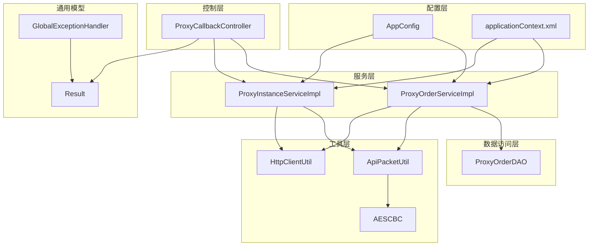
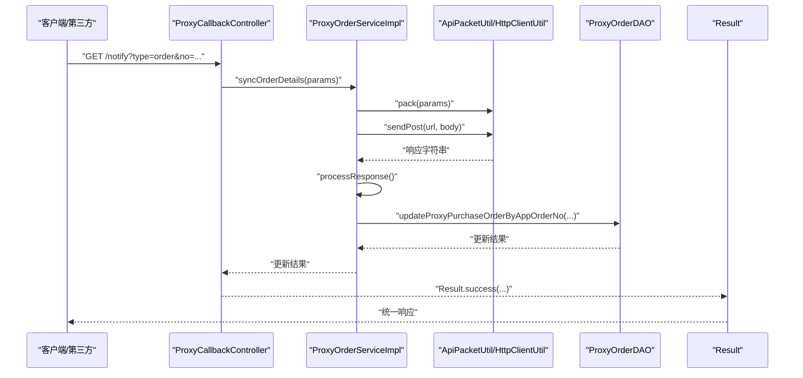
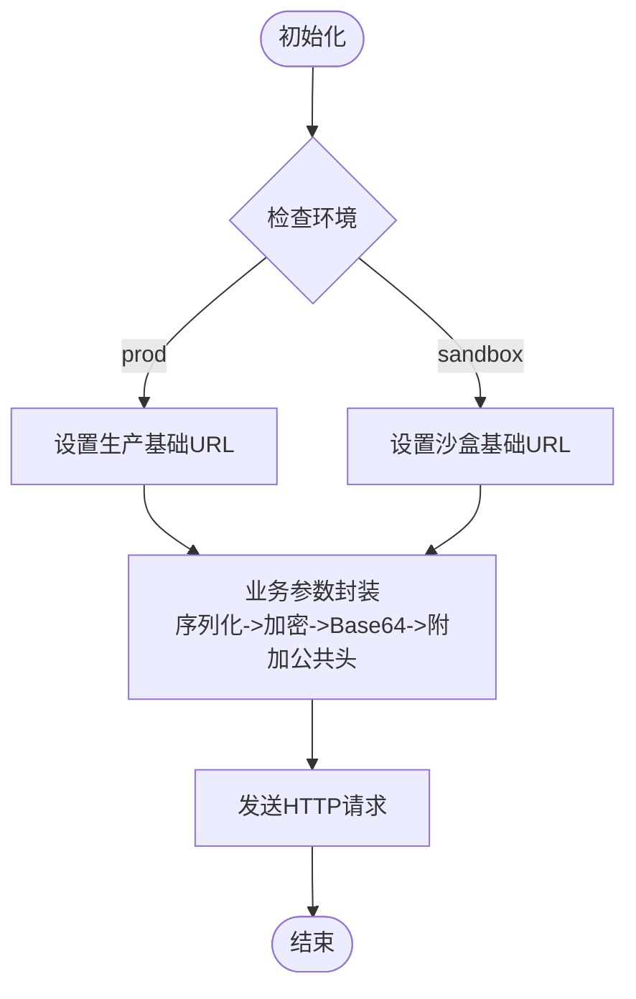
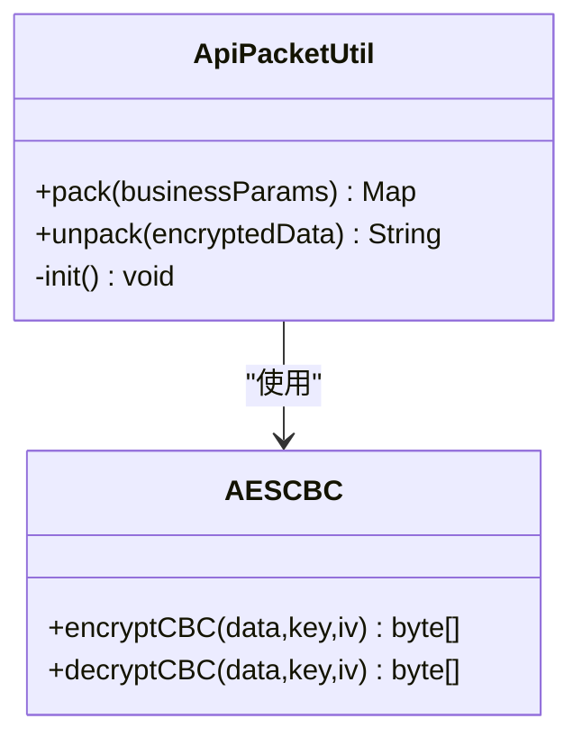
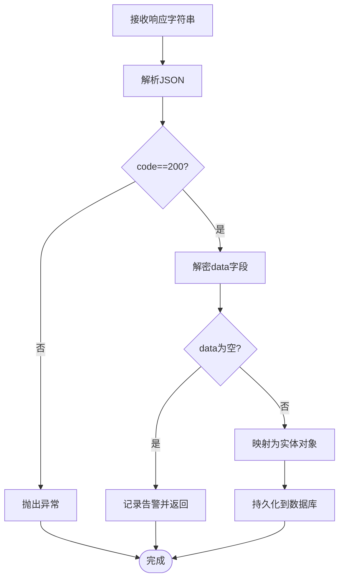
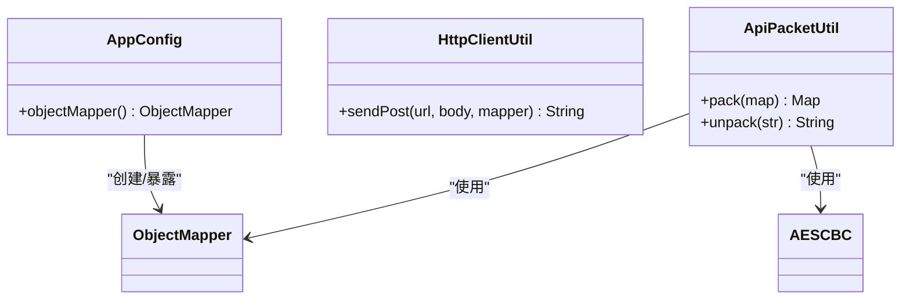
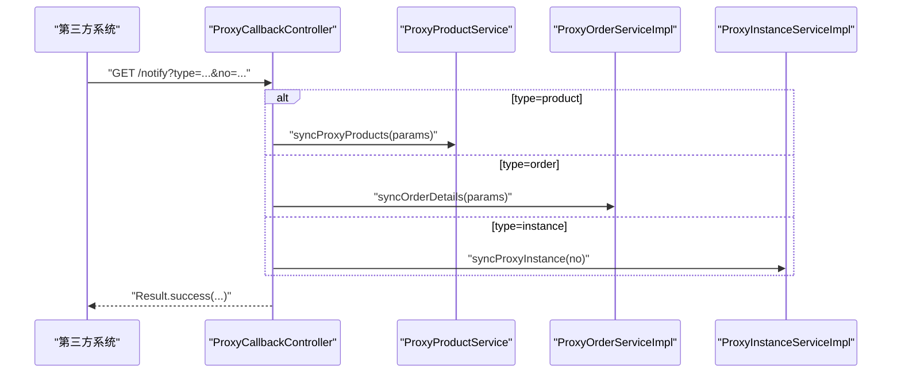
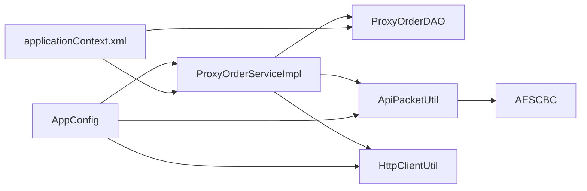

# 核心设计模式

<cite>
**本文引用的文件**   
- [ProxyOrderServiceImpl.java](file://src/main/java/cn/linkfast/service/impl/ProxyOrderServiceImpl.java)
- [ProxyInstanceServiceImpl.java](file://src/main/java/cn/linkfast/service/impl/ProxyInstanceServiceImpl.java)
- [ProxyOrderService.java](file://src/main/java/cn/linkfast/service/ProxyOrderService.java)
- [ProxyInstanceService.java](file://src/main/java/cn/linkfast/service/ProxyInstanceService.java)
- [ApiPacketUtil.java](file://src/main/java/cn/linkfast/utils/ApiPacketUtil.java)
- [AESCBC.java](file://src/main/java/cn/linkfast/utils/AESCBC.java)
- [HttpClientUtil.java](file://src/main/java/cn/linkfast/utils/HttpClientUtil.java)
- [AppConfig.java](file://src/main/java/cn/linkfast/config/AppConfig.java)
- [applicationContext.xml](file://src/main/resources/applicationContext.xml)
- [GlobalExceptionHandler.java](file://src/main/java/cn/linkfast/exception/GlobalExceptionHandler.java)
- [Result.java](file://src/main/java/cn/linkfast/common/Result.java)
- [ProxyCallbackController.java](file://src/main/java/cn/linkfast/controller/ProxyCallbackController.java)
- [ProxyOrderDAO.java](file://src/main/java/cn/linkfast/dao/ProxyOrderDAO.java)
</cite>

## 目录
1. [引言](#引言)
2. [项目结构](#项目结构)
3. [核心组件](#核心组件)
4. [架构总览](#架构总览)
5. [详细组件分析](#详细组件分析)
6. [依赖分析](#依赖分析)
7. [性能考虑](#性能考虑)
8. [故障排查指南](#故障排查指南)
9. [结论](#结论)
10. [附录](#附录)

## 引言
本文件聚焦 Link-Fast 系统中“核心设计模式”的落地与应用，围绕订单处理、环境配置、API 响应处理等关键场景，系统梳理并解读以下设计模式的实现与价值：
- 工厂模式：在订单处理流程中通过“环境配置工厂”动态选择第三方接口基础地址，实现运行期的环境切换与参数装配。
- 策略模式：在不同环境（沙盒/生产）之间切换时，通过策略化的配置加载与参数封装，隔离环境差异。
- 装饰器模式：在 API 响应处理中，通过工具类对原始响应进行“解密-解析-持久化”的链式处理，增强可扩展性与可维护性。
- 单例模式：在工具类层面（如加密/解密、HTTP 客户端、ObjectMapper）采用单例化管理，保证全局一致性与资源复用。
- 观察者模式：通过回调控制器接收第三方变更通知，触发本地同步流程，形成“事件驱动”的松耦合处理链。

## 项目结构
系统采用经典的分层架构：控制层（Controller）、服务层（Service）、数据访问层（DAO）、工具层（Utils）、配置层（Config）。各层职责清晰，配合 Spring 容器实现依赖注入与横切关注点（事务、异常处理）。

图表来源
- [ProxyCallbackController.java:32-92](file://src/main/java/cn/linkfast/controller/ProxyCallbackController.java#L32-L92)
- [ProxyOrderServiceImpl.java:37-87](file://src/main/java/cn/linkfast/service/impl/ProxyOrderServiceImpl.java#L37-L87)
- [ProxyInstanceServiceImpl.java:38-69](file://src/main/java/cn/linkfast/service/impl/ProxyInstanceServiceImpl.java#L38-L69)
- [ApiPacketUtil.java:17-51](file://src/main/java/cn/linkfast/utils/ApiPacketUtil.java#L17-L51)
- [HttpClientUtil.java:18-44](file://src/main/java/cn/linkfast/utils/HttpClientUtil.java#L18-L44)
- [AESCBC.java:19-36](file://src/main/java/cn/linkfast/utils/AESCBC.java#L19-L36)
- [AppConfig.java:14-36](file://src/main/java/cn/linkfast/config/AppConfig.java#L14-L36)
- [applicationContext.xml:14-67](file://src/main/resources/applicationContext.xml#L14-L67)
- [GlobalExceptionHandler.java:20-90](file://src/main/java/cn/linkfast/exception/GlobalExceptionHandler.java#L20-L90)
- [Result.java:10-59](file://src/main/java/cn/linkfast/common/Result.java#L10-L59)

章节来源
- [AppConfig.java:14-36](file://src/main/java/cn/linkfast/config/AppConfig.java#L14-L36)
- [applicationContext.xml:14-67](file://src/main/resources/applicationContext.xml#L14-L67)

## 核心组件
- 控制层：负责接收外部请求与第三方回调，协调服务层执行业务。
- 服务层：封装订单与实例的业务流程，包括参数封装、调用第三方 API、响应解析与持久化。
- 工具层：提供加密解密、HTTP 请求、对象映射等通用能力，采用单例化管理。
- 配置层：集中管理环境变量、Bean 定义与事务配置。

章节来源
- [ProxyOrderService.java:14-60](file://src/main/java/cn/linkfast/service/ProxyOrderService.java#L14-L60)
- [ProxyInstanceService.java:10-37](file://src/main/java/cn/linkfast/service/ProxyInstanceService.java#L10-L37)

## 架构总览
系统通过“控制层-服务层-工具层-配置层”的分层协作，实现对外部第三方系统的低耦合接入与对内业务逻辑的高内聚封装。异常处理与统一响应模型贯穿各层，保障用户体验与可观测性。

图表来源
- [ProxyCallbackController.java:40-91](file://src/main/java/cn/linkfast/controller/ProxyCallbackController.java#L40-L91)
- [ProxyOrderServiceImpl.java:89-136](file://src/main/java/cn/linkfast/service/impl/ProxyOrderServiceImpl.java#L89-L136)
- [ApiPacketUtil.java:56-90](file://src/main/java/cn/linkfast/utils/ApiPacketUtil.java#L56-L90)
- [HttpClientUtil.java:27-43](file://src/main/java/cn/linkfast/utils/HttpClientUtil.java#L27-L43)
- [ProxyOrderDAO.java:10-48](file://src/main/java/cn/linkfast/dao/ProxyOrderDAO.java#L10-L48)
- [Result.java:28-44](file://src/main/java/cn/linkfast/common/Result.java#L28-L44)

## 详细组件分析

### 工厂模式：环境配置工厂与请求参数封装
- 场景定位：在订单与实例相关操作中，需要根据运行环境（沙盒/生产）动态选择第三方接口基础地址，并对业务参数进行统一加密与封装。
- 实现要点：
  - 环境选择：服务实现类在初始化阶段依据配置选择基础 URL。
  - 参数封装：工具类负责将业务参数序列化、加密、Base64 编码，并附加公共头信息（版本、加密方式、appKey、reqId）。
- 价值与收益：
  - 降低环境切换成本，避免硬编码。
  - 统一参数封装流程，减少重复逻辑与出错点。
  - 便于扩展新的环境或协议版本。

图表来源
- [ProxyOrderServiceImpl.java:79-87](file://src/main/java/cn/linkfast/service/impl/ProxyOrderServiceImpl.java#L79-L87)
- [ProxyInstanceServiceImpl.java:62-69](file://src/main/java/cn/linkfast/service/impl/ProxyInstanceServiceImpl.java#L62-L69)
- [ApiPacketUtil.java:56-90](file://src/main/java/cn/linkfast/utils/ApiPacketUtil.java#L56-L90)

章节来源
- [ProxyOrderServiceImpl.java:46-87](file://src/main/java/cn/linkfast/service/impl/ProxyOrderServiceImpl.java#L46-L87)
- [ProxyInstanceServiceImpl.java:45-69](file://src/main/java/cn/linkfast/service/impl/ProxyInstanceServiceImpl.java#L45-L69)
- [ApiPacketUtil.java:22-51](file://src/main/java/cn/linkfast/utils/ApiPacketUtil.java#L22-L51)

### 策略模式：环境与参数策略的分离
- 场景定位：在不同环境下（沙盒/生产）加载不同的 appKey、appSecret 与基础 URL，同时对请求参数进行策略化封装。
- 实现要点：
  - 策略选择：根据环境变量选择对应的密钥与基础 URL。
  - 策略执行：统一的参数封装流程（序列化、加密、编码、附加头）。
- 价值与收益：
  - 将“如何选择策略”与“如何执行策略”解耦，便于新增策略或调整策略规则。
  - 降低跨环境维护成本，提升安全性与可审计性。

图表来源
- [ApiPacketUtil.java:17-103](file://src/main/java/cn/linkfast/utils/ApiPacketUtil.java#L17-L103)
- [AESCBC.java:19-36](file://src/main/java/cn/linkfast/utils/AESCBC.java#L19-L36)

章节来源
- [ApiPacketUtil.java:39-51](file://src/main/java/cn/linkfast/utils/ApiPacketUtil.java#L39-L51)

### 装饰器模式：API 响应处理链
- 场景定位：对第三方返回的响应进行“解密-解析-持久化”的链式处理，增强可扩展性与可维护性。
- 实现要点：
  - 解密：使用工具类对 data 字段进行 Base64 解码与 AES CBC 解密。
  - 解析：将解密后的 JSON 映射为实体对象。
  - 持久化：将解析结果写入数据库。
- 价值与收益：
  - 将“解密”“解析”“持久化”作为可插拔的处理步骤，便于替换或扩展处理逻辑。
  - 保持核心流程稳定，降低对上游/下游变化的敏感度。

图表来源
- [ProxyOrderServiceImpl.java:173-194](file://src/main/java/cn/linkfast/service/impl/ProxyOrderServiceImpl.java#L173-L194)
- [ProxyInstanceServiceImpl.java:163-191](file://src/main/java/cn/linkfast/service/impl/ProxyInstanceServiceImpl.java#L163-L191)
- [ApiPacketUtil.java:95-102](file://src/main/java/cn/linkfast/utils/ApiPacketUtil.java#L95-L102)

章节来源
- [ProxyOrderServiceImpl.java:173-194](file://src/main/java/cn/linkfast/service/impl/ProxyOrderServiceImpl.java#L173-L194)
- [ProxyInstanceServiceImpl.java:163-191](file://src/main/java/cn/linkfast/service/impl/ProxyInstanceServiceImpl.java#L163-L191)
- [ApiPacketUtil.java:95-102](file://src/main/java/cn/linkfast/utils/ApiPacketUtil.java#L95-L102)

### 单例模式：工具类与全局对象
- 场景定位：在系统中，ObjectMapper、HTTP 客户端、加密解密工具等需要全局唯一实例，保证一致性与资源复用。
- 实现要点：
  - ObjectMapper：在配置类中声明为 Bean，供服务层与测试环境共享。
  - HttpClientUtil：提供静态方法封装 HTTP POST 请求，避免重复创建客户端。
  - ApiPacketUtil：Spring 组件，负责参数封装与解密，内部持有 ObjectMapper 实例。
- 价值与收益：
  - 降低内存占用与初始化开销。
  - 统一配置与行为，便于测试与调试。

图表来源
- [AppConfig.java:29-35](file://src/main/java/cn/linkfast/config/AppConfig.java#L29-L35)
- [HttpClientUtil.java:18-44](file://src/main/java/cn/linkfast/utils/HttpClientUtil.java#L18-L44)
- [ApiPacketUtil.java:17-51](file://src/main/java/cn/linkfast/utils/ApiPacketUtil.java#L17-L51)

章节来源
- [AppConfig.java:29-35](file://src/main/java/cn/linkfast/config/AppConfig.java#L29-L35)
- [HttpClientUtil.java:18-44](file://src/main/java/cn/linkfast/utils/HttpClientUtil.java#L18-L44)
- [ApiPacketUtil.java:17-51](file://src/main/java/cn/linkfast/utils/ApiPacketUtil.java#L17-L51)

### 观察者模式：回调通知与事件驱动
- 场景定位：第三方系统通过回调通知平台数据变更（产品、订单、实例），平台据此触发本地同步流程。
- 实现要点：
  - 控制器接收回调，根据 type 分发到对应服务。
  - 服务执行同步与持久化，返回统一响应。
- 价值与收益：
  - 降低轮询成本，提高实时性。
  - 松耦合的事件驱动架构，便于扩展新的回调类型。

图表来源
- [ProxyCallbackController.java:40-91](file://src/main/java/cn/linkfast/controller/ProxyCallbackController.java#L40-L91)

章节来源
- [ProxyCallbackController.java:32-92](file://src/main/java/cn/linkfast/controller/ProxyCallbackController.java#L32-L92)

## 依赖分析
- 组件耦合：
  - 服务实现类依赖 DAO 接口与工具类，体现清晰的分层与依赖倒置。
  - 工具类之间存在组合关系（ApiPacketUtil 组合 AESCBC），但无循环依赖。
- 外部依赖：
  - Spring 容器负责 Bean 生命周期与依赖注入。
  - Apache HttpClient 5 用于 HTTP 请求封装。
- 配置依赖：
  - 环境变量与属性文件决定运行时行为（URL、密钥、事务管理器）。

图表来源
- [ProxyOrderServiceImpl.java:37-45](file://src/main/java/cn/linkfast/service/impl/ProxyOrderServiceImpl.java#L37-L45)
- [ProxyOrderDAO.java:10-102](file://src/main/java/cn/linkfast/dao/ProxyOrderDAO.java#L10-L102)
- [ApiPacketUtil.java:17-51](file://src/main/java/cn/linkfast/utils/ApiPacketUtil.java#L17-L51)
- [HttpClientUtil.java:18-44](file://src/main/java/cn/linkfast/utils/HttpClientUtil.java#L18-L44)
- [AppConfig.java:14-36](file://src/main/java/cn/linkfast/config/AppConfig.java#L14-L36)
- [applicationContext.xml:14-67](file://src/main/resources/applicationContext.xml#L14-L67)

章节来源
- [ProxyOrderServiceImpl.java:37-45](file://src/main/java/cn/linkfast/service/impl/ProxyOrderServiceImpl.java#L37-L45)
- [ProxyOrderDAO.java:10-102](file://src/main/java/cn/linkfast/dao/ProxyOrderDAO.java#L10-L102)
- [ApiPacketUtil.java:17-51](file://src/main/java/cn/linkfast/utils/ApiPacketUtil.java#L17-L51)
- [HttpClientUtil.java:18-44](file://src/main/java/cn/linkfast/utils/HttpClientUtil.java#L18-L44)
- [AppConfig.java:14-36](file://src/main/java/cn/linkfast/config/AppConfig.java#L14-L36)
- [applicationContext.xml:14-67](file://src/main/resources/applicationContext.xml#L14-L67)

## 性能考虑
- 网络请求与重试：
  - 对第三方接口调用采用有限次数重试与指数退避策略，避免雪崩效应。
  - 对于“连接失败”与“响应读取失败”等场景进行区分处理，确保幂等与一致性。
- 异步更新：
  - 在订单创建过程中对产品库存信息进行异步更新，降低主流程阻塞。
- 对象映射与序列化：
  - 通过全局 ObjectMapper 统一配置日期格式与未知字段处理策略，减少重复初始化与解析开销。
- 连接池与事务：
  - 数据源连接池参数与事务管理器在 XML 中集中配置，确保资源复用与一致性。

## 故障排查指南
- 统一异常处理：
  - 全局异常处理器将业务异常、参数异常、空指针异常与未捕获异常统一转化为标准响应，便于前端与第三方系统消费。
- 日志与可观测性：
  - 关键流程（请求 URL、请求参数、响应内容、解密结果）均记录日志，便于定位问题。
- 响应格式校验：
  - 对第三方返回的 JSON 结构进行严格校验（code、data、解密后字段），异常时抛出明确错误信息。

章节来源
- [GlobalExceptionHandler.java:20-90](file://src/main/java/cn/linkfast/exception/GlobalExceptionHandler.java#L20-L90)
- [Result.java:10-59](file://src/main/java/cn/linkfast/common/Result.java#L10-L59)
- [ProxyOrderServiceImpl.java:343-451](file://src/main/java/cn/linkfast/service/impl/ProxyOrderServiceImpl.java#L343-L451)
- [ProxyInstanceServiceImpl.java:163-191](file://src/main/java/cn/linkfast/service/impl/ProxyInstanceServiceImpl.java#L163-L191)

## 结论
Link-Fast 系统在订单与实例处理的关键路径上，有效运用了工厂模式、策略模式、装饰器模式、单例模式与观察者模式，实现了环境解耦、参数标准化、响应链路清晰、工具复用与事件驱动。这些设计模式共同提升了系统的可维护性、可扩展性与稳定性，为后续演进提供了坚实基础。

## 附录
- 设计模式选择原则与最佳实践
  - 优先选择“稳定接口 + 可变实现”的模式（如工厂/策略），以应对环境与协议变化。
  - 将“输入-处理-输出”中的“处理”环节抽象为可插拔步骤（装饰器），便于扩展与测试。
  - 对高频使用且状态无关的对象采用单例化管理，统一配置与生命周期。
  - 通过回调与事件驱动替代轮询，降低耦合并提升实时性。
  - 在边界处（网络、加密、解析）增加严格的校验与日志，确保可诊断性与可恢复性。