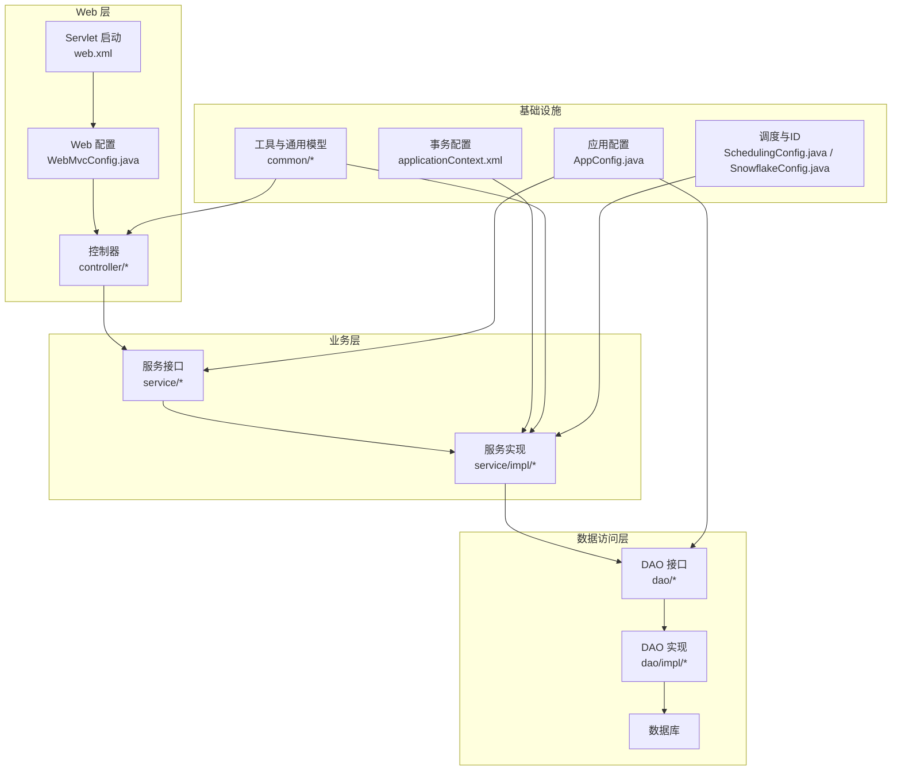
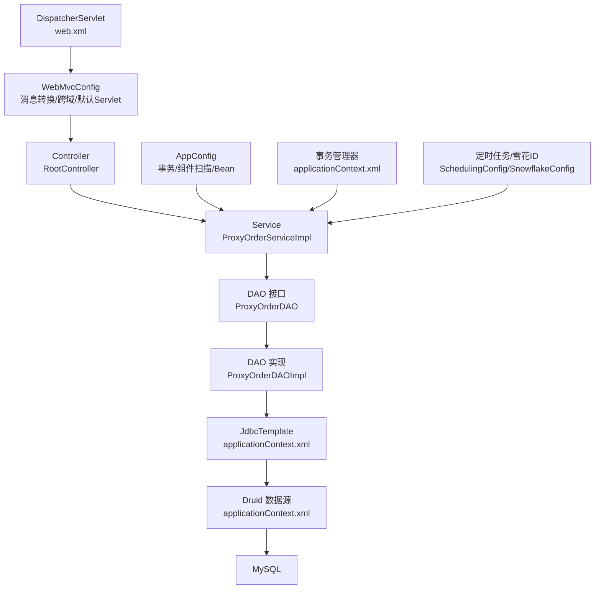
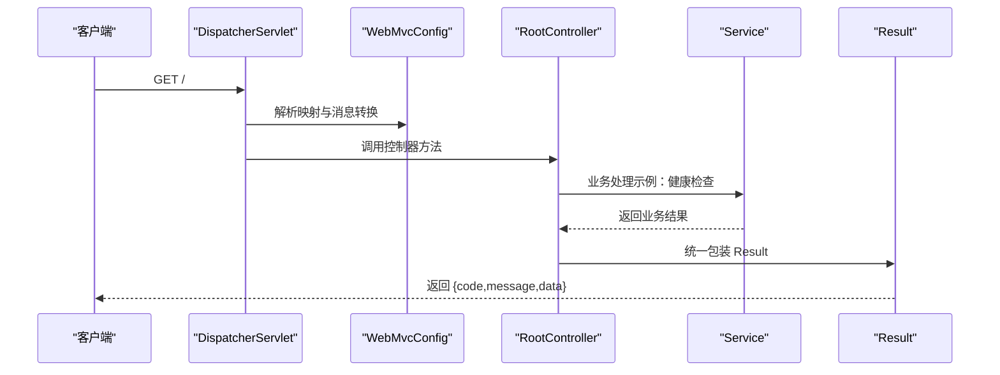
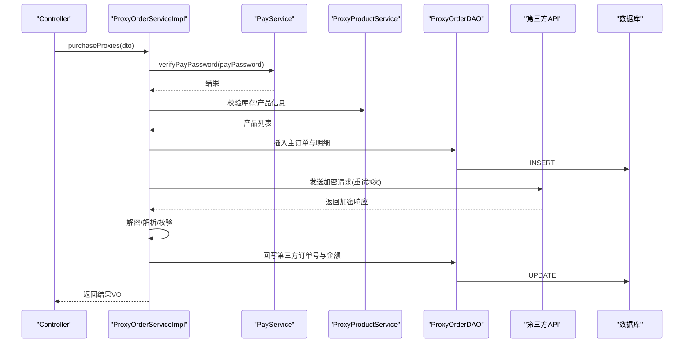
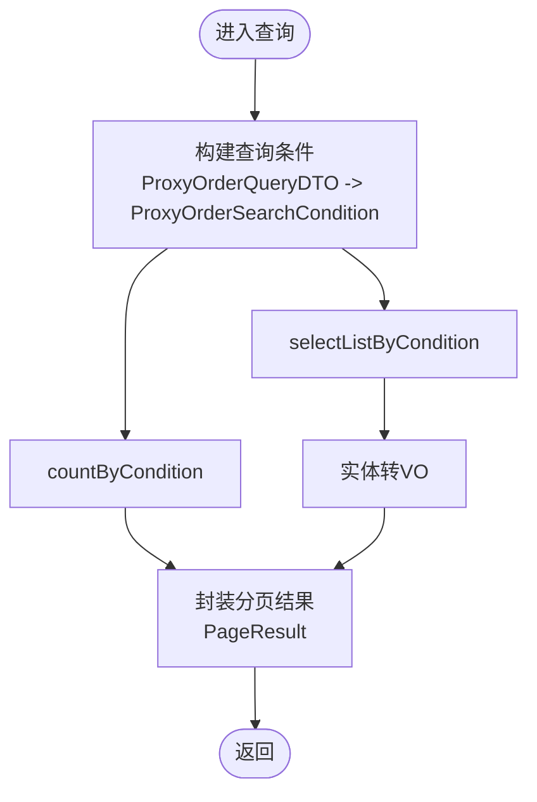
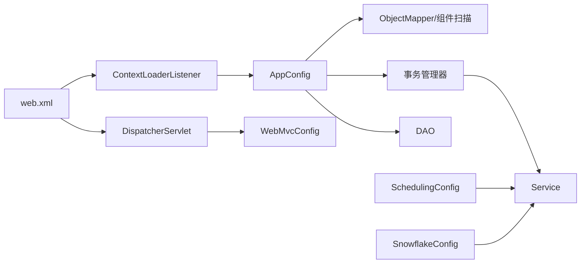
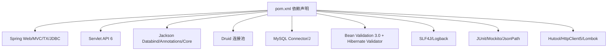
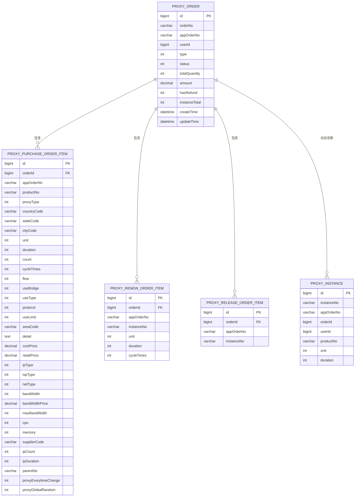

# 系统架构

<cite>
**本文引用的文件**
- [pom.xml](file://pom.xml)
- [web.xml](file://src/main/webapp/WEB-INF/web.xml)
- [applicationContext.xml](file://src/main/resources/applicationContext.xml)
- [AppConfig.java](file://src/main/java/cn/linkfast/config/AppConfig.java)
- [WebMvcConfig.java](file://src/main/java/cn/linkfast/config/WebMvcConfig.java)
- [SchedulingConfig.java](file://src/main/java/cn/linkfast/config/SnowflakeConfig.java)
- [Result.java](file://src/main/java/cn/linkfast/common/Result.java)
- [PageResult.java](file://src/main/java/cn/linkfast/common/PageResult.java)
- [RootController.java](file://src/main/java/cn/linkfast/controller/RootController.java)
- [ProxyOrderServiceImpl.java](file://src/main/java/cn/linkfast/service/impl/ProxyOrderServiceImpl.java)
- [ProxyOrderDAO.java](file://src/main/java/cn/linkfast/dao/ProxyOrderDAO.java)
- [ProxyOrder.java](file://src/main/java/cn/linkfast/entity/ProxyOrder.java)
- [ProxyOrderQueryDTO.java](file://src/main/java/cn/linkfast/dto/ProxyOrderQueryDTO.java)
- [ProxyOrderVO.java](file://src/main/java/cn/linkfast/vo/ProxyOrderVO.java)
</cite>

## 目录
1. [引言](#引言)
2. [项目结构](#项目结构)
3. [核心组件](#核心组件)
4. [架构总览](#架构总览)
5. [详细组件分析](#详细组件分析)
6. [依赖分析](#依赖分析)
7. [性能考虑](#性能考虑)
8. [故障排查指南](#故障排查指南)
9. [结论](#结论)
10. [附录](#附录)

## 引言
本架构文档面向 Link-Fast 系统，系统采用基于 Spring Framework 的传统三层架构（控制层-业务层-数据访问层），结合 MVC 设计模式，通过依赖注入容器管理组件生命周期，利用注解驱动的事务管理保障数据一致性，并通过统一结果包装与分页容器提升接口稳定性与可维护性。系统同时引入定时任务与雪花 ID 生成器等基础设施能力，支撑高并发与可扩展的代理订单相关业务。

## 项目结构
项目采用标准 Maven WAR 工程布局，核心目录与职责如下：
- config：Spring 核心与 Web MVC 配置，分别负责业务与持久层容器、Web 控制层容器以及调度与分布式 ID 生成。
- controller：MVC 的视图控制器，接收 HTTP 请求，调用服务层并返回统一结果包装。
- service：业务逻辑层，封装订单同步、购买、续费、释放等核心流程，承担事务边界与异常策略。
- dao：数据访问层接口，定义订单、产品、区域、用户等数据操作契约；具体实现位于 impl 包。
- entity/dto/vo：领域模型、查询传输对象与展示对象，清晰分离数据结构与职责。
- common：通用结果包装与分页容器，统一对外输出格式。
- resources：Spring XML 配置、数据库连接与 API 参数配置。
- webapp/WEB-INF：Servlet 容器启动入口与编码过滤器配置。

**图表来源**
- [web.xml:1-73](file://src/main/webapp/WEB-INF/web.xml#L1-L73)
- [WebMvcConfig.java:1-62](file://src/main/java/cn/linkfast/config/WebMvcConfig.java#L1-L62)
- [AppConfig.java:1-36](file://src/main/java/cn/linkfast/config/AppConfig.java#L1-L36)
- [applicationContext.xml:1-67](file://src/main/resources/applicationContext.xml#L1-L67)

**章节来源**
- [pom.xml:1-278](file://pom.xml#L1-L278)
- [web.xml:1-73](file://src/main/webapp/WEB-INF/web.xml#L1-L73)

## 核心组件
- 统一结果包装 Result：提供成功/错误响应模板与成功判定逻辑，规范接口返回结构。
- 分页结果容器 PageResult：封装分页总数、总页数、当前页数据与页码/大小，简化分页返回。
- 控制器 RootController：提供根路径健康检查接口，返回统一结果包装。
- 业务服务 ProxyOrderServiceImpl：实现订单同步、购买、续费、释放等核心流程，承担事务边界与异常策略。
- 数据访问接口 ProxyOrderDAO：定义订单主从表的增删改查与统计聚合方法。
- 领域模型 ProxyOrder：承载订单主表、实例明细与各类订单明细集合。
- DTO/VO：ProxyOrderQueryDTO 与 ProxyOrderVO 分别用于查询条件与展示对象，保持前后端契约稳定。

**章节来源**
- [Result.java:1-59](file://src/main/java/cn/linkfast/common/Result.java#L1-L59)
- [PageResult.java:1-37](file://src/main/java/cn/linkfast/common/PageResult.java#L1-L37)
- [RootController.java:1-20](file://src/main/java/cn/linkfast/controller/RootController.java#L1-L20)
- [ProxyOrderServiceImpl.java:1-820](file://src/main/java/cn/linkfast/service/impl/ProxyOrderServiceImpl.java#L1-L820)
- [ProxyOrderDAO.java:1-102](file://src/main/java/cn/linkfast/dao/ProxyOrderDAO.java#L1-L102)
- [ProxyOrder.java:1-45](file://src/main/java/cn/linkfast/entity/ProxyOrder.java#L1-L45)
- [ProxyOrderQueryDTO.java:1-57](file://src/main/java/cn/linkfast/dto/ProxyOrderQueryDTO.java#L1-L57)
- [ProxyOrderVO.java:1-47](file://src/main/java/cn/linkfast/vo/ProxyOrderVO.java#L1-L47)

## 架构总览
系统采用 Spring MVC + Spring IoC/AOP + JDBC Template 的组合：
- Web 层：DispatcherServlet 由 web.xml 启动，WebMvcConfig 注册消息转换器、跨域与默认 Servlet 处理。
- 应用层：AppConfig 启用事务与组件扫描，导入 XML 事务与数据源配置。
- 事务与数据源：applicationContext.xml 定义 Druid 数据源、JdbcTemplate 与 DataSourceTransactionManager，并启用注解驱动事务。
- 业务层：服务类通过构造器注入 DAO、工具类与外部服务，声明式事务覆盖核心业务方法。
- 数据访问层：DAO 接口与实现分离，DAO 实现复用 JdbcTemplate 完成 SQL 操作。
- 基础设施：SchedulingConfig 开启定时任务；SnowflakeConfig 提供分布式 ID 生成。

**图表来源**
- [web.xml:23-40](file://src/main/webapp/WEB-INF/web.xml#L23-L40)
- [WebMvcConfig.java:19-62](file://src/main/java/cn/linkfast/config/WebMvcConfig.java#L19-L62)
- [AppConfig.java:14-36](file://src/main/java/cn/linkfast/config/AppConfig.java#L14-L36)
- [applicationContext.xml:14-67](file://src/main/resources/applicationContext.xml#L14-L67)
- [ProxyOrderServiceImpl.java:34-60](file://src/main/java/cn/linkfast/service/impl/ProxyOrderServiceImpl.java#L34-L60)

## 详细组件分析

### 控制层（Controller）
- 职责：接收 HTTP 请求，进行基础校验，调用服务层执行业务，返回 Result 或 PageResult 包装。
- 交互：RootController 提供根路径健康检查，控制器通过 Spring MVC 注入服务 Bean。
- 统一输出：Result.success/error 提供一致的响应结构，便于前端统一处理。

**图表来源**
- [web.xml:23-40](file://src/main/webapp/WEB-INF/web.xml#L23-L40)
- [WebMvcConfig.java:19-62](file://src/main/java/cn/linkfast/config/WebMvcConfig.java#L19-L62)
- [RootController.java:14-19](file://src/main/java/cn/linkfast/controller/RootController.java#L14-L19)

**章节来源**
- [RootController.java:1-20](file://src/main/java/cn/linkfast/controller/RootController.java#L1-L20)
- [Result.java:1-59](file://src/main/java/cn/linkfast/common/Result.java#L1-L59)

### 业务层（Service）
- 职责：封装订单同步、购买、续费、释放等核心流程；负责参数校验、调用外部 API、数据解包与落库；通过事务保障一致性。
- 事务策略：使用 @Transactional 标注核心方法，rollbackFor 指定可回滚异常，noRollbackFor 指定“对方已落库”场景的不可回滚异常，确保幂等与一致性。
- 异常策略：区分可回滚业务异常与不可回滚业务异常，避免重复扣款或重复入账。
- 外部集成：通过工具类封装加密打包与 HTTP 调用，统一重试策略与错误分支处理。

**图表来源**
- [ProxyOrderServiceImpl.java:196-458](file://src/main/java/cn/linkfast/service/impl/ProxyOrderServiceImpl.java#L196-L458)
- [ProxyOrderDAO.java:48-102](file://src/main/java/cn/linkfast/dao/ProxyOrderDAO.java#L48-L102)

**章节来源**
- [ProxyOrderServiceImpl.java:1-820](file://src/main/java/cn/linkfast/service/impl/ProxyOrderServiceImpl.java#L1-L820)

### 数据访问层（DAO）
- 职责：定义订单主从表的 CRUD 与统计方法，DAO 实现复用 JdbcTemplate 执行 SQL。
- 事务边界：DAO 方法不直接标注事务，事务由 Service 层统一管理，确保跨多个 DAO 的一致性。
- 查询契约：通过 ProxyOrderQueryDTO 转换为 ProxyOrderSearchCondition，支持分页与条件过滤。

**图表来源**
- [ProxyOrderServiceImpl.java:138-154](file://src/main/java/cn/linkfast/service/impl/ProxyOrderServiceImpl.java#L138-L154)
- [ProxyOrderDAO.java:10-32](file://src/main/java/cn/linkfast/dao/ProxyOrderDAO.java#L10-L32)
- [ProxyOrderQueryDTO.java:1-57](file://src/main/java/cn/linkfast/dto/ProxyOrderQueryDTO.java#L1-L57)

**章节来源**
- [ProxyOrderDAO.java:1-102](file://src/main/java/cn/linkfast/dao/ProxyOrderDAO.java#L1-L102)
- [ProxyOrderServiceImpl.java:138-154](file://src/main/java/cn/linkfast/service/impl/ProxyOrderServiceImpl.java#L138-L154)

### 配置与基础设施
- Web 层配置：web.xml 指定 ContextLoaderListener 与 DispatcherServlet，分别加载 AppConfig 与 WebMvcConfig；编码过滤器统一 UTF-8。
- 应用层配置：AppConfig 启用事务与组件扫描，排除 Controller，导入 applicationContext.xml；提供 ObjectMapper Bean。
- 事务与数据源：applicationContext.xml 定义 Druid 数据源、JdbcTemplate、DataSourceTransactionManager，并启用注解驱动事务。
- 调度与 ID：SchedulingConfig 开启定时任务；SnowflakeConfig 基于本机 IP 计算工作进程 ID，提供全局唯一 ID 生成。

**图表来源**
- [web.xml:10-34](file://src/main/webapp/WEB-INF/web.xml#L10-L34)
- [AppConfig.java:14-36](file://src/main/java/cn/linkfast/config/AppConfig.java#L14-L36)
- [applicationContext.xml:14-67](file://src/main/resources/applicationContext.xml#L14-L67)
- [SchedulingConfig.java:1-49](file://src/main/java/cn/linkfast/config/SnowflakeConfig.java#L1-L49)

**章节来源**
- [web.xml:1-73](file://src/main/webapp/WEB-INF/web.xml#L1-L73)
- [AppConfig.java:1-36](file://src/main/java/cn/linkfast/config/AppConfig.java#L1-L36)
- [applicationContext.xml:1-67](file://src/main/resources/applicationContext.xml#L1-L67)
- [SchedulingConfig.java:1-49](file://src/main/java/cn/linkfast/config/SnowflakeConfig.java#L1-L49)

## 依赖分析
- 框架与版本：Spring Web/MVC 6、Spring JDBC/TX、Jackson 2.15、Servlet API 6、Bean Validation 3.0/Hibernate Validator 8、Logback、JUnit/Mockito。
- 数据库与连接池：MySQL Connector/J 8.4、Druid 1.2.28。
- 工具库：Hutool（雪花 ID）、Apache HttpComponents Client5、Lombok。
- 事务与 AOP：通过注解驱动的 @Transactional 实现声明式事务，结合异常分类实现“可回滚/不可回滚”的精细化控制。

**图表来源**
- [pom.xml:22-212](file://pom.xml#L22-L212)

**章节来源**
- [pom.xml:1-278](file://pom.xml#L1-L278)

## 性能考虑
- 连接池与超时：Druid 连接池配置最小空闲、最大活跃、获取超时与空闲回收策略，降低连接泄漏风险与抖动。
- 事务粒度：Service 层统一事务边界，减少跨服务的长事务，避免锁竞争。
- 异步更新：库存异步刷新，降低下单主链路阻塞。
- 缓存与重试：对第三方接口采用有限次数重试与幂等字段（appOrderNo）避免重复入账。
- 序列化优化：统一 Jackson ObjectMapper 配置，避免未知字段报错，提升序列化稳定性。
- 定时任务：通过 @EnableScheduling 启用后台同步任务，减轻实时请求压力。

## 故障排查指南
- 统一异常处理：建议在全局异常处理器中捕获 BusinessException 与 NoRollbackBusinessException，前者触发事务回滚，后者不回滚并保留现场数据，便于人工核对。
- 事务回滚条件：检查 @Transactional 的 rollbackFor/noRollbackFor 配置是否与业务异常类型匹配。
- 第三方接口异常分支：关注“连接失败/响应读取失败/响应为空/JSON 非法/解密失败/缺少字段”等场景，确保日志与告警覆盖。
- 数据一致性：若出现“对方已落库”场景，优先以 appOrderNo 与第三方 orderNo 为线索核对数据库与第三方系统状态。
- 日志与监控：结合 SLF4J/Logback 输出关键链路日志，配合监控指标定位慢查询与异常峰值。

**章节来源**
- [ProxyOrderServiceImpl.java:344-451](file://src/main/java/cn/linkfast/service/impl/ProxyOrderServiceImpl.java#L344-L451)
- [ProxyOrderServiceImpl.java:555-672](file://src/main/java/cn/linkfast/service/impl/ProxyOrderServiceImpl.java#L555-L672)
- [ProxyOrderServiceImpl.java:719-800](file://src/main/java/cn/linkfast/service/impl/ProxyOrderServiceImpl.java#L719-L800)

## 结论
Link-Fast 系统以 Spring 为核心，采用清晰的三层架构与 MVC 模式，通过统一结果包装与分页容器提升接口一致性与可维护性。业务层通过精细化的事务与异常策略保障与第三方系统的数据一致性，数据访问层以 DAO 接口与 JdbcTemplate 实现稳定的数据操作。配置层通过 XML 与注解结合，提供事务、消息转换、跨域与调度等基础设施能力。整体设计兼顾扩展性与稳定性，适合在高并发与多实例部署场景下演进。

## 附录
- 关键设计模式应用
  - 工厂模式：SnowflakeConfig 通过 @Bean 提供全局唯一 ID 工厂。
  - 策略模式：服务层根据订单类型（购买/续费/释放）选择不同处理分支，可视为策略分支。
  - 装饰器模式：WebMvcConfig 对 Jackson 的 MappingJackson2HttpMessageConverter 进行装饰，统一日期格式化。
- 数据模型关系

**图表来源**
- [ProxyOrder.java:17-45](file://src/main/java/cn/linkfast/entity/ProxyOrder.java#L17-L45)
- [ProxyOrderServiceImpl.java:256-311](file://src/main/java/cn/linkfast/service/impl/ProxyOrderServiceImpl.java#L256-L311)
- [ProxyOrderServiceImpl.java:493-507](file://src/main/java/cn/linkfast/service/impl/ProxyOrderServiceImpl.java#L493-L507)
- [ProxyOrderServiceImpl.java:697-705](file://src/main/java/cn/linkfast/service/impl/ProxyOrderServiceImpl.java#L697-L705)