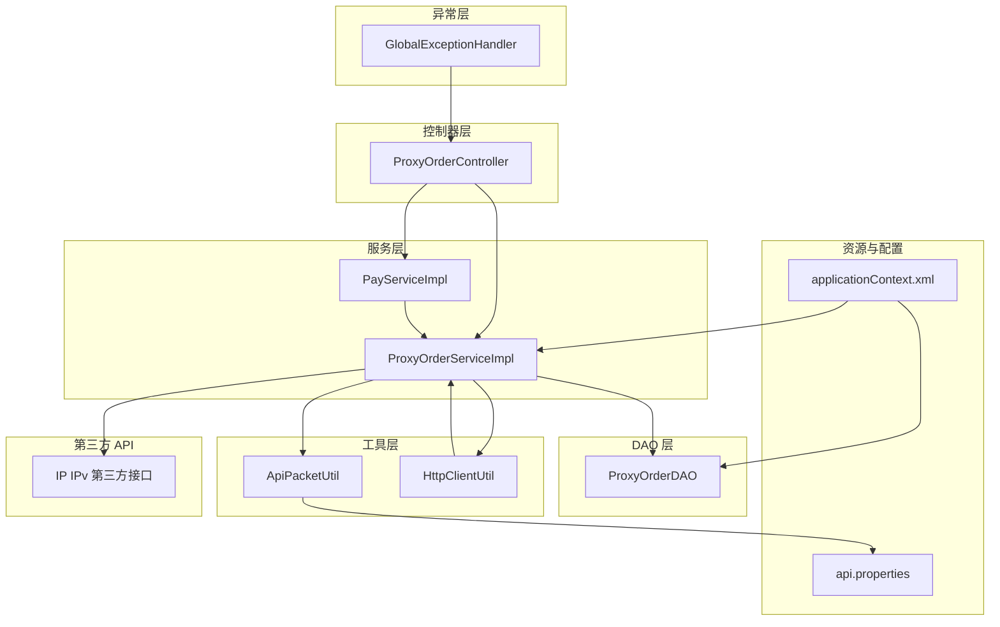
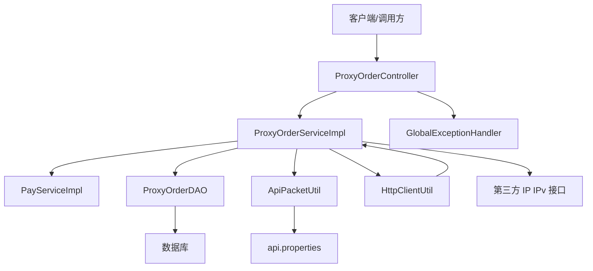
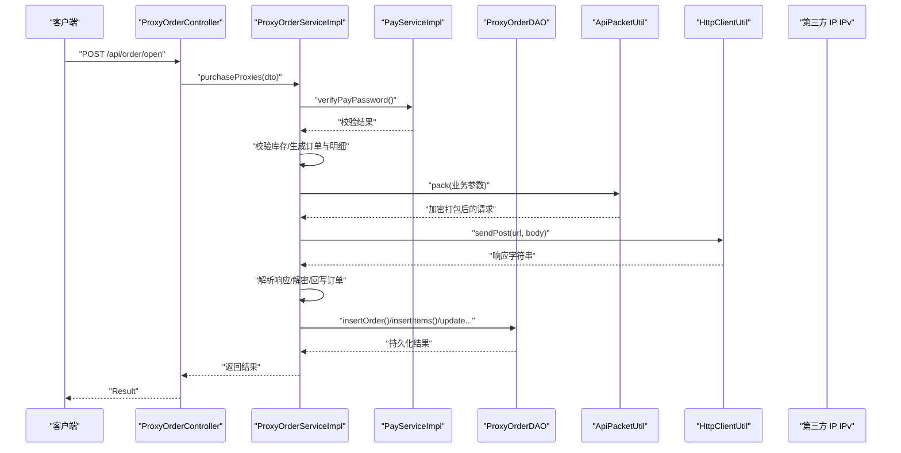
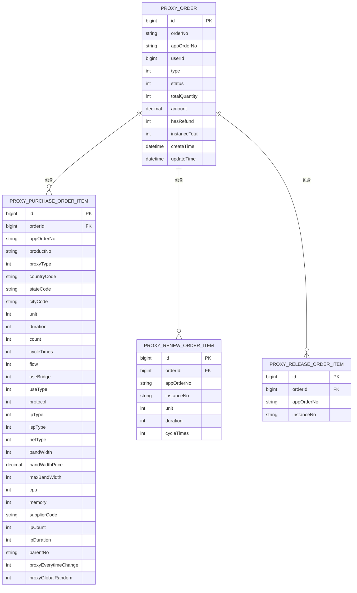
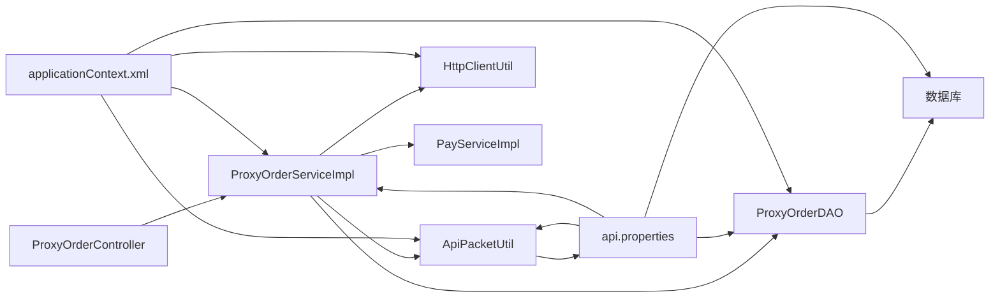

# 组件交互与数据流

<cite>
**本文引用的文件**
- [ProxyOrderController.java](file://src/main/java/cn/linkfast/controller/ProxyOrderController.java)
- [ProxyOrderServiceImpl.java](file://src/main/java/cn/linkfast/service/impl/ProxyOrderServiceImpl.java)
- [ProxyOrderDAO.java](file://src/main/java/cn/linkfast/dao/ProxyOrderDAO.java)
- [ProxyOrder.java](file://src/main/java/cn/linkfast/entity/ProxyOrder.java)
- [ProxyOrderQueryDTO.java](file://src/main/java/cn/linkfast/dto/ProxyOrderQueryDTO.java)
- [HttpClientUtil.java](file://src/main/java/cn/linkfast/utils/HttpClientUtil.java)
- [ApiPacketUtil.java](file://src/main/java/cn/linkfast/utils/ApiPacketUtil.java)
- [GlobalExceptionHandler.java](file://src/main/java/cn/linkfast/exception/GlobalExceptionHandler.java)
- [PayService.java](file://src/main/java/cn/linkfast/service/PayService.java)
- [PayServiceImpl.java](file://src/main/java/cn/linkfast/service/impl/PayServiceImpl.java)
- [applicationContext.xml](file://src/main/resources/applicationContext.xml)
- [api.properties](file://src/main/resources/api.properties)
- [ProxyOrderVO.java](file://src/main/java/cn/linkfast/vo/ProxyOrderVO.java)
- [创建代理订单接口-第三方.md](file://docs/api/third-party/创建代理订单接口-第三方.md)
- [代理续费接口-第三方.md](file://docs/api/third-party/代理续费接口-第三方.md)
</cite>

## 目录
1. [引言](#引言)
2. [项目结构](#项目结构)
3. [核心组件](#核心组件)
4. [架构总览](#架构总览)
5. [详细组件分析](#详细组件分析)
6. [依赖分析](#依赖分析)
7. [性能考虑](#性能考虑)
8. [故障排查指南](#故障排查指南)
9. [结论](#结论)
10. [附录](#附录)

## 引言
本文件面向 Link-Fast 系统的组件交互与数据流，聚焦于从 HTTP 请求到数据库操作的完整链路，覆盖第三方 API 集成的数据交换格式与协议、异常处理与错误传播路径、缓存与数据同步策略，并通过时序图与组件交互图直观展示系统运行流程。目标读者包括一线开发者与技术负责人，帮助快速理解系统运行机制并进行性能优化与问题定位。

## 项目结构
Link-Fast 采用基于功能域的分层组织：控制器层负责对外 HTTP 接口，服务层承载业务编排与第三方交互，DAO 层负责数据库访问，工具层提供加密打包与 HTTP 调用能力，异常层集中处理全局异常，资源层提供配置与文档。

图表来源
- [ProxyOrderController.java:1-88](file://src/main/java/cn/linkfast/controller/ProxyOrderController.java#L1-L88)
- [ProxyOrderServiceImpl.java:1-782](file://src/main/java/cn/linkfast/service/impl/ProxyOrderServiceImpl.java#L1-L782)
- [ProxyOrderDAO.java:1-102](file://src/main/java/cn/linkfast/dao/ProxyOrderDAO.java#L1-L102)
- [ApiPacketUtil.java:1-106](file://src/main/java/cn/linkfast/utils/ApiPacketUtil.java#L1-L106)
- [HttpClientUtil.java:1-46](file://src/main/java/cn/linkfast/utils/HttpClientUtil.java#L1-L46)
- [GlobalExceptionHandler.java:1-90](file://src/main/java/cn/linkfast/exception/GlobalExceptionHandler.java#L1-L90)
- [applicationContext.xml:1-67](file://src/main/resources/applicationContext.xml#L1-L67)
- [api.properties:1-31](file://src/main/resources/api.properties#L1-L31)

章节来源
- [ProxyOrderController.java:1-88](file://src/main/java/cn/linkfast/controller/ProxyOrderController.java#L1-L88)
- [ProxyOrderServiceImpl.java:1-782](file://src/main/java/cn/linkfast/service/impl/ProxyOrderServiceImpl.java#L1-L782)
- [ProxyOrderDAO.java:1-102](file://src/main/java/cn/linkfast/dao/ProxyOrderDAO.java#L1-L102)
- [ApiPacketUtil.java:1-106](file://src/main/java/cn/linkfast/utils/ApiPacketUtil.java#L1-L106)
- [HttpClientUtil.java:1-46](file://src/main/java/cn/linkfast/utils/HttpClientUtil.java#L1-L46)
- [GlobalExceptionHandler.java:1-90](file://src/main/java/cn/linkfast/exception/GlobalExceptionHandler.java#L1-L90)
- [applicationContext.xml:1-67](file://src/main/resources/applicationContext.xml#L1-L67)
- [api.properties:1-31](file://src/main/resources/api.properties#L1-L31)

## 核心组件
- 控制器层：对外暴露订单相关接口，负责参数校验、调用服务层并返回统一结果包装。
- 服务层：编排业务流程，处理与第三方 API 的加密打包、请求重试、响应解析与回写数据库。
- DAO 层：封装订单主表与明细表的增删改查，支撑事务一致性。
- 工具层：提供 AES-CBC 加密解密与 HTTP POST 能力，统一请求/响应格式。
- 异常层：集中处理业务异常、参数异常与全局异常，保证对外统一错误码与消息。
- 配置层：加载 JDBC 与第三方 API 配置，启用注解式事务。

章节来源
- [ProxyOrderController.java:1-88](file://src/main/java/cn/linkfast/controller/ProxyOrderController.java#L1-L88)
- [ProxyOrderServiceImpl.java:1-782](file://src/main/java/cn/linkfast/service/impl/ProxyOrderServiceImpl.java#L1-L782)
- [ProxyOrderDAO.java:1-102](file://src/main/java/cn/linkfast/dao/ProxyOrderDAO.java#L1-L102)
- [ApiPacketUtil.java:1-106](file://src/main/java/cn/linkfast/utils/ApiPacketUtil.java#L1-L106)
- [HttpClientUtil.java:1-46](file://src/main/java/cn/linkfast/utils/HttpClientUtil.java#L1-L46)
- [GlobalExceptionHandler.java:1-90](file://src/main/java/cn/linkfast/exception/GlobalExceptionHandler.java#L1-L90)
- [applicationContext.xml:1-67](file://src/main/resources/applicationContext.xml#L1-L67)
- [api.properties:1-31](file://src/main/resources/api.properties#L1-L31)

## 架构总览
系统围绕“控制器-服务-DAO-数据库”主线，配合“工具-配置-异常”支撑层，形成清晰的职责边界。服务层通过工具层与第三方 API 交互，遵循统一的加密/解密与重试策略，确保在不同网络环境下具备稳健性与幂等性。

图表来源
- [ProxyOrderController.java:1-88](file://src/main/java/cn/linkfast/controller/ProxyOrderController.java#L1-L88)
- [ProxyOrderServiceImpl.java:1-782](file://src/main/java/cn/linkfast/service/impl/ProxyOrderServiceImpl.java#L1-L782)
- [ProxyOrderDAO.java:1-102](file://src/main/java/cn/linkfast/dao/ProxyOrderDAO.java#L1-L102)
- [ApiPacketUtil.java:1-106](file://src/main/java/cn/linkfast/utils/ApiPacketUtil.java#L1-L106)
- [HttpClientUtil.java:1-46](file://src/main/java/cn/linkfast/utils/HttpClientUtil.java#L1-L46)
- [GlobalExceptionHandler.java:1-90](file://src/main/java/cn/linkfast/exception/GlobalExceptionHandler.java#L1-L90)
- [api.properties:1-31](file://src/main/resources/api.properties#L1-L31)

## 详细组件分析

### 控制器层：ProxyOrderController
- 提供订单列表查询、开通代理、续费代理、释放代理等接口。
- 对续费与释放接口，先校验支付密码，再调用服务层执行业务。
- 统一返回 Result 包装，异常由全局异常处理器接管。

章节来源
- [ProxyOrderController.java:1-88](file://src/main/java/cn/linkfast/controller/ProxyOrderController.java#L1-L88)

### 服务层：ProxyOrderServiceImpl
- 初始化阶段依据环境变量选择第三方 API 基础地址。
- 订单查询：将 DTO 转为查询条件，DAO 查询列表与总数，再转换为 VO 并封装分页结果。
- 开通代理：校验支付密码，校验库存，生成本地订单与明细，构造第三方请求参数，加密打包后发送请求，重试 3 次，解析响应并回写订单信息。
- 续费/释放：生成本地订单与明细，构造第三方请求参数，加密打包后发送请求，重试 3 次，解析响应并回写订单信息。
- 错误处理：区分可回滚与不可回滚场景，使用不同事务策略与异常类型，确保数据一致性。

图表来源
- [ProxyOrderController.java:1-88](file://src/main/java/cn/linkfast/controller/ProxyOrderController.java#L1-L88)
- [ProxyOrderServiceImpl.java:1-782](file://src/main/java/cn/linkfast/service/impl/ProxyOrderServiceImpl.java#L1-L782)
- [PayServiceImpl.java:1-32](file://src/main/java/cn/linkfast/service/impl/PayServiceImpl.java#L1-L32)
- [ProxyOrderDAO.java:1-102](file://src/main/java/cn/linkfast/dao/ProxyOrderDAO.java#L1-L102)
- [ApiPacketUtil.java:1-106](file://src/main/java/cn/linkfast/utils/ApiPacketUtil.java#L1-L106)
- [HttpClientUtil.java:1-46](file://src/main/java/cn/linkfast/utils/HttpClientUtil.java#L1-L46)

章节来源
- [ProxyOrderServiceImpl.java:1-782](file://src/main/java/cn/linkfast/service/impl/ProxyOrderServiceImpl.java#L1-L782)

### DAO 层：ProxyOrderDAO
- 提供订单主表与明细表的插入、查询、计数、更新等接口，支撑服务层的业务操作。
- 支持按 appOrderNo 回写第三方返回的订单号与金额，以及按条件分页查询。

章节来源
- [ProxyOrderDAO.java:1-102](file://src/main/java/cn/linkfast/dao/ProxyOrderDAO.java#L1-L102)

### 实体与数据模型
- ProxyOrder：订单主表实体，包含订单号、类型、状态、金额、实例总数等字段，以及关联的实例与明细集合。
- ProxyOrderQueryDTO：订单查询 DTO，包含分页参数与过滤条件。
- ProxyOrderVO：订单列表展示 VO，用于对外返回。

图表来源
- [ProxyOrder.java:1-45](file://src/main/java/cn/linkfast/entity/ProxyOrder.java#L1-L45)
- [ProxyOrderServiceImpl.java:1-782](file://src/main/java/cn/linkfast/service/impl/ProxyOrderServiceImpl.java#L1-L782)

章节来源
- [ProxyOrder.java:1-45](file://src/main/java/cn/linkfast/entity/ProxyOrder.java#L1-L45)
- [ProxyOrderQueryDTO.java:1-57](file://src/main/java/cn/linkfast/dto/ProxyOrderQueryDTO.java#L1-L57)
- [ProxyOrderVO.java:1-47](file://src/main/java/cn/linkfast/vo/ProxyOrderVO.java#L1-L47)

### 工具层：ApiPacketUtil 与 HttpClientUtil
- ApiPacketUtil：根据环境变量选择 appKey/appSecret，计算 AES IV，对业务参数进行 JSON 序列化、AES-CBC 加密、Base64 编码，并组装公共请求字段。
- HttpClientUtil：封装 Apache HttpClient 5 的 POST 请求，统一返回业务 JSON 字符串，便于上层按业务 code 解析。

章节来源
- [ApiPacketUtil.java:1-106](file://src/main/java/cn/linkfast/utils/ApiPacketUtil.java#L1-L106)
- [HttpClientUtil.java:1-46](file://src/main/java/cn/linkfast/utils/HttpClientUtil.java#L1-L46)

### 异常处理：GlobalExceptionHandler
- 捕获业务异常、参数异常、空指针异常与其他未捕获异常，统一返回 Result 包装，保证对外一致的错误码与消息格式。

章节来源
- [GlobalExceptionHandler.java:1-90](file://src/main/java/cn/linkfast/exception/GlobalExceptionHandler.java#L1-L90)

### 支付密码服务：PayService 与 PayServiceImpl
- 提供支付密码校验接口，当前实现为固定值校验，后续可接入数据库或配置中心。

章节来源
- [PayService.java:1-19](file://src/main/java/cn/linkfast/service/PayService.java#L1-L19)
- [PayServiceImpl.java:1-32](file://src/main/java/cn/linkfast/service/impl/PayServiceImpl.java#L1-L32)

### 第三方 API 集成
- 配置文件 api.properties 定义环境、基础 URL 与各接口路径。
- 文档说明请求参数、返回字段与费用计算规则，服务层严格遵循文档格式进行加密打包与响应解析。

章节来源
- [api.properties:1-31](file://src/main/resources/api.properties#L1-L31)
- [创建代理订单接口-第三方.md:1-110](file://docs/api/third-party/创建代理订单接口-第三方.md#L1-L110)
- [代理续费接口-第三方.md:1-31](file://docs/api/third-party/代理续费接口-第三方.md#L1-L31)

## 依赖分析
- 控制器依赖服务层；服务层依赖 DAO、工具层与支付服务；DAO 依赖数据库；异常层对控制器生效。
- 配置层通过 Spring XML 注入数据源、JDBC 模板与事务管理器，启用注解式事务。
- 工具层依赖 api.properties 的环境变量与密钥配置。

图表来源
- [ProxyOrderController.java:1-88](file://src/main/java/cn/linkfast/controller/ProxyOrderController.java#L1-L88)
- [ProxyOrderServiceImpl.java:1-782](file://src/main/java/cn/linkfast/service/impl/ProxyOrderServiceImpl.java#L1-L782)
- [ProxyOrderDAO.java:1-102](file://src/main/java/cn/linkfast/dao/ProxyOrderDAO.java#L1-L102)
- [ApiPacketUtil.java:1-106](file://src/main/java/cn/linkfast/utils/ApiPacketUtil.java#L1-L106)
- [HttpClientUtil.java:1-46](file://src/main/java/cn/linkfast/utils/HttpClientUtil.java#L1-L46)
- [applicationContext.xml:1-67](file://src/main/resources/applicationContext.xml#L1-L67)
- [api.properties:1-31](file://src/main/resources/api.properties#L1-L31)

章节来源
- [applicationContext.xml:1-67](file://src/main/resources/applicationContext.xml#L1-L67)
- [api.properties:1-31](file://src/main/resources/api.properties#L1-L31)

## 性能考虑
- 连接池与事务：Spring 配置了 Druid 连接池与注解式事务，合理设置初始大小、最大活跃数与空闲回收策略，降低连接获取延迟与泄露风险。
- 请求重试：服务层对第三方请求进行最多 3 次重试，指数级退避等待，提升弱网络环境下的成功率。
- 异步更新：下单时对产品库存信息进行异步更新，避免阻塞主流程。
- 日志与可观测性：服务层对请求/响应、解密与关键业务路径进行日志记录，便于定位性能瓶颈与异常根因。

章节来源
- [applicationContext.xml:1-67](file://src/main/resources/applicationContext.xml#L1-L67)
- [ProxyOrderServiceImpl.java:1-782](file://src/main/java/cn/linkfast/service/impl/ProxyOrderServiceImpl.java#L1-L782)

## 故障排查指南
- 参数校验失败：全局异常处理器统一返回 400 与错误信息，检查 DTO 字段与范围约束。
- 业务异常：服务层抛出 BusinessException，控制器捕获并返回 Result.error；检查支付密码、库存与第三方返回码。
- 不可回滚场景：出现 NoRollbackBusinessException 时，表示请求已发送但响应异常或响应为空，需人工核对第三方订单号与金额。
- HTTP 请求失败：HttpClientUtil 在非 2xx 状态时返回包含状态码的 JSON，服务层按业务 code 解析；检查网络连通性与第三方接口可用性。
- 数据库异常：Druid 连接池配置开启泄露连接移除与日志记录，关注长时间未归还连接的告警。

章节来源
- [GlobalExceptionHandler.java:1-90](file://src/main/java/cn/linkfast/exception/GlobalExceptionHandler.java#L1-L90)
- [ProxyOrderServiceImpl.java:1-782](file://src/main/java/cn/linkfast/service/impl/ProxyOrderServiceImpl.java#L1-L782)
- [HttpClientUtil.java:1-46](file://src/main/java/cn/linkfast/utils/HttpClientUtil.java#L1-L46)
- [applicationContext.xml:1-67](file://src/main/resources/applicationContext.xml#L1-L67)

## 结论
Link-Fast 系统通过清晰的分层设计与严格的异常处理策略，实现了从 HTTP 请求到数据库与第三方 API 的闭环数据流。服务层在保证幂等性与一致性的同时，兼顾了网络波动与第三方接口的不确定性，提供了可观察、可扩展的运行机制。建议在生产环境中持续完善支付密码来源、缓存与同步策略，并加强监控与告警体系。

## 附录

### 数据流与协议规范
- 请求协议：HTTP POST，JSON 体，Content-Type: application/json。
- 加密协议：AES-CBC，Base64 编码，公共字段包含 version、encrypt、appKey、reqId。
- 响应协议：业务 JSON，包含 code、msg 与 data；data 为 Base64 字符串，需解密后解析。

章节来源
- [ApiPacketUtil.java:1-106](file://src/main/java/cn/linkfast/utils/ApiPacketUtil.java#L1-L106)
- [HttpClientUtil.java:1-46](file://src/main/java/cn/linkfast/utils/HttpClientUtil.java#L1-L46)
- [创建代理订单接口-第三方.md:1-110](file://docs/api/third-party/创建代理订单接口-第三方.md#L1-L110)
- [代理续费接口-第三方.md:1-31](file://docs/api/third-party/代理续费接口-第三方.md#L1-L31)

### 缓存与数据同步策略
- 当前实现未发现显式缓存组件；服务层在库存校验后对产品信息进行异步更新，减少主流程阻塞。
- 建议：针对高频查询的订单列表与产品信息引入 Redis 缓存，并在订单状态变更时进行失效同步，降低数据库压力。

章节来源
- [ProxyOrderServiceImpl.java:1-782](file://src/main/java/cn/linkfast/service/impl/ProxyOrderServiceImpl.java#L1-L782)