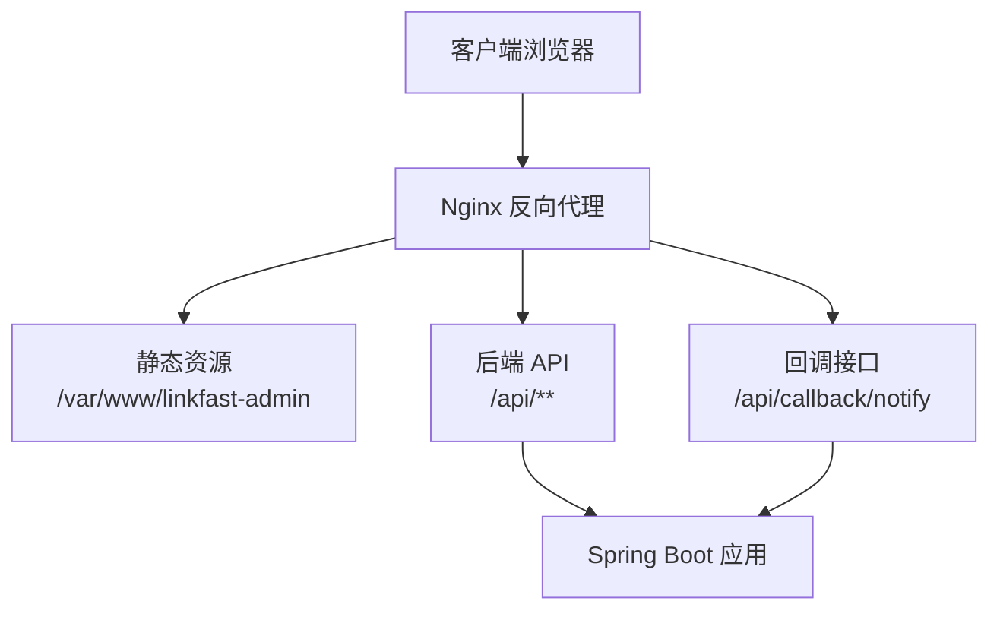
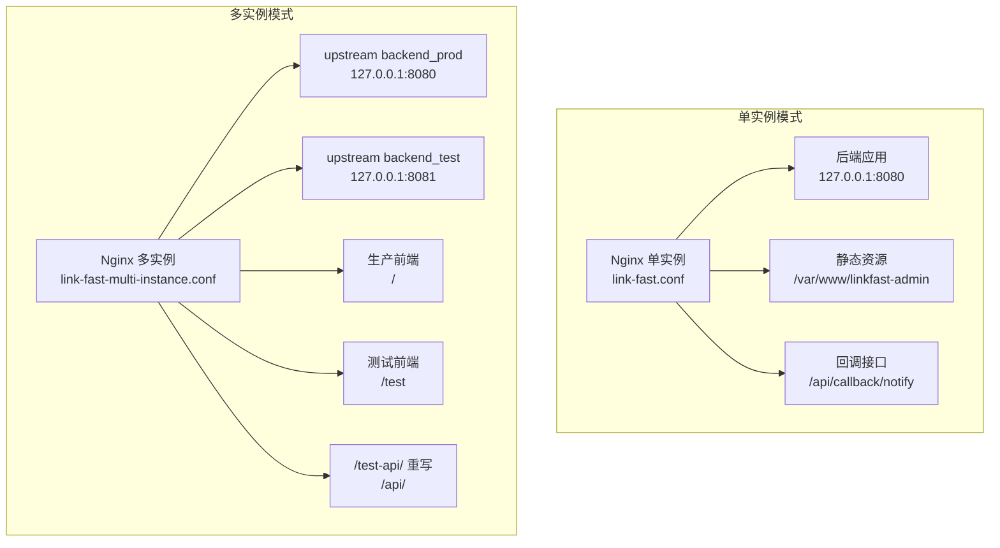
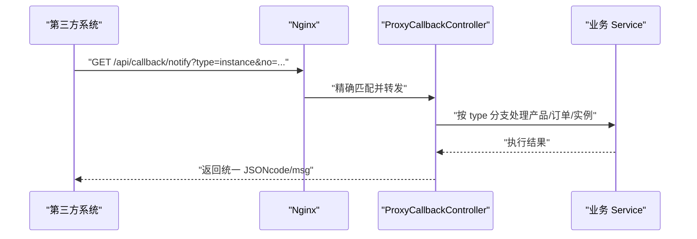
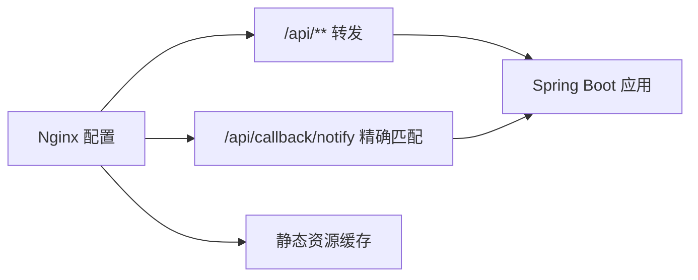

# Nginx 配置

<cite>
**本文引用的文件**
- [link-fast.conf](file://docs/nginx/link-fast.conf)
- [link-fast-multi-instance.conf](file://docs/nginx/link-fast-multi-instance.conf)
- [linkfast-admin.conf](file://docs/nginx/linkfast-admin.conf)
- [ProxyCallbackController.java](file://src/main/java/cn/linkfast/controller/ProxyCallbackController.java)
- [WebMvcConfig.java](file://src/main/java/cn/linkfast/config/WebMvcConfig.java)
- [实例回调接口开发需求.md](file://docs/api/internal/实例回调接口开发需求.md)
- [创建代理订单接口.md](file://docs/api/internal/创建代理订单接口.md)
</cite>

## 目录
1. [简介](#简介)
2. [项目结构](#项目结构)
3. [核心组件](#核心组件)
4. [架构总览](#架构总览)
5. [详细组件分析](#详细组件分析)
6. [依赖关系分析](#依赖关系分析)
7. [性能考虑](#性能考虑)
8. [故障排除指南](#故障排除指南)
9. [结论](#结论)
10. [附录](#附录)

## 简介
本文件面向 Link-Fast 项目的 Nginx 部署，系统性阐述单实例与多实例部署的 Nginx 配置差异，涵盖反向代理、负载均衡、健康检查、静态资源处理、Gzip 压缩与缓存策略、回调接口精确匹配规则、CORS 跨域配置与安全加固，并提供多实例集群的会话保持、数据同步与故障转移建议，以及性能调优、监控与故障排除实践。

## 项目结构
- Nginx 配置位于 docs/nginx/，包含单实例、多实例与纯前端静态站点三种典型场景。
- 应用后端通过 Spring MVC 暴露 /api/** 接口，回调接口位于 /api/callback/notify。
- 前端静态资源位于 /var/www/linkfast-admin（以及测试环境的别名目录）。

图表来源
- [link-fast.conf:1-67](file://docs/nginx/link-fast.conf#L1-L67)
- [link-fast-multi-instance.conf:1-71](file://docs/nginx/link-fast-multi-instance.conf#L1-L71)
- [ProxyCallbackController.java:24-40](file://src/main/java/cn/linkfast/controller/ProxyCallbackController.java#L24-L40)

章节来源
- [link-fast.conf:1-67](file://docs/nginx/link-fast.conf#L1-L67)
- [link-fast-multi-instance.conf:1-71](file://docs/nginx/link-fast-multi-instance.conf#L1-L71)
- [linkfast-admin.conf:1-37](file://docs/nginx/linkfast-admin.conf#L1-L37)

## 核心组件
- 单实例配置（link-fast.conf）
  - 反向代理：将 /api/ 转发至本地 8080 端口。
  - 回调接口：精确匹配 /api/callback/notify，强制 GET，超时控制。
  - 静态资源：根路径 / 提供 SPA 路由支持，扩展缓存策略。
  - CORS：预留注释块，可按需启用。
  - 安全加固：禁止访问管理与示例路径。
  - Gzip：开启压缩，限定最小长度与类型。
- 多实例配置（link-fast-multi-instance.conf）
  - 上游池：backend_prod（8080）、backend_test（8081）。
  - 环境隔离：/ 为生产前端，/test 为测试前端，/test-api/ 重写为 /api/ 再转发至测试上游。
  - 静态资源缓存：根据路径选择根目录，增加 immutable 缓存头。
  - 安全加固与 Gzip：同上。
- 纯前端静态站点（linkfast-admin.conf）
  - 仅处理静态资源与 /api/ 的跨域与回显，适合回调页面或纯静态场景。

章节来源
- [link-fast.conf:1-67](file://docs/nginx/link-fast.conf#L1-L67)
- [link-fast-multi-instance.conf:1-71](file://docs/nginx/link-fast-multi-instance.conf#L1-L71)
- [linkfast-admin.conf:1-37](file://docs/nginx/linkfast-admin.conf#L1-L37)

## 架构总览
下图展示 Nginx 在不同部署模式下的角色与流量走向，以及与后端应用的交互。

图表来源
- [link-fast.conf:1-67](file://docs/nginx/link-fast.conf#L1-L67)
- [link-fast-multi-instance.conf:1-71](file://docs/nginx/link-fast-multi-instance.conf#L1-L71)

## 详细组件分析

### 单实例 Nginx 配置（link-fast.conf）
- 反向代理
  - /api/ 转发至本地 8080，保留 Host、X-Real-IP、X-Forwarded-For、X-Forwarded-Proto。
- 回调接口精确匹配
  - location = /api/callback/notify 强制 GET，拒绝其他方法；设置读取与连接超时，保障第三方回调稳定。
- 静态资源与 SPA 路由
  - / 根路径提供 try_files $uri $uri/ /index.html，支持前端 History 路由刷新。
  - 扩展静态资源缓存：CSS/JS/PNG/JPG/GIF/ICO/SVG 设置过期 7 天。
- CORS 与安全加固
  - CORS 预留注释块，可根据需要启用；拦截 OPTIONS 预检可选。
  - 禁止访问 manager/host-manager/docs/examples 等敏感路径。
- Gzip 压缩
  - 开启 gzip，最小长度 1 字节，类型覆盖文本与 JS/JSON。

章节来源
- [link-fast.conf:1-67](file://docs/nginx/link-fast.conf#L1-L67)

### 多实例 Nginx 配置（link-fast-multi-instance.conf）
- 上游池与负载均衡
  - backend_prod 指向 8080，backend_test 指向 8081；默认轮询策略。
  - 可扩展为 upstream + keepalive 或引入外部健康检查。
- 环境隔离与路径映射
  - / 为生产前端，/test 为测试前端，均支持 SPA 路由。
  - /test-api/ 重写为 /api/ 再转发至 backend_test，便于测试环境 API 调用。
- 静态资源缓存
  - 根据 URI 判断根目录，分别指向生产/测试静态目录；添加 immutable 缓存头。
- 安全加固与 Gzip
  - 同单实例配置。

章节来源
- [link-fast-multi-instance.conf:1-71](file://docs/nginx/link-fast-multi-instance.conf#L1-L71)

### 纯前端静态站点（linkfast-admin.conf）
- 仅处理静态资源与 /api/ 的跨域与回显，适合回调页面或纯静态场景。
- 保留 Gzip 与静态资源缓存。

章节来源
- [linkfast-admin.conf:1-37](file://docs/nginx/linkfast-admin.conf#L1-L37)

### 回调接口精确匹配规则与安全
- 接口定义
  - 控制器层：/api/callback/notify 仅允许 GET 方法，接收 type/no/op 参数，返回统一 JSON 结构。
- Nginx 匹配
  - 精确匹配 location = /api/callback/notify，限制除 GET 外的所有方法。
- 安全加固
  - 通过 limit_except GET 禁止非法方法；结合后端幂等设计与去重策略，降低重放风险。

图表来源
- [ProxyCallbackController.java:40-91](file://src/main/java/cn/linkfast/controller/ProxyCallbackController.java#L40-L91)
- [link-fast.conf:19-30](file://docs/nginx/link-fast.conf#L19-L30)

章节来源
- [ProxyCallbackController.java:24-40](file://src/main/java/cn/linkfast/controller/ProxyCallbackController.java#L24-L40)
- [ProxyCallbackController.java:40-91](file://src/main/java/cn/linkfast/controller/ProxyCallbackController.java#L40-L91)
- [link-fast.conf:19-30](file://docs/nginx/link-fast.conf#L19-L30)

### CORS 跨域配置与最佳实践
- 后端全局 CORS
  - WebMvcConfig 对 /api/** 开启跨域，允许 GET/POST/PUT/DELETE/OPTIONS，允许任意头部与凭据，最大缓存 3600 秒。
- Nginx 层 CORS
  - link-fast.conf 中提供注释化的 CORS 头部与 OPTIONS 预检拦截示例，可按需启用。
- 建议
  - 生产环境建议明确 Allow-Origin，避免使用通配符；对敏感接口启用凭据与严格来源校验。

章节来源
- [WebMvcConfig.java:45-51](file://src/main/java/cn/linkfast/config/WebMvcConfig.java#L45-L51)
- [link-fast.conf:41-49](file://docs/nginx/link-fast.conf#L41-L49)

### 静态资源处理、缓存与 Gzip
- 单实例
  - / 根路径支持 SPA 路由；静态资源（CSS/JS/PNG/JPG/GIF/ICO/SVG）设置 7 天过期。
- 多实例
  - 根据路径选择根目录，静态资源缓存与 7 天过期；新增 immutable 缓存头，提升长期缓存效果。
- Gzip
  - 统一开启，最小长度 1 字节，类型覆盖文本与 JS/JSON。

章节来源
- [link-fast.conf:52-67](file://docs/nginx/link-fast.conf#L52-L67)
- [link-fast-multi-instance.conf:50-71](file://docs/nginx/link-fast-multi-instance.conf#L50-L71)

### 多实例集群配置建议（会话保持、数据同步、故障转移）
- 会话保持
  - 使用 sticky cookie 或基于 IP 的哈希策略，确保同一用户请求固定到同一上游实例。
- 数据同步
  - 通过回调接口（/api/callback/notify）统一处理产品/订单/实例变更，结合幂等与去重策略，避免重复同步。
- 故障转移
  - 在 upstream 中配置 backup 与 fail_timeout/max_fails，结合外部健康检查脚本或 Nginx Plus/Consul/Keepalived 实现自动切换。
- 负载均衡策略
  - 默认轮询；可替换为 least_conn、ip_hash、hash $request_uri consistent 等策略，视业务特性选择。

章节来源
- [link-fast-multi-instance.conf:1-8](file://docs/nginx/link-fast-multi-instance.conf#L1-L8)
- [ProxyCallbackController.java:40-91](file://src/main/java/cn/linkfast/controller/ProxyCallbackController.java#L40-L91)

## 依赖关系分析
- Nginx 与后端应用
  - Nginx 作为统一入口，将 /api/** 转发至后端；回调接口采用精确匹配，确保第三方回调的稳定性与安全性。
- Nginx 与前端静态资源
  - 单实例与多实例均通过 try_files 支持 SPA 路由；多实例区分生产/测试静态目录。
- CORS 与安全
  - 后端与 Nginx 层共同实现跨域与安全加固，建议前后端协同配置，避免 CORS 与安全策略冲突。

图表来源
- [link-fast.conf:19-40](file://docs/nginx/link-fast.conf#L19-L40)
- [link-fast-multi-instance.conf:31-48](file://docs/nginx/link-fast-multi-instance.conf#L31-L48)

章节来源
- [link-fast.conf:19-40](file://docs/nginx/link-fast.conf#L19-L40)
- [link-fast-multi-instance.conf:31-48](file://docs/nginx/link-fast-multi-instance.conf#L31-L48)

## 性能考虑
- 静态资源缓存
  - 为 CSS/JS/PNG/JPG/GIF/ICO/SVG 设置 7 天过期；多实例场景可进一步使用 immutable 缓存头，减少带宽与服务器压力。
- Gzip 压缩
  - 开启 gzip，最小长度 1 字节，覆盖常见文本与 JS/JSON 类型，显著降低传输体积。
- 反向代理优化
  - 设置合理的 proxy_connect_timeout/proxy_read_timeout，避免慢请求占用连接。
  - 在多实例场景，结合 keepalive 与上游健康检查，提升连接复用与可用性。
- 日志与监控
  - access_log/error_log 分离，便于定位问题；结合 OpenTelemetry/ELK/Prometheus/Grafana 实现可观测性。

章节来源
- [link-fast.conf:52-67](file://docs/nginx/link-fast.conf#L52-L67)
- [link-fast-multi-instance.conf:50-71](file://docs/nginx/link-fast-multi-instance.conf#L50-L71)

## 故障排除指南
- 回调接口 405 Method Not Allowed
  - 检查 Nginx 是否正确使用精确匹配 location = /api/callback/notify，并确认仅允许 GET。
- 跨域失败或预检被拒绝
  - 确认后端 CORS 配置与 Nginx 层 CORS 头是否一致；生产环境避免使用通配符 Origin。
- SPA 路由刷新 404
  - 确认根路径 location 中 try_files $uri $uri/ /index.html 是否生效。
- 静态资源无法加载或缓存异常
  - 检查静态资源路径与 root 设置；多实例场景确认路径判断逻辑与缓存头。
- 多实例上游不可用
  - 检查 upstream 端口与服务状态；结合健康检查与 fail_timeout/max_fails 实现快速故障转移。

章节来源
- [link-fast.conf:19-30](file://docs/nginx/link-fast.conf#L19-L30)
- [link-fast.conf:41-49](file://docs/nginx/link-fast.conf#L41-L49)
- [link-fast-multi-instance.conf:50-71](file://docs/nginx/link-fast-multi-instance.conf#L50-L71)

## 结论
- 单实例与多实例 Nginx 配置的核心差异在于上游池与路径映射；多实例通过 /test-api/ 重写与测试上游实现环境隔离。
- 回调接口采用精确匹配与 GET 限制，配合后端幂等与去重策略，确保第三方回调的可靠性与安全性。
- CORS 与安全加固建议前后端协同配置，生产环境避免通配符与不必要的权限放宽。
- 性能优化重点在静态资源缓存、Gzip 压缩与上游健康检查；结合日志与监控体系，持续改进可用性与用户体验。

## 附录
- 回调接口参数与返回格式参考
  - 回调地址与参数：见实例回调接口开发需求文档。
  - 返回格式：统一 JSON，包含 code/msg 字段。
- 关键接口参考
  - 创建代理订单接口：POST /api/order/open，请求体与返回结构见创建代理订单接口文档。

章节来源
- [实例回调接口开发需求.md:3-21](file://docs/api/internal/实例回调接口开发需求.md#L3-L21)
- [创建代理订单接口.md:7-82](file://docs/api/internal/创建代理订单接口.md#L7-L82)