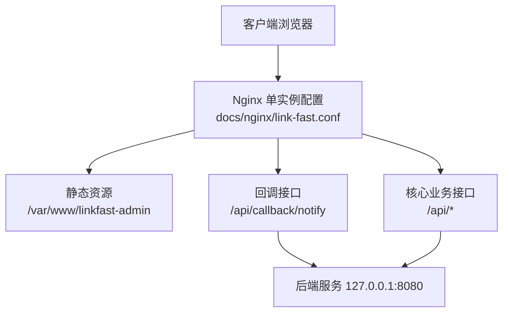
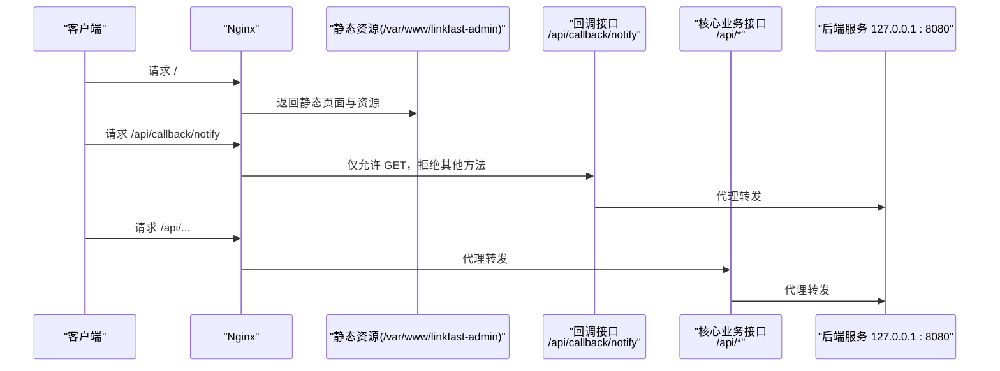
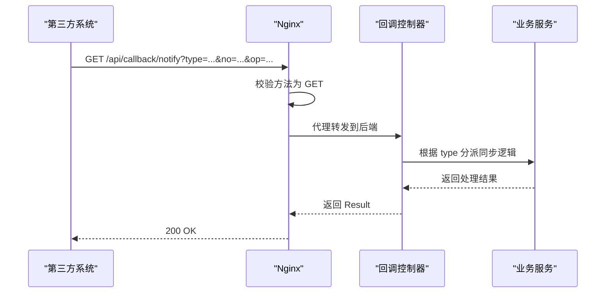
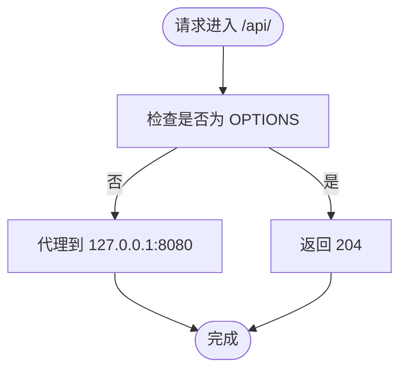
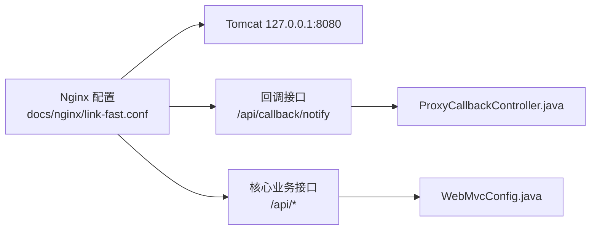

# 单实例 Nginx 配置

<cite>
**本文引用的文件**
- [link-fast.conf](file://docs/nginx/link-fast.conf)
- [link-fast-multi-instance.conf](file://docs/nginx/link-fast-multi-instance.conf)
- [ProxyCallbackController.java](file://src/main/java/cn/linkfast/controller/ProxyCallbackController.java)
- [WebMvcConfig.java](file://src/main/java/cn/linkfast/config/WebMvcConfig.java)
- [web.xml](file://src/main/webapp/WEB-INF/web.xml)
- [RootController.java](file://src/main/java/cn/linkfast/controller/RootController.java)
</cite>

## 目录
1. [简介](#简介)
2. [项目结构](#项目结构)
3. [核心组件](#核心组件)
4. [架构总览](#架构总览)
5. [详细组件分析](#详细组件分析)
6. [依赖分析](#依赖分析)
7. [性能考量](#性能考量)
8. [故障排查指南](#故障排查指南)
9. [结论](#结论)
10. [附录](#附录)

## 简介
本文件面向 Link-Fast 项目的单实例部署场景，提供 Nginx 配置的完整说明与最佳实践。内容覆盖：
- 服务器监听端口、访问日志与错误日志配置
- 前端静态资源处理规则（location /），含 Vue/React History 路由支持与 try_files 配置
- 回调接口的精确匹配规则（location = /api/callback/notify），含 HTTP 方法限制与代理设置
- 核心业务接口代理配置（location /api/），含 CORS 跨域配置与预检请求处理
- 静态资源缓存策略与安全加固措施
- 实际配置示例与落地建议

## 项目结构
- Nginx 配置位于 docs/nginx/，包含单实例与多实例两种模板
- 后端采用 Spring MVC（通过注解与 WebMvcConfig 配置），前端静态资源位于 /var/www/linkfast-admin
- 回调接口位于 /api/callback/notify，核心业务接口位于 /api/*

图表来源
- [link-fast.conf:1-67](file://docs/nginx/link-fast.conf#L1-L67)

章节来源
- [link-fast.conf:1-67](file://docs/nginx/link-fast.conf#L1-L67)

## 核心组件
- 服务器监听与日志
  - 监听 80 端口，server_name 指定公网 IP
  - access_log 与 error_log 分别记录访问与错误日志
- 前端静态资源处理
  - location / 使用 try_files $uri $uri/ /index.html，支持 SPA History 路由
  - 静态资源缓存策略：CSS/JS/PNG/JPG/JPEG/GIF/ICO/SVG 文件缓存 7 天
- 回调接口精确匹配
  - location = /api/callback/notify 强制 GET，拒绝其他方法
  - 代理至 127.0.0.1:8080，并设置标准头部与超时
- 核心业务接口代理
  - location /api/ 代理至 127.0.0.1:8080
  - CORS 配置在 Nginx 中以注释形式提供，Spring 层面也提供全局 CORS 映射
- 安全加固与压缩
  - 禁止访问管理与示例路径
  - gzip 压缩开启，最小长度与类型配置

章节来源
- [link-fast.conf:1-67](file://docs/nginx/link-fast.conf#L1-L67)

## 架构总览
下图展示单实例部署下的请求流转：浏览器请求经 Nginx 路由到静态资源或后端接口，回调接口严格限定方法，核心业务接口统一代理。

图表来源
- [link-fast.conf:9-50](file://docs/nginx/link-fast.conf#L9-L50)
- [ProxyCallbackController.java:42-44](file://src/main/java/cn/linkfast/controller/ProxyCallbackController.java#L42-L44)

## 详细组件分析

### 服务器监听与日志配置
- 监听端口与主机名
  - 监听 80 端口，server_name 指向公网 IP，便于外网访问
- 日志配置
  - access_log 与 error_log 分别指向独立日志文件，便于问题定位与审计

章节来源
- [link-fast.conf:2-7](file://docs/nginx/link-fast.conf#L2-L7)

### 前端静态资源处理（location /）
- 根路径静态资源
  - root 指向 /var/www/linkfast-admin，index 指定首页文件
- History 路由支持
  - try_files $uri $uri/ /index.html，确保前端路由刷新不会返回 404
- 优先级
  - 该规则优先级最低，确保非 /api/ 开头的请求先被处理

章节来源
- [link-fast.conf:11-15](file://docs/nginx/link-fast.conf#L11-L15)

### 回调接口精确匹配（location = /api/callback/notify）
- 精确匹配与方法限制
  - 使用 location = 精确匹配，limit_except GET 拒绝除 GET 外的所有方法
- 代理与头部设置
  - proxy_pass 指向 127.0.0.1:8080
  - 设置 Host、X-Real-IP、X-Forwarded-For、X-Forwarded-Proto
  - 设置 proxy_read_timeout 与 proxy_connect_timeout，避免长时间连接占用
- 后端实现
  - 控制器方法为 GET，路径为 /api/callback/notify，接收 type/no/op 参数

图表来源
- [link-fast.conf:19-30](file://docs/nginx/link-fast.conf#L19-L30)
- [ProxyCallbackController.java:42-94](file://src/main/java/cn/linkfast/controller/ProxyCallbackController.java#L42-L94)

章节来源
- [link-fast.conf:19-30](file://docs/nginx/link-fast.conf#L19-L30)
- [ProxyCallbackController.java:42-44](file://src/main/java/cn/linkfast/controller/ProxyCallbackController.java#L42-L44)

### 核心业务接口代理（location /api/）
- 代理目标
  - 代理至 127.0.0.1:8080，转发 Host、X-Real-IP、X-Forwarded-For、X-Forwarded-Proto 等头部
- CORS 配置
  - Nginx 层提供注释化的 CORS 与预检请求拦截示例
  - Spring 层提供全局 CORS 映射，覆盖 /api/**，允许 OPTIONS、GET、POST、PUT、DELETE，允许凭据，最大缓存时间 3600 秒
- 预检请求处理
  - 可选择在 Nginx 中拦截 OPTIONS 并返回 204，或交由后端处理

图表来源
- [link-fast.conf:34-50](file://docs/nginx/link-fast.conf#L34-L50)
- [WebMvcConfig.java:45-52](file://src/main/java/cn/linkfast/config/WebMvcConfig.java#L45-L52)

章节来源
- [link-fast.conf:34-50](file://docs/nginx/link-fast.conf#L34-L50)
- [WebMvcConfig.java:45-52](file://src/main/java/cn/linkfast/config/WebMvcConfig.java#L45-L52)

### 静态资源缓存策略
- 缓存范围
  - 对 CSS/JS/PNG/JPG/JPEG/GIF/ICO/SVG 文件启用缓存，缓存时间为 7 天
- 作用
  - 减少带宽消耗，提升首屏加载速度

章节来源
- [link-fast.conf:53-56](file://docs/nginx/link-fast.conf#L53-L56)

### 安全加固与压缩
- 安全加固
  - 禁止访问 manager/host-manager/docs/examples 等敏感路径
- 压缩
  - gzip on，最小长度 1k，对文本与脚本类型启用压缩

章节来源
- [link-fast.conf:59-67](file://docs/nginx/link-fast.conf#L59-L67)

## 依赖分析
- Nginx 与后端的耦合点
  - 回调接口与核心业务接口均代理至 127.0.0.1:8080
  - 回调接口严格限制为 GET，与后端控制器方法一致
- CORS 与预检请求
  - Nginx 与 Spring 双层 CORS 配置，建议统一在后端处理 OPTIONS，减少 Nginx 侧复杂度

图表来源
- [link-fast.conf:19-50](file://docs/nginx/link-fast.conf#L19-L50)
- [ProxyCallbackController.java:26-28](file://src/main/java/cn/linkfast/controller/ProxyCallbackController.java#L26-L28)
- [WebMvcConfig.java:45-52](file://src/main/java/cn/linkfast/config/WebMvcConfig.java#L45-L52)

章节来源
- [link-fast.conf:19-50](file://docs/nginx/link-fast.conf#L19-L50)
- [ProxyCallbackController.java:26-28](file://src/main/java/cn/linkfast/controller/ProxyCallbackController.java#L26-L28)
- [WebMvcConfig.java:45-52](file://src/main/java/cn/linkfast/config/WebMvcConfig.java#L45-L52)

## 性能考量
- 静态资源缓存
  - 对前端常用资源启用长期缓存，降低服务器压力
- 压缩传输
  - 启用 gzip，减少传输体积
- 代理超时
  - 合理设置 proxy_read_timeout 与 proxy_connect_timeout，避免连接泄漏
- 路由回退
  - 使用 try_files $uri $uri/ /index.html，避免不必要的后端请求

## 故障排查指南
- 回调接口 405 Method Not Allowed
  - 检查 Nginx 是否正确限制为 GET，确认第三方回调未携带非 GET 方法
- 路由刷新 404
  - 确认 location / 中 try_files 配置正确，且静态资源目录存在
- CORS 跨域失败
  - 若使用 Nginx 处理 CORS，确保注释块已启用；若使用后端处理，确认 Spring CORS 映射生效
- 预检请求未命中
  - 若在 Nginx 中拦截 OPTIONS，请确认是否与后端 CORS 冲突
- 日志定位
  - 查看 access_log 与 error_log，结合后端日志定位问题

章节来源
- [link-fast.conf:19-30](file://docs/nginx/link-fast.conf#L19-L30)
- [link-fast.conf:11-15](file://docs/nginx/link-fast.conf#L11-L15)
- [link-fast.conf:41-50](file://docs/nginx/link-fast.conf#L41-L50)

## 结论
单实例 Nginx 配置围绕“前端静态资源 + 回调接口精确匹配 + 核心业务接口统一代理”的模式设计，兼顾了 SPA 路由支持、安全加固与性能优化。建议：
- 回调接口保持 GET 限制，确保幂等性与安全性
- 统一在后端处理 CORS 与预检请求，简化 Nginx 配置
- 合理设置缓存与压缩策略，提升用户体验与吞吐能力

## 附录
- 与多实例配置对比
  - 多实例配置引入 upstream 与路径前缀区分（/test、/test-api），适合灰度与测试环境
  - 单实例配置更简洁，适合生产环境快速上线

章节来源
- [link-fast-multi-instance.conf:1-71](file://docs/nginx/link-fast-multi-instance.conf#L1-L71)