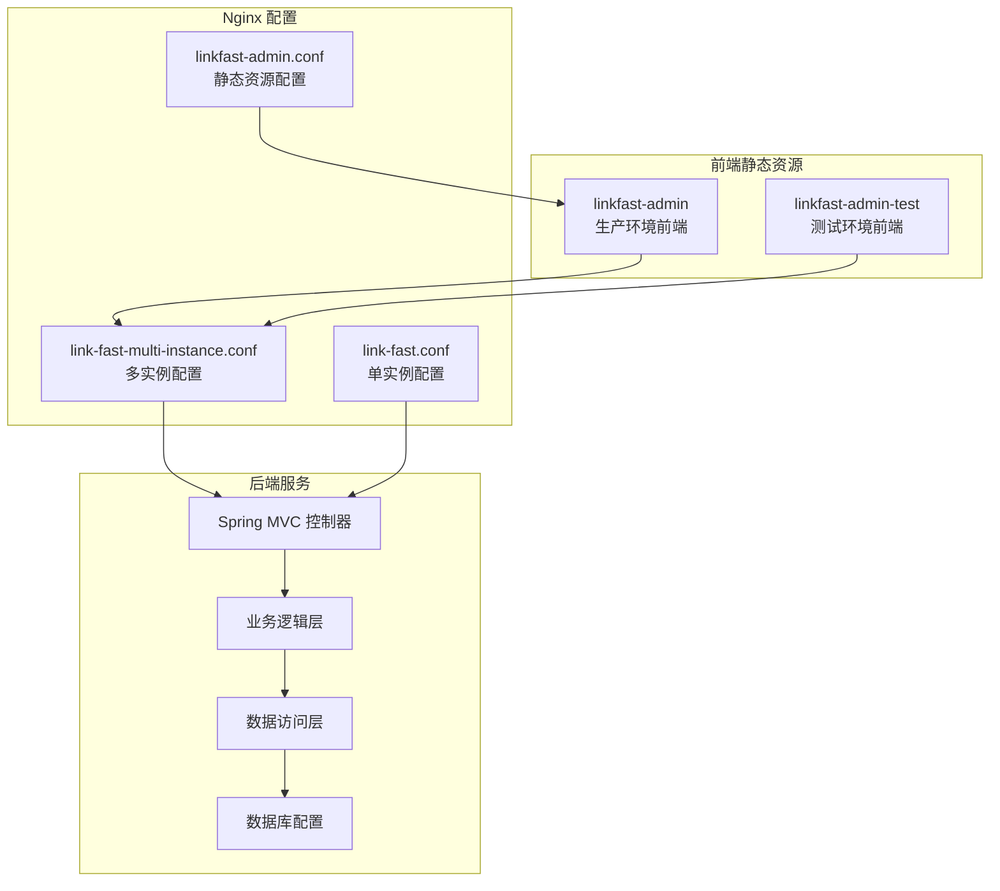
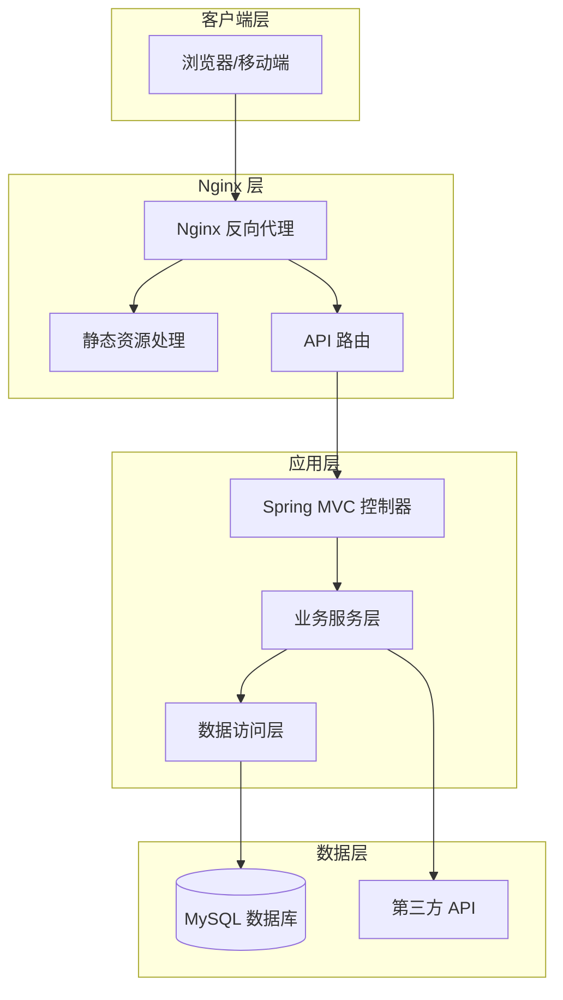
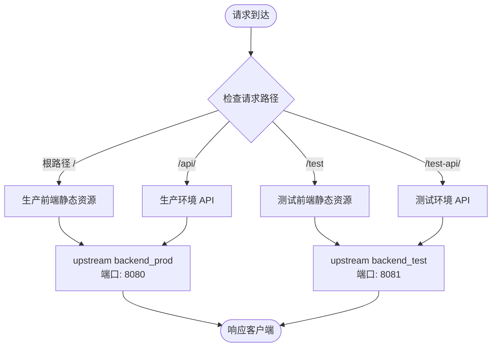
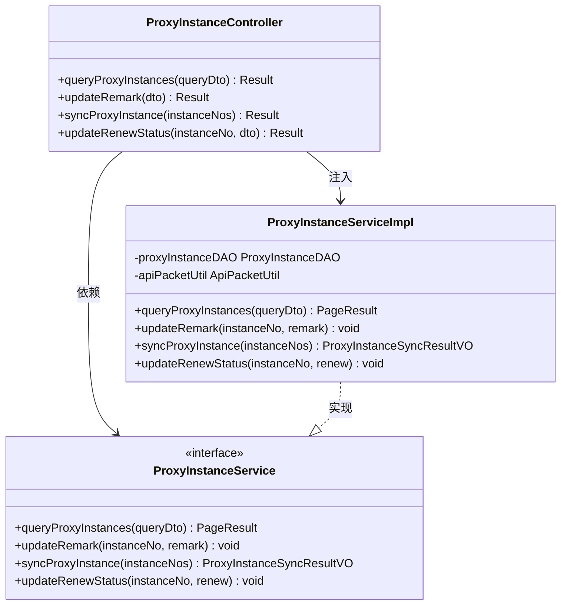
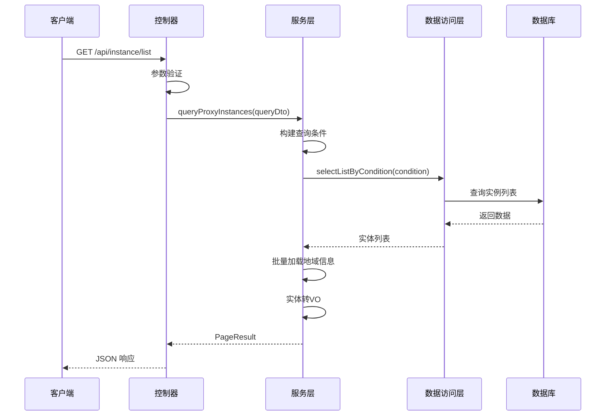
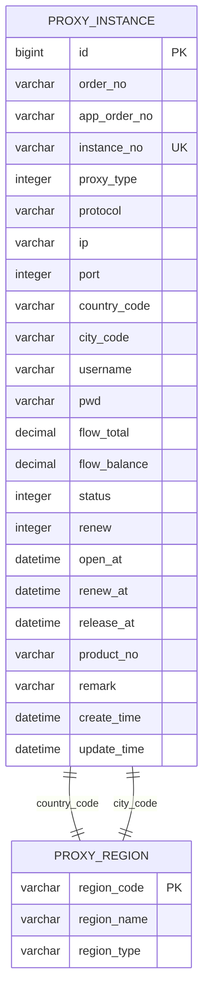
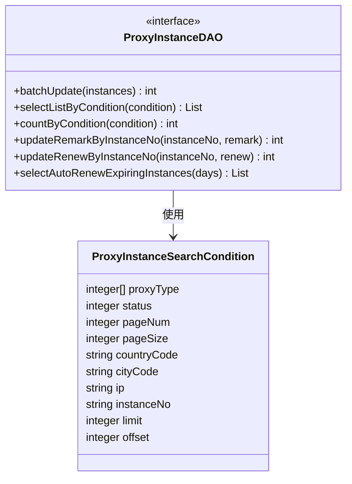
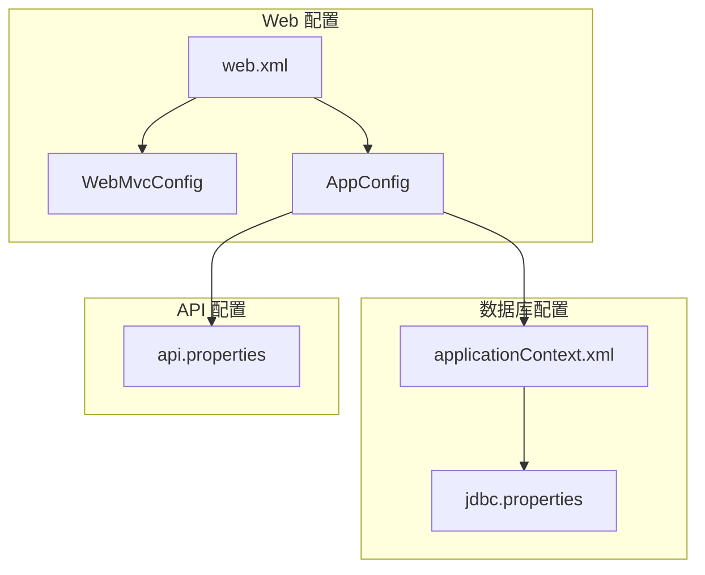
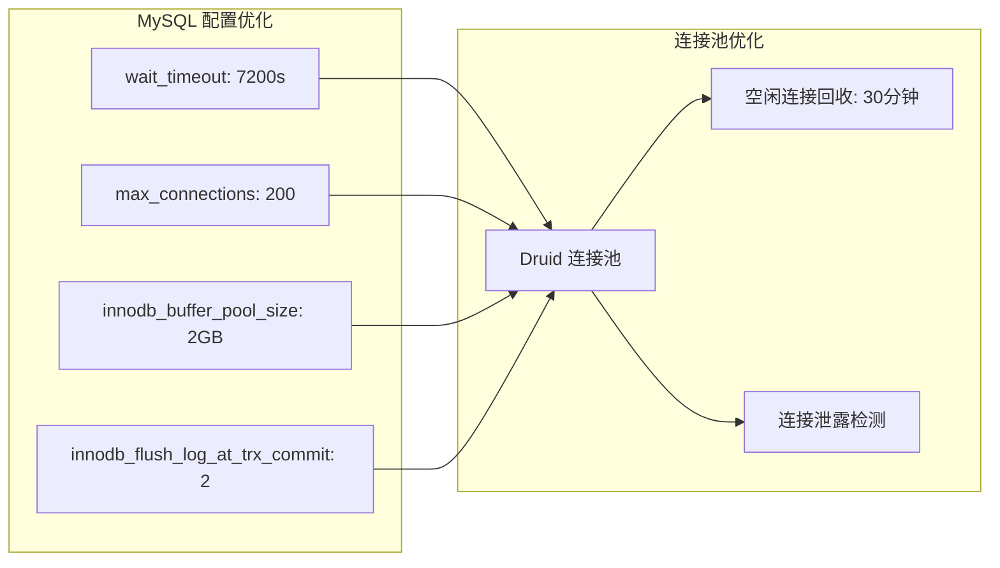

# 多实例 Nginx 配置

<cite>
**本文档引用的文件**
- [link-fast-multi-instance.conf](file://docs/nginx/link-fast-multi-instance.conf)
- [link-fast.conf](file://docs/nginx/link-fast.conf)
- [linkfast-admin.conf](file://docs/nginx/linkfast-admin.conf)
- [ProxyInstanceController.java](file://src/main/java/cn/linkfast/controller/ProxyInstanceController.java)
- [ProxyInstanceServiceImpl.java](file://src/main/java/cn/linkfast/service/impl/ProxyInstanceServiceImpl.java)
- [ProxyInstance.java](file://src/main/java/cn/linkfast/entity/ProxyInstance.java)
- [ProxyInstanceQueryDTO.java](file://src/main/java/cn/linkfast/dto/ProxyInstanceQueryDTO.java)
- [ProxyInstanceDAO.java](file://src/main/java/cn/linkfast/dao/ProxyInstanceDAO.java)
- [AppConfig.java](file://src/main/java/cn/linkfast/config/AppConfig.java)
- [WebMvcConfig.java](file://src/main/java/cn/linkfast/config/WebMvcConfig.java)
- [web.xml](file://src/main/webapp/WEB-INF/web.xml)
- [applicationContext.xml](file://src/main/resources/applicationContext.xml)
- [jdbc.properties](file://src/main/resources/jdbc.properties)
- [api.properties](file://src/main/resources/api.properties)
- [my.cnf](file://docs/database/my.cnf)
- [pom.xml](file://pom.xml)
</cite>

## 目录
1. [简介](#简介)
2. [项目结构](#项目结构)
3. [核心组件](#核心组件)
4. [架构概览](#架构概览)
5. [详细组件分析](#详细组件分析)
6. [依赖关系分析](#依赖关系分析)
7. [性能考虑](#性能考虑)
8. [故障排除指南](#故障排除指南)
9. [结论](#结论)

## 简介

本项目是一个基于 Spring Boot 和 Nginx 的多实例代理管理系统。系统通过 Nginx 实现了生产环境和测试环境的分离部署，支持多实例代理服务的统一管理和调度。

项目采用前后端分离架构，前端使用 Vue/React 单页应用，后端提供 RESTful API 接口，通过 Nginx 实现负载均衡和反向代理功能。

## 项目结构

项目采用标准的 Maven 项目结构，主要分为以下几个部分：

**图表来源**
- [link-fast-multi-instance.conf:1-71](file://docs/nginx/link-fast-multi-instance.conf#L1-L71)
- [link-fast.conf:1-67](file://docs/nginx/link-fast.conf#L1-L67)
- [linkfast-admin.conf:1-37](file://docs/nginx/linkfast-admin.conf#L1-L37)

**章节来源**
- [link-fast-multi-instance.conf:1-71](file://docs/nginx/link-fast-multi-instance.conf#L1-L71)
- [link-fast.conf:1-67](file://docs/nginx/link-fast.conf#L1-L67)
- [linkfast-admin.conf:1-37](file://docs/nginx/linkfast-admin.conf#L1-L37)

## 核心组件

### Nginx 多实例配置

系统提供了三种不同的 Nginx 配置方案：

1. **多实例配置** (`link-fast-multi-instance.conf`)
   - 支持生产环境和测试环境同时运行
   - 通过不同的上游服务器区分环境
   - 提供独立的静态资源路径

2. **单实例配置** (`link-fast.conf`)
   - 简化的单一环境配置
   - 集成了回调接口处理
   - 适用于简单的部署场景

3. **静态资源配置** (`linkfast-admin.conf`)
   - 专门针对前端静态资源的优化配置
   - 解决 SPA 应用的路由刷新问题
   - 提供静态资源缓存策略

### 后端 API 控制器

系统的核心控制器位于 `ProxyInstanceController`，提供以下主要功能：

- 代理实例列表查询（支持分页和多条件筛选）
- 代理实例备注更新
- 代理实例信息同步
- 自动续费状态管理

**章节来源**
- [ProxyInstanceController.java:1-94](file://src/main/java/cn/linkfast/controller/ProxyInstanceController.java#L1-L94)
- [ProxyInstanceServiceImpl.java:1-247](file://src/main/java/cn/linkfast/service/impl/ProxyInstanceServiceImpl.java#L1-L247)

## 架构概览

系统采用分层架构设计，实现了清晰的关注点分离：

**图表来源**
- [ProxyInstanceController.java:24-94](file://src/main/java/cn/linkfast/controller/ProxyInstanceController.java#L24-L94)
- [ProxyInstanceServiceImpl.java:37-247](file://src/main/java/cn/linkfast/service/impl/ProxyInstanceServiceImpl.java#L37-L247)
- [web.xml:23-40](file://src/main/webapp/WEB-INF/web.xml#L23-L40)

## 详细组件分析

### Nginx 多实例配置详解

#### 生产环境配置

**图表来源**
- [link-fast-multi-instance.conf:1-71](file://docs/nginx/link-fast-multi-instance.conf#L1-L71)

#### 配置特点

1. **环境隔离**
   - 生产环境: `backend_prod` (8080端口)
   - 测试环境: `backend_test` (8081端口)

2. **路径映射**
   - `/` → 生产前端静态资源
   - `/test` → 测试前端静态资源
   - `/api/` → 生产后端 API
   - `/test-api/` → 测试后端 API

3. **静态资源优化**
   - CSS/JS 图片缓存 7 天
   - 支持不同环境的静态资源目录
   - Gzip 压缩优化

**章节来源**
- [link-fast-multi-instance.conf:1-71](file://docs/nginx/link-fast-multi-instance.conf#L1-L71)

### 后端 API 设计

#### 控制器层

**图表来源**
- [ProxyInstanceController.java:24-94](file://src/main/java/cn/linkfast/controller/ProxyInstanceController.java#L24-L94)
- [ProxyInstanceServiceImpl.java:37-247](file://src/main/java/cn/linkfast/service/impl/ProxyInstanceServiceImpl.java#L37-L247)

#### 业务流程

**图表来源**
- [ProxyInstanceController.java:35-40](file://src/main/java/cn/linkfast/controller/ProxyInstanceController.java#L35-L40)
- [ProxyInstanceServiceImpl.java:121-146](file://src/main/java/cn/linkfast/service/impl/ProxyInstanceServiceImpl.java#L121-L146)

**章节来源**
- [ProxyInstanceController.java:1-94](file://src/main/java/cn/linkfast/controller/ProxyInstanceController.java#L1-L94)
- [ProxyInstanceServiceImpl.java:1-247](file://src/main/java/cn/linkfast/service/impl/ProxyInstanceServiceImpl.java#L1-L247)

### 数据模型设计

#### 代理实例实体

**图表来源**
- [ProxyInstance.java:13-57](file://src/main/java/cn/linkfast/entity/ProxyInstance.java#L13-L57)

**章节来源**
- [ProxyInstance.java:1-57](file://src/main/java/cn/linkfast/entity/ProxyInstance.java#L1-L57)

### 数据访问层

#### DAO 接口设计

**图表来源**
- [ProxyInstanceDAO.java:11-62](file://src/main/java/cn/linkfast/dao/ProxyInstanceDAO.java#L11-L62)
- [ProxyInstanceQueryDTO.java:15-63](file://src/main/java/cn/linkfast/dto/ProxyInstanceQueryDTO.java#L15-L63)

**章节来源**
- [ProxyInstanceDAO.java:1-63](file://src/main/java/cn/linkfast/dao/ProxyInstanceDAO.java#L1-L63)
- [ProxyInstanceQueryDTO.java:1-65](file://src/main/java/cn/linkfast/dto/ProxyInstanceQueryDTO.java#L1-L65)

## 依赖关系分析

### Spring 配置体系

**图表来源**
- [web.xml:10-35](file://src/main/webapp/WEB-INF/web.xml#L10-L35)
- [WebMvcConfig.java:19-62](file://src/main/java/cn/linkfast/config/WebMvcConfig.java#L19-L62)
- [AppConfig.java:14-36](file://src/main/java/cn/linkfast/config/AppConfig.java#L14-L36)
- [applicationContext.xml:14-67](file://src/main/resources/applicationContext.xml#L14-L67)

### Maven 依赖关系

系统采用现代化的 Java 技术栈，主要依赖包括：

- **Spring Framework 6.2.13**: 核心框架
- **Jackson 2.18.2**: JSON 处理
- **Apache HttpClient5**: HTTP 客户端
- **Druid 1.2.28**: 数据库连接池
- **MySQL Connector/J 8.4.0**: 数据库驱动

**章节来源**
- [pom.xml:22-213](file://pom.xml#L22-L213)

## 性能考虑

### Nginx 性能优化

1. **静态资源缓存**
   - CSS/JS 文件缓存 7 天
   - 图片资源缓存 7 天
   - Gzip 压缩启用

2. **连接池配置**
   - 生产环境连接池大小: 20
   - 最小空闲连接: 5
   - 最大等待时间: 120000ms

3. **超时配置**
   - 连接超时: 30秒
   - 读取超时: 60秒
   - 写入超时: 120秒

### 数据库性能优化

**图表来源**
- [my.cnf:32-68](file://docs/database/my.cnf#L32-L68)
- [applicationContext.xml:23-52](file://src/main/resources/applicationContext.xml#L23-L52)

**章节来源**
- [my.cnf:1-68](file://docs/database/my.cnf#L1-L68)
- [applicationContext.xml:1-67](file://src/main/resources/applicationContext.xml#L1-L67)

## 故障排除指南

### 常见问题及解决方案

#### Nginx 配置问题

1. **静态资源 404 错误**
   - 检查静态资源目录权限
   - 验证 root 路径配置
   - 确认 try_files 指令正确

2. **API 请求失败**
   - 检查 upstream 服务器状态
   - 验证代理头配置
   - 查看 Nginx 错误日志

#### Spring Boot 应用问题

1. **数据库连接异常**
   - 检查数据库连接字符串
   - 验证连接池配置
   - 查看数据库服务状态

2. **API 响应超时**
   - 检查业务逻辑性能
   - 优化数据库查询
   - 调整超时配置

#### 数据库问题

1. **连接超时断开**
   - 调整 wait_timeout 设置
   - 优化连接池配置
   - 检查网络连接稳定性

2. **批量插入性能问题**
   - 调整 max_allowed_packet
   - 优化事务提交策略
   - 检查索引设计

**章节来源**
- [link-fast-multi-instance.conf:62-71](file://docs/nginx/link-fast-multi-instance.conf#L62-L71)
- [applicationContext.xml:23-52](file://src/main/resources/applicationContext.xml#L23-L52)
- [my.cnf:32-68](file://docs/database/my.cnf#L32-L68)

## 结论

本项目通过精心设计的 Nginx 多实例配置和 Spring Boot 后端架构，实现了高效的代理服务管理系统。系统的主要优势包括：

1. **环境隔离**: 支持生产环境和测试环境的完全隔离
2. **性能优化**: 通过静态资源缓存和连接池优化提升响应速度
3. **扩展性强**: 支持水平扩展和负载均衡
4. **维护简便**: 清晰的分层架构便于维护和升级

建议在生产环境中：
- 配置 SSL 证书
- 设置监控告警
- 定期备份数据库
- 优化日志管理
- 实施安全加固措施