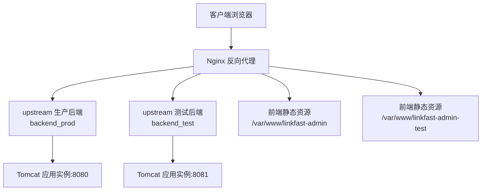
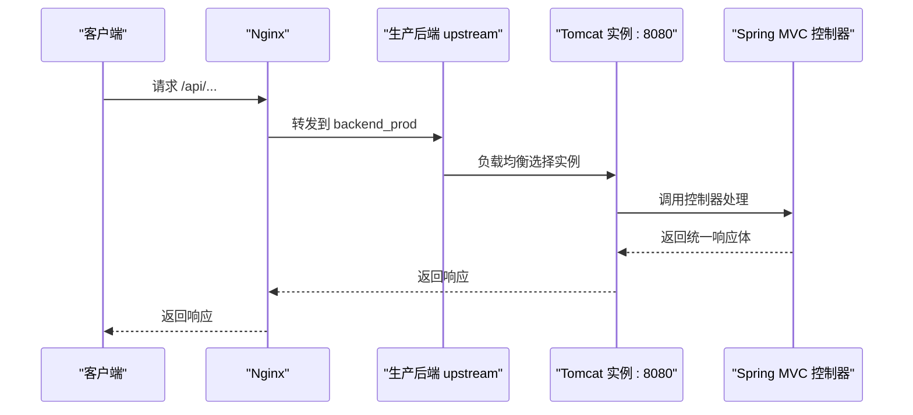
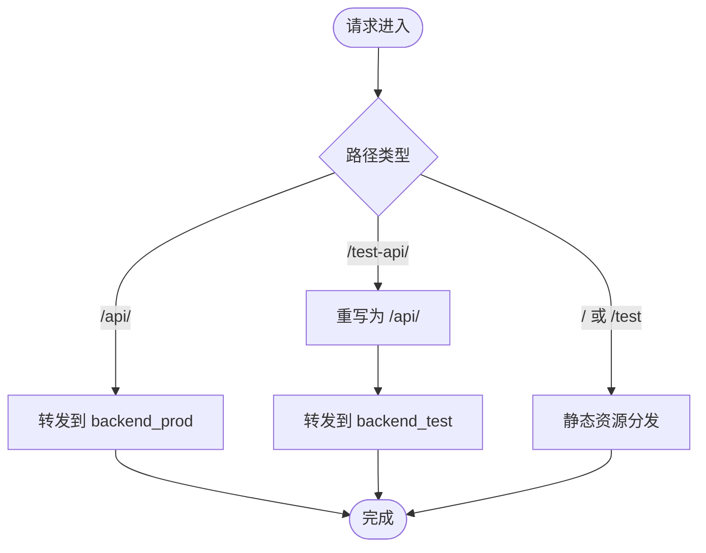
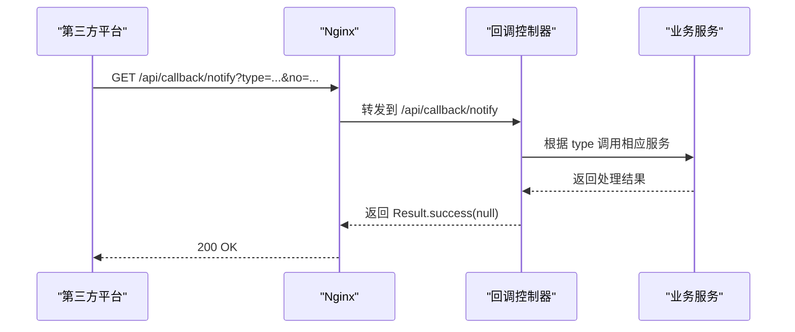
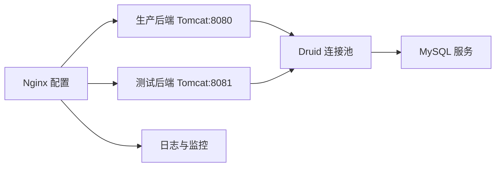

# 多实例 Nginx 配置

<cite>
**本文引用的文件**
- [link-fast-multi-instance.conf](file://docs/nginx/link-fast-multi-instance.conf)
- [link-fast.conf](file://docs/nginx/link-fast.conf)
- [linkfast-admin.conf](file://docs/nginx/linkfast-admin.conf)
- [ProxyCallbackController.java](file://src/main/java/cn/linkfast/controller/ProxyCallbackController.java)
- [Result.java](file://src/main/java/cn/linkfast/common/Result.java)
- [applicationContext.xml](file://src/main/resources/applicationContext.xml)
- [jdbc.properties](file://src/main/resources/jdbc.properties)
- [my.cnf](file://docs/database/my.cnf)
- [logback.xml](file://src/main/resources/logback.xml)
- [web.xml](file://src/main/webapp/WEB-INF/web.xml)
</cite>

## 目录
1. [简介](#简介)
2. [项目结构](#项目结构)
3. [核心组件](#核心组件)
4. [架构总览](#架构总览)
5. [详细组件分析](#详细组件分析)
6. [依赖关系分析](#依赖关系分析)
7. [性能考量](#性能考量)
8. [故障排查指南](#故障排查指南)
9. [结论](#结论)
10. [附录](#附录)

## 简介
本文件面向 Link-Fast 项目的多实例部署场景，系统化梳理 Nginx 在多实例架构中的配置要点与最佳实践。重点覆盖：
- 多实例负载均衡策略：轮询、权重、健康检查与故障转移
- upstream 块与后端服务器列表管理
- 会话保持与数据同步策略
- 故障转移与自动恢复配置
- 实例数量规划、资源分配与性能监控建议
- 实际配置示例与部署指南

## 项目结构
本项目采用前后端分离架构，Nginx 作为反向代理与网关层，负责：
- 前端静态资源分发（生产与测试两套前端目录）
- 后端 API 路由转发（生产与测试两套后端）
- 回调接口安全与限流控制
- 静态资源缓存与 Gzip 压缩
- 基础安全加固与日志记录

图表来源
- [link-fast-multi-instance.conf:9-48](file://docs/nginx/link-fast-multi-instance.conf#L9-L48)

章节来源
- [link-fast-multi-instance.conf:1-71](file://docs/nginx/link-fast-multi-instance.conf#L1-L71)
- [link-fast.conf:1-67](file://docs/nginx/link-fast.conf#L1-L67)
- [linkfast-admin.conf:1-37](file://docs/nginx/linkfast-admin.conf#L1-L37)

## 核心组件
- Nginx 配置文件
  - 多实例配置：生产与测试分别定义 upstream，分别代理至不同端口的 Tomcat 实例
  - 单实例配置：统一上游至本地 8080，适合单实例或演示环境
  - 管理端前端配置：独立前端站点，支持回调与静态资源缓存
- 后端服务
  - Spring MVC 控制器：统一返回体封装、回调接口处理
  - 数据源与连接池：Druid 连接池配置，MySQL 参数优化
  - 日志：Logback 分类输出，便于多实例日志聚合与分析
- 会话与安全
  - Session 超时与 Cookie 安全配置
  - 回调接口精确匹配与限流控制

章节来源
- [link-fast-multi-instance.conf:1-71](file://docs/nginx/link-fast-multi-instance.conf#L1-L71)
- [link-fast.conf:17-30](file://docs/nginx/link-fast.conf#L17-L30)
- [ProxyCallbackController.java:24-95](file://src/main/java/cn/linkfast/controller/ProxyCallbackController.java#L24-L95)
- [Result.java:10-59](file://src/main/java/cn/linkfast/common/Result.java#L10-L59)
- [applicationContext.xml:17-52](file://src/main/resources/applicationContext.xml#L17-L52)
- [jdbc.properties:1-34](file://src/main/resources/jdbc.properties#L1-L34)
- [logback.xml:1-48](file://src/main/resources/logback.xml#L1-L48)
- [web.xml:60-66](file://src/main/webapp/WEB-INF/web.xml#L60-L66)

## 架构总览
多实例 Nginx 架构以 Nginx 为中心，向上游的多个 Tomcat 实例分发请求，同时提供前端静态资源与回调接口保护。生产与测试环境通过不同的 upstream 与路径前缀隔离，互不影响。

图表来源
- [link-fast-multi-instance.conf:30-37](file://docs/nginx/link-fast-multi-instance.conf#L30-L37)
- [ProxyCallbackController.java:24-95](file://src/main/java/cn/linkfast/controller/ProxyCallbackController.java#L24-L95)
- [Result.java:10-59](file://src/main/java/cn/linkfast/common/Result.java#L10-L59)

## 详细组件分析

### Nginx 多实例配置（生产/测试分离）
- upstream 定义
  - 生产：backend_prod 指向 127.0.0.1:8080
  - 测试：backend_test 指向 127.0.0.1:8081
- 路由规则
  - /api/ 路由转发至 backend_prod
  - /test-api/ 路由先重写为 /api/ 再转发至 backend_test
  - / 与 /test 路径分别指向生产与测试前端目录
- 静态资源缓存与安全加固
  - 静态资源按扩展名缓存，区分生产/测试根目录
  - 禁止访问敏感路径（manager、host-manager、docs、examples）
  - Gzip 压缩开启

图表来源
- [link-fast-multi-instance.conf:16-48](file://docs/nginx/link-fast-multi-instance.conf#L16-L48)

章节来源
- [link-fast-multi-instance.conf:1-71](file://docs/nginx/link-fast-multi-instance.conf#L1-L71)

### Nginx 单实例配置（统一上游）
- 适用于单实例或演示环境
- /api/ 路由统一转发至 127.0.0.1:8080
- 回调接口精确匹配，限制非 GET 请求
- 静态资源缓存与安全加固

章节来源
- [link-fast.conf:17-30](file://docs/nginx/link-fast.conf#L17-L30)
- [link-fast.conf:32-50](file://docs/nginx/link-fast.conf#L32-L50)

### 管理端前端配置
- 单独的前端站点，支持回调与跨域头
- 静态资源缓存与 Gzip 压缩
- 仅放行 /api/ 下的回调路径

章节来源
- [linkfast-admin.conf:17-25](file://docs/nginx/linkfast-admin.conf#L17-L25)
- [linkfast-admin.conf:27-31](file://docs/nginx/linkfast-admin.conf#L27-L31)

### 后端回调接口与统一响应体
- 回调控制器：/api/callback/notify，仅允许 GET
- 统一响应体：Result<T>，成功返回 code=200，便于第三方回调确认
- 业务处理：根据 type 分支处理产品、订单、实例同步

图表来源
- [ProxyCallbackController.java:42-94](file://src/main/java/cn/linkfast/controller/ProxyCallbackController.java#L42-L94)
- [Result.java:27-44](file://src/main/java/cn/linkfast/common/Result.java#L27-L44)

章节来源
- [ProxyCallbackController.java:24-95](file://src/main/java/cn/linkfast/controller/ProxyCallbackController.java#L24-L95)
- [Result.java:10-59](file://src/main/java/cn/linkfast/common/Result.java#L10-L59)

### 数据库与连接池配置
- Druid 连接池核心参数
  - 初始连接数、最小空闲、最大活跃
  - 空闲连接回收周期与最小空闲时间
  - 连接泄露检测与移除
  - 获取连接失败容错
- MySQL 服务端参数优化
  - wait_timeout、interactive_timeout、connect_timeout、net_read_timeout、net_write_timeout
  - 最大连接数与单用户最大连接数

章节来源
- [applicationContext.xml:17-52](file://src/main/resources/applicationContext.xml#L17-L52)
- [jdbc.properties:1-34](file://src/main/resources/jdbc.properties#L1-L34)
- [my.cnf:32-48](file://docs/database/my.cnf#L32-L48)

### 日志与会话配置
- 日志分类输出：业务日志与服务器日志分离，便于多实例聚合
- Session 配置：超时时间与 Cookie 安全属性

章节来源
- [logback.xml:6-47](file://src/main/resources/logback.xml#L6-L47)
- [web.xml:60-66](file://src/main/webapp/WEB-INF/web.xml#L60-L66)

## 依赖关系分析
- Nginx 依赖后端 Tomcat 实例（生产/测试）
- 后端依赖数据库连接池（Druid）
- 回调接口依赖第三方平台推送
- 日志与监控依赖统一的日志输出与 Nginx 访问/错误日志

图表来源
- [link-fast-multi-instance.conf:1-7](file://docs/nginx/link-fast-multi-instance.conf#L1-L7)
- [applicationContext.xml:17-52](file://src/main/resources/applicationContext.xml#L17-L52)
- [my.cnf:32-48](file://docs/database/my.cnf#L32-L48)

章节来源
- [link-fast-multi-instance.conf:1-71](file://docs/nginx/link-fast-multi-instance.conf#L1-L71)
- [applicationContext.xml:17-52](file://src/main/resources/applicationContext.xml#L17-L52)
- [my.cnf:32-48](file://docs/database/my.cnf#L32-L48)

## 性能考量
- 负载均衡策略
  - 默认轮询（least_conn 可选），在多实例场景下建议结合健康检查与权重
  - 权重分配：根据实例硬件能力与业务峰值进行差异化权重
- 健康检查与故障转移
  - 建议启用 Nginx upstream 健康检查模块（如 stream/upstream_check_module），或通过外部探针实现
  - 故障转移：当某实例不可用时，自动切换到其他实例，减少单点风险
- 静态资源与 Gzip
  - 静态资源缓存与 Gzip 压缩可显著降低带宽与延迟
- 数据库连接池
  - 合理设置最大活跃连接数与空闲回收周期，避免连接池耗尽
  - MySQL 空闲超时与连接超时参数需与连接池策略匹配

章节来源
- [link-fast-multi-instance.conf:1-7](file://docs/nginx/link-fast-multi-instance.conf#L1-L7)
- [applicationContext.xml:23-52](file://src/main/resources/applicationContext.xml#L23-L52)
- [my.cnf:32-48](file://docs/database/my.cnf#L32-L48)

## 故障排查指南
- 回调接口异常
  - 确认 Nginx 是否正确转发至回调控制器
  - 检查控制器日志与统一响应体返回
- 负载均衡异常
  - 检查 upstream 中各实例状态与健康检查
  - 查看 Nginx 错误日志定位转发失败原因
- 数据库连接问题
  - 检查连接池参数与 MySQL 服务端超时配置
  - 关注连接泄露与连接池耗尽告警
- 日志与监控
  - 业务日志与服务器日志分离，便于快速定位问题
  - 结合 Nginx 访问/错误日志与应用日志进行关联分析

章节来源
- [link-fast.conf:17-30](file://docs/nginx/link-fast.conf#L17-L30)
- [ProxyCallbackController.java:42-94](file://src/main/java/cn/linkfast/controller/ProxyCallbackController.java#L42-L94)
- [logback.xml:6-47](file://src/main/resources/logback.xml#L6-L47)
- [my.cnf:32-48](file://docs/database/my.cnf#L32-L48)

## 结论
本文件基于现有 Nginx 配置与后端实现，总结了多实例部署的关键要点。建议在生产环境中引入健康检查与故障转移机制，合理规划实例数量与资源分配，并完善日志与监控体系，以确保系统的稳定性与可维护性。

## 附录

### 多实例部署最佳实践
- 实例数量规划
  - 基于业务峰值与并发量评估实例数量
  - 为测试与生产环境分别预留实例，避免互相影响
- 资源分配
  - CPU/内存/磁盘与数据库连接池参数相匹配
  - 合理设置 JVM 堆大小与 GC 参数
- 性能监控
  - Nginx 访问/错误日志与应用日志双轨监控
  - 数据库连接池指标与 MySQL 服务端指标联动监控

### 实际配置示例与部署指南
- 多实例配置要点
  - upstream 中添加多个 server，必要时设置权重
  - 为生产与测试分别定义独立的 upstream 与路径前缀
  - 回调接口使用精确匹配与限流控制
- 部署步骤
  - 准备前端静态资源目录（生产/测试）
  - 启动多个 Tomcat 实例（8080/8081 等）
  - 加载 Nginx 配置并验证转发规则
  - 配置数据库连接池与 MySQL 参数
  - 启动应用并观察日志与监控指标

章节来源
- [link-fast-multi-instance.conf:1-7](file://docs/nginx/link-fast-multi-instance.conf#L1-L7)
- [link-fast.conf:17-30](file://docs/nginx/link-fast.conf#L17-L30)
- [applicationContext.xml:17-52](file://src/main/resources/applicationContext.xml#L17-L52)
- [jdbc.properties:1-34](file://src/main/resources/jdbc.properties#L1-L34)
- [my.cnf:32-48](file://docs/database/my.cnf#L32-L48)