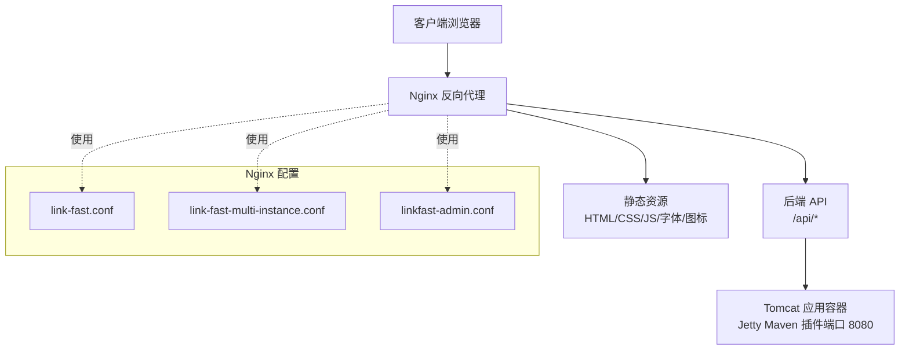
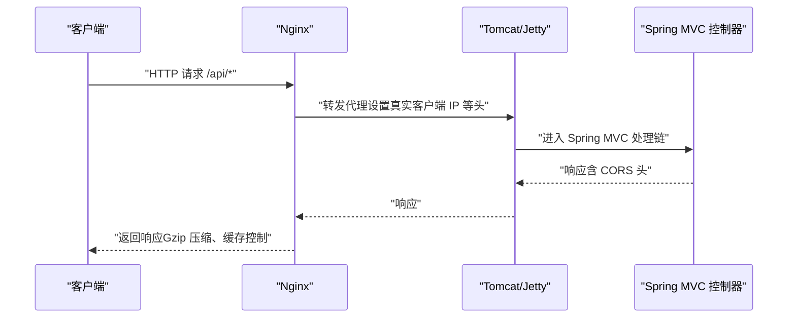
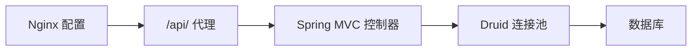

# 性能优化与安全加固

<cite>
**本文引用的文件**
- [link-fast.conf](file://docs/nginx/link-fast.conf)
- [link-fast-multi-instance.conf](file://docs/nginx/link-fast-multi-instance.conf)
- [linkfast-admin.conf](file://docs/nginx/linkfast-admin.conf)
- [WebMvcConfig.java](file://src/main/java/cn/linkfast/config/WebMvcConfig.java)
- [applicationContext.xml](file://src/main/resources/applicationContext.xml)
- [pom.xml](file://pom.xml)
</cite>

## 目录
1. [简介](#简介)
2. [项目结构](#项目结构)
3. [核心组件](#核心组件)
4. [架构总览](#架构总览)
5. [详细组件分析](#详细组件分析)
6. [依赖关系分析](#依赖关系分析)
7. [性能考量](#性能考量)
8. [故障排查指南](#故障排查指南)
9. [结论](#结论)
10. [附录](#附录)

## 简介
本文件面向 Link-Fast 项目的 Nginx 配置，系统性梳理并提出性能优化与安全加固方案。内容覆盖：
- Gzip 压缩配置与调优建议
- 静态资源缓存策略与缓存控制头
- 安全加固措施（敏感目录访问限制、HTTP 头部安全、访问控制）
- 负载均衡与连接超时调优
- 性能监控与日志分析建议
- 安全审计与漏洞防护最佳实践

## 项目结构
本项目采用前后端分离架构，Nginx 作为反向代理与静态资源服务入口，后端通过 Spring MVC 提供 REST 接口。Nginx 配置位于 docs/nginx 目录，包含单实例与多实例两种部署形态，以及仅前端静态站点的简化配置。

图表来源
- [link-fast.conf:1-67](file://docs/nginx/link-fast.conf#L1-L67)
- [link-fast-multi-instance.conf:1-71](file://docs/nginx/link-fast-multi-instance.conf#L1-L71)
- [linkfast-admin.conf:1-37](file://docs/nginx/linkfast-admin.conf#L1-L37)
- [pom.xml:275-290](file://pom.xml#L275-L290)

章节来源
- [link-fast.conf:1-67](file://docs/nginx/link-fast.conf#L1-L67)
- [link-fast-multi-instance.conf:1-71](file://docs/nginx/link-fast-multi-instance.conf#L1-L71)
- [linkfast-admin.conf:1-37](file://docs/nginx/linkfast-admin.conf#L1-L37)
- [pom.xml:275-290](file://pom.xml#L275-L290)

## 核心组件
- Nginx 配置模块
  - 日志与基础设置：访问日志、错误日志路径
  - 前端静态资源：根路径与 SPA 路由支持
  - 后端接口代理：/api/ 与回调专用路径
  - 静态资源缓存：按扩展名与过期时间策略
  - 安全加固：敏感目录访问限制
  - Gzip 压缩：开关、最小长度、压缩类型
- 后端 Spring MVC 配置
  - CORS 全局配置：允许来源、方法、头部、凭证与最大年龄
  - Jackson 消息转换器：统一 JSON 序列化
- 数据源与连接池
  - Druid 连接池参数：初始大小、最大活跃、空闲回收、异常处理

章节来源
- [link-fast.conf:5-67](file://docs/nginx/link-fast.conf#L5-L67)
- [link-fast-multi-instance.conf:13-71](file://docs/nginx/link-fast-multi-instance.conf#L13-L71)
- [linkfast-admin.conf:7-37](file://docs/nginx/linkfast-admin.conf#L7-L37)
- [WebMvcConfig.java:44-52](file://src/main/java/cn/linkfast/config/WebMvcConfig.java#L44-L52)
- [applicationContext.xml:14-52](file://src/main/resources/applicationContext.xml#L14-L52)

## 架构总览
Nginx 作为统一入口，负责：
- 静态资源直出与缓存
- 请求路由至后端 API
- 安全过滤与压缩
- 日志采集与可观测性

后端通过 Spring MVC 提供 REST 接口，Jetty Maven 插件在本地开发时提供运行环境。

图表来源
- [link-fast.conf:34-50](file://docs/nginx/link-fast.conf#L34-L50)
- [link-fast-multi-instance.conf:31-48](file://docs/nginx/link-fast-multi-instance.conf#L31-L48)
- [WebMvcConfig.java:44-52](file://src/main/java/cn/linkfast/config/WebMvcConfig.java#L44-L52)

## 详细组件分析

### Gzip 压缩配置与优化
- 当前配置
  - 开关：开启
  - 最小长度：1 字节
  - 类型：text/plain、text/css、application/javascript、application/json
- 优化建议
  - 增加压缩类型：font、image/svg+xml、application/xml 等
  - 调整最小长度：根据业务流量与 CPU 占比评估，适当提高阈值以减少 CPU 开销
  - 启用静态资源压缩：对 .html、.css、.js、.json、.xml 等进行压缩
  - 避免重复压缩：确保上游已压缩的资源不再二次压缩（如已压缩的图片、视频）

章节来源
- [link-fast.conf:63-67](file://docs/nginx/link-fast.conf#L63-L67)
- [link-fast-multi-instance.conf:67-71](file://docs/nginx/link-fast-multi-instance.conf#L67-L71)
- [linkfast-admin.conf:33-37](file://docs/nginx/linkfast-admin.conf#L33-L37)

### 静态资源缓存策略
- 当前策略
  - 过期时间：7 天
  - 缓存控制头：expires 与 Cache-Control（部分配置）
- 优化建议
  - 静态资源扩展名：增加字体文件（woff、woff2、ttf、eot）与图标（ico、svg）
  - 缓存控制头：使用 Cache-Control: public, immutable 或 max-age 更明确的策略
  - 版本化与指纹：为 JS/CSS 添加版本号或指纹，结合长缓存策略
  - 多实例场景：根据路径选择不同根目录，确保测试与生产资源隔离

章节来源
- [link-fast.conf:52-56](file://docs/nginx/link-fast.conf#L52-L56)
- [link-fast-multi-instance.conf:50-60](file://docs/nginx/link-fast-multi-instance.conf#L50-L60)
- [linkfast-admin.conf:27-31](file://docs/nginx/linkfast-admin.conf#L27-L31)

### 安全加固措施
- 敏感目录访问限制
  - 禁止访问 manager、host-manager、docs、examples 等敏感路径
- HTTP 头部安全
  - 设置安全头（X-Frame-Options、X-Content-Type-Options、X-XSS-Protection、Referrer-Policy、Permissions-Policy 等）
  - 严格 CORS 配置：限制来源、方法与头部，避免通配符
- 访问控制列表（ACL）
  - 基于 IP 白名单/黑名单
  - 速率限制（limit_req_zone/limit_req）
  - 请求体大小限制（client_max_body_size）

章节来源
- [link-fast.conf:58-61](file://docs/nginx/link-fast.conf#L58-L61)
- [link-fast-multi-instance.conf:62-65](file://docs/nginx/link-fast-multi-instance.conf#L62-L65)
- [WebMvcConfig.java:44-52](file://src/main/java/cn/linkfast/config/WebMvcConfig.java#L44-L52)

### 负载均衡与连接超时调优
- 当前配置
  - 单实例：直接代理到 127.0.0.1:8080
  - 多实例：upstream 分别指向生产与测试端口
- 调优建议
  - 连接超时：proxy_connect_timeout、proxy_send_timeout、proxy_read_timeout 合理设置
  - 健康检查：结合 keepalive 与 fail_timeout
  - 并发与队列：worker_connections、worker_processes、限流与队列长度
  - 会话保持：基于 Cookie 或 IP 的会话亲和（谨慎使用）

章节来源
- [link-fast-multi-instance.conf:1-7](file://docs/nginx/link-fast-multi-instance.conf#L1-L7)
- [link-fast.conf:28-29](file://docs/nginx/link-fast.conf#L28-L29)

### CORS 与跨域配置
- 当前配置
  - Nginx：示例注释展示了 CORS 头部设置
  - Spring MVC：全局 CORS 映射 /api/**，允许来源模式、方法、头部、凭证与最大年龄
- 建议
  - 保持前后端一致的 CORS 策略，避免双重放行
  - 生产环境避免通配符来源，使用精确来源白名单
  - 预检请求处理：在 Nginx 或后端统一拦截 OPTIONS 并返回 204

章节来源
- [link-fast.conf:41-49](file://docs/nginx/link-fast.conf#L41-L49)
- [WebMvcConfig.java:44-52](file://src/main/java/cn/linkfast/config/WebMvcConfig.java#L44-L52)

### 日志与监控
- 日志
  - 访问日志与错误日志路径已在配置中定义
  - 建议：按天切割、保留周期、结构化字段（请求耗时、状态码、用户代理、客户端 IP）
- 监控指标
  - QPS、错误率、响应时间、连接数、CPU/内存
  - 结合 Nginx Plus 或开源方案（如 Prometheus + Grafana）进行可视化

章节来源
- [link-fast.conf:6-7](file://docs/nginx/link-fast.conf#L6-L7)
- [link-fast-multi-instance.conf:13-14](file://docs/nginx/link-fast-multi-instance.conf#L13-L14)
- [linkfast-admin.conf:13-15](file://docs/nginx/linkfast-admin.conf#L13-L15)

## 依赖关系分析
- Nginx 与后端
  - Nginx 通过 proxy_pass 将 /api/ 转发至后端服务
  - 代理头设置确保后端可识别真实客户端信息
- 后端与数据层
  - Spring MVC 依赖 Jackson 进行 JSON 序列化
  - 数据源使用 Druid 连接池，具备空闲回收与异常处理能力

图表来源
- [link-fast.conf:34-50](file://docs/nginx/link-fast.conf#L34-L50)
- [WebMvcConfig.java:24-39](file://src/main/java/cn/linkfast/config/WebMvcConfig.java#L24-L39)
- [applicationContext.xml:14-52](file://src/main/resources/applicationContext.xml#L14-L52)

章节来源
- [link-fast.conf:34-50](file://docs/nginx/link-fast.conf#L34-L50)
- [WebMvcConfig.java:24-39](file://src/main/java/cn/linkfast/config/WebMvcConfig.java#L24-L39)
- [applicationContext.xml:14-52](file://src/main/resources/applicationContext.xml#L14-L52)

## 性能考量
- 压缩与缓存
  - 合理设置 Gzip 类型与最小长度，避免对小资源过度压缩
  - 静态资源长缓存，结合版本化策略，降低带宽与服务器压力
- 超时与并发
  - 根据业务特性调整代理超时，避免长时间占用连接
  - 适当增加 worker_connections，结合限流防止突发流量击垮后端
- 数据库连接池
  - 初始大小与最大活跃数需与后端处理能力匹配
  - 空闲回收与异常处理保障连接健康与稳定性

章节来源
- [link-fast.conf:63-67](file://docs/nginx/link-fast.conf#L63-L67)
- [link-fast-multi-instance.conf:67-71](file://docs/nginx/link-fast-multi-instance.conf#L67-L71)
- [applicationContext.xml:23-52](file://src/main/resources/applicationContext.xml#L23-L52)

## 故障排查指南
- 常见问题定位
  - 404/SPA 路由：确认 try_files 配置是否正确
  - CORS 错误：核对 Nginx 与后端 CORS 配置一致性
  - 静态资源不更新：检查缓存控制头与浏览器缓存
  - 代理超时：检查 proxy_connect_timeout、proxy_read_timeout
- 日志分析
  - 访问日志：分析状态码分布、响应时间、客户端 UA
  - 错误日志：定位 Nginx 与后端异常
- 安全事件
  - 敏感目录访问尝试：确认 deny all 是否生效
  - 异常来源：结合 IP 黑名单与速率限制

章节来源
- [link-fast.conf:11-15](file://docs/nginx/link-fast.conf#L11-L15)
- [link-fast.conf:41-49](file://docs/nginx/link-fast.conf#L41-L49)
- [link-fast.conf:58-61](file://docs/nginx/link-fast.conf#L58-L61)
- [link-fast-multi-instance.conf:16-28](file://docs/nginx/link-fast-multi-instance.conf#L16-L28)

## 结论
通过对 Nginx 配置的系统化梳理与优化建议，可在保证安全的前提下显著提升性能与稳定性。建议优先实施以下改进：
- 完善 Gzip 类型与最小长度策略
- 统一并收紧 CORS 配置
- 强化静态资源缓存与版本化
- 增强安全头与访问控制
- 结合监控与日志完善可观测性

## 附录
- 配置文件清单
  - [link-fast.conf](file://docs/nginx/link-fast.conf)
  - [link-fast-multi-instance.conf](file://docs/nginx/link-fast-multi-instance.conf)
  - [linkfast-admin.conf](file://docs/nginx/linkfast-admin.conf)
- 后端相关配置
  - [WebMvcConfig.java](file://src/main/java/cn/linkfast/config/WebMvcConfig.java)
  - [applicationContext.xml](file://src/main/resources/applicationContext.xml)
  - [pom.xml](file://pom.xml)