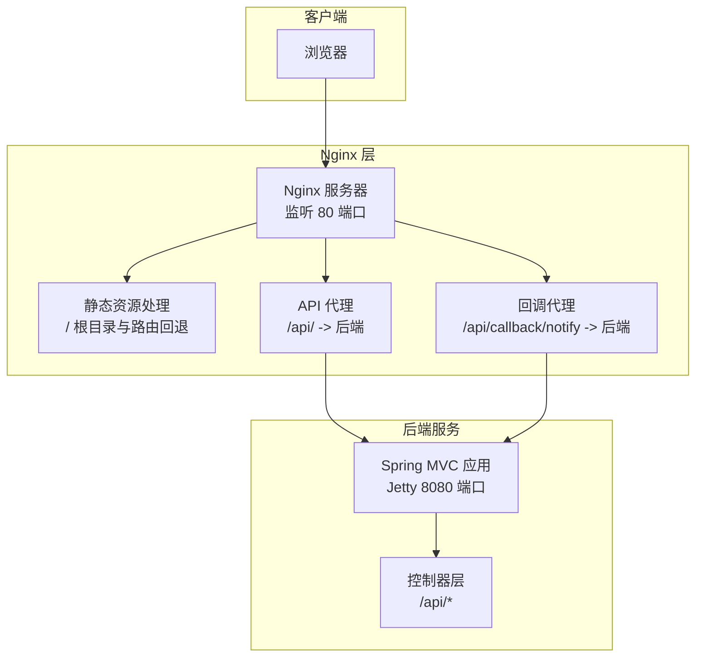
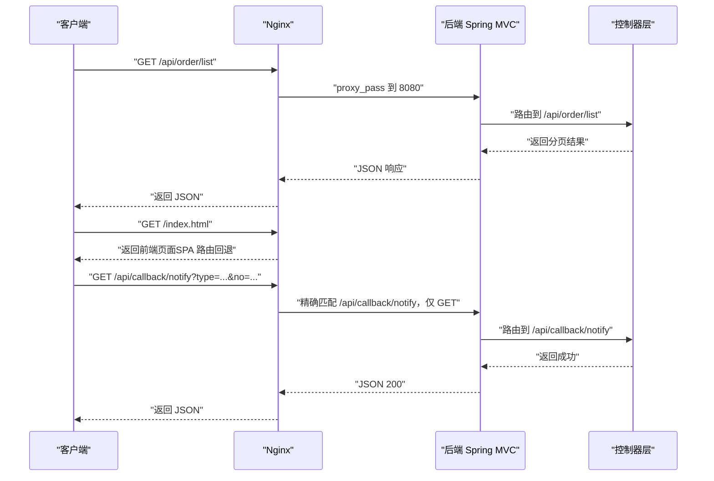
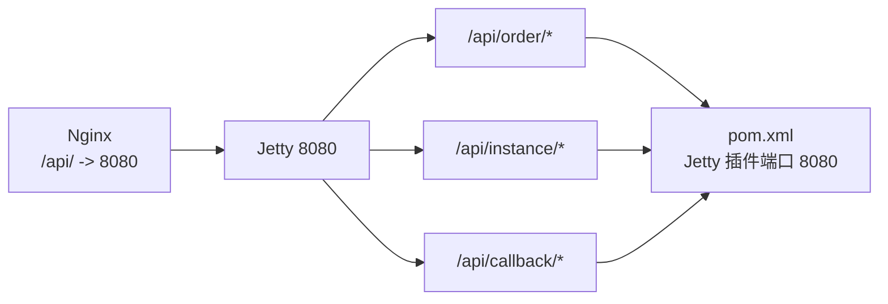

# 管理面板 Nginx 配置

<cite>
**本文引用的文件**
- [linkfast-admin.conf](file://docs/nginx/linkfast-admin.conf)
- [link-fast.conf](file://docs/nginx/link-fast.conf)
- [link-fast-multi-instance.conf](file://docs/nginx/link-fast-multi-instance.conf)
- [WebMvcConfig.java](file://src/main/java/cn/linkfast/config/WebMvcConfig.java)
- [ProxyCallbackController.java](file://src/main/java/cn/linkfast/controller/ProxyCallbackController.java)
- [ProxyOrderController.java](file://src/main/java/cn/linkfast/controller/ProxyOrderController.java)
- [ProxyInstanceController.java](file://src/main/java/cn/linkfast/controller/ProxyInstanceController.java)
- [applicationContext.xml](file://src/main/resources/applicationContext.xml)
- [pom.xml](file://pom.xml)
</cite>

## 目录
1. [简介](#简介)
2. [项目结构](#项目结构)
3. [核心组件](#核心组件)
4. [架构总览](#架构总览)
5. [详细组件分析](#详细组件分析)
6. [依赖分析](#依赖分析)
7. [性能考虑](#性能考虑)
8. [故障排除指南](#故障排除指南)
9. [结论](#结论)
10. [附录](#附录)

## 简介
本文件面向 Link-Fast 管理面板的 Nginx 配置，聚焦以下目标：
- 管理面板静态资源处理：根目录设置、前端路由（History 模式）支持、静态资源缓存与压缩。
- 安全配置：访问控制、权限管理、敏感路径保护。
- 与后端 API 的代理配置：请求转发、头部传递、超时与错误处理。
- 缓存策略与性能优化：静态资源缓存、Gzip 压缩、immutable 缓存策略。
- 部署安全建议与监控配置：日志、限流、WAF、证书与 HTTPS。
- 实际配置示例与故障排除。

## 项目结构
- Nginx 配置位于 docs/nginx/，包含三份典型场景配置：
  - 单实例管理面板：linkfast-admin.conf
  - 单实例前后端分离：link-fast.conf
  - 多实例（生产/测试）：link-fast-multi-instance.conf
- 后端基于 Spring MVC，控制器通过 /api/* 提供 REST 接口，全局跨域配置在 WebMvcConfig 中生效。
- 前端静态资源根目录统一指向 /var/www/linkfast-admin 或其测试变体。

图表来源
- [link-fast.conf:1-67](file://docs/nginx/link-fast.conf#L1-L67)
- [WebMvcConfig.java:44-52](file://src/main/java/cn/linkfast/config/WebMvcConfig.java#L44-L52)

章节来源
- [linkfast-admin.conf:1-37](file://docs/nginx/linkfast-admin.conf#L1-L37)
- [link-fast.conf:1-67](file://docs/nginx/link-fast.conf#L1-L67)
- [link-fast-multi-instance.conf:1-71](file://docs/nginx/link-fast-multi-instance.conf#L1-L71)

## 核心组件
- 静态资源与路由
  - 根目录设置：root 指向 /var/www/linkfast-admin。
  - 前端路由支持：try_files $uri $uri/ /index.html，保障 SPA History 模式刷新不 404。
- API 代理
  - /api/ 请求转发至后端服务（默认 127.0.0.1:8080），传递 Host、X-Real-IP、X-Forwarded-For、X-Forwarded-Proto。
  - 精确匹配 /api/callback/notify，限制仅 GET 方法，确保第三方回调安全。
- 回调与跨域
  - /api/ 下的回调路径允许跨域（开发阶段），生产环境建议在后端统一处理或关闭通配符。
- 缓存与压缩
  - 静态资源缓存：CSS/JS/PNG/JPG/GIF/ICO/SVG 等 7 天缓存。
  - Gzip 压缩：开启并限定类型，提升传输效率。
- 安全加固
  - 敏感路径禁止访问：manager、host-manager、docs、examples。
  - 回调接口仅允许 GET，降低风险。
- 多实例支持
  - upstream 定义生产/测试后端，/test 路径映射测试前端，/test-api/ 重写为 /api/ 再转发。

章节来源
- [linkfast-admin.conf:7-37](file://docs/nginx/linkfast-admin.conf#L7-L37)
- [link-fast.conf:17-50](file://docs/nginx/link-fast.conf#L17-L50)
- [link-fast-multi-instance.conf:1-71](file://docs/nginx/link-fast-multi-instance.conf#L1-L71)

## 架构总览
下图展示 Nginx 作为反向代理与静态资源服务器的角色，以及与后端 Spring MVC 控制器的交互。

图表来源
- [link-fast.conf:17-50](file://docs/nginx/link-fast.conf#L17-L50)
- [ProxyOrderController.java:34-37](file://src/main/java/cn/linkfast/controller/ProxyOrderController.java#L34-L37)
- [ProxyCallbackController.java:42-94](file://src/main/java/cn/linkfast/controller/ProxyCallbackController.java#L42-L94)

## 详细组件分析

### 静态资源与前端路由
- 根目录与首页
  - root 指向 /var/www/linkfast-admin，index 设为 index.html/index.htm。
- SPA 路由回退
  - try_files $uri $uri/ /index.html，确保 History 模式刷新不会 404。
- 静态资源缓存
  - 对 .css/.js/.png/.jpg/.jpeg/.gif/.ico/.svg 设置 expires 7d，并添加 Cache-Control。
- Gzip 压缩
  - gzip on，限定 text/plain、text/css、application/javascript、application/json 类型。

章节来源
- [linkfast-admin.conf:8-37](file://docs/nginx/linkfast-admin.conf#L8-L37)
- [link-fast.conf:9-15](file://docs/nginx/link-fast.conf#L9-L15)
- [link-fast-multi-instance.conf:50-60](file://docs/nginx/link-fast-multi-instance.conf#L50-L60)

### API 代理与请求转发
- 通用 API 代理
  - location /api/ 使用 proxy_pass 转发至 127.0.0.1:8080，传递标准头部，设置超时。
- 回调接口代理
  - location = /api/callback/notify 仅允许 GET，防止非预期方法滥用。
- 多实例场景
  - upstream 定义 backend_prod/backend_test，/test-api/ 通过 rewrite 将 /test-api/xxx 重写为 /api/xxx 再转发。

章节来源
- [link-fast.conf:32-50](file://docs/nginx/link-fast.conf#L32-L50)
- [link-fast-multi-instance.conf:30-48](file://docs/nginx/link-fast-multi-instance.conf#L30-L48)

### 跨域与回调安全
- 后端全局跨域
  - WebMvcConfig 对 /api/** 开启跨域，允许任意来源、方法与头，支持凭据与缓存。
- Nginx 层回调跨域
  - linkfast-admin.conf 在 /api/ 下添加 Access-Control-* 头，避免第三方回调跨域报错。
- 安全建议
  - 生产环境建议将 Access-Control-Allow-Origin 设为具体域名，避免通配符。
  - 回调接口仅允许 GET，且在后端做签名校验与幂等处理。

章节来源
- [WebMvcConfig.java:44-52](file://src/main/java/cn/linkfast/config/WebMvcConfig.java#L44-L52)
- [linkfast-admin.conf:17-25](file://docs/nginx/linkfast-admin.conf#L17-L25)
- [link-fast.conf:41-49](file://docs/nginx/link-fast.conf#L41-L49)

### 缓存策略与性能优化
- 静态资源缓存
  - 7 天缓存，immutable 策略（多实例配置）提升长期缓存命中率。
- Gzip 压缩
  - 开启并限定类型，减少传输体积。
- 多实例静态资源根目录选择
  - 通过 if 判断 $uri 是否以 /test/ 开头，动态设置 root，确保测试与生产资源隔离。

章节来源
- [link-fast-multi-instance.conf:50-60](file://docs/nginx/link-fast-multi-instance.conf#L50-L60)
- [link-fast.conf:63-67](file://docs/nginx/link-fast.conf#L63-L67)

### 安全配置与权限管理
- 敏感路径禁用
  - deny all 禁止访问 manager、host-manager、docs、examples。
- 回调接口限制
  - 仅 GET 方法，降低 CSRF 与误用风险。
- 建议补充
  - 引入 Basic Auth 或 IP 白名单保护 /api/。
  - 启用 HTTPS 并配置 HSTS、CSP、X-Frame-Options 等安全头。

章节来源
- [link-fast.conf:58-61](file://docs/nginx/link-fast.conf#L58-L61)
- [link-fast-multi-instance.conf:62-65](file://docs/nginx/link-fast-multi-instance.conf#L62-L65)

### 多实例与测试环境
- 生产与测试后端
  - upstream 定义 backend_prod（8080）与 backend_test（8081）。
- 前端路径映射
  - / 根路径对应生产前端，/test 对应测试前端目录。
- API 重写
  - /test-api/ 重写为 /api/ 再转发至测试后端，便于前端统一调用。

章节来源
- [link-fast-multi-instance.conf:1-48](file://docs/nginx/link-fast-multi-instance.conf#L1-L48)

## 依赖分析
- Nginx 与后端通信
  - Nginx 通过 proxy_pass 将 /api/ 转发至 8080（Jetty），传递 X-Real-IP、X-Forwarded-For、X-Forwarded-Proto。
- 控制器与 API 路由
  - /api/order、/api/instance、/api/callback 等控制器提供 REST 接口，与 Nginx 代理路径一一对应。
- 跨域依赖
  - 后端 WebMvcConfig 全局配置 /api/** 跨域，Nginx 层可按需补充。

图表来源
- [link-fast.conf:32-50](file://docs/nginx/link-fast.conf#L32-L50)
- [ProxyOrderController.java:23-87](file://src/main/java/cn/linkfast/controller/ProxyOrderController.java#L23-L87)
- [ProxyInstanceController.java:23-79](file://src/main/java/cn/linkfast/controller/ProxyInstanceController.java#L23-L79)
- [ProxyCallbackController.java:26-94](file://src/main/java/cn/linkfast/controller/ProxyCallbackController.java#L26-L94)
- [pom.xml:279-290](file://pom.xml#L279-L290)

章节来源
- [link-fast.conf:32-50](file://docs/nginx/link-fast.conf#L32-L50)
- [ProxyOrderController.java:23-87](file://src/main/java/cn/linkfast/controller/ProxyOrderController.java#L23-L87)
- [ProxyInstanceController.java:23-79](file://src/main/java/cn/linkfast/controller/ProxyInstanceController.java#L23-L79)
- [ProxyCallbackController.java:26-94](file://src/main/java/cn/linkfast/controller/ProxyCallbackController.java#L26-L94)
- [pom.xml:279-290](file://pom.xml#L279-L290)

## 性能考虑
- 静态资源缓存
  - 7 天缓存与 immutable 策略显著降低带宽与服务器压力。
- Gzip 压缩
  - 仅对文本类资源启用，避免对已压缩资源（如图片）重复压缩。
- 代理超时
  - proxy_connect_timeout 与 proxy_read_timeout 合理设置，避免长连接占用。
- 多实例资源隔离
  - 动态 root 切换，避免缓存污染，提升测试与生产的独立性。

章节来源
- [link-fast-multi-instance.conf:50-60](file://docs/nginx/link-fast-multi-instance.conf#L50-L60)
- [link-fast.conf:28-30](file://docs/nginx/link-fast.conf#L28-L30)

## 故障排除指南
- 前端路由刷新 404
  - 检查是否配置了 try_files $uri $uri/ /index.html。
  - 参考：[linkfast-admin.conf:13-15](file://docs/nginx/linkfast-admin.conf#L13-L15)
- API 跨域失败
  - 确认后端 /api/** 已开启跨域，或在 Nginx 层添加 Access-Control-* 头。
  - 参考：[WebMvcConfig.java:44-52](file://src/main/java/cn/linkfast/config/WebMvcConfig.java#L44-L52)
- 回调接口 405 Method Not Allowed
  - 回调接口仅允许 GET，检查前端调用方法。
  - 参考：[link-fast.conf:19-23](file://docs/nginx/link-fast.conf#L19-L23)
- 静态资源未缓存
  - 确认扩展名匹配与 expires 设置，检查浏览器缓存策略。
  - 参考：[link-fast.conf:52-57](file://docs/nginx/link-fast.conf#L52-L57)
- 多实例资源路径错误
  - 确认 /test-api/ 重写规则与测试后端端口。
  - 参考：[link-fast-multi-instance.conf:41-48](file://docs/nginx/link-fast-multi-instance.conf#L41-L48)
- 后端连接池与事务
  - 若出现连接超时或泄露，检查 Druid 连接池配置与事务管理。
  - 参考：[applicationContext.xml:14-67](file://src/main/resources/applicationContext.xml#L14-L67)

章节来源
- [linkfast-admin.conf:13-15](file://docs/nginx/linkfast-admin.conf#L13-L15)
- [link-fast.conf:19-23](file://docs/nginx/link-fast.conf#L19-L23)
- [link-fast.conf:52-57](file://docs/nginx/link-fast.conf#L52-L57)
- [link-fast-multi-instance.conf:41-48](file://docs/nginx/link-fast-multi-instance.conf#L41-L48)
- [applicationContext.xml:14-67](file://src/main/resources/applicationContext.xml#L14-L67)

## 结论
- Nginx 配置清晰地分离了静态资源、API 代理与回调处理，满足管理面板的前端路由、跨域与安全需求。
- 建议在生产环境进一步收紧跨域策略、引入 HTTPS 与 WAF、完善访问控制与审计日志。
- 多实例配置提供了测试与生产的隔离方案，便于灰度与回归验证。

## 附录
- 实际配置示例（路径参考）
  - 单实例管理面板：[linkfast-admin.conf:1-37](file://docs/nginx/linkfast-admin.conf#L1-L37)
  - 单实例前后端分离：[link-fast.conf:1-67](file://docs/nginx/link-fast.conf#L1-L67)
  - 多实例（生产/测试）：[link-fast-multi-instance.conf:1-71](file://docs/nginx/link-fast-multi-instance.conf#L1-L71)
- 后端 API 控制器（路径参考）
  - 订单接口：[ProxyOrderController.java:23-87](file://src/main/java/cn/linkfast/controller/ProxyOrderController.java#L23-L87)
  - 实例接口：[ProxyInstanceController.java:23-79](file://src/main/java/cn/linkfast/controller/ProxyInstanceController.java#L23-L79)
  - 回调接口：[ProxyCallbackController.java:26-94](file://src/main/java/cn/linkfast/controller/ProxyCallbackController.java#L26-L94)
- 跨域与静态资源（路径参考）
  - 全局跨域配置：[WebMvcConfig.java:44-52](file://src/main/java/cn/linkfast/config/WebMvcConfig.java#L44-L52)
  - 静态资源缓存与压缩：[link-fast.conf:52-67](file://docs/nginx/link-fast.conf#L52-L67)