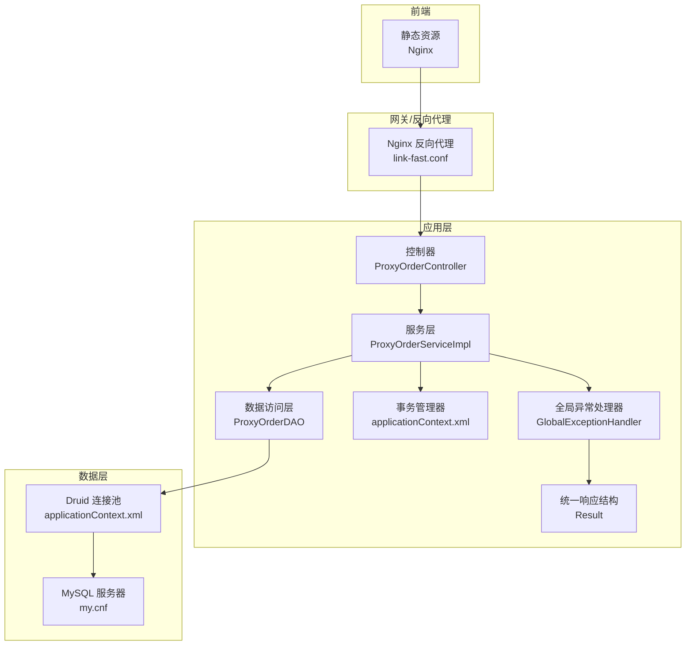
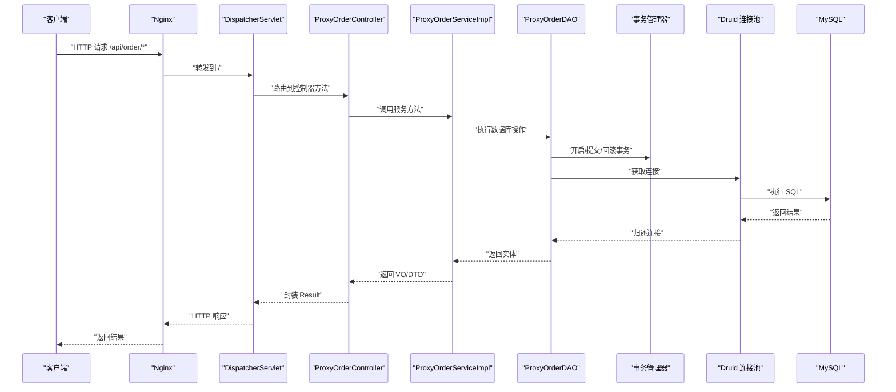
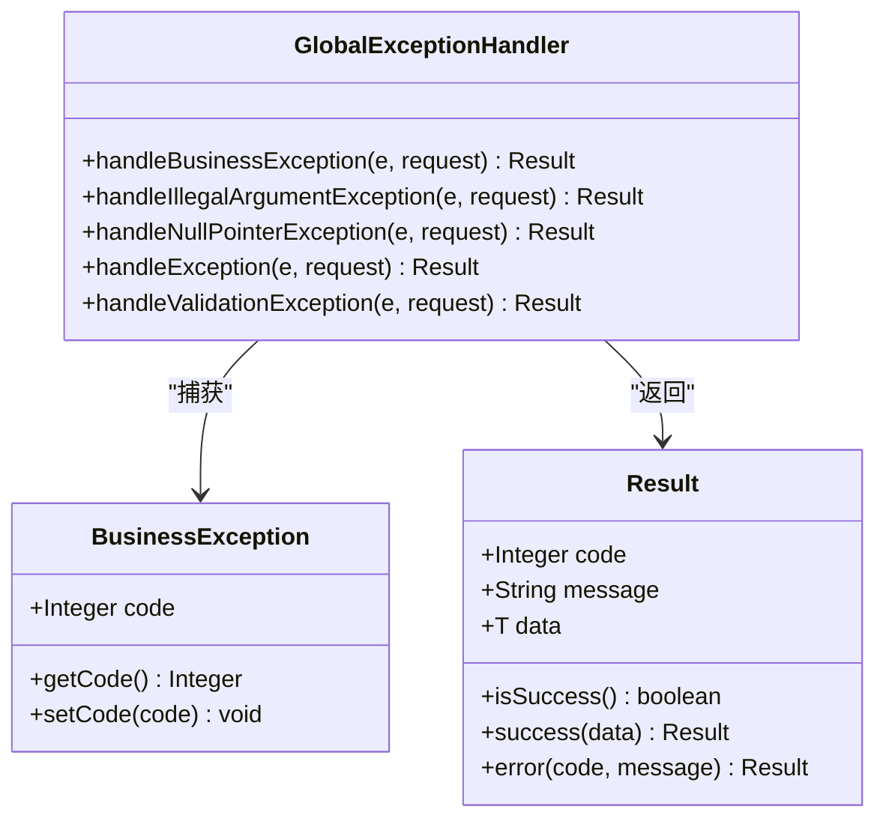
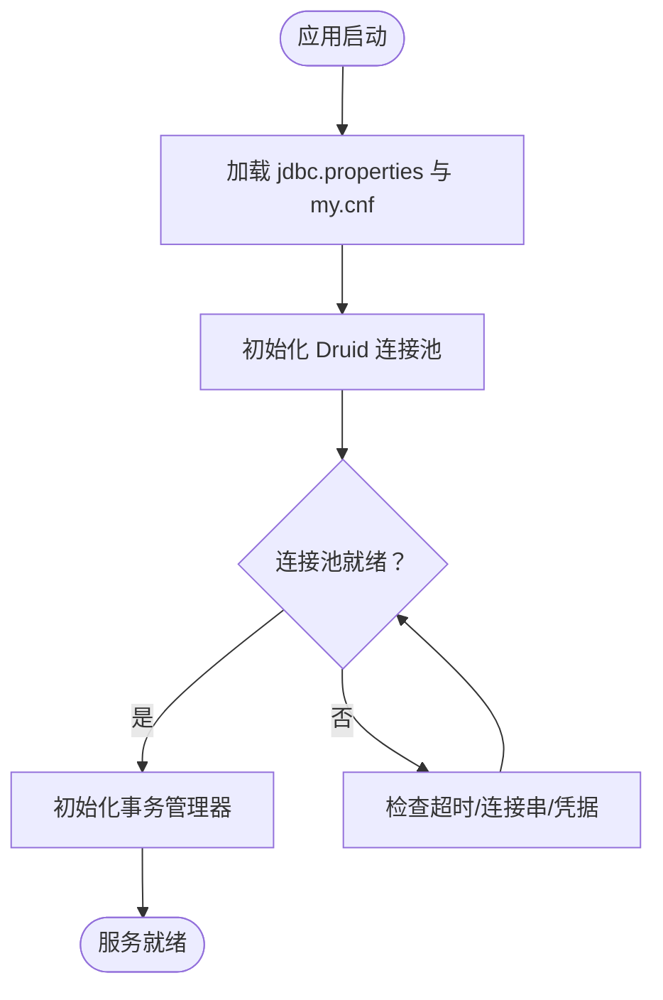
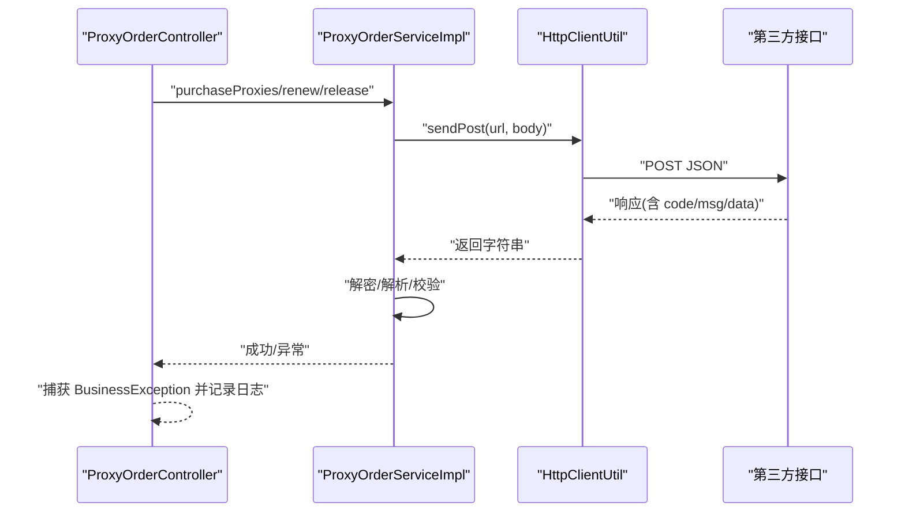
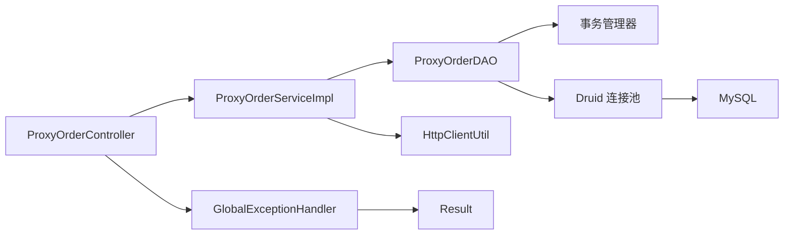

# 故障排除与维护

<cite>
**本文引用的文件**
- [src/main/resources/logback.xml](file://src/main/resources/logback.xml)
- [src/main/resources/jdbc.properties](file://src/main/resources/jdbc.properties)
- [src/main/resources/applicationContext.xml](file://src/main/resources/applicationContext.xml)
- [docs/database/my.cnf](file://docs/database/my.cnf)
- [docs/nginx/link-fast.conf](file://docs/nginx/link-fast.conf)
- [src/main/webapp/WEB-INF/web.xml](file://src/main/webapp/WEB-INF/web.xml)
- [src/main/java/cn/linkfast/exception/GlobalExceptionHandler.java](file://src/main/java/cn/linkfast/exception/GlobalExceptionHandler.java)
- [src/main/java/cn/linkfast/exception/BusinessException.java](file://src/main/java/cn/linkfast/exception/BusinessException.java)
- [src/main/java/cn/linkfast/common/Result.java](file://src/main/java/cn/linkfast/common/Result.java)
- [src/main/java/cn/linkfast/utils/HttpClientUtil.java](file://src/main/java/cn/linkfast/utils/HttpClientUtil.java)
- [src/main/java/cn/linkfast/service/impl/ProxyOrderServiceImpl.java](file://src/main/java/cn/linkfast/service/impl/ProxyOrderServiceImpl.java)
- [src/main/java/cn/linkfast/controller/ProxyOrderController.java](file://src/main/java/cn/linkfast/controller/ProxyOrderController.java)
- [src/main/java/cn/linkfast/dao/ProxyOrderDAO.java](file://src/main/java/cn/linkfast/dao/ProxyOrderDAO.java)
</cite>

## 目录
1. [简介](#简介)
2. [项目结构](#项目结构)
3. [核心组件](#核心组件)
4. [架构总览](#架构总览)
5. [详细组件分析](#详细组件分析)
6. [依赖分析](#依赖分析)
7. [性能考虑](#性能考虑)
8. [故障排除指南](#故障排除指南)
9. [结论](#结论)
10. [附录](#附录)

## 简介
本文件面向 Link-Fast 项目的运维与开发团队，提供系统故障排除与日常维护的完整指南。内容覆盖数据库连接问题、API 调用失败、内存与性能瓶颈的诊断与优化，异常处理与日志分析方法，以及系统维护任务（备份、数据库维护、日志清理、升级流程）、应急响应与灾难恢复、业务连续性保障、性能调优与容量规划、运维自动化工具使用建议。

## 项目结构
- 应用采用 Spring MVC + Spring IoC + MyBatis/JdbcTemplate 的传统 Java Web 架构，使用 Logback 输出业务与服务器两类日志，Nginx 作为反向代理与静态资源服务。
- 数据库连接通过 Druid 连接池管理，MySQL 服务器配置位于 docs/database/my.cnf，Nginx 配置位于 docs/nginx/link-fast.conf。
- 异常统一由全局异常处理器处理，返回统一响应结构；业务异常通过 BusinessException 抛出，便于前端识别与提示。

图表来源
- [docs/nginx/link-fast.conf:1-67](file://docs/nginx/link-fast.conf#L1-L67)
- [src/main/java/cn/linkfast/controller/ProxyOrderController.java:1-86](file://src/main/java/cn/linkfast/controller/ProxyOrderController.java#L1-L86)
- [src/main/java/cn/linkfast/service/impl/ProxyOrderServiceImpl.java:1-200](file://src/main/java/cn/linkfast/service/impl/ProxyOrderServiceImpl.java#L1-L200)
- [src/main/java/cn/linkfast/dao/ProxyOrderDAO.java:1-102](file://src/main/java/cn/linkfast/dao/ProxyOrderDAO.java#L1-L102)
- [src/main/resources/applicationContext.xml:1-67](file://src/main/resources/applicationContext.xml#L1-L67)
- [docs/database/my.cnf:1-68](file://docs/database/my.cnf#L1-L68)

章节来源
- [docs/nginx/link-fast.conf:1-67](file://docs/nginx/link-fast.conf#L1-L67)
- [src/main/webapp/WEB-INF/web.xml:1-73](file://src/main/webapp/WEB-INF/web.xml#L1-L73)
- [src/main/resources/applicationContext.xml:1-67](file://src/main/resources/applicationContext.xml#L1-L67)
- [docs/database/my.cnf:1-68](file://docs/database/my.cnf#L1-L68)

## 核心组件
- 全局异常处理器：集中处理业务异常、参数异常、验证异常与未捕获异常，统一记录日志并返回 Result 结构。
- 统一响应结构：Result 提供 success/error 两种返回形态，便于前端统一处理。
- 数据库连接池：Druid 连接池配置包含初始大小、最小空闲、最大活跃、最大等待、空闲回收、泄露检测等关键参数。
- 日志系统：Logback 将业务日志与服务器日志分离输出，支持按日期滚动与控制台输出。
- Nginx 反向代理：负责静态资源、CORS、安全加固、Gzip 压缩与上游超时配置。

章节来源
- [src/main/java/cn/linkfast/exception/GlobalExceptionHandler.java:1-90](file://src/main/java/cn/linkfast/exception/GlobalExceptionHandler.java#L1-L90)
- [src/main/java/cn/linkfast/common/Result.java:1-59](file://src/main/java/cn/linkfast/common/Result.java#L1-L59)
- [src/main/resources/applicationContext.xml:17-52](file://src/main/resources/applicationContext.xml#L17-L52)
- [src/main/resources/logback.xml:1-49](file://src/main/resources/logback.xml#L1-L49)
- [docs/nginx/link-fast.conf:1-67](file://docs/nginx/link-fast.conf#L1-L67)

## 架构总览
下图展示了从 Nginx 到应用控制器、服务层、DAO 层与数据库的典型请求链路，以及异常处理与日志输出位置。

图表来源
- [docs/nginx/link-fast.conf:1-67](file://docs/nginx/link-fast.conf#L1-L67)
- [src/main/webapp/WEB-INF/web.xml:23-40](file://src/main/webapp/WEB-INF/web.xml#L23-L40)
- [src/main/java/cn/linkfast/controller/ProxyOrderController.java:1-86](file://src/main/java/cn/linkfast/controller/ProxyOrderController.java#L1-L86)
- [src/main/java/cn/linkfast/service/impl/ProxyOrderServiceImpl.java:1-200](file://src/main/java/cn/linkfast/service/impl/ProxyOrderServiceImpl.java#L1-L200)
- [src/main/java/cn/linkfast/dao/ProxyOrderDAO.java:1-102](file://src/main/java/cn/linkfast/dao/ProxyOrderDAO.java#L1-L102)
- [src/main/resources/applicationContext.xml:59-65](file://src/main/resources/applicationContext.xml#L59-L65)

## 详细组件分析

### 异常处理与统一响应
- 全局异常处理器对业务异常、参数异常、空指针、参数校验异常进行分类处理，并记录请求 URL 与异常信息，返回 Result.error 形态。
- BusinessException 支持自定义 code 与 message，并可携带 cause，便于区分业务错误与系统错误。
- Result 提供 isSuccess 判断与标准字段，前端可据此统一处理成功与失败。

图表来源
- [src/main/java/cn/linkfast/exception/GlobalExceptionHandler.java:1-90](file://src/main/java/cn/linkfast/exception/GlobalExceptionHandler.java#L1-L90)
- [src/main/java/cn/linkfast/exception/BusinessException.java:1-36](file://src/main/java/cn/linkfast/exception/BusinessException.java#L1-L36)
- [src/main/java/cn/linkfast/common/Result.java:1-59](file://src/main/java/cn/linkfast/common/Result.java#L1-L59)

章节来源
- [src/main/java/cn/linkfast/exception/GlobalExceptionHandler.java:1-90](file://src/main/java/cn/linkfast/exception/GlobalExceptionHandler.java#L1-L90)
- [src/main/java/cn/linkfast/exception/BusinessException.java:1-36](file://src/main/java/cn/linkfast/exception/BusinessException.java#L1-L36)
- [src/main/java/cn/linkfast/common/Result.java:1-59](file://src/main/java/cn/linkfast/common/Result.java#L1-L59)

### 数据库连接与事务
- JDBC 连接串启用批量重写、多查询、预编译缓存、Socket/连接超时、自动重连等参数，适合高并发与长事务场景。
- Druid 连接池配置包含初始大小、最小空闲、最大活跃、最大等待、空闲回收周期、泄露检测与移除、获取失败容错等，确保稳定性与可观测性。
- MySQL 服务器配置针对 wait_timeout、connect_timeout、net_read/write_timeout、max_connections、max_allowed_packet、缓冲池与日志参数进行优化，降低超时与连接争用风险。

图表来源
- [src/main/resources/jdbc.properties:1-39](file://src/main/resources/jdbc.properties#L1-L39)
- [src/main/resources/applicationContext.xml:17-52](file://src/main/resources/applicationContext.xml#L17-L52)
- [docs/database/my.cnf:32-68](file://docs/database/my.cnf#L32-L68)

章节来源
- [src/main/resources/jdbc.properties:1-39](file://src/main/resources/jdbc.properties#L1-L39)
- [src/main/resources/applicationContext.xml:17-52](file://src/main/resources/applicationContext.xml#L17-L52)
- [docs/database/my.cnf:32-68](file://docs/database/my.cnf#L32-L68)

### API 调用与第三方对接
- 服务层通过 HttpClientUtil 发送 POST JSON 请求，HTTP 非 2xx 返回包含状态码的 JSON，便于上层按业务 code 解析。
- 服务层对第三方响应进行解密与解析，若 code 非 200或响应为空，抛出运行时异常，交由全局异常处理器统一处理。
- 控制器层对续费与释放接口捕获业务异常并记录日志，返回统一 Result 错误。

图表来源
- [src/main/java/cn/linkfast/controller/ProxyOrderController.java:44-83](file://src/main/java/cn/linkfast/controller/ProxyOrderController.java#L44-L83)
- [src/main/java/cn/linkfast/service/impl/ProxyOrderServiceImpl.java:169-194](file://src/main/java/cn/linkfast/service/impl/ProxyOrderServiceImpl.java#L169-L194)
- [src/main/java/cn/linkfast/utils/HttpClientUtil.java:27-43](file://src/main/java/cn/linkfast/utils/HttpClientUtil.java#L27-L43)

章节来源
- [src/main/java/cn/linkfast/controller/ProxyOrderController.java:44-83](file://src/main/java/cn/linkfast/controller/ProxyOrderController.java#L44-L83)
- [src/main/java/cn/linkfast/service/impl/ProxyOrderServiceImpl.java:169-194](file://src/main/java/cn/linkfast/service/impl/ProxyOrderServiceImpl.java#L169-L194)
- [src/main/java/cn/linkfast/utils/HttpClientUtil.java:27-43](file://src/main/java/cn/linkfast/utils/HttpClientUtil.java#L27-L43)

### 日志与监控
- Logback 将业务日志与服务器日志分别输出到不同文件，支持按日期滚动与控制台输出，便于快速定位业务问题与框架问题。
- 控制器与服务层广泛使用日志记录请求参数、响应状态与异常堆栈，结合全局异常处理器，形成闭环的可观测性。

章节来源
- [src/main/resources/logback.xml:1-49](file://src/main/resources/logback.xml#L1-L49)
- [src/main/java/cn/linkfast/controller/ProxyOrderController.java:55-82](file://src/main/java/cn/linkfast/controller/ProxyOrderController.java#L55-L82)
- [src/main/java/cn/linkfast/service/impl/ProxyOrderServiceImpl.java:96-101](file://src/main/java/cn/linkfast/service/impl/ProxyOrderServiceImpl.java#L96-L101)

## 依赖分析
- 控制器依赖服务层；服务层依赖 DAO、工具类与第三方 HTTP 客户端；DAO 依赖 JdbcTemplate 与 Druid 连接池；连接池依赖 JDBC 配置与 MySQL 服务器。
- 全局异常处理器与统一响应结构贯穿控制器与服务层，保证错误处理一致性。

图表来源
- [src/main/java/cn/linkfast/controller/ProxyOrderController.java:1-86](file://src/main/java/cn/linkfast/controller/ProxyOrderController.java#L1-L86)
- [src/main/java/cn/linkfast/service/impl/ProxyOrderServiceImpl.java:1-200](file://src/main/java/cn/linkfast/service/impl/ProxyOrderServiceImpl.java#L1-L200)
- [src/main/java/cn/linkfast/dao/ProxyOrderDAO.java:1-102](file://src/main/java/cn/linkfast/dao/ProxyOrderDAO.java#L1-L102)
- [src/main/resources/applicationContext.xml:59-65](file://src/main/resources/applicationContext.xml#L59-L65)
- [src/main/java/cn/linkfast/utils/HttpClientUtil.java:1-45](file://src/main/java/cn/linkfast/utils/HttpClientUtil.java#L1-L45)
- [src/main/java/cn/linkfast/exception/GlobalExceptionHandler.java:1-90](file://src/main/java/cn/linkfast/exception/GlobalExceptionHandler.java#L1-L90)
- [src/main/java/cn/linkfast/common/Result.java:1-59](file://src/main/java/cn/linkfast/common/Result.java#L1-L59)

## 性能考虑
- 连接池与数据库参数
  - 连接池：合理设置 initialSize/minIdle/maxActive/maxWait，开启空闲回收与泄露检测，避免批量插入时连接争用。
  - 数据库：增大 max_connections 与 max_user_connections，延长 wait_timeout 与 interactive_timeout，提高批量写入与长事务稳定性。
- 网络与超时
  - Nginx 设置 proxy_connect_timeout 与 proxy_read_timeout，避免上游超时导致的 504/599。
  - JDBC 设置 connectTimeout/socketTimeout，避免慢查询与网络抖动引发的连接阻塞。
- 缓冲与压缩
  - 合理设置 MySQL 的 innodb_buffer_pool_size、innodb_log_file_size 等参数，提升批量写入性能。
  - 启用 Gzip 压缩减少传输体积，提升前端首屏体验。

章节来源
- [src/main/resources/applicationContext.xml:24-51](file://src/main/resources/applicationContext.xml#L24-L51)
- [docs/database/my.cnf:32-68](file://docs/database/my.cnf#L32-L68)
- [docs/nginx/link-fast.conf:28-29](file://docs/nginx/link-fast.conf#L28-L29)
- [src/main/resources/jdbc.properties:14-16](file://src/main/resources/jdbc.properties#L14-L16)

## 故障排除指南

### 一、数据库连接问题
- 症状
  - 应用频繁报“获取连接超时”、“连接被回收”、“连接泄露”。
- 诊断步骤
  - 检查 Druid 连接池参数与 MySQL max_connections/interactive_timeout/wait_timeout 是否匹配。
  - 查看业务日志与服务器日志中的连接池告警与异常堆栈。
  - 使用 show processlist 观察连接状态与慢查询。
- 解决方案
  - 调整 Druid 的 maxActive、maxWait、timeBetweenEvictionRunsMillis、minEvictableIdleTimeMillis。
  - 调整 MySQL 的 max_connections、wait_timeout、interactive_timeout、max_allowed_packet。
  - 对批量写入场景增加事务边界与批处理大小控制，避免长时间占用连接。

章节来源
- [src/main/resources/applicationContext.xml:24-51](file://src/main/resources/applicationContext.xml#L24-L51)
- [docs/database/my.cnf:32-68](file://docs/database/my.cnf#L32-L68)
- [src/main/resources/logback.xml:18-28](file://src/main/resources/logback.xml#L18-L28)

### 二、API 调用失败
- 症状
  - 第三方接口返回非 2xx 或返回包含 code/msg 的 JSON；服务层抛出运行时异常。
- 诊断步骤
  - 查看服务层日志中的原始响应与解密过程。
  - 检查 HttpClientUtil 的返回值与状态码映射。
  - 核对控制器层对业务异常的捕获与日志记录。
- 解决方案
  - 在服务层对空响应与非 200 状态进行幂等重试与降级处理。
  - 统一在全局异常处理器中记录请求 URL 与异常信息，便于追踪。
  - 对高频失败的接口增加熔断与限流策略。

章节来源
- [src/main/java/cn/linkfast/service/impl/ProxyOrderServiceImpl.java:169-194](file://src/main/java/cn/linkfast/service/impl/ProxyOrderServiceImpl.java#L169-L194)
- [src/main/java/cn/linkfast/utils/HttpClientUtil.java:27-43](file://src/main/java/cn/linkfast/utils/HttpClientUtil.java#L27-L43)
- [src/main/java/cn/linkfast/controller/ProxyOrderController.java:55-82](file://src/main/java/cn/linkfast/controller/ProxyOrderController.java#L55-L82)
- [src/main/java/cn/linkfast/exception/GlobalExceptionHandler.java:30-63](file://src/main/java/cn/linkfast/exception/GlobalExceptionHandler.java#L30-L63)

### 三、内存溢出与性能瓶颈
- 症状
  - GC 频繁、Full GC 时间过长、CPU 使用率飙升、接口响应时间增长。
- 诊断步骤
  - 采集 JVM 堆与 GC 日志，观察对象分配与回收情况。
  - 分析服务层批量处理逻辑（如批量插入、聚合查询）是否存在内存堆积。
  - 检查 Nginx 与应用超时配置，避免大量排队线程。
- 解决方案
  - 优化批量处理分片与内存阈值，及时释放中间对象。
  - 调整 JVM 参数（堆大小、GC 策略）与连接池参数，避免过度并发。
  - 对热点接口增加缓存与异步化处理。

章节来源
- [docs/nginx/link-fast.conf:28-29](file://docs/nginx/link-fast.conf#L28-L29)
- [src/main/resources/applicationContext.xml:24-51](file://src/main/resources/applicationContext.xml#L24-L51)

### 四、异常处理机制与错误日志分析
- 机制
  - 全局异常处理器按类型分类处理，记录请求 URL 与异常信息，返回统一 Result。
  - BusinessException 支持自定义 code，便于前端识别业务错误。
- 日志分析
  - 业务日志：定位业务流程与参数；服务器日志：定位框架与容器问题。
  - 结合控制器与服务层的日志，复现问题发生上下文。

章节来源
- [src/main/java/cn/linkfast/exception/GlobalExceptionHandler.java:1-90](file://src/main/java/cn/linkfast/exception/GlobalExceptionHandler.java#L1-L90)
- [src/main/java/cn/linkfast/exception/BusinessException.java:1-36](file://src/main/java/cn/linkfast/exception/BusinessException.java#L1-L36)
- [src/main/resources/logback.xml:6-47](file://src/main/resources/logback.xml#L6-L47)

### 五、系统维护任务
- 定期备份
  - MySQL：使用逻辑备份与物理备份相结合，验证备份完整性与恢复演练。
  - 应用与配置：版本化管理配置文件与部署包，记录备份时间与版本。
- 数据库维护
  - 定期执行索引优化、统计信息更新、碎片整理与表结构健康检查。
  - 监控慢查询与锁等待，定位热点表与不合理索引。
- 日志清理
  - 按天滚动的日志保留策略（例如保留 7 天），定期归档与压缩。
  - 控制台输出仅用于调试，生产环境建议关闭或限制级别。
- 系统升级流程
  - 预发布验证：接口回归、数据库变更脚本验证。
  - 灰度发布：逐步切换流量，监控指标与错误率。
  - 回滚预案：保留上一版本镜像与备份，快速回滚。

章节来源
- [src/main/resources/logback.xml:10-11](file://src/main/resources/logback.xml#L10-L11)
- [docs/database/my.cnf:32-68](file://docs/database/my.cnf#L32-L68)

### 六、应急响应与灾难恢复
- 应急响应
  - 快速隔离问题模块（熔断/限流/降级），记录 SLA 指标与影响范围。
  - 启动应急小组，明确职责分工与沟通机制。
- 灾难恢复
  - 基于备份的 RTO/RPO 目标进行恢复演练，验证恢复时间与数据一致性。
  - 多机房/异地容灾：跨机房同步与切换演练，确保业务连续性。
- 业务连续性
  - 关键接口冗余与缓存策略，保障降级期间用户体验。
  - 与第三方接口的契约变更与兼容性处理，避免单点依赖。

### 七、性能调优与容量规划
- 调优建议
  - 连接池：根据 QPS 与并发峰值调整 maxActive 与 maxWait，开启空闲回收与泄露检测。
  - 数据库：根据数据量与访问模式优化缓冲池、日志文件大小与连接上限。
  - 网络：合理设置 Nginx 与应用超时，避免上游超时放大。
- 容量规划
  - 基于历史峰值与增长趋势评估 CPU、内存、磁盘与网络带宽需求。
  - 对热点接口与数据库表进行容量预警与扩容预案。

章节来源
- [src/main/resources/applicationContext.xml:24-51](file://src/main/resources/applicationContext.xml#L24-L51)
- [docs/database/my.cnf:54-60](file://docs/database/my.cnf#L54-L60)
- [docs/nginx/link-fast.conf:28-29](file://docs/nginx/link-fast.conf#L28-L29)

### 八、运维自动化工具使用
- 配置管理
  - 使用版本化配置文件（如 jdbc.properties、my.cnf、nginx.conf），配合 CI/CD 自动部署。
- 监控与告警
  - 集成 JVM、数据库与应用指标监控，设置阈值告警与自动通知。
- 自动化运维
  - 备份脚本、日志清理脚本、升级脚本与回滚脚本标准化，减少人为失误。

## 结论
通过统一异常处理与日志体系、稳健的数据库连接池与 MySQL 参数、清晰的 API 调用链路与 Nginx 反向代理配置，Link-Fast 项目具备良好的可维护性与可观测性。建议在现有基础上完善应急响应与灾难恢复演练、强化容量规划与性能压测、推进运维自动化与监控告警体系建设，持续提升系统稳定性与业务连续性保障能力。

## 附录
- 关键配置文件路径
  - 日志：src/main/resources/logback.xml
  - 数据库连接：src/main/resources/jdbc.properties
  - 连接池与事务：src/main/resources/applicationContext.xml
  - MySQL 服务器：docs/database/my.cnf
  - Nginx：docs/nginx/link-fast.conf
  - Web 容器：src/main/webapp/WEB-INF/web.xml
- 关键类与接口
  - 全局异常：src/main/java/cn/linkfast/exception/GlobalExceptionHandler.java
  - 业务异常：src/main/java/cn/linkfast/exception/BusinessException.java
  - 统一响应：src/main/java/cn/linkfast/common/Result.java
  - HTTP 工具：src/main/java/cn/linkfast/utils/HttpClientUtil.java
  - 控制器：src/main/java/cn/linkfast/controller/ProxyOrderController.java
  - 服务实现：src/main/java/cn/linkfast/service/impl/ProxyOrderServiceImpl.java
  - DAO 接口：src/main/java/cn/linkfast/dao/ProxyOrderDAO.java