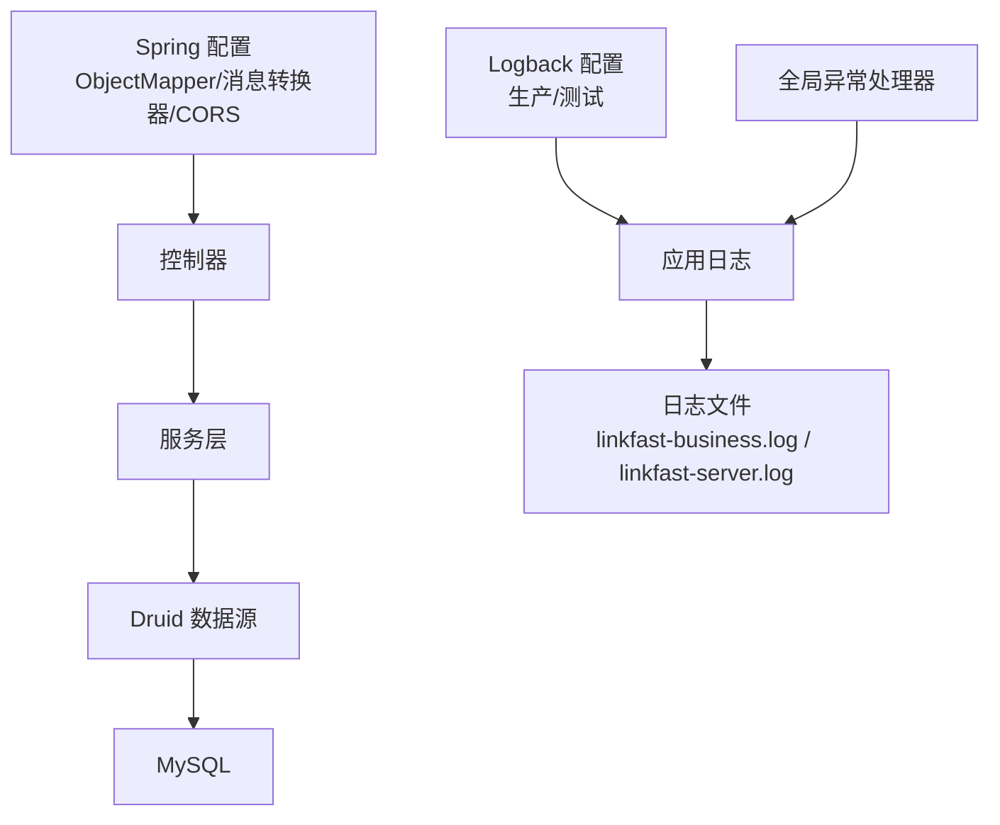
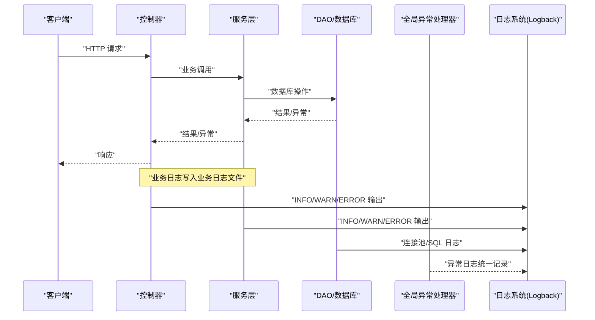
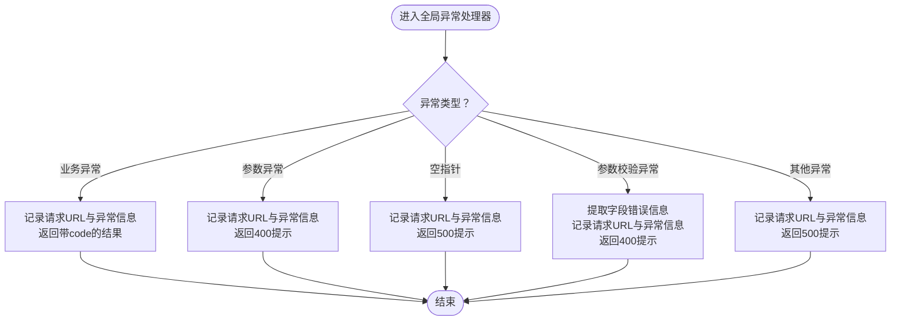
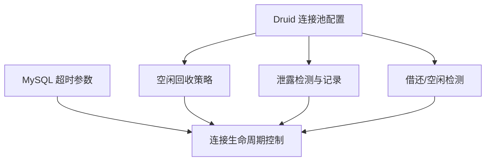
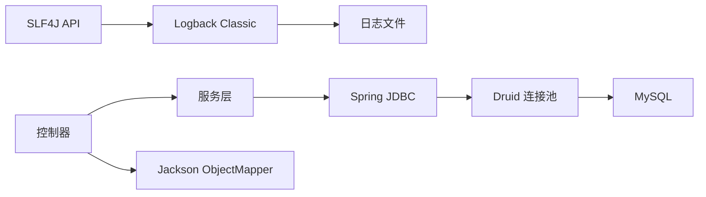

# 监控与日志

<cite>
**本文引用的文件**
- [logback.xml](file://src/main/resources/logback.xml)
- [logback-test.xml](file://src/test/resources/logback-test.xml)
- [GlobalExceptionHandler.java](file://src/main/java/cn/linkfast/exception/GlobalExceptionHandler.java)
- [BusinessException.java](file://src/main/java/cn/linkfast/exception/BusinessException.java)
- [NoRollbackBusinessException.java](file://src/main/java/cn/linkfast/exception/NoRollbackBusinessException.java)
- [applicationContext.xml](file://src/main/resources/applicationContext.xml)
- [jdbc.properties](file://src/main/resources/jdbc.properties)
- [my.cnf](file://docs/database/my.cnf)
- [AppConfig.java](file://src/main/java/cn/linkfast/config/AppConfig.java)
- [WebMvcConfig.java](file://src/main/java/cn/linkfast/config/WebMvcConfig.java)
- [ProxyCallbackController.java](file://src/main/java/cn/linkfast/controller/ProxyCallbackController.java)
- [AccountServiceImpl.java](file://src/main/java/cn/linkfast/service/impl/AccountServiceImpl.java)
- [ProxyInstanceServiceImpl.java](file://src/main/java/cn/linkfast/service/impl/ProxyInstanceServiceImpl.java)
- [pom.xml](file://pom.xml)
</cite>

## 目录
1. [简介](#简介)
2. [项目结构](#项目结构)
3. [核心组件](#核心组件)
4. [架构总览](#架构总览)
5. [详细组件分析](#详细组件分析)
6. [依赖关系分析](#依赖关系分析)
7. [性能考量](#性能考量)
8. [故障排查指南](#故障排查指南)
9. [结论](#结论)
10. [附录](#附录)

## 简介
本文件面向运维团队，系统化梳理 Link-Fast 项目的监控与日志管理方案。内容覆盖：
- 监控指标定义与采集：业务指标、系统指标、性能指标
- 日志配置与级别：Logback 配置文件结构、自定义格式、环境差异
- 日志轮转策略、日志存储与日志分析建议
- 告警规则、阈值与通知机制建议
- 性能监控最佳实践、故障诊断方法与运维仪表板配置思路

## 项目结构
围绕监控与日志的关键位置如下：
- 日志配置：生产与测试环境的 Logback 配置文件
- 异常处理：全局异常处理器，统一错误日志与响应
- 数据库连接池：Druid 连接池配置与 MySQL 超时参数
- Spring 配置：ObjectMapper 注入、消息转换器、跨域配置
- 控制器与服务：业务入口与日志埋点示例

图表来源
- [logback.xml:1-48](file://src/main/resources/logback.xml#L1-L48)
- [logback-test.xml:1-48](file://src/test/resources/logback-test.xml#L1-L48)
- [GlobalExceptionHandler.java:1-90](file://src/main/java/cn/linkfast/exception/GlobalExceptionHandler.java#L1-L90)
- [applicationContext.xml:1-67](file://src/main/resources/applicationContext.xml#L1-L67)
- [WebMvcConfig.java:1-62](file://src/main/java/cn/linkfast/config/WebMvcConfig.java#L1-L62)

章节来源
- [logback.xml:1-48](file://src/main/resources/logback.xml#L1-L48)
- [logback-test.xml:1-48](file://src/test/resources/logback-test.xml#L1-L48)
- [GlobalExceptionHandler.java:1-90](file://src/main/java/cn/linkfast/exception/GlobalExceptionHandler.java#L1-L90)
- [applicationContext.xml:1-67](file://src/main/resources/applicationContext.xml#L1-L67)
- [WebMvcConfig.java:1-62](file://src/main/java/cn/linkfast/config/WebMvcConfig.java#L1-L62)

## 核心组件
- 生产日志配置：按包拆分业务日志与服务器/框架日志，控制台输出统一格式
- 测试日志配置：使用临时目录，保留与生产相同的拆分策略
- 全局异常处理：集中记录异常上下文并返回统一响应
- 数据库连接池：Druid 连接池关键参数（空闲回收、泄露检测、验证策略）
- Spring 配置：ObjectMapper 注入与消息转换器，确保日期格式一致性

章节来源
- [logback.xml:1-48](file://src/main/resources/logback.xml#L1-L48)
- [logback-test.xml:1-48](file://src/test/resources/logback-test.xml#L1-L48)
- [GlobalExceptionHandler.java:1-90](file://src/main/java/cn/linkfast/exception/GlobalExceptionHandler.java#L1-L90)
- [applicationContext.xml:1-67](file://src/main/resources/applicationContext.xml#L1-L67)
- [AppConfig.java:1-36](file://src/main/java/cn/linkfast/config/AppConfig.java#L1-L36)

## 架构总览
下图展示日志与异常处理在系统中的位置与交互。

图表来源
- [ProxyCallbackController.java:1-30](file://src/main/java/cn/linkfast/controller/ProxyCallbackController.java#L1-L30)
- [AccountServiceImpl.java:1-42](file://src/main/java/cn/linkfast/service/impl/AccountServiceImpl.java#L1-L42)
- [ProxyInstanceServiceImpl.java:1-46](file://src/main/java/cn/linkfast/service/impl/ProxyInstanceServiceImpl.java#L1-L46)
- [GlobalExceptionHandler.java:1-90](file://src/main/java/cn/linkfast/exception/GlobalExceptionHandler.java#L1-L90)
- [logback.xml:1-48](file://src/main/resources/logback.xml#L1-L48)

## 详细组件分析

### 日志配置与级别
- 生产环境
  - 业务日志：仅输出到业务日志文件与控制台，级别 INFO
  - 服务器/框架日志：输出到服务器日志文件与控制台，级别 INFO
  - 日志路径：通过系统属性 -DLOG_PATH 指定，默认 ./logs
  - 轮转策略：按日滚动，保留历史天数见配置
- 测试环境
  - 使用系统临时目录，保留相同拆分策略，历史天数更短
- 控制台输出：统一时间、线程、级别、Logger 名称与消息

章节来源
- [logback.xml:1-48](file://src/main/resources/logback.xml#L1-L48)
- [logback-test.xml:1-48](file://src/test/resources/logback-test.xml#L1-L48)

### 异常处理与日志
- 全局异常处理器集中捕获业务异常、参数异常、空指针、参数校验异常与通用异常，并记录请求 URL 与异常信息
- 业务异常携带自定义 code，统一返回 Result 结构
- 参数校验异常分别处理 JSON 与表单/GET 场景，统一错误信息格式

图表来源
- [GlobalExceptionHandler.java:1-90](file://src/main/java/cn/linkfast/exception/GlobalExceptionHandler.java#L1-L90)

章节来源
- [GlobalExceptionHandler.java:1-90](file://src/main/java/cn/linkfast/exception/GlobalExceptionHandler.java#L1-L90)
- [BusinessException.java:1-36](file://src/main/java/cn/linkfast/exception/BusinessException.java#L1-L36)
- [NoRollbackBusinessException.java:1-26](file://src/main/java/cn/linkfast/exception/NoRollbackBusinessException.java#L1-L26)

### 数据库连接池与日志
- Druid 连接池关键参数
  - 初始大小、最小空闲、最大活跃、最大等待
  - 空闲连接回收周期与最小空闲时间
  - 泄露连接移除与记录
  - 借还检测与空闲检测策略
- MySQL 超时参数
  - wait_timeout、interactive_timeout、connect_timeout、net_read_timeout、net_write_timeout
  - max_connections、max_user_connections

图表来源
- [applicationContext.xml:1-67](file://src/main/resources/applicationContext.xml#L1-L67)
- [jdbc.properties:1-39](file://src/main/resources/jdbc.properties#L1-L39)
- [my.cnf:27-48](file://docs/database/my.cnf#L27-L48)

章节来源
- [applicationContext.xml:1-67](file://src/main/resources/applicationContext.xml#L1-L67)
- [jdbc.properties:1-39](file://src/main/resources/jdbc.properties#L1-L39)
- [my.cnf:27-48](file://docs/database/my.cnf#L27-L48)

### Spring 配置与日志
- ObjectMapper 注入至根容器，确保服务层与测试环境可直接使用
- 消息转换器配置：统一 Jackson 日期格式
- CORS 全局配置：允许跨域访问 /api/** 路径

章节来源
- [AppConfig.java:1-36](file://src/main/java/cn/linkfast/config/AppConfig.java#L1-L36)
- [WebMvcConfig.java:1-62](file://src/main/java/cn/linkfast/config/WebMvcConfig.java#L1-L62)

### 控制器与服务层日志
- 控制器层：统一入口处理第三方回调等业务
- 服务层：初始化与外部接口调用，结合日志定位问题

章节来源
- [ProxyCallbackController.java:1-30](file://src/main/java/cn/linkfast/controller/ProxyCallbackController.java#L1-L30)
- [AccountServiceImpl.java:1-42](file://src/main/java/cn/linkfast/service/impl/AccountServiceImpl.java#L1-L42)
- [ProxyInstanceServiceImpl.java:1-46](file://src/main/java/cn/linkfast/service/impl/ProxyInstanceServiceImpl.java#L1-L46)

## 依赖关系分析
- 日志系统依赖于 Logback 与 SLF4J
- 异常处理依赖于 Spring MVC 的 @ControllerAdvice
- 数据库访问依赖于 Spring JDBC 与 Druid 连接池
- JSON 序列化依赖于 Jackson

图表来源
- [pom.xml:119-131](file://pom.xml#L119-L131)
- [GlobalExceptionHandler.java:1-90](file://src/main/java/cn/linkfast/exception/GlobalExceptionHandler.java#L1-L90)
- [applicationContext.xml:1-67](file://src/main/resources/applicationContext.xml#L1-L67)

章节来源
- [pom.xml:119-131](file://pom.xml#L119-L131)

## 性能考量
- 日志级别与输出目标
  - 生产环境业务日志与服务器日志分离，避免互相干扰
  - 控制台输出统一格式，便于集中采集
- 连接池与数据库超时
  - Druid 空闲回收周期与 MySQL wait_timeout 协调，避免连接失效
  - 合理设置最大连接数与单用户连接数，避免连接池争用
- JSON 序列化
  - ObjectMapper 在根容器注入，减少重复创建，提升序列化性能

章节来源
- [logback.xml:1-48](file://src/main/resources/logback.xml#L1-L48)
- [applicationContext.xml:1-67](file://src/main/resources/applicationContext.xml#L1-L67)
- [AppConfig.java:1-36](file://src/main/java/cn/linkfast/config/AppConfig.java#L1-L36)

## 故障排查指南
- 常见问题定位步骤
  - 查看业务日志：确认控制器与服务层关键流程是否执行
  - 查看服务器日志：定位框架/容器异常
  - 检查全局异常处理器日志：快速定位业务异常与参数校验异常
  - 核对数据库连接池状态：是否存在连接泄露或长时间等待
- 关键日志位置
  - 生产业务日志：linkfast-business.log
  - 服务器日志：linkfast-server.log
  - 控制台输出：统一格式，便于 grep/正则匹配
- 数据库侧排查
  - 检查 MySQL 超时参数与连接数上限
  - 关注 Druid 泄露连接记录，定位未归还连接的代码路径

章节来源
- [logback.xml:1-48](file://src/main/resources/logback.xml#L1-L48)
- [logback-test.xml:1-48](file://src/test/resources/logback-test.xml#L1-L48)
- [GlobalExceptionHandler.java:1-90](file://src/main/java/cn/linkfast/exception/GlobalExceptionHandler.java#L1-L90)
- [applicationContext.xml:1-67](file://src/main/resources/applicationContext.xml#L1-L67)
- [my.cnf:27-48](file://docs/database/my.cnf#L27-L48)

## 结论
本方案通过清晰的日志分层、统一的异常处理与完善的数据库连接池配置，为 Link-Fast 提供了可落地的监控与日志管理基础。建议在此基础上补充：
- 基于日志的业务指标采集（如请求量、错误率、响应时间）
- 基于系统与应用指标的告警阈值与通知机制
- 运维仪表板（如 Grafana）与日志分析平台（如 ELK）对接方案

## 附录

### 监控指标定义与采集建议
- 业务指标
  - 接口请求量、成功率、错误率、平均/分位响应时间
  - 订单创建/续费/释放等关键业务事件计数
- 系统指标
  - CPU、内存、磁盘、网络
  - JVM 堆栈、GC 次数与耗时
- 性能指标
  - 数据库连接池活跃数、等待数、泄露数
  - SQL 执行耗时分布、慢查询统计

采集方式建议
- 应用内埋点：在控制器与服务层关键节点输出结构化日志
- 指标导出：结合 Micrometer 或自定义指标端点
- 系统指标：Prometheus Exporter + Prometheus + Grafana

### 日志轮转策略与存储
- 轮转策略
  - 按日滚动，保留一定历史天数
  - 控制单文件大小（可在 Logback 中扩展 RollingPolicy）
- 存储
  - 生产环境建议独立挂载日志卷，设置磁盘配额与清理策略
  - 日志采集：rsyslog/Filebeat -> 日志平台

### 日志分析工具使用建议
- 结构化解析：基于统一格式解析时间、线程、级别、Logger、消息
- 关键词检索：业务异常、参数校验失败、连接泄露
- 报表与告警：基于日志平台构建趋势图与告警规则

### 告警规则、阈值与通知机制
- 告警规则示例
  - 业务错误率 > 1%（5 分钟窗口）
  - 接口 P95 响应时间 > 5 秒
  - 数据库连接池等待数 > 阈值
  - 连接泄露次数 > 0
- 通知机制
  - 邮件/短信/企业微信机器人/钉钉机器人
  - 分级告警：P1（业务中断）、P2（性能退化）、P3（一般异常）

### 运维仪表板配置思路
- 指标面板
  - QPS/错误率/响应时间
  - 连接池使用率/等待队列长度
  - GC 与堆内存使用
- 日志面板
  - 业务异常趋势、参数校验失败分布
  - 连接泄露与慢查询 TopN