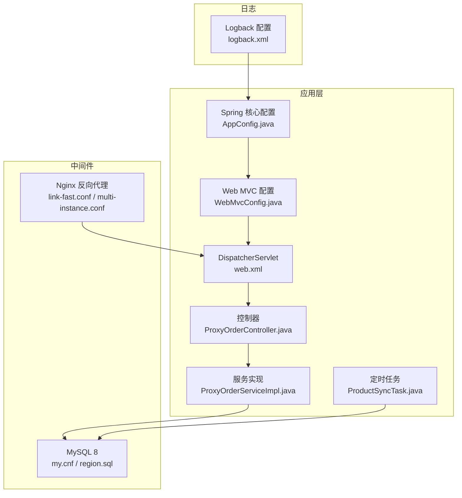
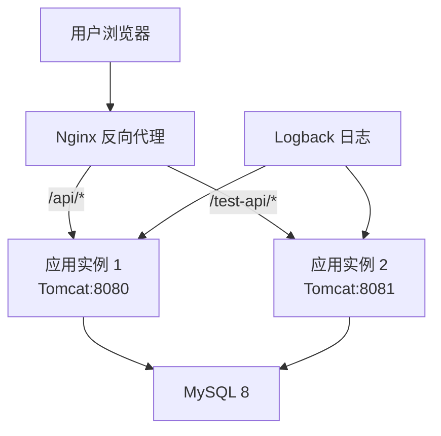
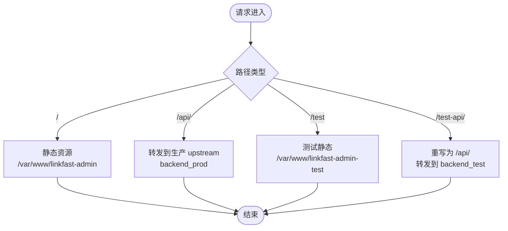
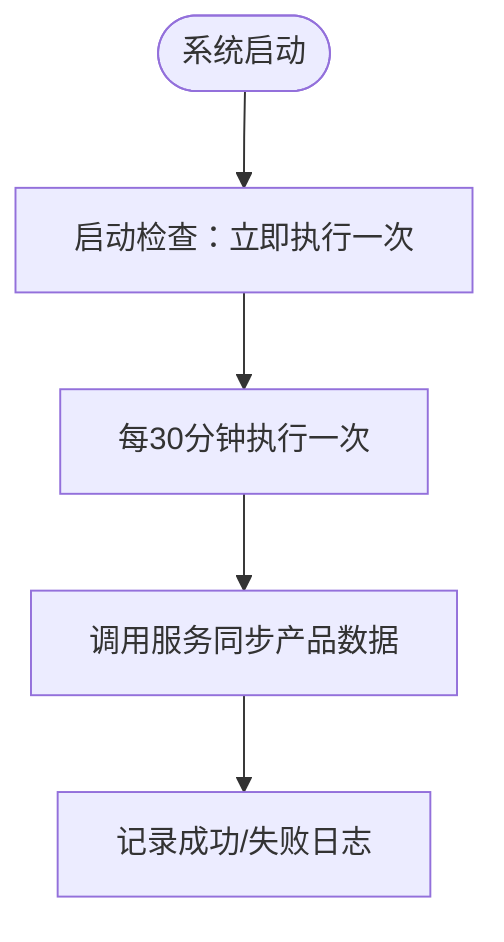
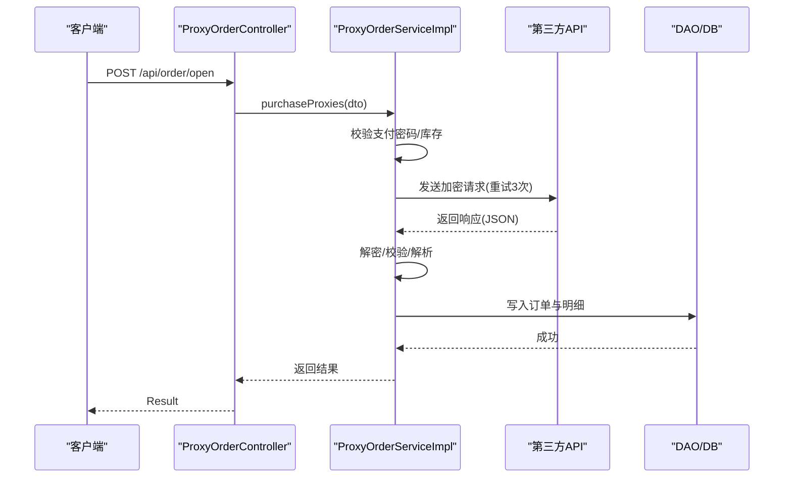
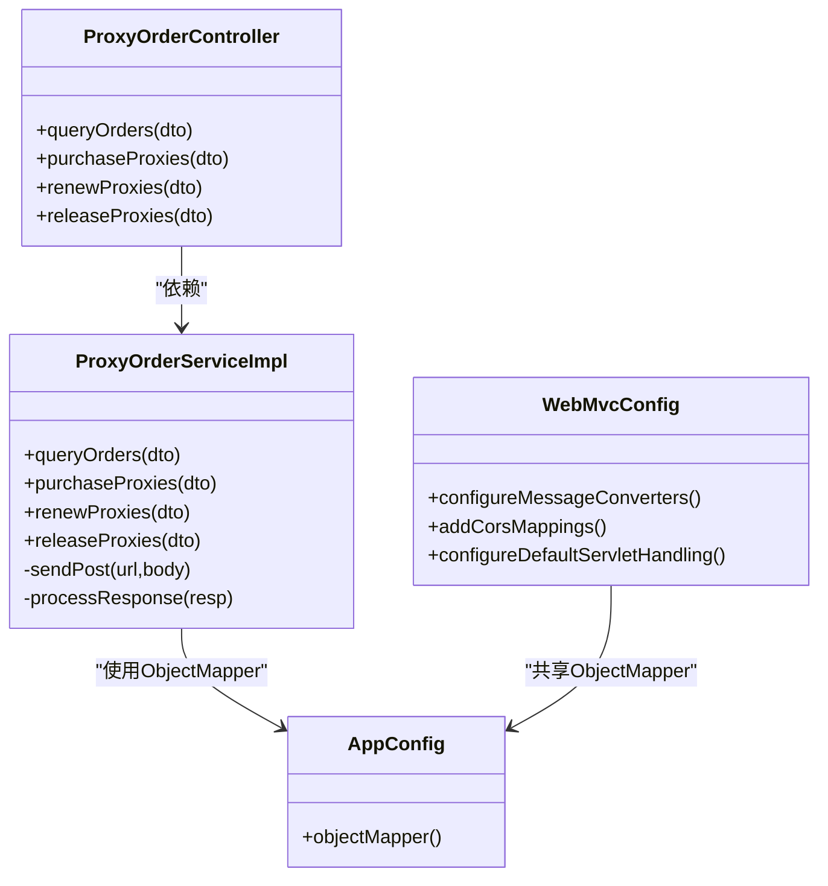

# 部署与运维

<cite>
**本文引用的文件**
- [README.md](file://README.md)
- [pom.xml](file://pom.xml)
- [logback.xml](file://src/main/resources/logback.xml)
- [jdbc.properties](file://src/main/resources/jdbc.properties)
- [link-fast.conf](file://docs/nginx/link-fast.conf)
- [link-fast-multi-instance.conf](file://docs/nginx/link-fast-multi-instance.conf)
- [linkfast-admin.conf](file://docs/nginx/linkfast-admin.conf)
- [AppConfig.java](file://src/main/java/cn/linkfast/config/AppConfig.java)
- [WebMvcConfig.java](file://src/main/java/cn/linkfast/config/WebMvcConfig.java)
- [web.xml](file://src/main/webapp/WEB-INF/web.xml)
- [ProxyOrderController.java](file://src/main/java/cn/linkfast/controller/ProxyOrderController.java)
- [ProxyOrderServiceImpl.java](file://src/main/java/cn/linkfast/service/impl/ProxyOrderServiceImpl.java)
- [ProductSyncTask.java](file://src/main/java/cn/linkfast/task/ProductSyncTask.java)
- [my.cnf](file://docs/database/my.cnf)
- [region.sql](file://docs/database/region.sql)
</cite>

## 目录
1. [简介](#简介)
2. [项目结构](#项目结构)
3. [核心组件](#核心组件)
4. [架构总览](#架构总览)
5. [详细组件分析](#详细组件分析)
6. [依赖关系分析](#依赖关系分析)
7. [性能考量](#性能考量)
8. [故障排除指南](#故障排除指南)
9. [结论](#结论)
10. [附录](#附录)

## 简介
本文件面向运维工程师，提供 Link-Fast 项目的完整部署与运维手册。内容覆盖生产环境部署流程（服务器环境准备、应用打包、Nginx 反向代理与负载均衡）、多实例部署配置（集群、会话与数据同步）、监控与日志最佳实践、运维脚本与自动化部署思路、CI/CD 流水线建议、故障排除、性能调优与容量规划、安全加固、备份恢复与应急响应。

## 项目结构
- 应用为基于 Spring 6 + Spring MVC 的传统 WAR 工程，使用 Jakarta Servlet 6.0、JDBC、Druid 连接池、MySQL 8、Logback 日志。
- Nginx 提供反向代理与静态资源服务，支持单实例与多实例（生产/测试）分流。
- 定时任务负责产品数据同步，保障库存与价格信息及时性。
- 数据库配置与表结构位于 docs/database，包含 MySQL 参数与地域表结构。

**图表来源**
- [AppConfig.java:14-36](file://src/main/java/cn/linkfast/config/AppConfig.java#L14-L36)
- [WebMvcConfig.java:19-62](file://src/main/java/cn/linkfast/config/WebMvcConfig.java#L19-L62)
- [web.xml:10-40](file://src/main/webapp/WEB-INF/web.xml#L10-L40)
- [ProxyOrderController.java:23-86](file://src/main/java/cn/linkfast/controller/ProxyOrderController.java#L23-L86)
- [ProxyOrderServiceImpl.java:34-87](file://src/main/java/cn/linkfast/service/impl/ProxyOrderServiceImpl.java#L34-L87)
- [ProductSyncTask.java:20-62](file://src/main/java/cn/linkfast/task/ProductSyncTask.java#L20-L62)
- [link-fast.conf:1-67](file://docs/nginx/link-fast.conf#L1-L67)
- [link-fast-multi-instance.conf:1-71](file://docs/nginx/link-fast-multi-instance.conf#L1-L71)
- [my.cnf:32-68](file://docs/database/my.cnf#L32-L68)
- [region.sql:1-20](file://docs/database/region.sql#L1-L20)
- [logback.xml:1-49](file://src/main/resources/logback.xml#L1-L49)

**章节来源**
- [pom.xml:1-278](file://pom.xml#L1-L278)
- [web.xml:1-73](file://src/main/webapp/WEB-INF/web.xml#L1-L73)
- [link-fast.conf:1-67](file://docs/nginx/link-fast.conf#L1-L67)
- [link-fast-multi-instance.conf:1-71](file://docs/nginx/link-fast-multi-instance.conf#L1-L71)
- [my.cnf:1-68](file://docs/database/my.cnf#L1-L68)
- [region.sql:1-20](file://docs/database/region.sql#L1-L20)
- [logback.xml:1-49](file://src/main/resources/logback.xml#L1-L49)

## 核心组件
- 应用配置
  - Spring 核心配置类负责业务与持久层组件扫描及全局 ObjectMapper 注入。
  - Web MVC 配置启用注解驱动、跨域、默认 Servlet 处理与 Jackson 消息转换器。
  - web.xml 声明 AnnotationConfig 上下文、DispatcherServlet、字符集过滤与会话配置。
- 控制器与服务
  - 订单相关控制器提供分页查询、开通、续费、释放代理等接口。
  - 订单服务实现对接第三方 API，封装加密打包、重试、幂等与异常分类处理。
- 定时任务
  - 产品同步任务按固定周期从第三方拉取代理产品清单，启动后进行一次性初始化同步。
- 数据库与日志
  - JDBC 连接参数与 MySQL 8 参数优化（超时、连接数、缓冲池、批处理）。
  - Logback 分业务日志与服务器日志两类，支持滚动与控制台输出。

**章节来源**
- [AppConfig.java:14-36](file://src/main/java/cn/linkfast/config/AppConfig.java#L14-L36)
- [WebMvcConfig.java:19-62](file://src/main/java/cn/linkfast/config/WebMvcConfig.java#L19-L62)
- [web.xml:10-66](file://src/main/webapp/WEB-INF/web.xml#L10-L66)
- [ProxyOrderController.java:23-86](file://src/main/java/cn/linkfast/controller/ProxyOrderController.java#L23-L86)
- [ProxyOrderServiceImpl.java:34-87](file://src/main/java/cn/linkfast/service/impl/ProxyOrderServiceImpl.java#L34-L87)
- [ProductSyncTask.java:20-96](file://src/main/java/cn/linkfast/task/ProductSyncTask.java#L20-L96)
- [jdbc.properties:1-39](file://src/main/resources/jdbc.properties#L1-L39)
- [my.cnf:32-68](file://docs/database/my.cnf#L32-L68)
- [logback.xml:6-47](file://src/main/resources/logback.xml#L6-L47)

## 架构总览
- 前端静态资源由 Nginx 提供，后端 API 通过反向代理转发至应用容器。
- 单实例模式：单一后端端口（如 8080）。
- 多实例模式：生产/测试分别监听不同端口并通过 upstream 转发，支持 /test 路径分流与静态资源区分。
- 应用层使用 Spring MVC + JDBC + Druid 连接池，日志分离输出。

**图表来源**
- [link-fast-multi-instance.conf:1-71](file://docs/nginx/link-fast-multi-instance.conf#L1-L71)
- [link-fast.conf:1-67](file://docs/nginx/link-fast.conf#L1-L67)
- [web.xml:23-40](file://src/main/webapp/WEB-INF/web.xml#L23-L40)
- [logback.xml:6-47](file://src/main/resources/logback.xml#L6-L47)

## 详细组件分析

### Nginx 反向代理与负载均衡
- 单实例配置要点
  - 监听 80，访问/错误日志路径，静态资源优先于 /api/ 路由，回调接口精确匹配并设置头部。
  - 支持 Gzip 压缩与安全加固（禁止敏感路径）。
- 多实例配置要点
  - upstream 分别指向生产/测试端口，/test 路径映射到测试静态目录，/test-api/ 重写为 /api/ 再转发。
  - 静态资源根据路径动态选择根目录，开启缓存与 Gzip。
- 负载均衡建议
  - 当前配置为本地回环直连，生产环境建议结合 Keepalived/LVS/Haproxy 或云负载均衡实现高可用与健康检查。

**图表来源**
- [link-fast-multi-instance.conf:16-48](file://docs/nginx/link-fast-multi-instance.conf#L16-L48)
- [link-fast.conf:9-50](file://docs/nginx/link-fast.conf#L9-L50)

**章节来源**
- [link-fast.conf:1-67](file://docs/nginx/link-fast.conf#L1-L67)
- [link-fast-multi-instance.conf:1-71](file://docs/nginx/link-fast-multi-instance.conf#L1-L71)
- [linkfast-admin.conf:1-37](file://docs/nginx/linkfast-admin.conf#L1-L37)

### 应用打包与部署
- 构建产物
  - Maven 打包生成 WAR，JDK 版本 17，Spring 6，Servlet 6.0。
- 部署步骤（建议）
  - 准备服务器：安装 JDK 17、Tomcat（兼容 Servlet 6.0）、MySQL 8、Nginx。
  - 配置数据库：导入地域表结构，调整 my.cnf 参数以适配生产负载。
  - 部署应用：将 WAR 部署至 Tomcat，配置 JVM 启动参数（堆大小、GC、日志路径）。
  - 配置 Nginx：加载单实例或多实例配置，重启生效。
  - 启动顺序：先数据库，再应用，最后 Nginx。
- 多实例部署
  - 启动两个 Tomcat 实例（如 8080/8081），分别指向生产/测试配置，Nginx upstream 指向对应端口。

**章节来源**
- [pom.xml:12-20](file://pom.xml#L12-L20)
- [pom.xml:223-276](file://pom.xml#L223-L276)
- [web.xml:23-40](file://src/main/webapp/WEB-INF/web.xml#L23-L40)
- [my.cnf:32-68](file://docs/database/my.cnf#L32-L68)
- [link-fast-multi-instance.conf:1-71](file://docs/nginx/link-fast-multi-instance.conf#L1-L71)

### 会话管理与跨域
- 会话配置
  - web.xml 中设置会话超时与 HttpOnly Cookie，Secure 默认关闭（建议生产启用 HTTPS 时开启 secure）。
- 跨域配置
  - WebMvcConfig 对 /api/** 开启跨域，允许方法与头，支持凭据与缓存。

**章节来源**
- [web.xml:60-66](file://src/main/webapp/WEB-INF/web.xml#L60-L66)
- [WebMvcConfig.java:44-52](file://src/main/java/cn/linkfast/config/WebMvcConfig.java#L44-L52)

### 数据库与连接池
- JDBC 连接参数
  - 启用 rewriteBatchedStatements、allowMultiQueries、cachePrepStmts、autoReconnect 等，设置 socket/connect 超时与 SSL。
- MySQL 优化
  - wait/interactive/connect/net_read/write 超时合理配置，max_connections、buffer_pool_size、flush 策略与批处理参数优化。
- 表结构
  - 地域表支持四级树形结构，包含唯一编码、全路径编码与多索引，满足查询与排序需求。

**章节来源**
- [jdbc.properties:3-17](file://src/main/resources/jdbc.properties#L3-L17)
- [my.cnf:32-68](file://docs/database/my.cnf#L32-L68)
- [region.sql:1-20](file://docs/database/region.sql#L1-L20)

### 日志与监控
- 日志分离
  - 业务日志（cn.linkfast 包）与服务器日志（其他）分别输出到独立文件，支持按日滚动与控制台输出。
  - 日志路径可通过启动参数 -DLOG_PATH 指定。
- 监控建议
  - 应用指标：JVM GC、堆内存、线程数、连接池活跃/空闲、慢查询。
  - 业务指标：接口 QPS/耗时/P95/P99、第三方 API 调用成功率/耗时、定时任务执行时长与失败次数。
  - 告警阈值：接口 P95 超过阈值、第三方失败率上升、连接池耗尽、慢查询占比过高。

**章节来源**
- [logback.xml:6-47](file://src/main/resources/logback.xml#L6-L47)

### 定时任务与数据同步
- 产品同步任务
  - 每 30 分钟同步一次，启动后 5 秒执行初始化同步；支持开关控制。
  - 任务参数包含代理类型集合，可扩展为按国家/供应商筛选。

**图表来源**
- [ProductSyncTask.java:68-95](file://src/main/java/cn/linkfast/task/ProductSyncTask.java#L68-L95)
- [ProductSyncTask.java:34-62](file://src/main/java/cn/linkfast/task/ProductSyncTask.java#L34-L62)

**章节来源**
- [ProductSyncTask.java:20-96](file://src/main/java/cn/linkfast/task/ProductSyncTask.java#L20-L96)

### 第三方接口调用与幂等
- 调用流程
  - 控制器接收请求，服务层校验支付密码、构造业务参数、加密打包、调用第三方 API。
  - 对连接失败、响应读取失败、响应非 200、解密失败等场景进行分类处理，区分可回滚与不可回滚。
  - 成功后回写订单信息，返回结果。

**图表来源**
- [ProxyOrderController.java:44-47](file://src/main/java/cn/linkfast/controller/ProxyOrderController.java#L44-L47)
- [ProxyOrderServiceImpl.java:196-237](file://src/main/java/cn/linkfast/service/impl/ProxyOrderServiceImpl.java#L196-L237)
- [ProxyOrderServiceImpl.java:338-458](file://src/main/java/cn/linkfast/service/impl/ProxyOrderServiceImpl.java#L338-L458)

**章节来源**
- [ProxyOrderController.java:23-86](file://src/main/java/cn/linkfast/controller/ProxyOrderController.java#L23-L86)
- [ProxyOrderServiceImpl.java:196-458](file://src/main/java/cn/linkfast/service/impl/ProxyOrderServiceImpl.java#L196-L458)

## 依赖关系分析
- 组件耦合
  - 控制器依赖服务接口，服务实现依赖 DAO、第三方工具与支付服务。
  - WebMvcConfig 依赖 AppConfig 中的 ObjectMapper，确保全局 JSON 序列化一致性。
- 外部依赖
  - Spring 6、Servlet 6.0、Jackson、MySQL Connector/J、Druid、Logback、JUnit/Mockito（测试）。

**图表来源**
- [ProxyOrderController.java:23-86](file://src/main/java/cn/linkfast/controller/ProxyOrderController.java#L23-L86)
- [ProxyOrderServiceImpl.java:34-87](file://src/main/java/cn/linkfast/service/impl/ProxyOrderServiceImpl.java#L34-L87)
- [WebMvcConfig.java:24-40](file://src/main/java/cn/linkfast/config/WebMvcConfig.java#L24-L40)
- [AppConfig.java:25-36](file://src/main/java/cn/linkfast/config/AppConfig.java#L25-L36)

**章节来源**
- [pom.xml:22-213](file://pom.xml#L22-L213)
- [WebMvcConfig.java:19-62](file://src/main/java/cn/linkfast/config/WebMvcConfig.java#L19-L62)
- [AppConfig.java:14-36](file://src/main/java/cn/linkfast/config/AppConfig.java#L14-L36)

## 性能考量
- 数据库
  - 合理设置 max_connections、buffer_pool_size、flush 策略与批处理参数；关闭严格 SQL_MODE 以提升批量写入稳定性。
  - 优化连接超时参数，避免 JDBC 空闲断开导致的连接池抖动。
- 应用
  - 启用 Druid 连接池监控，关注活跃/空闲连接数与获取等待时间。
  - 合理设置 JVM 堆大小与 GC 策略，降低 Full GC 频率。
- 网络与缓存
  - Nginx 启用 Gzip 与静态资源缓存，减少带宽与服务器压力。
- 定时任务
  - 控制同步频率与并发，避免对第三方接口与数据库造成瞬时压力。

**章节来源**
- [my.cnf:32-68](file://docs/database/my.cnf#L32-L68)
- [jdbc.properties:3-17](file://src/main/resources/jdbc.properties#L3-L17)
- [link-fast.conf:63-67](file://docs/nginx/link-fast.conf#L63-L67)
- [link-fast-multi-instance.conf:50-71](file://docs/nginx/link-fast-multi-instance.conf#L50-L71)
- [ProductSyncTask.java:34-62](file://src/main/java/cn/linkfast/task/ProductSyncTask.java#L34-L62)

## 故障排除指南
- 应用无法启动
  - 检查 JDK 版本与 Servlet 容器版本兼容性；确认 web.xml 中上下文参数与 DispatcherServlet 配置正确。
- 接口 500/超时
  - 查看应用日志与 Nginx 错误日志；检查第三方 API 可用性与网络连通性；核对重试策略与超时参数。
- 数据库连接问题
  - 检查 wait/interactive/connect/net_* 超时与 max_connections；确认连接池配置与应用侧连接泄漏。
- 跨域失败
  - 核对 WebMvcConfig 的 CORS 配置与 Nginx 是否额外拦截预检请求。
- 定时任务未执行
  - 检查任务开关与调度表达式；确认应用上下文已启用定时任务。

**章节来源**
- [web.xml:10-40](file://src/main/webapp/WEB-INF/web.xml#L10-L40)
- [WebMvcConfig.java:44-52](file://src/main/java/cn/linkfast/config/WebMvcConfig.java#L44-L52)
- [my.cnf:32-48](file://docs/database/my.cnf#L32-L48)
- [link-fast.conf:46-50](file://docs/nginx/link-fast.conf#L46-L50)
- [ProductSyncTask.java:34-62](file://src/main/java/cn/linkfast/task/ProductSyncTask.java#L34-L62)

## 结论
本手册提供了 Link-Fast 项目的部署与运维全景视图，涵盖环境准备、应用打包、Nginx 反代与多实例配置、会话与跨域、数据库与日志、定时任务与第三方接口调用、性能与故障排查。建议在生产环境中结合云负载均衡、完善的监控告警体系与自动化流水线，持续迭代优化。

## 附录

### 多实例部署配置清单
- Nginx
  - 生产与测试分别监听不同端口并通过 upstream 转发。
  - /test 路径与静态资源目录分离，/test-api/ 重写为 /api/。
- 应用
  - 启动两个 Tomcat 实例（如 8080/8081），分别指向生产/测试配置。
- 数据库
  - 保持同一实例，注意连接池与超时参数以支撑多实例并发。

**章节来源**
- [link-fast-multi-instance.conf:1-71](file://docs/nginx/link-fast-multi-instance.conf#L1-L71)

### 安全加固与合规
- Nginx
  - 禁止敏感路径访问，启用 Gzip 与静态缓存。
- 应用
  - 启用 HttpOnly Cookie；生产环境建议开启 Secure Cookie 并强制 HTTPS。
  - 严格校验第三方 API 响应，防止注入与越权。

**章节来源**
- [link-fast.conf:58-67](file://docs/nginx/link-fast.conf#L58-L67)
- [linkfast-admin.conf:33-37](file://docs/nginx/linkfast-admin.conf#L33-L37)
- [web.xml:60-66](file://src/main/webapp/WEB-INF/web.xml#L60-L66)

### 备份恢复与应急响应
- 数据库
  - 定期全量备份与增量备份，验证恢复流程；监控 binlog 与 GTID。
- 应用
  - 备份应用配置、日志目录与 WAR 包；制定回滚策略。
- 应急流程
  - 快速定位问题（日志/指标/链路追踪），隔离故障实例，回滚变更，修复后验证。

[本节为通用运维建议，无需特定文件引用]