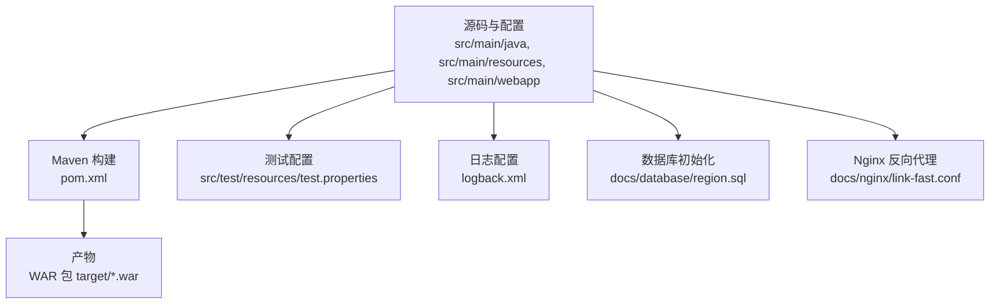
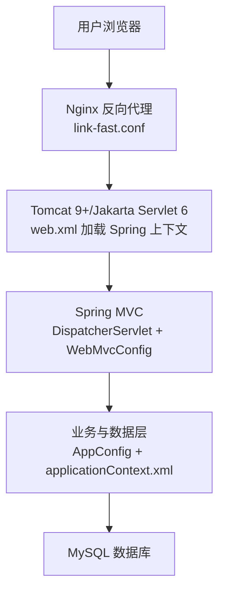
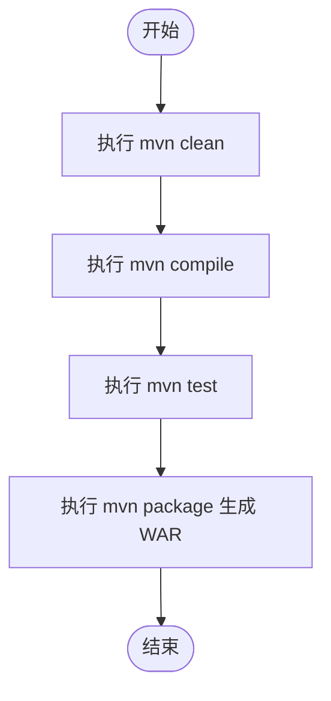
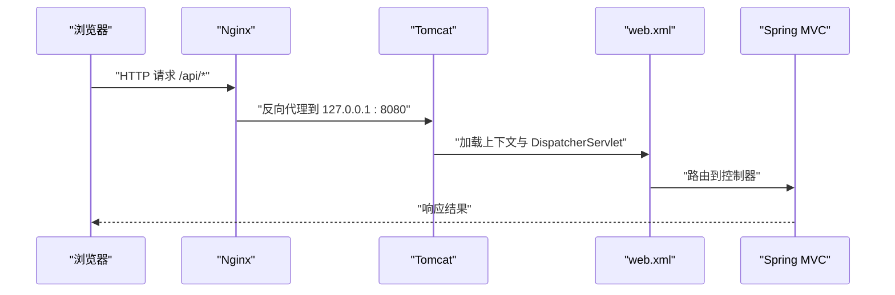
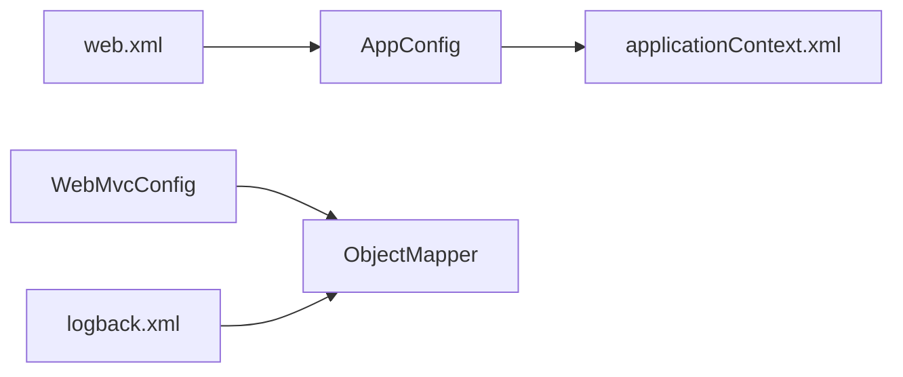

# 部署流程

<cite>
**本文引用的文件**
- [pom.xml](file://pom.xml)
- [web.xml](file://src/main/webapp/WEB-INF/web.xml)
- [applicationContext.xml](file://src/main/resources/applicationContext.xml)
- [jdbc.properties](file://src/main/resources/jdbc.properties)
- [api.properties](file://src/main/resources/api.properties)
- [AppConfig.java](file://src/main/java/cn/linkfast/config/AppConfig.java)
- [WebMvcConfig.java](file://src/main/java/cn/linkfast/config/WebMvcConfig.java)
- [logback.xml](file://src/main/resources/logback.xml)
- [region.sql](file://docs/database/region.sql)
- [link-fast.conf](file://docs/nginx/link-fast.conf)
- [test.properties](file://src/test/resources/test.properties)
</cite>

## 目录
1. [简介](#简介)
2. [项目结构](#项目结构)
3. [核心组件](#核心组件)
4. [架构总览](#架构总览)
5. [详细组件分析](#详细组件分析)
6. [依赖分析](#依赖分析)
7. [性能考虑](#性能考虑)
8. [故障排查指南](#故障排查指南)
9. [结论](#结论)
10. [附录](#附录)

## 简介
本文件面向运维人员，提供 Link-Fast 项目的标准化部署操作手册。内容覆盖生产环境准备（JDK 17、Maven）、构建与打包（WAR/JAR 两种方式）、数据库初始化、配置文件与环境变量设置、部署前检查清单、部署后验证方法以及常见问题排查。项目采用 Spring 6 + Jakarta Servlet 6 技术栈，支持传统 WAR 包部署至 Tomcat，亦可按需扩展为 Spring Boot 打包运行。

## 项目结构
- 语言与框架
  - Java 17（编译与运行）
  - Maven 项目，打包类型为 war
  - Spring 6 核心 + Spring MVC
  - Jakarta Servlet 6（Jakarta EE 9+ 规范）
- 关键配置
  - web.xml 声明基于注解的上下文与 DispatcherServlet
  - Spring XML 配置数据源、事务与 JdbcTemplate
  - logback.xml 支持通过系统属性控制日志路径
  - Nginx 配置示例，反向代理到本地 8080 端口
- 数据库
  - MySQL 8.x，使用 Druid 连接池
  - 提供地域表初始化 SQL

**图表来源**
- [pom.xml](file://pom.xml)
- [web.xml](file://src/main/webapp/WEB-INF/web.xml)
- [applicationContext.xml](file://src/main/resources/applicationContext.xml)
- [logback.xml](file://src/main/resources/logback.xml)
- [region.sql](file://docs/database/region.sql)
- [link-fast.conf](file://docs/nginx/link-fast.conf)

**章节来源**
- [pom.xml](file://pom.xml)
- [web.xml](file://src/main/webapp/WEB-INF/web.xml)

## 核心组件
- 应用入口与上下文
  - web.xml 声明 AnnotationConfigWebApplicationContext，并加载 AppConfig 与 WebMvcConfig
  - DispatcherServlet 映射为 “/”，统一处理 REST 请求
- 数据访问与事务
  - applicationContext.xml 通过占位符加载 jdbc.properties，装配 Druid 数据源、JdbcTemplate 与事务管理器
- 日志与运行参数
  - logback.xml 支持通过 -DLOG_PATH 设置日志目录；默认 ./logs
- 配置与环境
  - api.properties 提供 prod/sandbox 环境参数与第三方接口路径
  - test.properties 在测试环境关闭定时任务

**章节来源**
- [web.xml](file://src/main/webapp/WEB-INF/web.xml)
- [AppConfig.java](file://src/main/java/cn/linkfast/config/AppConfig.java)
- [WebMvcConfig.java](file://src/main/java/cn/linkfast/config/WebMvcConfig.java)
- [applicationContext.xml](file://src/main/resources/applicationContext.xml)
- [jdbc.properties](file://src/main/resources/jdbc.properties)
- [logback.xml](file://src/main/resources/logback.xml)
- [api.properties](file://src/main/resources/api.properties)
- [test.properties](file://src/test/resources/test.properties)

## 架构总览
下图展示从浏览器到后端服务的典型链路，以及后端与数据库的交互。

**图表来源**
- [link-fast.conf](file://docs/nginx/link-fast.conf)
- [web.xml](file://src/main/webapp/WEB-INF/web.xml)
- [AppConfig.java](file://src/main/java/cn/linkfast/config/AppConfig.java)
- [WebMvcConfig.java](file://src/main/java/cn/linkfast/config/WebMvcConfig.java)
- [applicationContext.xml](file://src/main/resources/applicationContext.xml)
- [jdbc.properties](file://src/main/resources/jdbc.properties)

## 详细组件分析

### 1) 生产环境准备
- JDK 17
  - 确认系统已安装 JDK 17 并配置 JAVA_HOME 与 PATH
  - Maven 编译目标版本为 17，需使用 JDK 17 运行
- Maven
  - 使用 Maven 3.6+，确保 settings.xml 镜像与网络可达
- 数据库
  - 准备 MySQL 8.x，创建数据库与账号
  - 初始化地域表：执行 region.sql
- Web 服务器
  - 安装并配置 Nginx，加载 link-fast.conf
  - 将 Nginx 作为反向代理，转发到本地 8080 端口

**章节来源**
- [pom.xml](file://pom.xml)
- [region.sql](file://docs/database/region.sql)
- [link-fast.conf](file://docs/nginx/link-fast.conf)

### 2) 构建与打包
- 构建命令
  - 清理并编译：mvn clean compile
  - 执行测试：mvn test
  - 打 WAR 包：mvn package
  - 打 JAR 包（可选）：见“附录”
- 产物位置
  - WAR 包位于 target 目录，文件名为类似 link-fast-1.0-SNAPSHOT.war
- 插件与配置要点
  - maven-compiler-plugin 指定 source/target 为 17
  - maven-war-plugin 默认忽略缺失的 web.xml（项目中已设置）
  - maven-failsafe-plugin 配置集成测试范围与开关

**图表来源**
- [pom.xml](file://pom.xml)

**章节来源**
- [pom.xml](file://pom.xml)

### 3) 部署方式一：Tomcat（WAR 包）
- 步骤
  - 将 WAR 包放入 Tomcat webapps 目录
  - 启动 Tomcat，确认日志无致命错误
  - 通过 Nginx 访问（反向代理到 127.0.0.1:8080）
- 关键配置
  - web.xml 已声明 AnnotationConfigWebApplicationContext 与 DispatcherServlet
  - logback.xml 通过 -DLOG_PATH 指定日志目录（例如 -DLOG_PATH=/opt/logs/link-fast）

**图表来源**
- [link-fast.conf](file://docs/nginx/link-fast.conf)
- [web.xml](file://src/main/webapp/WEB-INF/web.xml)

**章节来源**
- [web.xml](file://src/main/webapp/WEB-INF/web.xml)
- [logback.xml](file://src/main/resources/logback.xml)
- [link-fast.conf](file://docs/nginx/link-fast.conf)

### 4) 部署方式二：Spring Boot（JAR 包，可选）
- 适用场景
  - 将现有 WAR 项目改造为 Spring Boot 可执行 JAR，便于独立部署与容器化
- 建议步骤
  - 新增 Spring Boot Starter 依赖（如 spring-boot-starter-web）
  - 移除 web.xml，使用 Java 配置类替代（已有 AppConfig/WebMvcConfig 可复用）
  - 配置启动类与打包插件（如 spring-boot-maven-plugin）
  - 通过 java -jar 启动，或容器镜像部署
- 注意事项
  - 保持与现有 applicationContext.xml 的数据源与事务配置一致
  - 确保 logback.xml 仍可通过 -DLOG_PATH 控制日志目录

**章节来源**
- [pom.xml](file://pom.xml)
- [AppConfig.java](file://src/main/java/cn/linkfast/config/AppConfig.java)
- [WebMvcConfig.java](file://src/main/java/cn/linkfast/config/WebMvcConfig.java)
- [applicationContext.xml](file://src/main/resources/applicationContext.xml)
- [logback.xml](file://src/main/resources/logback.xml)

### 5) 数据库初始化与依赖管理
- 数据库初始化
  - 使用 region.sql 初始化地域表
  - 确认数据库字符集与时区设置符合 jdbc.properties 中的连接参数
- 依赖管理
  - Spring 6、Jakarta Servlet 6、Jackson、Druid、MySQL Connector/J、Logback 等均在 pom.xml 中声明
  - 如需 Spring Boot，请补充相应 starter 与插件

**章节来源**
- [region.sql](file://docs/database/region.sql)
- [jdbc.properties](file://src/main/resources/jdbc.properties)
- [pom.xml](file://pom.xml)

### 6) 配置文件与环境变量
- 数据库连接
  - 修改 jdbc.properties 中的 jdbc.url、jdbc.username、jdbc.password
  - 如需调整连接池参数，可在 applicationContext.xml 中调整 Druid 配置
- 第三方接口与环境
  - api.properties 中设置 api.ipv.env=prod 或 sandbox，并填写对应的 appKey/appSecret 与路径
- 日志路径
  - 启动时添加 JVM 参数 -DLOG_PATH=/opt/logs/link-fast
  - logback.xml 已内置该属性读取逻辑
- 测试环境隔离
  - test.properties 中可关闭定时任务（测试专用）

**章节来源**
- [jdbc.properties](file://src/main/resources/jdbc.properties)
- [applicationContext.xml](file://src/main/resources/applicationContext.xml)
- [api.properties](file://src/main/resources/api.properties)
- [logback.xml](file://src/main/resources/logback.xml)
- [test.properties](file://src/test/resources/test.properties)

### 7) Nginx 反向代理配置
- 关键点
  - 监听 80，server_name 指向服务器 IP
  - /api/ 回调与业务接口统一代理到 127.0.0.1:8080
  - 静态资源优先级最低，支持前端路由
  - 可选开启 Gzip 压缩
- 部署建议
  - 将前端静态资源放置于 /var/www/linkfast-admin
  - 确保 Nginx 与 Tomcat 端口不冲突

**章节来源**
- [link-fast.conf](file://docs/nginx/link-fast.conf)

## 依赖分析
- 运行时依赖关系
  - web.xml -> AppConfig -> applicationContext.xml（数据源/事务）
  - WebMvcConfig -> Jackson ObjectMapper（全局消息转换器）
  - logback.xml -> 日志输出（业务日志与服务器日志分离）
- 构建期依赖
  - maven-compiler-plugin、maven-war-plugin、maven-failsafe-plugin

**图表来源**
- [web.xml](file://src/main/webapp/WEB-INF/web.xml)
- [AppConfig.java](file://src/main/java/cn/linkfast/config/AppConfig.java)
- [applicationContext.xml](file://src/main/resources/applicationContext.xml)
- [WebMvcConfig.java](file://src/main/java/cn/linkfast/config/WebMvcConfig.java)
- [logback.xml](file://src/main/resources/logback.xml)

**章节来源**
- [pom.xml](file://pom.xml)
- [web.xml](file://src/main/webapp/WEB-INF/web.xml)
- [applicationContext.xml](file://src/main/resources/applicationContext.xml)
- [WebMvcConfig.java](file://src/main/java/cn/linkfast/config/WebMvcConfig.java)
- [logback.xml](file://src/main/resources/logback.xml)

## 性能考虑
- 连接池与超时
  - Druid 连接池已配置 keepAlive、validationQuery、回收策略与异常保护
  - JDBC 连接参数包含 socketTimeout、connectTimeout、rewriteBatchedStatements 等
- 日志滚动
  - logback.xml 使用按日滚动与保留天数，降低磁盘压力
- 反向代理
  - Nginx 设置 proxy_read_timeout 与 proxy_connect_timeout，避免慢请求拖垮上游

**章节来源**
- [applicationContext.xml](file://src/main/resources/applicationContext.xml)
- [jdbc.properties](file://src/main/resources/jdbc.properties)
- [logback.xml](file://src/main/resources/logback.xml)
- [link-fast.conf](file://docs/nginx/link-fast.conf)

## 故障排查指南
- 启动失败（上下文加载）
  - 检查 web.xml 是否正确加载 AppConfig 与 WebMvcConfig
  - 确认类路径下存在 applicationContext.xml
- 数据库连接异常
  - 校验 jdbc.properties 的 url/用户名/密码
  - 查看 Druid 连接池日志与超时配置
- 日志无法写入
  - 确认 -DLOG_PATH 指向的目录存在且具备写权限
  - 检查 logback.xml 的 appender 配置
- 接口 404/500
  - 检查 Nginx 反代是否指向 127.0.0.1:8080
  - 查看 Tomcat 与应用日志定位异常
- 定时任务干扰测试
  - 在测试环境通过 test.properties 关闭任务调度

**章节来源**
- [web.xml](file://src/main/webapp/WEB-INF/web.xml)
- [applicationContext.xml](file://src/main/resources/applicationContext.xml)
- [jdbc.properties](file://src/main/resources/jdbc.properties)
- [logback.xml](file://src/main/resources/logback.xml)
- [link-fast.conf](file://docs/nginx/link-fast.conf)
- [test.properties](file://src/test/resources/test.properties)

## 结论
本部署手册提供了从环境准备、构建打包、数据库初始化、配置与部署到验证与排错的完整流程。推荐优先采用 WAR 包部署至 Tomcat，并通过 Nginx 提供统一入口；如需容器化或独立运行，可参考“附录”中的 Spring Boot JAR 包改造建议。

## 附录

### A. 部署前检查清单
- 环境
  - JDK 17 已安装并生效
  - Maven 版本满足要求
  - MySQL 8.x 可用，数据库与账号已创建
- 配置
  - jdbc.properties 已填写正确的数据库连接信息
  - api.properties 已选择 prod/sandbox 并填入对应 appKey/appSecret
  - logback.xml 通过 -DLOG_PATH 指定日志目录
- 文件
  - region.sql 已执行
  - Nginx 配置 link-fast.conf 已加载
- 构建
  - mvn clean package 成功生成 WAR 包

**章节来源**
- [pom.xml](file://pom.xml)
- [jdbc.properties](file://src/main/resources/jdbc.properties)
- [api.properties](file://src/main/resources/api.properties)
- [logback.xml](file://src/main/resources/logback.xml)
- [region.sql](file://docs/database/region.sql)
- [link-fast.conf](file://docs/nginx/link-fast.conf)

### B. 部署后验证方法
- 健康检查
  - 访问 /api/ 下任意受控接口，确认返回 2xx
- 回调接口
  - 访问 /api/callback/notify（仅 GET），确认可被 Nginx 正确代理
- 日志
  - 检查业务日志与服务器日志是否按日滚动输出
- 数据库
  - 执行简单查询，确认连接池与事务正常

**章节来源**
- [link-fast.conf](file://docs/nginx/link-fast.conf)
- [logback.xml](file://src/main/resources/logback.xml)
- [applicationContext.xml](file://src/main/resources/applicationContext.xml)

### C. 常见问题与解决方案
- WAR 包无法启动
  - 确认 Tomcat 版本兼容 Jakarta Servlet 6
  - 检查 web.xml 与类路径下配置文件是否存在
- 数据库连接超时
  - 调整 jdbc.properties 中的 socketTimeout/connectTimeout
  - 检查防火墙与网络连通性
- 日志目录不存在
  - 创建目录并赋予写权限，或修正 -DLOG_PATH
- Nginx 代理无效
  - 检查 server_name、listen 端口与 proxy_pass 地址

**章节来源**
- [web.xml](file://src/main/webapp/WEB-INF/web.xml)
- [jdbc.properties](file://src/main/resources/jdbc.properties)
- [logback.xml](file://src/main/resources/logback.xml)
- [link-fast.conf](file://docs/nginx/link-fast.conf)

### D. Spring Boot JAR 包打包（可选）
- 步骤
  - 在 pom.xml 中新增 Spring Boot Starter 依赖与 spring-boot-maven-plugin
  - 移除 web.xml，使用 Java 配置类（AppConfig/WebMvcConfig 已就绪）
  - mvn clean package 生成可执行 JAR
  - java -DLOG_PATH=/opt/logs/link-fast -jar target/*.jar 启动
- 注意
  - 保持与现有数据源与日志配置一致

**章节来源**
- [pom.xml](file://pom.xml)
- [AppConfig.java](file://src/main/java/cn/linkfast/config/AppConfig.java)
- [WebMvcConfig.java](file://src/main/java/cn/linkfast/config/WebMvcConfig.java)
- [logback.xml](file://src/main/resources/logback.xml)