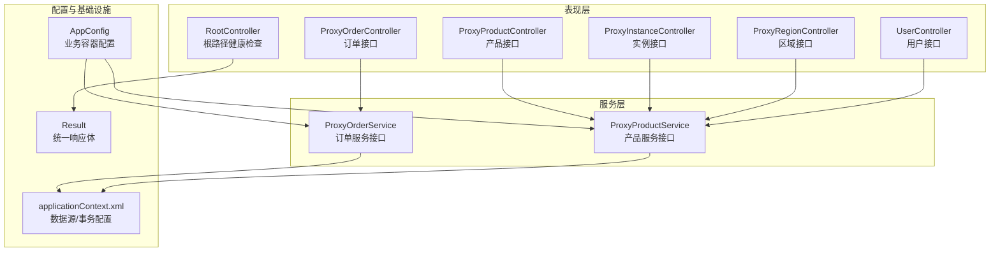
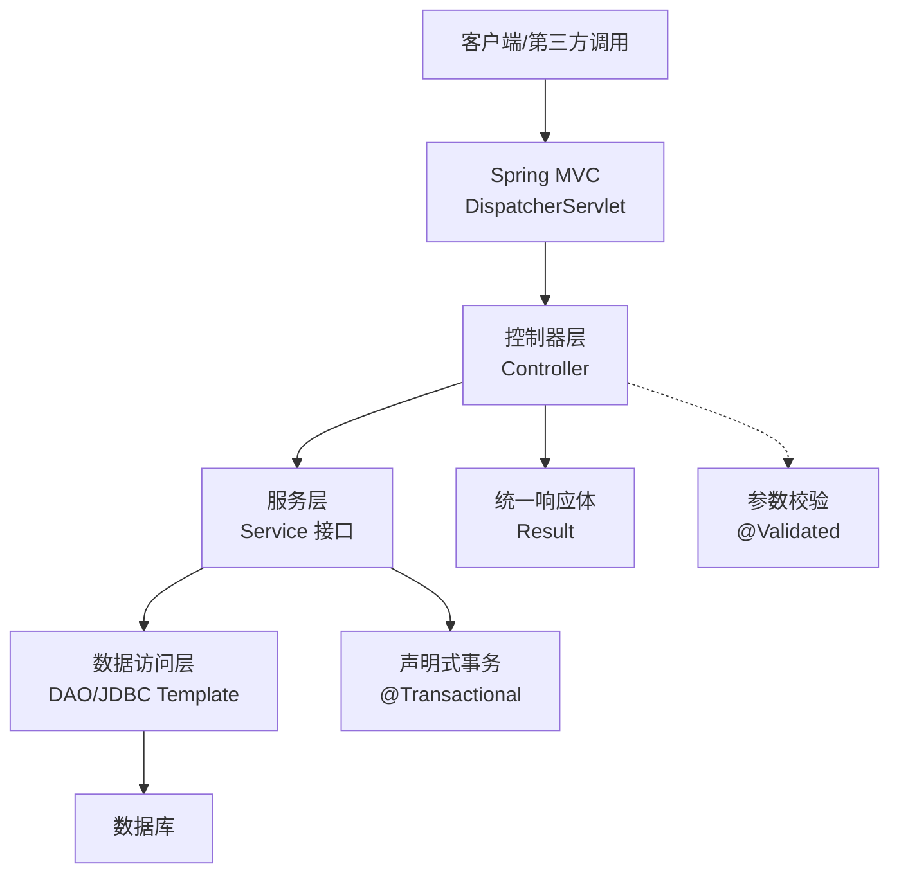
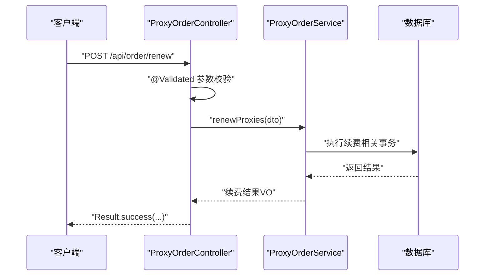
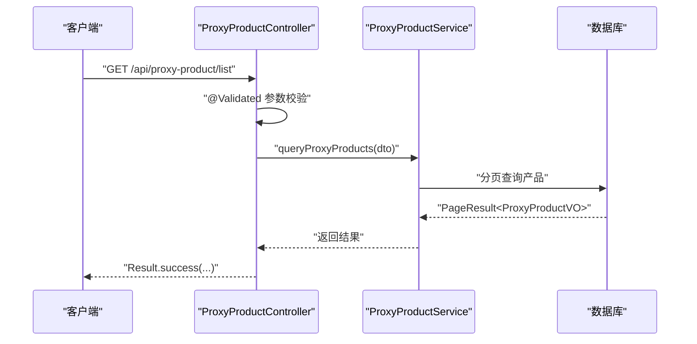
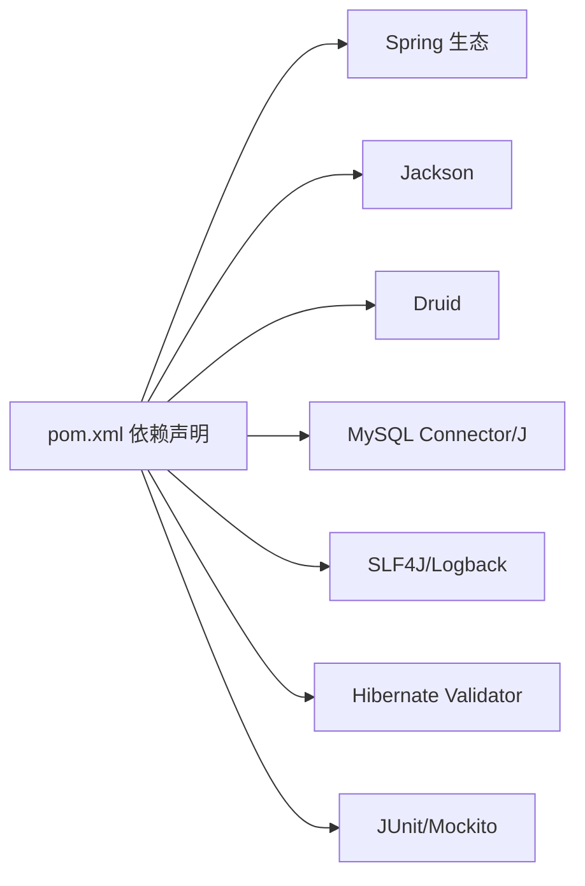

# 项目概述

<cite>
**本文引用的文件**
- [pom.xml](file://pom.xml)
- [README.md](file://README.md)
- [RootController.java](file://src/main/java/cn/linkfast/controller/RootController.java)
- [ProxyOrderController.java](file://src/main/java/cn/linkfast/controller/ProxyOrderController.java)
- [ProxyProductController.java](file://src/main/java/cn/linkfast/controller/ProxyProductController.java)
- [ProxyInstanceController.java](file://src/main/java/cn/linkfast/controller/ProxyInstanceController.java)
- [ProxyRegionController.java](file://src/main/java/cn/linkfast/controller/ProxyRegionController.java)
- [UserController.java](file://src/main/java/cn/linkfast/controller/UserController.java)
- [AppConfig.java](file://src/main/java/cn/linkfast/config/AppConfig.java)
- [Result.java](file://src/main/java/cn/linkfast/common/Result.java)
- [ProxyOrderService.java](file://src/main/java/cn/linkfast/service/ProxyOrderService.java)
- [ProxyProductService.java](file://src/main/java/cn/linkfast/service/ProxyProductService.java)
- [ProxyOrder.java](file://src/main/java/cn/linkfast/entity/ProxyOrder.java)
- [ProxyProduct.java](file://src/main/java/cn/linkfast/entity/ProxyProduct.java)
- [applicationContext.xml](file://src/main/resources/applicationContext.xml)
</cite>

## 目录
1. [引言](#引言)
2. [项目结构](#项目结构)
3. [核心组件](#核心组件)
4. [架构总览](#架构总览)
5. [详细组件分析](#详细组件分析)
6. [依赖分析](#依赖分析)
7. [性能考虑](#性能考虑)
8. [故障排查指南](#故障排查指南)
9. [结论](#结论)
10. [附录](#附录)

## 引言
Link-Fast 是一个基于 Spring 生态的企业级代理服务管理系统，面向“代理 IP 服务”的全生命周期管理，提供从产品、订单、实例、区域到用户的完整业务闭环。系统采用经典的 MVC 架构与 RESTful API 设计理念，通过清晰的分层与接口契约，支撑高并发、可扩展的代理服务运营。

本项目的核心目标包括：
- 提供标准化的代理产品目录与价格体系；
- 支持订单创建、续费、释放等全链路操作；
- 提供实例查询、备注维护等精细化运维能力；
- 提供区域树形数据与渠道商账户信息对接；
- 以统一响应体与异常处理机制保障接口稳定性与一致性。

## 项目结构
项目采用标准 Maven 多模块风格（尽管当前为单模块 WAR 工程），按职责划分为以下层次：
- 控制器层（controller）：暴露 RESTful 接口，负责请求接入与参数校验；
- 服务层（service）：封装业务流程，协调 DAO 与外部系统交互；
- 数据访问层（dao）：封装数据库读写，结合 Spring JDBC；
- 实体与 VO/DTO：定义数据模型与接口协议；
- 配置层（config）：Spring 容器、MVC、事务与工具对象配置；
- 资源层（resources）：数据源、事务、日志等运行时配置；
- 文档与示例：API 文档、数据库脚本、Nginx 配置等。

图表来源
- [RootController.java:1-20](file://src/main/java/cn/linkfast/controller/RootController.java#L1-L20)
- [ProxyOrderController.java:1-86](file://src/main/java/cn/linkfast/controller/ProxyOrderController.java#L1-L86)
- [ProxyProductController.java:1-34](file://src/main/java/cn/linkfast/controller/ProxyProductController.java#L1-L34)
- [ProxyInstanceController.java:1-52](file://src/main/java/cn/linkfast/controller/ProxyInstanceController.java#L1-L52)
- [ProxyRegionController.java:1-38](file://src/main/java/cn/linkfast/controller/ProxyRegionController.java#L1-L38)
- [UserController.java:1-85](file://src/main/java/cn/linkfast/controller/UserController.java#L1-L85)
- [AppConfig.java:1-36](file://src/main/java/cn/linkfast/config/AppConfig.java#L1-L36)
- [applicationContext.xml:1-67](file://src/main/resources/applicationContext.xml#L1-L67)
- [Result.java:1-59](file://src/main/java/cn/linkfast/common/Result.java#L1-L59)

章节来源
- [pom.xml:1-278](file://pom.xml#L1-L278)
- [README.md:1-1](file://README.md#L1-L1)

## 核心组件
- 统一响应体 Result<T>：规范所有接口的返回格式，包含状态码、消息与数据，并提供成功/失败判定方法，保证前后端交互一致性。
- 控制器层：围绕订单、产品、实例、区域、用户五大领域提供 RESTful 接口，均通过 @RestController 或 @Controller + @ResponseBody 组合，返回 Result<T>。
- 服务层接口：定义清晰的业务契约，如 ProxyOrderService、ProxyProductService，支持分页查询、购买、续费、释放等核心能力。
- 配置层：AppConfig 负责业务容器扫描与 ObjectMapper 注入；applicationContext.xml 负责数据源、JDBC Template 与事务管理器装配。
- 数据模型：ProxyOrder、ProxyProduct 等实体承载订单、产品等核心业务数据，配合 VO/DTO 解耦接口与存储模型。

章节来源
- [Result.java:1-59](file://src/main/java/cn/linkfast/common/Result.java#L1-L59)
- [ProxyOrderController.java:1-86](file://src/main/java/cn/linkfast/controller/ProxyOrderController.java#L1-L86)
- [ProxyProductController.java:1-34](file://src/main/java/cn/linkfast/controller/ProxyProductController.java#L1-L34)
- [ProxyInstanceController.java:1-52](file://src/main/java/cn/linkfast/controller/ProxyInstanceController.java#L1-L52)
- [ProxyRegionController.java:1-38](file://src/main/java/cn/linkfast/controller/ProxyRegionController.java#L1-L38)
- [UserController.java:1-85](file://src/main/java/cn/linkfast/controller/UserController.java#L1-L85)
- [ProxyOrderService.java:1-60](file://src/main/java/cn/linkfast/service/ProxyOrderService.java#L1-L60)
- [ProxyProductService.java:1-28](file://src/main/java/cn/linkfast/service/ProxyProductService.java#L1-L28)
- [AppConfig.java:1-36](file://src/main/java/cn/linkfast/config/AppConfig.java#L1-L36)
- [applicationContext.xml:1-67](file://src/main/resources/applicationContext.xml#L1-L67)
- [ProxyOrder.java:1-45](file://src/main/java/cn/linkfast/entity/ProxyOrder.java#L1-L45)
- [ProxyProduct.java:1-99](file://src/main/java/cn/linkfast/entity/ProxyProduct.java#L1-L99)

## 架构总览
系统遵循 MVC 架构与分层设计，RESTful API 作为对外统一入口，控制器负责参数绑定与校验，服务层编排业务，DAO 层与 JDBC Template 交互数据库，事务由 Spring 声明式管理。整体架构强调：
- 接口协议与数据模型解耦（DTO/VO）；
- 统一异常与响应处理；
- 易于扩展的业务服务接口；
- 可观测与可维护的配置与资源管理。

图表来源
- [ProxyOrderController.java:1-86](file://src/main/java/cn/linkfast/controller/ProxyOrderController.java#L1-L86)
- [ProxyProductController.java:1-34](file://src/main/java/cn/linkfast/controller/ProxyProductController.java#L1-L34)
- [ProxyInstanceController.java:1-52](file://src/main/java/cn/linkfast/controller/ProxyInstanceController.java#L1-L52)
- [ProxyRegionController.java:1-38](file://src/main/java/cn/linkfast/controller/ProxyRegionController.java#L1-L38)
- [UserController.java:1-85](file://src/main/java/cn/linkfast/controller/UserController.java#L1-L85)
- [ProxyOrderService.java:1-60](file://src/main/java/cn/linkfast/service/ProxyOrderService.java#L1-L60)
- [ProxyProductService.java:1-28](file://src/main/java/cn/linkfast/service/ProxyProductService.java#L1-L28)
- [applicationContext.xml:1-67](file://src/main/resources/applicationContext.xml#L1-L67)
- [Result.java:1-59](file://src/main/java/cn/linkfast/common/Result.java#L1-L59)

## 详细组件分析

### 订单管理（ProxyOrderController）
- 主要能力
  - 订单列表分页查询（queryOrders）
  - 代理开通（purchaseProxies）
  - 代理续费（renewProxies）
  - 代理释放（releaseProxies）
- 设计要点
  - 使用 @Validated 自动参数校验，减少重复校验代码；
  - 统一返回 Result.success(...)，异常通过全局或局部捕获转为 Result.error(...)；
  - 续费与释放接口对业务异常进行分类处理，保障接口健壮性。

图表来源
- [ProxyOrderController.java:50-65](file://src/main/java/cn/linkfast/controller/ProxyOrderController.java#L50-L65)
- [ProxyOrderService.java:41-60](file://src/main/java/cn/linkfast/service/ProxyOrderService.java#L41-L60)

章节来源
- [ProxyOrderController.java:1-86](file://src/main/java/cn/linkfast/controller/ProxyOrderController.java#L1-L86)
- [ProxyOrderService.java:1-60](file://src/main/java/cn/linkfast/service/ProxyOrderService.java#L1-L60)

### 产品管理（ProxyProductController）
- 主要能力
  - 代理产品分页查询（queryProxyProducts）
- 设计要点
  - 通过 ProxyProductQueryDTO 接收查询参数，自动映射 URL 查询参数；
  - 返回 PageResult<ProxyProductVO>，与存储模型解耦。

图表来源
- [ProxyProductController.java:24-33](file://src/main/java/cn/linkfast/controller/ProxyProductController.java#L24-L33)
- [ProxyProductService.java:24-28](file://src/main/java/cn/linkfast/service/ProxyProductService.java#L24-L28)

章节来源
- [ProxyProductController.java:1-34](file://src/main/java/cn/linkfast/controller/ProxyProductController.java#L1-L34)
- [ProxyProductService.java:1-28](file://src/main/java/cn/linkfast/service/ProxyProductService.java#L1-L28)

### 实例管理（ProxyInstanceController）
- 主要能力
  - 实例列表分页查询（queryProxyInstances）
  - 更新实例备注（updateRemark）
- 设计要点
  - 通过 ProxyInstanceQueryDTO 与 ProxyInstanceRemarkDTO 解耦接口参数；
  - 日志记录查询条件，便于问题定位。

章节来源
- [ProxyInstanceController.java:1-52](file://src/main/java/cn/linkfast/controller/ProxyInstanceController.java#L1-L52)

### 区域管理（ProxyRegionController）
- 主要能力
  - 地域树形列表查询（queryRegionTree）
- 设计要点
  - 支持按地域代码过滤，返回树形结构数据，便于前端渲染。

章节来源
- [ProxyRegionController.java:1-38](file://src/main/java/cn/linkfast/controller/ProxyRegionController.java#L1-L38)

### 用户管理（UserController）
- 主要能力
  - 获取所有用户、按 ID 获取用户、创建用户、更新用户、删除用户
- 设计要点
  - 使用 @Controller + @ResponseBody 组合，返回 Result<T>；
  - 对不存在资源返回 404 错误码。

章节来源
- [UserController.java:1-85](file://src/main/java/cn/linkfast/controller/UserController.java#L1-L85)

### 统一响应与根路径
- RootController 提供根路径健康检查，返回统一 Result 结构；
- Result<T> 提供 success/error 静态方法与 isSuccess 判定，简化前端处理。

章节来源
- [RootController.java:1-20](file://src/main/java/cn/linkfast/controller/RootController.java#L1-L20)
- [Result.java:1-59](file://src/main/java/cn/linkfast/common/Result.java#L1-L59)

## 依赖分析
- 技术栈
  - Spring Web/WebMVC/Transaction/JDBC/Test：提供 MVC、事务与测试能力；
  - Jackson：JSON 序列化与反序列化；
  - Apache HttpClient5：HTTP 客户端；
  - Druid：高性能数据库连接池；
  - MySQL Connector/J：MySQL 驱动；
  - Lombok：简化 POJO；
  - SLF4J/Logback：日志；
  - Hibernate Validator 8 + Jakarta EL：Bean 校验；
  - JUnit/Mockito/JsonPath/Hamcrest：测试生态。
- 项目打包与构建
  - 打包方式为 war，JDK 版本 17，Maven 插件用于编译、资源处理、War 打包与集成测试。

图表来源
- [pom.xml:22-213](file://pom.xml#L22-L213)

章节来源
- [pom.xml:1-278](file://pom.xml#L1-L278)

## 性能考虑
- 连接池与事务
  - Druid 连接池配置了合理的初始大小、最大活跃数、空闲回收与泄露检测策略，降低连接抖动与泄露风险；
  - Spring 声明式事务在服务层集中管理，避免重复开启/提交事务带来的开销。
- 序列化与网络
  - Jackson ObjectMapper 在根容器注册，避免多处重复创建，提升序列化性能；
  - RESTful 接口返回 Result<T>，减少额外包装成本。
- 缓存与异步
  - 当前未见显式缓存与异步任务配置，建议在高频查询与耗时操作上引入 Redis 缓存与消息队列异步化，进一步提升吞吐。

章节来源
- [applicationContext.xml:14-67](file://src/main/resources/applicationContext.xml#L14-L67)
- [AppConfig.java:25-36](file://src/main/java/cn/linkfast/config/AppConfig.java#L25-L36)

## 故障排查指南
- 统一异常与响应
  - Result<T> 提供 isSuccess 判定与错误封装，便于前端与监控系统识别；
  - 控制器层对业务异常与通用异常分别捕获，返回明确错误信息。
- 日志与可观测性
  - 控制器层广泛使用日志记录请求与关键参数，有助于快速定位问题；
  - 建议在服务层与 DAO 层补充关键链路日志与埋点，完善链路追踪。
- 数据源与事务
  - 若出现连接泄漏或超时，优先检查 Druid 连接池配置与 SQL 执行时间；
  - 事务边界应在服务层明确，避免跨层事务传播导致的性能与一致性问题。

章节来源
- [Result.java:46-59](file://src/main/java/cn/linkfast/common/Result.java#L46-L59)
- [ProxyOrderController.java:55-83](file://src/main/java/cn/linkfast/controller/ProxyOrderController.java#L55-L83)
- [applicationContext.xml:14-67](file://src/main/resources/applicationContext.xml#L14-L67)

## 结论
Link-Fast 以清晰的分层与接口契约，构建了面向代理 IP 服务的完整业务闭环。通过 Spring 生态与 RESTful 设计，系统具备良好的可扩展性与可维护性。建议后续在缓存、异步化与链路追踪方面持续优化，以满足更高并发与复杂业务场景的需求。

## 附录
- 项目根路径健康检查接口：GET /
- 订单相关接口：GET /api/order/list、POST /api/order/open、POST /api/order/renew、POST /api/order/release
- 产品相关接口：GET /api/proxy-product/list
- 实例相关接口：GET /api/instance/list、PUT /api/instance/remark
- 区域相关接口：GET /api/area/tree
- 用户相关接口：GET /api/users、GET /api/users/{id}、POST /api/users、PUT /api/users/{id}、DELETE /api/users/{id}

章节来源
- [RootController.java:15-18](file://src/main/java/cn/linkfast/controller/RootController.java#L15-L18)
- [ProxyOrderController.java:36-83](file://src/main/java/cn/linkfast/controller/ProxyOrderController.java#L36-L83)
- [ProxyProductController.java:29-33](file://src/main/java/cn/linkfast/controller/ProxyProductController.java#L29-L33)
- [ProxyInstanceController.java:31-48](file://src/main/java/cn/linkfast/controller/ProxyInstanceController.java#L31-L48)
- [ProxyRegionController.java:30-35](file://src/main/java/cn/linkfast/controller/ProxyRegionController.java#L30-L35)
- [UserController.java:26-84](file://src/main/java/cn/linkfast/controller/UserController.java#L26-L84)